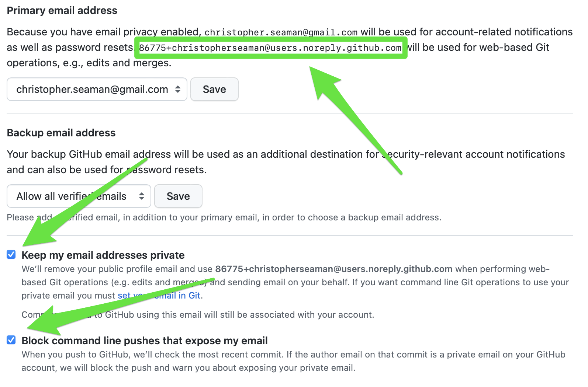
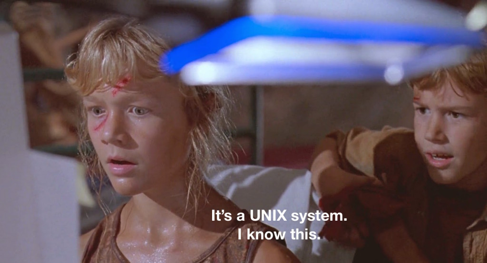

---
notion:
  role: lecture
  status: mapped
  page_id: "271d9fdd-1a1a-8057-84e1-fe68dc985696"
  url: "https://app.notion.com/p/271d9fdd1a1a805784e1fe68dc985696"
---

> San Francisco is a walkable city and I will literally die on this hill

[DLC](https://www.notion.so/DLC-271d9fdd1a1a80cd804fee12a35b4186?pvs=21) 

See [BONUS.md](BONUS.md) for the optional extensions.

## Class Structure

- **Lectures** cover new material
- **Assignments** after each lecture (caveats apply)
- **Lab** for hands-on help completing the practical assignment
- **Assignments** are always due the following week unless otherwise noted
- **Two exams** (or just one for 1-unit course)

# Getting Started: Your First Steps

This section covers the essential setup for data science.

## Getting to the Command Line


The shell examples in this lecture use POSIX commands in Bash (or a compatible shell). On Windows, WSL gives you that environment; native PowerShell uses different commands and syntax in several places.

**Windows Users:**
WSL:

- **Windows Subsystem for Linux (WSL)** (recommended): Run `wsl --install` in PowerShell as Administrator

Native Windows:

- **PowerShell** (built-in): Press `Win + X`, then select "Terminal" or "Windows PowerShell." You can run Git and Python there, but Bash-specific examples such as `touch`, brace expansion, and `find -exec` do not transfer unchanged.
- **GitHub Codespaces** (cloud option): No installation needed

**Mac Users:**

- **Terminal** (built-in): Press `Cmd + Space`, type "Terminal", press Enter
- **GitHub Codespaces** (cloud option): No installation needed

**Cloud Options:**

- **GitHub Codespaces**: Free tier available, works on any device with internet

## Installing Python

Install Python as follows:

**Windows WSL (Ubuntu):**

```bash
sudo apt update
sudo apt install python3 python3-pip python3-venv
```

**Windows Native:**

```powershell
# Option 1: Official installer from python.org
# Download Python 3.12+ from <https://python.org>

# Option 2: Using winget (Windows Package Manager)
winget install -e --id Python.Python.3.12
```

**Mac:**

```bash
# Option 1: Using Homebrew (recommended)
# First install Homebrew from <https://brew.sh>
brew install python3

# Option 2: Official installer from python.org
# Download Python 3.12+ from <https://python.org>
```

**Verify Installation:**

```bash
# WSL, macOS, or Codespaces
python3 --version
# Should show: Python 3.12.x (or similar)
```

In native Windows PowerShell, use `py --version` (or `python --version` if that is the command your installer configured). Until we activate a virtual environment later in the course, Bash examples use `python3`; native PowerShell users should substitute `py`. Inside an activated environment, `python` will refer to that environment's interpreter.

## Text Editor Options

You'll need a good text editor to write Python code. Here are your options:

**Visual Studio Code (Recommended):**

- Free, powerful, and perfect for data science
- Available on all platforms
- Built-in Python support
- Can open files from command line with `code filename.py`

**Other Options:**

- **Sublime Text**: Fast and lightweight
- **PyCharm**: Full-featured Python IDE
- **nano**: Simple command-line editor for quick fixes

## Why VS Code?


VS Code strikes the perfect balance between simplicity and power. It's what most professional data scientists use, and it's what we'll use in this course.

## Starting with GitHub

### Creating Your GitHub Account

**Reference:**

1. Go to [github.com](http://github.com/)
2. Sign up with your UCSF email (or personal email)
    - Use your actual UCSF email so I can find you, or not
    - You can always add/remove email addresses later
3. Choose a professional username (you'll use this for years!)
4. Verify your email address

**Username Tips:**

- Use your name or initials: `alice-smith`, `asmith-the-best-one-ever`
- Avoid hard-to-remember numbers: `alice_smith_9847`
- Keep it professional? - future employers will see this
- You can change it later, but links might break

GitHub Student Pack (Optional Bonus)
With your .edu email, you can get free premium features. We don't need them for class, but they're nice to have!

### Setting Up Git in VS Code

1. Install VS Code (if not already done)
2. Open VS Code → View → Source Control (or Ctrl+Shift+G)
3. If first time: VS Code will prompt to configure Git username/email

Git configuration (one-time setup):

- Full Name: Christopher Seaman
- Email: [86775+christopherseaman@users.noreply.github.com](mailto:86775+christopherseaman@users.noreply.github.com)

### DON'T USE YOUR REAL EMAIL IN GIT CONFIG

You don't want to put your email all over the public internet, so GitHub provides a proxy service. You can see the proxy email address in your [GitHub email settings https://github.com/settings/emails](https://github.com/settings/emails).



### Setting up Git in the Command Line

(Usually unnecessary if already done through VS Code.)

```bash
git config --global user.name "<YOUR NAME>"
git config --global user.email "<YOUR GITHUB PROXY EMAIL>"
```

# LIVE DEMO!

Setting up

# Why Both Python and Command Line?

Professional data scientists switch constantly between Python scripts and command-line operations: Python analyzes data; the command line organizes files, runs scripts, and manages projects.

It's like being bilingual in the data world. Python speaks to your data, command line speaks to your computer.

# Command Line Essentials

## What is the Command Line?

Instead of clicking icons, you type commands. This is fast, precise, and reproducible when everyone uses the same shell. This lecture's commands target Bash-compatible shells; PowerShell equivalents can differ.

Think of it as texting your computer instead of playing charades with icons.



## Navigation Commands

**Reference:**

- `pwd` - Print working directory (where am I?)
- `ls` - List contents (what's here?)
- `ls -la` - List with details (show me everything)
- `cd [path]` - Change directory (go somewhere)
- `cd ..` - Go up one level
- `cd ~` - Go to home directory

**Brief Example:**

```bash
pwd                    # Shows: /Users/yourname
ls                     # Shows files in current directory
cd Documents           # Move to Documents folder
pwd                    # Shows: /Users/yourname/Documents

```

# File and Directory Operations

**Reference:**

- `mkdir [name]` - Make directory
- `mkdir -p [path/to/nested]` - Make nested directories
- `touch [filename]` - Create empty file
- `cp [source] [destination]` - Copy file
- `mv [source] [destination]` - Move/rename file
- `rm [filename]` - Remove file (careful!)
- `rm -r [directory]` - Remove directory and contents (very careful!)

**Extended Examples for Data Science Workflows:**

```bash
# Create a typical data science project structure
mkdir data-science-project
cd data-science-project
mkdir data scripts results docs

# Create placeholder files for our project
touch data/raw_data.csv
touch scripts/analysis.py
touch docs/project_notes.md

# View our project structure
ls -la
# You'll see: data/ scripts/ results/ docs/ and our files

# Copy important files to backup location
cp data/raw_data.csv data/raw_data_backup.csv

# Rename a file to be more descriptive
mv scripts/analysis.py scripts/customer_analysis.py

```

**Common File Operation Patterns:**

```bash
# Pattern 1: Organizing downloaded data files
mkdir -p project/data/{raw,processed,cleaned}
mv ~/Downloads/*.csv project/data/raw/

# Pattern 2: Creating dated backup directories
mkdir backups/$(date +%Y-%m-%d)
cp -r project/ backups/$(date +%Y-%m-%d)/

# Pattern 3: Finding and organizing files by type
mkdir analysis/{python,jupyter,results}
find . -name "*.py" -exec cp {} analysis/python/ \;

```

**Brief Example:**

```bash
mkdir my_data_project     # Create project folder
cd my_data_project       # Enter the folder
touch analysis.py        # Create Python file
mkdir data              # Create data subfolder

```

# Viewing Files

**Reference:**

- `cat [filename]` - Show entire file contents
- `head [filename]` - Show first 10 lines
- `head -n 5 [filename]` - Show first 5 lines
- `tail [filename]` - Show last 10 lines
- `tail -n 20 [filename]` - Show last 20 lines

**Brief Example:**

```bash
head data.csv           # Quick peek at data file
tail -n 5 results.txt   # See the last few results

```

# Getting Help

**Reference:**

- `man [command]` - Manual page for command
- `[command] --help` - Quick help for command
- `which [command]` - Find where command is located
- Books! (see the syllabus)
- Your favorite LLM
- A buddy?
- Course EA's and myself

## Make it Stop!

Sometimes you need to stop what you're doing:

**Command Line:**

- `Control-c` - Cancel the current command
- `exit` - Close the terminal

**Python:**

- `Control-c` - Cancel the current operation
- `exit()` - Quit interactive Python

# LIVE DEMO!

*Command line tools*

# Python Basics


## Running Python

For Lectures 01–03, you will use two Python modes:

1. **Interactive mode** (REPL): Type `python3` and start experimenting
2. **Script mode**: Write code in a file, run with `python3 filename.py`

**Jupyter notebooks** are another way to run Python, but we'll meet them later. They are future material, so use the REPL and script workflow for these first lectures.

**Reference:**

```bash
python3                 # Start interactive Python
python3 script.py       # Run a Python script
```

These are Bash commands. In native Windows PowerShell, substitute `py` for `python3`. At the Python `>>>` prompt, enter `exit()` to leave the REPL.

**Interactive Mode Example:**

```console
$ python3
>>> print("Hello, World!")
Hello, World!
>>> exit()
```

**Script Mode Example:**

```bash
python3 my_script.py
```

## Python Syntax Overview

Python has some unique syntax rules that are essential to understand:

**Indentation Matters!**
Python uses indentation to group code together. Use four spaces per indentation level rather than mixing spaces and tabs:

This is a preview of an `if` conditional; the Control Structures section below explains how the condition works.

```python
# Correct indentation
x = 1
if x > 0:
    print("Positive")    # This line is indented
    print("Still positive")  # This line is also indented
```

```text
# Wrong indentation (will cause an error)
if x > 0:
print("This will cause an IndentationError")
```

**Comments Use `#`**

```python
# This is a comment - Python ignores this line
print("This is code")  # Comments can also go at the end of lines
```

**Key Syntax Rules:**

- Use 4 spaces for indentation (not tabs)
- No semicolons needed at the end of lines (but you can have them if you REALLY want them)
- Case-sensitive: `Name` and `name` are different variables
- Use quotes for strings: `"Hello"` or `'Hello'`

## Variables and Data Types

Python stores information in variables - think of them as labeled boxes that you can put different types of information in.

# Numbers - The Foundation of Data Science

```python
# Integers (whole numbers)
student_count = 150
year = 2024
temperature_celsius = -5

# Floats (decimal numbers)
average_grade = 87.3
height_meters = 1.75
pi_approximation = 3.14159

# Scientific notation for very large/small numbers
population = 1.4e9          # 1.4 billion
atom_mass = 1.67e-27        # Very small number
```

# Text - Essential for Data Labels and Categories

```python
# Strings for text data
student_name = "Alice Johnson"
department = "Data Science"
file_path = "/Users/alice/projects/analysis.py"

# String methods you'll use constantly
name_upper = student_name.upper()        # "ALICE JOHNSON"
name_lower = student_name.lower()        # "alice johnson"
name_title = student_name.title()        # "Alice Johnson"
clean_name = "  Bob Smith  ".strip()     # Removes whitespace: "Bob Smith"
```

# Boolean - Essential for Data Filtering

```python
# True/False values for logical operations
has_complete_data = True
missing_values = False
analysis_ready = True and has_complete_data    # True
needs_cleaning = missing_values or not analysis_ready  # False
```

**Variable Naming Best Practices:**

```python
# Good variable names (descriptive and clear)
student_age = 22
average_test_score = 85.7
data_file_path = "student_grades.csv"

# Avoid these (unclear or confusing)
a = 22                  # What does 'a' represent?
x1 = 85.7              # Meaningless variable name
temp = "grades.csv"     # 'temp' usually means temporary
```

**Understanding Variable Types (Debugging Foundation):**

```python
# Check what type a variable is (essential for debugging!)
student_name = "Alice"
student_age = 22
grade_average = 87.5

print(type(student_name))    # <class 'str'>
print(type(student_age))     # <class 'int'>
print(type(grade_average))   # <class 'float'>

# This is crucial when data doesn't behave as expected!
mysterious_data = "22"       # Looks like a number, but it's text
print(type(mysterious_data)) # <class 'str'> - Aha! That's the problem
```

## Basic Operations

An **f-string** begins with `f` and evaluates expressions inside `{}`. The Printing section below develops its formatting options.

**Reference:**

```python
# Math operations
result = 10 + 5         # Addition: 15
result = 10 - 3         # Subtraction: 7
result = 4 * 6          # Multiplication: 24
result = 15 / 4         # Division: 3.75
result = 15 // 4        # Integer division: 3
result = 15 % 4         # Remainder: 3
result = 2 ** 3         # Power: 8

# String operations
first = "Ada"
last = "Lovelace"
name = first
full_name = first + " " + last        # Concatenation
message = f"Hello {name}!"            # f-string formatting (preferred)
```

**Brief Example:**

```python
# Calculate BMI
weight_kg = 70
height_m = 1.75
bmi = weight_kg / (height_m ** 2)
print(f"BMI is {bmi:.1f}")
```


## Control Structures

Control structures let your programs make decisions and repeat actions - essential for data analysis!

### Comparison Operators

**Reference:**

```python
# Equality and inequality
x = 2
y = 3
x == y          # Equal to
x != y          # Not equal to
x < y           # Less than
x > y           # Greater than
x <= y          # Less than or equal
x >= y          # Greater than or equal

# Membership testing
x in [1, 2, 3]  # Is x in the list?
x not in [1, 2, 3]  # Is x NOT in the list?
```

Square brackets create a **list**, an ordered collection. The loop examples below introduce the list operations needed today; Lecture 02 develops indexing and slicing.

### If Statements

**Basic If Statements:**

```python
# Simple decision making
score = 85

if score >= 90:
    print("Grade: A")
elif score >= 80:
    print("Grade: B")
elif score >= 70:
    print("Grade: C")
else:
    print("Grade: F")
```

**Compound Conditions:**

```python
# Multiple conditions with and/or
age = 25
has_license = True

if age >= 18 and has_license:
    print("Can drive")
elif age >= 16 and not has_license:
    print("Can learn to drive")
else:
    print("Cannot drive")
```

### For Loops

`range(5)` supplies the integers from 0 through 4. A list supplies its items in order; Lecture 02 covers lists in more depth.

**Basic For Loops:**

```python
# Count from 0 to 4
for i in range(5):
    print(f"Count: {i}")

# Loop through a list
grades = [85, 92, 78, 96, 88]
for grade in grades:
    print(f"Grade: {grade}")
```

**Practical Data Science Example:**

```python
# Calculate average grade
grades = [85, 92, 78, 96, 88]
total = 0
count = 0

for grade in grades:
    total += grade
    count += 1

average = total / count
print(f"Average grade: {average:.1f}")
```

### While Loops and Loop Control

A `while` loop repeats as long as its condition is `True`. Update the loop
variable inside the loop so it can eventually finish:

```python
count = 1
while count <= 3:
    print(f"Count: {count}")
    count += 1
```

When a loop needs both a position and a value, `enumerate()` supplies them:

```python
grades = [85, 92, 78]
for position, grade in enumerate(grades, start=1):
    print(f"Assignment {position}: {grade}")
```

Use `break` to stop a loop early, and `continue` to skip the rest of the
current iteration and move to the next item:

```python
for grade in grades:
    if grade < 80:
        continue
    print(f"Processing {grade}")
    if grade >= 90:
        break
```

## Printing and Basic Input

**Essential Output Formatting for Data Science:**

```python
# Basic printing - your daily communication tool
print("Hello world")                    # Basic printing
print("Value:", 42)                     # Multiple values
print("Processing complete!")           # Status updates

# F-string formatting - the data scientist's best friend
student_name = "Alice"
test_score = 87.3
class_average = 82.1

print(f"Student: {student_name}")                    # Basic variable insertion
print(f"Score: {test_score}")                        # Number display
print(f"Score: {test_score:.1f}")                    # One decimal place: 87.3
print(f"Score: {test_score:.0f}%")                   # No decimals: 87%
print(f"Above average by {test_score - class_average:.1f} points")  # Calculations inside f-strings
```

**Formatting Patterns for Data Analysis:**

```python
# Currency formatting (useful for business data)
revenue = 15432.50
print(f"Revenue: ${revenue:,.2f}")                   # $15,432.50

# Percentage formatting
success_rate = 0.847
print(f"Success rate: {success_rate:.1%}")           # 84.7%

# Scientific notation for very large/small numbers
population = 1400000000
print(f"Population: {population:.2e}")               # 1.40e+09

# Padding and alignment for clean output tables
print(f"{'Name':<15} {'Score':>8} {'Grade':>8}")    # Column headers
print(f"{'Alice':<15} {87.3:>8.1f} {'B+':>8}")      # Left/right aligned data
print(f"{'Bob':<15} {92.1:>8.1f} {'A-':>8}")
```

**Basic Input (Rare in Data Science, but Good to Know):**

```python
# Interactive input - mainly for testing and debugging
name = input("Enter your name: ")                    # Gets text from user
age_str = input("Enter your age: ")                  # Always returns string!
age = int(age_str)                                   # Convert to number
print(f"Hello {name}, you are {age} years old")

# Be careful: input() always returns strings
user_number = input("Enter a number: ")              # This is text: "42"
print(type(user_number))                             # <class 'str'>
actual_number = float(user_number)                   # Convert to number: 42.0
print(type(actual_number))                           # <class 'float'>

```

**Why F-Strings Matter in Data Science:**
F-strings let you create clear, readable output that tells the story of your data. Instead of printing raw numbers, you can provide context, explanations, and professional formatting that makes your analysis understandable to anyone.

# Debugging and Error Handling Basics


**Reading Python Error Messages (Essential Skill!):**

When Python encounters a problem, it tells you exactly what went wrong. Learning to read these messages will save you hours of frustration.

```python
# Common error: trying to use an undefined variable
print(student_naem)  # Typo in variable name
```

```
NameError: name 'student_naem' is not defined
```

**How to Read This Error:**

1. **Error Type**: `NameError` - Python doesn't recognize the variable name
2. **Error Message**: tells you exactly what's wrong
3. **Your Action**: Check spelling, make sure you defined the variable first

**More Common Errors You'll Encounter:**

```python
# Type errors - mixing incompatible data types
age = "25"                    # This is text, not a number
next_year = age + 1          # Can't add number to text

```

```
TypeError: can only concatenate str (not "int") to str

```

**How to Fix It:**

```python
age = "25"                    # Text
age_number = int(age)         # Convert to number
next_year = age_number + 1    # Now this works!
print(f"Next year you'll be {next_year}")

```

**Value Errors - Wrong Type of Value:**

```python
bad_number = int("hello")     # Can't convert "hello" to a number

```

```
ValueError: invalid literal for int() with base 10: 'hello'

```

**Debugging Strategy for Beginners:**

1. **Read the error message carefully** - Python is usually very specific
2. **Check variable names for typos** - most common beginner mistake
3. **Use `print()` to check variable values and types**
4. **Check your data types** with `type(variable_name)`

**Defensive Programming Example:**

```python
# Always check what type your data is when debugging
user_input = "42"
print(f"Input: {user_input}")
print(f"Type: {type(user_input)}")       # Shows: <class 'str'>

# Convert and verify
number = int(user_input)
print(f"Converted: {number}")
print(f"New type: {type(number)}")       # Shows: <class 'int'>

# Now you can safely do math
result = number * 2
print(f"Result: {result}")

```

**Error Prevention Tips:**

- **Use descriptive variable names** - reduces typos
- **Check types when debugging** - use `type()` function
- **Test with small examples first** - don't write 50 lines then run
- **One step at a time** - add complexity gradually

# LIVE DEMO!

Python basics and debugging

# Simple Workflow Example

**Basic Data Calculation Workflow:**

```bash
# Command line: Set up workspace
mkdir data_analysis
cd data_analysis
touch calculate_stats.py
```

```python
# Python: calculate_stats.py
# Simple statistical analysis
sales_data = [1200, 1500, 1800, 1100, 1650, 1750]
total_sales = sum(sales_data)
average_sales = total_sales / len(sales_data)
best_day = max(sales_data)

print(f"Weekly Sales Analysis")
print(f"Total sales: ${total_sales:,}")
print(f"Average daily sales: ${average_sales:.2f}")
print(f"Best day: ${best_day}")

```

```bash
# Command line: Run the analysis
python3 calculate_stats.py

```

**Output:**

```
Weekly Sales Analysis
Total sales: $9,000
Average daily sales: $1,500.00
Best day: $1750

```

**Key Workflow Principles:**

1. **Start small** - test logic with simple data first
2. **Build incrementally** - add complexity step by step
3. **Test frequently** - run your code after every few changes
4. **Save your work** - use meaningful file names and organize results
5. **Document as you go** - use print statements to explain what's happening

# Key Takeaways

Use the command line to navigate, create, and inspect files; use Python values,
control flow, and formatted output to analyze them. Work incrementally: run
scripts, read errors, inspect types, and save clear results. Next week, Git and
GitHub make that work shareable.

**Professional Reality Check:**
Real data scientists spend 80% of their time doing exactly these things: organizing files, reading data, cleaning it up, and generating clear reports. The fancy algorithms are just 20% of the work!
