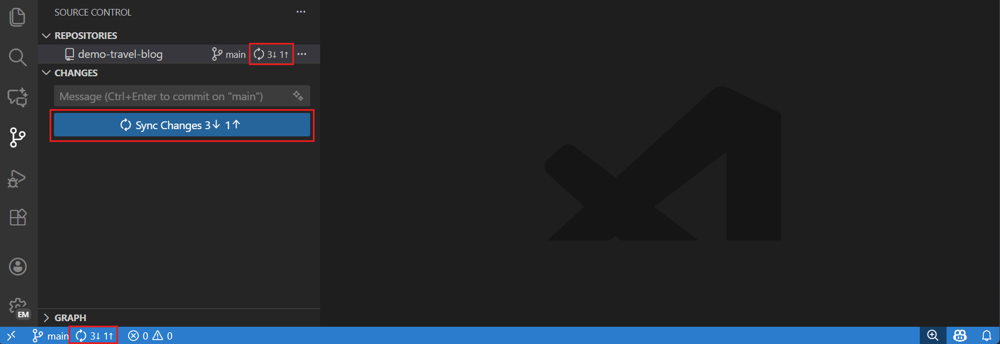
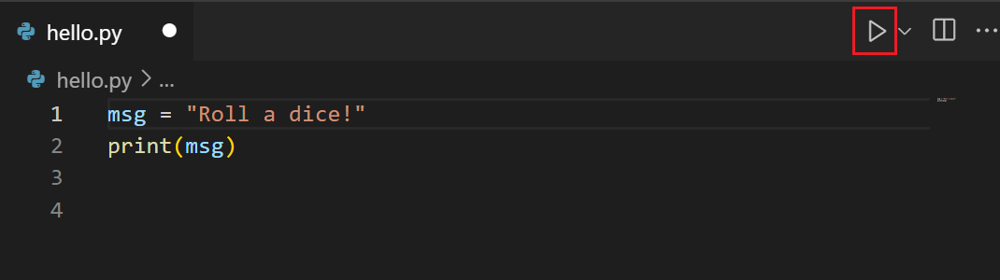
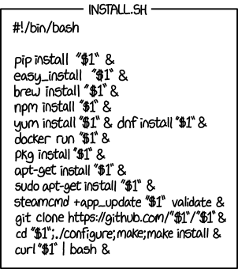

---
notion:
  title_line: "# Python, the Command Line, and VS Code"
  role: lecture
  status: mapped
  page_id: "271d9fdd-1a1a-8057-84e1-fe68dc985696"
  url: "https://app.notion.com/p/271d9fdd1a1a805784e1fe68dc985696"
---

# Python, the Command Line, and VS Code

See [BONUS.md](BONUS.md) for the optional extensions.

[Live Demo Guide](demo/DEMO_GUIDE.md)

**Quick references**

[WSL Troubleshooting](../wsl_troubleshooting.md)

- [Command-line (Bash) cheat sheet](https://cheatsheets.zip/bash)
- [Python cheat sheet](https://cheatsheets.zip/python)
- [futurecoder](https://futurecoder.io/) — Python basics with in-browser exercises and feedback
- [Official Python tutorial](https://docs.python.org/3/tutorial/) — tutorials straight from the source

<callout icon="🌉" color="green_bg">
	#### *San Francisco is a walkable city and I will literally die on this hill*
</callout>

# Class Structure

This course started as a Python introduction plus as much of the practical stuff I learned on the job but never in a course as I could fit. Halfway through preparing the first version, I found [The Missing Semester](https://missing.csail.mit.edu/). Apparently, I wasn't the only one who noticed the gap.

- **Lectures** cover new material
- **Assignments** after each lecture (caveats apply)
- **Lab** for hands-on help completing the practical assignment
- **Assignments (60%)** are always due the following week unless otherwise noted
- **Two exams (40%)** or just one for 1-unit course at weeks 5 and 11

# Getting Started: Your First Steps

## What is the Command Line?

The **command line (CLI)** is a text-based interface.

Think of it as texting your computer instead of playing charades with icons.

- **Terminal:** The app displaying the session—Windows Terminal, macOS Terminal, or VS Code's terminal. My preference is using GhosTTY on MacOS and Linux, and I’ve made my own customized terminal app for iOS/iPadOS
- **Shell:** The command interpreter running inside it—Bash, Zsh, or PowerShell.

## Getting to the Command Line


Install [VS Code](https://code.visualstudio.com/) and use its **Terminal → New Terminal** (**Ctrl+Shift+backtick**, also Control on Mac) for course commands. Open your project folder first; the terminal starts there. The examples use Bash or Zsh, shells with compatible POSIX command syntax.

### Windows: connect VS Code to WSL

1. For initial setup only, open **PowerShell as Administrator**, run `wsl --install`, restart if prompted, and finish Ubuntu's username/password setup.
2. In VS Code, open **View → Extensions** (**Ctrl+Shift+X**) and install **WSL** by Microsoft.
3. Open **View → Command Palette** (**Ctrl+Shift+P**) → **WSL: Connect to WSL**. Check that the lower-left corner shows **WSL: Ubuntu**.
4. In that window, install Microsoft's **Python** extension in WSL when prompted. Use **Terminal → New Terminal** for the installation commands below and clone/open your project in this WSL-connected window.

WSL supplies Linux underneath; you work in VS Code, not a separate Ubuntu terminal. [VS Code's WSL setup](https://code.visualstudio.com/docs/remote/wsl).

### Mac

VS Code's integrated terminal normally uses Zsh. macOS **Terminal** (**Cmd+Space**, type `Terminal`) is a fallback; use `cd` (moves the terminal into a folder; see Command Line Essentials below for the full treatment) to enter your project folder there.

### Alternative: Codespaces instead of a local VS Code installation

[GitHub Codespaces](https://docs.github.com/en/codespaces/developing-in-a-codespace/creating-a-codespace-for-a-repository) runs VS Code and a Linux terminal in your browser.

1. Create your GitHub account and fork the assignment repository using **Creating Your GitHub Account** and **Fork on GitHub** below.
2. On **your fork**, select **Code → Codespaces → Create codespace on main**. Your repository opens automatically; skip local cloning.
3. Open **Terminal → New Terminal** and run the shared uv/Python installation below. Check `python3 --version` for **3.13.x**, then choose **Python: Select Interpreter** from the Command Palette.
4. Edit, run, commit, and sync in the browser just as in desktop VS Code. Stop the codespace when finished; usage allowances are limited.

Skip local VS Code, WSL, and Homebrew installation for this route.

## Installing Python

### macOS, Windows WSL, and Codespaces

Use [uv](https://docs.astral.sh/uv/guides/install-python/) to install Python **3.13** in any of these environments. Run these commands in **VS Code's integrated terminal**. On Windows, use the **WSL-connected window**, not PowerShell. We'll cover uv environments and packages in Lecture 03.

```bash
curl -LsSf https://astral.sh/uv/install.sh | sh
source "$HOME/.local/bin/env"
uv python install 3.13 --default
uv python update-shell
```

Open a new terminal, then check:

```bash
python3 --version
# Should show: Python 3.13.x
```

[Homebrew](https://brew.sh/) is recommended for other macOS command-line tools; use uv, not Homebrew, for the course Python installation.

### Native Windows PowerShell alternative

For Python outside WSL, install uv in PowerShell:

```powershell
powershell -ExecutionPolicy ByPass -c "irm https://astral.sh/uv/install.ps1 | iex"
```

Open a new PowerShell terminal, then run:

```powershell
uv python install 3.13 --default
uv python update-shell
```

Reopen the terminal and check `python --version`. Use `python` in place of `python3` in this environment. The course shell demos still require WSL.

## Text Editor Options

### Visual Studio Code (Recommended)

- Free, powerful, and perfect for data science
- Available on all platforms
- Python support through Microsoft's Python extension
- Can open files from command line with `code filename.py`

### Other Editors

- **Sublime Text**: Fast and lightweight
- **PyCharm**: Full-featured Python IDE
- **nano**: Simple command-line editor for quick fixes
- **Vim / Neovim**: Modal terminal editors; use `vim filename.py` or `nvim filename.py`. Press `i` to insert text, then `Esc` and `:wq` to save and quit.

### Why VS Code?


We'll use VS Code for its editor, integrated terminal, debugger, and Git interface.

### VS Code Basics

Open the assignment folder with **File → Open Folder** so the editor, terminal, and Source Control all use the same project.


- Open or create a file: **Explorer** at left; click a filename or the **New File** icon. Keep `.py` on Python filenames.
- Edit and save: Type in the editor; **File → Save** or **Ctrl+S** (**Cmd+S** on Mac). Save before running.
- Enable Python support: **Extensions** at left; install **Python** by Microsoft.
- Choose Python: Command Palette → **Python: Select Interpreter**; select the installed Python 3.13.
- Run a command: **Terminal → New Terminal**, or **Ctrl+Shift+backtick** (also Control on Mac); type the command at the prompt and press Enter.
- Find an editor action: **View → Command Palette**, or **Ctrl+Shift+P** (**Cmd+Shift+P** on Mac); type its name, such as `Git: Clone`.
- Review changed files: **View → Source Control**, or **Ctrl+Shift+G** (also Control on Mac); click a file to see its changes.

The editor changes files; the terminal runs commands. Saving a file does not run it or upload it to GitHub. Screenshot: [VS Code interface](https://code.visualstudio.com/docs/editing/getting-started/userinterface). **Help → Keyboard Shortcuts Reference** lists your platform's [default shortcuts](https://code.visualstudio.com/docs/reference/default-keybindings).

## Starting with GitHub

### Creating Your GitHub Account

#### Account Setup

1. Go to [github.com](http://github.com/)
2. Sign up with your UCSF email (or personal email)
    - Use your actual UCSF email so I can find you, or not
    - You can always add/remove email addresses later
3. Choose a professional username (you'll use this for years!)
4. Verify your email address

#### Username Tips

- Use your name or initials: `alice-smith`, `asmith-the-best-one-ever`
- Avoid hard-to-remember numbers: `alice_smith_9847`
- Keep it professional? - future employers will see this
- You can change it later, but links might break

GitHub Student Pack (Optional Bonus) With your .edu email, you can get free premium features. We don't need them for class, but they're nice to have!

### DON'T USE YOUR REAL EMAIL IN GIT CONFIG

You don't want to put your email all over the public internet, so GitHub provides a proxy service. You can see the proxy email address in your [GitHub email settings https://github.com/settings/emails](https://github.com/settings/emails).


### Setting Up Git in VS Code

Install [Git](https://git-scm.com/downloads) if VS Code reports it missing, then restart VS Code.

Sign in to GitHub through VS Code when **Clone from GitHub** or **Sync Changes** prompts you: choose **Sign in with GitHub**, authorize in your browser, then return to VS Code.

If a commit reports a missing name or email, open **Terminal → New Terminal** in your cloned folder and run these once, using your GitHub `noreply` email:

```bash
git config user.name "Your Name"
git config user.email "YOUR GITHUB NOREPLY EMAIL"
```

GitHub login authorizes access to your repositories; these settings identify the author of your commits.

## Getting the First Assignment

Lecture 02 explains Git concepts but here’s what you’ll need to complete the first assignment

A **fork** is your copy on GitHub; a **clone** is the working copy on your computer. Follow these steps to start Assignment 01.

### Fork on GitHub

1. Open the assignment repository linked for this term, sign in, and select **Fork**.


2. Choose **your account** as Owner, keep the repository name and **Copy the main branch only** checked, then select **Create fork**.


### Clone Your Fork in VS Code

1. On **your fork**, select **Code → HTTPS** and copy the URL. The owner in the URL should be your GitHub username.


2. In VS Code, open **View → Command Palette** (Ctrl+Shift+P; Cmd+Shift+P on Mac), choose **Git: Clone**, paste that URL, choose a folder, and open the cloned repository. On Windows, use the **WSL: Ubuntu** window and choose a folder in your Linux home directory. Sign in if prompted.


The screenshots use example repositories; paste your own fork's URL. Keep your assignment work in this folder.

## Submit Your Assignment Files

A **commit** saves a version of your files. **Staging** a file (the **+** button in Source Control) chooses which changes go into the next commit. **Push** sends local commits to GitHub; VS Code's **Sync Changes** pushes your commits and pulls any new ones from GitHub in one click. To submit the first assignment, use **VS Code to commit and push**, or **the GitHub website to upload and commit directly**, as shown below.

### VS Code: Commit and Sync

1. Save your files. Open **Source Control** and click each changed file to review it. Stage the completed scripts and checkpoint artifacts with **+**; for Assignment 01, include both files in `terminal-practice/` and both in `output/`.


2. Enter a message such as `Complete Assignment 01`, then select **Commit**.


3. Select **Sync Changes** to send your commit to your fork. Sign in to GitHub if prompted.



### GitHub Website: Upload Files

1. Open **your fork** on GitHub, on `main`. Select **Add file → Upload files**.


2. Drag in the completed scripts and the `terminal-practice` and `output` folders. Keep the folders intact so paths such as `output/readiness.txt` stay correct. Upload the assignment files, not the whole project folder.
3. Enter `Complete Assignment 01` or another description, choose **Commit directly to the main branch**, and click **Commit changes**. Web upload commits directly on GitHub; no separate push is needed.

### Verify on GitHub

Open your fork's `output/readiness.txt` and `output/student_identity.txt` and check their contents. Open **Actions** to see the automatic checks; enable workflows once if prompted in a new fork. Your fork is the submission—no pull request to the course repository.

<synced_block url="https://app.notion.com/p/271d9fdd1a1a805784e1fe68dc985696#3dcd9fdd1a1a806b8fb4fffbf0fdabab">

# LIVE DEMO!

</synced_block>

# Command Line Essentials


Professional data scientists switch constantly between Python scripts and the command line: Python analyzes data; the command line organizes files, runs scripts, and manages projects. It's like being bilingual in the data world. Python speaks to your data, command line speaks to your computer.

Picture a clinic study that arrives as a folder of CSV exports. From the shell you can make a project folder, copy the raw files somewhere safe, peek at the first rows, and run your analysis script—the same few commands every time, with nothing to click and nothing to forget.

**Reality check:** Organizing files, inspecting data, and explaining results are part of the analysis—not chores you finish before the “real” work starts.

## How the Shell Reads a Command

The shell shows a **prompt**, such as `alice@laptop:~/datasci217$`, and waits. Type a command and press Enter; the shell runs it, prints any output, and shows a new prompt. It splits your line at spaces: the first word is the program to run, words starting with `-` are **options** that change how it behaves, and the rest are **arguments**, usually the files or folders to act on.

```text
ls  -l  data
│   │   └── argument: which folder to list
│   └────── option: long, detailed format
└────────── command: list directory contents
```

Quote an argument that contains spaces: `cd "My Documents"`.

## Where You Are: Paths and the Working Directory

A folder is called a **directory** at the shell, and the shell is always "in" one of them: its **working directory**, the *You are here* dot on a map. `pwd` prints it, `cd` changes it, and commands look for files there unless you say otherwise.

A **path** names a file or folder. An **absolute path** starts at the top of the file system, `/`, like a full street address; it works from anywhere. A **relative path** starts from your working directory, like directions from where you are standing.

```text
/home/alice/                ← ~ (your home directory)
└── datasci217/             ← working directory: pwd prints /home/alice/datasci217
    ├── data/
    │   └── visits.csv      ← relative path from here: data/visits.csv
    └── scripts/
        └── clean.py
```

- `.` = current directory
- `..` = parent directory, one level up
- `~` = home directory (`/home/alice` on Linux and WSL; `/Users/alice` on macOS)

From `datasci217`, `data/visits.csv` and `/home/alice/datasci217/data/visits.csv` name the same file. After `cd scripts`, the relative path becomes `../data/visits.csv`.

## Navigation Commands

### Reference Card: Navigation Commands

- `pwd`: Print working directory (where am I?)
- `ls`: List contents (what's here?)
- `ls -la`: List with details (show me everything)
- `cd [path]`: Change directory (go somewhere)
- `cd ..`: Go up one level
- `cd ~`: Go to home directory

### Code Snippet: Navigation Commands

```bash
cd ~        # go to your home directory
pwd
cd ..       # up one level
pwd
cd ~        # back home
pwd
```

```text
/home/alice
/home
/home/alice
```

Your username replaces `alice`; macOS prints `/Users/alice` and `/Users`.

## File and Directory Operations

### Reference Card: File and Directory Operations

- `mkdir [name]`: Make directory
- `mkdir -p [path/to/nested]`: Make nested directories
- `touch [filename]`: Create empty file
- `cp [source] [destination]`: Copy file
- `mv [source] [destination]`: Move/rename file
- `rm [filename]`: Remove file (careful!)
- `rm -r [directory]`: Remove directory and contents (very careful!)

### Code Snippet: File and Directory Operations

```bash
mkdir clinic_project
cd clinic_project
mkdir data results
touch data/visits.csv                        # empty placeholder file
cp data/visits.csv data/backup.csv           # copy
mv data/backup.csv results/visits_copy.csv   # move and rename
touch results/draft.txt
rm results/draft.txt                         # delete; there is no trash can
ls data results
```

```text
data:
visits.csv

results:
visits_copy.csv
```

## Writing and Viewing Text Files

`echo` prints text; `>` and `>>` **redirect** that output into a file instead of the screen. `cat`, `head`, and `tail` show what a file holds. `head` is the quick way to check a large data file's column names without opening it.

### Reference Card: Writing and Viewing Files

- `echo "text"`: Print a line of text.
- `echo "text" > FILE`: Write the line to `FILE`, replacing its contents.
- `echo "text" >> FILE`: Append the line to the end of `FILE`.
- `cat FILE`: Show the entire file.
- `head FILE` / `head -n 5 FILE`: Show the first 10 / first 5 lines.
- `tail FILE` / `tail -n 20 FILE`: Show the last 10 / last 20 lines.

### Code Snippet: Build and Inspect a Small CSV

```bash
echo "patient_id,systolic" > visits.csv
echo "P001,118" >> visits.csv
echo "P002,142" >> visits.csv
echo "P003,131" >> visits.csv
head -n 2 visits.csv
tail -n 1 visits.csv
```

```text
patient_id,systolic
P001,118
P003,131
```

## Create a Script by Pasting

1. Run `cat > file.sh` in your shell. `>` replaces that file if it exists.
2. Paste the script, press **Enter** to reach a new line, then **Ctrl+C** to finish (Control, not Command, on Mac; see Ctrl+C: Make it Stop! below).
3. Inspect with `cat file.sh`, then run with `bash file.sh`.

Enter ends a line; Ctrl+C stops `cat`, and the text already written stays in the file.

A **shell script** is a text file of shell commands that Bash runs top to bottom. Its first line, `#!/bin/bash`, records which shell the script expects; when you run `bash file.sh`, Bash treats it like any other `#` comment.

## Getting Help

### Reference Card: Getting Help

- `man [command]`: Manual page for command
- `[command] --help`: Quick help for command
- `which [command]`: Find where command is located

Other help: books, your favorite LLM, a buddy, or the course EAs and instructor.

## Ctrl+C: Make it Stop!

- **Build the reflex: Ctrl+C to cancel** a running command or unfinished input. On Mac, Control—not Command.
- **Windows habit to unlearn:** Ctrl+C interrupts here, not copies; terminal copy is often Ctrl+Shift+C.

# LIVE DEMO!

# Python Basics


Python is a program called an **interpreter**: it reads Python code and runs it one **statement** (one instruction, usually one line) at a time. The shell manages files; Python computes with what is inside them—one patient's BMI, then the same calculation for every row of a clinic export.

You can give Python code in two ways:

- **Interactive mode**, or the **REPL** (read–evaluate–print loop): run `python3`, then type one line at the `>>>` prompt. Python evaluates it and shows the result right away, which is good for quick experiments.
- **Script mode**: save code in a `.py` file and run the whole file with `python3 file.py` from the folder that contains it (check with `pwd` and `ls`). A script is a record you can rerun, fix, and commit to GitHub. It shows output only where you call `print()`.

Two kinds of calls appear throughout this lecture:

- A **function** does a job when you call it with parentheses: `print("Hello")`, `len("Alice")`, `type(22)`. The values inside the parentheses are its **arguments**, like a shell command's arguments.
- A **method** is a function that belongs to a value and is called with a dot: `"alice".upper()` returns `"ALICE"`.

## Running Python

In VS Code, save a `.py` file and click the triangle at its top right to run it in the integrated terminal.



**Jupyter notebooks** are another way to run Python, but we'll meet them later.

### Code Snippet: Running Python

```bash
python3                 # Start interactive Python
python3 script.py       # Run a Python script
```

These are Bash commands. In native Windows PowerShell, substitute `python` for `python3`. At the Python `>>>` prompt, enter `exit()` to leave the REPL.

#### Interactive Mode Example

```console
$ python3
>>> print("Hello, World!")
Hello, World!
>>> 70 / 1.75 ** 2
22.857142857142858
>>> exit()
```

#### Script Mode Example

```bash
python3 my_script.py
```

## Python Syntax Overview

### Indentation Matters!

<callout icon="⚠️" color="green_bg">
	Python uses indentation to group code together.
	**Recommendation: Use four spaces per indentation level.**
</callout>

This is a preview of an `if` conditional; the Control Structures section below explains how the condition works.

```python
# Correct indentation
x = 1
if x > 0:
    print("Positive")    # This line is indented
    print("Still positive")  # This line is also indented
```

```python
# Wrong indentation (will cause an error)
if x > 0:
print("This will cause an IndentationError")
```

To fix the second example, indent the `print()` line four spaces beneath `if`, as in the first example.

At the `>>>` prompt, Python 3.13 indents for you: after a line ending in `:`, the next `...` line already starts four spaces in, and later lines keep that indentation. Type the block without adding spaces yourself, press **Backspace** once for each level you want to move back out (before an `elif` or `else`, for example), and press **Enter** on an empty `...` line to finish the block. In a `.py` file you type the four spaces yourself.

### Comments Use `#`

```python
# This is a comment - Python ignores this line
print("This is code")  # Comments can also go at the end of lines
```

### Reference Card: Python Syntax

- Use 4 spaces for indentation (not tabs)
- No semicolons needed at the end of lines (but you can have them if you REALLY want them)
- Case-sensitive: `Name` and `name` are different variables
- Use quotes for strings: `"Hello"` or `'Hello'`

## Variables and Data Types

A **variable** is a name for a value, created with `=`: `age = 67` means "let the name `age` refer to 67." Think of a name tag stuck on a value rather than a box: later you can move the tag to a different value, even one of another type. Every value has a **type** that decides what you can do with it. You can add two numbers, but adding a number to text raises an error (see Debugging below). One patient record already mixes four types: an ID (`"P001"`, text), an age (`67`, whole number), a temperature (`37.8`, decimal), and whether consent is on file (`True`).

### Reference Card: Values and Types

| Value / operation | Meaning | Example |
| --- | --- | --- |
| `int` | Whole number | `22` |
| `float` | Number with a decimal part | `87.5` |
| `str` | Text in quotes | `"Alice"` |
| `bool` | True or false | `True` |
| `type(value)` | Inspect a value's type | `type(22)` → `<class 'int'>` |
| `name = value` | Assign a value to a name | `age = 22` |

### Numbers - The Foundation of Data Science

```python
# Integers (whole numbers)
student_count = 150
year = 2024
temperature_celsius = -5

# Floats (decimal numbers)
average_grade = 87.3
height_meters = 1.75
pi_approximation = 3.14159

# Scientific notation for very large/small numbers
population = 1.4e9          # 1.4 billion
atom_mass = 1.67e-27        # Very small number
```

### Text - Essential for Data Labels and Categories

#### Reference Card: Strings

- `text.upper()` / `text.lower()`: return uppercase / lowercase text.
- `text.title()`: return text with each word capitalized.
- `text.strip()`: remove leading and trailing whitespace.
- `len(text)`: count characters, including spaces.
- String methods return new text; assign the result to keep it.

```python
# Strings for text data
student_name = "Alice Johnson"
department = "Data Science"
file_path = "/Users/alice/projects/analysis.py"

# String methods you'll use constantly
name_upper = student_name.upper()        # "ALICE JOHNSON"
name_lower = student_name.lower()        # "alice johnson"
name_title = student_name.title()        # "Alice Johnson"
clean_name = "  Bob Smith  ".strip()     # Removes whitespace: "Bob Smith"
```

### Boolean - Essential for Data Filtering

#### Reference Card: Boolean Logic

- `True` / `False`: the two Boolean values.
- `a and b`: true when both are true.
- `a or b`: true when at least one is true.
- `not a`: reverse a Boolean value.

```python
# True/False values for logical operations
has_complete_data = True
missing_values = False
analysis_ready = True and has_complete_data    # True
needs_cleaning = missing_values or not analysis_ready  # False
```

### Variable Naming Best Practices

```python
# Good variable names (descriptive and clear)
student_age = 22
average_test_score = 85.7
data_file_path = "student_grades.csv"

# Avoid these (unclear or confusing)
a = 22                  # What does 'a' represent?
x1 = 85.7              # Meaningless variable name
temp = "grades.csv"     # 'temp' usually means temporary
```

### Understanding Variable Types (Debugging Foundation)

```python
# Check what type a variable is (essential for debugging!)
student_name = "Alice"
student_age = 22
grade_average = 87.5

print(type(student_name))    # <class 'str'>
print(type(student_age))     # <class 'int'>
print(type(grade_average))   # <class 'float'>

# This is crucial when data doesn't behave as expected!
mysterious_data = "22"       # Looks like a number, but it's text
print(type(mysterious_data)) # <class 'str'> - Aha! That's the problem
```

### Lists: Ordered Collections

A **list** holds several values in order inside square brackets, such as one patient's systolic readings across three visits: `[118, 142, 131]`. For now, create a list, count its items with `len()`, and visit each item with a `for` loop (Control Structures, below). Lecture 02 adds indexing and slicing.

#### Reference Card: Lists So Far

- `[value1, value2, ...]`: Create a list; `[]` is an empty list.
- `len(items)`: Count the items; `len([118, 142, 131])` gives `3`.
- `for item in items:`: Visit each item in order.


### Duck Typing: Behavior Over Labels

Python is dynamically typed: a variable can refer to values of different types, and code often cares more about what an object can do than what type it is. If it walks like a duck and quacks like a duck, Python lets us treat it like a duck.

A string and a list are different types, yet both support `len()`:

```python
label = "dataset"
grades = [85, 92, 78]

print(len(label))   # 7
print(len(grades))  # 3
```

Python checks the operation when it runs; unsupported operations raise `TypeError`.


## Basic Operations

### Reference Card: Plain Output

| Syntax | Purpose | Output |
| --- | --- | --- |
| `print("Hello")` | Display text | `Hello` |
| `print(2 + 3)` | Display a calculation | `5` |
| `print("Score:", 85)` | Display a label and value | `Score: 85` |

Use `print()` to display a value or several values separated by commas. Python puts spaces between them.

### Reference Card: Arithmetic

- `+`, `-`, `*`: add, subtract, multiply. For strings, `+` joins text.
- `/`: divide; `15 / 4` gives `3.75`.
- `//`: floor division; `15 // 4` gives `3`.
- `%`: remainder; `15 % 4` gives `3`.
- `**`: power; `2 ** 3` gives `8`.
- `(...)`: group an expression to control calculation order.
- `total += 5`: Shorthand for `total = total + 5`; `-=` and `*=` work the same way.

### Code Snippet: Arithmetic and Strings

```python
# Math operations
result = 10 + 5         # Addition: 15
result = 10 - 3         # Subtraction: 7
result = 4 * 6          # Multiplication: 24
result = 15 / 4         # Division: 3.75
result = 15 // 4        # Integer division: 3
result = 15 % 4         # Remainder: 3
result = 2 ** 3         # Power: 8

# String operations
first = "Ada"
last = "Lovelace"
name = first
full_name = first + " " + last        # Concatenation
print("Hello", name)                 # Print text and a value
```

### Code Snippet: Calculate BMI

```python
# Calculate BMI
weight_kg = 70
height_m = 1.75
bmi = weight_kg / (height_m ** 2)
print("BMI is", bmi)
```

```text
BMI is 22.857142857142858
```



# LIVE DEMO!

# Control Structures

So far, every script runs each line once, top to bottom. Data work needs two more moves: *choose* (flag a blood-pressure reading only if it is high) and *repeat* (apply the same check to every reading, whether there are 4 or 4,000). **Control flow** statements change that top-to-bottom order.

- A **condition** is an expression that is either `True` or `False`, such as `systolic >= 140`. The comparison operators below build conditions; `and`, `or`, and `not` from the Boolean card combine them.
- An `if` statement runs its indented **block** only when its condition is `True`. With `elif` and `else`, Python checks the conditions from top to bottom and runs only the first block whose condition is `True`.
- A `for` loop runs its block once for each item in a list, giving the current item a name: `for grade in grades:`. A `while` loop repeats as long as its condition stays `True`.

Indentation, from Python Syntax Overview, is how Python knows which lines belong to the `if` or the loop.

## Decisions and Repetition

### Reference Card: Decisions and Repetition

- `if` / `elif` / `else`: Choose which block runs based on a condition
- `for value in values:`: Visit each item in order
- `range(5)`: Supply integers 0 through 4
- `while condition:`: Repeat while the condition stays true
- `enumerate(values, start=1)`: Supply each position and value
- `break` / `continue`: Stop a loop / skip to its next iteration

## Comparison Operators

### Reference Card: Comparisons

- `==` / `!=`: equal / not equal. Unlike `=`, these compare rather than assign.
- `<`, `<=`, `>`, `>=`: less than, at most, greater than, at least.
- `in` / `not in`: test whether a value belongs to a collection.
- Each comparison returns `True` or `False`.

### Code Snippet: Comparison Operators

```python
x = 2
y = 3
print(x == y, x != y)                       # False True
print(x < y, x > y)                         # True False
print(x <= y, x >= y)                       # True False
print(x in [1, 2, 3], x not in [1, 2, 3])   # True False
```

At the `>>>` prompt Python shows a bare expression's value; in a script, only `print()` shows it.

## If Statements

### Which Branch Runs?

| `score` | First condition that is `True` | Output |
| --- | --- | --- |
| 95 | `score >= 90` | `Grade: A` |
| 85 | `score >= 80` | `Grade: B` |
| 72 | `score >= 70` | `Grade: C` |
| 50 | none, so `else` runs | `Grade: F` |

### Code Snippet: Basic If Statements

```python
# Simple decision making
score = 85

if score >= 90:
    print("Grade: A")
elif score >= 80:
    print("Grade: B")
elif score >= 70:
    print("Grade: C")
else:
    print("Grade: F")
```

```text
Grade: B
```

### Code Snippet: Compound Conditions

```python
# Multiple conditions with and/or
age = 25
has_license = True

if age >= 18 and has_license:
    print("Can drive")
elif age >= 16 and not has_license:
    print("Can learn to drive")
else:
    print("Cannot drive")
```

```text
Can drive
```

## For Loops

`range(5)` supplies the integers from 0 through 4. A list supplies its items in order; Lecture 02 covers lists in more depth.

### Code Snippet: Basic For Loops

```python
# Count from 0 to 4
for i in range(5):
    print("Count:", i)

# Loop through a list
grades = [85, 92, 78, 96, 88]
for grade in grades:
    print("Grade:", grade)
```

```text
Count: 0
Count: 1
Count: 2
Count: 3
Count: 4
Grade: 85
Grade: 92
Grade: 78
Grade: 96
Grade: 88
```

### Tracing a Loop

Each pass through the loop in the next snippet updates two running values:

| Pass | `grade` | `total` after | `count` after |
| --- | --- | --- | --- |
| 1 | 85 | 85 | 1 |
| 2 | 92 | 177 | 2 |
| 3 | 78 | 255 | 3 |
| 4 | 96 | 351 | 4 |
| 5 | 88 | 439 | 5 |

To check a loop you wrote, add a temporary `print("grade:", grade, "total:", total)` inside it and compare with a table like this.

### Code Snippet: Practical Data Science Example

```python
# Calculate average grade
grades = [85, 92, 78, 96, 88]
total = 0
count = 0

for grade in grades:
    total += grade
    count += 1

average = total / count
print("Average grade:", average)
```

```text
Average grade: 87.8
```

## While Loops and Loop Control

A `while` loop repeats as long as its condition is `True`. Update the loop variable inside the loop so it can eventually finish:

```python
count = 1
while count <= 3:
    print("Count:", count)
    count += 1
```

```text
Count: 1
Count: 2
Count: 3
```

When a loop needs both a position and a value, `enumerate()` supplies them:

```python
grades = [85, 92, 78]
for position, grade in enumerate(grades, start=1):
    print("Assignment", position, "grade:", grade)
```

```text
Assignment 1 grade: 85
Assignment 2 grade: 92
Assignment 3 grade: 78
```

Use `break` to stop a loop early, and `continue` to skip the rest of the current iteration and move to the next item:

```python
grades = [85, 72, 92, 78]
for grade in grades:
    if grade < 80:
        continue          # skip 72 and move on to the next grade
    print("Processing", grade)
    if grade >= 90:
        break             # stop at 92; 78 is never visited
```

```text
Processing 85
Processing 92
```

# Debugging and Error Handling Basics


## Reading a Traceback

An error reports where execution stopped and what operation failed—not necessarily the underlying cause.

1. Read the final line for the error type and message.
2. Find the referenced line in your script.
3. Inspect the relevant values with `print()` and their types with `type()`.
4. Make one correction, save, and rerun. The next error may only become visible after this one is fixed.

### Reference Card: Inspecting and Converting Values

- `print(value)`: inspect the actual value.
- `type(value)`: inspect its type.
- `int("25")` / `float("25.5")`: convert numeric text to an integer / decimal number.
- `IndentationError`: a line ending in `:` has no indented block after it, or the indentation is misaligned; nothing in the file runs until it is fixed.
- `NameError`: a name is undefined; check spelling and execution order.
- `TypeError`: an operation does not support these types.
- `ValueError`: the type is accepted, but the value cannot be used as requested.

## IndentationError: Check the Block Under the Colon

```python
score = 85
if score >= 80:
print("Grade: B")
```

```text
  File "/home/alice/datasci217/analysis.py", line 3
    print("Grade: B")
    ^^^^^
IndentationError: expected an indented block after 'if' statement on line 2
```

**Diagnosis:** A line ending in `:` must be followed by at least one indented line. Python checks the whole file's structure before it runs anything, so this error has no `Traceback (most recent call last)` header and nothing in the script runs, not even the lines above the mistake. A `NameError` or `TypeError` appears only when Python reaches the bad line, after earlier lines have already printed.

**Correction:** Indent the block four spaces, as in Python Syntax Overview:

```python
score = 85
if score >= 80:
    print("Grade: B")
```

## NameError: Check the Name and Its Definition

```python
print(student_naem)
```

A traceback for this one-line script looks like:

```text
Traceback (most recent call last):
  File "/home/alice/datasci217/analysis.py", line 1, in <module>
    print(student_naem)
          ^^^^^^^^^^^^
NameError: name 'student_naem' is not defined
```

The `^^^^` markers point at the part of the line that failed. When a similar name exists, Python 3.13 adds a hint such as `Did you mean: 'student_name'?`.

**Diagnosis:** Python cannot find that name. Check its spelling and whether the assignment ran before this line.

**Correction:**

```python
student_name = "Alice"
print(student_name)
```

## TypeError: Check the Operation and Types

```python
age = "25"
next_year = age + 1
```

```text
TypeError: can only concatenate str (not "int") to str
```

**Diagnosis:** `print(age, type(age))` reveals text. We want arithmetic, so convert numeric text before adding:

```python
age = "25"
age_number = int(age)
next_year = age_number + 1
print("Next year you'll be", next_year)
```

## ValueError: Check the Actual Value

```python
raw_age = "hello"
age = int(raw_age)
```

```text
ValueError: invalid literal for int() with base 10: 'hello'
```

**Diagnosis:** `int()` accepts numeric text such as `"25"`, but `"hello"` is not an integer representation. Checking only `type(raw_age)` would miss the difference; inspect its value and where it came from.

**Correction:** If the wrong field was selected, select the age field. If the source value is wrong, correct it only when you know the intended value. For this example, suppose the source confirms an age of 25:

```python
raw_age = "25"
age = int(raw_age)
print("Age:", age)
```

Do not replace unknown ages with invented numbers just to make the error disappear. Lecture 02 introduces `try`/`except` for responding to expected failures.

# LIVE DEMO!
