---
notion:
  title_line: "# Python, the Command Line, and VS Code"
  role: lecture
  status: mapped
  page_id: "271d9fdd-1a1a-8057-84e1-fe68dc985696"
  url: "https://app.notion.com/p/271d9fdd1a1a805784e1fe68dc985696"
---

# Python, the Command Line, and VS Code

See [BONUS.md](BONUS.md) for the optional extensions.

[Live Demo Guide](demo/DEMO_GUIDE.md)

- McKinney, _Python for Data Analysis_, Chapter 2: §2.1 “The Python Interpreter” and §2.3 “Python Language Basics” (syntax, scalar types, and control flow).
- Shotts, _The Linux Command Line_, Chapters 1–4 (the shell, navigation, exploring files, and file operations), Chapter 6 (output redirection), and Chapter 24 (a first shell script).
- MIT _Missing Semester_: “Course Overview + The Shell” and “Version Control (Git)” (the basic Git/GitHub workflow).

**Quick references**

[WSL Troubleshooting](../wsl_troubleshooting.md)

- [Command-line (Bash) cheat sheet](https://cheatsheets.zip/bash)
- [Python cheat sheet](https://cheatsheets.zip/python)
- [futurecoder](https://futurecoder.io/): Python basics with in-browser exercises and feedback
- [Official Python tutorial](https://docs.python.org/3/tutorial/): tutorials straight from the source

<callout icon="🌉" color="green_bg">
	## _San Francisco is a walkable city and I will literally die on this hill_
</callout>

# Class Structure

This course started as a Python introduction plus as much of the practical stuff I learned on the job but never in a course as I could fit. Halfway through preparing the first version, I found [The Missing Semester](https://missing.csail.mit.edu/). Apparently, I wasn't the only one who noticed the gap.

- **Lectures** cover new material
- **Assignments** after each lecture (caveats apply)
- **Lab** for hands-on help completing the practical assignment
- **Assignments (60%)** are always due the following week unless otherwise noted
- **Two exams (40%)** or just one for 1-unit course at weeks 5 and 11

# Getting Started: Your First Steps

## What is the Command Line?

The **command line (CLI)** is a text-based interface.

Think of it as texting your computer instead of playing charades with icons.

- **Terminal:** The app displaying the session, such as Windows Terminal, macOS Terminal, or VS Code's terminal. Use VS Code's terminal for this course.
- **Shell:** The command interpreter running inside it, such as Bash, Zsh, or PowerShell.

## Getting to the Command Line

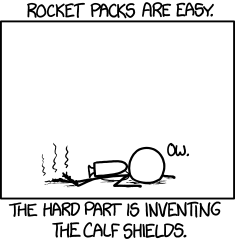

Install [VS Code](https://code.visualstudio.com/) and use **Terminal → New Terminal** (**Ctrl+Shift+backtick**, also Control on Mac) for course commands; it starts in whatever folder you opened. The examples use Bash or Zsh.

### Windows: connect VS Code to WSL

1. Once, in **PowerShell as Administrator**: run `wsl --install`, restart if prompted, and finish Ubuntu's username/password setup.
2. In VS Code, open **View → Extensions** (**Ctrl+Shift+X**) and install **WSL** by Microsoft.
3. Command Palette → **WSL: Connect to WSL**. The lower-left corner should read **WSL: Ubuntu**.
4. Install Microsoft's **Python** extension in WSL when prompted, and stay in this window for the commands below and your cloned project.

WSL supplies Linux underneath; you work in VS Code, not a separate Ubuntu terminal. [VS Code's WSL setup](https://code.visualstudio.com/docs/remote/wsl).

### Mac

VS Code's integrated terminal normally uses Zsh. macOS **Terminal** (**Cmd+Space**, type `Terminal`) is a fallback; use `cd` (Command Line Essentials, below) to enter your project folder there.

### Alternative: Codespaces instead of a local VS Code installation

[GitHub Codespaces](https://docs.github.com/en/codespaces/developing-in-a-codespace/creating-a-codespace-for-a-repository) runs VS Code and a Linux terminal in your browser, with no local VS Code, WSL, or Homebrew.

1. Create your GitHub account and fork the assignment repository using **Starting with GitHub** and **Fork and Clone** below.
2. On **your fork**: **Code → Codespaces → Create codespace on main**. Your repository opens automatically; skip cloning.
3. In **Terminal → New Terminal**, run the uv/Python installation below, check `python3 --version` for **3.13.x**, then choose **Python: Select Interpreter**.
4. Edit, run, commit, and sync in the browser as in desktop VS Code. Stop the codespace when finished; usage allowances are limited.

## Installing Python

### macOS, Windows WSL, and Codespaces

Use [uv](https://docs.astral.sh/uv/guides/install-python/) to install Python **3.13**. Run these commands in **VS Code's integrated terminal**. On Windows, use the **WSL-connected window**, not PowerShell. Lecture 03 covers uv environments and packages.

```bash
curl -LsSf https://astral.sh/uv/install.sh | sh
source "$HOME/.local/bin/env"
uv python install 3.13 --default
uv python update-shell
```

Open a new terminal, then check:

```bash
python3 --version
```

Expect `Python 3.13.x`.

[Homebrew](https://brew.sh/) is recommended for other macOS command-line tools; use uv for the course Python. Native Windows PowerShell setup is in [BONUS.md](BONUS.md); the course shell demos still require WSL.

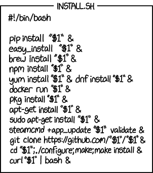

## Text Editor Options


We use VS Code: free, on every platform, and it puts the editor, terminal, debugger, and Git interface in one window. Microsoft's Python extension adds Python support, and `code filename.py` opens a file from the terminal. On macOS, first open the Command Palette and run **Shell Command: Install 'code' command in PATH**, then reopen the terminal ([macOS setup](https://code.visualstudio.com/docs/setup/mac#launch-vs-code-from-the-command-line)). Other editors work too, including Sublime Text, PyCharm, nano, and Vim; see [BONUS.md](BONUS.md).

### VS Code Basics

Open your project with **File → Open Folder** so the editor, terminal, and Source Control share one project.


- **Explorer** (left): open a file or create one with the **New File** icon; keep `.py` on Python filenames.
- **File → Save** (**Ctrl+S**; **Cmd+S** on Mac): save before running.
- **Extensions** (left): install **Python** by Microsoft.
- **Command Palette** (**Ctrl+Shift+P**; **Cmd+Shift+P** on Mac): run an editor action by name, such as **Python: Select Interpreter** (choose Python 3.13) or **Git: Clone**.
- **Terminal → New Terminal** (**Ctrl+Shift+backtick**, also Control on Mac): type a command at the prompt and press Enter.
- **Source Control** (**Ctrl+Shift+G**, also Control on Mac): click a changed file to see its changes.

The editor changes files; the terminal runs commands. Saving a file does not run it or upload it to GitHub. **Help → Keyboard Shortcuts Reference** lists your platform's [default shortcuts](https://code.visualstudio.com/docs/reference/default-keybindings).

## Starting with GitHub

**GitHub** stores your project's files and history online. Create an account, verify your email, and use a username you would put on a professional portfolio. The GitHub Student Pack is optional.

### Keep Your Email Private

GitHub provides a `noreply` address in [email settings](https://github.com/settings/emails). Copy it for Git configuration; signing in authorizes access, while Git configuration identifies the author of a commit.

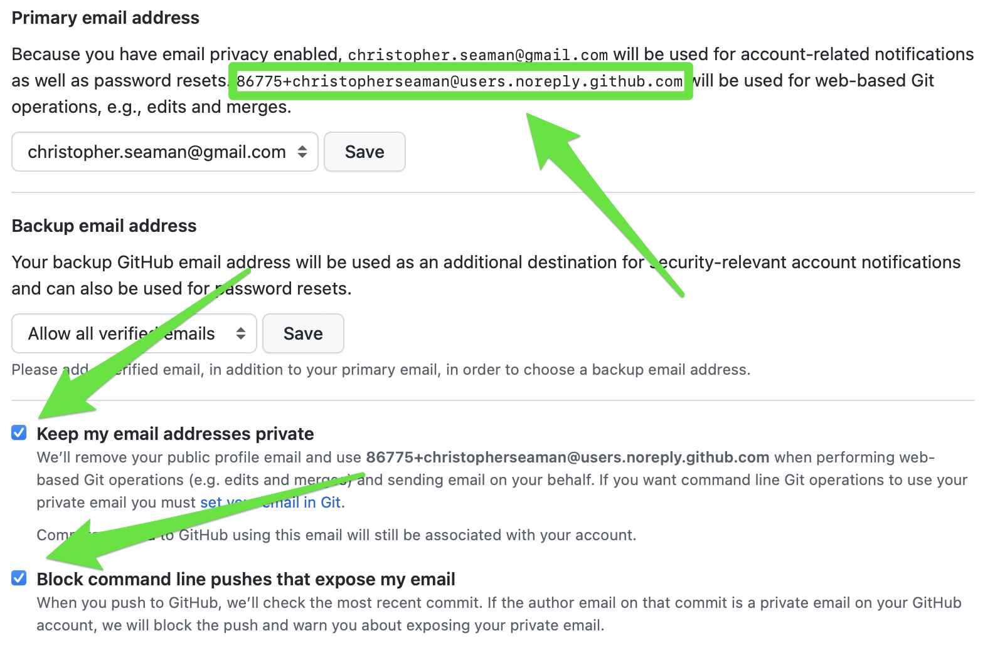

Install [Git](https://git-scm.com/downloads) if VS Code reports it missing, then restart VS Code. When cloning or syncing prompts you, choose **Sign in with GitHub** and authorize in your browser. If your first commit asks for a name or email, run these once in your cloned folder's terminal:

```bash
git config user.name "Your Name"
git config user.email "YOUR GITHUB NOREPLY EMAIL"
```

## Getting the First Assignment

A **fork** is your copy of a repository on GitHub; a **clone** is its working copy on your computer. Assignment 01 starts with a fork, so your changes go to your own account.

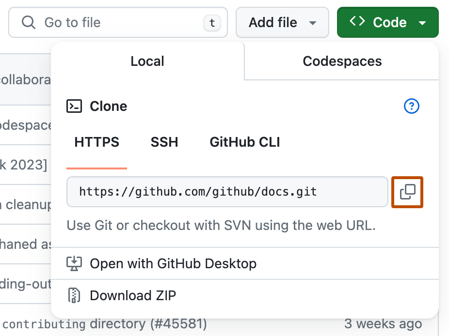

### Reference Card: Fork and Clone

- On the assignment repository: **Fork → Create fork**, with your account as Owner.
- On **your fork**: **Code → HTTPS**, then copy the URL; its owner should be your username.
- In VS Code: Command Palette → **Git: Clone**, paste that URL, choose a folder, and open the clone. On Windows, stay in **WSL: Ubuntu** and choose a folder in your Linux home directory.

[Demo 1](demo/DEMO_GUIDE.md#15-fork-and-clone) shows each screen. Keep assignment work in the cloned folder.

## Submit Your Assignment Files

A **commit** saves a version of your files. **Staging** selects which changes go into that commit; unstaged edits stay on your computer. **Push** sends local commits to GitHub. VS Code's **Sync Changes** pushes yours and pulls any incoming commits.

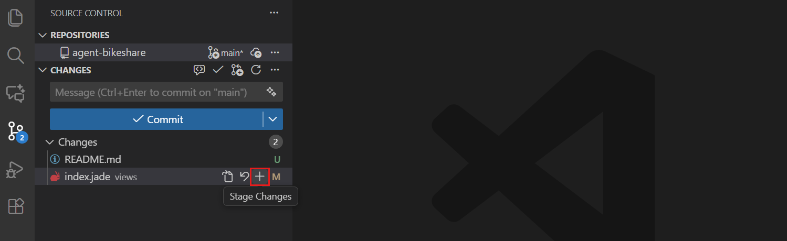

### Reference Card: Save, Commit, and Sync

- Save your files, then review each changed file in **Source Control**.
- Stage with **+**, enter a message such as `Complete Assignment 01`, and select **Commit**.
- Select **Sync Changes** and sign in if prompted.
- On GitHub, open the committed files to verify their contents. **Actions** shows the automatic checks; enable workflows once if a new fork prompts you.

For Assignment 01, include the completed scripts, both files in `terminal-practice/`, and both in `output/`. Your fork is the submission; there is no pull request to the course repository. [Demo 1](demo/DEMO_GUIDE.md#17-save-a-change-on-github) practices the workflow.

### GitHub Website: Upload Files

1. Open **your fork** on GitHub, on `main`. Select **Add file → Upload files**.

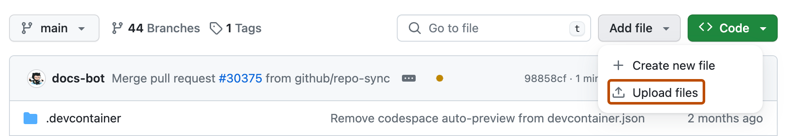

2. Drag in the completed scripts and the `terminal-practice` and `output` folders, not the whole project folder. Keep the folders intact so paths such as `output/readiness.txt` stay correct.
3. Enter `Complete Assignment 01`, choose **Commit directly to the main branch**, and click **Commit changes**. A web upload commits on GitHub; no separate push is needed.

<synced_block url="https://app.notion.com/p/271d9fdd1a1a805784e1fe68dc985696#3dcd9fdd1a1a806b8fb4fffbf0fdabab">

# LIVE DEMO!

</synced_block>

# Command Line Essentials

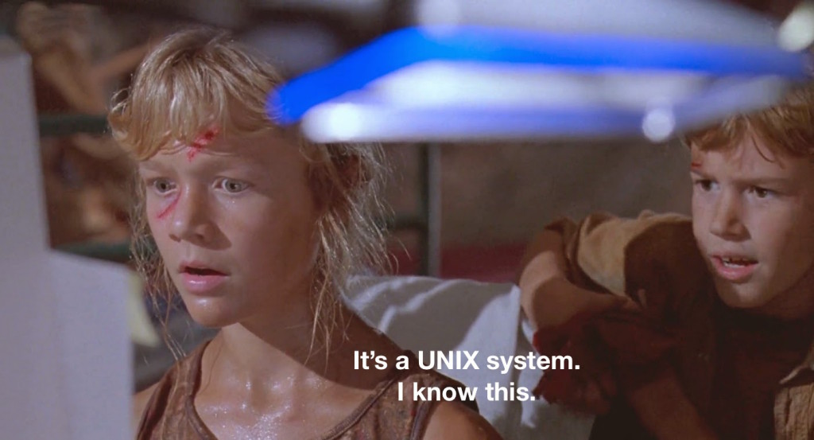

Data science work switches constantly between Python and the command line. It's like being bilingual in the data world: Python speaks to your data, the command line speaks to your computer.

Picture a clinic study that arrives as a folder of CSV exports. From the shell you make a project folder, copy the raw files somewhere safe, peek at the first rows, and run your analysis script. It is the same few commands every time, nothing to click and nothing to forget.

**Reality check:** Organizing files and inspecting data are part of the analysis, not chores you finish before the “real” work starts.

## How the Shell Reads a Command

The shell shows a **prompt**, such as `alice@laptop:~/datasci217$`, and waits. Type a command, press Enter, and the shell runs it, prints any output, and shows a new prompt. It splits your line at spaces: the first word is the program to run, words starting with `-` are **options** that change how it behaves, and the rest are **arguments**, usually the files or folders to act on.

```text
ls  -l  data
│   │   └── argument: which folder to list
│   └────── option: long, detailed format
└────────── command: list directory contents
```

Quote an argument that contains spaces: `cd "My Documents"`.

## Where You Are: Paths and the Working Directory

A folder is a **directory** at the shell, and the shell is always "in" one of them: its **working directory**, the _You are here_ dot on a map. `pwd` prints it, `cd` changes it, and commands look for files there unless you say otherwise.

A **path** names a file or folder. An **absolute path** starts at the top of the file system, `/`, like a full street address; it works from anywhere. A **relative path** starts from your working directory, like directions from where you are standing.

```text
/home/alice/                ← ~ (your home directory)
└── datasci217/             ← working directory: pwd prints /home/alice/datasci217
    ├── data/
    │   └── visits.csv      ← relative path from here: data/visits.csv
    └── scripts/
        └── clean.py
```

- `.` = current directory
- `..` = parent directory, one level up
- `~` = home directory (`/home/alice` on Linux and WSL; `/Users/alice` on macOS)

From `datasci217`, `data/visits.csv` and `/home/alice/datasci217/data/visits.csv` name the same file. After `cd scripts`, the relative path becomes `../data/visits.csv`.

## Navigation Commands

### Reference Card: Navigation Commands

- `pwd`: Print working directory (where am I?)
- `ls`: List contents (what's here?)
- `ls -la`: List with details (show me everything)
- `cd [path]`: Change directory (go somewhere)
- `cd ..`: Go up one level
- `cd ~`: Go to home directory

### Code Snippet: Navigation Commands

```bash
cd ~
pwd
cd ..
pwd
cd ~
pwd
```

```text
/home/alice
/home
/home/alice
```

Your username replaces `alice`; macOS prints `/Users/alice` and `/Users`.

## File and Directory Operations

### Reference Card: File and Directory Operations

- `mkdir [name]`: Make directory
- `mkdir -p [path/to/nested]`: Make nested directories
- `touch [filename]`: Create empty file
- `cp [source] [destination]`: Copy file
- `mv [source] [destination]`: Move/rename file
- `rm [filename]`: Remove file (careful!)
- `rm -r [directory]`: Remove directory and contents (very careful!)

### Code Snippet: File and Directory Operations

Create an empty visits file, copy it, and move the copy into `results`. `rm` deletes the temporary `draft.txt`; there is no trash can.

```bash
mkdir clinic_project
cd clinic_project
mkdir data results
touch data/visits.csv
cp data/visits.csv data/backup.csv
mv data/backup.csv results/visits_copy.csv
touch results/draft.txt
rm results/draft.txt
ls data results
```

```text
data:
visits.csv

results:
visits_copy.csv
```

## Writing and Viewing Text Files

`echo` prints text; `>` and `>>` **redirect** that output into a file instead of the screen. `cat`, `head`, and `tail` show what a file holds; `head` is the quick way to check a large data file's column names without opening it.

### Reference Card: Writing and Viewing Files

- `echo "text"`: Print a line of text.
- `echo "text" > FILE`: Write the line to `FILE`, replacing its contents.
- `echo "text" >> FILE`: Append the line to the end of `FILE`.
- `cat FILE`: Show the entire file.
- `head FILE` / `head -n 5 FILE`: Show the first 10 / first 5 lines.
- `tail FILE` / `tail -n 20 FILE`: Show the last 10 / last 20 lines.

### Code Snippet: Build and Inspect a Small CSV

```bash
echo "patient_id,systolic" > visits.csv
echo "P001,118" >> visits.csv
echo "P002,142" >> visits.csv
echo "P003,131" >> visits.csv
head -n 2 visits.csv
tail -n 1 visits.csv
```

```text
patient_id,systolic
P001,118
P003,131
```

## Create a Script by Pasting

A **shell script** is a text file of shell commands that Bash runs top to bottom. Its first line, `#!/bin/bash`, records which shell the script expects; `bash file.sh` treats that line as an ordinary `#` comment.

1. Run `cat > file.sh` in your shell. `>` replaces that file if it exists.
2. Paste the script, press **Enter** to end the last line, then **Ctrl+C** to stop `cat` (Control, not Command, on Mac; see Ctrl+C: Make it Stop! below). Every line you ended with Enter stays in the file; a line not yet ended with Enter is dropped.
3. Inspect with `cat file.sh`, then run with `bash file.sh`.

## Getting Help

### Reference Card: Getting Help

- `man [command]`: Manual page for command
- `[command] --help`: Quick help when the command supports it; macOS tools often use `man` instead.
- `which [command]`: Find where command is located

Other help: books, your favorite LLM, a buddy, or the course EAs and instructor.

## Ctrl+C: Make it Stop!

- **Build the reflex: Ctrl+C to cancel** a running command or unfinished input. On Mac, Control, not Command.
- **Windows habit to unlearn:** Ctrl+C interrupts here, not copies; terminal copy is often Ctrl+Shift+C.

## Shell Shortcuts

These save retyping at the prompt; on Mac, **Ctrl** means Control, not Command.

### Reference Card: Shell Shortcuts

- **Tab**: Complete a file, folder, or command name you have started typing: `ls data/vi` then **Tab** gives `ls data/visits.csv`. If several names match, it stops where they differ; press **Tab** once or twice more to see the choices, or type another letter and press **Tab** again.
- **↑ / ↓**: Step back and forward through the commands you have run; press **Enter** to run the one shown, or edit it first.
- **Ctrl+R**: Search your command history. Type part of an old command to bring back the latest match; **Ctrl+R** again finds an older one, **Enter** runs it, and **Ctrl+C** cancels.
- `history`: List your recent commands, numbered, oldest first.
- `clear` or **Ctrl+L**: Clear the screen; your files and command history stay as they are.
- `*`: A **wildcard** that matches any run of characters in a file name, so `ls data/*.csv` lists every `.csv` file in `data`. If nothing matches, you get an error: `zsh: no matches found` on Mac, `No such file or directory` in Bash.

# LIVE DEMO!

# Python Basics

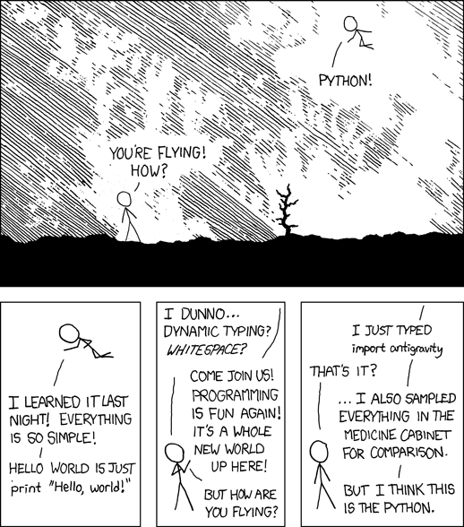

Python is a program called an **interpreter**: it reads Python code and runs it one **statement** (one instruction, usually one line) at a time. The shell manages files. Python computes with what is inside them: one patient's BMI, then the same calculation for every row of a clinic export.

You can give Python code two ways:

- **Interactive mode**, or the **REPL** (read–evaluate–print loop): run `python3` and type a line at the `>>>` prompt. Python shows the result right away, good for quick experiments.
- **Script mode**: save code in a `.py` file and run `python3 file.py` from the folder that contains it (check with `pwd` and `ls`). A script is a record you can rerun, fix, and commit to GitHub; it shows output only where you call `print()`.

Two kinds of calls appear throughout:

- A **function** does a job when called with parentheses: `print("Hello")`, `len("Alice")`, `type(22)`. The values in the parentheses are its **arguments**, like a shell command's arguments.
- A **method** is a function belonging to a value, called with a dot: `"alice".upper()` returns `"ALICE"`.

## Running Python

In VS Code, save a `.py` file and click the triangle at its top right to run it in the integrated terminal.

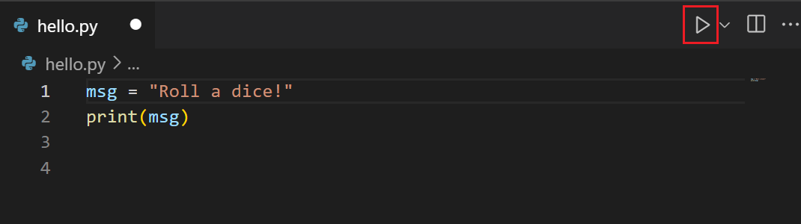

**Jupyter notebooks** are another way to run Python, but we'll meet them later.

### Code Snippet: Running Python

```bash
python3
python3 script.py
```

The first command starts interactive Python; the second runs a saved script. These are shell commands; native Windows PowerShell uses `python`. Enter `exit()` at the `>>>` prompt to leave the REPL.

#### Interactive Mode Example

```console
$ python3
>>> print("Hello, World!")
Hello, World!
>>> 70 / 1.75 ** 2
22.857142857142858
>>> exit()
```

## Python Syntax Overview

### Indentation Matters!

<callout icon="⚠️" color="yellow_bg">
	## Indent each block four spaces
	Python uses indentation to group code together. Use four spaces per indentation level.
</callout>

This previews an `if` conditional; Control Structures, below, explains the condition.

```python
# Correct indentation
x = 1
if x > 0:
    print("Positive")        # indented, so it belongs to the if
    print("Still positive")  # also indented
```

```python
# Wrong indentation: raises IndentationError until the print is indented
if x > 0:
print("This will cause an IndentationError")
```

### The `>>>` Prompt Indents for You

At the `>>>` prompt, Python 3.13 indents for you: after a line ending in `:`, the next `...` line already starts four spaces in. Type each line without adding spaces, press **Backspace** once for each level you move back out (before `else`, which runs when the `if` condition is `False`), and press **Enter** on an empty `...` line to finish the block. In a `.py` file, VS Code also indents the line after a `:` when you press **Enter**; check that each block line starts four spaces in.

```console
>>> score = 85
>>> if score >= 90:
...     print("Grade: A")
... else:
...     print("Grade: B")
...
Grade: B
```

Typing the spaces as well doubles the indentation. A one-line block still runs, but the block's second line starts at that deeper indentation plus your spaces, and Python reports `IndentationError: unexpected indent`.

### Comments Use `#`

```python
# This is a comment; Python ignores this line
print("This is code")  # Comments can also go at the end of lines
```

### Reference Card: Python Syntax

- Use 4 spaces for indentation (not tabs)
- No semicolons needed at the end of lines (but you can have them if you REALLY want them)
- Case-sensitive: `Name` and `name` are different variables
- Use quotes for strings: `"Hello"` or `'Hello'`

## Variables and Data Types

A **variable** is a name for a value, created with `=`: `age = 67` means "let the name `age` refer to 67." Think of a name tag stuck on a value rather than a box: later you can move the tag to a different value, even one of another type. Name variables for what they hold: `student_age`, not `a`, `x1`, or `temp`.

Every value has a **type** that decides what you can do with it: adding two numbers works, adding a number to text raises an error (see Debugging). One patient record already mixes four types: an ID (`"P001"`, text), an age (`67`, whole number), a temperature (`37.8`, decimal), and whether consent is on file (`True`).

### Reference Card: Values and Types

| Value / operation | Meaning | Example |
| --- | --- | --- |
| `int` | Whole number | `22` |
| `float` | Number with a decimal part | `87.5` |
| `str` | Text in quotes | `"Alice"` |
| `bool` | True or false | `True` |
| `type(value)` | Inspect a value's type | `type(22)` → `<class 'int'>` |
| `name = value` | Assign a value to a name | `age = 22` |

### Numbers: The Foundation of Data Science

```python
student_count = 150      # int: whole number
temperature_celsius = -5
average_grade = 87.3     # float: has a decimal part
height_meters = 1.75
```

Scientific notation, such as `1.4e9`, and the `math` module are in [BONUS.md](BONUS.md).

### Text: Essential for Data Labels and Categories

#### Reference Card: Strings

- `text.upper()` / `text.lower()`: return uppercase / lowercase text.
- `text.title()`: return text with each word capitalized.
- `text.strip()`: remove leading and trailing whitespace.
- `len(text)`: count characters, including spaces.
- String methods return new text; assign the result to keep it.

```python
student_name = "Alice Johnson"
name_upper = student_name.upper()        # "ALICE JOHNSON"
name_lower = student_name.lower()        # "alice johnson"
clean_name = "  Bob Smith  ".strip()     # "Bob Smith"
print(len(student_name))                 # 13
```

### Boolean: Essential for Data Filtering

#### Reference Card: Boolean Logic

- `True` / `False`: the two Boolean values.
- `a and b`: true when both are true.
- `a or b`: true when at least one is true.
- `not a`: reverse a Boolean value.

```python
# True/False values for logical operations
has_complete_data = True
missing_values = False
analysis_ready = True and has_complete_data    # True
needs_cleaning = missing_values or not analysis_ready  # False
```

### Checking a Value's Type

```python
student_age = 22
mysterious_data = "22"       # Looks like a number, but it's text

print(type(student_age))     # <class 'int'>
print(type(mysterious_data)) # <class 'str'>: aha! That's the problem
```

### Lists: Ordered Collections

A **list** holds several values in order inside square brackets, such as one patient's systolic readings across three visits: `[118, 142, 131]`. For now, create a list, count its items with `len()`, and visit each item with a `for` loop (Control Structures, below). Lecture 02 adds indexing and slicing.

#### Reference Card: Lists So Far

- `[value1, value2, ...]`: Create a list; `[]` is an empty list.
- `len(items)`: Count the items; `len([118, 142, 131])` gives `3`.
- `for item in items:`: Visit each item in order.

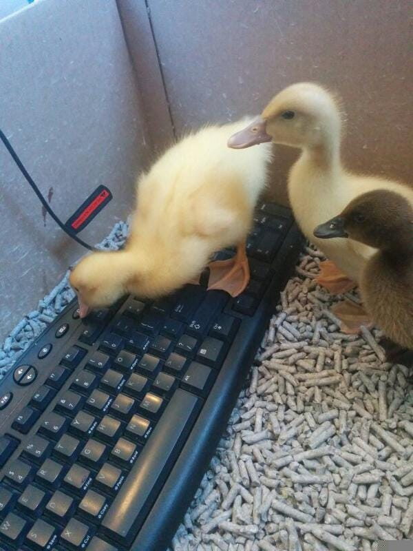

### Duck Typing: Behavior Over Labels

**Dynamic typing** means a name can refer to values of different types. **Duck typing** means an operation needs the right behavior: both text and lists support `len()`, even though their types differ. If it walks like a duck and quacks like a duck, Python lets us treat it like a duck.

```python
print(len("dataset"))          # 7
print(len([128, 142, 118]))    # 3
```

Python checks the operation when it runs; unsupported operations raise `TypeError`.


## Basic Operations

### Reference Card: Plain Output

| Syntax | Purpose | Output |
| --- | --- | --- |
| `print("Hello")` | Display text | `Hello` |
| `print(2 + 3)` | Display a calculation | `5` |
| `print("Score:", 85)` | Display a label and value | `Score: 85` |

Use `print()` to display a value or several values separated by commas. Python puts spaces between them.

### Reference Card: Arithmetic

- `+`, `-`, `*`: add, subtract, multiply. For strings, `+` joins text.
- `/`: divide; `15 / 4` gives `3.75`.
- `//`: floor division; `15 // 4` gives `3`.
- `%`: remainder; `15 % 4` gives `3`.
- `**`: power; `2 ** 3` gives `8`.
- `(...)`: group an expression to control calculation order.
- `total += 5`: Shorthand for `total = total + 5`; `-=` and `*=` work the same way.

### Code Snippet: Joining and Printing Text

```python
first = "Ada"
last = "Lovelace"
full_name = first + " " + last        # Concatenation
print("Hello", full_name)             # Print text and a value
```

```text
Hello Ada Lovelace
```

### Code Snippet: Calculate BMI

```python
weight_kg = 70
height_m = 1.75
bmi = weight_kg / (height_m ** 2)
print("BMI is", bmi)
```

```text
BMI is 22.857142857142858
```

## Comparison Operators

### Reference Card: Comparisons

- `==` / `!=`: equal / not equal. Unlike `=`, these compare rather than assign.
- `<`, `<=`, `>`, `>=`: less than, at most, greater than, at least.
- `in` / `not in`: test whether a value belongs to a collection.
- Each comparison returns `True` or `False`.

### Code Snippet: Comparison Operators

```python
x = 2
y = 3
print(x == y, x != y)                       # False True
print(x < y, x > y)                         # True False
print(x <= y, x >= y)                       # True False
print(x in [1, 2, 3], x not in [1, 2, 3])   # True False
```

At the `>>>` prompt Python shows a bare expression's value; in a script, only `print()` shows it.

# LIVE DEMO!

# Control Structures

So far, every script runs each line once, top to bottom. Data work needs two more moves: _choose_ (flag a blood-pressure reading only if it is high) and _repeat_ (apply the same check to 4 readings or 4,000). **Control flow** statements change that top-to-bottom order.

- A **condition** is an expression that is `True` or `False`, such as `systolic >= 140`. The comparison operators from Python Basics build conditions; `and`, `or`, and `not` combine them.
- An `if` statement runs its indented **block** only when its condition is `True`. With `elif` and `else`, Python checks the conditions top to bottom and runs only the first block whose condition is `True`.
- A `for` loop runs its block once per item in a list, naming the current item: `for grade in grades:`. A `while` loop repeats while its condition stays `True`.

Indentation, from Python Syntax Overview, tells Python which lines belong to the `if` or the loop.

## Decisions and Repetition

### Reference Card: Decisions and Repetition

- `if` / `elif` / `else`: Choose which block runs based on a condition
- `for value in values:`: Visit each item in order
- `range(5)`: Supply integers 0 through 4
- `while condition:`: Repeat while the condition stays true
- `enumerate(values, start=1)`: Supply each position and value
- `break` / `continue`: Stop a loop / skip to its next iteration

## If Statements

### Which Branch Runs?

| `score` | First condition that is `True` | Output |
| --- | --- | --- |
| 95 | `score >= 90` | `Grade: A` |
| 85 | `score >= 80` | `Grade: B` |
| 72 | `score >= 70` | `Grade: C` |
| 50 | none, so `else` runs | `Grade: F` |

### Code Snippet: Basic If Statements

```python
score = 85

if score >= 90:
    print("Grade: A")
elif score >= 80:
    print("Grade: B")
elif score >= 70:
    print("Grade: C")
else:
    print("Grade: F")
```

```text
Grade: B
```

### Code Snippet: Compound Conditions

```python
age = 25
has_license = True

if age >= 18 and has_license:
    print("Can drive")
elif age >= 16 and not has_license:
    print("Can learn to drive")
else:
    print("Cannot drive")
```

```text
Can drive
```

## For Loops

A list supplies its items in order, and `range()` supplies integers; Lecture 02 covers lists in more depth.

### Code Snippet: Basic For Loops

```python
for number in range(5):
    print(number)   # 0, 1, 2, 3, 4 on separate lines
```

`range(5)` supplies the integers from 0 up to, but not including, 5.

### Code Snippet: Positions and Values

```python
for position, reading in enumerate([128, 142], start=1):
    print(position, reading)   # 1 128, then 2 142 on separate lines
```

`enumerate()` supplies each position alongside its value; `start=1` numbers them from 1.

### Tracing a Loop

Each pass through the loop in the next snippet updates two running values:

| Pass | `grade` | `total` after | `count` after |
| --- | --- | --- | --- |
| 1 | 85 | 85 | 1 |
| 2 | 92 | 177 | 2 |
| 3 | 78 | 255 | 3 |
| 4 | 96 | 351 | 4 |
| 5 | 88 | 439 | 5 |

To check a loop you wrote, add a temporary `print("grade:", grade, "total:", total)` inside it and compare with a table like this.

### Code Snippet: Practical Data Science Example

```python
grades = [85, 92, 78, 96, 88]
total = 0
count = 0

for grade in grades:
    total += grade          # same as total = total + grade
    count += 1

average = total / count
print("Average grade:", average)
```

```text
Average grade: 87.8
```

## While Loops and Loop Control

A `while` loop repeats as long as its condition stays `True`. Update something in its body so the loop can finish; **Ctrl+C** stops a loop that keeps running.

```python
count = 1
while count <= 3:
    print(count)   # 1, 2, 3 on separate lines
    count += 1
```

### Reference Card: Stop or Skip a Loop Pass

- `break`: End the loop immediately, such as after finding the first high reading.
- `continue`: Skip the rest of this pass and start the next one, such as for a missing measurement.
- `total += value`: The short form of `total = total + value`.

```python
for reading in [128, 142, 118]:
    if reading < 130:
        continue
    print(reading)   # 142
    break           # stop after the first reading at or above 130
```

[Demo 4.3](demo/DEMO_GUIDE.md#43-while-break-and-continue) practices each form separately.

# Debugging and Error Handling Basics

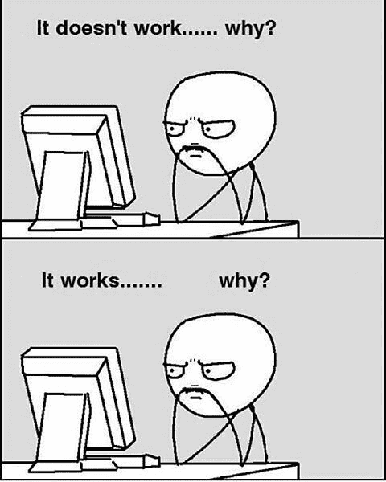

When Python cannot run a line, it stops and prints a **traceback**: the file and line where it stopped, that line of code, and a last line naming the **error type**, such as `NameError`, and a message.

## Reading a Traceback

An error reports where execution stopped and what operation failed, but not necessarily the underlying cause.

1. Read the final line for the error type and message.
2. Find the referenced line in your script.
3. Inspect the values there with `print()` and their types with `type()`.
4. Make one correction, save, and rerun. The next error often appears only after this one is fixed.

### Reference Card: Inspecting and Converting Values

- `print(value)`: inspect the actual value.
- `type(value)`: inspect its type.
- `int("25")` / `float("25.5")`: convert numeric text to an integer / decimal number.
- `IndentationError`: a line ending in `:` has no indented block after it, or the indentation is misaligned; nothing in the file runs until it is fixed.
- `NameError`: a name is undefined; check spelling and execution order.
- `TypeError`: an operation does not support these types.
- `ValueError`: the type is accepted, but the value cannot be used as requested.

## IndentationError: Check the Block Under the Colon

```python
score = 85
if score >= 80:
print("Grade: B")
```

```text
  File "/home/alice/datasci217/analysis.py", line 3
    print("Grade: B")
    ^^^^^
IndentationError: expected an indented block after 'if' statement on line 2
```

**Diagnosis:** A line ending in `:` must be followed by at least one indented line. Python checks the whole file's structure before running anything, so this error has no `Traceback (most recent call last)` header and nothing runs, not even the lines above the mistake. A `NameError` or `TypeError` appears only when Python reaches the bad line, after earlier lines have already printed.

**Correction:** Indent `print("Grade: B")` four spaces, as in Python Syntax Overview.

## NameError: Check the Name and Its Definition

```python
student_name = "Alice"
print(student_naem)
```

```text
Traceback (most recent call last):
  File "/home/alice/datasci217/analysis.py", line 2, in <module>
    print(student_naem)
          ^^^^^^^^^^^^
NameError: name 'student_naem' is not defined. Did you mean: 'student_name'?
```

The `^^^^` markers point at the part of the line that failed. `Did you mean` is Python 3.13's hint when a similar name exists.

**Diagnosis:** Python cannot find that name. Check its spelling against the hint and whether the assignment ran before this line.

**Correction:** Change `student_naem` to `student_name`, save, and rerun; it prints `Alice`.

## TypeError: Check the Operation and Types

```python
age = "25"
next_year = age + 1
```

```text
TypeError: can only concatenate str (not "int") to str
```

**Diagnosis:** `print(age, type(age))` reveals text. We want arithmetic, so convert numeric text before adding:

```python
age = "25"
age_number = int(age)
next_year = age_number + 1
print("Next year you'll be", next_year)
```

## ValueError: Check the Actual Value

```python
raw_age = "hello"
age = int(raw_age)
```

```text
ValueError: invalid literal for int() with base 10: 'hello'
```

**Diagnosis:** `int()` accepts numeric text such as `"25"`, but `"hello"` is not an integer representation. Both are `str`, so checking only `type(raw_age)` would miss the difference; inspect the value and where it came from.

**Correction:** Fix the source: select the age field if the wrong one was read, or correct the value only when you know the intended one. Suppose the record confirms an age of 25:

```python
raw_age = "25"
age = int(raw_age)
print("Age:", age)
```

Do not replace unknown ages with invented numbers just to make the error disappear. Lecture 02 introduces `try`/`except` for responding to expected failures.

# LIVE DEMO!
