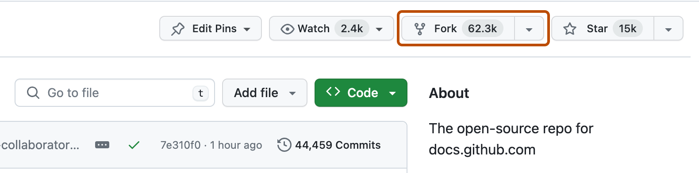
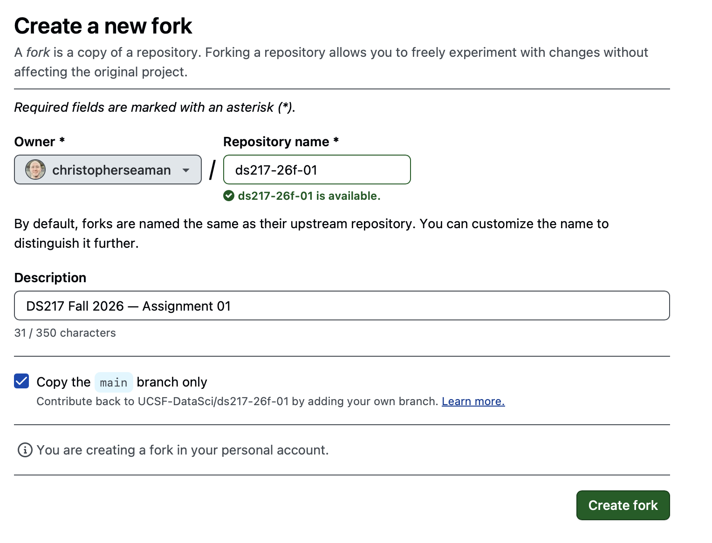
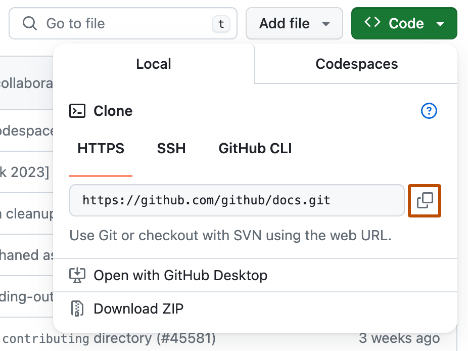
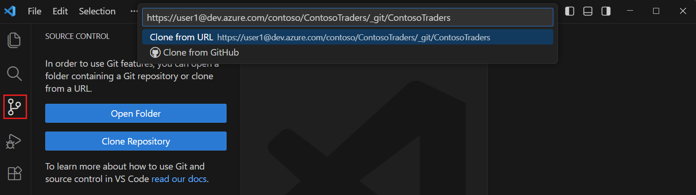

# GitHub, VS Code, and WSL Setup

## 1.1 GitHub account and email privacy

1. Open [github.com](https://github.com/) and create or open your account.
2. Choose a professional username; it will be part of your public portfolio.
3. Open [GitHub email settings](https://github.com/settings/emails).
4. Enable **Keep my email addresses private** and copy your GitHub `noreply` address for your Git configuration.
5. The [GitHub Student Developer Pack](https://education.github.com/students) is optional.

## 1.2 Install and open VS Code

For browser-only setup, use the **Alternative: Codespaces** subsection in [Lecture 01](../README.md). Then run the Python setup in 1.4, skip 1.5 (your fork is already open), and continue at 1.6.

1. Install [Visual Studio Code](https://code.visualstudio.com/).
2. Open **View → Extensions** (Ctrl+Shift+X; Cmd+Shift+X on Mac) and install **Python** by Microsoft. GitLens and Rainbow CSV are optional.
3. Open a course or practice folder with **File → Open Folder**.
4. Open **Terminal → New Terminal** (Ctrl+Shift+backtick, also Control on Mac).

Open the Command Palette with **View → Command Palette** (Ctrl+Shift+P; Cmd+Shift+P on Mac). Explorer edits files; the terminal runs commands; Source Control saves versions.

## 1.3 Choose a terminal and shell

A **terminal** displays the session; a **shell** interprets your commands. Use VS Code's terminal with Bash or Zsh for these demos.

- **Windows:** For initial setup, run `wsl --install` in Administrator PowerShell, restart if prompted, and finish Ubuntu's username/password setup. Then return to VS Code:
    1. Open **View → Extensions** (**Ctrl+Shift+X**) and install **WSL** by Microsoft.
    2. Open **View → Command Palette** (**Ctrl+Shift+P**) → **WSL: Connect to WSL**. Expect **WSL: Ubuntu** in the lower-left corner.
    3. Install Microsoft's **Python** extension in WSL when prompted. Choose **Terminal → New Terminal** in this window; use it for the commands below and clone/open your project in this same window.
- **Mac:** VS Code's default terminal usually runs Zsh, which supports these commands.
- **Separate app fallback:** macOS Terminal or Windows Terminal's Ubuntu profile also works for commands; use `cd` to enter your working folder. Keep VS Code connected to WSL on Windows.

[WSL installation help](https://learn.microsoft.com/en-us/windows/wsl/install)

## 1.4 Install Python and Git

### Python: macOS, WSL Ubuntu, and Codespaces

Paste these commands into **VS Code's integrated terminal** one at a time (in the WSL-connected window on Windows). [uv](https://docs.astral.sh/uv/guides/install-python/) installs Python **3.13**; Lecture 03 explains environment management.

```bash
curl -LsSf https://astral.sh/uv/install.sh | sh
source "$HOME/.local/bin/env"
uv python install 3.13 --default
uv python update-shell
```

Open a new terminal, then run `python3 --version`. Expect `Python 3.13.x`.

### Git

Run `git --version`. If Git is missing:

- **WSL Ubuntu:** Run `sudo apt update`, then `sudo apt install git`.
- **Mac:** Install [Homebrew](https://brew.sh/), follow its **Next steps** to put `brew` on your PATH, then run `brew install git`. Homebrew is recommended for other command-line tools; Python comes from uv.

### Select Python in VS Code

Open **View → Command Palette** (**Ctrl+Shift+P**; **Cmd+Shift+P** on Mac), choose **Python: Select Interpreter**, and select Python 3.13. Run the demos in the terminal you checked above.

## 1.5 Fork and clone

1. Open the assignment repository linked for this term on GitHub and select **Fork**.

    

2. Choose your account as Owner, keep the repository name, and select **Create fork**.

    

3. From your fork, copy **Code → HTTPS**. Confirm that the URL contains your username as the owner.

    

4. Open **View → Command Palette** (Ctrl+Shift+P; Cmd+Shift+P on Mac), choose **Git: Clone**, paste the URL, choose a folder, and open it. On Windows, do this in the **WSL: Ubuntu** window and choose a folder in your Linux home directory.

    

Screenshots show example repositories; paste your own fork's URL. Sources: [GitHub Docs](https://docs.github.com/en/pull-requests/collaborating-with-pull-requests/working-with-forks/fork-a-repo) and [VS Code documentation](https://code.visualstudio.com/docs/sourcecontrol/quickstart).

## 1.6 Sign in to GitHub in VS Code

Sign in to GitHub through VS Code when **Clone from GitHub** or **Sync Changes** prompts you: choose **Sign in with GitHub**, authorize in your browser, then return to VS Code.

If a commit reports a missing name or email, open **Terminal → New Terminal** in your cloned folder and run these once, using your GitHub `noreply` email:

```bash
git config user.name "Your Name"
git config user.email "YOUR GITHUB NOREPLY EMAIL"
```

GitHub login authorizes access to your repositories; these settings identify the author of your commits.

## 1.7 Save a change on GitHub

1. In Explorer, create `practice.txt`, write a sentence about what you want to learn, and save it (**File → Save**, Ctrl+S; Cmd+S on Mac).
2. Open **View → Source Control** (Ctrl+Shift+G, including Control on Mac), review the change, stage it with **+**, enter a commit message, and select **Commit**.
3. Select **Sync Changes**, sign in if prompted, then check your fork on GitHub. It should now contain `practice.txt` with your sentence.

You have a copy on GitHub and a working copy on your computer. Lecture 02 develops the Git concepts behind this workflow.
