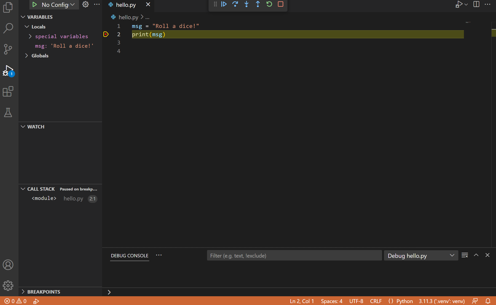

---
notion:
  title_line: "# `git gud` with Version Control"
  role: lecture
  status: mapped
  page_id: "271d9fdd-1a1a-8036-9c2b-c4a66ae97d9d"
  url: "https://app.notion.com/p/271d9fdd1a1a80369c2bc4a66ae97d9d"
---

# `git gud` with Version Control

See [BONUS.md](BONUS.md) for the optional extensions.

[Live Demo Guide](demo/DEMO_GUIDE.md)

[Lecture 01 Catch-Up](LECTURE_01_CATCHUP.md)

# VS Code Basics

Lecture 01 got you opening folders in VS Code, running terminal commands, and committing with Source Control. Today adds Git branches and Python scripts that import each other: more files, more commands, so this section is about moving faster.

Start with the **Command Palette**. Every VS Code action is listed there by name, so type part of the name instead of hunting through menus.

## Palette Cleanse: Command Palette & Quick Open

- Open Command Palette: **View → Command Palette…**, **Ctrl+Shift+P** (Windows/Linux), **Cmd+Shift+P** (macOS).
- Quick Open files: **Go → Go to File…**, **Ctrl+P** (Windows/Linux), **Cmd+P** (macOS).
- Search across files: **View → Search**, **Ctrl+Shift+F** (Windows/Linux), **Cmd+Shift+F** (macOS).

### Reference Card: Finding Your Way Around

- **Activity Bar** (left): Explorer, Search, Source Control, Run & Debug, and Extensions.
- **Panel** (bottom): Terminal, Problems, Output, and Debug Console; toggle via **View → Appearance → Panel**.
- Start debugging: **Run → Start Debugging**, **F5**.

## Less Typing, More Doing

Edit and reuse commands in **VS Code's terminal** instead of retyping them.


Same shell commands as a standalone terminal. Screenshot: [VS Code terminal documentation](https://code.visualstudio.com/docs/terminal/basics).

### Reference Card: Shell Shortcuts

- **Tab:** Complete a command or path; if ambiguous, press again to see choices.
- **↑ / ↓:** Recall previous/next commands.
- **← / →:** Move one character.
- **Ctrl+A:** Move to the beginning of the line.
- **Ctrl+E:** Move to the end of the line. On Windows/Linux, VS Code claims **Ctrl+E** for Quick Open, so press **End** there.
- **Ctrl+← / Ctrl+→** (Windows/Linux): Move by word. On Mac, press **Esc**, then **B** or **F**.
- **Ctrl+R:** Search command history; type part of a command, press again for older matches.
- **Ctrl+W:** Delete the preceding word.
- **Ctrl+L:** Clear the view without deleting command history.

These are Bash/Zsh's editing bindings, active while the terminal has focus; **Ctrl** means Control even on Mac. Press **Enter** to run the edited command, or **Ctrl+C** to abandon it for a fresh prompt. [Shell editing reference](https://www.gnu.org/software/bash/manual/html_node/Readline-Movement-Commands.html).

## Settings

- Open settings: Command Palette → **Preferences: Open Settings (UI)**, or **Ctrl+,** (Windows/Linux), **Cmd+,** (macOS).
- Python interpreter: Command Palette → **Python: Select Interpreter**.


Choose the course's Python 3.13 interpreter; this documentation screenshot shows example versions and paths. Source: [VS Code Python environments](https://code.visualstudio.com/docs/python/environments).

Make it Py‑pretty: extensions, themes, window layouts, and format-on-save are in [BONUS.md](BONUS.md#vs-code-extensions-themes-and-settings).

## Command-Line Catalog

Names to recognize from command-line work; the [command-line bonus](BONUS.md#command-line-essentials) has examples.

| Area | Commands | Purpose |
| --- | --- | --- |
| Navigation | `pwd`, `ls`, `cd` | Show where you are, list contents, and move between directories. |
| Files and directories | `mkdir`, `touch`, `cp`, `mv` | Create directories or empty files, copy items, and rename or move them. |
| Removal | `rm` | Remove a file; destructive, so check the path first. |
| Inspect and search text | `cat`, `head`, `tail`, `grep`, `wc` | Read, preview, search, and count text. |
| Directory overview | `tree` | Display a directory hierarchy when the command is available. |
| Recall and shortcuts | `history`, ↑/↓, `Tab`, `Ctrl+R` | Reuse earlier commands and complete or search command text. |

# Git Version Control


Don't worry - we're taking a different approach than that xkcd suggests!

## Why Version Control Matters

You're working on a data analysis, and the folder fills up:

- `analysis_v1.py`
- `analysis_v2.py`
- `analysis_v2_final.py`
- `analysis_v2_final_ACTUALLY_FINAL.py`
- `analysis_fixed_broken_computer_recovery.py`

Sound familiar? Now imagine four teammates doing the same thing. Chaos! Git tracks every change instead: see what changed, restore any version, work in parallel, and stop losing work.

## Git Concepts - The Mental Model

In Lecture 01 you staged files with **+**, selected **Commit**, then **Sync Changes**. Here is what those buttons did.

Git records your project as a series of **snapshots**. Each **commit** is one snapshot of every tracked file, plus who made it, when, and a message saying why. Like saving a game: you can always come back to this exact state.

Git does not snapshot whatever is on disk. You choose: edits sit in the **working tree**, the ones you pick move to the **staging area**, and a commit records them in the **repository**, the history kept in the hidden `.git` folder.

Why the extra step? You fixed a bug in `bp_cleaning.py` and also started an unfinished draft of `bp_plot.py`. Stage and commit the fix; leave the draft unstaged until it earns its own commit.

```text
edit files        select changes       record snapshot       share
working tree  →   staging area     →   local commit      →   GitHub (remote)
               Stage (+)            Commit                 Sync Changes
```

### Reference Card: Git Vocabulary

- **Working tree**: Your current files, including edits not yet committed.
- **Diff**: Line-by-line comparison of two versions; click a changed file in Source Control.
- **Staging area**: Changes selected for the next commit; a later edit needs staging again.
- **Commit**: A snapshot with author, time, and message.
- **Repository (repo)**: Your files plus their recorded history in `.git`.
- **Branch**: A named line of commits; `main` holds the official version.
- **Local branch**: The branch on your computer; it can be ahead of or behind GitHub.
- **Remote**: The copy of the repository on GitHub, usually named `origin`.
- **Synchronize**: VS Code's **Sync Changes** pulls incoming commits and pushes outgoing ones.
- **Merge**: Combine another branch's commits into the current branch.
- **Conflict**: Both branches changed the same lines, so Git asks you to choose.

## VS Code Git Integration

Review a change, stage what belongs in the snapshot, commit, then sync to GitHub.


Screenshots: [VS Code source control documentation](https://code.visualstudio.com/docs/sourcecontrol/quickstart).

If Git reports a missing name or email, use the Git identity setup from Lecture 01.

### Reference Card: VS Code Git Actions

- **Source Control Panel**: **View → Source Control**, **Ctrl+Shift+G** (including Control on macOS)
- **Initialize Repository**: The Source Control button in a folder that is not yet a repository; the same as `git init`
- **Stage Changes**: Click `+` next to files in "Changes" section
- **Commit**: Type a message and select **Commit**
- **View Differences**: Click a modified file to see its diff
- **Push/Pull**: Select **Sync Changes**, or Command Palette → **Git: Push** / **Git: Pull**

### Good vs. Bad Commit Messages

In the Source Control message box, write a short summary that finishes "This commit will…": `Add blood pressure range check`, not `minor changes`. Need more? Leave a blank line, then explain why.


## Git Workflow: Branching and Merging

A **branch** is a separate line of commits. Try a new way to flag abnormal lab values on a branch while `main` keeps the version your team trusts. If it works, **merge** it into `main`; if not, switch back and abandon the branch.

```text
main        A ─── B ─── E ─────────── M
                   \                 /
feature/…           C ─── D ─────────
```

Each letter is a commit: `C` and `D` exist only on the feature branch until merge commit `M` brings them into `main`.

### Reference Card: Branches in VS Code

- **Git: Create Branch…** (Command Palette): Name the branch, such as `feature/measurement-summary`; VS Code switches to it.
- Branch name in the status bar (lower left): The current branch; click it to switch, or to select **Create new branch…**.
- **Publish Branch** (Source Control): Send a new branch to GitHub; **Sync Changes** keeps it current after that.
- **Git: Merge Branch…** (Command Palette): Combine the chosen branch's commits into the branch you are on.

Switching branches rewrites the files in your editor: an edit committed on the feature branch disappears when you switch to `main`, and returns when you merge. If `main` gained no commits meanwhile, that merge is a **fast-forward**: Git slides the `main` pointer up to the feature branch's latest commit, with no merge commit like `M`.

### Merge Conflicts

A **conflict** happens when both branches changed the same lines, so Git cannot tell which version wins. It stops the merge and marks both versions in the file:

```text
# Practice notes
<<<<<<< HEAD
Experiment: compare median systolic.
=======
Experiment: compare three systolic summaries.
>>>>>>> experiment
```

- Between `<<<<<<< HEAD` and `=======`: the branch you are on (**Current Change**).
- Between `=======` and `>>>>>>> experiment`: the branch you are merging in (**Incoming Change**).

1. Open the file listed under **Merge Changes**. Above the block, choose **Accept Current Change**, **Accept Incoming Change**, **Accept Both Changes**, or edit the lines yourself.
2. Check that no `<<<<<<<`, `=======`, or `>>>>>>>` lines remain, save, then stage with **+** and **Commit** to finish the merge.

## Alternative: Git in the Terminal

Every Source Control button runs a Git command. Demo 1's terminal path uses these; [BONUS.md](BONUS.md) covers the rest.

### Reference Card: Git in the Terminal

| Task | Command | Result |
| --- | --- | --- |
| Start a repository | `git init` | A hidden `.git` folder |
| Check state | `git status` | Modified, staged, or "working tree clean" |
| Inspect edits | `git diff` | Unstaged line changes: `+` added, `-` removed |
| Stage | `git add FILE` | FILE's changes go into the next commit |
| Commit | `git commit -m "message"` | A new local commit |
| Create and switch | `git checkout -b NAME` | A new branch at the current commit |
| Switch | `git checkout NAME` | Files change to that branch's version |
| Merge | `git merge NAME` | NAME's commits added to the current branch |
| History | `git log --oneline` | One line per commit; press `q` if the list fills the screen |
| Share | `git push` / `git pull` | Send / receive commits on a branch already linked to GitHub |

## GitHub Web Interface

GitHub's website shows the remote copy: check what arrived after **Sync Changes**, or edit and upload files without cloning, as in Lecture 01. A website edit is a commit on the remote, so **Sync Changes** in VS Code before working locally again.

### Reference Card: GitHub Web Interface

- **Code** tab and branch menu: See the files on `main` or any published branch.
- **Add file → Create new file / Upload files**: Commit new files directly on GitHub.
- Pencil icon on a file: Edit it in the browser, then **Commit changes**.
- **Actions** tab: Results of the automatic assignment checks.
- **+ → New repository**: Create an empty remote with a README.

## Gitignore Files

Never commit protected health information (**PHI**), personally identifiable information (**PII**), passwords, or keys. Not once. A commit is permanent: deleting the file later leaves it in every earlier snapshot and every clone, and anyone can read a public repository. PHI belongs in your institution's approved storage (UCSF has an internal GitHub for it).

A **`.gitignore`** file lists **patterns** for files Git should not track. Matching files stay on your computer but never appear under **Changes**, so you cannot stage them by accident. It also hides clutter, such as the `__pycache__/` folder of compiled `.pyc` files created when a script imports your own module.

Adding a pattern does not untrack files already committed.

`git status --short` marks untracked files with `??`. Before adding a `.gitignore`:

```text
?? __pycache__/
?? vitals_tools.py
?? data/
?? main.py
```

After a `.gitignore` containing `__pycache__/`, `*.pyc`, and `data/raw/*.csv`:

```text
?? .gitignore
?? vitals_tools.py
?? main.py
```

### Reference Card: Ignore Patterns

- `# comment`: Explain a pattern
- `*.csv`: Match CSV filenames
- `file?.txt`: Match one character, such as `file1.txt`
- `[abc].txt`: Match `a.txt`, `b.txt`, or `c.txt`
- `!keep.csv`: Re-include a file matched by an earlier pattern
- `**/cache/`: Match cache directories at any depth

### Code Snippet: A Project's `.gitignore`

```gitignore
# Python cache files
__pycache__/
*.pyc

# Data and secrets
data/raw/*.csv
.env
*.key

# IDE files
.vscode/
.idea/

# Track important files
!data/processed/important_results.csv
```

# LIVE DEMO!

# Python Fundamentals (McKinney Ch2+3)


*Data* by xkcd: in Python, everything is an object. In Star Trek, Data is too.

Lecture 01 stored one value per variable and looped over a short list of numbers. Health data needs more structure: a patient has a list of blood-pressure readings, a visit record pairs an ID with a date, a session has a set of patient IDs. Python's containers hold these, f-strings print results people can read, and functions name a job you repeat.

## Printing and Basic Input

In Lecture 01, `print("BMI is", bmi)` printed every digit: `BMI is 22.857142857142858`. An **f-string**, a string with `f` before the opening quote, puts values inside the text and controls how they look: `print(f"BMI: {bmi:.1f}")` prints `BMI: 22.9`. After the colon comes the **format spec**; `.1f` means one digit after the decimal point. `input()` goes the other way, reading what someone types, always as text.

### Reference Card: Printing and Formatting

| Syntax | Purpose | Example output |
| --- | --- | --- |
| `print("Systolic:", systolic)` | Print separate values with spaces | `Systolic: 128.4` |
| `print(text, end="")` | Print without adding a newline, useful when `text` already ends with one | Text unchanged |
| `f"{systolic}"` | Insert a value into text | `128.4` |
| `f"{systolic:.1f}"` | One decimal place | `128.4` |
| `f"{systolic:.0f}"` | No decimal places | `128` |
| `f"{cost:,.2f}"` | Thousands separator and two decimals | `15,432.50` |
| `f"{adherence_rate:.1%}"` | Display a fraction as a percentage | `84.7%` |
| `f"{population:.2e}"` | Scientific notation | `1.40e+09` |
| `f"{patient_id:<15}"` / `f"{systolic:>8}"` | Left/right alignment | Padded text |
| `input("Patient ID: ")` | Read typed input as a string | User's text |
| `int(text)` / `float(text)` | Convert numeric text | A number |

### Code Snippet: Printing and F-Strings

Choose precision that helps the reader rather than printing every available digit.

```python
patient_id = "P002"
systolic = 142.0
clinic_average = 128.4

print(f"Patient: {patient_id}")                      # Basic variable insertion
print(f"Systolic: {systolic:.1f} mmHg")              # One decimal place: 142.0
print(f"Above average by {systolic - clinic_average:.1f} mmHg")  # Calculations inside f-strings
```

```text
Patient: P002
Systolic: 142.0 mmHg
Above average by 13.6 mmHg
```

### Code Snippet: Text In, Number Out

```python
raw_temp = input("Temperature: ")      # Typing 38.4 produces the string "38.4"
temperature = float(raw_temp)          # Convert to the number 38.4
print(type(temperature))               # <class 'float'>
print(f"Temp: {temperature:.1f} °C")   # Temp: 38.4 °C
```

## Data Structures: Lists and Tuples

Lists are **mutable**: their contents can change. Tuples are **immutable**: their entries cannot be replaced, making them useful for fixed records.

| Position | First | Second | Third | Fourth |
| --- | --- | --- | --- | --- |
| Value | 128 | 142 | 118 | 136 |
| Index | 0 | 1 | 2 | 3 |
| Negative index | -4 | -3 | -2 | -1 |

For this list, `[1:3]` selects `[142, 118]`: start included, stop excluded.

### Reference Card: Data Structures: Lists and Tuples

- `list()`: Create list
- `[item1, item2, ...]`: List literal
- `list[index]`: Access one item using a zero-based index
- `list[start:stop:step]`: Slice up to, but not including, `stop`; omitted bounds use the ends, and `step` defaults to 1
- `list.append(item)`: Add to end
- `list.insert(index, item)`: Insert at position
- `list.remove(item)`: Remove first occurrence
- `list.pop(index)`: Remove and return item
- `tuple()`: Create tuple
- `(item1, item2, ...)`: Tuple literal

### Reference Card: Summarize a Collection

For `readings = [128, 142, 118]`:

- `sum(readings)`: Total, `388`.
- `len(readings)`: Number of items, `3`.
- `min(readings)` / `max(readings)`: Smallest/largest value, `118` / `142`.
- `sorted(readings)`: New ordered list, `[118, 128, 142]`; leaves `readings` unchanged.

### Code Snippet: Data Structures: Lists and Tuples

```python
readings = [128, 142, 118, 136]
print(readings[0], readings[-1])   # 128 136
print(readings[1:3])               # [142, 118]
readings.append(124)
print(readings)                    # [128, 142, 118, 136, 124]

visit = ("P001", "2026-09-18")  # a fixed record: patient ID and visit date
patient_id, visit_date = visit  # unpacking
print(patient_id)               # P001
```

## Data Structures: Dictionaries and Sets

A **dictionary** stores each value under a key, like `encounter["systolic"]`. A **set** keeps only distinct values.

```text
Dictionary: "patient_id" → "P001"   lookup by key
            "systolic"   → 128
Set:        {"P001", "P004"}        distinct values, no duplicates
```

### Reference Card: Data Structures: Dictionaries and Sets

- `dict()`: Create dictionary
- `{key: value, ...}`: Dictionary literal
- `dict[key]`: Access value
- `dict.get(key, default)`: Safe access
- `dict.keys()`, `dict.values()`, `dict.items()`: Iteration
- `set()`: Create set
- `{item1, item2, ...}`: Set literal
- `set.union()`, `set.intersection()`, `set.difference()`: Set operations
- `a & b`, `a | b`, `a - b`: Items in both / either / only the first set; same as `.intersection()`, `.union()`, `.difference()`

### Code Snippet: Data Structures: Dictionaries and Sets

```python
encounter = {"patient_id": "P001", "systolic": 128}
print(encounter["patient_id"])                   # P001
print(encounter.get("follow_up", "none"))        # none

morning_session = {"P001", "P002", "P003"}
flagged = {"P001", "P004", "P005"}
print(morning_session & flagged)                 # {'P001'}
```

A set has no order, so wrap a larger result in `sorted()` for a stable display.

## Functions

Every analysis repeats small jobs: average a patient's readings, find the highest value, format a line for a report. Copy that loop into every script and one bug means fixing every copy. A **function** gives the job a name, so you write it once and call it everywhere. Pass values in as **arguments** (inside the definition they are called **parameters**) and get back a **return value**. A function that ends without `return` gives back `None`, Python's value for "nothing here."

```text
[118, 124, 130] → mean_reading(readings) → 124.0
    argument          parameter           return value
```

### Reference Card: Functions

- `def function_name(parameters): ...`: Function definition
- `return value`: Send a result back to the caller; without a value, the result is `None`
- `result = function_name(arguments)`: Call it and store the return value
- `def func(param=default_value):`: A default used when the caller omits that argument
- `"""Description."""` on the first line inside a function: A docstring giving its purpose and return value
- `if not values:`: An empty collection is false; handle it before dividing by its length
- `value is None`: Test for “no result,” distinct from a numeric zero

### Code Snippet: Functions

```python
def mean_reading(readings):
    """Return the average reading, or None when there are no readings."""
    if not readings:
        return None
    return sum(readings) / len(readings)

print(mean_reading([118, 124, 130]))  # 124.0
print(mean_reading([]))               # None
print(mean_reading([0, 0]))           # 0.0
```

Why `None` instead of `0`? A mean of 0 can be real (zero steps recorded); `None` says there was nothing to average. Since `if not result:` also treats `0.0` as missing, test with `result is None`.

## Imports and Modules

A **module** is a Python file of reusable names, and `import` loads one into the current program. Standard-library modules ship with Python; third-party modules must be installed first.


### Reference Card: Imports and Modules

- `import module`: Import a module and use `module.name`
- `import module as alias`: Bind a shorter local name; this does not copy the module
- `from module import name`: Import one specific name

### Code Snippet: Use a Module

```python
import math
import statistics as stats
from math import pi

print(math.sqrt(16))                   # 4.0
print(stats.mean([128, 142, 120]))     # 130
print(pi)                              # 3.141592653589793
```

In a terminal, `-c` runs Python code given as a string, handy for a quick check:

```bash
python3 -c "import statistics; print(statistics.mean([1, 2, 3]))"   # 2
```

### Code Snippet: Import Your Own Module

Any `.py` file is a module. Save a helper in `vitals_tools.py`:

```python
# vitals_tools.py
def highest_reading(readings):
    return max(readings)
```

Import it from another script in the same folder:

```python
# report.py
from vitals_tools import highest_reading

print(highest_reading([128, 142, 118]))  # 142
```

Run `python3 report.py` from that folder. Python finds `vitals_tools.py` beside the script, and the module name is the filename without `.py`. That first import also creates the `__pycache__/` folder your `.gitignore` keeps out of Git.

Importing runs the file top to bottom: that is how the `def` line takes effect. So a `print()` at a module's top level fires on import too, which is the problem `__main__` below solves.

# LIVE DEMO!

# Files and Reusable Scripts

Variables disappear when a script ends. To keep a result (a summary for your PI, a log of what ran), build the text, write it to a file, and read it back to confirm what was saved. To reuse the script's functions elsewhere, make it safe to import, and say how to run it in a README.

## More String Operations

Data often arrives as one line of text per record, such as a row of a CSV file. String methods take such a line apart, and join a list of lines into text you can save.

### Reference Card: More String Operations

- `text.split(",")`: Split text at commas into a list: `"a,b"` → `["a", "b"]`.
- `"\n".join(lines)`: Combine a list of strings with newlines between them; add `+ "\n"` for a final newline.
- `text.replace("old", "new")`: Return text with matching parts replaced.
- `text.endswith(".csv")`: `True` when the text ends with that suffix.

### Code Snippet: Split a CSV Row

```python
line = "P001,2026-09-18,128,82"
fields = line.split(",")
print(fields)                                         # ['P001', '2026-09-18', '128', '82']
patient_id, visit_date, systolic, diastolic = fields  # unpack the four fields
print(patient_id, int(systolic) - int(diastolic))     # P001 46
print("clinic_vitals.csv".endswith(".csv"))           # True
```

The fields are still text; convert with `int()` before doing arithmetic.

## Basic File I/O Operations

File **I/O** means input/output: read saved text into Python, or write results for later. `open()` returns a **file handle**, Python's connection to the file, and a `with` block closes it for you. Mode `"w"` replaces the whole file, so check the name first. Build that filename with **`Path`**, the path type in the standard library's `pathlib` module: `Path("output") / "vitals.txt"` joins the parts with `/` instead of gluing strings and separators together, and `.mkdir(exist_ok=True)` creates a folder that may already exist. A `Path` works anywhere a filename string does, `open()` included, so these are one system and not two rival ones.

```text
Python text → write → output/vitals.txt → read → saved text
     └──────────────── compare with == ───────────────┘
```

### Reference Card: Reading and Writing Files

| Task | Call | Purpose & arguments | Typical output |
| --- | --- | --- | --- |
| Open | `with open(path, mode, encoding="utf-8") as file:` | Connect to a file and close the handle when the block ends. | File handle |
| Open | Modes `"r"`, `"w"`, `"a"`, `"x"` | Read (the default); replace the file; add to its end; create, failing if it exists. | n/a |
| Read | `file.read()` | The whole file as one string. | `'P001: 128 mmHg\nP002: 142 mmHg\n'` |
| Read | `file.readlines()` | One list item per line, newlines kept. | `['P001: 128 mmHg\n', 'P002: 142 mmHg\n']` |
| Write | `file.write(text)` | Write one string; you supply the `\n`. | Characters written |
| Write | `print(text, file=file)` | Write one line, newline included. | n/a |
| Path | `from pathlib import Path` | Load the path type; once per file. | n/a |
| Path | `Path("output") / "vitals.txt"` | Join path parts with `/`; either side may be a string. | `PosixPath('output/vitals.txt')` |
| Path | `path.mkdir(exist_ok=True)` | Create the folder; `exist_ok=True` accepts one already there, `parents=True` also makes missing parent folders. | n/a |
| Path | `path.open(mode, encoding="utf-8")` | Open this path; the same modes as `open()`. | File handle |
| Path | `path.exists()` | Whether the file or folder is already there. | `True` / `False` |
| Path | `path.read_text(encoding="utf-8")` / `path.write_text(text, encoding="utf-8")` | Read or replace a whole small file in one call, with no `with` block. | `'P001: 128 mmHg\n'` / characters written |

### Code Snippet: Build a Path, Write, Read Back, Append

```python
from pathlib import Path

results = ["P001: 128 mmHg", "P002: 142 mmHg", "P003: 118 mmHg"]

output_dir = Path("output")
output_dir.mkdir(exist_ok=True)      # no error when output/ already exists
vitals_path = output_dir / "vitals.txt"   # output/vitals.txt

# Write: "w" creates the file, or replaces it if it exists
with open(vitals_path, "w", encoding="utf-8") as file:
    for result in results:
        file.write(f"{result}\n")

# Read back and compare; path.open(...) is open(path, ...) started from the path
with vitals_path.open("r", encoding="utf-8") as file:
    saved_text = file.read()
print(saved_text, end="")
print("Saved text matches:", saved_text == "\n".join(results) + "\n")

# Append: "a" adds to the end; print(..., file=file) adds the newline
with open("log.txt", "a", encoding="utf-8") as file:
    print("Analysis completed", file=file)
```

```text
P001: 128 mmHg
P002: 142 mmHg
P003: 118 mmHg
Saved text matches: True
```

## Minimal Exception Handling

In Lecture 01, `int("hello")` stopped the script with a `ValueError` traceback, and real data does have `"not recorded"` sitting in a numeric column. An **exception** is Python's report of such a problem; `try`/`except` lets your script respond instead of stopping. Catch only the exception you expect, so real bugs still show up.

### Reference Card: Exceptions You Will Meet

- `ValueError`: Right type, unusable value, such as `int("not recorded")`.
- `FileNotFoundError`: `open()` on a path that does not exist; one kind of `OSError`, the family of file-system failures.
- `try:` / `except ValueError as error:`: Run the risky line; on that error only, run the handler with the message in `error`.
- `else:`: Runs only when the `try` block succeeded.
- `assert condition, message`: Nothing happens when `condition` is true; raise `AssertionError` showing `message` when it is false.

### Code Snippet: Handle Invalid Numeric Text

```python
raw_systolic = "not recorded"

try:
    systolic = int(raw_systolic)
except ValueError as error:
    print(f"Could not read systolic: {error}")
else:
    print(f"Systolic: {systolic} mmHg")
```

```text
Could not read systolic: invalid literal for int() with base 10: 'not recorded'
```

Some failures are not errors to catch but expectations to state. `assert condition, message` is how a script or notebook says “this is what I expect to be true here”: a true condition does nothing and the next line runs, while a false one stops the script with an `AssertionError` whose last line is your message. Later demos use `assert` as a visible checkpoint after each step, so silence means the step did what it claimed.

### Code Snippet: State What You Expect

```python
readings = [128, 142, 118]
assert len(readings) == 3, "expected three readings"   # true: nothing happens, the script goes on
print(f"Checked {len(readings)} readings")             # Checked 3 readings
assert max(readings) <= 140, f"a reading is above 140: {max(readings)}"
# AssertionError: a reading is above 140: 142
```

## Break(points) the Ice



The highlighted line runs next; **Variables** on the left shows the values so far. Screenshot: [VS Code Python tutorial](https://code.visualstudio.com/docs/python/python-tutorial), whose status bar shows an older interpreter.

1. Click left of a line number inside a function to add a breakpoint (a red dot).
2. Select **Run → Start Debugging** (**F5**); the script pauses there.
3. Read **Variables**, then **Run → Step Over** (**F10**) for one line, or **Run → Continue** (**F5**) for the next breakpoint.

## `__main__` for script execution

Python sets a file's `__name__` to `"__main__"` when it runs directly, and to the module's name on import. Guard the script-only work with it:

### Code Snippet: Run Directly or Import

```python
def main():
    readings = [128, 142, 118, 136, 124]
    average = sum(readings) / len(readings)
    print(f"Average systolic: {average:.1f} mmHg")

if __name__ == "__main__":
    main()
```

Saved as `analysis.py`, `python3 analysis.py` prints `Average systolic: 129.6 mmHg`, while `python3 -c "import analysis"` prints nothing: the import ran the `def` and skipped `main()`.

## Document How to Run It

Every repository needs a note saying what it is and how to run it: `README.md`, which GitHub shows below the file list. The `.md` means **Markdown**: plain text with a few formatting symbols, readable raw in any editor and rendered as formatted text by GitHub, VS Code's preview, and the course site.

### Reference Card: Markdown Documentation

- `# Title`, `## Section`, `### Subsection`: Headings, from largest to smallest.
- `**bold text**`: Strong emphasis, shown as **bold text**.
- `*italic text*`: Emphasis, shown as *italic text*.
- Backticks around text, such as `mean()`: Code inside a sentence.
- Three backticks on their own line, optionally with a language name such as `bash`: Start a code block; three more close it.
- `- item` or `1. item`: Bulleted or numbered list.
- `[text](url)`: Clickable link.
- ``: Image with descriptive alternative text.
- **Ctrl+K** then **V** (**Cmd+K** then **V** on Mac), or right-click the `.md` tab → **Open Preview to the Side**: Show the rendered preview beside the file.

### Code Snippet: Markdown Documentation

```markdown
# Clinic Vitals Report

## Overview
Summarizes systolic readings from one clinic session.

## Run
Run `python3 analysis.py` from this folder.

## Key Findings
- 2 of 5 readings at or above 130 mmHg
```

# LIVE DEMO!
