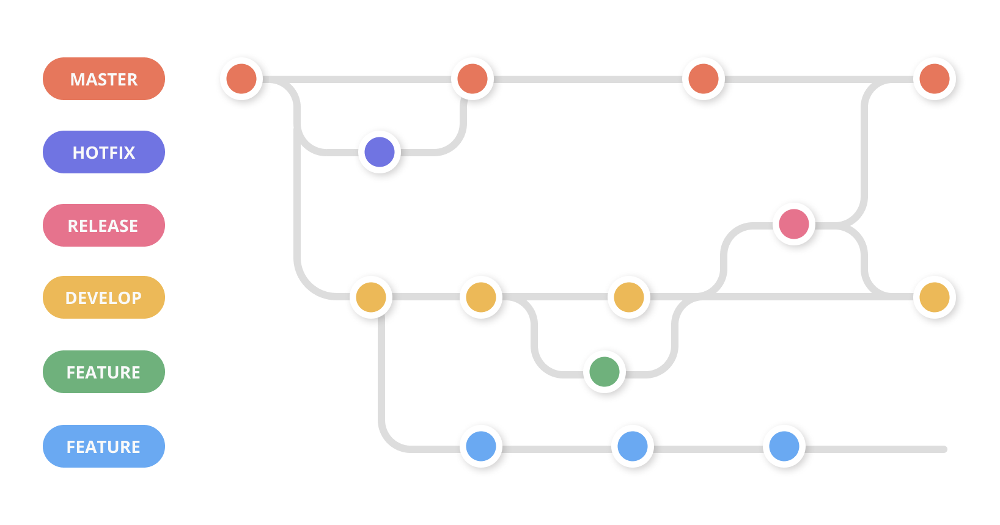
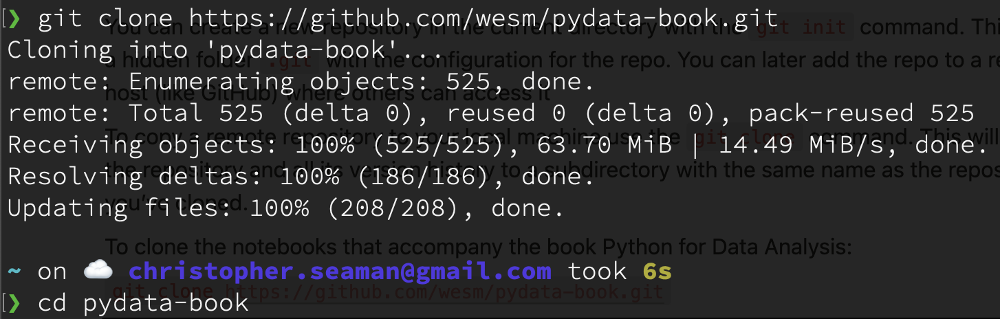
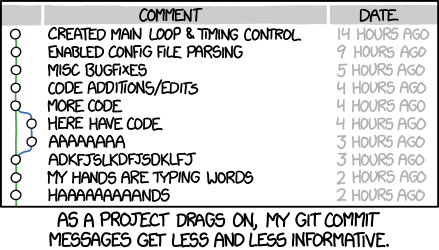
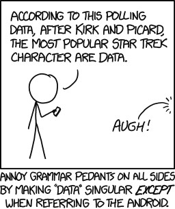
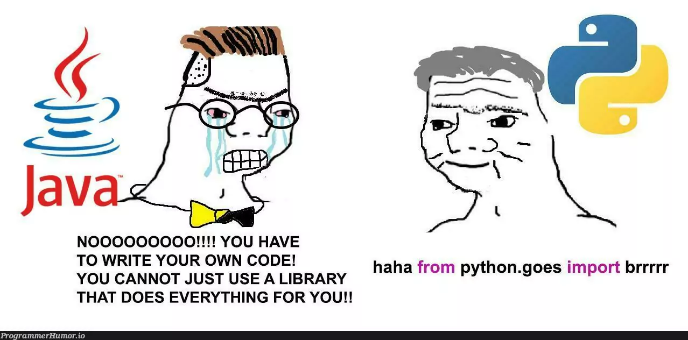

---
notion:
  role: lecture
  status: mapped
  page_id: "271d9fdd-1a1a-8036-9c2b-c4a66ae97d9d"
  url: "https://app.notion.com/p/271d9fdd1a1a80369c2bc4a66ae97d9d"
---

# `git gud` with Version Control

See [BONUS.md](BONUS.md) for the optional extensions.

# VS Code Basics (GUI-first)

We'll start in the editor so Git makes visual sense later.

## Palette Cleanse: Command Palette & Quick Open

- Open Command Palette: View → Command Palette… (Cmd+Shift+P)
- Quick Open files: (Cmd+P)
- Search across files: View → Search (Cmd+Shift+F)

## Themes and Schemes: Make it Py‑pretty

- Change Color Theme: Code → Settings → Theme → Color Theme (or Cmd+K, Cmd+T). I am a fan of:
    - "Tomorrow Night Bright"
    - "GitHub Dark High Contrast"
- Toggle icons: Code → Settings → Theme → File Icon Theme

## Meet the Main Bars

- Activity Bar (left): Explorer, Search, Source Control, Run & Debug, Extensions
- Side Bar: Toggle via View → Appearance → Show Side Bar
- Panel (bottom): Problems, Output, Debug Console, Terminal (toggle: View → Appearance → Panel Position)
- Secondary Side Bar (right): View → Appearance → Show Secondary Side Bar
- Breadcrumbs: View → Appearance → Show Breadcrumbs
- Zen Mode: View → Appearance → Zen Mode (Esc Esc to exit)

## Core Panes You’ll Use

- Explorer: View → Explorer (Cmd+Shift+E)
- Source Control: View → Source Control (Cmd+Shift+G)
- Run & Debug: Run → Start Debugging (F5) or View → Run (Ctrl+Shift+D)
- Extensions: View → Extensions (Cmd+Shift+X)
- Terminal: View → Terminal (Ctrl+`)
- Split Editor: View → Editor Layout → Split Right (or Cmd+\)

## Settings (GUI) you’ll toggle today

- Format on Save: Code → Settings → Settings → Search “Format on Save” → check
- Python Interpreter: Click bottom‑right “Python” status or Cmd+Shift+P → “Python: Select Interpreter”
- Default Formatter (optional): Settings → Search “Default Formatter” → choose “Black” or “Ruff” if installed
- Markdown Preview: Right‑click a .md → “Open Preview to the Side” (Cmd+K V)

## Recommended Extensions (install via View → Extensions)

- Python
- Pylance (can help with debugging later, I prefer ruff)
- Jupyter (we'll use this a lot later)
- Markdown All in One
- markdownlint
- Markdown Checkboxes
- GitHub Markdown Preview
- Bonus mentions: Error Lens, YAML, indent‑rainbow, GitLens

## Break(points) the Ice: 5‑minute hands‑on

1) Change the Color Theme (Preferences: Color Theme)
2) Install “Python” and “Markdown All in One”
3) Turn on “Format on Save” in Settings (GUI)
4) Open a `.py` file → add a breakpoint (click gutter) → Run → Start Debugging
5) Open a `.md` file → right‑click → Open Preview to the Side
6) Make a small edit → View → Source Control → stage, commit (GUI)

# Git Version Control


Don't worry - we're taking a different approach than that xkcd suggests!

## Why Version Control Matters

### The Problem Without Version Control

Picture this: You're working on a data analysis. You create these files:

- `analysis_v1.py`
- `analysis_v2.py`
- `analysis_v2_final.py`
- `analysis_v2_final_ACTUALLY_FINAL.py`
- `analysis_fixed_broken_computer_recovery.py`

Sound familiar? Now imagine collaborating with teammates doing the same thing. Chaos!

### The Git Solution

Git tracks every change, letting you see what changed, restore versions, work in parallel, collaborate, and avoid losing work. Infinite undo plus collaboration.

## Git Concepts - The Mental Model

### Repository (Repo)

Your project folder that Git tracks. Contains your files plus a hidden `.git` folder with all the version history.

### Commit

A saved snapshot of your project at a specific point in time. Like saving a game - you can always come back to this exact state.

### Remote

The version of your repository stored on GitHub (or similar service). Your local computer has a copy, GitHub has a copy, your teammates have copies.

### Branch

A parallel timeline for your project. The main branch contains your official version, feature branches contain experimental work.

*We'll focus on the main branch today—branches come later!*

**Reference:**

- **Repository**: Collection of objects and references
- **Commit**: Snapshot with metadata (author, message, parents)
- **Blob**: File content
- **Tree**: Directory structure
- **Reference**: Human-readable name pointing to commit
- **HEAD**: Current commit reference
- **Branch**: Movable reference to commit
- **Remote**: Reference to repository on another machine



## Essential Git Commands

Basic Git commands let you control what changes are committed using a three-stage workflow: working directory, staging area, repository.

**Reference:**

Essential:

- `git init` - Initialize repository
- `git clone [url]` - Copy remote repository
- `git status` - Show working directory status
- `git add [file]` - Stage changes
- `git commit -m "message"` - Create commit
- `git push [remote] [branch]` - Send commits to remote
- `git pull [remote] [branch]` - Fetch and merge from remote

Helpful but less essential:

- `git remote add [name] [url]` - Add remote
- `git fetch [remote]` - Download commits without merging
- `git remote -v` - List remotes
- `git log` - Show commit history
- `git diff` - Show changes
- `git checkout [commit/branch]` - Switch to commit or branch
- `git branch [name]` - Create branch
- `git merge [branch]` - Merge branch

**Brief Example:**

```bash
# Local repository workflow
git init                      # Start new repository
git add analysis.py           # Stage file
git commit -m "Add analysis script"  # Create commit
git branch feature-analysis  # Create branch
git checkout feature-analysis # Switch to branch

# Remote repository workflow
git clone https://github.com/user/repo.git  # Clone existing repo
git push origin main          # Push changes
git pull origin main          # Pull updates
```



**Good vs. Bad Commit Messages**

```bash
# Good commit message
git commit -m "Add data validation to analysis script

- Validate input file exists before processing
- Check data format matches expected schema
- Add error handling for malformed data

Fixes issue #123"

# Bad commit message
git commit -m "minor changes"
```



## VS Code Git Integration

### Setting Up Git in VS Code

**Reference:**

1. Install VS Code (if not already done)
2. Open VS Code → View → Source Control (or Ctrl+Shift+G)
3. If first time: VS Code will prompt to configure Git username/email

**Reference:**

- **Source Control Panel**: `Ctrl+Shift+G` (Windows/Linux) or `Cmd+Shift+G` (Mac)
- **Stage Changes**: Click `+` next to files in "Changes" section
- **Commit**: Type message in text box, press `Ctrl+Enter` (Windows/Linux) or `Cmd+Enter` (Mac)
- **View Differences**: Click on modified files to see changes
- **Branch Management**: Click branch name in status bar to switch/create branches
- **Push/Pull**: Use sync button or command palette (`Ctrl+Shift+P`)

**VS Code Git Workflow:**

```
1. Edit files (e.g., analysis.py)
2. Ctrl+Shift+G → Open Source Control panel
3. Click + next to changed files to stage
4. Type commit message: "Add data validation to analysis script"
5. Ctrl+Enter to commit
6. Click sync button to push to GitHub
```

## Git Workflow: Branching and Merging

Git branching develops features in isolation before merging to main, enabling parallel development and safe experimentation.

**Reference:**

- `git branch [name]` - Create new branch
- `git checkout [branch]` - Switch to branch
- `git checkout -b [name]` - Create and switch to new branch
- `git merge [branch]` - Merge branch into current branch
- `git branch -d [name]` - Delete branch
- `git push origin [branch]` - Push branch to remote

**Branching Workflow:**

```bash
# Create feature branch
git checkout -b feature/data-analysis
# Make changes, commit
git add .
git commit -m "Add data analysis functionality"
git push origin feature/data-analysis

# Switch back to main and merge
git checkout main
git merge feature/data-analysis
git push origin main

# Clean up feature branch
git branch -d feature/data-analysis
```

**Merge Conflict Resolution:**
When Git cannot automatically merge changes, it creates merge conflicts that must be resolved manually:

1. Open conflicted files in VS Code
2. Choose which changes to keep
3. Remove conflict markers (`<<<<<<<`, `=======`, `>>>>>>>`)
4. Stage resolved files: `git add [file]`
5. Complete merge: `git commit`

## GitHub Web Interface

GitHub's web interface manages repositories, enables collaboration, and organizes projects.

**Reference:**

- **Repository Creation**: "New repository" button, choose name and settings
- **File Management**: "Add file" → "Create new file" or "Upload files"
- **Commit via Web**: Edit files directly, add commit message, commit
- **Pull Requests**: "Pull requests" tab → "New pull request"
- **Issues**: "Issues" tab → "New issue" for bug reports and feature requests
- **Project Settings**: Settings tab for permissions, branches, and integrations
- **Code Review**: Comment on specific lines, approve/request changes

**Gitignore Files:**
A `.gitignore` file specifies which files and directories Git should ignore when tracking changes. This is crucial for data science projects to avoid committing sensitive data, large datasets, or generated files.

**Reference:**

- `.gitignore` patterns use glob patterns
- `#` for comments
- `*` matches any characters
- `?` matches single character
- `[abc]` matches any character in brackets
- `!` negates pattern
- `**/` matches directories recursively

**Brief Example:**

```
# Python cache files
__pycache__/
*.pyc

# Data and secrets
data/raw/*.csv
.env
*.key

# IDE files
.vscode/
.idea/

# Track important files
!data/processed/important_results.csv
```

**Brief Example:**

Create repository: github.com → "+" → "New repository" → Name, description, add README → Create.

Add files: "Add file" → "Create new file" → Name, add code, commit message → Commit.

# Markdown Documentation

Markdown is a lightweight markup language for formatted text, essential for documentation and project communication. Files are human-readable and render beautifully on GitHub.

**Reference:**

- Headers: `# H1`, `## H2`, `### H3`
- Bold: `**bold text**`
- Italic: `*italic text*`
- Code: `` `inline code` ``
- Code blocks: ```language
- Lists: `- item` or `1. item`
- Links: `[text](url)`
- Images: ``
- Tables: `| col1 | col2 |`

**Brief Example:**

````markdown
# Data Analysis Report

## Overview
Analyzes study time vs. performance.

## Key Findings
- More hours → higher grades
- Regular habits help

## Code Example
```python
grades = [85, 92, 78]
average = sum(grades) / len(grades)
print(f"Average grade: {average:.1f}")
```
````

# Python Fundamentals (McKinney Ch2+3)



*[Data](https://xkcd.com/1429/) by xkcd — in Python, everything is an object. In Star Trek, Data is too.*

Python emphasizes readable, practical data manipulation. Its values are objects with consistent behavior.

## What is new in Lecture 02?

Lecture 01 established the command line, Python installation, variables, basic expressions, and introductory scripts. This lecture uses that foundation in VS Code and Git, then moves into Python’s object model, imports, collections and mutability, functions, file I/O, targeted exceptions, and the `__main__` entry-point pattern.



## Brief review: scalars, strings, output, and control flow

Lecture 01 introduced these building blocks; focus here on how they support the new topics.

```python
count, average = 150, 87.3
name = "  Alice Johnson  ".strip()
analysis_ready = count > 0 and average > 0

if name.endswith("son") and analysis_ready:
    print(f"{name}: {average:.1f}%")

for number in range(3):
    print(number)
```

Useful reminders: `int`, `float`, `str`, `bool`, and `None` are common scalar types; use arithmetic, comparisons, and `and`/`or`/`not` as needed; strings provide methods such as `.strip()`, `.lower()`, `.split()`, `.replace()`, and `.isalpha()`; and `print()` with f-strings makes results readable. Indentation, `if`/`elif`/`else`, `for`, `while`, `break`, and `continue` control execution.

## Language Semantics and Object Model


Python uses indentation for code structure, creating clean code. Every value is an object with type information, enabling dynamic behavior.

**Reference:**
- Indentation defines code blocks (4 spaces recommended)
- `#` for comments
- `type(object)` - Get object type
- `isinstance(object, type)` - Type checking
- `id(object)` - Get object identity
- `dir(object)` - List object attributes

**Brief Example:**
```python
# Indentation matters
x = 3
if x > 0:
    print("Positive")
    y = x * 2

print(type(42))        # <class 'int'>
print(isinstance("hello", str))  # True
```

## Object Introspection and Dynamic Type Checking

Object introspection examines objects at runtime—their type, attributes, and methods. Valuable for unknown datasets and flexible code.

Python uses **duck typing**: "If it walks like a duck and quacks like a duck, then it must be a duck." If an object supports the needed operations, you can use it—regardless of its actual type.


This means functions work with any object that behaves as expected, not just those of a specific type.

**Reference:**

- `type(object)` - Returns the object's type
- `dir(object)` - Lists attributes and methods
- `help(object)` - Shows documentation

```python
# Duck typing: unrelated types can support the same operation.
label = "dataset"
grades = [85, 92, 78]

print(len(label))   # str provides a length: 7
print(len(grades))  # list also provides a length: 3
```

Neither value is converted to the other's type. Python attempts the operation the code requests; an unsupported operation usually raises `TypeError`.

## Imports and Modules

A **module** is a Python file that provides reusable names. An `import` loads a module and binds a name for it in the current program. Modules in the standard library ship with Python; third-party modules must be installed in the active environment first.

**Reference:**

- `import module` - Import a module and use `module.name`
- `import module as alias` - Bind a shorter local name; this does not copy the module
- `from module import name` - Import one specific name

```python
import math
import statistics as stats
from math import pi

print(math.sqrt(16))
print(stats.mean([85, 92, 78]))
print(pi)
```

For a quick import check from a Bash terminal, `-c` runs the Python code supplied as a string:

```bash
python3 -c "import statistics; print(statistics.mean([1, 2, 3]))"
```

## Data Structures: Lists and Tuples

Lists provide mutable sequences for data. Tuples offer immutable sequences useful for fixed records.

**Reference:**

- `list()` - Create list
- `[item1, item2, ...]` - List literal
- `list[index]` - Access one item using a zero-based index
- `list[start:stop]` - Slice from `start` up to, but not including, `stop`
- `list.append(item)` - Add to end
- `list.insert(index, item)` - Insert at position
- `list.remove(item)` - Remove first occurrence
- `list.pop(index)` - Remove and return item
- `tuple()` - Create tuple
- `(item1, item2, ...)` - Tuple literal

**Brief Example:**

```python
# Lists - mutable sequences
grades = [85, 92, 78, 96, 88]
grades.append(90)
grades.insert(1, 87)
total = sum(grades)

# Indexing and slicing
first_grade = grades[0]
last_grade = grades[-1]
middle_grades = grades[1:4]  # Indices 1, 2, and 3
every_other_grade = grades[::2]

# Tuples - immutable sequences
coordinates = (40.7128, -74.0060)
name, age, gpa = ("Alice", 22, 3.8)  # Unpacking
```

## Names, Aliasing, and Mutability

Assignment binds a name to an object; it does not automatically copy the object. Lists, dictionaries, and sets are **mutable**, so they can change in place. Numbers, strings, and tuples are **immutable**, so an operation produces a new value instead of changing the existing object.

Two names are **aliases** when they refer to the same object. A mutation through either alias is visible through the other:

```python
grades = [85, 92, 78]
same_grades = grades
same_grades[0] = 90

print(grades)                 # [90, 92, 78]
print(same_grades is grades)  # True: same object

copied_grades = grades.copy()
copied_grades[0] = 75
print(grades)                 # Still [90, 92, 78]
print(copied_grades)          # [75, 92, 78]
```

Use `==` to compare values. Use `is` for object identity, most commonly in a check such as `value is None`. `list.copy()` makes a new outer list; mutable objects nested inside it are still shared.

## Data Structures: Dictionaries and Sets

Dictionaries provide key-value storage for structured data. Sets offer unique collections with mathematical operations.

**Reference:**

- `dict()` - Create dictionary
- `{key: value, ...}` - Dictionary literal
- `dict[key]` - Access value
- `dict.get(key, default)` - Safe access
- `dict.keys()`, `dict.values()`, `dict.items()` - Iteration
- `set()` - Create set
- `{item1, item2, ...}` - Set literal
- `set.union()`, `set.intersection()`, `set.difference()` - Set operations

**Brief Example:**

```python
# Dictionaries - key-value storage
student = {"name": "Alice", "grade": 85, "major": "Data Science"}
print(student["name"])  # "Alice"
print(student.get("gpa", 0.0))  # Safe access

# Sets - unique collections
math_students = {"Alice", "Bob", "Charlie"}
cs_students = {"Alice", "Diana", "Eve"}
both_subjects = math_students & cs_students  # Intersection
```

## List Comprehensions and Sequence Functions

List comprehensions provide concise syntax for creating lists through transformation and filtering. Sequence functions offer efficient operations.

**Reference:**

- `[expr for item in iterable if condition]` - List comprehension
- `enumerate(iterable)` - Get index and value pairs
- `zip(iterable1, iterable2)` - Combine sequences
- `sorted(iterable)` - Create sorted list
- `reversed(iterable)` - Reverse sequence
- `sum()`, `min()`, `max()`, `len()` - Aggregation functions

**Brief Example:**

```python
# List comprehensions
grades = [85, 92, 78, 96, 88]
passing_grades = [g for g in grades if g >= 80]

# Sequence functions
for index, grade in enumerate(grades):
    print(f"Student {index + 1}: {grade}")

names = ["Alice", "Bob", "Charlie"]
scores = [85, 92, 78]
for name, score in zip(names, scores):
    print(f"{name}: {score}")
```

## Functions

Functions organize code into reusable units with clear interfaces. They enable reuse, testing, and modular design.

**Reference:**

- `def function_name(parameters): ...` - Function definition
- `return value` - Return value
- Function calls: `result = function_name(arguments)`
- Default parameters: `def func(param=default_value):`

**Brief Example:**

```python
# Function definition
def calculate_average(grades):
    """Calculate the average of a list of grades."""
    if not grades:
        return 0
    return sum(grades) / len(grades)

# Function usage
grades = [85, 92, 78, 96, 88]
average = calculate_average(grades)
print(f"Average grade: {average:.1f}")
```

## Basic File I/O Operations

File I/O operations are essential for data science. Python provides simple tools for reading and writing files.

**Reference:**

- `open(file, mode)` - Open file with specified mode
- `'r'` - Read mode (default)
- `'w'` - Write mode (overwrites existing files)
- `'a'` - Append mode (adds to existing files)
- `'x'` - Create mode (fails if file exists)
- `file.read()` - Read entire file content
- `file.readline()` - Read single line
- `file.readlines()` - Read all lines into list
- `file.write(string)` - Write string to file
- `file.close()` - Close file handle
- `with open(...) as file:` - Close the handle automatically when the block ends

**Brief Example:**

```python
# Reading from a file
with open('data.txt', 'r') as file:
    content = file.read()
    print(f"File content: {content}")

# Writing to a file
results = ["Alice: 95", "Bob: 87", "Charlie: 92"]
with open('grades.txt', 'w') as file:
    for result in results:
        file.write(f"{result}\n")

# Appending to a file
with open('log.txt', 'a') as file:
    file.write("2023-12-01: Analysis completed\n")

# Print to file examples
score = 87.3
with open('results.txt', 'w') as file:
    print("Analysis Results", file=file)
    print(f"Average score: {score:.1f}", file=file)

# Avoid print(..., file=open(...)): that pattern leaves closing the file
# handle implicit. Use a with block so the handle is always closed.
with open('debug.log', 'a') as log_file:
    print("Debug info", file=log_file)

# Multiple outputs to same file
data = [85, 92, 78]
with open('report.txt', 'w') as report:
    print("Data Science Report", file=report)
    print("=" * 20, file=report)
    print(f"Total samples: {len(data)}", file=report)
```

## Minimal Exception Handling

An **exception** reports a problem that interrupts normal execution. Use `try`/`except` around the operation that can fail, and catch the specific exception you expect rather than hiding every error.

```python
raw_score = "not available"

try:
    score = float(raw_score)
except ValueError as error:
    print(f"Could not parse score: {error}")
else:
    print(f"Parsed score: {score:.1f}")
```

Opening a missing path raises `FileNotFoundError`; converting invalid numeric text raises `ValueError`. The optional `else` block runs only when the `try` block succeeds.

## `__main__` for script execution

When Python runs a file directly, its special `__name__` variable is set to `"__main__"`. When another file imports it as a module, `__name__` is the module's name. A guard keeps script-only work from running during import:

```python
def main():
    grades = [85, 92, 78, 96, 88]
    average = sum(grades) / len(grades)
    print(f"Average grade: {average:.1f}")


if __name__ == "__main__":
    main()
```

If this is saved as `analysis.py`, the first command runs `main()` and the second only checks that importing the module has no script-only side effects:

```bash
python3 analysis.py
python3 -c "import analysis"
```

# Command-Line Catalog

These are names to recognize from command-line work. The
[command-line bonus](BONUS.md#command-line-essentials) has short explanations
and examples.

| Area | Commands | Purpose |
| --- | --- | --- |
| Navigation | `pwd`, `ls`, `cd` | Show where you are, list contents, and move between directories. |
| Files and directories | `mkdir`, `touch`, `cp`, `mv` | Create directories or empty files, copy items, and rename or move them. |
| Removal | `rm` | Remove a file; destructive, so check the path first. |
| Inspect and search text | `cat`, `head`, `tail`, `grep`, `wc` | Read, preview, search, and count text. |
| Directory overview | `tree` | Display a directory hierarchy when the command is available. |
| Recall and shortcuts | `history`, ↑/↓, `Tab`, `Ctrl+R` | Reuse earlier commands and complete or search command text. |

For this lecture's project work, use the VS Code terminal and focus on the Git commands introduced above:

```bash
git status
git add path/to/file.py
git commit -m "Describe the change"
git diff
git push
```

Lecture 03 owns the next shell pipeline activity; revisit Lecture 01 for the foundational shell workflow.
