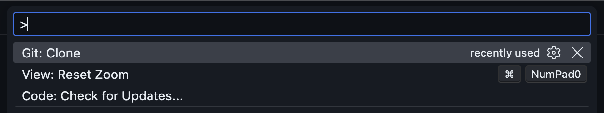
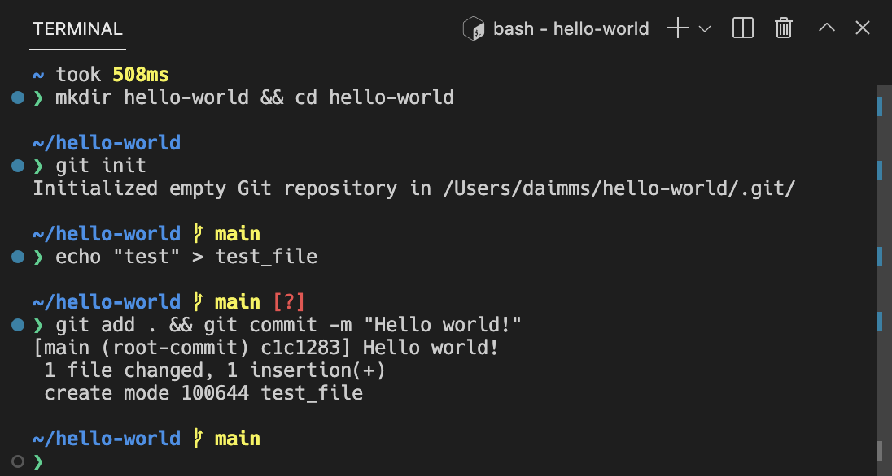
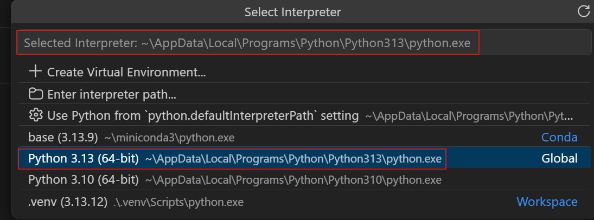
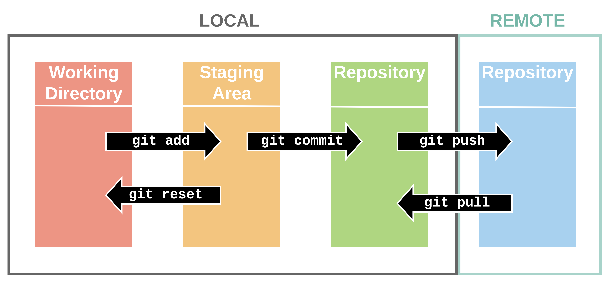
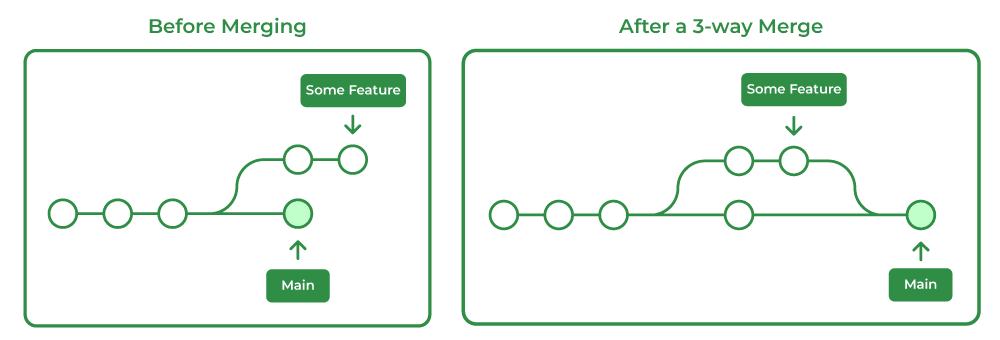
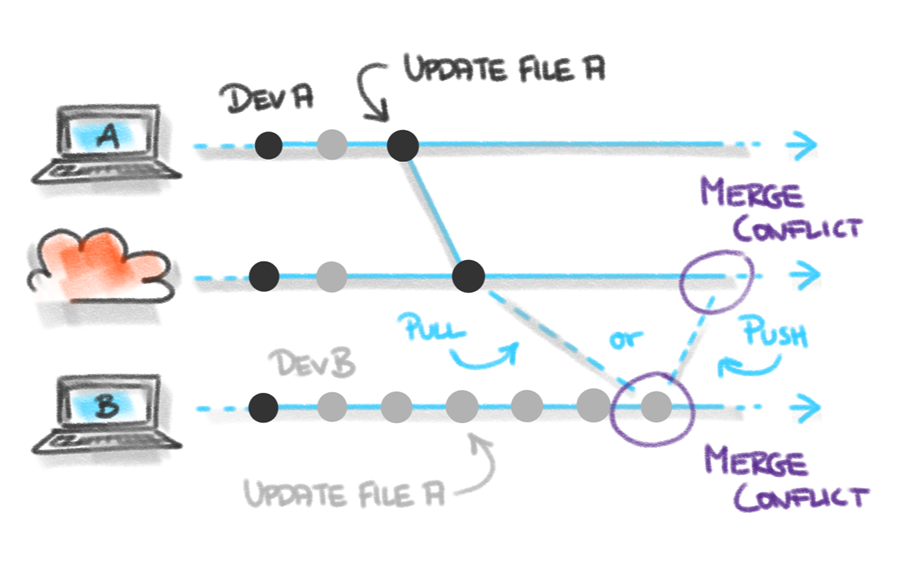
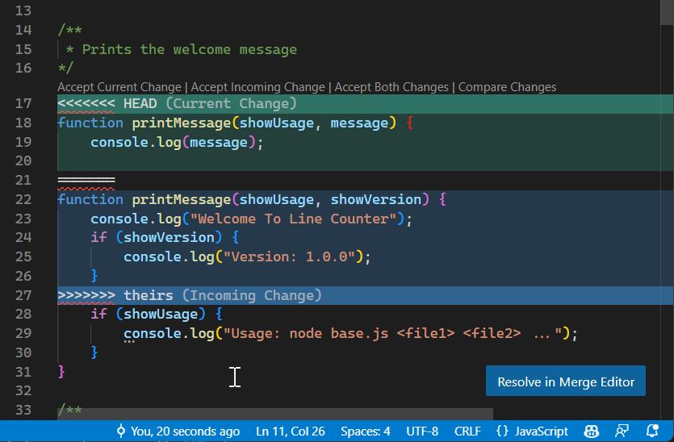
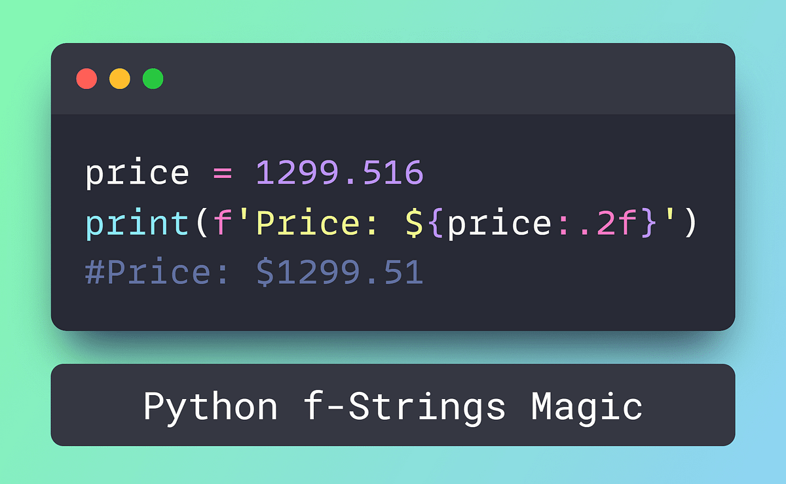
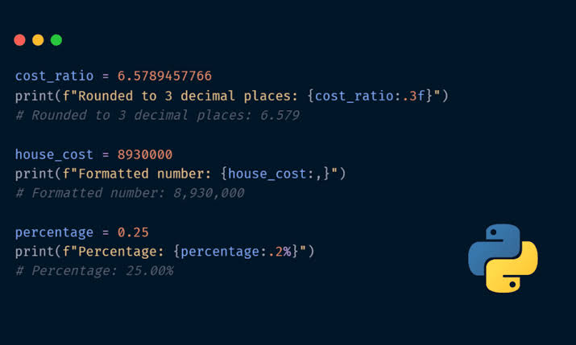
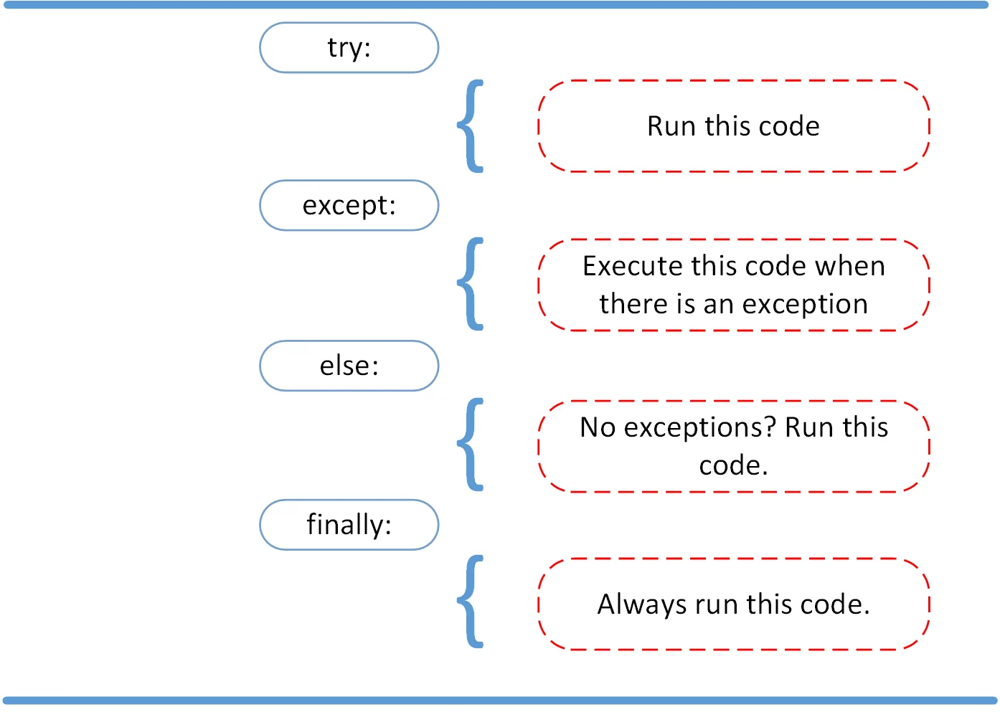

---
notion:
  title_line: "# `git gud` with Version Control"
  role: lecture
  status: mapped
  page_id: "271d9fdd-1a1a-8036-9c2b-c4a66ae97d9d"
  url: "https://app.notion.com/p/271d9fdd1a1a80369c2bc4a66ae97d9d"
---

# `git gud` with Version Control

See [BONUS.md](BONUS.md) for the optional extensions.

[Live Demo Guide](demo/DEMO_GUIDE.md)

[Lecture 01 Notes from Lab](LECTURE_01_CATCHUP.md)

**Note:** After today we should complete McKinney’s _Python for Data Analysis_ through ch03

# VS Code Basics

The **Command Palette** lists every VS Code action by name: type part of a name instead of hunting through menus.



## Palette Cleanse: Command Palette & Quick Open

| Action | Menu | Windows/Linux | macOS |
| --- | --- | --- | --- |
| Open the Command Palette | **View → Command Palette...** | **Ctrl+Shift+P** | **Cmd+Shift+P** |
| Quick Open a file by name | **Go → Go to File...** | **Ctrl+P** | **Cmd+P** |
| Search across files | **View → Search** | **Ctrl+Shift+F** | **Cmd+Shift+F** |

### Reference Card: Finding Your Way Around

- **Activity Bar** (left): Explorer, Search, Source Control, Run and Debug, and Extensions.
- **Panel** (bottom): Terminal, Problems, Output, and Debug Console; toggle it with **View → Appearance → Panel**.

## Less Typing, More Doing

**VS Code's terminal** runs the same shell as a standalone one; recall and edit earlier commands instead of retyping them.



### Reference Card: Shell Shortcuts

- **Tab**: Complete a command or path; if ambiguous, press again to see choices.
- **↑ / ↓**: Recall previous/next commands.
- **← / →**: Move one character.
- **Ctrl+A**: Move to the beginning of the line.
- **Ctrl+E**: Move to the end of the line. On Windows/Linux, VS Code claims **Ctrl+E** for Quick Open, so press **End** there.
- **Ctrl+← / Ctrl+→** (Windows/Linux): Move by word. On Mac, press **Esc**, then **B** or **F**.
- **Ctrl+R**: Search command history; type part of a command, press again for older matches.
- **Ctrl+W**: Delete the preceding word.
- **Ctrl+L**: Clear the view without deleting command history.
- **Enter**: Run the edited command.
- **Ctrl+C**: Abandon the line for a fresh prompt.

These work while the terminal has focus, and **Ctrl** means Control even on Mac.

## Settings

- Open settings: Command Palette → **Preferences: Open Settings (UI)**, or **Ctrl+,** (Windows/Linux), **Cmd+,** (macOS).
- Python interpreter: Command Palette → **Python: Select Interpreter**, then choose the course's Python 3.13.



Make it Py-pretty: extensions, themes, window layouts, and format-on-save are in [BONUS.md](BONUS.md#vs-code-extensions-themes-and-settings).

## Command-Line Catalog

Commands to recognize from the shell; the [command-line bonus](BONUS.md#command-line-essentials) has examples.

| Area | Commands | Purpose |
| --- | --- | --- |
| Navigation | `pwd`, `ls`, `cd` | Show where you are, list contents, and move between directories. |
| Files and directories | `mkdir`, `touch`, `cp`, `mv` | Create directories or empty files, copy items, and rename or move them. |
| Removal | `rm` | Remove a file; destructive, so check the path first. |
| Inspect and search text | `cat`, `head`, `tail`, `grep`, `wc` | Read, preview, search, and count text. |
| Directory overview | `tree` | Display a directory hierarchy when the command is available. |
| Recall and shortcuts | `history`, ↑/↓, `Tab`, `Ctrl+R` | Reuse earlier commands and complete or search command text. |

# Git Version Control


## Why Version Control Matters

Without version control, a project folder fills up like this:

```text
analysis_v1.py
analysis_v2.py
analysis_v2_final.py
analysis_v2_final_ACTUALLY_FINAL.py
analysis_fixed_broken_computer_recovery.py
```

**Version control** replaces the pile with one history of every change: see what changed, restore any version, and work in parallel with teammates. **Git** is the version control system this course uses.

## Git Concepts: The Mental Model

Git records a project as a series of **commits**: snapshots of the tracked files, each with an author, time, and message saying why. A change moves through these steps:



### Reference Card: Git Vocabulary

- **Working tree**: Your files as they are now, including uncommitted edits.
- **Diff**: Line-by-line comparison of two versions; click a changed file in Source Control.
- **Staging area**: Changes selected for the next commit; a later edit needs staging again.
- **Commit**: A snapshot with author, time, and message.
- **Repository (repo)**: Your files plus their recorded history in `.git`.
- **Branch**: A named line of commits; `main` holds the official version.
- **Local branch**: The branch on your computer; it can be ahead of or behind GitHub.
- **Remote**: The GitHub copy, usually named `origin`.
- **Synchronize**: **Sync Changes** pulls incoming commits and pushes outgoing ones.
- **Merge**: Combine another branch's commits into the current branch.
- **Conflict**: Both branches changed the same lines, so Git asks you to choose.

## VS Code Git Integration

Source Control runs the diagram's steps: review a change, stage it, commit, then sync to GitHub.


### Reference Card: VS Code Git Actions

- **Source Control**: **View → Source Control**, **Ctrl+Shift+G** (Control on macOS too).
- **Initialize Repository**: The Source Control button in a folder that is not yet a repository; the same as `git init`.
- **Stage Changes**: Click `+` next to a file under **Changes**.
- **Commit**: Type a message and select **Commit**.
- **View differences**: Click a changed file to see its diff.
- **Push/Pull**: Select **Sync Changes**, or Command Palette → **Git: Push** / **Git: Pull**.

### Good vs. Bad Commit Messages

In the message box, write a summary that finishes "This commit will...", then a blank line and why:

```bash
# Good commit message
git commit -m "Add blood pressure range check" \
  -m "Systolic readings outside 60-250 mmHg are recording errors,
so the report now skips them instead of averaging them in."

# Bad commit message
git commit -m "minor changes"
```


## Git Workflow: Branching and Merging

A **branch** is a separate line of commits. Build a change on one, such as a new flag for abnormal lab values, while `main` keeps the version your team trusts; then **merge** the branch into `main`, or abandon it.



| Since the branch split, `main` has | The merge |
| --- | --- |
| New commits of its own | Adds a **merge commit** that joins both lines, as in the picture |
| No new commits | Is a **fast-forward**: `main` moves up to the branch's newest commit, and no merge commit is made |

### Reference Card: Branches in VS Code

- **Git: Create Branch...** (Command Palette): Name the branch, such as `feature/measurement-summary`; VS Code switches to it.
- Branch name in the status bar (lower left): Click it to switch branches, or select **Create new branch...**. Switching swaps the files in your folder to that branch's version.
- **Publish Branch** (Source Control): Send a new branch to GitHub; **Sync Changes** keeps it current after that.
- **Git: Merge...** (Command Palette): Combine the chosen branch's commits into the branch you are on.

## Merge Conflicts

A conflict happens when two branches, or your commits and a teammate's, changed the same lines, so Git cannot pick a version. The merge or sync stops, the file appears under **Merge Changes** in Source Control, and `git status --short` marks it `UU`.



### Resolving on the Command Line (for the adventurous)

Git writes both versions into the file between markers:

```text
# Practice notes
<<<<<<< HEAD
Experiment: compare median systolic.
=======
Experiment: compare three systolic summaries.
>>>>>>> experiment
```

| Lines | Hold | VS Code label |
| --- | --- | --- |
| `<<<<<<< HEAD` to `=======` | The branch you are on | **Current Change** |
| `=======` to `>>>>>>> experiment` | The branch you are merging in | **Incoming Change** |

Edit the file to the version you want, delete the three marker lines, then stage and commit to finish the merge:

```bash
git add notes.md
git commit -m "Merge branch 'experiment'"
```

### Resolving in VS Code

Microsoft wrote this up better than me at: [https://code.visualstudio.com/docs/sourcecontrol/merge-conflicts](https://code.visualstudio.com/docs/sourcecontrol/merge-conflicts)



Open the conflicted file from **Merge Changes** and resolve it one of two ways:

- **Inline**: Above the block, select **Accept Current Change**, **Accept Incoming Change**, or **Accept Both Changes** (**Compare Changes** shows the two side by side first), or edit the lines yourself and delete the three marker lines. Save, then stage the file with **+**.
- **Merge editor**: Select **Resolve in Merge Editor** at the lower right of the file. **Incoming** (left) and **Current** (right) sit above **Result**; select **Accept Incoming** or **Accept Current** above each conflict, check **Result**, and select **Complete Merge**, which saves and stages the file.

Then select **Commit**; VS Code fills in the merge message.

## Alternative: Git in the Terminal

Every Source Control button runs a Git command. Demo 1's terminal path uses these; [BONUS.md](BONUS.md) covers the rest.

### Reference Card: Git in the Terminal

| Task | Command | Result |
| --- | --- | --- |
| Start a repository | `git init` | A hidden `.git` folder |
| Check state | `git status` | Modified, staged, or "working tree clean"; `--short` prints one line per file |
| Inspect edits | `git diff` | Unstaged line changes: `+` added, `-` removed |
| Stage | `git add FILE` | FILE's changes go into the next commit |
| Commit | `git commit -m "message"` | A new local commit |
| Create and switch | `git checkout -b NAME` | A new branch at the current commit |
| Switch | `git checkout NAME` | Files change to that branch's version |
| Merge | `git merge NAME` | NAME's commits added to the current branch |
| History | `git log --oneline` | One line per commit; press `q` if the list fills the screen |
| Share | `git push` / `git pull` | Send / receive commits on a branch already linked to GitHub |
| Set your identity | `git config user.name "..."`, `git config user.email "..."` | Your name and GitHub noreply email |

## GitHub Web Interface

GitHub's website shows the remote copy: check what arrived after **Sync Changes**, or edit and upload files without cloning. A website edit is a remote commit, so **Sync Changes** before working locally again.

### Reference Card: GitHub Web Interface

- **Code** tab and branch menu: See the files on `main` or any published branch.
- **Add file → Create new file / Upload files**: Commit new files directly on GitHub.
- Pencil icon on a file: Edit it in the browser, then **Commit changes**.
- **Actions** tab: Results of the automatic assignment checks.
- **+ → New repository**: Create an empty remote with a README.

## `.gitignore`

<callout icon="⚠️" color="yellow_bg">
	Never commit protected health information (**PHI**), personally identifiable information (**PII**), passwords, or keys. A commit is permanent: deleting the file later leaves it in every earlier snapshot and every clone.
</callout>

A **`.gitignore`** file lists **patterns** for files Git should not track. List clutter there too, such as Python's `__pycache__/` folder. A pattern does not untrack files already committed and pushed commits with unwanted files are difficult-to-impossible to undo cleanly.

`git status --short` marks untracked files `??`. Before and after a `.gitignore` with `__pycache__/`, `*.pyc`, and `data/raw/*.csv`:

```text
Before                  After
?? __pycache__/         ?? .gitignore
?? data/                ?? main.py
?? main.py              ?? vitals_tools.py
?? vitals_tools.py
```

`data/` disappears because every file in it is ignored.

### Reference Card: Ignore Patterns

- `# comment`: A note; Git skips the line.
- `*.csv`: Every file ending in `.csv`.
- `__pycache__/`: A directory and everything in it; the trailing `/` matches directories only.
- `file?.txt`: Any one character in place of `?`, such as `file1.txt`.
- `*.py[cod]`: Any one of the bracketed characters, so `.pyc`, `.pyo`, and `.pyd` files.
- `!keep.csv`: Re-include a file matched by an earlier pattern.
- `**/cache/`: A `cache` directory at any depth.

### Code Snippet: A Project's `.gitignore`

```gitignore
# Hint: .gitignore is just a text file

# Python cache files
__pycache__/
*.pyc

# Data and secrets
data/raw/*.csv
.env
*.key

# IDE files
.vscode/
.idea/

# Keep the codebook, which the raw-data pattern above ignores
!data/raw/codebook.csv
```

# LIVE DEMO!

# Python Fundamentals


Health data rarely fits one value per variable: a patient has several readings, a visit pairs an ID with a date, and a clinic session has a set of patients.

## F-Strings and Input

<columns>
	<column ratio="50">
		
	</column>
	<column ratio="50">
		
	</column>
</columns>

An **f-string** is a string with `f` before the opening quote. Python replaces each `{expression}` inside it with that expression's value. A **format spec** after a colon inside the braces controls how the value looks.

```text
f"Above average by {systolic - clinic_average:.1f} mmHg"
                    │                         └── format spec: one decimal place
                    └── any expression: a variable, a calculation, a function call
```

```python
patient_id = "P002"
systolic = 142
clinic_average = 128.4

print(systolic - clinic_average)                                  # 13.599999999999994
print(f"{patient_id}: {systolic} mmHg")                           # P002: 142 mmHg
print(f"Above average by {systolic - clinic_average:.1f} mmHg")   # Above average by 13.6 mmHg
```

### Reference Card: Format Specs

For `bmi = 22.857`, `visits = 15432`, `adherence = 0.847`, `p_value = 0.000034`, `systolic = 128`, `patient_id = "P002"`, and `visit_number = 7`:

| Spec | Meaning | Example | Output |
| --- | --- | --- | --- |
| none | The value as `print()` shows it | `f"{bmi}"` | `22.857` |
| `.1f` | One decimal place | `f"{bmi:.1f}"` | `22.9` |
| `.0f` | Rounded to a whole number | `f"{bmi:.0f}"` | `23` |
| `d` | Integer; a float raises `ValueError` | `f"{systolic:d}"` | `128` |
| `,` | Thousands separator | `f"{visits:,}"` | `15,432` |
| `,.2f` | Specs combine: separator and two decimals | `f"{visits:,.2f}"` | `15,432.00` |
| `.1%` | Fraction as a percentage | `f"{adherence:.1%}"` | `84.7%` |
| `.2e` | Scientific notation, two decimals | `f"{p_value:.2e}"` | `3.40e-05` |
| `>8` | Right-align in 8 characters; the brackets show the padding | `f"[{systolic:>8}]"` | `[     128]` |
| `<8` | Left-align in 8 characters | `f"[{patient_id:<8}]"` | `[P002    ]` |
| `0>4` | Pad with zeros to 4 characters | `f"{visit_number:0>4}"` | `0007` |
| `03d` | Integer padded with zeros to 3 digits | `f"{visit_number:03d}"` | `007` |

### Reference Card: Keyboard Input

- `input(prompt)`: Show the prompt and return what was typed, always as a string; `""` when the user presses Enter alone.
- `int(text)`, `float(text)`: Convert numeric text before doing arithmetic; `ValueError` when it is not a number.

### Code Snippet: Read a Number from the Keyboard

```python
raw_temp = input("Temperature (°C): ")   # type 38.4, then press Enter
print(type(raw_temp))
temperature = float(raw_temp)
print(f"{temperature:.1f} °C, fever: {temperature >= 38.0}")
```

```text
Temperature (°C): 38.4
<class 'str'>
38.4 °C, fever: True
```

## Lists and Tuples

A **list** holds values in order inside square brackets, such as one patient's systolic readings across visits. Each item has an **index**, its position counting from 0; negative indexes count back from the end. An index in square brackets gets one item. A **slice** `start:stop` gets a new list from `start` up to, but not including, `stop`; leave out either end to run to that end.

| Item | `128` | `142` | `118` | `136` |
| --- | --- | --- | --- | --- |
| Index | 0 | 1 | 2 | 3 |
| Negative index | -4 | -3 | -2 | -1 |

```python
readings = [128, 142, 118, 136]
print(readings[0], readings[-1])     # 128 136
print(readings[1:3])                 # [142, 118]: index 3 is excluded
print(readings[:2], readings[-2:])   # [128, 142] [118, 136]: the first two, the last two
```

A list is **mutable**: it can change after you create it. `.append()` adds an item at the end, and assigning to an index replaces one.

```python
readings.append(124)
readings[0] = 130
print(readings)   # [130, 142, 118, 136, 124]
```

A **tuple** is written with parentheses and is **immutable**: it cannot change, which suits a fixed record such as a patient ID and a visit date. Indexing and slicing work as on a list. **Unpacking** assigns each item to its own name, one name per item.

```python
visit = ("P001", "2026-09-18")
patient_id, visit_date = visit
print(patient_id, visit_date)   # P001 2026-09-18
visit[0] = "P002"               # TypeError: 'tuple' object does not support item assignment
```

### Reference Card: Lists and Tuples

| Task | Syntax | Result |
| --- | --- | --- |
| Create | `[128, 142]`, `[]`, `("P001", "2026-09-18")`, `list(items)` | A list, an empty list, a tuple, a new list copied from any sequence |
| Get one item | `items[0]`, `items[-1]` | The first item, the last item |
| Slice | `items[start:stop]`, `items[start:stop:step]` | A new list or tuple from `start` up to, not including, `stop`; `step` takes every `step`th item, and `[::-1]` reverses |
| Add | `items.append(x)` | `x` added at the end; lists only |
| Insert | `items.insert(i, x)` | `x` placed at index `i`; lists only |
| Remove | `items.remove(x)`, `items.pop(i)` | The first `x` removed; item `i` removed and returned |
| Replace | `items[i] = x` | Lists only; a tuple raises `TypeError` |
| Unpack | `a, b = pair` | One name per item; a different count raises `ValueError` |

### Reference Card: Summarize a Collection

| Call | Returns | For `[128, 142, 118]` |
| --- | --- | --- |
| `sum(items)` | The total | `388` |
| `len(items)` | The number of items | `3` |
| `min(items)`, `max(items)` | The smallest, the largest | `118`, `142` |
| `sorted(items)` | A new list in order; `items` is unchanged | `[118, 128, 142]` |

### Code Snippet: Rank Readings

```python
readings = [128, 142, 118, 136]
ranked = sorted(readings)
print(ranked)        # [118, 128, 136, 142]
print(ranked[-2:])   # [136, 142]: the two highest
print(readings)      # [128, 142, 118, 136]: unchanged
print(f"Mean: {sum(readings) / len(readings):.1f} mmHg")   # Mean: 131.0 mmHg
```

## Dictionaries and Sets

A **dictionary** stores **key-value pairs** in curly braces, such as an encounter's `"patient_id"` and `"systolic"` fields. Square brackets look up a key; `.get()` gives a default when the key is missing. Inside an f-string, write the key in single quotes.

```python
encounter = {"patient_id": "P001", "systolic": 128}
print(encounter["systolic"])                # 128
print(encounter.get("follow_up", "none"))   # none
print("follow_up" in encounter)             # False
encounter["diastolic"] = 82                 # add a key, or replace its value
for field, value in encounter.items():
    print(f"{field}: {value}")
print(f"Systolic: {encounter['systolic']} mmHg")
```

```text
128
none
False
patient_id: P001
systolic: 128
diastolic: 82
Systolic: 128 mmHg
```

A **set** holds distinct values inside curly braces, with no keys and no order. `set(items)` drops the repeats, `&` keeps the values two sets share, and `sorted()` turns a set into an ordered list for display.

```python
visit_ids = ["P001", "P002", "P001", "P003"]   # P001 came in twice
patients = set(visit_ids)
print(len(visit_ids), len(patients))           # 4 3
flagged = {"P002", "P003", "P005"}
print(sorted(patients & flagged))              # ['P002', 'P003']
```

### Reference Card: Dictionaries and Sets

| Task | Syntax | Result |
| --- | --- | --- |
| Create a dictionary | `{"patient_id": "P001", "systolic": 128}`, `dict(patient_id="P001", systolic=128)`, `{}` | A dictionary; `dict(key=value, ...)` builds the same one from keyword arguments; `{}` is an empty one |
| Look up | `d[key]` | The value; `KeyError` when `key` is missing |
| Look up with a default | `d.get(key, default)` | The value, or `default` when `key` is missing |
| Add or replace | `d[key] = value` | `d` changed in place |
| Hold many records | `[{"patient_id": "P001", "systolic": 128}, ...]` | A list of dictionaries, one per encounter; `records[0]["systolic"]` reads the first one's value |
| Loop over pairs | `for key, value in d.items():` | Each key with its value |
| Keys or values only | `d.keys()`, `d.values()` | The keys, or the values, to loop over |
| Create a set | `{"P001", "P002"}`, `set(items)` | Distinct values; `set()` is an empty one |
| Add to a set | `s.add(x)` | `s` changed in place |
| Membership | `x in s` | `True` or `False`; also works on lists, tuples, and dictionary keys |
| Compare sets | `a & b`, `a \| b`, `a - b` | In both, in either, only in `a`; the same as `a.intersection(b)`, `a.union(b)`, `a.difference(b)` |

## Functions

A **function** is a named block of code: define it once with `def`, then call it wherever the job repeats. The names in its parentheses are **parameters**, the values you pass when you call it are **arguments**, and `return` sends a **return value** back to the caller. A **docstring**, a string on the body's first line, says what the function returns.

A function with no `return` gives back `None`, Python's value for "no result." An empty list, `""`, `0`, and `None` all count as false in an `if`, so check a result with `is None`: a real average can be `0.0`.

```python
def mean_reading(readings):                # name and parameter
    """Return the average, or None when there are no readings."""   # docstring
    if not readings:                       # an empty list counts as false
        return None
    return sum(readings) / len(readings)   # the return value

print(mean_reading([118, 124, 130]))   # 124.0: the list is the argument
print(mean_reading([]))                # None
print(mean_reading([0, 0]) is None)    # False: 0.0 is a real average
```

A **default argument** is the value a parameter takes when the caller leaves it out:

```python
def is_high(systolic, cutoff=130):
    """Return True when systolic is at or above cutoff."""
    return systolic >= cutoff

print(is_high(128))               # False
print(is_high(128, cutoff=120))   # True
```

### Reference Card: Functions

| Task | Syntax | Notes |
| --- | --- | --- |
| Define | `def name(param1, param2):` | Indent the body under the colon |
| Document | `"""Return ..."""` as the body's first line | The docstring |
| Return | `return value` | Ends the call; no `return`, or a bare one, gives `None` |
| Return two values | `return first, second` | Sends back one tuple |
| Call | `result = name(arg1, arg2)` | Stores the return value |
| Unpack two values | `first, second = name(arg1)` | One name per returned value |
| Default | `def name(param=default):` | Used when the caller omits `param` |
| Pass by name | `name(param=value)` | Any order; clearer for options |
| Check for no result | `result is None` | `0` and `0.0` are not `None` |

### Code Snippet: Return Two Values

`return usable, skipped` sends back a tuple, and the caller unpacks it into two names.

```python
def usable_readings(values):
    """Return the readings from 60 to 250 mmHg and how many were skipped."""
    usable = []
    skipped = 0
    for value in values:
        if 60 <= value <= 250:
            usable.append(value)
        else:
            skipped += 1
    return usable, skipped

readings, skipped = usable_readings([118, 912, 136])
print(readings)   # [118, 136]
print(skipped)    # 1
```

## Imports and Modules

A **module** is a Python file of reusable names, and `import` loads one into your program. **Standard-library** modules such as `math` and `statistics` ship with Python; third-party modules must be installed first. Any `.py` file you write is a module too, named after the file without `.py`.


### Reference Card: Imports and Modules

- `import module`: Load a module; use its names as `module.name`.
- `import module as alias`: Load it under a shorter name, such as `stats`.
- `from module import name`: Load one name to use without the prefix.
- `from module import name1, name2`: Load several names; for a long list, wrap the names in parentheses, one per line.
- `python3 -c "code"`: Run a line of Python from the terminal.

### Code Snippet: Use a Module

```python
import math
import statistics as stats
from math import pi

print(math.sqrt(16))                 # 4.0
print(stats.mean([128, 142, 120]))   # 130
print(pi)                            # 3.141592653589793
```

For a quick check in the terminal, this prints `130`:

```bash
python3 -c "import statistics; print(statistics.mean([128, 142, 120]))"
```

### Code Snippet: Import Your Own Module

Save two helpers in `vitals_tools.py`:

```python
# vitals_tools.py
def mean_reading(readings):
    return sum(readings) / len(readings)

def highest_reading(readings):
    return max(readings)
```

Import both from a script in the same folder:

```python
# report.py
from vitals_tools import highest_reading, mean_reading

readings = [128, 142, 118]
print(f"Mean: {mean_reading(readings):.1f}, highest: {highest_reading(readings)}")   # Mean: 129.3, highest: 142
```

With more names, list one per line inside parentheses:

```python
from vitals_tools import (
    highest_reading,
    mean_reading,
)
```

Run `python3 report.py` from that folder. The first import creates a `__pycache__/` folder, which your `.gitignore` keeps out of Git. Importing runs the module top to bottom, so a `print()` at its top level runs on import too; `__main__` below fixes that.

# LIVE DEMO!

# Files and Reusable Scripts

A script's variables vanish when it ends, so results worth keeping go in files.

## String Methods

A data file arrives as lines of text, one record per line. String methods take a line apart and join lines back into text; each returns a new value and leaves the original unchanged.

```text
'P001,2026-09-18,128\n'
    .strip()     → 'P001,2026-09-18,128'
    .split(",")  → ['P001', '2026-09-18', '128']
```

### Reference Card: String Methods

| Method | Purpose | Example | Result |
| --- | --- | --- | --- |
| `text.strip()` | Remove spaces and newlines from both ends | `"128\n".strip()` | `'128'` |
| `text.split(",")` | Split at each comma into a list of strings | `"P001,128".split(",")` | `['P001', '128']` |
| `"\n".join(lines)` | Join strings with a newline between each; for a final one, add `"\n"` with `+` | `"\n".join(["P001", "P002"])` | `'P001\nP002'` |
| `text.replace(old, new)` | Replace every `old` with `new` | `"P001\nP002".replace("\n", ", ")` | `'P001, P002'` |
| `text.splitlines()` | Split into lines, dropping the newlines | `"P001\nP002\n".splitlines()` | `['P001', 'P002']` |
| `text.upper()` | Uppercase copy (Lecture 01) | `"mmHg".upper()` | `'MMHG'` |
| `text.endswith(end)` | Check the ending | `"vitals.csv".endswith(".csv")` | `True` |

### Code Snippet: Split a CSV Row

```python
row = "P001,2026-09-18,128\n"                 # one line, as a file gives it
fields = row.strip().split(",")
print(fields)                                 # ['P001', '2026-09-18', '128']
patient_id, visit_date, systolic = fields     # one name per field
print(patient_id, int(systolic) >= 130)       # P001 False: convert the text before comparing
```

### Code Snippet: Join Lines into Text

```python
lines = ["P001: 128 mmHg", "P002: 142 mmHg"]
report_text = "\n".join(lines) + "\n"              # 'P001: 128 mmHg\nP002: 142 mmHg\n'
print(report_text.strip().replace("\n", " | "))   # P001: 128 mmHg | P002: 142 mmHg
```

## Reading and Writing Files

`open(path, mode, encoding="utf-8")` returns a **file handle** for reading or writing; open it in a `with` block, which closes the file when the block ends. Mode `"r"` reads (the default), `"w"` replaces the file, and `"a"` adds to its end.

**`Path`**, from the standard library's `pathlib` module, builds paths with `/`, as in `Path("output") / "vitals.txt"`, and works anywhere a filename string does.

```text
Python text ── write ──▶ output/vitals.txt ── read ──▶ saved text
     └──────────────── compare with == ────────────────┘
```

### Reference Card: Reading and Writing Files

| Task | Call | Purpose & arguments | Typical output |
| --- | --- | --- | --- |
| Open | `with open(path, mode, encoding="utf-8") as file:` | Connect to a file and close the handle when the block ends. | File handle |
| Open | Modes `"r"`, `"w"`, `"a"`, `"x"` | Read (the default); replace the file; add to its end; create, failing if it exists. | n/a |
| Read | `file.read()` | The whole file as one string. | `'P001: 128 mmHg\nP002: 142 mmHg\n'` |
| Read | `file.readlines()` | One list item per line, newlines kept. | `['P001: 128 mmHg\n', 'P002: 142 mmHg\n']` |
| Write | `file.write(text)` | Write one string; you supply the `\n`. | Characters written |
| Write | `print(text, file=file)` | Write one line, newline included. | n/a |
| Print | `print(text, end="")` | Print text that already ends in a newline, without adding another. | Text unchanged |
| Path | `from pathlib import Path` | Load the path type; once per file. | n/a |
| Path | `Path("output") / "vitals.txt"` | Join path parts with `/`; either side may be a string. | `PosixPath('output/vitals.txt')` |
| Path | `path.mkdir(exist_ok=True)` | Create the folder; `exist_ok=True` accepts one already there, `parents=True` also makes missing parent folders. | n/a |
| Path | `path.open(mode, encoding="utf-8")` | Open this path; the same modes as `open()`. | File handle |
| Path | `path.exists()` | Whether the file or folder is already there. | `True` / `False` |
| Path | `path.read_text(encoding="utf-8")` / `path.write_text(text, encoding="utf-8")` | Read or replace a whole small file in one call, with no `with` block. | `'P001: 128 mmHg\n'` / characters written |

### Code Snippet: Build a Path, Write, Read Back, Append

```python
from pathlib import Path

results = ["P001: 128 mmHg", "P002: 142 mmHg", "P003: 118 mmHg"]

output_dir = Path("output")
output_dir.mkdir(exist_ok=True)            # no error when output/ already exists
vitals_path = output_dir / "vitals.txt"    # output/vitals.txt

# Write: "w" creates the file, or replaces it if it exists
with open(vitals_path, "w", encoding="utf-8") as file:
    for result in results:
        file.write(f"{result}\n")

# Read back and compare; vitals_path.open(...) is the same as open(vitals_path, ...)
with vitals_path.open("r", encoding="utf-8") as file:
    saved_text = file.read()
print(saved_text, end="")
print("Saved text matches:", saved_text == "\n".join(results) + "\n")

# Append: "a" adds to the end; print(..., file=file) adds the newline
with open("log.txt", "a", encoding="utf-8") as file:
    print("Analysis completed", file=file)
```

```text
P001: 128 mmHg
P002: 142 mmHg
P003: 118 mmHg
Saved text matches: True
```

## Exceptions and Assertions

<columns>
	<column ratio="37.5">
		
	</column>
	<column ratio="62.5">
		
	</column>
</columns>

An **exception** is the error Python raises when a line cannot run, such as `ValueError` from `int("not recorded")`; unhandled, it stops the script with a traceback. `try`/`except` handles it instead, as the table shows. Name the exception you expect, so any other error still stops the script.

| `raw_systolic` | `int(raw_systolic)` | Block that runs |
| --- | --- | --- |
| `"128"` | `128` | `else:` |
| `"not recorded"` | Raises `ValueError` | `except ValueError:` |
| `""` (blank) | Raises `ValueError` | `except ValueError:` |

An **assertion**, `assert condition, message`, states what must be true at that point. Place one after a step as a checkpoint: silence means the step did what it claimed.

### Reference Card: Exceptions and Assertions

- `try:` / `except ValueError as error:`: Run the risky line; on that error only, run the handler, with the message in `error`.
- `else:`: Runs only when the `try` block succeeded.
- `ValueError`: Right type, unusable value, such as `int("not recorded")`.
- `KeyError`: A dictionary has no such key.
- `FileNotFoundError`: `open()` on a path that does not exist; check with `path.exists()` first.
- `assert condition, message`: Nothing when `condition` is true; `AssertionError: message` when it is false.

### Code Snippet: Handle Invalid Numeric Text

```python
raw_systolic = "not recorded"

try:
    systolic = int(raw_systolic)
except ValueError as error:
    print(f"Could not read systolic: {error}")
else:
    print(f"Systolic: {systolic} mmHg")
```

```text
Could not read systolic: invalid literal for int() with base 10: 'not recorded'
```

### Code Snippet: State What You Expect

```python
readings = [128, 142, 118]
assert len(readings) == 3, "expected three readings"   # true: nothing happens
print(f"Checked {len(readings)} readings")             # Checked 3 readings
assert max(readings) <= 140, f"a reading is above 140: {max(readings)}"
```

The last line stops the script; the traceback ends with:

```text
AssertionError: a reading is above 140: 142
```

## `__main__`: Run Directly or Import

Python sets each file's `__name__` to `"__main__"` when you run the file directly, and to the module's name when another file imports it. Put the script's work in `main()` and call it under that check, so an import only defines the functions.

### Code Snippet: Guard the Script's Work

```python
def main():
    readings = [128, 142, 118, 136, 124]
    average = sum(readings) / len(readings)
    print(f"Average systolic: {average:.1f} mmHg")

if __name__ == "__main__":
    main()
```

Saved as `analysis.py`, run it both ways:

```bash
python3 analysis.py
python3 -c "import analysis"
```

```text
Average systolic: 129.6 mmHg
```

Only the first command prints: the import ran the `def` lines and skipped `main()`.

## Markdown and the README

**Markdown** is plain text with a few symbols for formatting. It reads fine raw, GitHub and VS Code's preview show it formatted, and Notion formats most of the same symbols as you type. Every repository needs a `README.md`, which GitHub shows below the file list, saying what the project does and how to run it.

### Reference Card: Markdown

| You type | You get | Notes |
| --- | --- | --- |
| `# Systolic Summary` | The document's title | One per document (Notion pages, like this one, break the rule) |
| `## Run`, `### Output` | A section, a subsection | Do not skip levels |
| A blank line between lines of text | A new paragraph | Without it, the lines join into one paragraph |
| `**high**` | **high** | Bold |
| `_estimated_` | _estimated_ | Italic; `*estimated*` also works |
| `> Readings are in mmHg.` | An indented quote | Notion's editor starts a quote with `|` and a space |
| A line starting with `-` and a space | A bulleted list | Indent four spaces to nest |
| `1. item` | A numbered list | |
| A bullet whose text starts `[ ]` or `[x]` | A checklist | GitHub shows checkboxes |
| `mean()` between single backticks | `mean()` in code font | Code inside a sentence |
| Three backticks and a language such as `bash` on one line, the code, then three backticks | A code block | The language name colors the syntax |
| `$\bar{x}$` | An equation inside a sentence | Math in LaTeX notation; GitHub renders it |
| `$$` on the lines above and below an equation | An equation on its own line | |
| `[Python docs](https://docs.python.org/3/)` | A link | |
| `` | An image | Path relative to the `.md` file |

### Code Snippet: A Project README

```markdown
# Systolic Summary

## Project description

Prints the **average systolic** blood pressure of one clinic session's readings.

## Run

From this folder, run `python3 analysis.py`.

## Method

$$
\bar{x} = \frac{1}{n}\sum_{i=1}^{n} x_i
$$

> Readings are in mmHg and are _not_ checked for recording errors.

- [x] Average the readings
- [ ] Skip readings outside 60 to 250 mmHg
```

Preview it in VS Code with **Ctrl+K** then **V** (**Cmd+K** then **V** on Mac).

# LIVE DEMO!
