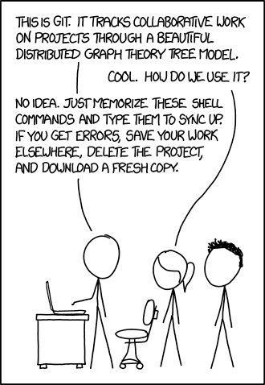
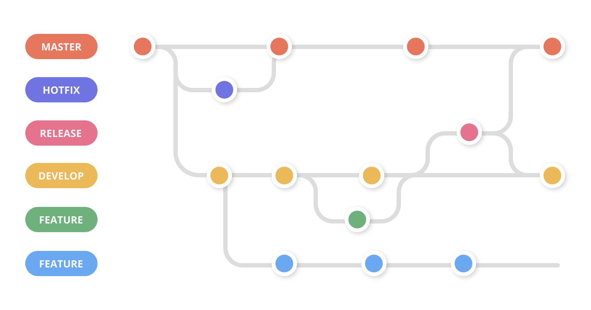
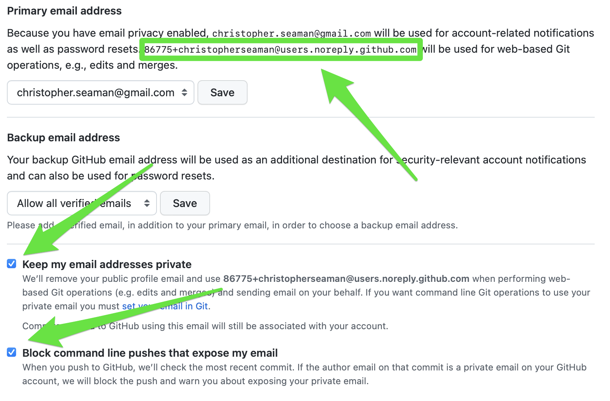

Command Line & Python Fundamentals, plus Version Control


# Command Line Mastery

### Essential Navigation Commands

**Conceptual Description:**
Navigation commands form the foundation of command line usage, allowing you to orient yourself within the file system and move between directories efficiently.


**Reference:**
- `pwd` - Print working directory (shows current location)
- `ls` - List directory contents
- `ls -la` - List with detailed information (permissions, size, date)
- `cd [path]` - Change directory
- `cd ..` - Move up one directory level
- `cd ~` - Navigate to home directory
- `cd -` - Return to previous directory

**Brief Example:**
```bash
pwd                    # /Users/username/Documents
ls -la                 # Show all files with details
cd projects/data_science
pwd                    # /Users/username/Documents/projects/data_science
```

### File and Directory Operations

**Conceptual Description:**
File operations enable creation, modification, and organization of your project structure. These commands form the building blocks of data science project management.

**Reference:**
- `mkdir [name]` - Create directory
- `mkdir -p [path/to/nested]` - Create nested directories
- `touch [filename]` - Create empty file
- `cp [source] [destination]` - Copy files or directories
- `mv [source] [destination]` - Move or rename files
- `rm [filename]` - Remove file
- `rm -r [directory]` - Remove directory recursively
- `rm -rf [directory]` - Force remove directory (use with caution)

**Brief Example:**
```bash
mkdir -p data/raw data/processed scripts
touch scripts/analysis.py
cp data/raw/dataset.csv data/processed/
```

### Text Processing and Search

**Conceptual Description:**
Text processing commands enable efficient data exploration and manipulation. These tools become essential when working with log files, configuration files, or any text-based data.

**Reference:**
- `cat [filename]` - Display entire file
- `head [filename]` - Show first 10 lines
- `tail [filename]` - Show last 10 lines
- `grep [pattern] [filename]` - Search for text patterns
- `grep -r [pattern] [directory]` - Recursive search
- `wc -l [filename]` - Count lines in file

**Brief Example:**
```bash
head -20 data.csv              # Preview first 20 lines
grep "error" logfile.txt       # Find error messages
```

### Visual Directory Structure

**Conceptual Description:**
Sometimes you need to see the overall structure of a project or directory tree. The `tree` command provides a clean, hierarchical view that's invaluable for understanding project organization.

**Reference:**
- `tree` - Show directory structure
- `tree -L 2` - Limit depth to 2 levels
- `tree -a` - Show hidden files
- `tree -d` - Show directories only

**Brief Example:**
```bash
tree                    # Show full directory structure
tree -L 2              # Show only 2 levels deep
tree -d                # Show only directories
```

### History Navigation and Shortcuts

**Conceptual Description:**
Command line efficiency comes from mastering shortcuts and history navigation. These tools save time and reduce errors in daily work.

**Reference:**
- `Up arrow` - Previous command
- `Down arrow` - Next command
- `Ctrl+A` - Move to beginning of line
- `Ctrl+E` - Move to end of line
- `Ctrl+K` - Delete from cursor to end of line
- `Ctrl+U` - Delete from cursor to beginning of line
- `Tab` - Auto-complete commands, files, directories
- `Ctrl+R` - Reverse search through history
- `Ctrl+C` - Cancel current command
- `Ctrl+D` - Exit shell

**Brief Example:**
```bash
# Use up arrow to recall previous commands
# Use Tab to complete: cd pro<Tab> → cd projects/
# Use Ctrl+R to search: Ctrl+R then type "git" to find git commands
```

### Shell Scripting Fundamentals

**Conceptual Description:**
Shell scripting automates repetitive tasks and creates reusable command sequences. Scripts combine multiple commands with control flow to handle complex data processing workflows.

**Reference:**
- `#!/bin/bash` - Shebang line for bash scripts
- `$1, $2, $3...` - Command line arguments
- `$@` - All arguments
- `$#` - Number of arguments
- `$?` - Exit code of last command
- `if [ condition ]; then ... fi` - Conditional execution
- `for variable in list; do ... done` - Loop execution

**Brief Example:**
```bash
#!/bin/bash
# Process multiple data files
for file in data/*.csv; do
    echo "Processing $file"
    head -1 "$file" > "processed/$(basename "$file")"
done
```

### Command Chaining and Redirection

**Conceptual Description:**
Command chaining allows complex data processing pipelines by connecting multiple commands. Redirection controls where input comes from and where output goes, enabling powerful data transformations.

**Reference:**
- `command1 | command2` - Pipe output to next command
- `command1 && command2` - Run command2 only if command1 succeeds
- `command1 || command2` - Run command2 only if command1 fails
- `command > file` - Redirect output to file
- `command >> file` - Append output to file
- `command < file` - Use file as input

**Brief Example:**
```bash
grep "error" logfile.txt | wc -l    # Count error lines
ls *.csv | head -5 > filelist.txt   # Save first 5 CSV files to list
```

# Python Fundamentals (McKinney Ch2+3)

Python's design emphasizes readability and simplicity, making it ideal for data analysis. The language's object model treats everything as an object, providing consistent behavior across different data types. McKinney's approach focuses on practical data manipulation skills essential for scientific computing.


## Language Semantics and Object Model

**Conceptual Description:**
Python uses indentation for code structure instead of braces, creating visually clean code. Every value is an object with associated type information, enabling dynamic behavior and introspection capabilities.

**Reference:**
- Indentation defines code blocks (4 spaces recommended)
- `#` for comments
- `type(object)` - Get object type
- `isinstance(object, type)` - Type checking
- `id(object)` - Get object identity
- `dir(object)` - List object attributes

**Brief Example:**
```python
# Indentation matters
if x > 0:
    print("Positive")
    y = x * 2

# Everything is an object
print(type(42))        # <class 'int'>
print(isinstance("hello", str))  # True
```

## Scalar Types and Operations

**Conceptual Description:**
Scalar types represent single values in Python. The language provides rich support for numeric operations, string manipulation, and boolean logic essential for data analysis.

**Reference:**
- `int` - Arbitrary precision integers
- `float` - Double-precision floating-point
- `str` - Unicode strings
- `bool` - True/False values
- `None` - Null value
- Arithmetic: `+`, `-`, `*`, `/`, `//`, `%`, `**`
- Comparison: `==`, `!=`, `<`, `>`, `<=`, `>=`
- Logical: `and`, `or`, `not`

**Brief Example:**
```python
# Numeric operations
count = 150
average = 87.3
population = 1.4e9  # Scientific notation

# String operations
name = "Alice Johnson"
clean_name = "  Bob Smith  ".strip()

# Boolean logic
has_data = True
analysis_ready = has_data and count > 0
```

## Print Statements and Output Formatting

**Conceptual Description:**
Print statements are your primary tool for communicating results and debugging code. Understanding different formatting options enables clear, professional output essential for data analysis.

**Reference:**
- `print(value)` - Basic printing
- `print(value1, value2, value3)` - Multiple values
- `f"text {variable}"` - F-string formatting (preferred)
- `"text {}".format(variable)` - Format method
- `print(f"Debug: {var} = {value}")` - Debugging output
- `print(f"Result: {result:.2f}")` - Number formatting

**Brief Example:**
```python
# Basic printing
print("Analysis complete")
print("Value:", 42)

# F-string formatting (preferred)
name = "Alice"
score = 87.3
print(f"Student: {name}")
print(f"Score: {score:.1f}%")

# Debugging with print
data = [1, 2, 3, 4, 5]
print(f"Debug: data = {data}, length = {len(data)}")
print(f"Debug: type = {type(data)}")
```

## Type Checking and Debugging

**Conceptual Description:**
Understanding data types is crucial for debugging and data analysis. Python's dynamic typing means variables can change type, making type checking essential for reliable code.

**Reference:**
- `type(variable)` - Get variable type
- `isinstance(variable, type)` - Check if variable is specific type
- `print(f"Type: {type(var)}")` - Debug type information
- `print(f"Value: {var}")` - Debug variable values
- `print(f"Debug: {var} = {value}, type = {type(value)}")` - Complete debugging

**Brief Example:**
```python
# Type checking for debugging
user_input = "42"  # This is a string, not a number!
print(f"Input: {user_input}")
print(f"Type: {type(user_input)}")  # <class 'str'>

# Convert and verify
number = int(user_input)
print(f"Converted: {number}")
print(f"New type: {type(number)}")  # <class 'int'>

# Debugging data processing
data = [1, 2, "3", 4, 5]  # Mixed types!
for item in data:
    print(f"Item: {item}, Type: {type(item)}")
    if isinstance(item, str):
        print(f"  Converting string '{item}' to int")
        item = int(item)
```

## Control Flow Structures

**Conceptual Description:**
Control flow determines program execution order through conditional statements and loops. Python's syntax emphasizes readability while providing powerful iteration capabilities.

**Reference:**
- `if condition: ... elif condition: ... else: ...`
- `for variable in iterable: ...`
- `while condition: ...`
- `break` - Exit loop
- `continue` - Skip to next iteration
- `range(start, stop, step)` - Generate number sequences

**Brief Example:**
```python
# Conditional logic
score = 85
if score >= 90:
    grade = "A"
elif score >= 80:
    grade = "B"
else:
    grade = "C"

# Iteration
for i in range(5):
    print(f"Count: {i}")

# List iteration
grades = [85, 92, 78, 96]
for grade in grades:
    if grade >= 90:
        print(f"Excellent: {grade}")
```

## Data Structures: Lists and Tuples

**Conceptual Description:**
Lists provide mutable sequences for storing and manipulating data collections. Tuples offer immutable sequences useful for fixed data records and function returns.

**Reference:**
- `list()` - Create list
- `[item1, item2, ...]` - List literal
- `list.append(item)` - Add to end
- `list.insert(index, item)` - Insert at position
- `list.remove(item)` - Remove first occurrence
- `list.pop(index)` - Remove and return item
- `tuple()` - Create tuple
- `(item1, item2, ...)` - Tuple literal

**Brief Example:**
```python
# Lists - mutable sequences
grades = [85, 92, 78, 96, 88]
grades.append(90)
grades.insert(1, 87)
total = sum(grades)

# Tuples - immutable sequences
coordinates = (40.7128, -74.0060)
name, age, gpa = ("Alice", 22, 3.8)  # Unpacking
```

## Data Structures: Dictionaries and Sets

**Conceptual Description:**
Dictionaries provide key-value storage for structured data, while sets offer unique collections with mathematical operations. Both are essential for data organization and lookup operations.

**Reference:**
- `dict()` - Create dictionary
- `{key: value, ...}` - Dictionary literal
- `dict[key]` - Access value
- `dict.get(key, default)` - Safe access
- `dict.keys()`, `dict.values()`, `dict.items()` - Iteration
- `set()` - Create set
- `{item1, item2, ...}` - Set literal
- `set.union()`, `set.intersection()`, `set.difference()` - Set operations

**Brief Example:**
```python
# Dictionaries - key-value storage
student = {"name": "Alice", "grade": 85, "major": "Data Science"}
print(student["name"])  # "Alice"
print(student.get("gpa", 0.0))  # Safe access

# Sets - unique collections
math_students = {"Alice", "Bob", "Charlie"}
cs_students = {"Alice", "Diana", "Eve"}
both_subjects = math_students & cs_students  # Intersection
```

## List Comprehensions and Sequence Functions

**Conceptual Description:**
List comprehensions provide concise syntax for creating lists through transformation and filtering. Built-in sequence functions offer efficient operations on data collections.

**Reference:**
- `[expr for item in iterable if condition]` - List comprehension
- `enumerate(iterable)` - Get index and value pairs
- `zip(iterable1, iterable2)` - Combine sequences
- `sorted(iterable)` - Create sorted list
- `reversed(iterable)` - Reverse sequence
- `sum()`, `min()`, `max()`, `len()` - Aggregation functions

**Brief Example:**
```python
# List comprehensions
grades = [85, 92, 78, 96, 88]
passing_grades = [g for g in grades if g >= 80]
letter_grades = ['A' if g >= 90 else 'B' if g >= 80 else 'C' for g in grades]

# Sequence functions
for index, grade in enumerate(grades):
    print(f"Student {index + 1}: {grade}")

names = ["Alice", "Bob", "Charlie"]
scores = [85, 92, 78]
for name, score in zip(names, scores):
    print(f"{name}: {score}")
```

## Functions and Lambda Expressions

**Conceptual Description:**
Functions organize code into reusable units with clear interfaces. Lambda expressions provide concise syntax for simple function definitions, particularly useful with higher-order functions.

**Reference:**
- `def function_name(parameters): ...` - Function definition
- `return value` - Return value
- `lambda parameters: expression` - Lambda function
- `*args` - Variable positional arguments
- `**kwargs` - Variable keyword arguments
- `function.__doc__` - Function documentation

**Brief Example:**
```python
# Function definition
def calculate_average(grades):
    """Calculate the average of a list of grades."""
    if not grades:
        return 0
    return sum(grades) / len(grades)

# Lambda functions
square = lambda x: x ** 2
students = [("Alice", 85), ("Bob", 92), ("Charlie", 78)]
sorted_students = sorted(students, key=lambda x: x[1], reverse=True)
```

# Git Version Control

Don't worry - we're taking a different approach than that xkcd suggests!



## Why Version Control Matters

### The Problem Without Version Control

Picture this: You're working on a data analysis. You create these files:

- `analysis_v1.py`
- `analysis_v2.py`
- `analysis_v2_final.py`
- `analysis_v2_final_ACTUALLY_FINAL.py`
- `analysis_fixed_broken_computer_recovery.py`

Sound familiar? Now imagine collaborating with teammates doing the same thing. Chaos!

### The Git Solution

Git tracks every change to every file in your project. You can:

- See exactly what changed and when
- Go back to any previous version
- Work on features in parallel without conflicts
- Collaborate with teammates seamlessly
- Never lose work (it's all backed up on GitHub)

It's like having infinite "undo" for your entire project, plus collaboration superpowers.

## Git Concepts - The Mental Model

### Repository (Repo)
Your project folder that Git tracks. Contains your files plus a hidden `.git` folder with all the version history.

Think: "This entire folder is under Git management."

### Commit
A saved snapshot of your project at a specific point in time. Like saving a game - you can always come back to this exact state.

Think: "I'm saving my progress with a description of what I accomplished."

### Remote
The version of your repository stored on GitHub (or similar service). Your local computer has a copy, GitHub has a copy, your teammates have copies.

Think: "The shared version everyone can access."

### Branch
A parallel timeline for your project. The main branch contains your official version, feature branches contain experimental work.

Think: "I'm trying something new without risking the working version."

*We'll focus on the main branch today - branches come later!*

**Reference:**
- **Repository**: Collection of objects and references
- **Commit**: Snapshot with metadata (author, message, parents)
- **Blob**: File content
- **Tree**: Directory structure
- **Reference**: Human-readable name pointing to commit
- **HEAD**: Current commit reference
- **Branch**: Movable reference to commit
- **Remote**: Reference to repository on another machine




## GUI-First Git with VS Code

### Why Start with GUI?

Command line Git is powerful, but the visual interface helps you understand what's happening. VS Code's Git integration shows you:

- Which files changed (visual diff)
- What you're about to commit
- The status of everything at a glance

Once you understand Git concepts, you can choose GUI or command line based on the task.

### Setting Up Git in VS Code

**Reference:**

1. Install VS Code (if not already done)
2. Open VS Code → View → Source Control (or Ctrl+Shift+G)
3. If first time: VS Code will prompt to configure Git username/email

**Brief Example:**

```
Git configuration (one-time setup):
- Full Name: Alice Smith
- Email: alice.smith@ucsf.edu (use your actual UCSF email)
```



## Essential Git Commands

**Conceptual Description:**
Basic Git commands manipulate the object database and references. The three-stage workflow (working directory, staging area, repository) provides precise control over what changes are committed.

**Reference:**

Essential:

- `git init` - Initialize repository
- `git clone [url]` - Copy remote repository
- `git status` - Show working directory status
- `git add [file]` - Stage changes
- `git commit -m "message"` - Create commit
- `git push [remote] [branch]` - Send commits to remote
- `git pull [remote] [branch]` - Fetch and merge from remote

Helpful but less essential:

- `git remote add [name] [url]` - Add remote
- `git fetch [remote]` - Download commits without merging
- `git remote -v` - List remotes
- `git log` - Show commit history
- `git diff` - Show changes
- `git checkout [commit/branch]` - Switch to commit or branch
- `git branch [name]` - Create branch
- `git merge [branch]` - Merge branch

**Brief Example:**

```bash
git init                      # Start new repository
git add analysis.py           # Stage file
git commit -m "Add analysis script"  # Create commit
git log --oneline            # View history
git branch feature-analysis  # Create branch
git checkout feature-analysis # Switch to branch
```

**Another Example:**
```bash
git clone https://github.com/user/repo.git
git remote add origin https://github.com/user/repo.git
git push origin main
git pull origin main
```

## VS Code Git Integration

**Conceptual Description:**
VS Code provides a visual Git workflow through its Source Control panel, making version control accessible without memorizing command-line syntax. This integration streamlines the daily workflow of staging, committing, and managing changes.

**Reference:**
- **Source Control Panel**: `Ctrl+Shift+G` (Windows/Linux) or `Cmd+Shift+G` (Mac)
- **Stage Changes**: Click `+` next to files in "Changes" section
- **Commit**: Type message in text box, press `Ctrl+Enter` (Windows/Linux) or `Cmd+Enter` (Mac)
- **View Differences**: Click on modified files to see changes
- **Branch Management**: Click branch name in status bar to switch/create branches
- **Push/Pull**: Use sync button or command palette (`Ctrl+Shift+P`)

**Step-by-Step Workflow:**
```
1. Open VS Code in your project directory
2. Make changes to files (edit, create, delete)
3. Open Source Control panel (Ctrl+Shift+G)
4. Review changes in "Changes" section
5. Stage files by clicking + next to each file
6. Type commit message in text box
7. Press Ctrl+Enter to commit
8. Click sync button to push to remote
```

**Brief Example:**
```
Day-to-day VS Code Git workflow:
1. Edit analysis.py file
2. Ctrl+Shift+G → See "analysis.py" in Changes
3. Click + to stage file
4. Type: "Add data validation to analysis script"
5. Ctrl+Enter to commit
6. Click sync button to push to GitHub
```

## GitHub Web Interface

**Conceptual Description:**
GitHub's web interface provides comprehensive repository management, collaboration features, and project organization tools. It serves as the central hub for code sharing, issue tracking, and team collaboration.

**Reference:**
- **Repository Creation**: "New repository" button, choose name and settings
- **File Management**: "Add file" → "Create new file" or "Upload files"
- **Commit via Web**: Edit files directly, add commit message, commit
- **Pull Requests**: "Pull requests" tab → "New pull request"
- **Issues**: "Issues" tab → "New issue" for bug reports and feature requests
- **Project Settings**: Settings tab for permissions, branches, and integrations
- **Code Review**: Comment on specific lines, approve/request changes

**Collaboration Features:**
```
Repository Management:
- Create repositories with README, .gitignore, license
- Manage branch protection rules
- Configure repository settings and permissions

File Operations:
- Create, edit, and delete files directly in browser
- Upload multiple files via drag-and-drop
- View file history and blame annotations

Team Collaboration:
- Create and manage pull requests
- Review code with inline comments
- Track issues and project milestones
- Use GitHub Actions for automation
```

**Brief Example:**
```
Creating a new repository on GitHub:
1. Go to github.com → Click "+" → "New repository"
2. Name: "data-analysis-project"
3. Add description: "Analysis of sales data"
4. Check "Add a README file"
5. Choose license (MIT recommended)
6. Click "Create repository"

Adding files via web interface:
1. Click "Add file" → "Create new file"
2. Name: "analysis.py"
3. Add Python code
4. Commit message: "Add initial analysis script"
5. Click "Commit new file"
```

## Professional Git Workflow

**Conceptual Description:**
Professional Git workflows emphasize clear commit messages, logical change organization, and effective collaboration patterns. These practices ensure project history remains understandable and maintainable.

**Reference:**
- **Commit Messages**: Present tense, descriptive, under 50 characters
- **Atomic Commits**: One logical change per commit
- **Branch Strategy**: Feature branches for development
- **Pull Requests**: Code review before merging
- **Conflict Resolution**: Merge conflicts handled systematically
- **History Management**: Clean, linear history when possible

**Brief Example:**
```bash
# Good commit message format
git commit -m "Add data validation to analysis script

- Validate input file exists before processing
- Check data format matches expected schema
- Add error handling for malformed data

Fixes issue #123"
```

## Markdown Documentation

**Conceptual Description:**
Markdown is a lightweight markup language for creating formatted text. It's essential for documentation, README files, and project communication. Markdown files are human-readable in plain text but render beautifully when displayed on platforms like GitHub.

**Reference:**
- Headers: `# H1`, `## H2`, `### H3`
- Bold: `**bold text**`
- Italic: `*italic text*`
- Code: `` `inline code` ``
- Code blocks: ```language
- Lists: `- item` or `1. item`
- Links: `[text](url)`
- Images: ``
- Tables: `| col1 | col2 |`

**Brief Example:**
```markdown
# Project Title

## Overview
This project analyzes **sales data** using Python.

### Features
- Data cleaning
- Statistical analysis
- Visualization

## Installation
```bash
pip install -r requirements.txt
```

## Usage
```python
import pandas as pd
data = pd.read_csv('sales.csv')
```

## Links
- [Documentation](https://docs.example.com)
- [Issues](https://github.com/user/repo/issues)
```

# Key Takeaways

## Command Line Mastery
1. **Navigation**: `pwd`, `ls`, `cd` for file system orientation
2. **File Operations**: `mkdir`, `touch`, `cp`, `mv`, `rm` for project management
3. **Text Processing**: `grep`, `head`, `tail` for data exploration
4. **Visual Structure**: `tree` for directory visualization
5. **History Navigation**: Shortcuts and command recall for efficiency
6. **Shell Scripting**: Automation through command sequences and control flow
7. **Command Chaining**: Pipes and redirection for data processing pipelines

## Python Fundamentals (McKinney Ch2+3)
8. **Language Semantics**: Indentation-based structure and object model
9. **Scalar Types**: `int`, `float`, `str`, `bool`, `None` with rich operations
10. **Print and Output**: F-string formatting and debugging with print statements
11. **Type Checking**: `type()` and `isinstance()` for debugging and validation
12. **Control Flow**: `if/elif/else`, `for/while` loops for program logic
13. **Data Structures**: Lists, tuples, dictionaries, sets for data organization
14. **List Comprehensions**: Concise syntax for data transformation
15. **Functions**: Code organization and reusability with lambda expressions

## Git Version Control
16. **Data Model**: Content-addressed objects and reference system
17. **Essential Commands**: `init`, `add`, `commit`, `log`, `diff`, `checkout`
18. **Remote Collaboration**: `clone`, `push`, `pull` for distributed development
19. **VS Code Integration**: Visual Git workflow through Source Control panel
20. **GitHub Interface**: Web-based repository management and collaboration
21. **Professional Workflow**: Atomic commits, descriptive messages, branch strategy

## Integration and Workflow
22. **Command Line + Python**: Seamless integration for data science pipelines
23. **Python + Git**: Professional development with version control
24. **VS Code + GitHub**: Modern development environment for collaboration

## Markdown Documentation
25. **Lightweight Markup**: Essential formatting for README files and documentation
26. **GitHub Integration**: Renders beautifully on GitHub and other platforms
27. **Code Documentation**: Syntax highlighting and inline code formatting

These four pillars—command line mastery, Python fundamentals, Git version control, and Markdown documentation—form the essential toolkit for data science. Mastery of these tools enables efficient data processing, reproducible analysis, and professional collaboration. The combination provides the foundation for advanced data science work with pandas, NumPy, and machine learning libraries.

Next week: We'll dive deeper into data manipulation with pandas and NumPy, building on these Python fundamentals to handle real-world datasets efficiently.

# Practice Challenge

Before next class, complete this exercise that integrates command line, Python, and Git:

## Part 1: Repository Setup
1. Create a new repository called `week-02-practice`
2. Clone it to your local machine using VS Code

## Part 2: Command Line + Python Exercise
Create a Python script called `file_analyzer.py` that:

**Requirements:**
- Use command line arguments to specify input file
- Analyze text files (count words, lines, characters)
- Generate a summary report
- Handle errors gracefully

**Command Line Usage:**
```bash
python file_analyzer.py data.txt
```

**Expected Output:**
```
File Analysis Report
===================
File: data.txt
Lines: 25
Words: 150
Characters: 1,200
Average words per line: 6.0
```

## Part 3: Git Workflow Practice
1. **Initial Commit:** Add your Python script
2. **Feature Commit:** Add command line argument handling
3. **Enhancement Commit:** Add error handling and file validation
4. **Documentation Commit:** Update README.md with usage instructions

## Part 4: Professional Documentation
Create a README.md that includes:
- Project description
- Installation instructions
- Usage examples
- Your name and contact information

## Submission Checklist
- [ ] Repository created and cloned locally
- [ ] Python script works with command line arguments
- [ ] All Git commits have descriptive messages
- [ ] README.md is professional and complete
- [ ] All files are pushed to GitHub

**Bonus Challenge:** Add support for analyzing multiple files at once.

Remember: This workflow becomes automatic with practice. Professional data scientists do this hundreds of times per week!

**Looking Ahead:**
Next week we'll dive deeper into data manipulation with pandas and NumPy. You'll learn how to work with real datasets, perform statistical analysis, and create visualizations. The command line, Python fundamentals, and Git workflow you've mastered today will be essential as we move into more advanced data science techniques.


