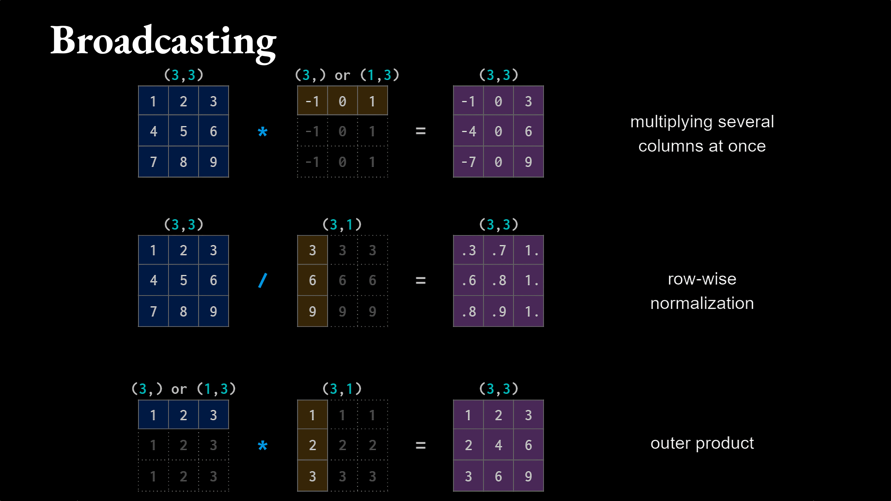
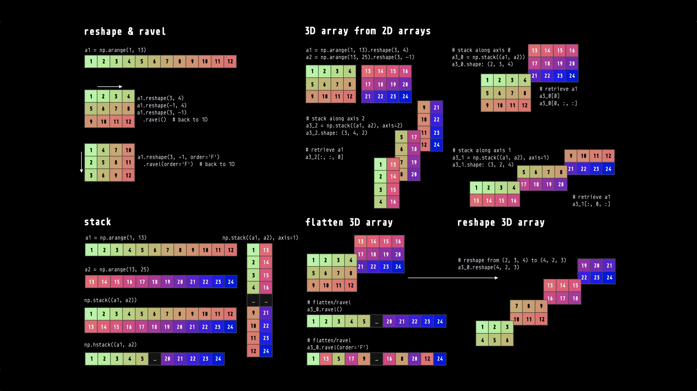

---
notion:
  title_line: "# DLC: Advanced NumPy and Shell Reference"
  role: bonus
  status: mapped
  page_id: "3d6d9fdd-1a1a-8129-8a17-fb53e6f1afe8"
  url: "https://app.notion.com/p/3d6d9fdd1a1a81298a17fb53e6f1afe8"
---

# DLC: Advanced NumPy and Shell Reference

# Direct and Transitive Dependencies

`pyproject.toml` lists only the **direct** dependencies, the packages the project's own code imports. Those packages need packages of their own, the **transitive** dependencies, which uv installs automatically and records in `uv.lock`. Adding pandas, which Lecture 04 uses, to the lecture's `clinic-project` shows the difference.

## Code Snippet: Show the Dependency Tree

```bash
uv add pandas==3.0.5
uv tree
```

```text
clinic-project v0.1.0
├── numpy v2.3.3
└── pandas v3.0.5
    ├── numpy v2.3.3
    └── python-dateutil v2.9.0.post0
        └── six v1.17.0
```

`pyproject.toml` now names numpy and pandas; `python-dateutil` came with pandas, and `six` came with `python-dateutil`. `uv.lock` records all of them, and also `tzdata`, which pandas needs only on Windows, so one lock file covers every platform; `uv lock` refreshes it without installing anything.

Both requirements-file commands include the transitive packages too, in different ways. `uv pip freeze` lists what is installed in the active environment, so it adds `pip` (from `uv venv --seed`) and leaves out `tzdata` on macOS and Linux. `uv export` lists what `uv.lock` records for every platform, marking `tzdata` with a condition that limits it to Windows, and noting under each package which one pulled it in:

```text
python-dateutil==2.9.0.post0
    # via pandas
six==1.17.0
    # via python-dateutil
```

# More Comprehensions

The lecture built lists. The same pattern builds dictionaries and sets, and an `if`/`else` expression inside it relabels every item instead of filtering.

## Code Snippet: Dictionary, Set, and Conditional Comprehensions

```python
patients = ["P001", "P002", "P003"]
systolic = [128, 142, 118]

by_patient = {p: s for p, s in zip(patients, systolic)}
print(by_patient)        # {'P001': 128, 'P002': 142, 'P003': 118}

clinics = {c for c in ["Cardiology", "Nephrology", "Cardiology"]}
print(sorted(clinics))   # ['Cardiology', 'Nephrology']

labels = ["high" if s >= 140 else "ok" for s in systolic]
print(labels)            # ['ok', 'high', 'ok']

pairs = [(p, visit) for p in ["P001", "P002"] for visit in [1, 2]]
print(pairs)             # [('P001', 1), ('P001', 2), ('P002', 1), ('P002', 2)]
```

A filtering `if` goes at the end and drops items; an `if`/`else` goes before `for` and keeps every item with one of two values. Two `for` clauses run like nested loops, the first one outermost.

# Advanced Universal Functions (ufuncs)

Beyond the square roots and exponentials in the lecture, these transform a whole array at once: logs compress a skewed lab value, and the trigonometric functions handle periodic signals.

## Code Snippet: Apply Less Common Math Functions

```python
import numpy as np

arr = np.array([1, 4, 9, 16, 25])

# Advanced mathematical functions
log_arr = np.log(arr)                # Natural log
log10_arr = np.log10(arr)            # Base-10 log
sin_arr = np.sin(np.pi * arr)        # Trigonometric
```

# Advanced Broadcasting

The lecture broadcast a single number across an array. The same rules combine arrays of different shapes, such as subtracting each patient's first reading from all of that patient's visits.



NumPy compares the two shapes from the last dimension backward:

- A missing dimension counts as 1, so a `(3,)` row acts like `(1, 3)`.
- Two dimensions fit when they are equal or one of them is 1.
- A dimension of 1 stretches to match the other, so the result takes the larger length in each dimension. Any other mismatch raises `ValueError`.

## Code Snippet: Subtract Each Patient's Baseline

```python
bp = np.array([[128, 131, 126],   # patient 0: systolic at visits 1-3, mmHg
               [142, 145, 139]])  # patient 1
baseline = bp[:, :1]              # shape (2, 1): each patient's visit 1
print(bp - baseline)              # [[ 0  3 -2]
                                  #  [ 0  3 -3]]: change from visit 1

row = np.array([1, 2, 3])         # shape (3,)
col = np.array([[1], [2]])        # shape (2, 1)
print((row + col).shape)          # (2, 3)
```

# Array Stacking and Concatenation

Use these to combine arrays that arrived separately, such as one array per clinic visit, into a single array.



## Code Snippet: Stack Arrays

```python
arr1 = np.array([1, 2, 3])
arr2 = np.array([4, 5, 6])

# Stacking
vstacked = np.vstack([arr1, arr2])   # Vertical: shape (2, 3)
hstacked = np.hstack([arr1, arr2])   # Horizontal: shape (6,)
dstacked = np.dstack([arr1, arr2])   # Depth: shape (1, 3, 2)

# Concatenation with axis
arr_2d1 = np.array([[1, 2], [3, 4]])
arr_2d2 = np.array([[5, 6], [7, 8]])
concatenated = np.concatenate([arr_2d1, arr_2d2], axis=0)  # Stack rows
```

# Linear Algebra Operations

Matrix arithmetic is the machinery under regression and other models; Lecture 10 uses libraries that call these routines for you.

## Code Snippet: Multiply, Invert, and Solve

```python
A = np.array([[1, 2], [3, 4]])
B = np.array([[5, 6], [7, 8]])

# Matrix multiplication
C = A @ B                   # or np.dot(A, B)
C_alt = np.matmul(A, B)     # Alternative

# Matrix operations
det = np.linalg.det(A)      # Determinant
inv = np.linalg.inv(A)      # Matrix inverse
rank = np.linalg.matrix_rank(A)  # Matrix rank

# Eigenvalues and eigenvectors
eigenvalues, eigenvectors = np.linalg.eig(A)

# Solve linear system Ax = b
b = np.array([1, 2])
x = np.linalg.solve(A, b)
```

# Advanced Indexing

## Reference Card: Three-Dimensional Selection

- `arr3d[i]`: Select one 2-D plane.
- `arr3d[i, j]`: Select one 1-D row from that plane.
- `arr3d[:, :, k]`: Keep two dimensions and select position `k` in the third.
- A single-number index removes a dimension; `:` keeps it.

Use these when a selection needs a grid of chosen rows and columns at once, or when an array has more than two dimensions.

## Code Snippet: Select Grids and Higher Dimensions

```python
# Using np.ix_ for outer indexing
arr = np.arange(20).reshape(4, 5)
rows = [0, 2]
cols = [1, 3, 4]
result = arr[np.ix_(rows, cols)]

# Using ellipsis for arbitrary dimensions
arr_3d = np.random.default_rng(0).standard_normal((2, 3, 4))
result = arr_3d[..., 0]  # Same as arr_3d[:, :, 0]
```

# Random Number Generation

The lecture drew random integers. The same generator draws from named distributions and samples from a list, which is how you simulate a study population or pick a random subset of patient IDs.

## Code Snippet: Draw from Distributions and Samples

```python
# Modern random number generation (NumPy 1.17+)
from numpy.random import default_rng
rng = default_rng(seed=42)

# Generate random arrays
uniform = rng.uniform(0, 1, size=(3, 3))       # Uniform [0, 1)
normal = rng.normal(0, 1, size=(3, 3))         # Normal distribution

# Random sampling
choices = rng.choice([1, 2, 3, 4, 5], size=10, replace=True)
shuffled = rng.permutation([1, 2, 3, 4, 5])

# Legacy interface (still works)
np.random.seed(42)
old_style = np.random.randn(3, 3)
```

# Set Operations

Use these to compare two ID lists, such as patients enrolled at both sites.

## Code Snippet: Compare Two ID Lists

```python
arr1 = np.array([1, 2, 3, 4, 5])
arr2 = np.array([3, 4, 5, 6, 7])

# Set operations
unique_vals = np.unique(arr1)                    # Unique values
intersection = np.intersect1d(arr1, arr2)        # array([3, 4, 5])
union = np.union1d(arr1, arr2)                   # array([1, 2, 3, 4, 5, 6, 7])
difference = np.setdiff1d(arr1, arr2)            # array([1, 2]): in arr1, not arr2
symmetric_diff = np.setxor1d(arr1, arr2)         # Elements in one but not both

# Test membership
is_member = np.isin(arr1, arr2)                  # Boolean array
```

# Advanced Sorting

The lecture's **Sorting and Ranking** covers sorting along an axis and ordering whole rows by one column. This section adds two more tools: use `np.argpartition` when you need only the k smallest values, and `np.lexsort` to order by one key and break ties with another.

## Code Snippet: Partial Sorts and Tie-Breaking

```python
arr = np.array([3, 1, 4, 1, 5, 9, 2, 6])

# Partial sort: the k smallest values, without sorting everything
k = 3
partition_indices = np.argpartition(arr, k)      # k smallest at the start, in no set order
print(np.sort(arr[partition_indices[:k]]))       # [1 1 2]

# Sort by clinic, then by systolic within each clinic; lexsort reads the keys last-first
clinic = np.array([2, 1, 2, 1])
systolic = np.array([130, 142, 118, 128])
print(np.lexsort((systolic, clinic)))            # [3 1 2 0]
```

# File I/O Operations

Use these to save an array between runs without writing and re-parsing a CSV each time; `.npy` keeps the dtype exactly.

## Code Snippet: Save and Load Arrays

```python
# Save and load arrays
arr = np.array([[1, 2, 3], [4, 5, 6]])

# Binary format (fast, preserves dtype)
np.save('data.npy', arr)
loaded = np.load('data.npy')

# Text format (human-readable)
np.savetxt('data.txt', arr, fmt='%d')
loaded_txt = np.loadtxt('data.txt', dtype=int)

# CSV with header
np.savetxt('data.csv', arr, delimiter=',', header='col1,col2,col3', comments='')
loaded_csv = np.loadtxt('data.csv', delimiter=',', skiprows=1)

# Multiple arrays in one file
np.savez('arrays.npz', arr1=arr, arr2=arr*2)
loaded_dict = np.load('arrays.npz')
arr1 = loaded_dict['arr1']
arr2 = loaded_dict['arr2']

# Compressed format
np.savez_compressed('arrays_compressed.npz', arr1=arr, arr2=arr*2)
```

# Positions Where a Condition Holds

The lecture gave `np.where` three arguments to choose values. Given only a condition, it returns the positions where the condition is true.

## Code Snippet: Find Positions

```python
systolic = np.array([118, 142, 127, 135, 151, 109, 131])
positions = np.where(systolic >= 140)[0]
print(positions)    # [1 4]

bp = np.array([[128, 131, 126], [142, 145, 139], [118, 121, 119]])
rows, cols = np.where(bp >= 140)
print(rows, cols)   # [1 1] [0 1]: the row and column of each match
```

With only a condition, `np.where` returns a tuple holding one array of positions per dimension; `[0]` takes the array for a 1-D input.

# Structured Arrays

One array normally holds one dtype. A structured array holds columns of different types, which is the job the pandas DataFrame does more conveniently from Lecture 04 on.

## Code Snippet: Build a Record Array

```python
# Define structured array dtype
dt = np.dtype([('name', 'U10'), ('age', 'i4'), ('score', 'f8')])

# Create structured array
data = np.array([('Alice', 25, 92.5),
                 ('Bob', 30, 87.3),
                 ('Charlie', 28, 95.1)], dtype=dt)

# Access fields
names = data['name']
ages = data['age']

# Access individual records
alice = data[0]
alice_score = data[0]['score']

# Sort by field
sorted_data = np.sort(data, order='score')
```

# Memory-Mapped Files

For working with arrays larger than RAM: the array stays on disk and NumPy reads only the parts you touch. A real memory-mapped file is gigabytes, so keep it outside any Git repository; GitHub rejects files over 100 MB. The snippet uses a small shape and deletes its file at the end.

## Code Snippet: Work with an On-Disk Array

```python
from pathlib import Path

# Create memory-mapped file
shape = (1000, 100)  # 800,000 bytes (~800 KB) of float64 storage
mmap_array = np.memmap('large_array.dat', dtype='float64', mode='w+', shape=shape)

# Use like normal array (but stored on disk)
mmap_array[0] = np.random.default_rng(0).standard_normal(100)
mmap_array.flush()  # Write to disk

# Load existing memory-mapped file
loaded_mmap = np.memmap('large_array.dat', dtype='float64', mode='r', shape=shape)
print(loaded_mmap.shape)  # (1000, 100)

# Release both maps, then delete the file
del mmap_array, loaded_mmap
Path('large_array.dat').unlink()
```

# Shell Script Extras

The lecture's script ran top to bottom on one fixed file. These additions make a script safer and reusable: stop at the first error, take the input file as an argument, and group repeated steps in a function.

## Reference Card: Script Building Blocks

- `set -euo pipefail`: Stop at the first failing command (`-e`), at an unset variable (`-u`), or when any stage of a pipeline fails (`-o pipefail`).
- `$1`, `$2`, ...: The arguments after the script's name; `$#` counts them.
- `${1:-default}`: The first argument, or `default` when none was given.
- `name() { ...; }`: Define a function; inside it, `$1` is the function's own first argument, and `name file.csv 4` calls it.
- `chmod +x script.sh`, then `./script.sh`: Mark the file executable and run it directly; the `#!/bin/bash` line picks the shell.

## Code Snippet: A Reusable Counting Script

Save this as `count_by.sh`:

```bash
#!/bin/bash
set -euo pipefail

count_column() {
    # $1: a CSV file with a header; $2: the field number to count
    tail -n +2 "$1" | cut -d',' -f"$2" | sort | uniq -c
}

input=${1:-data/raw/encounters.csv}
echo "Encounters per clinic in $input:"
count_column "$input" 4
```

The first run reads the default file, the second names the same file, and the third names a file that does not exist:

```bash
chmod +x count_by.sh
./count_by.sh
./count_by.sh data/raw/encounters.csv
./count_by.sh missing.csv; echo "exit status: $?"
```

```text
Encounters per clinic in data/raw/encounters.csv:
      3 Cardiology
      2 Nephrology
      1 Primary Care
Encounters per clinic in data/raw/encounters.csv:
      3 Cardiology
      2 Nephrology
      1 Primary Care
Encounters per clinic in missing.csv:
tail: cannot open 'missing.csv' for reading: No such file or directory
exit status: 1
```

Without `set -euo pipefail`, the script prints the same error but exits with status 0, as if it had succeeded. On macOS, `tail` words its error differently.

# Optional shell reference

The lecture's pipelines select and count. `tr`, `sed`, and `awk` also rewrite text as it passes through, and longer pipelines chain them. These snippets run in Demo 1's `~/03-demo` folder.

## Optional: Advanced Processing

### Code Snippet: Transform Text with tr, sed, and awk

```bash
head -n 3 data/raw/encounters.csv | tr 'a-z' 'A-Z'
grep 'Primary Care' data/raw/encounters.csv | sed 's/Primary Care/PCP/'
tail -n +2 data/raw/encounters.csv | awk -F',' '$3 >= 140 {print $1, $3}'
```

```text
PATIENT_ID,AGE,SYSTOLIC_BP,CLINIC
P001,54,128,CARDIOLOGY
P002,39,118,PRIMARY CARE
P002,39,118,PCP
P003 142
P005 145
```

- `tr 'a-z' 'A-Z'`: Translate characters, here lowercase to uppercase; `tr -d ' '` deletes spaces instead.
- `sed 's/old/new/'`: Replace the first `old` on each line with `new`; `s/old/new/g` replaces every one, and `sed '/pattern/d'` deletes the lines that match.
- `awk -F',' '$3 >= 140 {print $1, $3}'`: Split each line at commas, keep the lines whose third field is 140 or more, and print fields 1 and 3.

## Optional: Longer Data Pipelines

### Code Snippet: Chain Several Stages

```bash
tail -n +2 data/raw/encounters.csv \
  | cut -d',' -f3,4 \
  | sort -t',' -k1,1nr \
  | head -n 3
```

```text
145,Nephrology
142,Nephrology
131,Cardiology
```

`sort -t',' -k1,1nr` sorts by the first comma-separated field as a number (`n`), largest first (`r`), so the pipeline lists the three highest readings with their clinics.

## Optional reference: Quick Data Visualization

These tools plot a column without leaving the terminal: a quick look at a trend, a sanity check on a pipeline's output, or a small dashboard. Lecture 07 covers plotting in Python.

### Code Snippet: Plot in the Terminal

`sparklines` draws one bar per value. `uv add sparklines` adds it to the project, and the active environment then runs it:

```bash
uv add sparklines
cut -d',' -f3 data/raw/encounters.csv | tail -n +2 | sparklines
cut -d',' -f3 data/raw/encounters.csv | tail -n +2 | sparklines -n 2
```

```text
▄▁▇▄█▃
  ▆ █
▇▁███▅
```

The first sparkline has one bar per record, six for this file; `-n 2` draws taller bars over two rows.

`gnuplot` draws text plots too. It is optional and brings many dependencies: install it with `brew install gnuplot` on a Mac or `sudo apt install gnuplot` on Linux. The first command plots the systolic readings, and the second draws one bar per clinic's count:

```bash
cut -d',' -f3 data/raw/encounters.csv | tail -n +2 \
  | gnuplot -e "set terminal dumb; plot '-' with linespoints"
cut -d',' -f4 data/raw/encounters.csv | tail -n +2 | sort | uniq -c \
  | gnuplot -e "set terminal dumb; plot '-' using 1 with boxes"
```

# Other Environment Tools

## Using standard-library venv (alternative)

Python's standard library includes `venv`, which creates an environment with pip already in it; pip installs from `requirements.txt`, not `uv.lock`. Use one environment tool per project.

### Reference Card: standard-library `venv`

| Task | Command | Note |
| :--- | :--- | :--- |
| Create | `python3 -m venv .venv` | Uses the installed Python 3.13. |
| Activate | `source .venv/bin/activate` | PowerShell: `.\.venv\Scripts\Activate.ps1`; Git Bash: `source .venv/Scripts/activate`. |
| Install | `python3 -m pip install -r requirements.txt` | Uses the active environment's pip. |
| Leave | `deactivate` | Returns to the previous shell environment. |

## Using Conda (alternative comparison)

[Conda documentation](https://docs.conda.io/)

Conda manages Python environments and packages, including non-Python dependencies.

### Reference Card: Conda alternative

| Task | Command | Result |
| :--- | :--- | :--- |
| Create | `conda create --prefix ./.venv python=3.13 pip` | Creates the same `.venv` location with Conda. |
| Activate | `conda activate ./.venv` (PowerShell: `conda activate .\.venv`) | Selects the Conda environment. |
| Install | `python3 -m pip install -r requirements.txt` | Installs the packages a requirements file lists. |
| Leave | `conda deactivate` | Returns to the previous environment. |

# More Fancy Indexing

**Fancy indexing** selects by a list of positions instead of a mask, in any order you choose. Like a mask, it returns a copy.

## Reference Card: Fancy Indexing

- `arr[[i, j]]`: The elements at positions `i` and `j`, in that order; a new copy.
- `arr2d[[i, j]]`: Rows `i` and `j`, in that order.
- `arr2d[:, [j, k]]`: Columns `j` and `k` of every row, in that order.
- `arr[[i, j]] = value`: Replaces those elements in place; changes `arr`.

## Code Snippet: Pick Positions, Rows, and Columns

```python
ids = np.array(["P001", "P002", "P003"])   # one ID per row of bp
print(ids[[2, 0]])       # ['P003' 'P001']
print(bp[[2, 0]])        # [[118 121 119]
                         #  [128 131 126]]: rows 2 and 0, in that order
print(bp[:, [0, -1]])    # [[128 126]
                         #  [142 139]
                         #  [118 119]]: each patient's first and last visit
```
