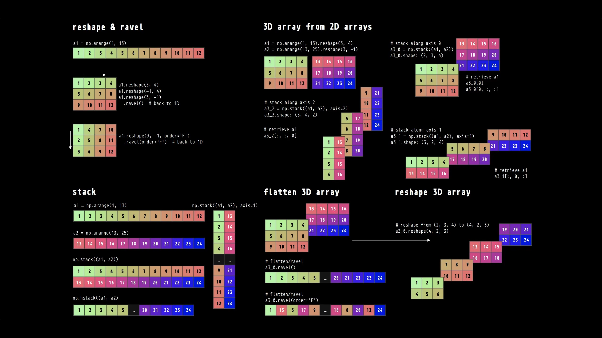
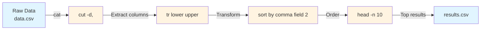

# NumPy Arrays & Virtual Environments

Lectures 01–02 established script, language, and Git fluency. Lecture 03 now
focuses on making execution reproducible: first create a known environment,
then use it for NumPy-based numerical work. Lectures 01–03 use scripts and the
terminal; notebooks begin in Lecture 04.

**LIVE DEMO!**

## Virtual Environments


*Virtual environments prevent package chaos*

### Why Virtual Environments?

**The Problem:** Different projects need different package versions.

- Project A needs pandas 1.3.0
- Project B needs pandas 2.0.0
- Installing one breaks the other!

**The Solution:** Each project gets its own Python environment.

### Lecture 03 candidate environment

This lecture uses one tested course candidate:

- CPython 3.12.13
- a project environment stored in `.venv`
- NumPy 2.0.2 as the core lecture examples' only direct Python dependency
- a deliberate `requirements.txt` containing only `numpy==2.0.2`

These versions define the tested candidate for this lecture's NumPy work, not a permanent dependency set for every later lecture. Later activities may add packages through their own recorded requirements. The primary setup below uses uv. The standard-library `venv` and Conda sections are alternatives for comparison; here they reproduce the same version, directory, and dependency contract rather than defining separate learning outcomes.

### Reproducibility vocabulary

A result is **reproducible** when another person can reconstruct the needed software environment and rerun the documented program with the same supplied inputs.

#### Interpreter

The Python **interpreter** is the executable program that reads and runs Python code. Two terminals can resolve the command `python` to different interpreter files, so both version and location matter.

Check the version:

```bash
python --version
```

After activation below, Python can report the exact interpreter path without a platform-specific shell command:

```bash
python -c "import sys; print(sys.executable)"
```

The `-c` option runs the short Python string that follows it.

#### Package, module, and dependency

A **module** is a Python file that can be imported. A **package** is installable software that can provide one or more modules. NumPy is a package; code normally loads its top-level module with `import numpy`.

A **dependency** is software a project needs in order to run.

- A **direct dependency** is deliberately chosen by this project and imported by its Python code. NumPy is the only direct Python dependency used by the core lecture examples. The optional command-line supplement later in the lecture names separate tools that are not part of this candidate environment.
- A **transitive dependency** is needed by a direct dependency rather than chosen directly by this project.

A **requirements file** is a plain-text list of the direct packages a project deliberately needs. Record those dependencies in `requirements.txt`; do not generate that file from every package currently installed in an environment.

A **lock artifact** records exact resolved direct and transitive versions for a tested release. When the course needs one, it is generated and reviewed separately from the deliberate direct-dependency list.

For the candidate environment, create `requirements.txt` in VS Code with exactly:

```text
numpy==2.0.2
```

`==` pins the direct dependency to one exact candidate version. It can be changed later only as an intentional, tested course update.

#### Environment and activation

An **environment** is the interpreter plus the packages available to it. A **virtual environment** is an isolated directory containing a project-specific Python command and package installation location.

This course uses `.venv` as the environment directory. Add it to `.gitignore`:

```gitignore
.venv/
```

The environment is recreated from instructions and requirements; it is not synchronized through Git.

**Activation** changes the current shell so `python` and installed commands resolve to the selected environment. Activation does not install a package and does not change Python source files.

### Using uv (course candidate)

[uv documentation](https://docs.astral.sh/uv/)

**Reference:**

```bash
# Confirm uv is installed
uv --version

# Record and create the exact candidate environment
uv python pin 3.12.13
uv venv --python 3.12.13 .venv

# Activate (macOS/Linux/WSL Bash)
source .venv/bin/activate

# Install the deliberate direct requirements
uv pip install -r requirements.txt

# Verify the candidate
python --version
python -c "import numpy as np; print(np.__version__)"

# Deactivate
deactivate
```

In native Windows PowerShell, replace the Bash activation line with:

```powershell
.\.venv\Scripts\Activate.ps1
```

### Recreate instead of assuming

An import from the first environment proves only that the first environment works. Recreate the dependency set in a separate disposable directory to test the recorded instructions:

```bash
mkdir recreation-check
cp requirements.txt recreation-check/requirements.txt
cd recreation-check
uv venv --python 3.12.13 .venv
source .venv/bin/activate
uv pip install -r requirements.txt
python --version
python -c "import numpy as np; print(np.__version__)"
deactivate
cd ..
```

The recreated environment should independently report Python 3.12.13 and NumPy 2.0.2.

### Using standard-library venv (alternative)

Use this concise fallback only when uv is unavailable and the candidate Python interpreter is already installed. Confirm that `python` reports 3.12.13 before creating the environment:

```bash
python --version
python -m venv .venv

# Activate (macOS/Linux/WSL Bash)
source .venv/bin/activate

python -m pip install -r requirements.txt
python -c "import numpy as np; print(np.__version__)"
deactivate
```

In native Windows PowerShell, replace the Bash activation line with:

```powershell
.\.venv\Scripts\Activate.ps1
```

The outcome is the same: an activated `.venv` created from the deliberate direct-dependency file. Choose one setup route; do not nest one environment inside another.

### Using Conda (alternative comparison)

[Conda documentation](https://docs.conda.io/)

Conda is not the course's primary setup route. Use it only if the configured channels provide the exact candidate Python version; otherwise use uv. This example keeps the same `.venv` location and installs the same deliberate requirements file.

**Reference:**

```bash
# Create the exact candidate environment
conda create --prefix ./.venv python=3.12.13 pip

# Activate (Mac/Linux)
conda activate ./.venv

# Activate (Windows)
conda activate .\.venv

# Install and verify the deliberate direct requirements
python -m pip install -r requirements.txt
python --version
python -c "import numpy as np; print(np.__version__)"

# Deactivate
conda deactivate
```

## Brief Python refresher

Lectures 01–02 introduced type checking and f-string formatting. Keep those
core-Python tools available while reading the NumPy examples below; no NumPy
objects are needed for this refresher.

```python
name = "Alice"
grade = 87.5
print(f"Student {name} earned {grade:.1f}%")
```

**LIVE DEMO!**


## Why NumPy Matters

Python is famously slow for numerical computing:

```python
# Pure Python approach (SLOW)
my_list = list(range(1_000_000))
result = [x * 2 for x in my_list]  # 46.4 ms

# NumPy approach (FAST)
import numpy as np
my_array = np.arange(1_000_000)
result = my_array * 2  # 0.3 ms - 150x faster!
```

**NumPy is 10-100x faster** than pure Python for numerical operations.

### The NumPy Solution

- **ndarray**: Fast, memory-efficient multidimensional arrays
- **Vectorized operations**: Apply functions to entire arrays at once
- **Broadcasting**: Smart handling of different-sized arrays
- **Universal functions (ufuncs)**: Fast element-wise operations

## NumPy Arrays

### NumPy Quick Reference



### Creating Arrays

**Reference:**

```python
import numpy as np

# From Python lists
arr = np.array([1, 2, 3, 4, 5])
arr_2d = np.array([[1, 2, 3], [4, 5, 6]])

# Array creation functions
zeros = np.zeros(5)              # array([0., 0., 0., 0., 0.])
ones = np.ones((2, 3))           # 2x3 array of ones
range_arr = np.arange(10)        # array([0, 1, 2, ..., 9])
full = np.full((2, 3), 7)        # 2x3 array filled with 7
```

### Array Properties

**Reference:**

```python
arr = np.array([[1, 2, 3], [4, 5, 6]])

print(arr.shape)      # (2, 3) - 2 rows, 3 columns
print(arr.ndim)       # 2 - number of dimensions
print(arr.size)       # 6 - total elements
print(arr.dtype)      # int64 - data type
```

### Data Types

**Reference:**

```python
# Explicit data types
arr_int = np.array([1, 2, 3], dtype=np.int32)
arr_float = np.array([1, 2, 3], dtype=np.float64)

# Type conversion
arr = np.array([1, 2, 3, 4, 5])
float_arr = arr.astype(np.float64)

# String to numeric
str_arr = np.array(["1.25", "-9.6", "42"])
num_arr = str_arr.astype(float)
```

## Array Indexing and Slicing

### Basic Indexing

NumPy's indexing syntax allows you to access and slice array elements using familiar Python notation, extended to work seamlessly across multiple dimensions.

**Reference:**

```python
arr = np.array([0, 1, 2, 3, 4, 5, 6, 7, 8, 9])

# Single element
first = arr[0]          # 0
last = arr[-1]          # 9

# Slicing
subset = arr[2:7]       # array([2, 3, 4, 5, 6])
every_other = arr[::2]  # array([0, 2, 4, 6, 8])
```

### Multidimensional Indexing

With multidimensional arrays, you can use comma-separated indices to access elements, rows, or columns, making it easy to work with matrices and higher-dimensional data.

**Reference:**

```python
arr_2d = np.array([[1, 2, 3], [4, 5, 6], [7, 8, 9]])

# Access elements
first_row = arr_2d[0]        # array([1, 2, 3])
element = arr_2d[1, 2]       # 6

# Slicing
first_two_rows = arr_2d[:2]  # First 2 rows
middle_column = arr_2d[:, 1] # Column 1: array([2, 5, 8])
```

### Boolean Indexing

Boolean indexing allows you to filter arrays using conditional logic, selecting only elements that meet specific criteria. This is essential for data analysis tasks like finding outliers, filtering datasets, or applying conditional transformations.

**Reference:**

```python
arr = np.array([1, 5, 3, 8, 2, 9, 4])

# Boolean mask
mask = arr > 5              # array([False, False, False, True, False, True, False])
high_values = arr[mask]     # array([8, 9])

# Conditional operations
arr[arr > 5] = 0            # Set values > 5 to 0

# Multiple conditions (use & for AND, | for OR)
mask = (arr > 2) & (arr < 8)
filtered = arr[mask]
```

### Fancy Indexing

Fancy indexing uses integer arrays to select multiple elements at arbitrary positions in a single operation. This powerful technique enables efficient data reordering, sampling, and custom selection patterns without explicit loops.

**Reference:**

```python
arr = np.array([10, 20, 30, 40, 50, 60, 70, 80])

# Integer array indexing
indices = [1, 3, 5]
selected = arr[indices]      # array([20, 40, 60])

# 2D fancy indexing
arr_2d = np.array([[1, 2, 3], [4, 5, 6], [7, 8, 9]])
selected = arr_2d[[0, 2], [1, 2]]  # array([2, 9])
```

### Views vs Copies

Understanding the distinction between views and copies is critical for avoiding unexpected behavior: slicing operations create views that share memory with the original array, while explicit copies create independent arrays.

**Reference:**

```python
arr = np.array([1, 2, 3, 4, 5])

# Slicing creates views (shares memory)
view = arr[1:4]
view[0] = 99                # Modifies original!
print(arr)                  # array([1, 99, 3, 4, 5])

# Explicit copy
arr = np.array([1, 2, 3, 4, 5])
copy = arr[1:4].copy()
copy[0] = 99                # Doesn't affect original
print(arr)                  # array([1, 2, 3, 4, 5])
```

## NumPy Operations

### Arithmetic and Vectorized Operations

NumPy's vectorized operations perform element-wise calculations across entire arrays without explicit loops, providing both cleaner code and significant performance improvements over standard Python operations.

**Reference:**

```python
arr1 = np.array([1, 2, 3, 4, 5])
arr2 = np.array([5, 4, 3, 2, 1])

# Element-wise operations
sum_arr = arr1 + arr2       # array([6, 6, 6, 6, 6])
mult_arr = arr1 * arr2      # array([5, 8, 9, 8, 5])
power_arr = arr1 ** 2       # array([1, 4, 9, 16, 25])

# Scalar operations
doubled = arr1 * 2          # array([2, 4, 6, 8, 10])
arr = np.array([[1, 2, 3], [4, 5, 6]])
result = arr + 10           # Adds 10 to all elements
```

### Statistical Operations

NumPy provides built-in statistical functions that operate across entire arrays or along specific axes, enabling quick computation of summary statistics for data analysis.

**Reference:**

```python
grades = np.array([[85, 92, 78], [95, 88, 91], [82, 90, 87]])

# Basic statistics
mean = grades.mean()         # Approximately 87.56
std = grades.std()           # Standard deviation
max_val = grades.max()       # 95
min_val = grades.min()       # 78

# Axis-specific (0=columns, 1=rows)
student_avg = grades.mean(axis=1)  # Average per student
test_avg = grades.mean(axis=0)     # Average per test
```

### Array Reshaping

Reshaping operations change an array's dimensions. `reshape` returns a view when possible but may need to copy data; `flatten` always returns a copy.

**Reference:**

```python
# Reshaping
arr = np.arange(12)
reshaped = arr.reshape(3, 4)  # 1D to 2D
flattened = reshaped.flatten() # 2D back to 1D

# Transposing (flip rows/columns)
arr_2d = np.array([[1, 2, 3], [4, 5, 6]])
transposed = arr_2d.T         # Shape (2,3) -> (3,2)
```

## Semi-Advanced NumPy

The following short reference keeps a few useful NumPy operations visible;
the more specialized material is collected in [the bonus page](BONUS.md).

### Universal Functions (ufuncs)

**Reference:**

```python
arr = np.array([1, 4, 9, 16, 25])

# Common mathematical functions
sqrt_arr = np.sqrt(arr)         # array([1., 2., 3., 4., 5.])
exp_arr = np.exp([1, 2, 3])     # array([2.718, 7.389, 20.086])

# Binary functions
arr1 = np.array([1, 5, 3])
arr2 = np.array([4, 2, 6])
max_arr = np.maximum(arr1, arr2) # array([4, 5, 6])
```

### Conditional Logic

**Reference:**

```python
# np.where: vectorized if-else
arr = np.array([1, -2, 3, -4, 5])
result = np.where(arr > 0, arr, 0)  # Replace negatives with 0
# array([1, 0, 3, 0, 5])

# Multiple conditions
np.where(arr > 0, 'positive', 'negative')
```

### Boolean Array Methods

**Reference:**

```python
arr = np.array([True, False, True, False])

# Check if any/all values are True
has_any = arr.any()      # True - at least one True
all_true = arr.all()     # False - not all True

# Works with conditions too
grades = np.array([85, 92, 78, 95])
any_above_90 = (grades > 90).any()  # True
all_above_80 = (grades > 80).all()  # False (78 is not above 80)
```

### Sorting

**Reference:**

```python
arr = np.array([3, 1, 4, 1, 5])

# In-place sorting (modifies original)
arr.sort()              # arr becomes [1, 1, 3, 4, 5]

# Return sorted copy (original unchanged)
arr = np.array([3, 1, 4, 1, 5])
sorted_arr = np.sort(arr)  # [1, 1, 3, 4, 5], arr unchanged

# 2D sorting
arr_2d = np.array([[3, 1], [2, 4]])
arr_2d.sort(axis=0)     # Sort columns
arr_2d.sort(axis=1)     # Sort rows
```

### Random Number Generation

**Reference:**

```python
# Create random generator
rng = np.random.default_rng()  # No seed (different each time)
rng_seeded = np.random.default_rng(seed=42)  # Reproducible

# Generate random numbers
random_nums = rng.random(5)              # 5 random floats [0, 1)
random_ints = rng.integers(1, 10, size=5) # 5 random ints [1, 10)
normal_nums = rng.standard_normal(5)     # 5 from normal distribution

# With seed for reproducibility
rng = np.random.default_rng(seed=123)
data = rng.random((3, 3))  # Same result every time
```

**LIVE DEMO!**


## Optional reference: Command Line Data Processing

This section is optional reference material, not a new required workflow for
the lecture. It continues the shell skills from Lectures 01–02 without
introducing notebooks; the canonical visualization lecture is Lecture 07.

Command line tools are powerful for quick data processing tasks. Commands can be chained together using pipes (`|`) to create data processing pipelines.

**Note:** The backslash `\` at the end of a line continues the command on the next line, making long pipelines easier to read.


```mermaid
graph LR
    A[Raw Data<br/>data.csv] -->|cat| B[cut -d,]
    B -->|Extract columns| C[tr lower upper]
    C -->|Transform| D[sort by comma field 2]
    D -->|Order| E[head -n 10]
    E -->|Top results| F[results.csv]

    style A fill:#e1f5ff
    style F fill:#e1f5ff
    style B fill:#fff4e1
    style C fill:#fff4e1
    style D fill:#fff4e1
    style E fill:#fff4e1
```

*Data flows through a series of command line tools, each performing one transformation*

### Text Processing

**Reference:**

```bash
# cut: Extract columns
cut -d',' -f1,3 data.csv        # Columns 1 and 3
cut -c1-10 file.txt             # Characters 1-10

# sort: Sort data
sort -n data.txt                # Numerical sort
sort -t',' -k2,2n data.csv      # Numeric sort by comma-delimited field 2

# uniq: Remove duplicate lines (requires sorted input)
sort data.txt | uniq            # Remove duplicates
sort data.txt | uniq -c         # Count occurrences
sort data.txt | uniq -d         # Show only duplicates

# grep: Search and filter
grep "pattern" file.txt         # Find pattern
grep -v "pattern" file.txt      # Inverse match
grep -i "pattern" file.txt      # Case-insensitive
```

### Advanced Processing

**Reference:**

```bash
# tr: Translate characters
tr 'a-z' 'A-Z' < file.txt       # Uppercase
tr -d ' ' < file.txt            # Delete spaces

# sed: Stream editor
sed 's/old/new/g' file.txt      # Replace all
sed '/pattern/d' file.txt       # Delete lines

# awk: Pattern processing
awk '{print $1, $3}' file.txt   # Print columns 1, 3
awk -F',' '$3 > 50' data.csv    # Filter rows
```

### Data Pipelines

**Reference:**

```bash
# Complex pipeline
cat data.csv | \
  cut -d',' -f2,4 | \
  tr '[:lower:]' '[:upper:]' | \
  sort -t',' -k2,2n | \
  head -n 10 > results.csv
```

### Optional reference: Quick Data Visualization

Terminal visualization is also optional/reference-only. Lecture 07 is the
canonical place for visualization; these commands are included only as a
quick shell-based supplement.

Command line tools for quick data visualization without leaving the terminal.

**Reference:**

```bash
# sparklines: Inline Unicode graphs
# Install: pip install sparklines

# Visualize grade trends inline
cut -d',' -f3 students.csv | tail -n +2 | sparklines
#     Extract column 3 -> Skip header (line 1) -> Graph
#     tail -n +2 means "start at line 2" (skip the header)
# Output: ▅█▃▆▇▄▇▂▆▅

# With statistics
cut -d',' -f3 students.csv | tail -n +2 | sparklines --stat-min --stat-max --stat-mean

# gnuplot: Create terminal plots (optional - many dependencies)
# Install: brew install gnuplot (Mac) or apt install gnuplot (Linux)

# Simple plot of grades
cut -d',' -f3 students.csv | tail -n +2 | \
  gnuplot -e "set terminal dumb; plot '-' with linespoints"

# Bar chart: count students by subject
cut -d',' -f4 students.csv | tail -n +2 | sort | uniq -c | \
  gnuplot -e "set terminal dumb; plot '-' using 1 with boxes"
```

Use cases:

- Quick trend checks in terminal sessions
- Data quality sanity checks
- Pipeline debugging visualization
- Terminal dashboards
