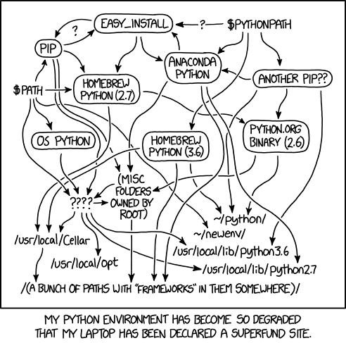
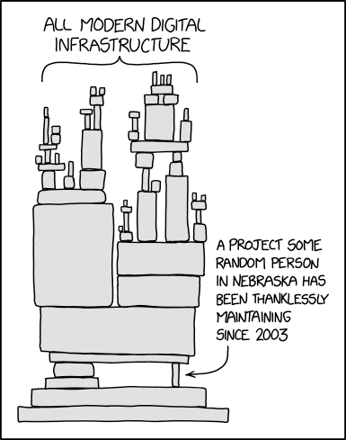
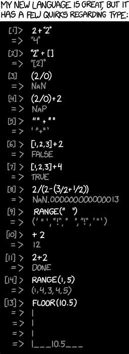
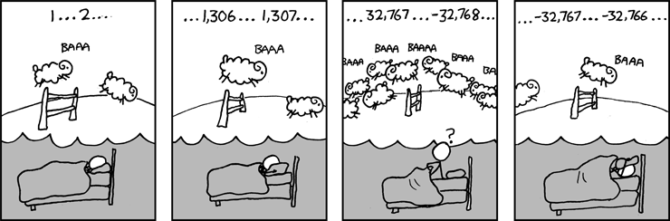
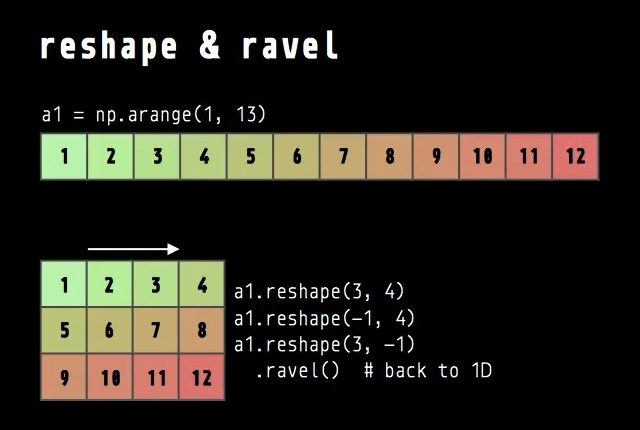
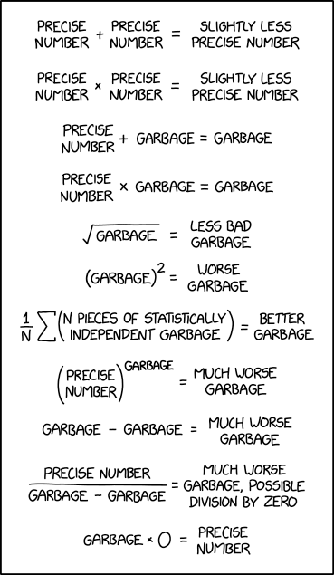

---
notion:
  title_line: "# NumPy Arrays & Virtual Environments"
  role: lecture
  status: mapped
  page_id: "27ed9fdd-1a1a-80a7-8532-e70d7000dae8"
  url: "https://app.notion.com/p/27ed9fdd1a1a80a78532e70d7000dae8"
---

# NumPy Arrays & Virtual Environments

See [BONUS.md](BONUS.md) for the optional extensions.

[Live Demo Guide](demo/DEMO_GUIDE.md)

# Virtual Environments



NumPy is a third-party **package**, installable code that provides modules, so unlike Lecture 02's `math`, `import numpy` works only after it is installed. A **virtual environment** is a project folder, `.venv`, holding its own Python **interpreter** (the program that runs Python code) and its own installed packages, so each project keeps the versions it was written with.

```text
Project A → A/.venv → Python 3.13, numpy 2.3.3
Project B → B/.venv → Python 3.12, numpy 1.26.4
```

## Course Environment

- Python 3.13, with one environment per project in a folder named `.venv`
- The project's packages listed in `pyproject.toml`: NumPy 2.3.3 now, pandas 3.0.5 from Lecture 04
- uv manages all of it; `requirements.txt`, standard-library `venv`, and Conda are alternatives later in this topic

## Using uv

[uv documentation](https://docs.astral.sh/uv/)

`uv venv --seed` creates `.venv` in the current folder. **Activation** switches the terminal to that environment, so `python` runs the copy inside `.venv` and uv installs packages there:

```text
~/assignment-03 $ uv venv --seed
Using CPython 3.13.14
Creating virtual environment with seed packages at: .venv
 + pip==26.2.1
Activate with: source .venv/bin/activate
~/assignment-03 $ source .venv/bin/activate
(assignment-03) ~/assignment-03 $ python --version
Python 3.13.14
```

<callout icon="⚠️" color="yellow_bg">
	Keep `.venv/` out of Git: add the line `.venv/` to the project's `.gitignore` (Lecture 02). Its thousands of files work only on the computer that built them; the project's records, below, rebuild it anywhere.
</callout>

### Reference Card: uv Environment Workflow

| Task | Command | Result |
| :--- | :--- | :--- |
| Install Python | `uv python install 3.13 --default` | Installs 3.13; `python` and `python3` now run it (Lecture 01). |
| Set the default Python | `uv python pin --global 3.13` | New environments use 3.13; `--default` alone sets only the `python` commands. |
| Pin one project | `uv python pin 3.13` | Writes `.python-version`; `uv venv` in this folder uses it over the global pin. |
| Create environment | `uv venv --seed` | Creates `.venv` with the pinned Python; `--seed` adds pip, which Lecture 04's notebooks use. |
| Activate | `source .venv/bin/activate` (PowerShell: `.\.venv\Scripts\Activate.ps1`) | The prompt starts with the folder name, such as `(assignment-03)`. |
| Verify | `python --version` and `python -c "import numpy as np; print(np.__version__)"` | The Python and NumPy versions. |
| Leave environment | `deactivate` | Returns to the previous shell environment. |

## Recording Packages in `pyproject.toml`

A **dependency** is a package a project needs. `pyproject.toml` is Python's standard project file and the course's record of dependencies: its `dependencies` list names the packages the project's code imports. `uv init --bare` writes the file, and `uv add` installs a package and adds it to the list:

```toml
[project]
name = "clinic-project"
version = "0.1.0"
requires-python = ">=3.13"
dependencies = [
    "numpy==2.3.3",
]
```

`uv add` also writes `uv.lock`, a **lock file** listing the exact version of every package the environment needs, including the packages your packages need, so a rebuild installs the same versions. Commit it beside `pyproject.toml` and leave its contents to uv.

### Reference Card: `pyproject.toml` Projects

| Task | Command | Result |
| :--- | :--- | :--- |
| Start a project | `uv init --bare` | Writes `pyproject.toml` for a project named after the folder; run it once per project. |
| Add a package | `uv add numpy==2.3.3` | Installs that version into `.venv`, lists it in `pyproject.toml`, and updates `uv.lock`. |
| Rebuild from the records | `uv sync` | Makes `.venv` match `pyproject.toml` and `uv.lock`, removing packages they do not list, so install new packages with `uv add`, not `uv pip install`. |
| Run in the environment | `uv run python script.py` | Runs the command with the project's `.venv`, active or not. |

### Code Snippet: Create and Verify an Environment

In an empty folder named `clinic-project`:

```bash
uv python pin 3.13                                      # Pinned `.python-version` to `3.13`
uv init --bare                                          # Initialized project `clinic-project`
uv venv --seed
source .venv/bin/activate
uv add numpy==2.3.3                                     # + numpy==2.3.3
python -c "import numpy as np; print(np.__version__)"   # 2.3.3
```

`.python-version`, `pyproject.toml`, and `uv.lock` are now the project's records: which Python and which packages to rebuild.

## Using `requirements.txt` (alternative)

Many projects, and tools such as pip and Google Colab, list their packages in a **requirements file**, `requirements.txt`, instead: one package per line, with `==` pinning an exact version and no lock file beside it.

```text
numpy==2.3.3
pandas==3.0.5
```

### Reference Card: Requirements Files

- `uv pip install -r requirements.txt`: Install every listed package into the active environment; `pyproject.toml` is unchanged.
- `uv export --no-hashes > requirements.txt`: Write the packages `uv.lock` records; `--no-hashes` leaves out download checksums.
- `uv pip freeze > requirements.txt`: Write every package installed in the active environment, pip included.
- `python -m pip install -r requirements.txt`: The same install with pip, as Colab and the alternatives below do.

### Code Snippet: Share the Environment as `requirements.txt`

```bash
uv export --no-hashes > requirements.txt
cat requirements.txt
```

```text
# This file was autogenerated by uv via the following command:
#    uv export --no-hashes
numpy==2.3.3
    # via clinic-project
```

## Which Python Is Running?

`sys.executable` is the path of the interpreter running the code, so it shows whether `python` runs the project's `.venv`; `python -c` runs the Python code in the string that follows it:

```text
(assignment-03) ~/assignment-03 $ python -c "import sys; print(sys.executable)"
/home/alice/assignment-03/.venv/bin/python
```

### When `import numpy` Fails

```text
$ python -c "import numpy as np"
Traceback (most recent call last):
  File "<string>", line 1, in <module>
    import numpy as np
ModuleNotFoundError: No module named 'numpy'
```

`ModuleNotFoundError` means the Python that ran the code cannot find the package. The usual causes:

- **The environment is not active**, or VS Code picked another interpreter: `sys.executable` does not end in `.venv/bin/python`. Run `source .venv/bin/activate` in this terminal, and in VS Code run **Python: Select Interpreter** (Lecture 02) and choose `./.venv/bin/python`.
- **The project's packages are not installed**: run `uv sync`, or `uv pip install -r requirements.txt` for a `requirements.txt` project.
- **The package is new to this project**: `uv add pandas==3.0.5` installs it and records it in `pyproject.toml`.

## Recreate an Environment

A result is **reproducible** when another person can rebuild the software environment and rerun the program on the same inputs. Commit the records and check them by rebuilding in a new folder; the same commands set up a project someone else made, such as an assignment handout.

### Code Snippet: Recreate from the Records

In a new folder holding copies of `.python-version`, `pyproject.toml`, and `uv.lock`:

```bash
uv venv --seed                                                 # Using CPython 3.13.14, as .python-version says
uv sync                                                        # + numpy==2.3.3, as uv.lock says
uv run python -c "import numpy as np; print(np.__version__)"   # 2.3.3
```

## Using standard-library venv (alternative)

Python's standard library includes `venv`, which creates an environment with pip already in it; pip installs from `requirements.txt`, not `uv.lock`. Use one environment tool per project.

### Reference Card: standard-library `venv`

| Task | Command | Note |
| :--- | :--- | :--- |
| Create | `python -m venv .venv` | Uses the installed Python 3.13. |
| Activate | `source .venv/bin/activate` | PowerShell: `.\.venv\Scripts\Activate.ps1`. |
| Install | `python -m pip install -r requirements.txt` | Uses the active environment's pip. |
| Leave | `deactivate` | Returns to the previous shell environment. |

## Using Conda (alternative comparison)

[Conda documentation](https://docs.conda.io/)

Conda manages Python environments and packages, including non-Python dependencies.

### Reference Card: Conda alternative

| Task | Command | Result |
| :--- | :--- | :--- |
| Create | `conda create --prefix ./.venv python=3.13 pip` | Creates the same `.venv` location with Conda. |
| Activate | `conda activate ./.venv` (PowerShell: `conda activate .\.venv`) | Selects the Conda environment. |
| Install | `python -m pip install -r requirements.txt` | Installs the packages a requirements file lists. |
| Leave | `conda deactivate` | Returns to the previous environment. |



# Shell Pipelines and Scripts

## Pipelines

A **pipe** (`|`) sends one command's output into the next command, as `>` (Lecture 01) sends it into a file. A **pipeline** chains small commands, each doing one job, to answer quick questions about a file, such as how many encounters each clinic had. On Demo 1's `data/raw/encounters.csv`, a header and six rows, each stage works on the previous stage's output:

| Stage | Command | Output |
| --- | --- | --- |
| Input | `cat data/raw/encounters.csv` | `patient_id,age,systolic_bp,clinic`, `P001,54,128,Cardiology`, … 7 lines |
| Skip the header | `tail -n +2` | `P001,54,128,Cardiology`, `P002,39,118,Primary Care`, … 6 lines |
| Keep field 4 | `cut -d',' -f4` | `Cardiology`, `Primary Care`, `Nephrology`, `Cardiology`, `Nephrology`, `Cardiology` |
| Put equal lines together | `sort` | `Cardiology`, `Cardiology`, `Cardiology`, `Nephrology`, `Nephrology`, `Primary Care` |
| Count each group | `uniq -c` | `3 Cardiology`, `2 Nephrology`, `1 Primary Care` |

### Reference Card: Pipeline Building Blocks

- `tail -n +2 FILE`: Skip the first line, the header.
- `cut -d',' -f4`: Keep the fourth comma-separated field.
- `sort`: Put equal lines next to one another.
- `uniq -c`: Count adjacent equal lines, so `sort` first.
- `head -n 5`: Keep the first five lines.
- `wc -l`: Count lines.
- `command > FILE` / `command >> FILE`: Replace / append file contents.

### Code Snippet: Count Encounters per Clinic

```bash
tail -n +2 data/raw/encounters.csv | cut -d',' -f4 | sort | uniq -c
tail -n +2 data/raw/encounters.csv | wc -l
```

```text
      3 Cardiology
      2 Nephrology
      1 Primary Care
6
```

## Variables and Timestamps

Rerunning a pipeline with `>` replaces the last result; naming each output file with the time it ran keeps every result. The shell stores text in a **variable** and captures a command's output with **command substitution**, `$(...)`.

### Reference Card: Shell Variables and Timestamps

- `name=value`: Store text; no spaces around `=`.
- `"$name"` / `"${name}"`: Use the value; quotes keep spaces, and braces mark where the name ends, as in `summary_${timestamp}.txt`.
- `$(command)`: Replace the expression with the command's output.
- `date +"%Y%m%d_%H%M%S"`: The current time as year, month, day, underscore, hour, minute, second, such as `20260918_161539`, which sorts in time order.

### Code Snippet: Name and Log a Run

```bash
timestamp=$(date +"%Y%m%d_%H%M%S")                    # 20260918_162001; yours will differ
echo "Run: $timestamp" > "results/summary_${timestamp}.txt"
echo "${timestamp} complete" >> logs/processing.log    # adds the line: 20260918_162001 complete
```

## Shell Scripts

A **shell script** is a file of commands, so a whole pipeline reruns with one command when the data change.

### Reference Card: Shell Scripts

- `cat > count_clinics.sh`: Paste the script, press **Enter**, then **Ctrl+C** (Lecture 01).
- `#!/bin/bash`: The first line; names the shell the script expects.
- `# note`: A comment; Bash skips it.
- `\` at the end of a line: Continue the same command on the next line.
- `bash count_clinics.sh`: Run the script from top to bottom.

### Code Snippet: Save a Pipeline as a Script

```bash
#!/bin/bash
# Count encounters per clinic; save the counts under this run's timestamp.
timestamp=$(date +"%Y%m%d_%H%M%S")
tail -n +2 data/raw/encounters.csv \
  | cut -d',' -f4 | sort | uniq -c > "results/clinic_counts_${timestamp}.txt"
echo "Saved results/clinic_counts_${timestamp}.txt"
```

```text
$ bash count_clinics.sh
Saved results/clinic_counts_20260918_162310.txt
```

Scripts can also take arguments and stop at the first failing command; [the bonus page](BONUS.md) covers those.

# LIVE DEMO!

# Checking Types and Looping over Lists

Three tools shorten everyday list code: `isinstance()` checks what a value is, `zip()` and `reversed()` walk lists, and a list comprehension builds a list in one line.

## Checking Types

Values read from a file start as text, so check a value's type before calculating with it. **Introspection** means asking an object what it is while the program runs: `type()` (Lecture 01) names the type, and `isinstance()` answers yes or no, which suits an `if`.

### Reference Card: Object Introspection

- `type(value)`: The value's exact type.
- `isinstance(value, type)`: `True` when the value has that type.
- `dir(value)`: List the value's attributes and methods.
- `help(value)` / `help(str.split)`: Read documentation; press **Q** to leave a paged view.
- `id(value)`: The object's identity number during its lifetime.

### Code Snippet: Inspect Values Before Using Them

```python
readings = ["72", 80, "88"]   # text from a file, mixed with numbers
clean = []
for value in readings:
    if isinstance(value, str):
        value = int(value)
    clean.append(value)
print(clean, sum(clean))      # [72, 80, 88] 240
sum(readings)                 # TypeError: unsupported operand type(s) for +: 'int' and 'str'
```



## Sequence Functions

Beside `enumerate()` (Lecture 01) and `sorted()` (Lecture 02), `zip()` walks two lists side by side, keeping each patient's ID with that patient's reading, and `reversed()` walks a sequence from the end.

### Reference Card: Sequence Functions

- `enumerate(items, start=0)`: Yield position-value pairs.
- `zip(left, right)`: Yield pairs until the shorter input ends.
- `reversed(items)`: Iterate from the last item to the first.
- `sorted(items)`: Return a new sorted list.

### Code Snippet: Keep Related Values Together

```python
patients = ["P001", "P002", "P003"]
systolic = [128, 142, 118]
for patient, reading in zip(patients, systolic):
    print(f"{patient}: {reading}")    # P001: 128, then P002: 142, P003: 118
print(list(reversed(patients)))       # ['P003', 'P002', 'P001']
```

## List Comprehensions

A **list comprehension** builds a list in one line: `[expression for item in items if condition]` reads as "make this, for each item, keeping only items that pass." A plain loop always works too; [the bonus page](BONUS.md) shows more forms.

### Reference Card: List Comprehensions

- `[expr for x in items]`: Transform every item; a new list of the same length.
- `[x for x in items if condition]`: Keep only items that pass; a new, possibly shorter list.
- `[expr for x in items if condition]`: Filter, then transform.

### Code Snippet: The Same List Two Ways

```python
temps_f = [98.6, 101.2, 99.5, 103.1]
fevers = []                                   # a loop that builds a list
for t in temps_f:
    if t >= 100.4:
        fevers.append(t)
print(fevers)                                 # [101.2, 103.1]
print([t for t in temps_f if t >= 100.4])     # [101.2, 103.1]: the same list in one line
print([mg / 1000 for mg in [250, 500, 125]])  # [0.25, 0.5, 0.125]: mg to g
```

# NumPy Basics


## Why NumPy

**NumPy** (Numerical Python) is the package for calculating on many numbers at once, and pandas (Lecture 04) is built on it. Its core object is the **array**, a grid of values that all share one data type, so one expression such as `readings * 2` applies to every element with no loop. This style is called **vectorization**, and on a wearable's 86,400 readings a day it is far faster than a loop over a list.

```text
Python list: [1, 2, 3] * 2  → [1, 2, 3, 1, 2, 3]   repeats the list
NumPy array: [1, 2, 3] * 2  → [2, 4, 6]            multiplies each value
```

### Code Snippet: The Same Calculation Two Ways

```python
my_list = [1, 2, 3, 4, 5]
print([x * 2 for x in my_list])   # [2, 4, 6, 8, 10]
import numpy as np
my_array = np.array(my_list)
print(my_array * 2)               # [ 2  4  6  8 10]
```

`import numpy as np` loads NumPy under its standard alias `np` (Lecture 02), which the snippets below assume, and `np.array()` turns a list into an array. On Demo 2's one million heart-rate readings, the list took about 24 ms and the array under 1 ms.

## NumPy Data Types

NumPy stores values in its own **data types** (**dtypes**), such as `int64` and `float64`. Each dtype has a fixed size, so an array's values sit side by side in memory and NumPy processes them in one pass, which is where the speed comes from. pandas' numeric columns (Lecture 04) use the same dtypes.

| Python type | NumPy dtype | `np.array(...)` of | Holds |
| --- | --- | --- | --- |
| `int` | `int64` | `[1, 2, 3]` | Whole numbers up to about 9.2 × 10¹⁸ |
| `float` | `float64` | `[1.5, 2]` | Decimals, to about 15 significant digits |
| `bool` | `bool` | `[True, False]` | `True` or `False` |
| `str` | `<U5` | `["98.6", "101.2"]` | Text up to 5 characters |

### Reference Card: Data Types

- `arr.dtype`: The element type, such as `int64`.
- `np.array(values, dtype=np.float64)`: Choose the dtype when creating the array.
- `arr.astype(float)`: A new array converted to another dtype; also parses numeric text such as `"98.6"`.
- `arr.tolist()` / `float(arr[0])`: Convert back to plain Python values.

### Code Snippet: Convert Numeric Text

```python
temps = np.array(["98.6", "101.2", "99.5"])
print(temps.dtype)          # <U5: text of up to 5 characters
temps_f = temps.astype(float)
print(temps_f + 1)          # [ 99.6 102.2 100.5]
print(temps_f.astype(int))  # [ 98 101  99]: decimals dropped, not rounded
print(temps_f.tolist())     # [98.6, 101.2, 99.5]: plain Python floats
```



## NumPy Arrays

`np.array()` turns a list into a one-dimensional (1-D) array and a list of lists into a 2-D array, one inner list per row. An array's **shape** is the length of each dimension, rows first:

```text
          column 0  column 1  column 2
row 0  →       1         2         3
row 1  →       4         5         6        shape (2, 3)
```

### Creating Arrays

#### Reference Card: Array Creation

| Function | Purpose | Example output |
| :--- | :--- | :--- |
| `np.array(values)` | Converts a list or nested lists to an array. | 1D or 2D `ndarray` |
| `np.zeros(shape)` | Fills an array with zeros. | `float` array |
| `np.ones(shape)` | Fills an array with ones. | `float` array |
| `np.arange(stop)` / `np.arange(start, stop)` | Evenly spaced integers, stopping before `stop`. | `np.arange(5)` → `[0 1 2 3 4]`; `np.arange(1, 13)` → 1 through 12 |
| `np.full(shape, value)` | Fills an array with one value. | Array matching `shape` |

#### Code Snippet: Create Arrays

```python
arr_2d = np.array([[1, 2, 3], [4, 5, 6]])
print(arr_2d)               # [[1 2 3]
                            #  [4 5 6]]
print(np.zeros(3))          # [0. 0. 0.]: floats print with a trailing dot
print(np.arange(5))         # [0 1 2 3 4]
print(np.full((2, 3), 7))   # [[7 7 7]
                            #  [7 7 7]]
```

### Array Properties

#### Reference Card: Array Properties

| Attribute | Meaning | Example for `arr_2d` |
| :--- | :--- | :--- |
| `arr_2d.shape` | Length along each dimension. | `(2, 3)` |
| `arr_2d.ndim` | Number of dimensions. | `2` |
| `arr_2d.size` | Total number of elements. | `6` |
| `arr_2d.dtype` | Element data type. | `int64` |

### Random Arrays

Simulated data lets you practice an analysis before touching patient records. A **random number generator** produces values that look random, and a **seed** makes it produce the same sequence every run, so your results match your classmates'.

#### Reference Card: Random Number Generation

| Method | Purpose | Example |
| :--- | :--- | :--- |
| `np.random.default_rng(seed)` | Creates a random generator; the seed makes the sequence reproducible. | `rng = np.random.default_rng(seed=42)` |
| `rng.random(size)` | Uniform floats in `[0, 1)`. | `rng.random(5)` |
| `rng.integers(low, high, size)` | Integers in `[low, high)`, which excludes `high`, so a `high` of `101` reaches 100; `size` may be a shape. | `rng.integers(60, 101, size=(100, 5))` |
| `rng.standard_normal(size)` | Standard normal draws. | `rng.standard_normal(5)` |

#### Code Snippet: Generate Reproducible Practice Data

```python
rng = np.random.default_rng(seed=42)
print(rng.integers(18, 91, size=5))         # [24 74 65 50 49]: ages 18 through 90
print(rng.integers(60, 101, size=(2, 3)))   # [[95 63 88]
                                            #  [68 63 81]]: 2 patients × 3 heart rates
```

Older tutorials call `np.random.seed()` and `np.random.randn()`; use `default_rng()` in new code.

### Vectorized Arithmetic

The operators `+`, `-`, `*`, `/`, and `**` work on whole arrays and return a new array of the same shape. Two arrays of the same shape combine position by position, and an array and a single number combine by applying that number to every element, which NumPy calls **broadcasting**; [the bonus page](BONUS.md) covers other shapes.

| Expression | Printed result | Meaning |
| --- | --- | --- |
| `systolic` | `[128 142 118]` | Three readings in mmHg |
| `systolic - 120` | `[ 8 22 -2]` | How far each reading is above 120 mmHg |
| `systolic * 0.133` | `[17.024 18.886 15.694]` | The same readings in kPa |

#### Code Snippet: Calculate Without an Explicit Loop

```python
arr1 = np.array([1, 2, 3, 4, 5])
arr2 = np.array([5, 4, 3, 2, 1])
print(arr1 + arr2)   # [6 6 6 6 6]
print(arr1 ** 2)     # [ 1  4  9 16 25]
```

## Indexing and Slicing

Array indexing works like Lecture 02's list indexing: square brackets, positions counted from 0, negative positions counted from the end, and half-open `start:stop` slices. A multidimensional array takes one index per dimension, separated by commas.

### One-Dimensional Arrays

#### Reference Card: One-Dimensional Indexing

| Pattern | Purpose | Example |
| :--- | :--- | :--- |
| `arr[i]` | Select one element. | `arr[0]` |
| `arr[-1]` | Select the last element. | `arr[-1]` |
| `arr[start:stop]` | Select a half-open slice. | `arr[2:7]` |
| `arr[::step]` | Select every `step`th element. | `arr[::2]` |

#### Code Snippet: Slice a One-Dimensional Array

```python
arr = np.arange(10)      # [0 1 2 3 4 5 6 7 8 9]
print(arr[0], arr[-1])   # 0 9
print(arr[2:7])          # [2 3 4 5 6]
print(arr[::2])          # [0 2 4 6 8]
```

### Multidimensional Arrays

A 2-D array is a table: the first index picks rows (**axis 0**) and the second picks columns (**axis 1**). A 3-D array of patients × days × readings takes three indexes, `arr[patient, day, reading]`.

```text
bp              visit 1  visit 2  visit 3
patient 0  →      128      131      126
patient 1  →      142      145     [139]   ← bp[1, 2]
patient 2  →      118      121      119
bp[:, 0] is the visit 1 column: [128 142 118]
```

#### Reference Card: Rows, Columns, and Blocks

| Selection | Meaning | Result shape |
| --- | --- | --- |
| `arr[row, col]` | One element of a 2-D array | Scalar |
| `arr[row, :]` or `arr[row]` | All columns in one row | 1-D row |
| `arr[:, col]` | All rows in one column | 1-D column |
| `arr[:2, 1:3]` | First two rows, columns 1 and 2 | 2-D block |
| `arr3d[i]`, `arr3d[i, j]`, `arr3d[:, :, k]` | In a 3-D array, each single-number index removes one dimension; `:` keeps it | 2-D, 1-D, 2-D |

#### Code Snippet: Select Cells, Rows, Columns, and Blocks

```python
bp = np.array([[128, 131, 126], [142, 145, 139], [118, 121, 119]])   # patients × visits, as drawn above
print(bp[1, 2])    # 139: patient 1, visit 3
print(bp[1])       # [142 145 139]: every visit for patient 1
print(bp[:, 0])    # [128 142 118]: visit 1 for every patient
print(bp[:2, 1:])  # [[131 126]
                   #  [145 139]]: patients 0-1, visits 2-3
week = np.zeros((2, 7, 3))   # 2 patients × 7 days × 3 readings a day
print(week[:, :, 0].shape)   # (2, 7): every patient's first reading of each day
```

# LIVE DEMO!

# Selecting and Reshaping Arrays

NumPy selects values by a condition or by a list of positions and rearranges them into new shapes. Some results share data with the original array, so this topic starts with when a change to one array shows up in another.

## Names, Aliases, and Mutability

An object is **mutable** when its contents can change in place: lists (Lecture 02), dictionaries, sets, and arrays are mutable, while numbers, strings, and tuples are not. Assignment binds a name to an object without copying it, so `same_values = values` makes an **alias**, a second name for the same array:

```text
values ───────┐
              ├──> [10, 20, 30]   one array
same_values ──┘
copied_values ───> [10, 20, 30]   a separate array
```

### Code Snippet: Alias Versus Copy

```python
values = np.array([10, 20, 30])
same_values = values
same_values[0] = 99
print(values, same_values is values)  # [99 20 30] True: `is` compares identity, `==` compares values
copied_values = values.copy()
copied_values[0] = 10
print(values, copied_values)  # [99 20 30] [10 20 30]
```

<callout icon="⚠️" color="yellow_bg">
	`b = a` never copies: a change through `b`, such as `b[0] = 99` or `b += 1`, changes `a` too, and a function that changes an array passed to it changes the caller's array. Write `b = a.copy()` when you need a separate array.
</callout>

### Code Snippet: Functions Share the Caller's Array

```python
def add_one(values):
    values += 1          # changes the caller's array

data = np.array([1, 2, 3])
add_one(data)
print(data)              # [2 3 4]
```

To leave an input unchanged, return a new array (`return values + 1`) or work on `values.copy()`.

## Views and Copies

A slice is a **view**: a second window onto the same numbers, so changing a value through it changes the original array, as the alias did. `.copy()` makes an independent **copy**.

### Reference Card: Views and Copies

- `arr[1:3]`, `arr[:, 0]`, `arr[:2, 1:]`: A slice is a view; it shares data with `arr`.
- `arr[1:3].copy()`: An independent copy; changes stay local.
- `arr[mask]`, `arr[[0, 3]]`: Boolean and fancy indexing (below) always return a new copy.
- `arr[mask] = value`: Assignment through a mask, or through `arr[[0, 3]]`, changes `arr` itself.
- `np.shares_memory(a, b)`: `True` when two arrays share data.

### Code Snippet: Change a View, Keep a Copy

```python
arr = np.array([10, 20, 30])
view = arr[:2]
view[0] = 99
print(arr)                                    # [99 20 30]
print(np.shares_memory(view, arr))            # True
print(np.shares_memory(arr[:2].copy(), arr))  # False
```

## Boolean Indexing

**Boolean indexing** selects values by a condition instead of by position. A comparison such as `bp >= 140` builds a **Boolean mask**, an array of `True` and `False` with the same shape as `bp`; `bp[mask]` keeps the values at the `True` positions, and `mask.sum()` counts them, because `True` counts as 1.

```text
bp                 bp >= 140 (the mask)
[[128 131 126]     [[False False False]
 [142 145 139]      [ True  True False]
 [118 121 119]]     [False False False]]

bp[bp >= 140]  →  [142 145]     the matching values, as a 1-D array
```

### Reference Card: Boolean Indexing

| Pattern | Purpose | Example |
| :--- | :--- | :--- |
| `arr > value` | Builds a Boolean mask; in this card `arr` is a 1-D array. | `arr > 5` |
| `arr[mask]` | Keeps matching elements; a 2-D array gives a 1-D result. | `arr[arr > 5]` |
| `arr2d[arr2d[:, 0] >= x]` | Keeps whole rows whose column 0 passes; the result stays 2-D. | `bp[bp[:, 0] >= 140]` |
| `values[labels == "x"]` | Keeps one group's values, where `labels` names the group at each position. | `systolic[clinics == "Cardiology"]` |
| `(a) & (b)` / `(a) \| (b)` | Combines conditions with AND / OR; use these, not `and` and `or`, with each test in parentheses. | `(arr > 2) & (arr < 8)` |
| `~mask` | Flips every `True` and `False`. | `arr[~(arr > 5)]` |
| `mask.sum()` | Counts `True` values. | `(arr > 5).sum()` |
| `mask.any()` / `mask.all()` | Is any / every value `True`? | `(arr > 5).any()` |
| `arr[mask] = value` | Replaces matching elements in place; changes `arr`. | `arr[arr > 5] = 0` |

### Code Snippet: Filter and Count with a Mask

```python
high = bp >= 140                      # bp from "Select Cells, Rows, Columns, and Blocks"
print(bp[high])                       # [142 145]
print(high.sum())                     # 2
print(bp[(bp >= 120) & (bp < 130)])   # [128 126 121]
print(bp[bp[:, 0] >= 140])            # [[142 145 139]]: patients whose visit 1 was high
```

## Fancy Indexing

**Fancy indexing** selects by a list of positions instead of a mask, in any order you choose. Like a mask, it returns a copy.

### Code Snippet: Pick Positions and Rows

```python
ids = np.array(["P001", "P002", "P003"])   # one ID per row of bp
print(ids[[2, 0]])   # ['P003' 'P001']
print(bp[[2, 0]])    # [[118 121 119]
                     #  [128 131 126]]: rows 2 and 0, in that order
```

## Array Reshaping

Reshaping rearranges the same values into a different grid: a flat run of 12 readings becomes 3 patients by 4 visits, filled row by row.



### Reference Card: Reshape and Transpose

| Operation | Purpose | Result |
| :--- | :--- | :--- |
| `arr.reshape(rows, columns)` | Changes dimensions without changing values; a view when possible. | New shape `(rows, columns)` |
| `arr.reshape(-1, columns)` | `-1` lets NumPy compute that length from the array's size. | `np.arange(1, 13).reshape(-1, 4)` → shape `(3, 4)` |
| `arr.flatten()` / `arr.ravel()` | Back to 1D; `flatten` always copies, `ravel` returns a view when it can. | `[1 2 3 4 5 6]` for `arr` below |
| `arr.T` | Swaps rows and columns. | Transposed view |

### Code Snippet: Reshape Versus Transpose

```python
arr = np.array([[1, 2, 3], [4, 5, 6]])
print(arr.reshape(3, 2))  # [[1 2]
                          #  [3 4]
                          #  [5 6]]: same flat order
print(arr.T)              # [[1 4]
                          #  [2 5]
                          #  [3 6]]: rows become columns
```



# Analyzing Arrays

NumPy's analysis tools work on a whole array or along one axis: they summarize values, transform each one, label them by rule, and rank them.

## Summary Statistics

A **reduction** collapses many values into one, such as a mean. Passing `axis` reduces along one dimension instead: `axis=0` collapses the rows and gives one result per column, and `axis=1` collapses the columns and gives one result per row. For a patients × visits table, `axis=1` gives each patient's mean and `axis=0` each visit's.

```text
[[1, 2, 3],  → axis=1 mean: 2.0 for this row
 [4, 5, 6]]  → axis=1 mean: 5.0 for this row
  ↓  ↓  ↓
 axis=0 means: [2.5, 3.5, 4.5], one per column
```

Most summaries work as a method (`arr.mean()`) or a function (`np.mean(arr)`), and both accept `axis`; `np.median()` and `np.percentile()` are functions only.

### Reference Card: Summaries by Axis

For `arr = np.array([[1, 2, 3], [4, 5, 6]])`:

| Task | Method or function | Purpose and key arguments | Typical output |
| --- | --- | --- | --- |
| Total | `arr.sum()` | Add values; `axis=0` gives one total per column | `21`; `axis=0` → `[5 7 9]` |
| Average | `arr.mean()` / `np.mean(arr, axis=1)` | Mean; `axis=1` gives one mean per row | `3.5`; `axis=1` → `[2. 5.]` |
| Middle value | `np.median(arr)` | Median; less affected by one extreme reading than the mean | `3.5`; `axis=0` → `[2.5 3.5 4.5]` |
| Spread | `arr.std()` | Population SD (divides by n); `ddof=1` divides by n − 1, the sample SD pandas uses (Lecture 04) | `1.708`; `ddof=1` → `1.871` |
| Variance | `arr.var()` | The SD squared; also takes `ddof` | `2.917` |
| Extremes | `arr.min()` / `arr.max()` | Smallest / largest value | `1` / `6`; `axis=1` → `[1 4]` / `[3 6]` |
| Percentile | `np.percentile(arr, q)` | Value below which `q` percent of values fall; `q` may be a list | `np.percentile(arr, [25, 75])` → `[2.25 4.75]` |
| Running total | `arr.cumsum(axis=1)` | Cumulative sum along the axis | `[[ 1  3  6] [ 4  9 15]]` |
| Count matches | `(arr > 2).sum(axis=1)` | Count of `True` values per row | `[1 3]` |

### Code Snippet: Reduce a 2×3 Array

```python
arr = np.array([[1, 2, 3], [4, 5, 6]])
print(arr.mean(axis=0))   # [2.5 3.5 4.5]: one mean per column
print(arr.mean(axis=1))   # [2. 5.]: one mean per row
print(arr.mean())         # 3.5: one mean for the whole array
print(arr.max(axis=0))    # [4 5 6]: the largest value in each column
```

### Code Snippet: Select One Group by a Label

A mask can come from a text array: when `clinics` names the clinic for each reading in `systolic`, `systolic[clinics == "Cardiology"]` keeps that clinic's readings.

```python
clinics = np.array(["Cardiology", "Primary Care", "Cardiology", "Nephrology", "Primary Care"])
systolic = np.array([142, 118, 151, 135, 128])   # one reading per visit, same order as clinics
print(systolic[clinics == "Cardiology"])         # [142 151]
for clinic in sorted(set(clinics)):              # each clinic once, in order
    print(clinic, systolic[clinics == clinic].mean())
# Cardiology 146.5
# Nephrology 135.0
# Primary Care 123.0
```

## Universal Functions (ufuncs)

A **universal function** (ufunc) applies one math operation to every element and returns a new array: where Lecture 02's `math.sqrt(16)` takes one number, `np.sqrt(arr)` takes the square root of every element.

### Reference Card: ufuncs

- `np.sqrt(arr)`: Square root of each element.
- `np.exp(arr)`: Exponential of each element.
- `np.maximum(a, b)`: The larger value at each position of two arrays.

### Code Snippet: Apply Mathematical Functions

```python
print(np.sqrt(np.array([1, 4, 9, 16, 25])))   # [1. 2. 3. 4. 5.]
print(np.exp([1, 2, 3]))                      # [ 2.71828183  7.3890561  20.08553692]
print(np.maximum([1, 5, 3], [4, 2, 6]))       # [4 5 6]
```

## Conditional Logic

`np.where(condition, value_if_true, value_if_false)` is the array version of `if`/`else`: it checks every position and picks one of two values. For more than two labels, nest `np.where` calls or use `np.select`.

### Reference Card: Labels by Rule

- `np.where(cond, a, b)`: `a` where `cond` is `True`, `b` elsewhere; `a` and `b` may be arrays, so `np.where(cond, arr, 0)` keeps values that pass.
- `np.where(c1, a, np.where(c2, b, c))`: Three labels; test the highest band first.
- `np.select([c1, c2, c3], [a, b, c], default=d)`: Any number of labels; the first true condition wins, and `default` fills positions where none is true.

### Code Snippet: Label Readings by Rules

```python
systolic = np.array([118, 142, 127, 135, 151, 109])
print(np.where(systolic >= 140, "high", "ok"))   # ['ok' 'high' 'ok' 'ok' 'high' 'ok']
print(np.where(systolic >= 140, systolic, 0))    # [  0 142   0   0 151   0]
bands = [systolic >= 140, systolic >= 130, systolic >= 120]   # highest band first
print(np.select(bands, ["stage 2", "stage 1", "elevated"], default="normal"))
# ['normal' 'stage 2' 'elevated' 'stage 1' 'stage 2' 'normal']
```

## Sorting and Ranking

`np.sort()` returns the _values_ in order. `np.argsort()` returns the _positions_ that would put them in order, so indexing a matching array of patient IDs with them tells you _which_ patient has each value; `[::-1]` reverses an order. On a 2-D array both sort each row on its own; to reorder whole rows, `argsort` one column and index the rows with the result.

### Reference Card: Values Versus Positions

| Operation | Result | Changes the original? |
| --- | --- | --- |
| `np.sort(arr)` | Sorted copy | No |
| `arr.sort()` | `None`; sorts `arr` in place | Yes |
| `np.argsort(arr)` | Positions that would sort the array | No |
| `arr.argmin()` / `arr.argmax()` | Position of the smallest / largest value in a 1-D array; `ids[arr.argmax()]` looks up the matching ID | No |
| `np.sort(arr2d, axis=1)` / `axis=0` | Each row / each column sorted on its own; rows by default | No |
| `np.argsort(arr2d, axis=1)` | Sorting positions within each row | No |
| `arr2d[np.argsort(arr2d[:, 0])]` | Whole rows, ordered by column 0 | No |

### Code Snippet: Find the Highest Values and Who Has Them

```python
ids = np.array(["P001", "P002", "P003", "P004", "P005"])
avg_glucose = np.array([112, 98, 145, 101, 130])   # one average per patient, same order as ids
order = np.argsort(avg_glucose)
print(order)                       # [1 3 0 4 2]: position 1 lowest, position 2 highest
top_two = order[-2:][::-1]         # last two positions, largest first
print(ids[top_two], avg_glucose[top_two])   # ['P003' 'P005'] [145 130]
print(ids[avg_glucose.argmax()])   # P003
```

### Code Snippet: Sort Along an Axis and Order Rows

```python
# bp: the patients × visits array from "Select Cells, Rows, Columns, and Blocks"
print(np.sort(bp, axis=1))           # [[126 128 131]
                                     #  [139 142 145]
                                     #  [118 119 121]]: each patient's readings in order
order = np.argsort(bp[:, 0])[::-1]   # patients by visit 1, highest first
print(bp[order])                     # [[142 145 139]
                                     #  [128 131 126]
                                     #  [118 121 119]]: each row stays intact
```


# LIVE DEMO!
