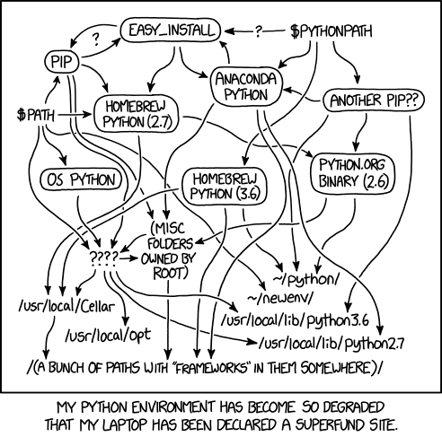
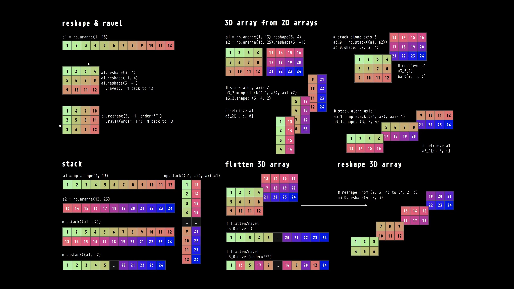
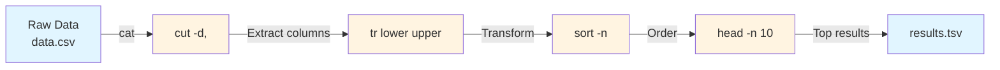

NumPy Arrays & Virtual Environments

**LIVE DEMO!**

# Virtual Environments



*Virtual environments prevent package chaos*

## Why Virtual Environments?

**The Problem:** Different projects need different package versions.

- Project A needs pandas 1.3.0
- Project B needs pandas 2.0.0
- Installing one breaks the other!

**The Solution:** Each project gets its own Python environment.

## Using venv (recommended)

**Reference:**

```bash
# Create environment
python -m venv datasci-practice

# Activate (Mac/Linux)
source datasci-practice/bin/activate

# Activate (Windows)
datasci-practice\Scripts\activate

# Install packages
pip install pandas numpy matplotlib

# Save requirements
pip freeze > requirements.txt

# Deactivate
deactivate
```

## Using uv (Fast & Modern)

[uv documentation](https://docs.astral.sh/uv/)

**Reference:**

```bash
# Install uv (if not already installed)
curl -LsSf https://astral.sh/uv/install.sh | sh

# Create environment
uv venv datasci-practice

# Activate (Mac/Linux)
source datasci-practice/bin/activate

# Activate (Windows)
datasci-practice\Scripts\activate

# Install packages
uv pip install pandas numpy matplotlib

# Save requirements
uv pip freeze > requirements.txt

# Deactivate
deactivate
```

## Using Conda

[Conda documentation](https://docs.conda.io/)

**Reference:**

```bash
# Create environment
conda create -n datasci-practice python=3.11

# Activate
conda activate datasci-practice

# Install packages
conda install pandas numpy matplotlib

# Deactivate
conda deactivate

# Save environment
conda env export > environment.yml
```

# Python Potpourri

## Type Checking

**Reference:**

```python
# Check what type your data is
user_input = "42"
print(type(user_input))     # <class 'str'>

number = int(user_input)
print(type(number))         # <class 'int'>
```

## F-String Formatting

**Reference:**

```python
name = "Alice"
grade = 87.5

# F-strings
message = f"Student {name} earned {grade:.1f}%"

# Formatting options
print(f"Grade: {grade:.2f}")      # 87.50
print(f"Grade: {grade:>8.1f}")    # Right-aligned
print(f"Grade: {grade:<8.1f}")    # Left-aligned

# Expressions in f-strings
arr = np.array([1, 2, 3, 4, 5])
print(f"Mean: {arr.mean():.2f}")
```

**LIVE DEMO!**


# Why NumPy Matters

Python is famously slow for numerical computing:

```python
# Pure Python approach (SLOW)
my_list = list(range(1_000_000))
result = [x * 2 for x in my_list]  # 46.4 ms

# NumPy approach (FAST)
import numpy as np
my_array = np.arange(1_000_000)
result = my_array * 2  # 0.3 ms - 150x faster!
```

**NumPy is 10-100x faster** than pure Python for numerical operations.

## The NumPy Solution

- **ndarray**: Fast, memory-efficient multidimensional arrays
- **Vectorized operations**: Apply functions to entire arrays at once
- **Broadcasting**: Smart handling of different-sized arrays
- **Universal functions (ufuncs)**: Fast element-wise operations

## NumPy Quick Reference



## Creating Arrays

**Reference:**

```python
import numpy as np

# From Python lists
arr = np.array([1, 2, 3, 4, 5])
arr_2d = np.array([[1, 2, 3], [4, 5, 6]])

# Array creation functions
zeros = np.zeros(5)              # array([0., 0., 0., 0., 0.])
ones = np.ones((2, 3))           # 2x3 array of ones
range_arr = np.arange(10)        # array([0, 1, 2, ..., 9])
full = np.full((2, 3), 7)        # 2x3 array filled with 7
```

## Array Properties

**Reference:**

```python
arr = np.array([[1, 2, 3], [4, 5, 6]])

print(arr.shape)      # (2, 3) - 2 rows, 3 columns
print(arr.ndim)       # 2 - number of dimensions
print(arr.size)       # 6 - total elements
print(arr.dtype)      # int64 - data type
```

## Data Types

**Reference:**

```python
# Explicit data types
arr_int = np.array([1, 2, 3], dtype=np.int32)
arr_float = np.array([1, 2, 3], dtype=np.float64)

# Type conversion
arr = np.array([1, 2, 3, 4, 5])
float_arr = arr.astype(np.float64)

# String to numeric
str_arr = np.array(["1.25", "-9.6", "42"])
num_arr = str_arr.astype(float)
```

# Array Indexing and Slicing

## Basic Indexing

**Reference:**

```python
arr = np.array([0, 1, 2, 3, 4, 5, 6, 7, 8, 9])

# Single element
first = arr[0]          # 0
last = arr[-1]          # 9

# Slicing
subset = arr[2:7]       # array([2, 3, 4, 5, 6])
every_other = arr[::2]  # array([0, 2, 4, 6, 8])
```

## Multidimensional Indexing

**Reference:**

```python
arr_2d = np.array([[1, 2, 3], [4, 5, 6], [7, 8, 9]])

# Access elements
first_row = arr_2d[0]        # array([1, 2, 3])
element = arr_2d[1, 2]       # 6

# Slicing
first_two_rows = arr_2d[:2]  # First 2 rows
middle_column = arr_2d[:, 1] # Column 1: array([2, 5, 8])
```

## Boolean Indexing

**Reference:**

```python
arr = np.array([1, 5, 3, 8, 2, 9, 4])

# Boolean mask
mask = arr > 5              # array([False, False, False, True, False, True, False])
high_values = arr[mask]     # array([8, 9])

# Conditional operations
arr[arr > 5] = 0            # Set values > 5 to 0

# Multiple conditions (use & for AND, | for OR)
mask = (arr > 2) & (arr < 8)
filtered = arr[mask]
```

## Fancy Indexing

**Reference:**

```python
arr = np.array([10, 20, 30, 40, 50, 60, 70, 80])

# Integer array indexing
indices = [1, 3, 5]
selected = arr[indices]      # array([20, 40, 60])

# 2D fancy indexing
arr_2d = np.array([[1, 2, 3], [4, 5, 6], [7, 8, 9]])
selected = arr_2d[[0, 2], [1, 2]]  # array([2, 9])
```

## Views vs Copies

**Reference:**

```python
arr = np.array([1, 2, 3, 4, 5])

# Slicing creates views (shares memory)
view = arr[1:4]
view[0] = 99                # Modifies original!
print(arr)                  # array([1, 99, 3, 4, 5])

# Explicit copy
arr = np.array([1, 2, 3, 4, 5])
copy = arr[1:4].copy()
copy[0] = 99                # Doesn't affect original
print(arr)                  # array([1, 2, 3, 4, 5])
```

# NumPy Operations

## Arithmetic and Vectorized Operations

**Reference:**

```python
arr1 = np.array([1, 2, 3, 4, 5])
arr2 = np.array([5, 4, 3, 2, 1])

# Element-wise operations
sum_arr = arr1 + arr2       # array([6, 6, 6, 6, 6])
mult_arr = arr1 * arr2      # array([5, 8, 9, 8, 5])
power_arr = arr1 ** 2       # array([1, 4, 9, 16, 25])

# Scalar operations
doubled = arr1 * 2          # array([2, 4, 6, 8, 10])
arr = np.array([[1, 2, 3], [4, 5, 6]])
result = arr + 10           # Adds 10 to all elements
```

## Statistical Operations

**Reference:**

```python
grades = np.array([[85, 92, 78], [95, 88, 91], [82, 90, 87]])

# Basic statistics
mean = grades.mean()         # 88.2
std = grades.std()           # Standard deviation
max_val = grades.max()       # 95
min_val = grades.min()       # 78

# Axis-specific (0=columns, 1=rows)
student_avg = grades.mean(axis=1)  # Average per student
test_avg = grades.mean(axis=0)     # Average per test
```

## Array Reshaping

**Reference:**

```python
# Reshaping
arr = np.arange(12)
reshaped = arr.reshape(3, 4)  # 1D to 2D
flattened = reshaped.flatten() # 2D back to 1D

# Transposing (flip rows/columns)
arr_2d = np.array([[1, 2, 3], [4, 5, 6]])
transposed = arr_2d.T         # Shape (2,3) -> (3,2)
```

## NumPy Quick Reference


*Essential NumPy operations at a glance*

**LIVE DEMO!**

# Command Line Data Processing

Command line tools are powerful for quick data processing tasks. Commands can be chained together using pipes (`|`) to create data processing pipelines.

**Note:** The backslash `\` at the end of a line continues the command on the next line, making long pipelines easier to read.



*Data flows through a series of command line tools, each performing one transformation*

## Text Processing

**Reference:**

```bash
# cut: Extract columns
cut -d',' -f1,3 data.csv        # Columns 1 and 3
cut -c1-10 file.txt             # Characters 1-10

# sort: Sort data
sort -n data.txt                # Numerical sort
sort -k2 -n data.csv            # Sort by column 2

# uniq: Remove duplicate lines (requires sorted input)
sort data.txt | uniq            # Remove duplicates
sort data.txt | uniq -c         # Count occurrences
sort data.txt | uniq -d         # Show only duplicates

# grep: Search and filter
grep "pattern" file.txt         # Find pattern
grep -v "pattern" file.txt      # Inverse match
grep -i "pattern" file.txt      # Case-insensitive
```

## Advanced Processing

**Reference:**

```bash
# tr: Translate characters
tr 'a-z' 'A-Z' < file.txt       # Uppercase
tr -d ' ' < file.txt            # Delete spaces

# sed: Stream editor
sed 's/old/new/g' file.txt      # Replace all
sed '/pattern/d' file.txt       # Delete lines

# awk: Pattern processing
awk '{print $1, $3}' file.txt   # Print columns 1, 3
awk -F',' '$3 > 50' data.csv    # Filter rows
```

## Data Pipelines

**Reference:**

```bash
# Complex pipeline
cat data.csv | \
  cut -d',' -f2,4 | \
  tr '[:lower:]' '[:upper:]' | \
  sort -k2 -n | \
  head -n 10 > results.tsv
```

## Command Line Graphing

Not the best way to visualize, but it can be helpful in a pinch.

#FIXME: gnuplot & sparkline?

**LIVE DEMO!**
