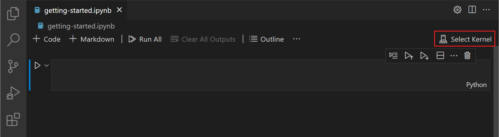
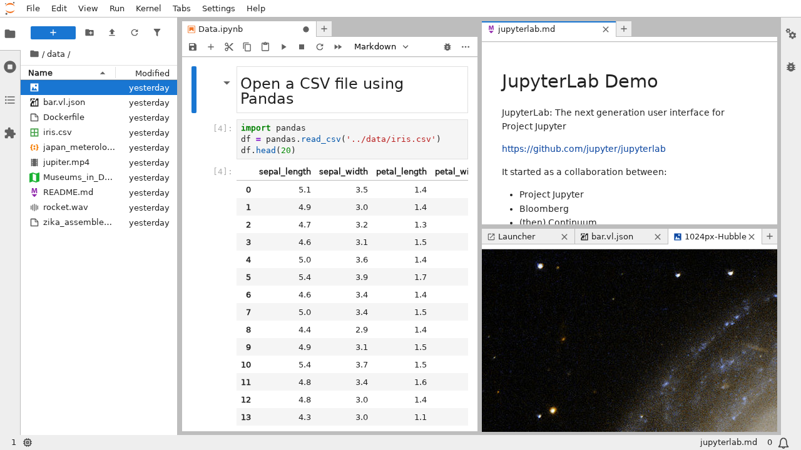
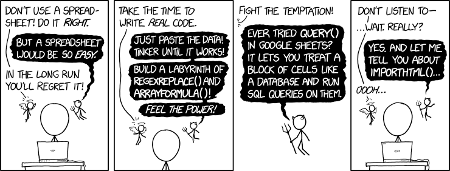

---
notion:
  title_line: "# Pandas on Jupyter: Data Structures & I/O"
  role: lecture
  status: mapped
  page_id: "281d9fdd-1a1a-800a-897d-cafb5971c23f"
  url: "https://app.notion.com/p/281d9fdd1a1a800a897dcafb5971c23f"
---

# Pandas on Jupyter: Data Structures & I/O

See [BONUS.md](BONUS.md) for the optional extensions.

**Live notebooks in Colab:** [Demo 1](https://colab.research.google.com/github/christopherseaman/datasci_217/blob/main/04/demo/demo1_jupyter_basics.ipynb) · [Demo 2](https://colab.research.google.com/github/christopherseaman/datasci_217/blob/main/04/demo/demo2_pandas_basics.ipynb) · [Demo 3](https://colab.research.google.com/github/christopherseaman/datasci_217/blob/main/04/demo/demo3_data_io.ipynb)

# Jupyter Notebooks: Interactive Data Analysis

In Lectures 01–03 you ran Python two ways. Lines typed at the `>>>` prompt (the REPL) are remembered until you exit. A `.py` script starts from nothing and runs top to bottom. Exploring a new dataset needs a bit of both. You load a clinic's visit file once, look at the first rows, notice that temperature was recorded as text, try a fix, and look again, without reloading the file after every question. You also want the explanation next to the results so a colleague can follow your reasoning.

A **Jupyter notebook** (`.ipynb` file) does that. It is a document made of **cells**: a **code cell** holds Python, and a **Markdown cell** holds formatted notes like the ones you wrote in Lecture 02. Think of a lab notebook, where the procedure, the measurement, and your interpretation sit on the same page. When you run a code cell, its result appears directly beneath it and is saved in the file.

The code runs in a **kernel**: a Python process that stays alive between cells, like the REPL. A kernel uses one Python environment, so choosing a notebook's kernel is how you point it at the `.venv` you created in Lecture 03. Scripts remain the better fit for automation; notebooks are for exploring and explaining.

## Opening and Running a Notebook

You will use notebooks in two places. Assignments run locally in VS Code. Lecture demos open in **Google Colab**, a free hosted notebook service, so you can run them without installing anything. In Colab the kernel runs on a Google machine called a **runtime**; files you create there disappear when the runtime shuts down.



In VS Code, open any `.ipynb` file, click **Select Kernel** (top right), and choose the activity's Python environment. **Run All** runs every cell in order; **Clear All Outputs** erases the results saved under the cells. Screenshot: [VS Code notebook documentation](https://code.visualstudio.com/docs/datascience/jupyter-notebooks).

### Reference Card: Notebook controls

| Task | VS Code | Colab | Result |
| --- | --- | --- | --- |
| Create a notebook | Command Palette → **Create: New Jupyter Notebook** | **File → New notebook in Drive** | New `.ipynb` file |
| Run a cell | `Shift+Enter` (run, move on) or `Ctrl+Enter` (run, stay) | Same keys | Output appears below the cell |
| Add a cell | **+ Code** / **+ Markdown** | **+ Code** / **+ Text** | New cell |
| Delete a cell | Trash icon, or `DD` in command mode | Trash icon | Cell removed |
| Choose Python | **Select Kernel** | Managed for you by the runtime | Which interpreter runs the cells |
| Keep your changes | `Ctrl+S` (`Cmd+S` on macOS) | **File → Save a copy in Drive** | Edits saved; Colab does not save back to the course repository |

Shortcuts such as `A` (add a cell above), `B` (add a cell below), and `DD` (delete) work only in **command mode**: press `Esc` so the cell is selected but not being edited. In Colab, press `Ctrl+M` first, then the letter.

### Code Snippet: A notebook cell

```python
# Cell 1: the kernel keeps these values
name = "Ada"
scores = [8, 9, 10]
```

```python
# Cell 2: a later cell can use them, and its output appears below it
average = sum(scores) / len(scores)
print(f"{name}'s average: {average:.1f}")
```

```text
Ada's average: 9.0
```

### Alternative: JupyterLab

JupyterLab is Jupyter's own browser interface, started with `jupyter lab` from an environment that has it installed. The parts are the same: a file browser, cells with a run number such as `[4]` beside them, and output beneath each cell.



Screenshot: [JupyterLab interface documentation](https://jupyterlab.readthedocs.io/en/latest/user/interface.html).

## Kernel State and Execution Order

The kernel's **state** is every name and value it currently holds. Running a cell changes state; editing a cell without running it does not. The number beside a cell, such as the `[4]` in the JupyterLab screenshot, is its **execution count**: the order in which the kernel actually ran it. The kernel follows the order you click, not the order of cells on the page. A notebook can therefore look correct and still depend on something you ran earlier and then changed or deleted.

The result saved under a cell is **stored output**: a record of the last time that cell ran, not proof that the notebook works now.

| Step | You do | Execution count | Output under the cell |
| --- | --- | --- | --- |
| 1 | Run `units = 12` and `rate = 2` | `[1]` | none |
| 2 | Run `total = units * rate` and `print(total)` | `[2]` | `24` |
| 3 | Edit the first cell to `rate = 3` but do not run it | still `[1]` | `24`, now stale |
| 4 | Restart & Run All | `[1]`, `[2]` | `36` |

### Reference Card: Kernel actions

| Action | Where | When to use it | Result |
| --- | --- | --- | --- |
| Interrupt | VS Code: **Interrupt** (■); Colab: **Runtime → Interrupt execution** | A cell runs far longer than expected; the notebook's Ctrl+C from Lecture 01 | Stops the cell; state is kept |
| Restart | VS Code: **Restart**; Colab: **Runtime → Restart session** | Values look wrong, the kernel is stuck, or "it worked before but now it doesn't" | Empty state; cells and stored output stay on the page |
| Run All | VS Code: **Run All**; Colab: **Runtime → Run all** | After a restart | Every cell runs top to bottom |
| Restart & Run All | VS Code: **Restart**, then **Run All**; Colab: **Runtime → Restart session and run all** | Before you commit or submit | Shows the notebook works from a fresh start |

### Code Snippet: A producer cell and a dependent cell

```python
# Cell 1 (producer): defines names
units = 12
rate = 3
```

```python
# Cell 2 (dependent): needs the names from Cell 1
total = units * rate
print("total:", total)  # total: 36
```

If Cell 2 sits above Cell 1, Restart & Run All stops with `NameError: name 'units' is not defined`. Fix it by moving the producer cell above the dependent cell, not by copying the definition into another cell.

To run a whole notebook from the terminal instead, see [Running notebooks non-interactively](BONUS.md#running-notebooks-non-interactively).

## Jupyter Magic Commands

**Magic commands** are notebook-only shortcuts that start with `%`. Think of them as the Konami code of Jupyter: instead of 30 extra lives, you get shell shortcuts and a stopwatch. `%pwd` and `%ls` mirror the Lecture 01 shell commands and show where the notebook is running and which files it can see; check them first when a notebook cannot find a file. `%timeit` times one line of Python by running it many times.

### Reference Card: Magic commands

| Command | Arguments | Typical output / effect |
| --- | --- | --- |
| `%pwd` | None | Current working directory, as a quoted string |
| `%ls` | None | Directory contents |
| `%timeit expression` | Python expression | Timing summary |
| `%pip install -r requirements.txt` | Requirements path | Packages installed into the active kernel |
| `%pip list` | None | Installed packages |
| `%pip show package_name` | Package name | Package metadata |

### Code Snippet: Where is the notebook running?

A cell shows the value of its last line only, so give `%pwd` its own cell:

```python
%pwd
```

```text
'/content'
```

That is Colab's working directory; in VS Code, it is usually the notebook's folder.

```python
%timeit sum(range(100))
```

```text
693 ns ± 3.46 ns per loop (mean ± std. dev. of 7 runs, 1,000,000 loops each)
```

Times vary by machine.

```python
# Install the requirements recorded for the current activity
%pip install -r requirements.txt
```

## Notebook Outputs and Git

Jupyter notebooks are like that one friend who screenshots everything you text them. They save both your code AND all the outputs (results, data, plots) in the same file.

Accidentally printed passwords, patient data, or embarrassing test results are saved in the notebook too—like having a photographic memory of your most awkward moments.

### Code Snippet: What Git actually commits

```python
patient_name = "Example Patient"
blood_pressure = "120/80"
print(patient_name, blood_pressure)  # Example Patient 120/80
```

Open the `.ipynb` file in a text editor and that line is right there, in the file Git will commit:

```json
{"cell_type": "code",
 "execution_count": 1,
 "outputs": [{"name": "stdout", "output_type": "stream",
              "text": ["Example Patient 120/80\n"]}]}
```

### Before You Commit a Notebook

1. **Clear all outputs**: click **Clear All Outputs** in VS Code.
2. **Check for sensitive data**: make sure no personal information, passwords, or confidential data is visible.
3. **Save the notebook**: the outputs are removed from the file.

Then check the notebook's diff in VS Code Source Control (Lecture 02) before you commit.

# LIVE DEMO!

# Introduction to Pandas



*Spreadsheets* by xkcd — a reminder that a DataFrame is useful when the spreadsheet is becoming a program.

In Lecture 03, a NumPy array held one type of value and you picked items by integer position, as in `arr[2]`. A clinic's visit table is messier: a text patient ID, an integer age, a decimal temperature, a `True`/`False` smoker flag. You want to ask for "patient P002's temperature" rather than "row 1, column 1", and you want each patient's values to stay together when you sort or filter.

**pandas** is the Python library for labeled tables. It builds on NumPy and adds two structures:

- A **Series** is one column of values plus an **index**, a label for each value. McKinney describes a Series as a fixed-length, ordered dictionary (Lecture 02): each label maps to one value.
- A **DataFrame** is a table whose columns share one row index. Each column is a Series with its own **dtype** (data type), so text, numbers, and `True`/`False` can sit side by side.

*Fun fact: the name comes from **panel data**, an econometrics term for datasets that follow the same subjects over time (think of a longitudinal cohort study), and it is also a play on "Python data analysis." No bears were involved. 🐼*

pandas is conventionally imported as `pd`. The course uses pandas 3.0.5, and every output below comes from that version; pandas 2 prints some results differently.

```python
import pandas as pd
```

## Series and DataFrames

```text
Series temp_c         DataFrame visits
index  value          index  age  temp_c  smoker   <- column labels
P001   36.8           P001    34    36.8   False
P002   38.1           P002    58    38.1    True
P003   37.2           P003    41    37.2   False
                                  ^ the temp_c column is itself a Series
```

*Think of Series inside DataFrames like Russian nesting dolls: one labeled column fits inside the larger labeled table.*

### Reference Card: Series attributes and methods

| Item | Purpose / arguments | Output / note |
| --- | --- | --- |
| `pd.Series(data, index=None, name=None)` | `data` may be a list, a NumPy array, or a dict (its keys become the index); optional labels and name | New `Series` |
| `series.index` | Access index labels | `Index(['P001', 'P002', 'P003'], dtype='str')` |
| `series.values` | Access underlying values without labels | NumPy array or extension array, depending on dtype |
| `series.name` | Get/set Series name | Series name |
| `series.dtype` | Get data type | Data type |
| `series.size` | Number of elements | Integer element count |
| `series.head(n=5)` | First n elements | `Series` with original labels |
| `series.tail(n=5)` | Last n elements | `Series` with original labels |
| `series.describe()` | Summarize values according to dtype | Statistics as a `Series` |

### Code Snippet: Create and inspect a Series

```python
temp_c = pd.Series([36.8, 38.1, 37.2], index=["P001", "P002", "P003"], name="temp_c")
print(temp_c)
print(temp_c["P002"])  # 38.1
```

```text
P001    36.8
P002    38.1
P003    37.2
Name: temp_c, dtype: float64
38.1
```

*Pro tip: DataFrames are like Excel spreadsheets, but with superpowers. They can handle millions of rows without breaking a sweat, and they never ask you to "save as" or complain about circular references.*

### Reference Card: DataFrame attributes and methods

| Item | Purpose / arguments | Output / note |
| --- | --- | --- |
| `pd.DataFrame(data, index=None, columns=None)` | Supply data, such as a dict of lists, and optional row/column labels | New `DataFrame` |
| `pd.DataFrame(array_2d, index=[...], columns=[...])` | Build from a 2D NumPy array, as in Lecture 03 | Labeled `DataFrame` |
| `df.index.name = "patient_id"` | Label the row index | Shown above the index; becomes the index column's header when you save a CSV |
| `df.index` | Access row index | Index labels |
| `df.columns` | Access column names | Column labels |
| `df.values` | Get values as NumPy array | NumPy array of values |
| `df.shape` | Count rows and columns | `(rows, columns)` tuple |
| `df.dtypes` | Data types per column | Series of column dtypes |
| `df.info()` | Inspect columns, **non-null counts** (values present, not missing), dtypes, and memory | Prints a summary; returns `None` |
| `df.describe()` | Summarize numeric columns | count, mean, std, min, quartiles, max per column |
| `df.head(n=5)` | First n rows | `DataFrame` with original labels |
| `df.tail(n=5)` | Last n rows | `DataFrame` with original labels |
| `df.sample(n=5)` | Random n rows | Random sample DataFrame |

### Code Snippet: Create and inspect a DataFrame

```python
visits = pd.DataFrame(
    {"age": [34, 58, 41], "temp_c": [36.8, 38.1, 37.2], "smoker": [False, True, False]},
    index=["P001", "P002", "P003"],
)
visits.index.name = "patient_id"
print(visits)
print(visits.shape)  # (3, 3)
print(visits.dtypes)
```

```text
            age  temp_c  smoker
patient_id                     
P001         34    36.8   False
P002         58    38.1    True
P003         41    37.2   False
(3, 3)
age         int64
temp_c    float64
smoker       bool
dtype: object
```

## Selecting Columns

Most questions need only a few columns: "what were the temperatures?" rather than the whole table. Brackets select columns by label. One label gives a Series; a list of labels (double brackets) gives a DataFrame, even when the list holds one name.

*Think of column selection like picking your team for dodgeball - sometimes you want just your star player (single column), and sometimes you want your entire A-team (multiple columns).*

### Reference Card: Column selection

| Expression | Arguments | Output |
| --- | --- | --- |
| `df["column_name"]` | One label | `Series` |
| `df[["col1", "col2"]]` | List of labels | `DataFrame` |
| `df.column_name` | Identifier that does not conflict with an attribute | `Series`; fails on names with spaces or names shared with a DataFrame method, so prefer brackets |
| `df.select_dtypes(include=["number"])` | Dtype selector | Matching-column `DataFrame` |

### Code Snippet: Select Series and DataFrames

```python
temps = visits["temp_c"]          # one label -> Series
print(type(temps))
temp_table = visits[["temp_c"]]   # a list of one label -> DataFrame
print(type(temp_table))
print(visits[["age", "temp_c"]])
```

```text
<class 'pandas.Series'>
<class 'pandas.DataFrame'>
            age  temp_c
patient_id             
P001         34    36.8
P002         58    38.1
P003         41    37.2
```

## Selecting with `.loc` and `.iloc`

Brackets pick columns. To pick rows, or rows and columns together, use `.loc` or `.iloc`. In Lecture 03 you selected from a 2D array with `arr[row, col]` positions; `.iloc` works the same way, while `.loc` uses the labels pandas adds.

*Warning: Indexing in pandas is like a choose-your-own-adventure book—there are multiple ways to get to the same destination, and sometimes you end up in a completely different story than you intended.*

| Selector | Uses | Same cell | Slice ending |
| --- | --- | --- | --- |
| `.loc` | Row and column labels | `visits.loc["P002", "temp_c"]` → `38.1` | `visits.loc["P001":"P002"]` includes `P002` |
| `.iloc` | Integer positions | `visits.iloc[1, 1]` → `38.1` | `visits.iloc[0:2]` stops before position `2` |

*Think of it this way: `.loc` asks for patient "P002" by name; `.iloc` asks for "the 2nd row" by position (0, 1, 2...).*

### Reference Card: Selection by label and position

- `df.loc[row_label, column_label]`: One value, by labels.
- `df.loc["P001":"P002", ["age", "temp_c"]]`: A label slice (includes the end label) and a list of columns; returns a `DataFrame`.
- `df.loc["P002"]`: One whole row, as a `Series`.
- `df.loc[:, ["age"]]`: `:` means every row.
- `df.iloc[1, 1]`, `df.iloc[0:2, 0:2]`: The same selections by integer position; slices stop before the end position.

### Code Snippet: Compare label and position selection

```python
print(visits.loc["P002", "temp_c"])                  # 38.1 (row label, column label)
print(visits.iloc[1, 1])                             # 38.1 (row position 1, column position 1)
print(visits.loc["P001":"P002", ["age", "temp_c"]])  # label slice includes P002
print(visits.iloc[0:2, 0:2])                         # position slice stops before 2
```

```text
38.1
38.1
            age  temp_c
patient_id             
P001         34    36.8
P002         58    38.1
            age  temp_c
patient_id             
P001         34    36.8
P002         58    38.1
```

Both slices print the same two rows, P001 and P002.

### Common Mistakes: Labels vs Positions

- **`.loc`** = **L**abels; **`.iloc`** = **i**nteger **loc**ations (0, 1, 2, ... like list positions).
- `visits.loc[1, "age"]` raises `KeyError: 1`: no row is *labeled* 1.
- `visits.iloc["P002", 0]` raises `ValueError`: `.iloc` accepts positions only.

## Filtering Rows with a Boolean Mask

In Lecture 03, `arr[arr > 5]` kept the NumPy values that passed a test. pandas works the same way, with one improvement: comparing a column returns a Boolean Series that carries the table's index, so each `True` or `False` stays attached to its patient. A **mask** is that Boolean Series. Give it a descriptive name, then pass it to `.loc` with the columns you want.

```text
temp_c >= 38.0     has_fever      visits.loc[has_fever, ["age", "temp_c"]]
P001  36.8   ->    P001  False
P002  38.1   ->    P002  True  -> P002   58   38.1
P003  37.2   ->    P003  False
```

### Reference Card: Boolean masks

- `mask = df["col"] >= value`: Test every row; returns a Boolean `Series` with the same index.
- `df.loc[mask]`: Keep the rows where `mask` is `True`.
- `df.loc[mask, ["col1", "col2"]]`: Keep matching rows and only the listed columns.
- `(df["a"] > 1) & (df["b"] < 5)`, `(...) | (...)`: Combine tests with AND / OR; parentheses are required, as in Lecture 03.
- `mask.sum()`: Count the `True` rows.

### Code Snippet: Keep patients with a fever

```python
has_fever = visits["temp_c"] >= 38.0
print(has_fever)
print(visits.loc[has_fever, ["age", "temp_c"]])
```

```text
patient_id
P001    False
P002     True
P003    False
Name: temp_c, dtype: bool
            age  temp_c
patient_id             
P002         58    38.1
```

# LIVE DEMO!

# Deriving and Ordering Data

Selecting answers "which rows and columns?" Two more questions come up in every analysis: "what number do I actually need?" and "which rows matter most?" A clinic export rarely stores the value you want to report. It stores a temperature in Celsius when the chart is in Fahrenheit, or a baseline and a follow-up when the interesting number is the change between them. You compute that value once, for the whole table, and pandas keeps each result attached to its patient.

Then you put the interesting rows on top. In Lecture 03, `np.sort()` reordered bare values. A table has to move whole rows, so each patient's other columns travel with the value you sorted on.

```text
visits                 add temp_f                    sort by temp_f (highest first)
     age  temp_c            age  temp_c  temp_f           age  temp_c  temp_f
P001  34    36.8      P001   34    36.8   98.24     P002   58    38.1  100.58
P002  58    38.1      P002   58    38.1  100.58     P003   41    37.2   98.96
P003  41    37.2      P003   41    37.2   98.96     P001   34    36.8   98.24
```

## Adding Columns

A **derived column** is computed from columns you already have: a temperature in Fahrenheit, a change from baseline, a body-mass index. Assign to a new column name with brackets. As with NumPy's vectorized arithmetic in Lecture 03, pandas computes the whole column at once with no loop, matching rows by index label.

### Reference Card: Adding, updating, and removing columns

- `df["new"] = expression`: Add a column, or replace it if the name exists; values line up by index label.
- `df.drop(columns=["col1", "col2"])`: Return a new DataFrame without the named columns; `columns=` names what to leave out, as one label or a list, and the original table keeps every column.
- `df.loc[mask, "col"] = value`: Update only the rows where `mask` is `True`, in the original table.
- `subset = df.loc[mask].copy()`: Make a separate table you intend to modify, and say so explicitly.

### Code Snippet: Derive and flag

```python
visits["temp_f"] = visits["temp_c"] * 9 / 5 + 32
visits["flag"] = "ok"
visits.loc[visits["temp_c"] >= 38.0, "flag"] = "fever"
print(visits)
```

```text
            age  temp_c  smoker  temp_f   flag
patient_id                                    
P001         34    36.8   False   98.24     ok
P002         58    38.1    True  100.58  fever
P003         41    37.2   False   98.96     ok
```

### Common Mistake: Chained Assignment

In Lecture 03, a NumPy slice was a view, so changing the slice changed the original array. pandas 3 uses **Copy-on-Write**: every selection behaves like a separate copy. Two bracket steps in a row therefore change a temporary copy. pandas warns with `ChainedAssignmentError`, and `visits` stays unchanged.

```python
visits[visits["temp_c"] >= 38.0]["flag"] = "fever"     # warning; visits is not updated
visits.loc[visits["temp_c"] >= 38.0, "flag"] = "fever"  # one step: updates visits
```

To change a separate table, such as the fever patients only, copy it first, as with NumPy arrays in Lecture 03: `fever_visits = visits.loc[has_fever].copy()`.

## Sorting Rows

A sorted table answers "who is highest?" at a glance: which patients had the largest blood-pressure drop, or which readings are most extreme. `sort_values()` reorders whole rows, so each patient's other columns and index label travel with the sorted value.

Sorting returns a **new** DataFrame and leaves the original in its old order; assign the result to a name to keep it. When two rows share a value (a **tie**), add a unique second key, such as an ID, so the order is the same on every run: a **deterministic sort**.

### Reference Card: Sorting

- `df.sort_values("col")`: Sort rows by one column, smallest first; returns a new DataFrame.
- `df.sort_values("col", ascending=False)`: Largest first.
- `df.sort_values(by=["col1", "col2"], ascending=[False, True])`: Sort by `col1` descending, then break ties with `col2` ascending, one direction per key. `by` may also name the row index, such as `"patient_id"` in `visits`.
- `df.sort_index()`: Sort rows by their index labels.

### Code Snippet: Break a tie with a unique ID

```python
vitals = pd.DataFrame({
    "patient_id": ["P003", "P001", "P002", "P004"],
    "systolic": [142, 118, 142, 130],
})
by_pressure = vitals.sort_values(
    by=["systolic", "patient_id"],
    ascending=[False, True],
)
print(by_pressure)
```

```text
  patient_id  systolic
2       P002       142
0       P003       142
3       P004       130
1       P001       118
```

P002 and P003 tie at 142, and `patient_id` puts P002 first. The index labels (2, 0, 3, 1) show where each row started. `vitals` itself is unchanged.

# Data Loading and Storage


*Making Progress* by xkcd — progress, now with columns.

In Lecture 02 you read a text file with `open()`, and everything came back as one string of text. In Lecture 03 you inspected a CSV with a shell pipeline (`tail`, `cut`, `sort`). A **CSV file** (comma-separated values) is plain text: the first line is the **header** with the column names, and each later line is one record. `pd.read_csv()` opens the file, splits every line into columns, and detects each column's type in one call, returning a DataFrame. `df.to_csv()` writes one back out.

A path such as `"data/visits.csv"` is **relative** to the notebook's working directory; check it with `%pwd`. The wrong directory gives `FileNotFoundError: [Errno 2] No such file or directory: 'data/visits.csv'`. `pd.read_csv()` also accepts a web address (URL), which is handy in Colab, where the files on your computer are not available.

## Reading and Writing CSV Files

Health data files mark missing values in many ways: a blank, `NA`, `NULL`, `?`. pandas already treats blanks and common markers such as `NA`, `N/A`, and `NULL` as missing and prints each one as **`NaN`** (*Not a Number*). Anything else is read as ordinary text, and a single `?` turns a whole numeric column into text (`str`). List the extra markers with `na_values` when you read.

*Fun fact: CSV stands for "Comma-Separated Values," but in reality, it's more like "Comma-Separated Values (unless someone used semicolons, or tabs, or pipes, or any other delimiter they felt like using that day)."*

`visits.csv`:

```text
patient_id,age,temp_c,clinic
P001,34,36.8,North
P002,58,?,South
P003,41,37.2,North
P004,,38.4,NULL
P003,41,37.2,North
```

| Read with | `temp_c` dtype | `?` becomes | `NULL` becomes |
| --- | --- | --- | --- |
| `pd.read_csv("visits.csv")` | `str` (text) | the text `"?"` | `NaN` (missing) |
| `pd.read_csv("visits.csv", na_values=["?"])` | `float64` | `NaN` (missing) | `NaN` (missing) |

### Reference Card: CSV and Parquet input and output

| Task | Call | Key arguments | Result |
| --- | --- | --- | --- |
| Read CSV | `pd.read_csv(path)` | `path` may be a file path or URL; `na_values=["?"]` adds missing markers to the defaults (blank, `NA`, `N/A`, `NULL`, ...); `index_col="patient_id"` makes a column the row index; `sep=";"` reads other delimiters | New `DataFrame` |
| Write CSV | `df.to_csv(path)` | Writes the row index as the first column, headed by `df.index.name` | CSV file; returns `None` |
| Write CSV | `df.to_csv(path, index=False)` | Leaves the row index out | CSV with only the data columns |
| Read Parquet | `pd.read_parquet(path)` | Reads a **Parquet** file: a compressed format that stores each column with its dtype, so nothing is re-guessed; needs the `pyarrow` package | New `DataFrame` |
| Write Parquet | `df.to_parquet(path, index=False)` | `index=False` leaves the row index out, as with `to_csv` | Parquet file |

### Code Snippet: Read with missing markers

```python
visits = pd.read_csv("visits.csv", na_values=["?"])
print(visits)
print(visits.dtypes)
```

```text
  patient_id   age  temp_c clinic
0       P001  34.0    36.8  North
1       P002  58.0     NaN  South
2       P003  41.0    37.2  North
3       P004   NaN    38.4    NaN
4       P003  41.0    37.2  North
patient_id        str
age           float64
temp_c        float64
clinic            str
dtype: object
```

`age` became `float64` because `NaN` is a floating-point value; Lecture 05 shows how to keep whole numbers when values are missing.

### Code Snippet: Keep or drop the index when writing

```python
by_patient = pd.read_csv("visits.csv", na_values=["?"], index_col="patient_id")
by_patient.to_csv("with_index.csv")             # first line: patient_id,age,temp_c,clinic
by_patient.to_csv("no_index.csv", index=False)  # first line: age,temp_c,clinic
```

Keep the index when it holds meaningful labels such as patient IDs. Use `index=False` when the index is just the default 0, 1, 2, ... row numbers. Reading the saved file back with `pd.read_csv()`, a **round trip**, confirms that the columns you meant to write are there.

*Pro tip: If you're ever stuck with a weird file format, remember: "There's a pandas function for that!"* pandas has matching readers and writers for other formats, such as `pd.read_excel()` and `pd.read_json()`; see [Extended I/O and Performance](BONUS.md#extended-io-and-performance).

## Showing a Table: `display()` vs `print()`

`print()` shows plain text in scripts and notebooks alike. In a notebook, `display()` renders a Series or DataFrame as a formatted table, like the one in the JupyterLab screenshot, which is easier to scan when you are looking over a table you just loaded. As in the `%pwd` example, a cell shows only its last line's value automatically; anything earlier needs `print()` or `display()`.

*Think of `print()` as the reliable Honda Civic—works almost anywhere—while `display()` is the sports car: prettier, but happiest in Jupyter.*

### Code Snippet: Choose notebook output

```python
print(visits)    # Plain text, works everywhere
display(visits)  # Formatted table in Jupyter
len(visits)      # Last line: shown automatically as 5
```

## Inspecting a Loaded Table

Before analyzing a new clinic export, answer the questions below. Each check is one line, and its output tells you what Lecture 05's cleaning tools will need to fix.

### Reference Card: First-look inspection

| Question | Call | Typical output |
| --- | --- | --- |
| Size, types, typical values? | `df.shape`, `df.info()`, `df.describe()` | `(rows, columns)`; non-null counts and dtypes; numeric summary (DataFrame card above) |
| What is missing? | `df.isna().sum()` | Missing count per column |
| Which categories? | `df["col"].value_counts()` | Count per value, most common first; `dropna=False` also counts missing |
| Distinct values? | `df["col"].unique()` / `df["col"].nunique()` | The distinct values, including missing, such as `['North', 'South', nan]` / how many, excluding missing: `2` |
| Repeated records? | `df.duplicated().sum()` | Rows identical to an earlier row; `df.duplicated()` alone is a Boolean mask |

### Code Snippet: Count gaps, categories, and repeats

```python
print(visits.isna().sum())
print(visits["clinic"].value_counts(dropna=False))
print(visits.duplicated().sum())
```

```text
patient_id    0
age           1
temp_c        1
clinic        1
dtype: int64
clinic
North    3
South    1
NaN      1
Name: count, dtype: int64
1
```

The row labeled 4 repeats row 2: the same visit entered twice. Because `visits.duplicated()` is a mask, `visits.loc[visits.duplicated()]` shows the repeated row.

> Never be afraid to make a mistake. Unless it's in Git. Then be afraid. Be very afraid.

# LIVE DEMO!
