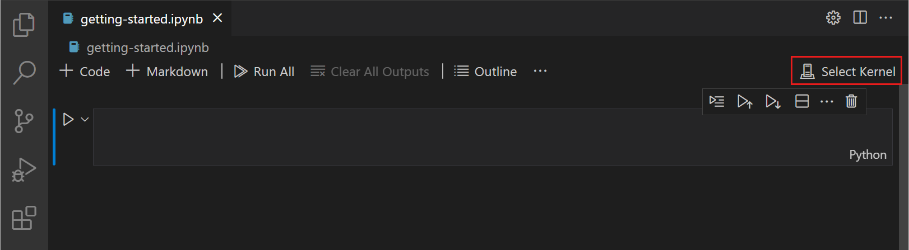
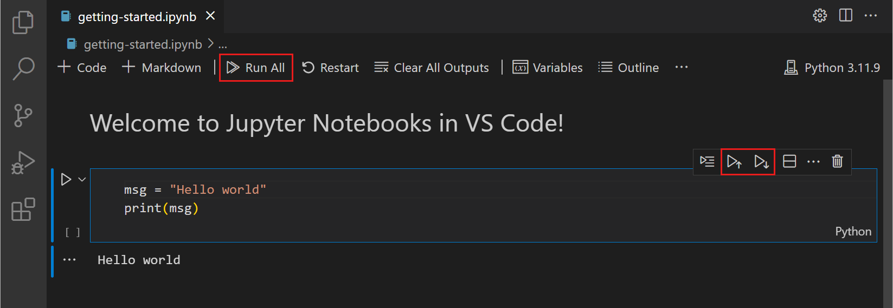
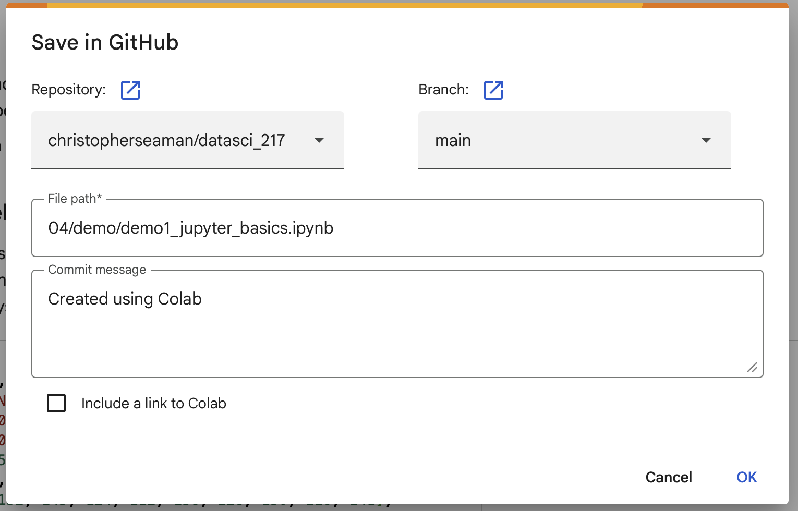
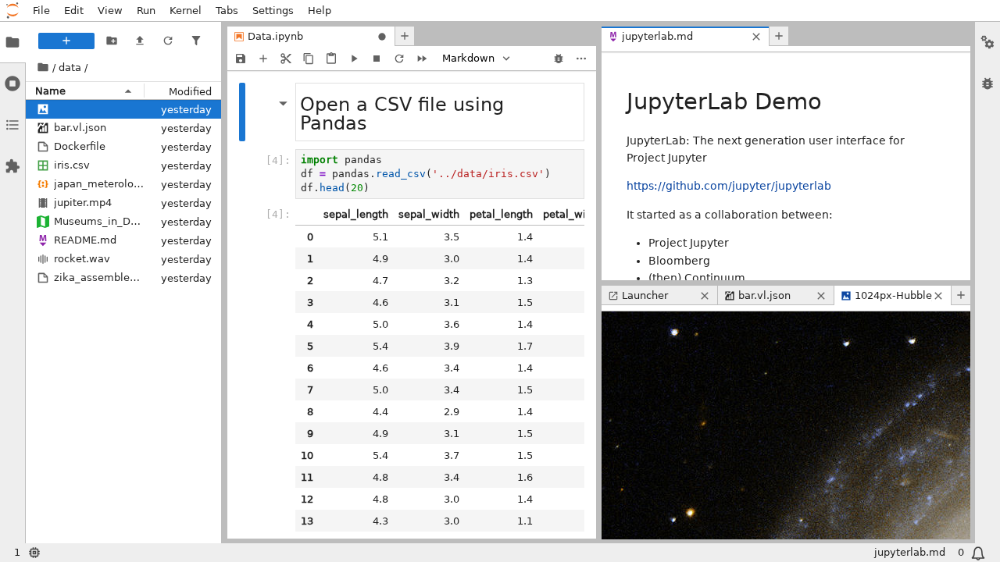
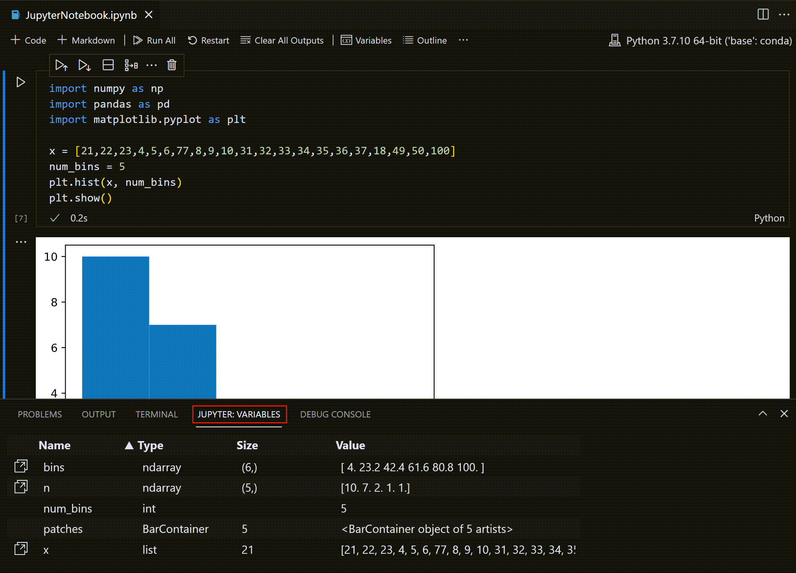
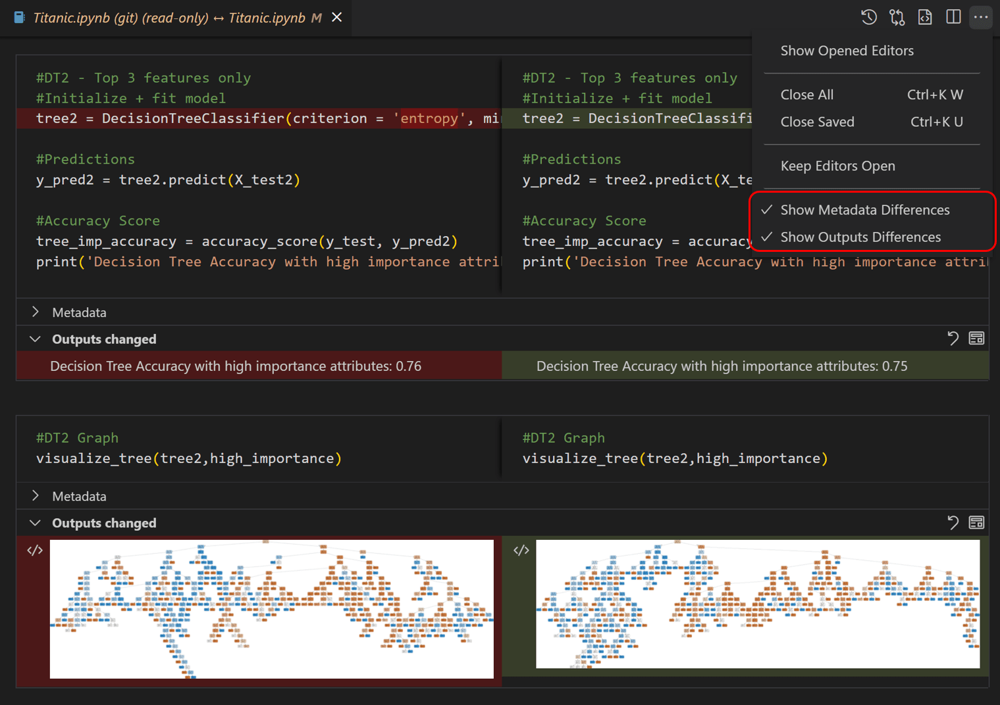

---
notion:
  title_line: "# Pandas on Jupyter: Data Structures & I/O"
  role: lecture
  status: mapped
  page_id: "281d9fdd-1a1a-800a-897d-cafb5971c23f"
  url: "https://app.notion.com/p/281d9fdd1a1a800a897dcafb5971c23f"
---

# Pandas on Jupyter: Data Structures & I/O

See [BONUS.md](BONUS.md) for the optional extensions.

**Live notebooks in Colab:** [Demo 1](https://colab.research.google.com/github/christopherseaman/datasci_217/blob/main/04/demo/demo1_jupyter_basics.ipynb) · [Demo 2](https://colab.research.google.com/github/christopherseaman/datasci_217/blob/main/04/demo/demo2_pandas_basics.ipynb) · [Demo 3](https://colab.research.google.com/github/christopherseaman/datasci_217/blob/main/04/demo/demo3_data_io.ipynb)

**Run locally:**

```shell
curl -fsSL https://raw.githubusercontent.com/christopherseaman/datasci_217/main/04/demo/setup_demo.sh | sh
cd ~/04-demo
uv venv --seed
source .venv/bin/activate
uv sync
```

→ Then open the `04-demo` folder in VS Code.

This lecture covers McKinney, _Python for Data Analysis_ (3rd ed.):

- 2.2 (running the Jupyter notebook)
- Chapter 5 (getting started with pandas)
- Chapter 6 (data loading, storage, and file formats)
- Appendix B.2 and B.5 (magic commands, and timing code with `%timeit`)

# Jupyter Notebooks: Interactive Data Analysis

- **Jupyter notebook**: a `.ipynb` file of cells you run one at a time, each with its result shown beneath it, so data, code, and notes sit together.
- **Code cell**: Python; its output appears below the cell.
- **Markdown cell**: notes and headings that explain the analysis.
- **Kernel**: the Python process that runs the cells and keeps their values between runs, so data loads once and every later cell can use it.

<callout icon="📣" color="blue_bg">
	## Jupyter Notebooks can be Published!
	Python, R, and Julia notebooks can be published using [Quarto](https://quarto.org). Some data scientists go so far as to use it as a (technical) blogging platform! (see: [Demetri](https://dpananos.github.io))
</callout>

## Opening and Running a Notebook

- **VS Code** (assignments): open the `.ipynb` file (install the **Jupyter** extension if VS Code offers it), click **Select Kernel** at the top right, and choose the project's `.venv`.
- **Google Colab** (demos): free notebooks in the browser. The kernel runs on a Google machine, the **runtime**, and files made there disappear when it shuts down.





<callout icon="⚠️" color="yellow_bg">
	## `No module named 'pandas'`? Wrong venv?
	Click the kernel name at the top right and choose the project's `.venv`, even if the terminal's environment is active.
</callout>

### Reference Card: Notebook controls

| Task | VS Code | Colab | Result |
| --- | --- | --- | --- |
| Create a notebook | Command Palette → **Create: New Jupyter Notebook** | **File → New notebook in Drive** | New `.ipynb` file |
| Open a notebook | **File → Open File…**; from GitHub, Command Palette → **Git: Clone**, then open the `.ipynb` (sign in to GitHub if asked) | **File → Open notebook → GitHub**: paste the repository URL; private repositories need **Include private repos** and a GitHub sign-in | Notebook open, ready to run |
| Run a cell | ▷ beside the cell, `Shift+Enter` (run, move on), or `Ctrl+Enter` (run, stay) | Same | Output appears below the cell |
| Run every cell | **Run All** | **Runtime → Run all** | Cells run top to bottom |
| Add a cell | **+ Code** / **+ Markdown** | **+ Code** / **+ Text** | New cell |
| Delete a cell | Trash icon, or `DD` in command mode | Trash icon | Cell removed |
| Move a cell | Drag the bar at the cell's left, or `Alt+Up` / `Alt+Down` (`Option` on Mac) | Arrows on the cell's toolbar | Cell moves with its output |
| Choose Python | **Select Kernel** | Managed by the runtime | Which interpreter runs the cells |
| See the kernel's state | **Variables** in the toolbar | **{x}** in the left sidebar | Every name with its type and value |
| Save changes | `Ctrl+S` (`Cmd+S` on macOS) | `Ctrl+S`, or **File → Save** (to Drive; opened from GitHub, see the next row) | Notebook file updated |
| Commit changes | **Source Control**: message, **Commit**, **Sync Changes** (signed in to GitHub; clear outputs if desired and save first) | Opened from GitHub: **File → Save**, then authorize GitHub and fill in the save dialog below; otherwise **File → Save a copy in GitHub** | Notebook committed to GitHub |

- Letter shortcuts such as `A` (add above), `B` (below), and `DD` (delete) work in **command mode**: press `Esc` first. In Colab, press `Ctrl+M`, then the letter.



### Alternative: JupyterLab

JupyterLab is Jupyter's own browser interface, started with `jupyter lab` in an environment that lists `jupyterlab`.



## Kernel State and Execution Order

- **State**: every name and value the kernel holds. Running a cell changes it; editing a cell without running it does not.
- **Stored output**: the result saved under a cell from its last run, not proof the notebook works now.



### Example Notebook State Changes

```python
# Cell 1
days = 12
doses = 2
```

```python
# Cell 2
doses = days * doses
doses
```

| Step | You do | Variables view | Output |
| --- | --- | --- | --- |
| 1 | Run Cell 1 | `days` 12, `doses` 2 | nothing yet |
| 2 | Run Cell 2 | `doses` to 24 | `24` |
| 3 | Run Cell 2 (again) | `doses` to 288 | `288` |
| 4 | Edit Cell 1 to `doses = 3`, do not run it | `doses` still 288 | `288`, now stale |
| 5 | **Restart**, then **Run All** | `doses` 36 | `36` |

### Reference Card: Kernel actions

| Action | Where | When | Result |
| --- | --- | --- | --- |
| Interrupt | VS Code: **Interrupt** (■); Colab: **Runtime → Interrupt execution** | A cell runs far too long (the notebook's Ctrl+C) | Cell stops; state kept |
| Restart | VS Code: **Restart**; Colab: **Runtime → Restart session** | Values look wrong, or "it worked before" | State emptied; cells and stored output stay |
| Restart & Run All | VS Code: **Restart**, then **Run All**; Colab: **Runtime → Restart session and run all** | Before you commit or submit | Proves the notebook works from a fresh start |

A cell that uses a name defined in a cell below it stops Restart & Run All with `NameError: name 'days' is not defined`. Move the defining cell up.


## Jupyter Magic Commands

**Magic commands** are notebook-only shortcuts that start with `%`. Check `%pwd` and `%ls` first when a notebook cannot find a file.

### Reference Card: Magic commands

| Command | Effect |
| --- | --- |
| `%pwd` | Current working directory, as a quoted string; give it its own cell |
| `%ls` | Files in that directory |
| `%timeit expression` | Runs one line many times and reports how long it takes |
| `%pip install -q --no-warn-conflicts pandas==3.0.5` | Installs into the kernel's environment, as each demo's first cell does; `-q` prints less |
| `!command` | Runs a shell command; `!uv add pyarrow` installs and records a package in `pyproject.toml` |

After an install, restart the kernel if the package was already imported; Colab may ask you to.

## Notebooks vs Scripts

| | Notebook cell | `.py` script |
| --- | --- | --- |
| A bare last expression, such as `len(temps_c)` | Shown below the cell | Shown nowhere |
| `display(data_frame)` | Draws a formatted table | Unavailable; use `print()` |
| `display(Markdown(f"**Mean:** {mean_c:.1f} °C"))`, after `from IPython.display import Markdown` | Renders formatted text, such as a bold label beside a result | Unavailable; use `print()` |
| Magic commands (`%pwd`, `%pip`) | Work | `SyntaxError` |
| Values from earlier runs | Kept until the kernel restarts | Every run starts fresh |

## Notebook Outputs and Git

<callout icon="⚠️" color="yellow_bg">
	## Outputs are saved in the notebook file!
	Anything a cell printed is committed with it and stays in Git history.
</callout>

### Code Snippet: What Git actually commits

```python
patient_name = "Example Patient"
blood_pressure = "120/80"
print(patient_name, blood_pressure)  # Example Patient 120/80
```

The `.ipynb` file, opened in a text editor:

```json
{"cell_type": "code",
 "execution_count": 1,
 "outputs": [{"name": "stdout", "output_type": "stream",
              "text": ["Example Patient 120/80\n"]}]}
```

### Best Practices Before You Commit a Notebook

When its outputs should not be shared:

1. **Clear All Outputs** in VS Code (Colab: **Edit → Clear all outputs**).
2. Check that no personal information, passwords, or confidential data is visible.
3. Save, then check the notebook's diff in **Source Control** before you commit.



> Never be afraid to make a mistake. Unless it's in Git. Then be afraid. Be very afraid.

# LIVE DEMO!

[Open Demo 1 in Colab](https://colab.research.google.com/github/christopherseaman/datasci_217/blob/main/04/demo/demo1_jupyter_basics.ipynb)

# Introduction to Pandas

- **pandas** is the Python library for labeled tables, built on NumPy: `import pandas as pd`.
- A table can mix text IDs, whole-number ages, and decimal temperatures, and you look up a patient by label rather than by position.
- Outputs below come from pandas 3.0.5, the course version; pandas 2 prints some results differently.

_Fun fact: the name comes from **panel data**, an econometrics term for datasets that follow the same subjects over time (think of a longitudinal cohort study), and it is also a play on "Python data analysis." No bears were involved. 🐼_


## Series and DataFrames

- **Series**: one column of values plus an **index**, a label for each value, like a dictionary (Lecture 02) whose keys stay in order.
- **DataFrame**: a table whose columns share one row index. Each column is a Series with its own **dtype** (data type).

```text
Series temp_c         DataFrame visits
index  value          index  age  temp_c  smoker   <- column labels
P001   36.8           P001    34    36.8   False
P002   38.1           P002    58    38.1    True
P003   37.2           P003    41    37.2   False
                                  ^ the temp_c column is itself a Series
```

### Reference Card: Building Series and DataFrames

| Item | Purpose / arguments | Output |
| --- | --- | --- |
| `pd.Series(data, index=None, name=None)` | `data` may be a list, a NumPy array, or a dict (its keys become the index) | New `Series` |
| `pd.DataFrame(data, index=None, columns=None)` | `data` may be a dict of lists or a 2D NumPy array, with optional row and column labels | New `DataFrame` |
| `pd.DataFrame({"mean": s1, "median": s2})` | A dict of Series: each becomes a column, rows matched by index label | New `DataFrame` |
| `df.index.name = "patient_id"` | Name the row index | Shown above the index; its header in a saved CSV |
| `obj.index`, `df.columns` | Row labels, column labels | `Index([...])` |
| `obj.values` | Values without labels | NumPy array |
| `obj.name`, `obj.dtype`, `df.dtypes` | Series name, Series dtype, dtype of each column | Name or dtype; `df.dtypes` is a Series |

### Code Snippet: Create a Series and a DataFrame

```python
temp_c = pd.Series([36.8, 38.1, 37.2], index=["P001", "P002", "P003"], name="temp_c")
display(temp_c)
print(temp_c["P002"])
```

|  | temp_c |
| --- | --- |
| P001 | 36.8 |
| P002 | 38.1 |
| P003 | 37.2 |

```text
38.1
```

```python
visits = pd.DataFrame(
    {"age": [34, 58, 41], "temp_c": [36.8, 38.1, 37.2], "smoker": [False, True, False]},
    index=["P001", "P002", "P003"],
)
visits.index.name = "patient_id"
display(visits)
```

| patient_id | age | temp_c | smoker |
| --- | --- | --- | --- |
| P001 | 34 | 36.8 | False |
| P002 | 58 | 38.1 | True |
| P003 | 41 | 37.2 | False |

### Reference Card: First look at a table

- `df.head(n)`, `df.tail(n)`: First or last `n` rows (default 5); a `DataFrame`.
- `df.shape`: `(rows, columns)` tuple.
- `df.info()`: Index range, **non-null counts** (values present rather than missing), and dtypes; prints and returns `None`.
- `df.describe()`: Summary statistics for each column.
- `df.mean(numeric_only=True)`: One mean per numeric column; text columns are left out.
- `df1.equals(df2)`: `True` when two tables have the same labels, values, and dtypes.

### Code Snippet: Look at a DataFrame

```python
visits.info()
display(visits.describe())
```

```text
<class 'pandas.DataFrame'>
Index: 3 entries, P001 to P003
Data columns (total 3 columns):
 #   Column  Non-Null Count  Dtype  
---  ------  --------------  -----  
 0   age     3 non-null      int64  
 1   temp_c  3 non-null      float64
 2   smoker  3 non-null      bool   
...
```

|  | age | temp_c |
| --- | --- | --- |
| count | 3.000000 | 3.000000 |
| mean | 44.333333 | 37.366667 |
| ... | ... | ... |
| max | 58.000000 | 38.100000 |

## Selecting Columns

### Reference Card: Column selection

| Expression | Output |
| --- | --- |
| `df["col"]` | One column, as a `Series` |
| `df[["col"]]` | One column, as a one-column `DataFrame` |
| `df[["col1", "col2"]]` | Several columns, as a `DataFrame` |
| `df.col` | A `Series`; fails on names with spaces or names shared with a method, so prefer brackets |
| `df.select_dtypes(include=["number"])` | Only the numeric columns, as a `DataFrame` |

### Code Snippet: One column or several

```python
display(visits["temp_c"])
display(visits[["temp_c"]])
display(visits[["age", "temp_c"]])
```

| patient_id | temp_c |
| --- | --- |
| P001 | 36.8 |
| P002 | 38.1 |
| P003 | 37.2 |

| patient_id | temp_c |
| --- | --- |
| P001 | 36.8 |
| P002 | 38.1 |
| P003 | 37.2 |

| patient_id | age | temp_c |
| --- | --- | --- |
| P001 | 34 | 36.8 |
| P002 | 58 | 38.1 |
| P003 | 41 | 37.2 |

<callout icon="⚠️" color="yellow_bg">
	## Several columns need two pairs of brackets
	`visits["age", "temp_c"]` raises `KeyError: ('age', 'temp_c')`: pandas looks for one column named by that pair.
</callout>

## Selecting with `.loc` and `.iloc`

- **`.loc`** selects rows and columns by **l**abel: `df.loc[row_label, column_label]`.
- **`.iloc`** selects by **i**nteger position, like `arr[row, col]` on a 2D NumPy array (Lecture 03).

| Selector | Same cell | Slice ending |
| --- | --- | --- |
| `.loc` | `visits.loc["P002", "temp_c"]` → `38.1` | `visits.loc["P001":"P002"]` includes `P002` |
| `.iloc` | `visits.iloc[1, 1]` → `38.1` | `visits.iloc[0:2]` stops before position `2` |

### Reference Card: Selection by label and position

- `df.loc["P002"]`: One whole row, as a `Series`.
- `df.loc["P001":"P002", ["age", "temp_c"]]`: Rows and columns together; a list picks several columns.
- `df.loc[:, ["age"]]`: `:` means every row.

### Code Snippet: Compare label and position selection

```python
by_label = visits.loc["P001":"P002", ["age", "temp_c"]]
by_position = visits.iloc[0:2, 0:2]
display(by_label)
print(by_label.equals(by_position))
```

| patient_id | age | temp_c |
| --- | --- | --- |
| P001 | 34 | 36.8 |
| P002 | 58 | 38.1 |

```text
True
```

### Common Mistakes: Labels vs Positions

- `visits.loc[1, "age"]` raises `KeyError: 1`: no row is _labeled_ 1.
- `visits.iloc["P002", 0]` raises `ValueError`: `.iloc` accepts positions only.

<callout icon="⚠️" color="yellow_bg">
	## `df[i][j]` is not selection with `pandas`!
	`[]` means labels in pandas: columns on a DataFrame, index labels on a Series. Use `.iloc[i, j]` for positions.
</callout>

### Square Brackets Look Up Labels

On a default `0, 1, 2, ...` index, labels and positions coincide, so `[]` seems to work like a NumPy array until filtering or sorting changes the labels. `plain` holds the same patients with the default index (row labels `0`, `1`, `2`):

| Code | Result | Why |
| --- | --- | --- |
| `visits[0]` | `KeyError: 0` | No column is named `0` |
| `visits["temp_c"][1]` | `KeyError: 1` | No row is labeled `1` |
| `visits["temp_c"]["P002"]` | `38.1` | `P002` is a label |
| `plain["age"][1]` | `58` | Label `1` is also position `1` |
| `plain[plain["temp_c"] > 37]["age"][0]` | `KeyError: 0` | The filter kept labels `1` and `2` |
| `plain[plain["temp_c"] > 37]["age"].iloc[0]` | `58` | `.iloc` counts positions |

## Filtering Rows with a Boolean Mask

> _I warned you these would come back…_

Review: A **mask** is a Boolean Series from a comparison, such as `visits["temp_c"] >= 38.0`. It carries the table's index, so each `True` stays attached to its patient.

```text
temp_c >= 38.0     has_fever      visits.loc[has_fever, ["age", "temp_c"]]
P001  36.8   ->    P001  False
P002  38.1   ->    P002  True  -> P002   58   38.1
P003  37.2   ->    P003  False
```

### Reference Card: Boolean masks

- `mask = df["col"] >= value`: Test every row; a Boolean `Series` with the same index.
- `df.loc[mask]`, `df.loc[mask, ["col1", "col2"]]`: Keep the matching rows, optionally only some columns.
- `(df["a"] > 1) & (df["b"] < 5)`, `(...) | (...)`: AND / OR; parentheses are required, as in Lecture 03.
- `mask.sum()`: Count the `True` rows.

### Code Snippet: Keep patients with a fever

```python
has_fever = visits["temp_c"] >= 38.0
display(has_fever)
display(visits.loc[has_fever, ["age", "temp_c"]])
```

| patient_id | temp_c |
| --- | --- |
| P001 | False |
| P002 | True |
| P003 | False |

| patient_id | age | temp_c |
| --- | --- | --- |
| P002 | 58 | 38.1 |


# Summarizing Data

- A **reduction** turns many values into one, such as a mean. pandas skips missing values.
- On a DataFrame, a reduction runs down each column by default (`axis="index"`); `axis="columns"` runs across each row.

`bp` holds systolic pressure (mmHg) at three visits:

```text
            baseline  week_4  week_8   mean(axis="columns")
patient_id
P001             128     124     121   ->  124.33
P002             142     136     138   ->  138.67
P003             150     138     131   ->  139.67
mean()         140.0  132.67   130.0
```

## Descriptive Statistics

### Reference Card: Reductions

| Task | Call | Result |
| --- | --- | --- |
| Summarize each column | `df.mean()`, `.median()`, `.sum()`, `.min()`, `.max()`, `.std()`, `.count()` | One value per column, as a `Series`; `count()` counts non-missing values |
| Summarize each row | `df.mean(axis="columns")` | One value per row |
| Find where the extreme is | `s.idxmax()`, `s.idxmin()` | Label of the largest or smallest value |
| Running total | `s.cumsum()` | Each value plus all the earlier ones |
| Correlation | `df["a"].corr(df["b"])`, `df.corr()` | Pearson's _r_, from -1 to 1; `df.corr()` gives every pair |
| Summary statistics, numeric columns | `df.describe()` | Count, mean, std, min, quartiles, and max per numeric column; text columns left out |
| Summary statistics, text columns | `df.describe()` on text-only columns, or `df.describe(include="all")` | Count, unique, top (most common value), and freq |

### Code Snippet: Down the columns, across the rows

```python
display(bp.mean())
display(bp.mean(axis="columns"))
print(bp["week_8"].idxmin())
print(bp["baseline"].corr(bp["week_8"]))
```

|  | value |
| --- | --- |
| baseline | 140.000000 |
| week_4 | 132.666667 |
| week_8 | 130.000000 |

| patient_id | value |
| --- | --- |
| P001 | 124.333333 |
| P002 | 138.666667 |
| P003 | 139.666667 |

```text
P001
0.7042105548226619
```

## Counting Values

> _But wait! My data is categorical!_

`clinic` is a Series of five patients' clinics, `P001` to `P005`: North, South, North, East, North.

### Reference Card: Distinct values and membership

| Task | Call | Result |
| --- | --- | --- |
| Count each value | `s.value_counts()` | Counts, most common first; `dropna=False` adds a `NaN` count |
| Find repeated IDs | `df["patient_id"].value_counts().head()` | A count above 1 is a repeat |
| List distinct values | `s.unique()` | Array in order of first appearance |
| Count distinct values | `s.nunique()` | One number, not counting missing |
| Test membership | `s.isin(["South", "East"])` | Boolean mask; one mask instead of two joined with `\|` |

### Code Snippet: Count clinics and test membership

```python
display(clinic.value_counts())
print(clinic.nunique())
display(clinic.isin(["South", "East"]))
```

| clinic | count |
| --- | --- |
| North | 3 |
| South | 1 |
| East | 1 |

```text
3
```

|  | clinic |
| --- | --- |
| P001 | False |
| P002 | True |
| P003 | False |
| P004 | True |
| P005 | False |

# LIVE DEMO!

[Open Demo 2 in Colab](https://colab.research.google.com/github/christopherseaman/datasci_217/blob/main/04/demo/demo2_pandas_basics.ipynb)

# Deriving and Ordering Data

- A **derived column** is computed from columns the table already has, such as Fahrenheit from Celsius.
- **Sorting** reorders whole rows by a column, so each patient's other values come along.

```text
visits                 add temp_f                    sort by temp_f (highest first)
     age  temp_c            age  temp_c  temp_f           age  temp_c  temp_f
P001  34    36.8      P001   34    36.8   98.24     P002   58    38.1  100.58
P002  58    38.1      P002   58    38.1  100.58     P003   41    37.2   98.96
P003  41    37.2      P003   41    37.2   98.96     P001   34    36.8   98.24
```

## Adding and Dropping Columns and Rows

### Reference Card: Changing columns and rows

- `df["new"] = expression`: Add or replace a column, computed for every row at once, as with NumPy arrays.
- `df.loc[mask, "col"] = value`: Update only the rows where `mask` is `True`.
- `df.drop(columns=["col1"])`, `df.drop(index=["P002"])`: A new DataFrame without those columns or rows; the original keeps them.
- `subset = df.loc[mask].copy()`: A separate table you intend to change.

### Code Snippet: Derive and flag

```python
visits["temp_f"] = visits["temp_c"] * 9 / 5 + 32
visits["flag"] = "ok"
visits.loc[visits["temp_c"] >= 38.0, "flag"] = "fever"
display(visits)
```

| patient_id | age | temp_c | smoker | temp_f | flag |
| --- | --- | --- | --- | --- | --- |
| P001 | 34 | 36.8 | False | 98.24 | ok |
| P002 | 58 | 38.1 | True | 100.58 | fever |
| P003 | 41 | 37.2 | False | 98.96 | ok |

### Code Snippet: Drop a row and two columns

```python
display(visits.drop(index="P002", columns=["smoker", "flag"]))
```

| patient_id | age | temp_c | temp_f |
| --- | --- | --- | --- |
| P001 | 34 | 36.8 | 98.24 |
| P003 | 41 | 37.2 | 98.96 |

### Common Mistake: Chained Assignment

Two bracket steps in a row change a temporary copy, not `visits`; pandas 3 warns with `ChainedAssignmentError`.

```python
# Wrong: warns, and visits is not updated
visits[visits["temp_c"] >= 38.0]["flag"] = "fever"
# Right: one .loc step updates visits
visits.loc[visits["temp_c"] >= 38.0, "flag"] = "fever"
```

## Sorting and Ranking

- `sort_values()` returns a new DataFrame; assign it to a name to keep it.
- Rows that share a value (a **tie**) can come out in any order. Add a unique second key, such as an ID, for a **deterministic sort**.
- A **rank** numbers each value by its place in that order without moving any rows.

### Reference Card: Sorting

- `df.sort_values("col")`: Smallest first.
- `df.sort_values("col", ascending=False)`: Largest first.
- `df.sort_values(by=["col1", "col2"], ascending=[False, True])`: `col1` descending, ties broken by `col2` ascending.
- `df.sort_values(by=["change", "patient_id"])`: `by` may name the index as well as a column.
- `s.rank()`: Rank as `float64`, 1 for the smallest; ties share the mean of their places (1.5, 1.5).
- `s.rank(ascending=False, method="min")`: Largest is 1; ties share the best place (1, 1, 3).

### Code Snippet: Break a tie with a unique ID

```python
vitals = pd.DataFrame({
    "patient_id": ["P003", "P001", "P002", "P004"],
    "systolic": [142, 118, 142, 130],
})
by_pressure = vitals.sort_values(
    by=["systolic", "patient_id"],
    ascending=[False, True],
)
display(by_pressure)
```

|  | patient_id | systolic |
| --- | --- | --- |
| 2 | P002 | 142 |
| 0 | P003 | 142 |
| 3 | P004 | 130 |
| 1 | P001 | 118 |

### Code Snippet: Rank with a tie

```python
display(vitals["systolic"].rank(ascending=False, method="min"))
```

|  | systolic |
| --- | --- |
| 0 | 1.0 |
| 1 | 4.0 |
| 2 | 1.0 |
| 3 | 3.0 |

# The Index: Row Labels

- The **index** holds one label per row, shown at the left. A table built without one gets a **RangeIndex**: 0, 1, 2, ..., the starting positions.
- A meaningful index, such as patient IDs, lets `.loc` find a row by ID, and labels stay with their rows through filtering and sorting.
- Labels need not be unique: a patient with two visits can have two rows with one ID.

```text
vitals (RangeIndex)        vitals.set_index("patient_id")
  patient_id  systolic                 systolic
0       P003       142     patient_id
1       P001       118     P003             142
2       P002       142     P001             118
3       P004       130     P002             142
                           P004             130
```

## Everyday Index Tasks

### Reference Card: Working with the index

| Task | Call | Result |
| --- | --- | --- |
| Make a column the index | `df.set_index("patient_id")` | New DataFrame; the column becomes the row labels |
| Turn the index back into a column | `df.reset_index()` | New DataFrame with a fresh RangeIndex |
| Renumber rows 0, 1, 2, ... | `df.reset_index(drop=True)` | Discards the old labels, such as the gaps a filter leaves |
| Order rows by label | `df.sort_index()` | New DataFrame sorted by index |
| Look up by label | `df.loc["P003"]` | One row as a `Series`, or a `DataFrame` when the label repeats |

<callout icon="⚠️" color="yellow_bg">
	## The index is saved, but not read back!
	`to_csv()` writes the index as the first column; read it back with `index_col="patient_id"`, or it returns as an ordinary column beside new row numbers. `index=False` drops it, IDs included.
</callout>

### Code Snippet: Look up and renumber

```python
# set_index: look rows up by ID (also lines up arithmetic by ID)
by_id = vitals.set_index("patient_id")
print(by_id.loc["P002", "systolic"])
# a filter keeps the original row labels, leaving gaps
high = vitals.loc[vitals["systolic"] >= 130]
display(high)
# reset_index(drop=True): renumber 0, 1, 2 after filtering or sorting
display(high.reset_index(drop=True))
# reset_index(): turn the index back into a column, such as before saving IDs as data
```

```text
142
```

|  | patient_id | systolic |
| --- | --- | --- |
| 0 | P003 | 142 |
| 2 | P002 | 142 |
| 3 | P004 | 130 |

|  | patient_id | systolic |
| --- | --- | --- |
| 0 | P003 | 142 |
| 1 | P002 | 142 |
| 2 | P004 | 130 |

## Arithmetic and Alignment

- **Alignment**: arithmetic between two Series or DataFrames pairs values by label, not by position; a label on only one side gives `NaN`.
- **Broadcasting**: a Series combined with a DataFrame is repeated to fit, across every row by default or down every column with `axis="index"`.

### Reference Card: Arithmetic between tables

| Task | Call | Result |
| --- | --- | --- |
| Treat a missing label as a value | `a.add(b, fill_value=0)`; also `.sub()`, `.mul()`, `.div()` | A label on one side is combined with `0` instead of becoming `NaN` |
| Apply one row to every row | `df - df.mean()` | Each column minus its own mean |
| Apply one column to every column | `df.sub(df["baseline"], axis="index")` | Each row minus its own baseline value |

### Code Snippet: Arithmetic matches labels

```python
baseline = pd.Series([140, 128], index=["P001", "P002"])
follow_up = pd.Series([132, 125, 150], index=["P002", "P001", "P003"])
display(follow_up - baseline)
```

|  | value |
| --- | --- |
| P001 | -15.0 |
| P002 | 4.0 |
| P003 | NaN |

### Code Snippet: Change from baseline for every visit

```python
display(bp.sub(bp["baseline"], axis="index"))
```

| patient_id | baseline | week_4 | week_8 |
| --- | --- | --- | --- |
| P001 | 0 | -4 | -7 |
| P002 | 0 | -6 | -4 |
| P003 | 0 | -12 | -19 |

# Data Loading and Storage

- Lecture 03 split a CSV with `cut -d','`; in pandas, `pd.read_csv()` reads the whole file into a DataFrame in one call, guessing each column's dtype.
- A **CSV file** (comma-separated values) has a **header** line of column names, then one line per record.
- A relative path such as `"data/visits.csv"` starts from the notebook's working directory (`%pwd`); from the wrong folder, it raises `FileNotFoundError`.


## Reading and Writing Data Files

`visits.csv`:

```text
patient_id,age,temp_c,clinic
P001,34,36.8,North
P002,58,?,South
P003,41,37.2,North
P004,,38.4,NULL
P003,41,37.2,North
```

### Reference Card: Reading and writing files

| Task | Call | Key arguments | Result |
| --- | --- | --- | --- |
| Read CSV | `pd.read_csv(path)` | A file path or a web address (URL) | New `DataFrame` |
| Write CSV | `df.to_csv(path)` | Writes the index first; `index=False` leaves it out when it is only row numbers | CSV file |
| Read Parquet | `pd.read_parquet(path)` | Needs `pyarrow`; in another project run `uv add pyarrow==25.0.0` | New `DataFrame`, dtypes restored |
| Write Parquet | `df.to_parquet(path, index=False)` | `index=False` as with `to_csv` | Parquet file |

_CSV stands for "Comma-Separated Values," unless someone used semicolons, or tabs, or pipes, or any other delimiter they felt like using that day._

## Missing-Value Markers

- pandas reads blanks and common markers such as `NA`, `N/A`, and `NULL` as missing, shown as **`NaN`** (_Not a Number_).
- Any other marker stays text, and one `?` turns a whole numeric column into `str`.
- A missing value makes a whole-number column `float64`, because `NaN` is a float.

| Read with | `temp_c` dtype | `?` becomes | `NULL` becomes |
| --- | --- | --- | --- |
| `pd.read_csv("visits.csv")` | `str` | the text `"?"` | `NaN` |
| `pd.read_csv("visits.csv", na_values=["?"])` | `float64` | `NaN` | `NaN` |

### Code Snippet: Read with missing markers

```python
visits = pd.read_csv("visits.csv", na_values=["?"])
display(visits)
```

|  | patient_id | age | temp_c | clinic |
| --- | --- | --- | --- | --- |
| 0 | P001 | 34.0 | 36.8 | North |
| 1 | P002 | 58.0 | NaN | South |
| 2 | P003 | 41.0 | 37.2 | North |
| 3 | P004 | NaN | 38.4 | NaN |
| 4 | P003 | 41.0 | 37.2 | North |

## Common `read_csv` Options

Real exports vary: another delimiter, a units row under the header, extra columns, or a code such as `-999` for "not measured".

### Reference Card: `pd.read_csv()`

| Argument | Purpose | Example |
| --- | --- | --- |
| `sep` | Delimiter between fields | `sep=";"`; `sep="\t"` for tabs |
| `header`, `names` | Which line holds the column names; your own names instead | `header=None, names=["id", "sbp"]` |
| `usecols` | Read only these columns | `usecols=["patient_id", "glucose"]` |
| `nrows` | Read only the first `n` records | `nrows=100` previews a large file |
| `skiprows` | Skip lines by number, counting the header as `0` | `skiprows=[1]` skips a units row |
| `dtype` | Set a column's dtype instead of guessing | `dtype={"zip": "str"}` keeps leading zeros |
| `index_col` | Make a column the row index | `index_col="patient_id"` |
| `na_values` | Extra missing-value markers | `na_values=["?", "-999"]` |
| `encoding` | Text encoding of the file | `encoding="latin-1"` after a `UnicodeDecodeError` |

### Code Snippet: Read a semicolon file with a units row

`labs.csv`:

```text
patient_id;glucose;hba1c;site
id;mg/dL;%;text
P001;98;5.4;North
P002;-999;6.1;South
P003;110;5.9;North
P004;131;7.2;East
```

```python
labs = pd.read_csv(
    "labs.csv",
    sep=";",
    skiprows=[1],
    usecols=["patient_id", "glucose"],
    na_values=["-999"],
    nrows=3,
)
display(labs)
```

|  | patient_id | glucose |
| --- | --- | --- |
| 0 | P001 | 98.0 |
| 1 | P002 | NaN |
| 2 | P003 | 110.0 |

## Preserving Types with Parquet

- CSV stores text, so every read guesses each column's dtype again; **Parquet** stores each column with its dtype and missing values.
- Use Parquet when another Python analysis needs the same table back; use CSV for spreadsheets and other tools.
- A **round trip**, reading a saved file back, confirms it holds what you meant to write.

### Code Snippet: Parquet round trip

```python
visits.to_parquet("visits.parquet", index=False)
back = pd.read_parquet("visits.parquet")
display(back.dtypes)
print(back.equals(visits))
```

|  | value |
| --- | --- |
| patient_id | str |
| age | float64 |
| temp_c | float64 |
| clinic | str |

```text
True
```


# LIVE DEMO!

[Open Demo 3 in Colab](https://colab.research.google.com/github/christopherseaman/datasci_217/blob/main/04/demo/demo3_data_io.ipynb)
