# Data Cleaning and Preparation

*Reality check: Data scientists spend 80% of their time cleaning data and 20% complaining about it. The remaining 20% is spent on actual analysis (yes, that's 120% - data science is just that intense!)*

Data cleaning follows a systematic workflow: **detect → handle → validate → transform**. We'll cover each technique individually, then bring it all together in a complete pipeline at the end.

**LIVE DEMO!**

# Handling Missing Data

Missing data is a common problem in real-world datasets. Understanding how to identify, analyze, and handle missing data is crucial for reliable data analysis. Pandas provides powerful tools for working with missing values.

*Fun fact: Missing data has its own Wikipedia page with 47 different types of missingness. The most common? "I forgot to fill this out" and "The system crashed again."*

<!-- FIXME: Add diagram showing common missing data patterns:
     - MCAR (Missing Completely At Random)
     - MAR (Missing At Random)
     - MNAR (Missing Not At Random)
     - Visual examples of each pattern
     File: media/missing_data_patterns.png -->



## Missing Data Detection

Missing data detection identifies where data is missing and helps understand the pattern of missingness. This is the first step in any data cleaning process.

*Pro tip: Missing data is like that one friend who's always late to everything - you know they're supposed to be there, but you can never quite predict when (or if) they'll show up.*

**Reference:**

- `df.isnull()` - Boolean DataFrame: True for missing values
- `df.notnull()` - Boolean DataFrame: True for non-missing values
- `df.isna()` - Alias for isnull()
- `df.notna()` - Alias for notnull()
- `df.isnull().sum()` - Count missing values per column
- `df.isnull().any()` - True if any missing values in column
- `df.isnull().all()` - True if all values missing in column

**Brief Example:**

```python
# Check for missing values
df = pd.DataFrame({'A': [1, 2, None, 4], 'B': [5, None, 7, 8]})
print(df.isnull().sum())  # A: 1, B: 1
print(df.isnull().any())  # A: True, B: True
print(df.isnull().all())  # A: False, B: False

# Visualize missing data
import matplotlib.pyplot as plt
df.isnull().sum().plot(kind='bar')
plt.title('Missing Values by Column')
plt.show()
```

## Missing Data Analysis

Missing data analysis helps understand the pattern and mechanism of missingness. This information guides the choice of appropriate handling strategies.

**Reference:**

- `df.isnull().sum()` - Count missing values per column
- `df.isnull().sum(axis=1)` - Count missing values per row
- `df.isnull().mean()` - Proportion of missing values per column
- `df.dropna()` - Remove rows with any missing values
- `df.dropna(axis=1)` - Remove columns with any missing values
- `df.dropna(thresh=n)` - Keep rows with at least n non-null values

**Brief Example:**

```python
# Analyze missing data patterns
df = pd.DataFrame({'A': [1, 2, None, 4], 'B': [5, None, 7, 8], 'C': [9, 10, 11, None]})
print(df.isnull().sum())  # Missing values per column
print(df.isnull().mean())  # Proportion missing per column
print(df.isnull().sum(axis=1))  # Missing values per row

# Remove rows with missing values
df_clean = df.dropna()
print(df_clean.shape)  # (2, 3) - removed rows with missing values
```

## Missing Data Imputation

Missing data imputation fills in missing values using various strategies. The choice of imputation method depends on the data type and the pattern of missingness.

**Reference:**

- `df.fillna(value)` - Fill missing values with constant
- `df.fillna(method='ffill')` - Forward fill (use previous value)
- `df.fillna(method='bfill')` - Backward fill (use next value)
- `df.fillna(df.mean())` - Fill with column mean
- `df.fillna(df.median())` - Fill with column median
- `df.fillna(df.mode().iloc[0])` - Fill with column mode
- `df.interpolate()` - Interpolate missing values

**Brief Example:**

```python
# Fill missing values
df = pd.DataFrame({'A': [1, 2, None, 4], 'B': [5, None, 7, 8]})

# Fill with constant
df_filled = df.fillna(0)
print(df_filled)  # Missing values replaced with 0

# Fill with mean
df_mean = df.fillna(df.mean())
print(df_mean)  # Missing values replaced with column mean

# Forward fill
df_ffill = df.fillna(method='ffill')
print(df_ffill)  # Missing values replaced with previous value
```

**LIVE DEMO!**

# Data Transformation Techniques

## Removing Duplicates

Duplicate rows can skew your analysis and waste computational resources. Removing duplicates is a common first step in data cleaning.

*Fun fact: Duplicates are like that one song that gets stuck in your head - they keep showing up everywhere, even when you think you've gotten rid of them all.*

**Reference:**

- `df.duplicated()` - Check for duplicate rows
- `df.drop_duplicates()` - Remove duplicate rows
- `df.drop_duplicates(subset=['col1', 'col2'])` - Remove duplicates in specific columns
- `df.drop_duplicates(keep='first')` - Keep first occurrence of duplicates

**Brief Example:**

```python
# Check for duplicates
df = pd.DataFrame({'A': [1, 2, 2, 3], 'B': [4, 5, 5, 6]})
print(df.duplicated().sum())  # Number of duplicate rows

# Remove duplicates
df_clean = df.drop_duplicates()
print(df_clean)  # Removed duplicate rows
```

## Replacing Values

The `replace()` method provides a flexible way to substitute specific values or patterns in your data.

*Think of `replace()` as find-and-replace for your data - but way more powerful than Word's version!*

**Reference:**

- `df.replace(old, new)` - Replace single value
- `df.replace([val1, val2], new)` - Replace multiple values with same replacement
- `df.replace([val1, val2], [new1, new2])` - Replace multiple values with different replacements
- `df.replace({val1: new1, val2: new2})` - Dictionary mapping
- `df.replace(regex=True)` - Use regular expressions

**Brief Example:**

```python
# Replace sentinel values with NaN
df = pd.Series([1, -999, 2, -999, -1000, 3])
df_clean = df.replace([-999, -1000], np.nan)
print(df_clean)  # [1.0, NaN, 2.0, NaN, NaN, 3.0]

# Different replacement for each value
df = pd.Series(['low', 'medium', 'high', 'low'])
df_mapped = df.replace({'low': 1, 'medium': 2, 'high': 3})
print(df_mapped)  # [1, 2, 3, 1]

# Column-specific replacement in DataFrame
df = pd.DataFrame({'A': [1, 2, 3], 'B': ['x', 'y', 'z']})
df = df.replace({'A': {1: 100}, 'B': {'x': 'alpha'}})
print(df)  # A: [100, 2, 3], B: ['alpha', 'y', 'z']
```

## Data Type Conversion

Converting data to the correct types is essential for proper analysis. This includes converting strings to numbers, dates, and other appropriate types.

*Warning: Data type conversion is like trying to fit a square peg in a round hole - sometimes it works perfectly, sometimes you need to shave off a few corners, and sometimes you just need to find a different hole entirely.*

**Reference:**

- `df.astype('int64')` - Convert to integer
- `df.astype('float64')` - Convert to float
- `df.astype('string')` - Convert to string
- `pd.to_datetime(df['date_column'])` - Convert to datetime
- `pd.to_numeric(df['column'], errors='coerce')` - Convert to numeric, errors become NaN

**Brief Example:**

```python
# Convert data types
df = pd.DataFrame({'A': ['1', '2', '3'], 'B': [4.5, 5.5, 6.5]})
df['A'] = df['A'].astype('int64')  # Convert string to integer
df['B'] = df['B'].astype('int64')  # Convert float to integer
print(df.dtypes)  # A: int64, B: int64
```

## Creating Categories

Converting continuous variables into categories makes data easier to analyze and visualize. This is especially useful for age groups, income brackets, and other meaningful categories.

*Pro tip: Categories are like putting your data in organized boxes - everything has its place, and you can find things much faster when you know exactly which box to look in.*

**Reference:**

- `pd.cut(series, bins)` - Cut into equal-width bins
- `pd.qcut(series, q)` - Cut into equal-frequency bins
- `bins=[0, 18, 35, 50, 100]` - Custom bin edges
- `labels=['Young', 'Middle', 'Senior']` - Custom labels for bins

**Brief Example:**

```python
# Create age groups
ages = pd.Series([25, 30, 45, 60, 75])
age_groups = pd.cut(ages, bins=[0, 30, 50, 100], labels=['Young', 'Middle', 'Senior'])
print(age_groups)  # [Young, Young, Middle, Senior, Senior]
```

**LIVE DEMO!**

# Modern Pandas Data Types

Pandas extension types solve longstanding issues with missing data and memory efficiency. Understanding these types is essential for modern pandas workflows.

*Fun fact: For years, pandas had to convert integers to floats when there was missing data. Extension types finally fixed this - no more mysterious float64 columns!*

## Extension Types for Better Missing Data Handling

Traditional NumPy-based types couldn't represent missing integers or booleans. Extension types provide proper NA support across all data types.

<!-- FIXME: Add comparison table visual:
     - Old way (NumPy): int → float64 with NaN when missing
     - New way (Extension): Int64 with pd.NA when missing
     - Memory and type preservation benefits
     File: media/extension_types_comparison.png -->

**Reference:**

- `astype('Int64')` - Nullable integer (note capital I)
- `astype('Float64')` - Nullable float
- `astype('boolean')` - Nullable boolean
- `astype('string')` - Efficient string type
- `pd.NA` - Missing value marker for extension types
- vs `np.nan` - Old-style missing value (float only)

**Brief Example:**

```python
# Old way: integers become floats with missing data
s_old = pd.Series([1, 2, None])
print(s_old.dtype)  # float64 (forced conversion!)

# New way: integers stay integers
s_new = pd.Series([1, 2, None], dtype='Int64')
print(s_new.dtype)  # Int64
print(s_new)  # [1, 2, <NA>]

# Boolean with proper missing values
bools = pd.Series([True, False, None], dtype='boolean')
print(bools)  # [True, False, <NA>]
```

## Why Use Extension Types?

Extension types provide better memory efficiency, faster operations, and proper missing data handling.

**When to use:**
- **Int64, Int32, Int16, Int8**: Integer data that might have missing values
- **Float64, Float32**: When you need explicit control over precision
- **boolean**: Boolean data with potential missing values
- **string**: Large text datasets (uses less memory than object dtype)
- **category**: Repeated string values (huge memory savings)

**Brief Example:**

```python
# Convert existing DataFrame to extension types
df = pd.DataFrame({
    'age': [25, 30, None, 45],
    'name': ['Alice', 'Bob', 'Charlie', None],
    'is_member': [True, False, None, True]
})

# Convert to extension types
df['age'] = df['age'].astype('Int64')
df['name'] = df['name'].astype('string')
df['is_member'] = df['is_member'].astype('boolean')

print(df.dtypes)
print(df)
```

## Categorical Data Type

The categorical type is incredibly powerful for memory optimization and is a form of extension type.

<!-- FIXME: Add visual showing categorical encoding:
     - Original: ['red', 'blue', 'red', 'green', 'blue']
     - Categories: ['blue', 'green', 'red']
     - Codes: [2, 0, 2, 1, 0]
     - Memory savings comparison (object vs category)
     File: media/categorical_encoding.png -->

**Reference:**

- `astype('category')` - Convert to categorical
- `cat.categories` - View categories
- `cat.codes` - View numeric codes
- Use for: Repeated string values, ordered categories

**Brief Example:**

```python
# Huge memory savings for repeated values
colors = pd.Series(['red', 'blue', 'red', 'green', 'blue'] * 1000)
print(f"As object: {colors.memory_usage(deep=True)} bytes")

colors_cat = colors.astype('category')
print(f"As category: {colors_cat.memory_usage(deep=True)} bytes")

# Access categories and codes
print(colors_cat.cat.categories)  # ['blue', 'green', 'red']
print(colors_cat.cat.codes[:5])   # [2, 0, 2, 1, 0]
```

**LIVE DEMO!**

# String Manipulation

*Pro tip: The `.str` accessor is like having a Swiss Army knife for text data. It can split, join, replace, extract, and transform text in ways that would make a regex wizard jealous.*

## Basic String Operations

String operations are essential for cleaning text data. Pandas provides easy-to-use string methods that work on Series containing text.

<!-- FIXME: Add visual reference card for common string operations:
     - .upper() / .lower() with examples
     - .strip() / .replace() with examples
     - .split() / .contains() with examples
     - Quick lookup table format
     File: media/string_operations_reference.png -->

<!-- FIXME: xkcd 2138 "Emoji/Unicode Issues"
     About text encoding and emoji rendering problems
     Perfect for introducing string/encoding challenges in data cleaning
     https://xkcd.com/2138/
     File: media/xkcd_2138.png -->

**Reference:**

- `series.str.upper()` - Convert to uppercase
- `series.str.lower()` - Convert to lowercase
- `series.str.strip()` - Remove leading/trailing whitespace
- `series.str.replace(old, new)` - Replace substrings
- `series.str.contains(pattern)` - Check if string contains pattern
- `series.str.startswith(prefix)` - Check if string starts with prefix
- `series.str.endswith(suffix)` - Check if string ends with suffix

**Brief Example:**

```python
# Clean text data
names = pd.Series(['  Alice  ', 'bob', 'CHARLIE'])
clean_names = names.str.strip().str.title()
print(clean_names)  # ['Alice', 'Bob', 'Charlie']

# Check patterns
emails = pd.Series(['alice@example.com', 'bob@test.org'])
has_gmail = emails.str.contains('gmail')
print(has_gmail)  # [False, False]
```

## String Splitting and Joining

Splitting and joining strings is common when working with structured text data like addresses, names, or delimited values.

**Reference:**

- `series.str.split(sep)` - Split strings by separator
- `series.str.split(sep, expand=True)` - Split into separate columns
- `series.str.cat(sep=' ')` - Join strings with separator
- `series.str.join(sep)` - Join list elements with separator

**Brief Example:**

```python
# Split strings
full_names = pd.Series(['Alice Smith', 'Bob Jones', 'Charlie Brown'])
names_split = full_names.str.split(' ')
print(names_split)  # [['Alice', 'Smith'], ['Bob', 'Jones'], ['Charlie', 'Brown']]

# Split into columns
names_df = full_names.str.split(' ', expand=True)
print(names_df)  # Two columns with first and last names
```

**LIVE DEMO!**

# Random Sampling and Permutation

## Random Sampling

Random sampling creates representative subsets of data for analysis, testing, and machine learning. It's essential for creating train/test splits, bootstrap analysis, and data exploration.

**Reference:**

- `df.sample(n=None, frac=None, replace=False, weights=None, random_state=None)` - Random sampling
- `n=10` - Sample exactly 10 rows
- `frac=0.5` - Sample 50% of rows
- `replace=True` - Sample with replacement (bootstrap)
- `weights='column'` - Weighted sampling by column values
- `random_state=42` - Reproducible sampling
- `df.iloc[::step]` - Systematic sampling every nth row

**Brief Example:**

```python
# Random sampling
df = pd.DataFrame({'A': range(100), 'B': range(100, 200)})
sample = df.sample(n=10, random_state=42)  # Sample 10 rows
print(len(sample))  # 10

# Stratified sampling
df['category'] = ['A', 'B'] * 50
stratified = df.groupby('category').apply(lambda x: x.sample(2))
print(len(stratified))  # 4 (2 from each category)
```

## Permutation and Shuffling

Permutation randomizes data order while preserving relationships. It's essential for cross-validation, bootstrap analysis, and breaking temporal dependencies in time series data.

**Reference:**

- `df.sample(frac=1)` - Shuffle all rows (permutation)
- `df.reindex(np.random.permutation(df.index))` - Permute index order
- `df.sample(n=len(df), replace=True)` - Bootstrap sampling
- `np.random.permutation(array)` - Randomly permute array
- `random_state=42` - Reproducible permutation

**Brief Example:**

```python
# Shuffle DataFrame
df = pd.DataFrame({'A': [1, 2, 3, 4], 'B': [5, 6, 7, 8]})
shuffled = df.sample(frac=1, random_state=42)
print(shuffled)  # Random order of rows

# Bootstrap sampling
bootstrap = df.sample(n=len(df), replace=True, random_state=42)
print(len(bootstrap))  # 4 (same length, but with replacement)
```

**LIVE DEMO!**

# Data Validation and Quality Assessment

## Data Quality Checks

Data quality checks identify issues like missing values, duplicates, outliers, and data type inconsistencies. These checks are essential for ensuring reliable analysis results.

**Reference:**

- `df.isnull().sum()` - Count missing values per column
- `df.duplicated().sum()` - Count duplicate rows
- `df.nunique()` - Count unique values per column
- `df.dtypes` - Data types per column
- `df.describe()` - Summary statistics
- `df.info()` - Detailed information
- `df.memory_usage()` - Memory usage per column

**Brief Example:**

```python
# Data quality assessment
df = pd.DataFrame({'A': [1, 2, 2, 4], 'B': [5, 6, 6, 8], 'C': [9, 10, 11, 12]})
print(df.isnull().sum())  # Missing values per column
print(df.duplicated().sum())  # Number of duplicate rows
print(df.nunique())  # Unique values per column
print(df.dtypes)  # Data types per column
```

## Data Validation Rules

Data validation rules ensure data meets business requirements and constraints. These rules help maintain data integrity and prevent analysis errors.

**Reference:**

- `df[condition]` - Filter rows meeting condition
- `df.between(left, right)` - Check if values are between bounds
- `df.isin(values)` - Check if values are in list
- `df.str.contains(pattern)` - Check if strings contain pattern
- `df.str.match(pattern)` - Check if strings match pattern
- `df.str.len()` - Get string length
- `df.str.isdigit()` - Check if strings are digits

**Brief Example:**

```python
# Data validation rules
df = pd.DataFrame({'Age': [25, 30, 35, 40], 'Email': ['alice@test.com', 'bob@example.org', 'charlie@test.com', 'diana@example.org']})

# Age validation (18-65)
valid_ages = df[df['Age'].between(18, 65)]
print(valid_ages)  # All rows (ages are valid)

# Email validation
email_pattern = r'^[a-zA-Z0-9._%+-]+@[a-zA-Z0-9.-]+\.[a-zA-Z]{2,}$'
valid_emails = df[df['Email'].str.match(email_pattern)]
print(valid_emails)  # All rows (emails are valid)
```

**LIVE DEMO!**

# Data Cleaning Pipeline

A systematic approach to data cleaning ensures consistent, high-quality results. Follow these steps in order for best results.

<!-- FIXME: Add data cleaning pipeline flowchart:
     - Step 1: Detect (missing, duplicates, outliers)
     - Step 2: Handle (fill, drop, transform)
     - Step 3: Validate (check results)
     - Step 4: Document (record decisions)
     - Show decision points and feedback loops
     File: media/cleaning_pipeline.png -->

<!-- FIXME: xkcd 2239 "Data Pipeline"
     Shows the reality of data pipelines (messy vs theory)
     Perfect complement to the pipeline flowchart
     https://xkcd.com/2239/
     File: media/xkcd_2239.png -->

<!-- FIXME: Verify xkcd 1205 exists and is properly sized
     https://xkcd.com/1205/
     Should show the time-saving calculation chart
     File: media/xkcd_1205.png -->

*Think of data cleaning as being a detective - you need to follow the clues, ask the right questions, and sometimes you have to make tough decisions about what to keep and what to throw away.*

**Reference:**

1. **Load and inspect data** - `df.head()`, `df.info()`, `df.describe()`
2. **Handle missing values** - `df.isnull().sum()`, `df.fillna()`, `df.dropna()`
3. **Remove duplicates** - `df.duplicated()`, `df.drop_duplicates()`
4. **Convert data types** - `df.astype()`, `pd.to_datetime()`, `pd.to_numeric()`
5. **Handle outliers** - `df.quantile()`, `df.clip()`, filtering
6. **Validate data quality** - Check ranges, patterns, consistency
7. **Export clean data** - `df.to_csv()`, `df.to_excel()`

**Brief Example:**

```python
# Step 1: Load and inspect
df = pd.read_csv('messy_data.csv')
print(df.info())
print(df.isnull().sum())

# Step 2: Handle missing values
df['Age'].fillna(df['Age'].mean(), inplace=True)
df['Name'].fillna('Unknown', inplace=True)

# Step 3: Remove duplicates
df = df.drop_duplicates()

# Step 4: Convert data types
df['Age'] = df['Age'].astype('int64')
df['Date'] = pd.to_datetime(df['Date'])

# Step 5: Handle outliers
Q1, Q3 = df['Salary'].quantile([0.25, 0.75])
IQR = Q3 - Q1
df = df[~((df['Salary'] < Q1 - 1.5*IQR) | (df['Salary'] > Q3 + 1.5*IQR))]

# Step 6: Validate
print(df.describe())
print(df.dtypes)

# Step 7: Export
df.to_csv('clean_data.csv', index=False)
```

**LIVE DEMO!**


---

## Want to Learn More?

See [BONUS.md](BONUS.md) for advanced topics:
- Advanced regular expressions for text data
- Statistical outlier detection methods (IQR, Z-score)
- Complex string transformations and Unicode normalization
- Fuzzy string matching for near-duplicates
- Memory optimization with data type tuning
- Conditional data replacement with `np.where()` and `np.select()`
