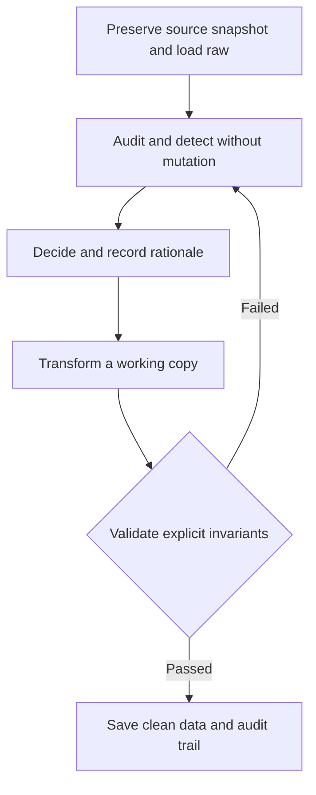

Data: Care & Feeding

Mid-term: [#FIXME:URL]

[Live Demo!](demo/DEMO_GUIDE.md)

*Reality check: Data scientists spend 80% of their time cleaning data and 20% complaining about it. The remaining 20% is spent on actual analysis (yes, that's 120% - data science is just that intense!)*


*Shows the reality that data cleaning is most of the work - perfect intro to data cleaning lecture*

Data cleaning follows a documented workflow: **audit/detect → decide → transform → validate → save**. Validation happens before a derived artifact is saved; a failed check sends the work back to the audit or decision step. We'll cover each technique individually, then bring it all together in one complete pipeline at the end.

## Data contract and schema

The **source artifact** is the file or bytes as received. A **raw table** is the parsed, unmodified view of that source. Keep a **raw snapshot** for a mutation check, and perform transformations only on a separate **working table**. **Cleaned data** is a derived artifact saved only after the working table satisfies a documented contract. Clean does not mean perfect, complete, or free of unusual values.

**Row meaning** states what one row represents. A **schema** records the expected column names, meanings, data types, allowed or required values, and whether missing values are permitted.

A **candidate identifier** is one column, or a combination of columns, expected to distinguish rows. It is only a candidate until the audit tests its uniqueness and missingness.

**Tidy data** uses one column for each variable, one row for each observation, and one table for each type of observational unit. This is a structural description, not proof that the values are valid or clean. Lecture 06 teaches structural reshaping; Lecture 05 only states the expected row and column meanings. See Wickham's [Tidy Data](https://www.jstatsoft.org/article/view/v059i10) for the originating formulation.

**Provenance** records where an artifact came from; a source name and content checksum are two useful pieces of evidence. An **audit trail** records the source, detected issues, decisions, transformations, validation results, and output. Together they make the path from source snapshot to raw table to working table to clean artifact inspectable.

# Handling Missing Data

Missing data is a common problem in real-world datasets. Understanding how to identify, analyze, and handle missing data is crucial for reliable data analysis. Pandas provides powerful tools for working with missing values.

*A missing marker records absence, not its cause. The same blank can mean nonresponse, inapplicability, or a system failure.*


*Common missing data patterns: MCAR (Missing Completely At Random), MAR (Missing At Random), MNAR (Missing Not At Random)*


## Missing Data Detection

Missing data detection identifies values pandas recognizes as missing and helps describe their pattern. A Boolean missingness mask does not by itself detect source-specific sentinel codes such as `-9` or `unknown`, establish why values are absent, or determine what to do with them.

*Pro tip: Missing data is like that one friend who's always late to everything - you know they're supposed to be there, but you can never quite predict when (or if) they'll show up.*

**Reference:**

- `df.isnull()` - Boolean DataFrame: True for missing values
- `df.notnull()` - Boolean DataFrame: True for non-missing values
- `df.isna()` - Alias for isnull()
- `df.notna()` - Alias for notnull()
- `df.isnull().sum()` - Count missing values per column
- `df.isnull().any()` - True if any missing values in column
- `df.isnull().all()` - True if all values missing in column

**Example:**

```python
# Check for missing values
df = pd.DataFrame({'A': [1, 2, None, 4], 'B': [5, None, 7, 8]})
print(df.isnull().sum())  # A: 1, B: 1
print(df.isnull().any())  # A: True, B: True
print(df.isnull().all())  # A: False, B: False

# Visualize missing data
import matplotlib.pyplot as plt
df.isnull().sum().plot(kind='bar')
plt.title('Missing Values by Column')
plt.show()
```

## Missing Data Analysis

Missing data analysis describes patterns and prompts investigation of possible mechanisms. Counts and Boolean masks alone cannot establish why values are missing; that requires source knowledge and, often, a substantive assumption. The resulting evidence guides the choice of an appropriate handling strategy.

**Reference:**

- `df.isnull().sum()` - Count missing values per column
- `df.isnull().sum(axis=1)` - Count missing values per row
- `df.isnull().mean()` - Proportion of missing values per column
- `df.dropna()` - Remove rows with any missing values
- `df.dropna(axis=1)` - Remove columns with any missing values
- `df.dropna(thresh=n)` - Keep rows with at least n non-null values

**Example:**

```python
# Analyze missing data patterns
df = pd.DataFrame({'A': [1, 2, None, 4], 'B': [5, None, 7, 8], 'C': [9, 10, 11, None]})
print(df.isnull().sum())  # Missing values per column
print(df.isnull().mean())  # Proportion missing per column
print(df.isnull().sum(axis=1))  # Missing values per row

# Remove rows with missing values
df_clean = df.dropna()
print(df_clean.shape)  # (1, 3) - only the first row is complete
```

## Missing Data Imputation

Missing data imputation fills in missing values using a stated rule. Whether to impute, retain, flag, or drop a value depends on the variable's meaning, how the value became missing, and the intended analysis. No method below is an automatic default.

**Reference:**

- `df.fillna(value)` - Fill missing values with constant
- `df.ffill()` - Forward fill (use the previous value)
- `df.bfill()` - Backward fill (use the next value)
- `df.fillna(df.mean())` - Fill with column mean
- `df.fillna(df.median())` - Fill with column median
- `df.fillna(df.mode().iloc[0])` - Fill with column mode
- `df.interpolate()` - Interpolate missing values

**Example:**

```python
# Fill missing values
df = pd.DataFrame({'A': [1, 2, None, 4], 'B': [5, None, 7, 8]})

# Fill with constant
df_filled = df.fillna(0)
print(df_filled)  # Missing values replaced with 0

# Fill with mean
df_mean = df.fillna(df.mean())
print(df_mean)  # Missing values replaced with column mean

# Forward fill is appropriate only when row order and entity boundaries justify it
df_ffill = df.ffill()
print(df_ffill)  # Missing values replaced with previous value
```

```
Original Data:        Forward Fill (ffill):           Backward Fill (bfill):
  Index Value           Index Value                     Index Value
    0     10              0     10 ─┐                     0     10
    1   [NaN]             1     10 ←┤ fills down          1     15 ←┐
    2   [NaN]             2     10 ←┘ from 10             2     15 ←┤ fills up
    3     15              3     15 ─┐                     3     15 ─┘ from 15
    4   [NaN]             4     15 ←┤ fills down          4   [NaN] can't fill
    5   [NaN]             5     15 ←┘ from 15             5   [NaN] no later rows
```

**LIVE DEMO!** (Demo 1: Missing Data - detection, analysis, and imputation strategies)

# Data Transformation Techniques

## Detecting and Resolving Duplicates

Repeated rows or identifiers are evidence to investigate, not an instruction to delete. Use the row meaning, candidate identifier, source process, and any timestamps or version fields to decide whether records are redundant, conflicting, or valid repeated observations.

*Fun fact: Duplicates are like that one song that gets stuck in your head - they keep showing up everywhere, even when you think you've gotten rid of them all.*

**Reference:**

- `df.duplicated()` - Check for duplicate rows
- `df.drop_duplicates()` - Remove duplicate rows
- `df.drop_duplicates(subset=['col1', 'col2'])` - Remove duplicates in specific columns
- `df.drop_duplicates(keep='first')` - Keep first occurrence of duplicates

**Example:**

```python
# Check for duplicates
df = pd.DataFrame({'A': [1, 2, 2, 3], 'B': [4, 5, 5, 6]})
print(df.duplicated().sum())  # Number of duplicate rows

# This fixture defines identical A/B rows as repeated ingestion, so keep one
df_clean = df.drop_duplicates(keep='first')
print(df_clean)
```

## Replacing Values

The `replace()` method provides a flexible way to substitute specific values or patterns in your data.

*Think of `replace()` as find-and-replace for your data - but way more powerful than Word's version!*

**Reference:**

- `df.replace(old, new)` - Replace single value
- `df.replace([val1, val2], new)` - Replace multiple values with same replacement
- `df.replace([val1, val2], [new1, new2])` - Replace multiple values with different replacements
- `df.replace({val1: new1, val2: new2})` - Dictionary mapping
- `df.replace(regex=True)` - Use regular expressions

**Example:**

```python
# Replace sentinel values with NaN
df = pd.Series([1, -999, 2, -999, -1000, 3])
df_clean = df.replace([-999, -1000], np.nan)
print(df_clean)  # [1.0, NaN, 2.0, NaN, NaN, 3.0]

# Different replacement for each value
df = pd.Series(['low', 'medium', 'high', 'low'])
df_mapped = df.replace({'low': 1, 'medium': 2, 'high': 3})
print(df_mapped)  # [1, 2, 3, 1]

# Column-specific replacement in DataFrame
df = pd.DataFrame({'A': [1, 2, 3], 'B': ['x', 'y', 'z']})
df = df.replace({'A': {1: 100}, 'B': {'x': 'alpha'}})
print(df)  # A: [100, 2, 3], B: ['alpha', 'y', 'z']
```

## Applying Custom Functions


*Classic time-saving calculation chart - perfect for .apply() section*

Sometimes built-in methods aren't enough - you need to apply custom logic to transform your data. The `.apply()` and `.map()` methods let you use any function (built-in or custom) to transform data.

*Think of `.apply()` as your data transformation Swiss Army knife - when pandas doesn't have a built-in method for what you need, you can just write your own function and apply it to every row, column, or value.*

**Quick lambda primer**: A `lambda` is a one-line anonymous function, perfect for simple transformations: `lambda x: x * 2` is equivalent to `def double(x): return x * 2`, just more concise for one-time use.

**Reference:**

- `series.map(dict_or_func)` - Map values in a Series (element-wise)
- `series.apply(func)` - Apply function to each element in a Series
- `df.apply(func, axis=0)` - Apply function to each column (axis=0, default)
- `df.apply(func, axis=1)` - Apply function to each row (axis=1)
- `df.map(func)` - Apply function element-wise to entire DataFrame (pandas 2.1+)
- `df.applymap(func)` - Deprecated in pandas 2.1+, use `.map()` instead

**Example:**

```python
# Clean text data with custom function
def clean_text(text):
    """Remove whitespace and convert to lowercase"""
    return text.strip().lower()

names = pd.Series(['  Alice  ', 'BOB', '  Charlie'])
names_clean = names.apply(clean_text)
print(names_clean)  # ['alice', 'bob', 'charlie']

# Map categorical values to numbers
status = pd.Series(['active', 'inactive', 'active', 'pending'])
status_map = {'active': 1, 'inactive': 0, 'pending': 2}
status_coded = status.map(status_map)
print(status_coded)  # [1, 0, 1, 2]

# Apply function to DataFrame rows
df = pd.DataFrame({'min': [1, 4, 7], 'max': [5, 9, 12]})
df['range'] = df.apply(lambda row: row['max'] - row['min'], axis=1)
print(df)
#    min  max  range
# 0    1    5      4
# 1    4    9      5
# 2    7   12      5

# Apply function to DataFrame columns
df = pd.DataFrame({'A': [1, 2, 3], 'B': [4, 5, 6]})
column_sums = df.apply(sum, axis=0)  # Sum each column
print(column_sums)  # A: 6, B: 15

# Element-wise function application (pandas 2.1+)
df = pd.DataFrame({'A': [1, 2, 3], 'B': [4, 5, 6]})
df_squared = df.map(lambda x: x ** 2)
print(df_squared)
#    A   B
# 0  1  16
# 1  4  25
# 2  9  36
```

## Data Type Conversion

Converting data to the correct types is essential for proper analysis. This includes converting strings to numbers, dates, and other appropriate types.

*Warning: Data type conversion is like trying to fit a square peg in a round hole - sometimes it works perfectly, sometimes you need to shave off a few corners, and sometimes you just need to find a different hole entirely.*

**Reference:**

- `df.astype('int64')` - Convert to integer
- `series.astype('Int64')` - Convert to pandas' nullable integer type
- `df.astype('float64')` - Convert to float
- `df.astype('string')` - Convert to string
- `pd.to_datetime(df['date_column'])` - Convert to datetime
- `pd.to_numeric(df['column'], errors='coerce')` - Convert to numeric, errors become NaN

**Example:**

```python
# Convert data types
df = pd.DataFrame({'A': ['1', '2', '3'], 'B': [4.5, 5.5, 6.5]})
df['A'] = df['A'].astype('int64')  # Convert string to integer
df['B'] = df['B'].astype('int64')  # Convert float to integer
print(df.dtypes)  # A: int64, B: int64

# Capital-I Int64 stores whole numbers while still allowing pd.NA
ages = pd.Series(['34', None, '52'], dtype='string')
ages = pd.to_numeric(ages, errors='coerce').astype('Int64')
print(ages.dtype)  # Int64
```

NumPy's lowercase `int64` cannot represent a missing value. Pandas' capital-I nullable `Int64` dtype stores integers plus `pd.NA`; it is the appropriate contract when whole-number data may be missing. Converting a fractional value such as `40.5` to `Int64` is not a rounding policy, so decide how to handle fractional values before casting.

## Renaming Axis Indexes

Renaming changes row or column labels without modifying data. This is essential for making your data more readable and standardizing column names.

**Reference:**

- `df.rename(index={old: new})` - Rename rows
- `df.rename(columns={old: new})` - Rename columns
- `df.rename(columns=str.lower)` - Apply function to all columns
- `df.rename(columns=str.strip)` - Remove whitespace from column names
- `inplace=True` - Modify DataFrame in place

**Example:**

```python
# Rename specific columns
df = pd.DataFrame({'OldName': [1, 2, 3], 'Another_Old': [4, 5, 6]})
df_renamed = df.rename(columns={'OldName': 'new_name', 'Another_Old': 'better_name'})
print(df_renamed.columns)  # ['new_name', 'better_name']

# Apply functions to all columns
labels_df = pd.DataFrame({
    'First Column': [1, 2, 3],
    ' Second ': [4, 5, 6],
    'THIRD': [7, 8, 9],
})
df_clean = labels_df.rename(columns=str.lower)  # Lowercase all
df_clean = df_clean.rename(columns=str.strip)  # Remove spaces
print(df_clean.columns)  # ['first column', 'second', 'third']

# Rename index
df.index = ['a', 'b', 'c']
df_reindexed = df.rename(index={'a': 'row_1', 'b': 'row_2'})
```

## Creating Categories

Converting continuous variables into categories makes data easier to analyze and visualize. This is especially useful for age groups, income brackets, and other meaningful categories.

*Pro tip: Categories are like putting your data in organized boxes - everything has its place, and you can find things much faster when you know exactly which box to look in.*

**Reference:**

- `pd.cut(series, bins=4)` - Cut the value range into four equal-width bins
- `pd.cut(series, bins=[...])` - Cut at explicitly supplied edges (not necessarily equal-width)
- `pd.qcut(series, q)` - Cut into equal-frequency bins
- `bins=[0, 18, 35, 50, 100]` - Custom bin edges
- `labels=['Young', 'Middle', 'Senior']` - Custom labels for bins

**Example:**

```python
# Create age groups
ages = pd.Series([25, 30, 45, 60, 75])
age_groups = pd.cut(ages, bins=[0, 30, 50, 100], labels=['Young', 'Middle', 'Senior'])
print(age_groups)  # [Young, Young, Middle, Senior, Senior]
```

## Detecting and Filtering Outliers

Outliers are extreme values that may represent errors, rare but valid observations, or important anomalies. A statistical rule can flag candidates, but source evidence, domain meaning, and analysis purpose determine whether to keep, correct, cap, or exclude them.


**Reference:**

- `df[df['col'] > threshold]` - Filter by threshold
- `df.clip(lower, upper)` - Cap values at bounds
- `df.quantile([0.25, 0.75])` - Find quartiles for IQR method
- `df[df['col'].between(lower, upper)]` - Keep rows whose selected value is within bounds

**Example:**

```python
# Flag values beyond 3 standard deviations
df = pd.DataFrame({'value': [1, 2, 3, 4, 5] * 4 + [100]})
mean, std = df['value'].mean(), df['value'].std()
three_sd_flag = abs(df['value'] - mean) > 3 * std
print(df.loc[three_sd_flag])  # Flags 100 for investigation

# Exclude a flagged row only after evidence supports that decision
df_clean = df.loc[~three_sd_flag].copy()

# Cap extreme values
capped = df.assign(value=df['value'].clip(lower=0, upper=10))
print(capped)  # Values capped at 0-10 range

# IQR method for outlier detection
Q1 = df['value'].quantile(0.25)
Q3 = df['value'].quantile(0.75)
IQR = Q3 - Q1
lower_bound = Q1 - 1.5 * IQR
upper_bound = Q3 + 1.5 * IQR
df_no_outliers = df[(df['value'] >= lower_bound) & (df['value'] <= upper_bound)]
```

# Categorical Data Encoding

Working with categorical data is common in data analysis. Pandas provides two main approaches: the categorical data type for efficient storage, and dummy variables for machine learning models.

*Pro tip: Categorical encoding is like translating between languages - categories can be stored efficiently as codes (integers) or expanded into binary columns for models. Choose the right translation for your task!*

## Categorical Data Type

The categorical type is incredibly powerful for memory optimization, especially when you have repeated string values.


*Visual showing categorical encoding: Original values → Categories → Codes with memory savings comparison*

**Reference:**

- `astype('category')` - Convert to categorical
- `cat.categories` - View categories
- `cat.codes` - View numeric codes
- Use for: Repeated string values, ordered categories

**Example:**

```python
# Huge memory savings for repeated values
colors = pd.Series(['red', 'blue', 'red', 'green', 'blue'] * 1000)
print(f"As object: {colors.memory_usage(deep=True)} bytes")

colors_cat = colors.astype('category')
print(f"As category: {colors_cat.memory_usage(deep=True)} bytes")

# Access categories and codes
print(colors_cat.cat.categories)  # ['blue', 'green', 'red']
print(colors_cat.cat.codes[:5])   # [2, 0, 2, 1, 0]
```

## Creating Indicator (Dummy) Variables

Indicator variables convert categories into binary (0/1) columns, which is essential for machine learning models that require numeric input.

*Think of dummy variables as translating categories into a language that models can understand - instead of "red", "blue", "green", you get three columns of 1s and 0s indicating which color each row has.*

**Reference:**

- `pd.get_dummies(series)` - Create dummy variables
- `prefix='category'` - Add prefix to column names
- `drop_first=True` - Avoid multicollinearity (drop first category)
- `dtype='int64'` - Request numeric 0/1 indicator columns; pandas' nullable `boolean` dtype can represent `pd.NA` when a three-state result is needed

**Example:**

```python
# Create dummy variables
df = pd.DataFrame({'color': ['red', 'blue', 'red', 'green']})
dummies = pd.get_dummies(df['color'], prefix='color', dtype='int64')
print(dummies)
# Creates: color_blue, color_green, color_red columns with 0/1 values

# Add to original DataFrame
df_with_dummies = pd.concat([df, dummies], axis=1)
print(df_with_dummies)

# Drop first category to avoid multicollinearity
dummies = pd.get_dummies(df['color'], prefix='color', drop_first=True, dtype='int64')
print(dummies)  # Only color_green and color_red (blue is the reference)
```

**LIVE DEMO!** (Demo 2: Transformations - categorical encoding, string operations, sampling)

# String Manipulation

*Pro tip: The `.str` accessor is like having a Swiss Army knife for text data. It can split, join, replace, extract, and transform text in ways that would make a regex wizard jealous.*

## Basic String Operations

String operations are essential for cleaning text data. Pandas provides easy-to-use string methods that work on Series containing text.


*Quick reference card for common string operations: .upper()/.lower(), .strip()/.replace(), .split()/.contains()*

```
Input: "  Alice Smith  "
   │
   ├─ .strip() ────────────► "Alice Smith"
   │                              │
   │                              ├─ .lower() ────────► "alice smith"
   │                              │                          │
   │                              │                          └─ .replace(' ', '_') ──► "alice_smith"
   │                              │
   │                              └─ .split(' ') ────────► ['Alice', 'Smith']
   │                                     │
   │                                     └─ [0] ──────────► 'Alice'
   │
   └─ .title() ────────────► "Alice Smith"
```


*"I got 99 problems, so I used regex. Now I have 100 problems." - Perfect humor for string manipulation complexity*

**Reference:**

- `series.str.upper()` - Convert to uppercase
- `series.str.lower()` - Convert to lowercase
- `series.str.strip()` - Remove leading/trailing whitespace
- `series.str.replace(old, new)` - Replace substrings
- `series.str.contains(pattern)` - Check if string contains pattern
- `series.str.startswith(prefix)` - Check if string starts with prefix
- `series.str.endswith(suffix)` - Check if string ends with suffix

**Example:**

```python
# Clean text data
names = pd.Series(['  Alice  ', 'bob', 'CHARLIE'])
clean_names = names.str.strip().str.title()
print(clean_names)  # ['Alice', 'Bob', 'Charlie']

# Check patterns
emails = pd.Series(['alice@example.com', 'bob@test.org'])
has_gmail = emails.str.contains('gmail')
print(has_gmail)  # [False, False]
```

## String Splitting and Joining

Splitting and joining strings is common when working with structured text data like addresses, names, or delimited values.

**Reference:**

- `series.str.split(sep)` - Split strings by separator
- `series.str.split(sep, expand=True)` - Split into separate columns
- `series.str.cat(sep=' ')` - Join strings with separator
- `series.str.join(sep)` - Join list elements with separator

**Example:**

```python
# Split strings
full_names = pd.Series(['Alice Smith', 'Bob Jones', 'Charlie Brown'])
names_split = full_names.str.split(' ')
print(names_split)  # [['Alice', 'Smith'], ['Bob', 'Jones'], ['Charlie', 'Brown']]

# Split into columns
names_df = full_names.str.split(' ', expand=True)
print(names_df)  # Two columns with first and last names
```

# Random Sampling and Permutation

## Random Sampling

Random sampling selects rows using a probability mechanism. Randomness alone does not guarantee a representative subset: the sampling frame, selection probabilities, sample size, strata, and nonresponse still matter. Choose the design for the target population and purpose.

**Reference:**

- `df.sample(n=None, frac=None, replace=False, weights=None, random_state=None)` - Random sampling
- `n=10` - Sample exactly 10 rows
- `frac=0.5` - Sample 50% of rows
- `replace=True` - Sample with replacement (bootstrap)
- `weights='column'` - Weighted sampling by column values
- `random_state=42` - Reproducible sampling
- `df.iloc[::step]` - Systematic sampling every nth row

**Example:**

```python
# Random sampling
df = pd.DataFrame({'A': range(100), 'B': range(100, 200)})
sample = df.sample(n=10, random_state=42)  # Sample 10 rows
print(len(sample))  # 10

# Stratified sampling: this design chooses two rows from each category
df['category'] = ['A', 'B'] * 50
stratified = df.groupby('category', group_keys=False).sample(n=2, random_state=42)
print(len(stratified))  # 4 (2 from each category)
```

## Permutation and Shuffling

Permutation randomizes row order while preserving relationships among columns in each row. Use it when the method calls for exchangeable rows; shuffling ordered or time-series data can destroy meaningful dependence.

**Reference:**

- `df.sample(frac=1)` - Shuffle all rows (permutation)
- `df.reindex(np.random.permutation(df.index))` - Permute index order
- `df.sample(n=len(df), replace=True)` - Bootstrap sampling
- `np.random.permutation(array)` - Randomly permute array
- `random_state=42` - Reproducible permutation

**Example:**

```python
# Shuffle DataFrame
df = pd.DataFrame({'A': [1, 2, 3, 4], 'B': [5, 6, 7, 8]})
shuffled = df.sample(frac=1, random_state=42)
print(shuffled)  # Random order of rows

# Bootstrap sampling
bootstrap = df.sample(n=len(df), replace=True, random_state=42)
print(len(bootstrap))  # 4 (same length, but with replacement)
```

# Data Validation and Quality Assessment


*Shows data errors invalidating research - perfect for validation section*

| Issue | Detection | Possible response after investigation |
|-------|-----------|---------------------------------------|
| Missing Values | `df.isnull().sum()` plus sentinel checks | Retain, flag, impute, or drop according to variable meaning and analysis purpose |
| Duplicate Candidates | exact-row and candidate-identifier checks | Confirm row meaning and source history; consolidate or remove only records shown to be redundant |
| Wrong Data Type | `df.dtypes` plus conversion probes | Parse with an explicit failure policy, then validate the intended dtype |
| Outliers | `df.describe()`<br>Box plots<br>domain rules | Verify against source and domain knowledge; keep, flag, correct, cap, or filter with a documented rationale |
| Inconsistent Categories | `df['col'].unique()` | Normalize only differences known to share a meaning; map documented aliases explicitly |

## Data Quality Checks

Data quality checks identify issues like missing values, duplicates, outliers, and data type inconsistencies. These checks are essential for ensuring reliable analysis results.

**Reference:**

- `df.isnull().sum()` - Count missing values per column
- `df.duplicated().sum()` - Count duplicate rows
- `df.nunique()` - Count unique values per column
- `df.dtypes` - Data types per column
- `df.describe()` - Summary statistics (numeric columns only by default)
- `df.describe(include='all')` - Summary statistics for all columns (numeric + categorical)
- `df.describe(include=['object'])` - Summary statistics for categorical columns only
- `df.info()` - Detailed information
- `df.memory_usage()` - Memory usage per column

**Example:**

```python
# Data quality assessment
df = pd.DataFrame({'A': [1, 2, 2, 4], 'B': [5, 6, 6, 8], 'C': [9, 10, 11, 12]})
print(df.isnull().sum())  # Missing values per column
print(df.duplicated().sum())  # Number of duplicate rows
print(df.nunique())  # Unique values per column
print(df.dtypes)  # Data types per column
```

## Data Validation Rules

Data validation rules ensure data meets business requirements and constraints. These rules help maintain data integrity and prevent analysis errors.

**Reference:**

- `df[condition]` - Filter rows meeting condition
- `series.between(left, right)` - Check whether Series values are between bounds
- `df.isin(values)` - Check if values are in list
- `series.str.contains(pattern)` - Check if Series strings contain pattern
- `series.str.match(pattern)` - Check if Series strings match pattern
- `series.str.len()` - Get Series string lengths
- `series.str.isdigit()` - Check if Series strings are digits

**Example:**

```python
# Data validation rules
df = pd.DataFrame({'Age': [25, 30, 35, 40], 'Email': ['alice@test.com', 'bob@example.org', 'charlie@test.com', 'diana@example.org']})

# Age validation (18-65)
valid_ages = df[df['Age'].between(18, 65)]
print(valid_ages)  # All rows (ages are valid)

# Email validation
email_pattern = r'^[a-zA-Z0-9._%+-]+@[a-zA-Z0-9.-]+\.[a-zA-Z]{2,}$'
valid_emails = df[df['Email'].str.match(email_pattern)]
print(valid_emails)  # All rows (emails are valid)
```

# Data Cleaning Pipeline

A reproducible pipeline keeps detection separate from decisions and transformations. It validates the complete working table before saving any clean artifact.


```mermaid
graph TD
    A[Preserve source snapshot and load raw] --> B[Audit and detect without mutation]
    B --> C[Decide and record rationale]
    C --> D[Transform a working copy]
    D --> E{Validate explicit invariants}
    E -->|Failed| B
    E -->|Passed| F[Save clean data and audit trail]
```

The running example uses one schema from audit through save. One source row represents one submitted person record.

| Column | Clean meaning and type | Missing allowed? | Rule |
|--------|------------------------|------------------|------|
| `record_id` | record identifier, string | no | `R` followed by three digits; unique after documented exact-duplicate resolution |
| `full_name` | submitted name, string | yes | surrounding whitespace removed |
| `site` | collection site, string | no | `north`, `south`, or `west` |
| `status` | record status, string | yes | `active`, `pending`, or `complete` |
| `age_text` → `age` | age in years, nullable `Int64` | yes | whole number from 0 through 120 when present |
| `visit_date` | visit date, datetime | yes | parsed from exact `YYYY-MM-DD` text when present |

This fixture's data dictionary says `unknown` and `-9` are missing-age sentinels, `NA` is a missing-status sentinel, blank fields are missing, and the repeated identical `R002` row is an ingestion duplicate. Those facts justify this example's decisions; similar-looking values in another source may mean something else.

## One executable audit-to-save example

```python
from hashlib import sha256
from io import BytesIO
from pathlib import Path

import pandas as pd


# Contract and source-specific decisions
SOURCE_COLUMNS = [
    "record_id",
    "full_name",
    "site",
    "status",
    "age_text",
    "visit_date",
]
CLEAN_COLUMNS = [
    "record_id",
    "full_name",
    "site",
    "status",
    "age",
    "visit_date",
]
CLEANING_RULES = {
    "record_id_pattern": r"R[0-9]{3}",
    "allowed_sites": {"north", "south", "west"},
    "allowed_statuses": {"active", "pending", "complete"},
    "age_sentinels": {"unknown", "-9"},
    "status_sentinels": {"na"},
    "minimum_age": 0,
    "maximum_age": 120,
}

# Source snapshot -> raw table -> raw snapshot -> working table
source_name = "submitted_people.csv"
source_snapshot = b"""record_id,full_name,site,status,age_text,visit_date
R001, Alice Smith , north,Active,34,2026-01-15
R002,BOB JONES,North,active,unknown,2026-02-30
R002,BOB JONES,North,active,unknown,2026-02-30
R003, Carla Ruiz ,SOUTH,pending,-9,2026-03-01
R004,,south,NA,45,
R005,Evan Li,west,complete,52,2026-02-14
"""
source_sha256 = sha256(source_snapshot).hexdigest()
raw = pd.read_csv(
    BytesIO(source_snapshot),
    dtype="string",
    keep_default_na=False,
)
raw_snapshot = raw.copy(deep=True)
working = raw.copy(deep=True)

# AUDIT/DETECT: probes describe raw values without changing raw or working.
schema_matches = list(raw.columns) == SOURCE_COLUMNS
if not schema_matches:
    raise ValueError(
        f"source columns {list(raw.columns)} do not match {SOURCE_COLUMNS}"
    )

record_id_probe = raw["record_id"].str.strip().str.upper()
record_id_missing = (
    record_id_probe.isna() | record_id_probe.eq("").fillna(False)
)
record_id_repeated = (
    ~record_id_missing & record_id_probe.duplicated(keep=False)
)
record_id_bad_format = (
    ~record_id_missing
    & ~record_id_probe.str.fullmatch(
        CLEANING_RULES["record_id_pattern"],
        na=False,
    )
)

age_text_probe = raw["age_text"].str.strip().str.lower()
age_is_sentinel = age_text_probe.isin(CLEANING_RULES["age_sentinels"])
age_candidate = age_text_probe.mask(
    age_is_sentinel | age_text_probe.eq("").fillna(False)
)
age_numeric_probe = pd.to_numeric(age_candidate, errors="coerce")
age_parse_failure = age_candidate.notna() & age_numeric_probe.isna()
age_noninteger = (
    age_numeric_probe.notna() & age_numeric_probe.mod(1).ne(0)
)
age_out_of_range = age_numeric_probe.notna() & ~age_numeric_probe.between(
    CLEANING_RULES["minimum_age"],
    CLEANING_RULES["maximum_age"],
)

visit_text_probe = raw["visit_date"].str.strip()
visit_candidate = visit_text_probe.mask(
    visit_text_probe.eq("").fillna(False)
)
visit_datetime_probe = pd.to_datetime(
    visit_candidate,
    format="%Y-%m-%d",
    errors="coerce",
)
visit_parse_failure = visit_candidate.notna() & visit_datetime_probe.isna()

issue_audit = pd.Series(
    {
        "missing or blank record IDs": int(record_id_missing.sum()),
        "rows with repeated candidate IDs": int(record_id_repeated.sum()),
        "record IDs with invalid format": int(record_id_bad_format.sum()),
        "redundant exact rows after the first": int(
            raw.duplicated(keep="first").sum()
        ),
        "documented age sentinels": int(age_is_sentinel.sum()),
        "unparseable nonsentinel ages": int(age_parse_failure.sum()),
        "numeric noninteger ages": int(age_noninteger.sum()),
        "numeric ages outside the allowed range": int(age_out_of_range.sum()),
        "nonempty invalid visit dates": int(visit_parse_failure.sum()),
    },
    name="count",
)
print(issue_audit)

# DECIDE: record why each action is warranted for this source.
decision_log = pd.DataFrame(
    [
        {
            "issue": "one repeated exact source row",
            "decision": "keep its first occurrence",
            "rationale": "fixture provenance identifies repeated ingestion",
        },
        {
            "issue": "other repeated record_id values",
            "decision": "preserve and fail uniqueness validation",
            "rationale": "conflicting records require source evidence",
        },
        {
            "issue": "documented sentinel and blank values",
            "decision": "represent them with pd.NA",
            "rationale": "the data dictionary defines them as missing",
        },
        {
            "issue": "invalid ages and calendar dates",
            "decision": "retain the row and store a missing value",
            "rationale": "missingness is allowed; no imputation is justified",
        },
        {
            "issue": "documented case and whitespace variants",
            "decision": "normalize strings to their canonical form",
            "rationale": "the contract defines equivalent spellings",
        },
    ]
).assign(source=source_name, source_sha256=source_sha256)

# TRANSFORM: make changes only to working.
exact_duplicate_keep = ~raw.duplicated(keep="first")
working = working.loc[exact_duplicate_keep].copy()

working["record_id"] = working["record_id"].str.strip().str.upper()
working["full_name"] = working["full_name"].str.strip().str.title()
working["full_name"] = working["full_name"].mask(
    working["full_name"].eq("").fillna(False)
)
working["site"] = working["site"].str.strip().str.lower()
working["status"] = working["status"].str.strip().str.lower()
working["status"] = working["status"].mask(
    working["status"].isin(CLEANING_RULES["status_sentinels"])
    | working["status"].eq("").fillna(False)
)

working_age_text = working["age_text"].str.strip().str.lower()
working_age_text = working_age_text.mask(
    working_age_text.isin(CLEANING_RULES["age_sentinels"])
    | working_age_text.eq("").fillna(False)
)
working_age_numeric = pd.to_numeric(working_age_text, errors="coerce")
working_age_valid = (
    working_age_numeric.notna()
    & working_age_numeric.mod(1).eq(0)
    & working_age_numeric.between(
        CLEANING_RULES["minimum_age"],
        CLEANING_RULES["maximum_age"],
    )
)
working["age"] = working_age_numeric.where(working_age_valid).astype("Int64")
working = working.drop(columns="age_text")

working_visit_text = working["visit_date"].str.strip()
working_visit_text = working_visit_text.mask(
    working_visit_text.eq("").fillna(False)
)
working["visit_date"] = pd.to_datetime(
    working_visit_text,
    format="%Y-%m-%d",
    errors="coerce",
)
working = working[CLEAN_COLUMNS]

# VALIDATE: executable invariants must all pass before any output is saved.
clean_record_ids = working["record_id"].astype("string").str.strip()
clean_id_present = (
    clean_record_ids.notna() & clean_record_ids.ne("").fillna(False)
)
expected_rows = len(raw) - int(raw.duplicated(keep="first").sum())

validation_results = pd.Series(
    {
        "source snapshot checksum unchanged": (
            sha256(source_snapshot).hexdigest() == source_sha256
        ),
        "raw table unchanged": raw.equals(raw_snapshot),
        "source columns match the schema": schema_matches,
        "clean columns present in order": list(working.columns) == CLEAN_COLUMNS,
        "row count reflects only exact duplicate removal": (
            len(working) == expected_rows
        ),
        "record IDs present": clean_id_present.all(),
        "record IDs match the contract": clean_record_ids.str.fullmatch(
            CLEANING_RULES["record_id_pattern"],
            na=False,
        ).all(),
        "record IDs unique after normalization": (
            not clean_record_ids[clean_id_present].duplicated().any()
        ),
        "text columns use pandas string dtype": all(
            isinstance(working[column].dtype, pd.StringDtype)
            for column in ["record_id", "full_name", "site", "status"]
        ),
        "names have no surrounding whitespace": working[
            "full_name"
        ].dropna().eq(working["full_name"].dropna().str.strip()).all(),
        "required sites present": working["site"].notna().all(),
        "sites allowed": working["site"].isin(
            CLEANING_RULES["allowed_sites"]
        ).all(),
        "statuses allowed when present": working["status"].dropna().isin(
            CLEANING_RULES["allowed_statuses"]
        ).all(),
        "age has nullable integer dtype": str(working["age"].dtype) == "Int64",
        "ages in range when present": working["age"].dropna().between(
            CLEANING_RULES["minimum_age"],
            CLEANING_RULES["maximum_age"],
        ).all(),
        "visit date has datetime dtype": (
            pd.api.types.is_datetime64_any_dtype(working["visit_date"].dtype)
        ),
    },
    name="passed",
)
failed_invariants = validation_results[~validation_results]
assert failed_invariants.empty, failed_invariants

# SAVE: reached only after validation succeeds.
output_dir = Path("output")
output_dir.mkdir(parents=True, exist_ok=True)
clean_path = output_dir / "cleaned_people.csv"
decision_log["output"] = str(clean_path)

working.to_csv(clean_path, index=False)
issue_audit.to_csv(output_dir / "cleaning_audit.csv", header=True)
decision_log.to_csv(output_dir / "cleaning_decisions.csv", index=False)
validation_results.to_csv(output_dir / "cleaning_validation.csv", header=True)

print(f"validated and saved {len(working)} rows to {clean_path}")
```

The identifier checks strip surrounding whitespace, reject missing and blank values, enforce the declared format, and test uniqueness after normalization. This is more robust than calling `.is_unique` alone: a column containing one missing identifier can otherwise appear unique.

A **validation invariant** is a condition that must be true before declaring the working table clean. Assertions stop this pipeline when its contract is broken. They do not establish that the decisions were wise; the decision log carries that human reasoning. The CSV stores values but not pandas dtype metadata, so a downstream reader must reapply the documented `Int64` and datetime schema.

## Configuration-Driven Processing

Configuration files can make repeated pipelines more maintainable and reproducible. The running pipeline's `CLEANING_RULES` dictionary holds source-specific contract values that transformations and validation share, preventing the two stages from drifting apart.

Keep genuinely changeable rules separate from the transformation logic, but do not turn every implementation constant into an option. Changing a rule still requires a documented decision and a fresh validation run.

**Reference:**

- Use Python dictionaries for simple configurations
- Store parameters in separate files (CSV, JSON, or simple text)
- Keep cleaning logic in functions
- Document where each cleaning rule came from


# Running Notebooks from Command Line

For automated pipelines and batch processing, you can execute Jupyter notebooks from the command line without opening the Jupyter interface.

## Basic Execution

```bash
# Execute a single notebook
jupyter nbconvert --execute --to notebook your_notebook.ipynb

# Execute and save output to a new file
jupyter nbconvert --execute --to notebook --output executed_notebook your_notebook.ipynb

# Execute and overwrite the original file
jupyter nbconvert --execute --to notebook --inplace your_notebook.ipynb
```

## Notebook Pipeline Automation

Always check "exit codes" after notebook execution to ensure your pipeline stops if any step fails. When a command runs successfully it returns an exit code of 0, other values (usually 1) indicate an error.

You may check exit codes using the special variable `$?`, which contains exit code for the previous command. Alternatively, we can use an OR operator (`||`) to instruct the shell to do something when a command fails.

**Note:** The `||` operator means "OR" - if the command fails (non-zero exit code), execute the code block in curly braces `{}`. This is more concise than checking `$?` explicitly.

```bash
#!/bin/bash
# Example pipeline script

echo "Starting data analysis pipeline..."

# Run notebooks in sequence
jupyter nbconvert --execute --to notebook q4_exploration.ipynb
if [ $? -ne 0 ]; then
    echo "ERROR: Q4 exploration failed"
    exit 1
fi

jupyter nbconvert --execute --to notebook q5_missing_data.ipynb || {
    echo "ERROR: Q5 missing data analysis failed"
    exit 1
}

echo "Pipeline completed successfully!"
```

## Key Parameters

- `--execute`: Run all cells in the notebook
- `--to notebook`: Keep output as notebook format
- `--inplace`: Overwrite the original file
- `--output filename`: Save to a new file
- `--allow-errors`: Continue execution even if cells fail


# **LIVE DEMO!**
(Demo 3: Complete Workflow - end-to-end data cleaning pipeline)
