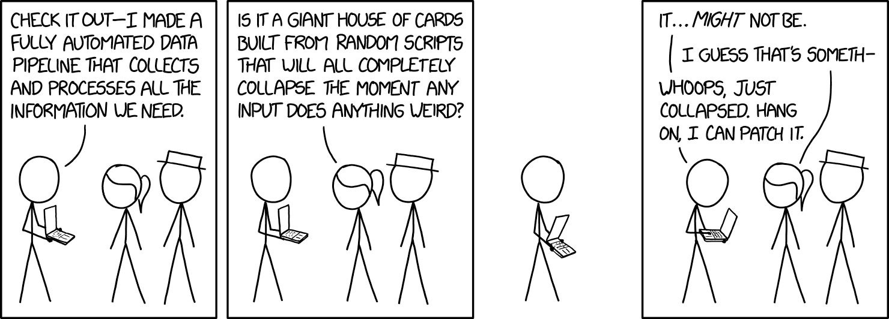
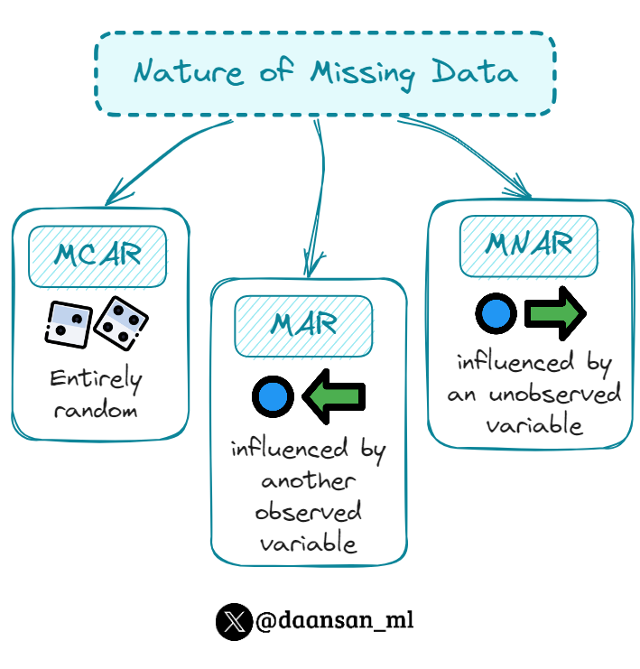
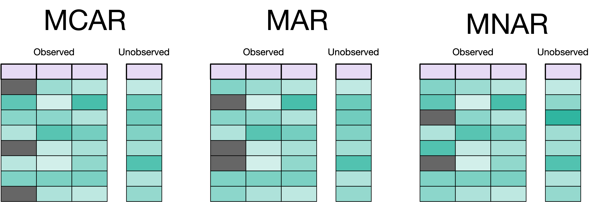
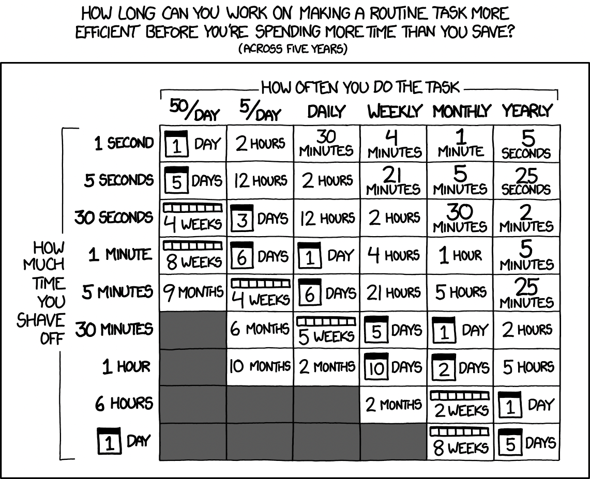
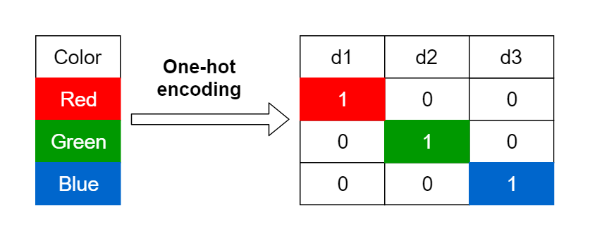
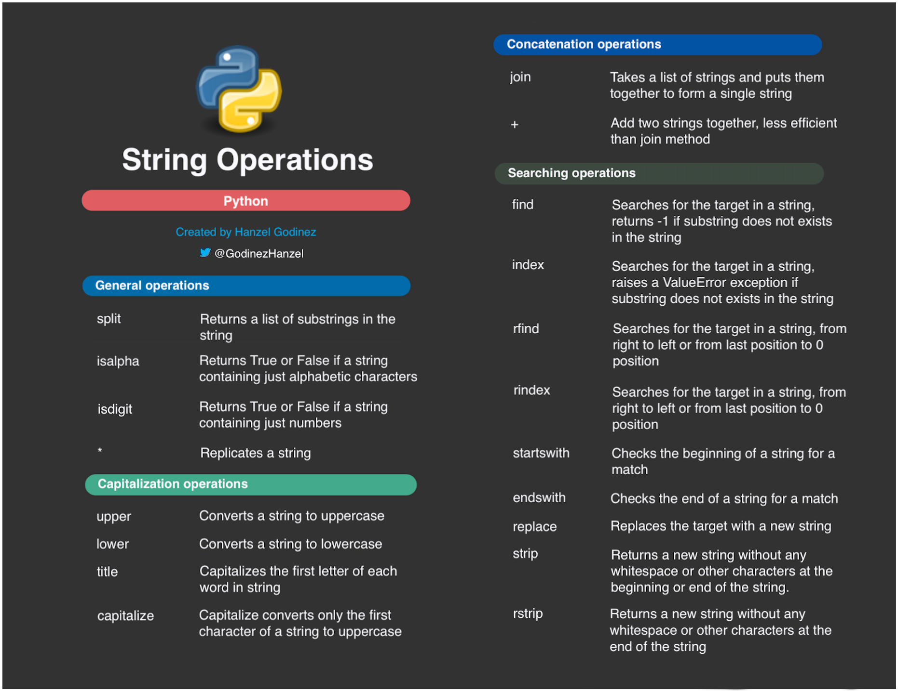
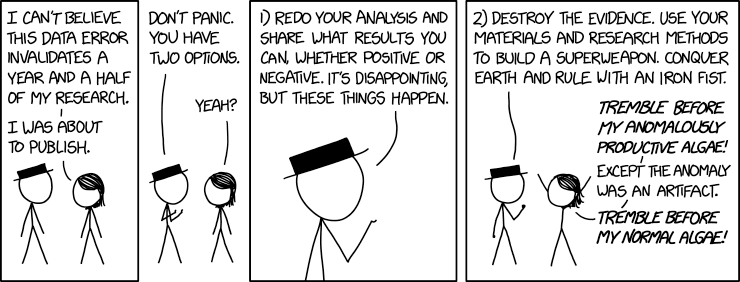
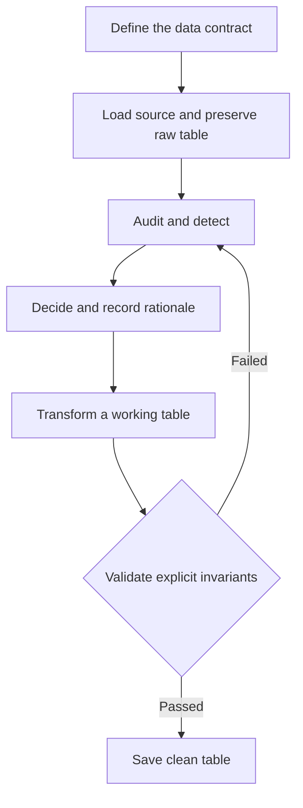

---
notion:
  role: lecture
  status: mapped
  page_id: "281d9fdd-1a1a-8015-bcdb-c11415191ac2"
  url: "https://app.notion.com/p/281d9fdd1a1a8015bcdbc11415191ac2"
---

Data: Care & Feeding

Mid-term: [#FIXME:URL]

[Live Demo!](demo/DEMO_GUIDE.md)

*Reality check: Data scientists spend 80% of their time cleaning data and 20% complaining about it. The remaining 20% is spent on actual analysis (yes, that's 120% - data science is just that intense!)*


*Shows the reality that data cleaning is most of the work - perfect intro to data cleaning lecture*

Lecture 04 ends with an inspection preview. This lecture teaches the pandas tools
that do the common cleaning work: handle missing values, detect and resolve
duplicates, replace values, apply functions, convert types, create categories,
clean strings, sample rows, and validate a result. We will use each operation on
a small table first, then combine the operations into one pipeline at the end.

## Three terms that guide the operations

**Row meaning** states what one row represents. A **schema** records expected
column names, meanings, data types, allowed or required values, and whether
missing values are permitted. A **candidate identifier** is one column, or a
combination of columns, expected to distinguish rows. These terms help you decide
which columns an operation should affect and how to check its result.

# Handling Missing Data

*A missing marker records absence, not its cause. The same blank can mean nonresponse, inapplicability, or a system failure.*

*Unofficially, missing data has 47 types. The most common? "I forgot to fill this out" and "The system crashed again."*

Start with the operations: detect gaps with `isna()` or `notna()`, remove them
with `dropna()`, or fill them with `fillna()`, `ffill()`, `bfill()`, or
`interpolate()`. Measure first; choose an operation only after considering what
the missing values mean.

The usual mechanism labels are **MCAR** (missingness unrelated to the data),
**MAR** (related to observed information), and **MNAR** (related to the missing
value itself). They organize assumptions; counts alone cannot identify the
mechanism.


*Common missing data patterns: MCAR (Missing Completely At Random), MAR (Missing At Random), MNAR (Missing Not At Random)*



## Missing Data Detection

Missingness masks locate values pandas recognizes as absent. Source-specific
sentinels such as `-9` or `unknown` need explicit handling.

*Pro tip: Missing data is like that one friend who's always late to everything - you know they're supposed to be there, but you can never quite predict when (or if) they'll show up.*

**Reference:**

- `df.isna()` - Boolean DataFrame: True for missing values
- `df.notna()` - Boolean DataFrame: True for non-missing values
- `df.isna().sum()` - Count missing values per column
- `df.isna().any()` - True if any missing values in column
- `df.isna().all()` - True if all values missing in column

**Example:**

```python
# Check for missing values
df = pd.DataFrame({'A': [1, 2, None, 4], 'B': [5, None, 7, 8]})
print(df.isna().sum())  # A: 1, B: 1
print(df.isna().any())  # A: True, B: True
print(df.isna().all())  # A: False, B: False

# Keep the first inspection tabular; charting is introduced in Lecture 07.
missing_summary = pd.DataFrame({
    'missing_count': df.isna().sum(),
    'missing_fraction': df.isna().mean(),
})
print(missing_summary)
```

## Missing Data Analysis

Counts and proportions summarize the pattern by row or column; interpreting its
cause still requires source knowledge.

**Reference:**

- `df.isna().sum()` - Count missing values per column
- `df.isna().sum(axis=1)` - Count missing values per row
- `df.isna().mean()` - Proportion of missing values per column
- `df.dropna()` - Remove rows with any missing values
- `df.dropna(axis=1)` - Remove columns with any missing values
- `df.dropna(thresh=n)` - Keep rows with at least n non-null values

**Example:**

```python
# Analyze missing data patterns
df = pd.DataFrame({'A': [1, 2, None, 4], 'B': [5, None, 7, 8], 'C': [9, 10, 11, None]})
print(df.isna().sum())  # Missing values per column
print(df.isna().mean())  # Proportion missing per column
print(df.isna().sum(axis=1))  # Missing values per row

# Remove rows with missing values
df_clean = df.dropna()
print(df_clean.shape)  # (1, 3) - only the first row is complete
```

## Missing Data Imputation

Imputation fills missing values under a stated rule. Whether to fill, retain,
flag, or drop depends on the variable and analysis.

**Reference:**

- `df.fillna(value)` - Fill missing values with constant
- `df.ffill()` - Forward fill (use the previous value)
- `df.bfill()` - Backward fill (use the next value)
- `df.fillna(df.mean())` - Fill with column mean
- `df.fillna(df.median())` - Fill with column median
- `df.fillna(df.mode().iloc[0])` - Fill with column mode
- `df.interpolate()` - Interpolate missing values

**Example:**

```python
# Fill missing values
df = pd.DataFrame({'A': [1, 2, None, 4], 'B': [5, None, 7, 8]})

# Fill with constant
df_filled = df.fillna(0)
print(df_filled)  # Missing values replaced with 0

# Fill with mean
df_mean = df.fillna(df.mean())
print(df_mean)  # Missing values replaced with column mean

# This generic A/B fixture has no date column.  Do not call `ffill()` on it:
# a fill rule requires a documented row order and entity boundary.  Inspect a
# date column only after that contract is available, then decide whether to
# parse, retain, flag, or fill its missing values.
print('Decision: no forward fill without documented order and entity boundaries.')
```

```
Original Data:        Forward Fill (ffill):           Backward Fill (bfill):
  Index Value           Index Value                     Index Value
    0     10              0     10 ─┐                     0     10
    1   [NaN]             1     10 ←┤ fills down          1     15 ←┐
    2   [NaN]             2     10 ←┘ from 10             2     15 ←┤ fills up
    3     15              3     15 ─┐                     3     15 ─┘ from 15
    4   [NaN]             4     15 ←┤ fills down          4   [NaN] can't fill
    5   [NaN]             5     15 ←┘ from 15             5   [NaN] no later rows
```

**LIVE DEMO!** (Demo 1: Missing Data - detection, analysis, and imputation strategies)

# Data Transformation Techniques

## Detecting and Resolving Duplicates

Repeated rows or identifiers are evidence to investigate, not an instruction to delete. Use the row meaning, candidate identifier, source process, and any timestamps or version fields to decide whether records are redundant, conflicting, or valid repeated observations.

*Fun fact: Duplicates are like that one song that gets stuck in your head - they keep showing up everywhere, even when you think you've gotten rid of them all.*

**Reference:**

- `df.duplicated()` - Check for duplicate rows
- `df.drop_duplicates()` - Remove duplicate rows
- `df.drop_duplicates(subset=['col1', 'col2'])` - Remove duplicates in specific columns
- `df.drop_duplicates(keep='first')` - Keep first occurrence of duplicates

**Example:**

```python
# Check for duplicates
df = pd.DataFrame({'A': [1, 2, 2, 3], 'B': [4, 5, 5, 6]})
print(df.duplicated().sum())  # Number of duplicate rows

# This fixture defines identical A/B rows as repeated ingestion, so keep one
df_clean = df.drop_duplicates(keep='first')
print(df_clean)
```

## Replacing Values

The `replace()` method provides a flexible way to substitute specific values or patterns in your data.

*Think of `replace()` as find-and-replace for your data - but way more powerful than Word's version!*

**Reference:**

- `df.replace(old, new)` - Replace single value
- `df.replace([val1, val2], new)` - Replace multiple values with same replacement
- `df.replace([val1, val2], [new1, new2])` - Replace multiple values with different replacements
- `df.replace({val1: new1, val2: new2})` - Dictionary mapping
- `df.replace(regex=True)` - Use regular expressions

**Example:**

```python
# Replace sentinel values with NaN
df = pd.Series([1, -999, 2, -999, -1000, 3])
df_clean = df.replace([-999, -1000], np.nan)
print(df_clean)  # [1.0, NaN, 2.0, NaN, NaN, 3.0]

# Different replacement for each value
df = pd.Series(['low', 'medium', 'high', 'low'])
df_mapped = df.replace({'low': 1, 'medium': 2, 'high': 3})
print(df_mapped)  # [1, 2, 3, 1]

# Column-specific replacement in DataFrame
df = pd.DataFrame({'A': [1, 2, 3], 'B': ['x', 'y', 'z']})
df = df.replace({'A': {1: 100}, 'B': {'x': 'alpha'}})
print(df)  # A: [100, 2, 3], B: ['alpha', 'y', 'z']
```

## Applying Custom Functions


*Classic time-saving calculation chart - perfect for .apply() section*

Sometimes built-in methods aren't enough, so you need custom logic. Choose the method according to what the function receives: `Series.map` maps Series values (or looks them up in a dictionary), `DataFrame.map` is elementwise across a DataFrame, and `apply` invokes a function along a Series or a DataFrame axis.

**Quick lambda primer**: A `lambda` is a one-line anonymous function, perfect for simple transformations: `lambda x: x * 2` is equivalent to `def double(x): return x * 2`, just more concise for one-time use.

**Reference:**

- `series.map(dict_or_func)` - Map individual Series values with a function or dictionary
- `df.map(func)` - Map individual elements across the entire DataFrame
- `series.apply(func)` - Invoke a function along a Series
- `df.apply(func, axis=0)` - Invoke a function on each column (`axis=0`, the default)
- `df.apply(func, axis=1)` - Invoke a function on each row (`axis=1`)

**Example:**

```python
# Apply custom numeric logic along a Series
def performance_band(score):
    """Assign a documented band from a numeric score."""
    return 'high' if score >= 80 else 'standard'

scores = pd.Series([72, 91, 84])
bands = scores.apply(performance_band)
print(bands)  # ['standard', 'high', 'high']

# Map categorical values to numbers
status = pd.Series(['active', 'inactive', 'active', 'pending'])
status_map = {'active': 1, 'inactive': 0, 'pending': 2}
status_coded = status.map(status_map)
print(status_coded)  # [1, 0, 1, 2]

# Apply function to DataFrame rows
df = pd.DataFrame({'min': [1, 4, 7], 'max': [5, 9, 12]})
df['range'] = df.apply(lambda row: row['max'] - row['min'], axis=1)
print(df)
#    min  max  range
# 0    1    5      4
# 1    4    9      5
# 2    7   12      5

# Apply function to DataFrame columns
df = pd.DataFrame({'A': [1, 2, 3], 'B': [4, 5, 6]})
column_sums = df.apply(sum, axis=0)  # Sum each column
print(column_sums)  # A: 6, B: 15

# Element-wise DataFrame mapping (pandas 3 DataFrame.map)
df = pd.DataFrame({'A': [1, 2, 3], 'B': [4, 5, 6]})
df_squared = df.map(lambda x: x ** 2)
print(df_squared)
#    A   B
# 0  1  16
# 1  4  25
# 2  9  36
```

## Data Type Conversion

Converting data to the correct types is essential for proper analysis. This includes converting strings to numbers, dates, and other appropriate types.

*Warning: Data type conversion is like trying to fit a square peg in a round hole - sometimes it works perfectly, sometimes you need to shave off a few corners, and sometimes you just need to find a different hole entirely.*

**Reference:**

- `df.astype('int64')` - Convert to integer
- `series.astype('Int64')` - Convert to pandas' nullable integer type
- `df.astype('float64')` - Convert to float
- `series.astype('string')` - Explicitly request nullable string data
- `pd.to_datetime(df['date_column'])` - Convert to datetime
- `pd.to_numeric(df['column'], errors='coerce')` - Convert to numeric, errors become NaN

**Example:**

```python
# Convert strings and whole-valued floats to integers
df = pd.DataFrame({'A': ['1', '2', '3'], 'B': [4.0, 5.0, 6.0]})
df['A'] = df['A'].astype('int64')  # Convert string to integer
df['B'] = df['B'].astype('int64')  # Values are already mathematically whole
print(df.dtypes)  # A: int64, B: int64

# Capital-I Int64 stores whole numbers while still allowing pd.NA
ages = pd.Series(['34', None, '52'], dtype='string')
ages = pd.to_numeric(ages, errors='coerce').astype('Int64')
print(ages.dtype)  # Int64
```

NumPy's lowercase `int64` cannot represent a missing value. Pandas' capital-I nullable `Int64` dtype stores integers plus `pd.NA`; it is the appropriate contract when whole-number data may be missing. Converting a fractional value such as `40.5` to `Int64` is not a rounding policy, so decide how to handle fractional values before casting.

## Renaming Axis Indexes

Renaming changes row or column labels without modifying data. This is essential for making your data more readable and standardizing column names.

**Reference:**

- `df.rename(index={old: new})` - Rename rows
- `df.rename(columns={old: new})` - Rename columns
- `df.rename(columns=str.lower)` - Apply function to all columns
- `df.rename(columns=str.strip)` - Remove whitespace from column names

Prefer assigning the returned object, as below. For targeted value changes, assign directly with `.loc`; these forms are clear under pandas 3 Copy-on-Write behavior.

**Example:**

```python
# Rename specific columns
df = pd.DataFrame({'OldName': [1, 2, 3], 'Another_Old': [4, 5, 6]})
df_renamed = df.rename(columns={'OldName': 'new_name', 'Another_Old': 'better_name'})
print(df_renamed.columns)  # ['new_name', 'better_name']

# Apply functions to all columns
labels_df = pd.DataFrame({
    'First Column': [1, 2, 3],
    ' Second ': [4, 5, 6],
    'THIRD': [7, 8, 9],
})
df_clean = labels_df.rename(columns=str.lower)  # Lowercase all
df_clean = df_clean.rename(columns=str.strip)  # Remove spaces
print(df_clean.columns)  # ['first column', 'second', 'third']

# Rename index
df.index = ['a', 'b', 'c']
df_reindexed = df.rename(index={'a': 'row_1', 'b': 'row_2'})
```

## Creating Categories

Converting continuous variables into categories makes data easier to analyze and visualize. This is especially useful for age groups, income brackets, and other meaningful categories.

*Pro tip: Categories are like putting your data in organized boxes - everything has its place, and you can find things much faster when you know exactly which box to look in.*

**Reference:**

- `pd.cut(series, bins=4)` - Cut the value range into four equal-width bins
- `pd.cut(series, bins=[...])` - Cut at explicitly supplied edges (not necessarily equal-width)
- `pd.qcut(series, q)` - Cut into equal-frequency bins
- `bins=[0, 18, 35, 50, 100]` - Custom bin edges
- `labels=['Young', 'Middle', 'Senior']` - Custom labels for bins

`cut` uses supplied value-range edges (equal-width only when you ask for
equal-width bins); `qcut` derives edges from sample quantiles so bins target
similar row counts. Ties can make quantile edges duplicate, so inspect the
result and use an explicit duplicate-edge policy when needed.

**Example:**

```python
# Create age groups
ages = pd.Series([25, 30, 45, 60, 75])
age_groups = pd.cut(ages, bins=[0, 30, 50, 100], labels=['Young', 'Middle', 'Senior'])
print(age_groups)  # [Young, Young, Middle, Senior, Senior]
```

## Detecting and Filtering Outliers

Outliers are extreme values that may represent errors, rare but valid observations, or important anomalies. A statistical rule can flag candidates, but source evidence, domain meaning, and analysis purpose determine whether to keep, correct, cap, or exclude them.


**Reference:**

- `df[df['col'] > threshold]` - Filter by threshold
- `df.clip(lower, upper)` - Cap values at bounds
- `df.quantile([0.25, 0.75])` - Find quartiles for IQR method
- `df[df['col'].between(lower, upper)]` - Keep rows whose selected value is within bounds

**Example:**

```python
# Flag values beyond 3 standard deviations
df = pd.DataFrame({'value': [1, 2, 3, 4, 5] * 4 + [100]})
mean, std = df['value'].mean(), df['value'].std()
three_sd_flag = abs(df['value'] - mean) > 3 * std
print(df.loc[three_sd_flag])  # Flags 100 for investigation

# Exclude a flagged row only after evidence supports that decision
df_clean = df.loc[~three_sd_flag]

# Cap extreme values
capped = df.assign(value=df['value'].clip(lower=0, upper=10))
print(capped)  # Values capped at 0-10 range

# IQR method for outlier detection
Q1 = df['value'].quantile(0.25)
Q3 = df['value'].quantile(0.75)
IQR = Q3 - Q1
lower_bound = Q1 - 1.5 * IQR
upper_bound = Q3 + 1.5 * IQR
df_no_outliers = df[(df['value'] >= lower_bound) & (df['value'] <= upper_bound)]
```

# Categorical Data Encoding

Working with categorical data is common in data analysis. Pandas provides two main approaches: the categorical data type for efficient storage, and dummy variables for machine learning models.

*Pro tip: Categorical encoding is like translating between languages - categories can be stored efficiently as codes (integers) or expanded into binary columns for models. Choose the right translation for your task!*

## Categorical Data Type

The categorical type represents a finite set of values and optional ordering. It can reduce memory for repeated low-cardinality text, but measure that effect on the actual data.


*Visual showing categorical encoding: Original values → Categories → Codes, with a storage comparison*

**Reference:**

- `astype('category')` - Convert to categorical
- `cat.categories` - View categories
- `cat.codes` - View numeric codes
- Use for: Repeated string values, ordered categories

**Example:**

```python
# Compare storage for repeated values
colors = pd.Series(['red', 'blue', 'red', 'green', 'blue'] * 1000)
print(f"As str: {colors.memory_usage(deep=True)} bytes")

colors_cat = colors.astype('category')
print(f"As category: {colors_cat.memory_usage(deep=True)} bytes")

# Access categories and codes
print(colors_cat.cat.categories)  # ['blue', 'green', 'red']
print(colors_cat.cat.codes[:5])   # [2, 0, 2, 1, 0]
```

## Creating Indicator (Dummy) Variables

Indicator variables convert categories into binary (0/1) columns, which is essential for machine learning models that require numeric input.

*Think of dummy variables as translating categories into a language that models can understand - instead of "red", "blue", "green", you get three columns of 1s and 0s indicating which color each row has.*

With `drop_first=True`, one category becomes the reference: a row in that category has 0 in every retained indicator. This avoids carrying a redundant set of columns into a model; Lecture 10 explains the modeling implications in more detail.

**Reference:**

- `pd.get_dummies(series)` - Create dummy variables
- `prefix='category'` - Add prefix to column names
- `drop_first=True` - Omit one category so the remaining indicators use it as the reference level; this can avoid redundant model inputs
- `dtype='int64'` - Request numeric 0/1 indicator columns; pandas' nullable `boolean` dtype can represent `pd.NA` when a three-state result is needed

**Example:**

```python
# Create dummy variables
df = pd.DataFrame({'color': ['red', 'blue', 'red', 'green']})
dummies = pd.get_dummies(df['color'], prefix='color', dtype='int64')
print(dummies)
# Creates: color_blue, color_green, color_red columns with 0/1 values

# Add to original DataFrame
df_with_dummies = pd.concat([df, dummies], axis=1)
print(df_with_dummies)

# Drop one category and use blue as the reference level. Lecture 10 explains
# the modeling reason for this choice in more detail.
dummies = pd.get_dummies(df['color'], prefix='color', drop_first=True, dtype='int64')
print(dummies)  # Only color_green and color_red (blue is the reference)
```

**LIVE DEMO!** (Demo 2: Transformations - categorical encoding and string operations)

# String Manipulation

*Pro tip: The `.str` accessor is like having a Swiss Army knife for text data. It can split, join, replace, extract, and transform text in ways that would make a regex wizard jealous.*

## Basic String Operations

String operations are essential for cleaning text data. Pandas provides easy-to-use string methods that work on Series containing text.


*Quick reference card for common string operations: .upper()/.lower(), .strip()/.replace(), .split()/.contains()*

```
Input: "  Alice Smith  "
   │
   ├─ .strip() ────────────► "Alice Smith"
   │                              │
   │                              ├─ .lower() ────────► "alice smith"
   │                              │                          │
   │                              │                          └─ .replace(' ', '_') ──► "alice_smith"
   │                              │
   │                              └─ .split(' ') ────────► ['Alice', 'Smith']
   │                                     │
   │                                     └─ [0] ──────────► 'Alice'
   │
   └─ .title() ────────────► "Alice Smith"
```


*"I got 99 problems, so I used regex. Now I have 100 problems." - Perfect humor for string manipulation complexity*

**Reference:**

- `series.str.upper()` - Convert to uppercase
- `series.str.lower()` - Convert to lowercase
- `series.str.strip()` - Remove leading/trailing whitespace
- `series.str.replace(old, new)` - Replace substrings
- `series.str.contains(pattern)` - Check if string contains pattern
- `series.str.startswith(prefix)` - Check if string starts with prefix
- `series.str.endswith(suffix)` - Check if string ends with suffix

**Example:**

```python
# Clean text data
names = pd.Series(['  Alice  ', 'bob', 'CHARLIE'])
clean_names = names.str.strip()
print(clean_names)  # ['Alice', 'bob', 'CHARLIE']

# Check patterns
emails = pd.Series(['alice@example.com', 'bob@test.org'])
has_gmail = emails.str.contains('gmail')
print(has_gmail)  # [False, False]
```

## String Splitting and Joining

Splitting and joining strings is common when working with structured text data like addresses, names, or delimited values.

**Reference:**

- `series.str.split(sep)` - Split strings by separator
- `series.str.split(sep, expand=True)` - Split into separate columns
- `series.str.cat(sep=' ')` - Join strings with separator
- `series.str.join(sep)` - Join list elements with separator

**Example:**

```python
# Split strings
full_names = pd.Series(['Alice Smith', 'Bob Jones', 'Charlie Brown'])
names_split = full_names.str.split(' ')
print(names_split)  # [['Alice', 'Smith'], ['Bob', 'Jones'], ['Charlie', 'Brown']]

# Split into columns
names_df = full_names.str.split(' ', expand=True)
print(names_df)  # Two columns with first and last names
```

# Sampling Rows and Sampling Designs

Sampling is useful for inspecting records away from the top of a table, making a
large table manageable for exploration, creating analysis splits, and resampling
for procedures such as the bootstrap. A **simple random sample** gives every
eligible row the same chance of selection. A **sampling design** additionally
states which rows are eligible and how the selection supports the question.

**Reference:**

- `df.sample(n=5, random_state=42)` - Draw five rows without replacement
- `df.sample(frac=0.1, random_state=42)` - Draw ten percent of the rows
- `df.sample(n=..., frac=..., replace=..., weights=..., random_state=...)` - pandas sampling controls; choose `n` or `frac`
- `df.groupby('group').sample(...)` - Sample within groups
- `np.random.default_rng(seed)` - NumPy random-number generator for reproducible random operations
- `sklearn.model_selection.train_test_split(..., stratify=...)` - Preserve class proportions in a split

```python
records = pd.DataFrame({
    'record_id': ['R001', 'R002', 'R003', 'R004', 'R005'],
    'status': ['active', 'pending', 'active', 'complete', 'pending'],
})

inspection = records.sample(n=3, random_state=42)
print(inspection)
```

See [the bonus](BONUS.md#optional-reference-sampling-designs-and-resampling) for
stratified, weighted, systematic, bootstrap, shuffling, and permutation examples,
including `np.random.permutation`. Keep the seed when a draw must be reproduced,
and preserve row order when time or another sequence is part of the question.

# Data Validation and Quality Assessment


*A clean-looking analysis cannot rescue corrupted source data.*

| Issue | Detection | Possible response after investigation |
|-------|-----------|---------------------------------------|
| Missing Values | `df.isna().sum()` plus sentinel checks | Retain, flag, impute, or drop according to variable meaning and analysis purpose |
| Duplicate Candidates | exact-row and candidate-identifier checks | Confirm row meaning and source history; consolidate or remove only records shown to be redundant |
| Wrong Data Type | `df.dtypes` plus conversion probes | Parse with an explicit failure policy, then validate the intended dtype |
| Outliers | `df.describe()`<br>Box plots<br>domain rules | Verify against source and domain knowledge; keep, flag, correct, cap, or filter with a documented rationale |
| Inconsistent Categories | `df['col'].unique()` | Normalize only differences known to share a meaning; map documented aliases explicitly |

## Data Quality Checks

Data quality checks identify issues like missing values, duplicates, outliers, and data type inconsistencies. These checks are essential for ensuring reliable analysis results.

**Reference:**

- `df.isna().sum()` - Count missing values per column
- `df.duplicated().sum()` - Count duplicate rows
- `df.nunique()` - Count unique values per column
- `df.dtypes` - Data types per column
- `df.describe()` - Summary statistics (numeric columns only by default)
- `df.describe(include='all')` - Summary statistics for all columns (numeric + categorical)
- `df.describe(include=['str', 'category'])` - Summary statistics for text and categorical columns
- `df.info()` - Detailed information
- `df.memory_usage()` - Memory usage per column

**Example:**

```python
# Data quality assessment
df = pd.DataFrame({'A': [1, 2, 2, 4], 'B': [5, 6, 6, 8], 'C': [9, 10, 11, 12]})
print(df.isna().sum())  # Missing values per column
print(df.duplicated().sum())  # Number of duplicate rows
print(df.nunique())  # Unique values per column
print(df.dtypes)  # Data types per column
```

## Data Validation Rules

Data validation rules ensure data meets business requirements and constraints. These rules help maintain data integrity and prevent analysis errors.

**Reference:**

- `df[condition]` - Filter rows meeting condition
- `series.between(left, right)` - Check whether Series values are between bounds
- `df.isin(values)` - Check if values are in list
- `series.str.contains(pattern)` - Check if Series strings contain pattern
- `series.str.match(pattern)` - Check if Series strings match pattern
- `series.str.len()` - Get Series string lengths
- `series.str.isdigit()` - Check if Series strings are digits

**Example:**

```python
# Data validation rules
df = pd.DataFrame({'Age': [25, 30, 35, 40], 'Email': ['alice@test.com', 'bob@example.org', 'charlie@test.com', 'diana@example.org']})

# Age validation (18-65)
valid_ages = df[df['Age'].between(18, 65)]
print(valid_ages)  # All rows (ages are valid)

# Email validation
email_pattern = r'^[a-zA-Z0-9._%+-]+@[a-zA-Z0-9.-]+\.[a-zA-Z]{2,}$'
valid_emails = df[df['Email'].str.match(email_pattern)]
print(valid_emails)  # All rows (emails are valid)
```

# Data Cleaning Pipeline

## From source to cleaned artifact

Keep the received **source artifact** and parsed **raw table** unchanged;
transform a separate **working table**, then save its checked result as a derived
**cleaned table**. **Tidy data** describes structure—not correctness—with one
variable per column, one observation per row, and one observational-unit type
per table; Lecture 06 covers reshaping, and Wickham's [Tidy Data](https://www.jstatsoft.org/article/view/v059i10)
formalizes the idea. Record **provenance** and an **audit trail** connecting the
source, decisions, transformations, checks, and output.


```mermaid
graph TD
    A[Define the data contract] --> B[Load source and preserve raw table]
    B --> C[Audit and detect]
    C --> D[Decide and record rationale]
    D --> E[Transform a working table]
    E --> F{Validate explicit invariants}
    F -->|Failed| C
    F -->|Passed| G[Save clean table]
```

The example stays intentionally small. One source row represents one submitted person record, and `record_id` is the candidate identifier. The printed audit is an orientation, not an exhaustive detector; the validation stage below performs the authoritative identifier, category, type, and range checks before saving.

| Column | Clean meaning | Rule used in this fixture |
|--------|---------------|---------------------------|
| `record_id` | record identifier | `R` followed by three digits; present and unique |
| `full_name` | submitted name | trim surrounding whitespace; blank is missing |
| `site` | collection site | normalize to `north`, `south`, or `west` |
| `status` | record status | normalize case; `NA` is a documented missing sentinel |
| `age_text` → `age` | age in years | `unknown` and `-9` are documented missing sentinels; otherwise a whole number from 0 through 120 |
| `visit_date` | visit date | parse exact `YYYY-MM-DD` text; invalid or blank values remain missing for review |

The data dictionary also identifies the repeated identical `R002` row as an ingestion duplicate. Those source facts justify this example's decisions; similar-looking values in another dataset may mean something different.

## A compact audit-to-save example

```python
from io import StringIO

import pandas as pd

source_csv = """record_id,full_name,site,status,age_text,visit_date
R001, Alice Smith , north,Active,34,2026-01-15
R002,BOB JONES,North,active,unknown,2026-02-30
R002,BOB JONES,North,active,unknown,2026-02-30
R003, Carla Ruiz ,SOUTH,pending,-9,2026-03-01
R004,,south,NA,45,
R005,Evan Li,west,complete,52,2026-02-14
"""

# LOAD: raw is the parsed source table; working is the table we may change.
raw = pd.read_csv(StringIO(source_csv), dtype="string", keep_default_na=False)
raw_snapshot = raw.copy(deep=True)
working = raw.copy(deep=True)

# AUDIT/DETECT: inspect without mutating either table.
audit = pd.Series(
    {
        "blank fields": int(raw.eq("").sum().sum()),
        "exact duplicate rows": int(raw.duplicated(keep="first").sum()),
        "distinct age markers": sorted(raw["age_text"].unique().tolist()),
        "distinct status markers": sorted(raw["status"].unique().tolist()),
    },
    name="observed",
)
print(audit)

# DECIDE: these actions come from this fixture's data dictionary.
decisions = {
    "exact duplicate": "keep its first occurrence",
    "unknown, -9, blank, or NA sentinel": "represent as missing",
    "full_name whitespace": "trim; preserve submitted spelling and case",
    "documented site/status case variants": "normalize",
    "invalid date": "retain the row and store a missing date for review",
}
print(pd.Series(decisions, name="decision"))

# TRANSFORM: change only the working copy.
working = working.drop_duplicates(keep="first")
working["record_id"] = working["record_id"].str.strip().str.upper()
working["full_name"] = working["full_name"].str.strip()
working["full_name"] = working["full_name"].mask(working["full_name"].eq(""))
working["site"] = working["site"].str.strip().str.lower()
working["status"] = working["status"].str.strip().str.lower()
working["status"] = working["status"].mask(working["status"].isin({"", "na"}))

age_text = working["age_text"].str.strip().str.lower()
age_text = age_text.mask(age_text.isin({"", "unknown", "-9"}))
age_numeric = pd.to_numeric(age_text, errors="coerce")
valid_age = age_numeric.mod(1).eq(0) & age_numeric.between(0, 120)
working["age"] = age_numeric.where(valid_age).astype("Int64")
working = working.drop(columns="age_text")

visit_text = working["visit_date"].str.strip().mask(
    working["visit_date"].str.strip().eq("")
)
working["visit_date"] = pd.to_datetime(
    visit_text,
    format="%Y-%m-%d",
    errors="coerce",
)

# VALIDATE: stop before saving if any declared contract is false.
checks = pd.Series(
    {
        "raw table unchanged": raw.equals(raw_snapshot),
        "only the documented duplicate was removed": len(working) == 5,
        "record IDs present": working["record_id"].notna().all()
        and working["record_id"].ne("").all(),
        "record IDs match the format": working["record_id"].str.fullmatch(
            r"R[0-9]{3}", na=False
        ).all(),
        "record IDs unique": working["record_id"].is_unique,
        "sites allowed": working["site"].isin({"north", "south", "west"}).all(),
        "statuses allowed when present": working["status"].dropna().isin(
            {"active", "pending", "complete"}
        ).all(),
        "age uses nullable integers": str(working["age"].dtype) == "Int64",
        "ages in range when present": working["age"].dropna().between(0, 120).all(),
        "visit date is datetime": pd.api.types.is_datetime64_any_dtype(
            working["visit_date"]
        ),
    },
    name="passed",
)
failed = checks[~checks]
if not failed.empty:
    raise ValueError(f"cleaning validation failed:\n{failed}")

# SAVE: this line is reached only after every invariant passes.
working.to_csv("cleaned_people.csv", index=False)
print(checks)
```

A **validation invariant** is a condition that must be true before declaring the working table clean. These checks catch violations of the stated contract; they do not prove that the underlying cleaning decisions were wise. That judgment still depends on source documentation and domain knowledge.

## Configuration-Driven Processing

Configuration files can make repeated pipelines more maintainable and reproducible. If a pipeline is reused across sources, a small dictionary or reviewed configuration file can hold genuinely changeable contract values so transformation and validation do not drift apart.

Keep genuinely changeable rules separate from the transformation logic, but do not turn every implementation constant into an option. Changing a rule still requires a documented decision and a fresh validation run.

**Reference:**

- Use Python dictionaries for simple configurations
- Store parameters in separate files (CSV, JSON, or simple text)
- Keep cleaning logic in functions
- Document where each cleaning rule came from


# **LIVE DEMO!**
(Demo 3: Complete Workflow - end-to-end data cleaning pipeline)
