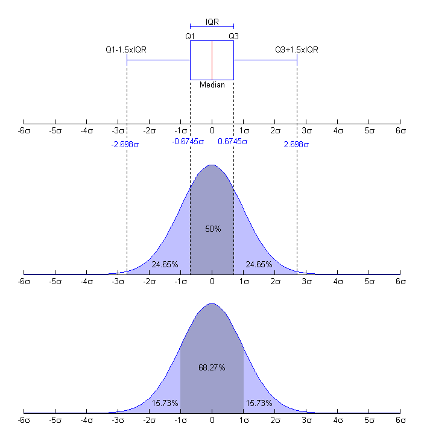
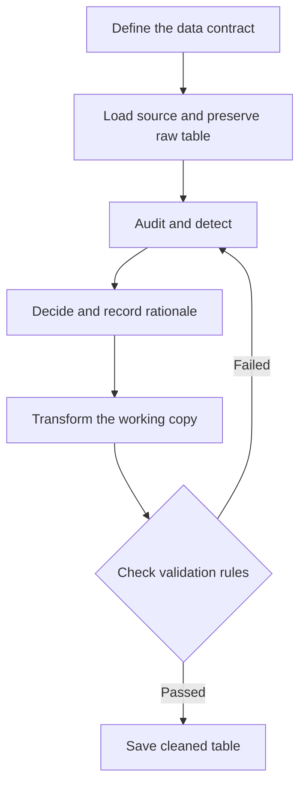

---
notion:
  title_line: "# Data: Care & Feeding"
  role: lecture
  status: mapped
  page_id: "281d9fdd-1a1a-8015-bcdb-c11415191ac2"
  url: "https://app.notion.com/p/281d9fdd1a1a8015bcdbc11415191ac2"
---

# Data: Care & Feeding

See [BONUS.md](BONUS.md) for the optional extensions.

**Midterm (Assignment 5):** [assignment instructions](assignment/README.md)

**Live notebooks in Colab:** [Demo 1](https://colab.research.google.com/github/christopherseaman/datasci_217/blob/main/05/demo/demo1_missing_data.ipynb) · [Demo 2](https://colab.research.google.com/github/christopherseaman/datasci_217/blob/main/05/demo/demo2_transformations.ipynb) · [Demo 3](https://colab.research.google.com/github/christopherseaman/datasci_217/blob/main/05/demo/demo3_workflow.ipynb)

_Reality check: Data scientists spend 80% of their time cleaning data and 20% complaining about it. The remaining 20% is spent on actual analysis (yes, that's 120%; data science is just that intense!)_

# What Clean Means: The Data Contract

Before changing a single value, write down what the table is supposed to look like. Clean does not mean perfect; it means the data matches a stated description, the **data contract**. Three terms make the contract concrete:

- **Row meaning**: what one row represents. Below, one row is one clinic visit, not one patient.
- **Candidate identifier**: the column, or combination of columns, that should be unique for each row. `patient_id` alone repeats (P003 visited twice), so the identifier is `patient_id` + `visit_date`.
- **Schema**: each column's meaning, dtype, allowed values, and whether blanks are allowed.

| patient_id | visit_date | sbp |
| --- | --- | --- |
| P001 | 2026-01-05 | 120 |
| P002 | 2026-01-06 | 135 |
| P003 | 2026-01-07 | 118 |
| P003 | 2026-02-10 | 122 |

| Column | Meaning | dtype | Rule |
| --- | --- | --- | --- |
| `patient_id` | study patient | `str` | `P` + three digits; never blank |
| `visit_date` | visit day | `datetime64` | a real calendar date |
| `sbp` | systolic blood pressure (mmHg) | `Int64` | 60-250 when present |

Two dtypes here are new: `datetime64` stores calendar dates rather than text, and `Int64` (capital I) stores whole numbers that may be blank (Data Type Conversion below converts columns to both). Every operation in this lecture either checks a rule like these or changes the data to satisfy one.

# Handling Missing Data

A blank blood-pressure cell might mean the cuff failed, the nurse skipped the step, or the patient left before vitals. The blank looks the same in every case, but the right response differs. Gaps are also easy to overlook: pandas statistics skip them by default, so `pd.Series([140, None, 160]).mean()` returns `150.0` as if only two patients existed.

pandas calls a **missing value** NA (_not available_). The marker it prints depends on the column's dtype:

| Column dtype | Marker shown | Example |
| --- | --- | --- |
| `float64` numbers | `NaN` (_Not a Number_) | `pd.Series([120.0, None])` |
| `str` text | `NaN` | `pd.Series(['north', None])` |
| Nullable `Int64`, `string`, `boolean` (see Data Type Conversion below) | `<NA>` (the value `pd.NA`) | `pd.Series([34, None], dtype='Int64')` |
| `datetime64` dates | `NaT` (_Not a Time_) | `pd.to_datetime(pd.Series(['2026-01-15', None]))` |

`isna()` recognizes all of these, so use it instead of `==` (`np.nan == np.nan` is `False`). Source systems also invent their own codes for "nothing recorded", such as `-9`, `-999`, or `unknown`. These are **sentinel values** (sentinels): stand-ins that mean missing. pandas treats them as real data until you convert them. Lecture 04's `na_values=` converts them at read time; `replace()` converts them afterward.

Why a value is missing matters more than how many are missing:

- **MCAR** (missing completely at random): unrelated to anything, like a lab analyzer that failed on random days.
- **MAR** (missing at random): explained by something you recorded, like younger patients skipping an optional survey.
- **MNAR** (missing not at random): related to the missing value itself, like the heaviest drinkers skipping the alcohol question.

Counts cannot tell these apart; knowing how the data was collected can.


## Find and Count Missing Values

Count before you decide. A per-column count shows which variables have gaps; a per-row count shows which records are incomplete.

### Reference Card: Finding missing values

| Task | Code | Output |
| --- | --- | --- |
| Mark gaps | `df.isna()` / `df.notna()` (older aliases: `isnull()` / `notnull()`) | Boolean `DataFrame`, same shape as `df` |
| Count per column | `df.isna().sum()` | Count `Series` indexed by column |
| Fraction per column | `df.isna().mean()` | `0.25` means 25% missing |
| Percent per column | `(df.isna().mean() * 100).round(1)` | `25.0`; `.round(1)` keeps one decimal, like Python's `round(x, 1)` for one number |
| Count per row | `df.isna().sum(axis=1)` | Count `Series` indexed by row |
| Rows with any gap | `df.isna().any(axis=1)` | Boolean `Series`; `.sum()` counts incomplete rows |

### Code Snippet: Count gaps by column and row

```python
labs = pd.DataFrame({
    'patient_id': ['P001', 'P002', 'P003', 'P004'],
    'glucose': [98.0, None, 110.0, None],
    'hba1c': [5.4, 6.1, None, None],
})
print(labs.isna().sum())        # gaps per column
print(labs.isna().sum(axis=1))  # gaps per row
```

```text
patient_id    0
glucose       2
hba1c         2
dtype: int64
0    0
1    1
2    1
3    2
dtype: int64
```

Row 3 (P004) is missing both labs.

## Drop or Fill Missing Values

Once you know where the gaps are, you can leave them (pandas statistics skip them), drop rows, or fill them. **Imputation** means filling a gap with a value chosen by a stated rule, such as the column median. A filled table looks complete, but every filled value is a guess, so record the rule you used.

Forward fill copies the last observed value down; backward fill copies the next one up. Both depend on row order, so use them only when rows are in time order for one patient or one sensor.

```
Original Data:        Forward Fill (ffill):           Backward Fill (bfill):
  Index Value           Index Value                     Index Value
    0     10              0     10 ─┐                     0     10
    1   [NaN]             1     10 ←┤ fills down          1     15 ←┐
    2   [NaN]             2     10 ←┘ from 10             2     15 ←┤ fills up
    3     15              3     15 ─┐                     3     15 ─┘ from 15
    4   [NaN]             4     15 ←┤ fills down          4   [NaN] can't fill
    5   [NaN]             5     15 ←┘ from 15             5   [NaN] no later rows
```

### Reference Card: Dropping and filling

| Task | Code | Output / caution |
| --- | --- | --- |
| Drop incomplete rows | `df.dropna()` | New `DataFrame` without any row that has a gap; can remove most rows |
| Drop rows empty in key columns | `df.dropna(subset=['glucose', 'hba1c'], how='all')` | Drops a row only when every listed column is empty; keeps rows with at least one lab |
| Drop sparse rows | `df.dropna(thresh=n)` | Keeps rows with at least `n` non-missing values |
| Fill with a constant | `df.fillna(value)` or `df.fillna({'col': value})` | New `DataFrame` with gaps filled |
| Fill with a column summary | `df.fillna(df.median(numeric_only=True))` | Numeric gaps get their column median (resists extreme values); `mean` works the same way |
| Fill with the most common value | `df.fillna(df.mode().iloc[0])` | First mode per column; ties are broken by sort order |
| Fill from neighbors | `df.ffill()` / `df.bfill()` | Previous / next observed value; `limit=1` fills at most one gap in a row |
| Fill between neighbors | `df['col'].interpolate()` | Linear interpolation; numeric columns only, and a `DataFrame` with a `str` column raises `TypeError`; assumes rows are in order and equally spaced |

### Code Snippet: Drop, fill, and carry forward

```python
# Drop a patient only when both labs are missing
print(labs.dropna(subset=['glucose', 'hba1c'], how='all'))

# Fill each lab with its column median
print(labs.fillna(labs.median(numeric_only=True)))

# One sensor, already in time order; carry its last reading through one gap
readings = pd.Series([10.0, None, None, 15.0])
print(readings.ffill(limit=1))
```

```text
  patient_id  glucose  hba1c
0       P001     98.0    5.4
1       P002      NaN    6.1
2       P003    110.0    NaN
  patient_id  glucose  hba1c
0       P001     98.0   5.40
1       P002    104.0   6.10
2       P003    110.0   5.75
3       P004    104.0   5.75
0    10.0
1    10.0
2     NaN
3    15.0
dtype: float64
```

_Unofficially, missing data has 47 types. The most common? "I forgot to fill this out" and "The system crashed again."_

# Repeated Rows, Sentinels, and Wrong Types

Blanks are not the only problem an audit finds. Three more hide in the same table: the same record entered twice, missing values disguised as numbers such as `-999`, and numbers or dates stored as text. Each one silently changes counts and averages, so check for them before you trust a mean or a fill.

## Detecting and Resolving Duplicates

An **exact duplicate** is a row identical to an earlier row in every column. Repeated rows or identifiers are evidence to investigate, not an instruction to delete. Use the row meaning and candidate identifier from the data contract: an exact copy of a visit is usually a double entry, but two rows that share a `patient_id` may be two real visits.

### Reference Card: Duplicate detection

| Task | Code | Output / note |
| --- | --- | --- |
| Flag repeats | `df.duplicated()` | Boolean `Series`; `True` for each row identical to an earlier row |
| Flag every row in a repeated set | `df.duplicated(keep=False)` | Also marks the first copy; `.sum()` counts all rows involved |
| Check an identifier | `df.duplicated(subset=['patient_id', 'visit_date'], keep=False)` | Compares only those columns; finds rows that share an ID but may differ elsewhere |
| Remove exact repeats | `df.drop_duplicates(keep='first')` | New `DataFrame` keeping the first copy; `keep='last'` keeps the last |

### Code Snippet: Tell a repeated entry from a repeat visit

```python
visits = pd.DataFrame({
    'patient_id': ['P001', 'P002', 'P002', 'P003', 'P003'],
    'visit_date': ['2026-01-05', '2026-01-06', '2026-01-06', '2026-01-07', '2026-02-10'],
    'sbp': [120, 135, 135, 118, 122],
})
print(visits.duplicated().sum())                                   # P002 entered twice
print(visits.duplicated(keep=False).sum())                         # both P002 rows
print(visits.duplicated(subset=['patient_id'], keep=False).sum())  # P002 and P003 repeat an ID
print(visits.drop_duplicates())                                    # P003's two real visits both stay
```

```text
1
2
4
  patient_id  visit_date  sbp
0       P001  2026-01-05  120
1       P002  2026-01-06  135
3       P003  2026-01-07  118
4       P003  2026-02-10  122
```

_Fun fact: Duplicates are like a song stuck in your head. They keep showing up, even after you think you have gotten rid of them all._

## Replacing Values

The sentinel values from the missing-data introduction, such as `-999` for "nothing recorded", look like real measurements to pandas, so it averages them in: `pd.Series([140, -999, 160]).mean()` is `-233.0`. `replace()` swaps exact cell values for others. Replacing the sentinel with `np.nan` restores the correct mean of `150.0`. When the bad values follow a rule rather than a fixed code, such as any age above 120, `mask()` blanks every value where a condition is `True`.

### Reference Card: Value replacement

| Item | Purpose / arguments | Output / note |
| --- | --- | --- |
| `df.replace(old, new)` | Replace one exact value | New `DataFrame` with replacements |
| `df.replace([val1, val2], new)` | Replace several values with one value | New `DataFrame` with replacements |
| `df.replace([val1, val2], [new1, new2])` | Pair old and new values by position | New `DataFrame`; lists must have equal lengths |
| `df.replace({val1: new1, val2: new2})` | Map old values to replacements | New `DataFrame` with replacements |
| `df.replace({'age': {-9: np.nan}})` | Replace a code in one column only, when it is a sentinel there but a real value elsewhere | New `DataFrame`; other columns unchanged |
| `series.mask(condition)` / `series.where(condition)` | `mask` blanks values where the condition is `True`; `where` keeps values where `True` and blanks the rest | `Series` with missing values in the blanked positions; unlike Lecture 03's `np.where`, no second value is needed |

### Code Snippet: Replace sentinels and labels

```python
# Replace sentinel codes with NaN
sbp = pd.Series([140, -999, 160, -1000])
print(sbp.replace([-999, -1000], np.nan))

# A different replacement for each value
levels = pd.Series(['low', 'medium', 'high', 'low'])
print(levels.replace({'low': 'L', 'medium': 'M', 'high': 'H'}))

# Blank values that break a rule
ages = pd.Series([34, 150, 52])
print(ages.mask(ages > 120))
```

```text
0    140.0
1      NaN
2    160.0
3      NaN
dtype: float64
0    L
1    M
2    H
3    L
dtype: str
0    34.0
1     NaN
2    52.0
dtype: float64
```

## Data Type Conversion

A column that should hold numbers often arrives as text. Lecture 04 showed a single `?` turning a whole CSV column into `str`; hand-typed entries such as `'forty'` or `'unknown'` do the same. Text cannot be averaged or compared by size, so convert it. `pd.to_numeric()` and `pd.to_datetime()` parse text into numbers and dates, and `errors='coerce'` turns anything they cannot parse into a missing value instead of stopping with an error. `astype()` changes the type of a column whose values are already valid.

NumPy's `int64` cannot hold a missing value, which is why a whole-number column with one gap reads as `float64` (`34.0`). pandas adds **nullable** types (capital-I `Int64`, `string`, and `boolean`) that store `<NA>` alongside real values. Dates bring one more trap: `2026-02-30` looks like a date but does not exist.

### Reference Card: Converting messy columns

| Task | Code | Output / note |
| --- | --- | --- |
| Text to number, invalid to missing | `pd.to_numeric(s, errors='coerce')` | Numbers (`float64` once any value becomes `NaN`); `'forty'` becomes `NaN` |
| Change a clean column's type | `s.astype('float64')` / `s.astype('int64')` | Raises an error if any value cannot convert; `int64` cannot hold missing values |
| Check for whole numbers first | `s.mod(1).eq(0)` | `True` where the value has no fractional part; `False` for missing |
| Whole numbers with gaps | `s.astype('Int64')` | Nullable integers; `40.5` raises `TypeError` rather than rounding |
| Text with gaps | `s.astype('string')` | Nullable text; missing shows as `<NA>` |
| Dates in a known format | `pd.to_datetime(s, format='%Y-%m-%d', errors='coerce')` | `%Y` year, `%m` month, `%d` day; `datetime64[us]`; impossible dates such as `2026-02-30` become `NaT`, but single-digit parts such as `2026-7-01` are still accepted (exact check: Data Validation Rules) |
| True/false with unknowns | `s.astype('boolean')` | Nullable `True` / `False` / `<NA>` |

### Code Snippet: Convert an export's text columns

```python
visits = pd.DataFrame({
    'age_text': ['34', 'unknown', '52'],
    'visit_date': ['2026-01-15', '2026-02-30', '2026-03-01'],
})
visits['age'] = pd.to_numeric(visits['age_text'], errors='coerce').astype('Int64')
visits['visit_date'] = pd.to_datetime(visits['visit_date'], format='%Y-%m-%d', errors='coerce')
visits['needs_review'] = (visits['age'].isna() | visits['visit_date'].isna()).astype('boolean')
print(visits)
```

```text
  age_text visit_date   age  needs_review
0       34 2026-01-15    34         False
1  unknown        NaT  <NA>          True
2       52 2026-03-01    52         False
```

# LIVE DEMO!

# Data Transformation Techniques

The tools so far repair values that are missing, repeated, or stored as the wrong type. The next ones change how correct values are expressed: turn a text answer into a score, give columns consistent names, or group exact ages into bands. Each follows a rule you choose, so write the rule where others can read it: a dictionary, a function from Lecture 02, or a list of bin edges. Each returns a new object; assign the result to keep it.


## Applying Custom Functions

A nursing export records pain as text such as `'7/10'`, smoking status as words, and blood pressure in two columns that together decide a stage. Each rule is easy to write for one value, with Lecture 01's `if`/`elif` inside a Lecture 02 function. `map()` and `apply()` run that rule on every value of a column, or on every row of a table.

A **`lambda`** is a one-line function without a name, handy for a rule you use once: `lambda x: x * 2` does the same as `def double(x): return x * 2`.

Arithmetic and comparisons need no `apply`. `vitals['sbp'] - vitals['dbp']` and `vitals['sbp'] >= 140` already work on whole columns (Lecture 04) and run much faster. Save `apply` for rules that need `if`/`elif` or a function written for one value.

| Raw value | Rule | Result |
| --- | --- | --- |
| `'7/10'` | `apply`: keep the number before the slash | `7` |
| `'former'` | `map`: look up `{'never': 0, 'former': 1, 'current': 2}` | `1` |
| `sbp` 126 and `dbp` 92 | `apply(axis=1)`: stage from both pressures | `'stage 2'` |

### Reference Card: Custom functions

| Item | Purpose / arguments | Output / note |
| --- | --- | --- |
| `series.map(dictionary)` | Look each value up in a dictionary; `series.map(func)` calls a function instead | `Series`; values missing from the dictionary become missing |
| `series.apply(func)` | Call `func` on each value; `func` may be a `lambda` | `Series` of the return values |
| `df.apply(func, axis=1)` | Call `func` on each row, passed as a `Series`; `row['sbp']` reads one value | `Series` indexed by row |
| `df.apply(func, axis=0)` | Call `func` on each column, passed as a `Series` | `Series` indexed by column |
| `df.map(func)` | Call `func` on every cell | `DataFrame` with the same shape |

### Code Snippet: Map and apply clinical rules

```python
vitals = pd.DataFrame({
    'sbp': [118, 142, 134, 126],  # systolic, mmHg
    'dbp': [76, 84, 78, 92],      # diastolic, mmHg
    'pain': ['2/10', '7/10', '0/10', '5/10'],
    'smoking': ['never', 'current', 'former', 'never'],
})

# A lambda on each value: keep the number before the slash
print(vitals['pain'].apply(lambda text: int(text.split('/')[0])))

# A dictionary lookup: one code per label
print(vitals['smoking'].map({'never': 0, 'former': 1, 'current': 2}))

# axis=1 passes each row, so one rule can read two columns
def bp_stage(row):
    """Stage one reading from both pressures (simplified ACC/AHA)."""
    if row['sbp'] >= 140 or row['dbp'] >= 90:
        return 'stage 2'
    elif row['sbp'] >= 130 or row['dbp'] >= 80:
        return 'stage 1'
    else:
        return 'below stage 1'

vitals['bp_stage'] = vitals.apply(bp_stage, axis=1)
print(vitals[['sbp', 'dbp', 'bp_stage']])
```

```text
0    2
1    7
2    0
3    5
Name: pain, dtype: int64
0    0
1    2
2    1
3    0
Name: smoking, dtype: int64
   sbp  dbp       bp_stage
0  118   76  below stage 1
1  142   84        stage 2
2  134   78        stage 1
3  126   92        stage 2
```

Row 3 reaches stage 2 on its diastolic pressure alone. [The bonus](BONUS.md#conditional-data-replacement) stages whole columns at once with `np.select()`, which is faster on large tables.

## Renaming Axis Indexes

Exports rarely arrive with tidy column names. A clinic extract might label its columns `'Patient ID '`, `'SBP (mmHg)'`, and `'VisitDate'`. Every Lecture 04 selection, `df['col']` or `df.loc[rows, 'col']`, must spell a label exactly, so the trailing space alone makes `df['Patient ID']` raise `KeyError`. A table has two **axis indexes**: the row labels (`df.index`) and the column labels (`df.columns`). **Renaming** changes those labels without touching any values. Choose one naming style, such as lowercase words joined by underscores (`patient_id`, `sbp`, `visit_date`), and rename right after loading so every later step can type the names without guessing.

`rename()` takes the same two kinds of rule as `map()` above: a dictionary of old-to-new labels (Lecture 02), or a function such as `str.lower` that it calls on every label. It returns a new table, so assign the result; for targeted value changes, assign directly with `.loc`.

### Reference Card: Renaming labels

| Item | Purpose / arguments | Output / note |
| --- | --- | --- |
| `df.rename(index={old: new})` | Rename rows | DataFrame with revised labels |
| `df.rename(columns={old: new})` | Rename columns | DataFrame with revised labels |
| `df.rename(columns=str.lower)` | Lowercase every string column label | `DataFrame` with revised labels |
| `df.rename(columns=str.strip)` | Remove leading/trailing whitespace from each column label | DataFrame with revised labels |
| `series.rename('new_name')` | Set a Series' name; it becomes the column header when the Series turns into a table column, as after `reset_index()` | `Series` with the new name |

### Code Snippet: Rename columns

```python
visits = pd.DataFrame({'Patient ID ': ['P001', 'P002'], 'SBP (mmHg)': [128, 141]})

# A dictionary renames the columns you name
visits = visits.rename(columns={'Patient ID ': 'patient_id', 'SBP (mmHg)': 'sbp'})
print(visits.columns)

# A function rule applies to every label; spaces inside a label stay
labels_df = pd.DataFrame({'First Column': [1], ' Second ': [2], 'THIRD': [3]})
print(labels_df.rename(columns=str.strip).rename(columns=str.lower).columns)
```

```text
Index(['patient_id', 'sbp'], dtype='str')
Index(['first column', 'second', 'third'], dtype='str')
```

## Creating Categories

Table 1 of almost every clinical paper reports age in bands rather than single years. **Binning** assigns each value to an interval. `pd.cut()` uses edges you choose, so bands can match a clinical definition. `pd.qcut()` picks edges from the data so each bin gets about the same number of rows, as in quartiles; ties can make its edges duplicate, so inspect the result and set an explicit duplicate-edge policy (`duplicates='drop'` in Demo 2) when needed. pandas writes an interval as `(30, 50]`: the round bracket means 30 is not included, and the square bracket means 50 is.

### Reference Card: Categorical variables

| Item | Purpose / arguments | Output / note |
| --- | --- | --- |
| `pd.cut(series, bins=4)` | Cut the value range into four equal-width bins | Categorical Series of bins |
| `pd.cut(series, bins=[...])` | Cut at explicitly supplied edges (not necessarily equal-width) | Categorical Series of bins |
| `pd.qcut(series, q)` | Use quantiles to target equal-frequency bins | Categorical `Series`; duplicate edges raise by default |
| `pd.qcut(series, q, duplicates='drop')` | Merge repeated edges caused by tied values instead of raising | Fewer than `q` bins; leave out `labels`, whose count must match the bins |
| `bins=[0, 30, 50, 100]` | Supply three explicit intervals | `(0, 30]`, `(30, 50]`, `(50, 100]` by default |
| `labels=['Young', 'Middle', 'Senior']` | Name the three bins | One label per bin is required |

### Code Snippet: Create ordered categories

```python
ages = pd.Series([25, 30, 45, 60, 75])
print(pd.cut(ages, bins=[0, 30, 50, 100], labels=['Young', 'Middle', 'Senior']))  # 30 falls in (0, 30]
```

```text
0     Young
1     Young
2    Middle
3    Senior
4    Senior
dtype: category
Categories (3, str): ['Young' < 'Middle' < 'Senior']
```

# String Manipulation

In Lecture 01 you cleaned one string at a time: `'  Alice  '.strip()`, `name.lower()`, `name.title()`. A column can hold thousands of strings. The **`.str` accessor** applies those same methods to every value in a Series at once; missing values stay missing instead of raising an error.

Text columns are where inconsistent categories hide. A hand-typed site column might hold `'North'`, `' north'`, and `'NORTH'`: three spellings of one clinic. Lecture 04's `value_counts()` counts them as different sites until you normalize them:

| Raw value | Count before | After `.str.strip().str.lower()` | Count after |
| --- | --- | --- | --- |
| `'North'` | 1 | `'north'` | 3 |
| `' north'` | 1 | `'north'` | (same group) |
| `'NORTH'` | 1 | `'north'` | (same group) |
| `'south'` | 1 | `'south'` | 1 |

## Basic String Operations


### Reference Card: String operations

| Item | Purpose / arguments | Output / note |
| --- | --- | --- |
| `series.str.strip()` | Remove leading/trailing whitespace | String `Series` |
| `series.str.lower()` / `series.str.upper()` | Convert to lowercase / uppercase | String `Series` |
| `series.str.title()` | Capitalize each word (Lecture 01's `str.title()` for a whole column) | String `Series` |
| `series.str.replace(old, new, regex=False)` | Replace literal substrings | String `Series` |
| `df.columns.str.replace(' ', '_')` | The same `.str` methods work on column labels | New `Index` of labels; assign it back to `df.columns` |
| `series.str.contains(pattern, na=False)` | Test whether each value contains `pattern`, read as a **regular expression** (regex): a text pattern in which plain letters and digits match themselves; `regex=False` searches for literal text | Boolean `Series`; missing becomes `False` |
| `series.str.startswith(prefix, na=False)` | Test a literal prefix | Boolean `Series` |
| `series.str.endswith(suffix, na=False)` | Test a literal suffix | Boolean `Series` |

### Code Snippet: Normalize text fields

```python
names = pd.Series(['  alice smith ', 'BOB JONES', None])
print(names.str.strip().str.title())

tests = pd.Series(['fasting glucose', 'random glucose', 'HbA1c'])
print(tests.str.contains('fasting'))
```

```text
0    Alice Smith
1      Bob Jones
2            NaN
dtype: str
0     True
1    False
2    False
dtype: bool
```

One column sometimes holds several facts at once: a full name, a `city, state` pair, or a delimited list of codes. [The bonus](BONUS.md#splitting-and-joining-values) covers `str.split()`, `str.cat()`, and `str.join()` for taking those apart and putting them back together.


# Categorical Data Encoding

Many health variables take one of a few fixed labels: smoking status (`never`, `former`, `current`), blood type, study site, or the age bands `pd.cut()` produced above. A **categorical variable** is a column like this, where a short list of labels repeats down every row. Lecture 04's `value_counts()` shows that list, and the string tools above make sure each label is spelled only one way.

How to store the labels depends on the next job:

- Keep them as labels, stored compactly and optionally in a meaningful order: the **categorical dtype** (`category`). The `pd.cut()` output above already printed `dtype: category` with the ordered labels `['Young' < 'Middle' < 'Senior']`.
- Give them to a regression or machine-learning model, which computes only with numbers (Lecture 10): **indicator variables**, one 0/1 column per label.

## Categorical Data Type

A `category` column stores each distinct label once and gives every row a small integer **code** that points to its label. That can shrink a column with few distinct labels, but measure the effect on the actual data.

### Reference Card: Categorical dtype

| Item | Purpose / arguments | Output / note |
| --- | --- | --- |
| `series.astype('category')` | Convert values to categorical storage | Categorical `Series` |
| `series.cat.categories` | View the category vocabulary | `Index` of category labels |
| `series.cat.codes` | Inspect each value's category position | Integer `Series`; missing values use code `-1` |
| `series.memory_usage(deep=True)` | Measure storage, including the text itself | Bytes as an integer; compare before and after `astype('category')` |

### Code Snippet: Store repeated categories efficiently

```python
# 5,000 smoking-status values drawn from three labels
smoking = pd.Series(['never', 'former', 'never', 'current', 'former'] * 1000)
smoking_cat = smoking.astype('category')

print(f"As str: {smoking.memory_usage(deep=True)} bytes")
print(f"As category: {smoking_cat.memory_usage(deep=True)} bytes")
print(smoking_cat.cat.categories)
print(smoking_cat.cat.codes[:5].tolist())  # .tolist() makes a plain Python list
```

```text
As str: 274132 bytes
As category: 5297 bytes
Index(['current', 'former', 'never'], dtype='str')
[2, 1, 2, 0, 1]
```

Colab has the `pyarrow` package installed, which stores text more compactly, so there the `str` line reads about 69,000 bytes. The category version is far smaller either way.

## Creating Indicator (Dummy) Variables

`pd.get_dummies()` gives each label its own column, marking rows with that label `True` (1) and every other row `False` (0); `dtype='int64'` stores the marks as 0/1 integers. With `drop_first=True`, one category becomes the reference: a row in that category has 0 in every retained indicator, so the model does not carry a redundant column (Lecture 10 covers the modeling implications).


### Reference Card: Indicator variables

| Item | Purpose / arguments | Output / note |
| --- | --- | --- |
| `pd.get_dummies(series)` | Create one indicator column per category | Boolean `DataFrame` by default |
| `prefix='color'` | Prefix the output labels | Names such as `color_blue` |
| `drop_first=True` | Omit the first category as the reference | `k - 1` columns for `k` categories |
| `dtype='int64'` | Request integer indicators | Columns containing `0` and `1` |
| `dummy_na=True` | Give missing values their own indicator | Extra missing-value column; otherwise missing rows are all zero |
| `pd.concat([df, dummies], axis=1)` | Place the indicator columns beside the original table (Lecture 06 covers concatenation) | `DataFrame` with the original and indicator columns |

### Code Snippet: Encode categories

```python
df = pd.DataFrame({'color': ['red', 'blue', 'red', 'green']})
print(pd.get_dummies(df['color'], prefix='color', dtype='int64'))

# Drop the first category; blue becomes the reference (all zeros)
print(pd.get_dummies(df['color'], prefix='color', drop_first=True, dtype='int64'))
```

```text
   color_blue  color_green  color_red
0           0            0          1
1           1            0          0
2           0            0          1
3           0            1          0
   color_green  color_red
0            0          1
1            0          0
2            0          1
3            1          0
```

# LIVE DEMO!

# Data Validation and Quality Assessment


Inspection describes a table; **validation** checks it against the data contract. A **validation rule** is a yes/no question asked of every row, such as "is the age between 0 and 120?" or "does the patient ID look like `P` plus three digits?" Rows that fail are listed for review rather than deleted: an age of 150 is almost certainly a typo, while a systolic pressure of 220 may be a real emergency.

| Issue | Detection | Possible response after investigation |
|-------|-----------|---------------------------------------|
| Missing Values | `df.isna().sum()` plus sentinel checks | Retain, flag, impute, or drop according to variable meaning and analysis purpose |
| Duplicate Candidates | exact-row and candidate-identifier checks | Confirm row meaning and source history; consolidate or remove only records shown to be redundant |
| Wrong Data Type | `df.dtypes` plus conversion probes | Parse with an explicit failure policy, then validate the intended dtype |
| Outliers | `df.describe()`<br>Box plots<br>domain rules | Verify against source and domain knowledge; keep, flag, correct, cap, or filter with a documented rationale |
| Inconsistent Categories | `df['col'].unique()` | Normalize only differences known to share a meaning; map documented aliases explicitly |

Run the Lecture 04 inspection checks (`isna().sum()`, `duplicated().sum()`, `value_counts()`, `nunique()`, `dtypes`, `describe()`) before and after cleaning and compare the outputs: counts should change only where you meant them to.

## Data Validation Rules

Each rule below returns one `True`/`False` per row; combine rules with `&` and `|` from Lecture 03.

### Reference Card: Validation rules

| Task | Code | Output / note |
| --- | --- | --- |
| Inclusive range | `series.between(low, high)` | Boolean `Series`; `True` when `low <= value <= high` |
| Allowed list | `series.isin(['north', 'south', 'west'])` | Boolean `Series`; `True` for listed values |
| Describe a pattern | `r'P[0-9]{3}'` | A regular expression: `P`, then `[0-9]` (any digit) exactly `{3}` times; the `r` prefix (raw string) is the usual way to write patterns |
| Whole-value pattern | `series.str.fullmatch(pattern)` | `True` only when the whole value matches |
| Start-only pattern | `series.str.match(pattern)` | Checks the start only, so `'P0012'` passes `P[0-9]{3}`; prefer `fullmatch` for rules |
| Exact date text | `series.str.fullmatch(r'[0-9]{4}-[0-9]{2}-[0-9]{2}')` | `True` only for exact `YYYY-MM-DD` text; needed because `to_datetime(..., format='%Y-%m-%d')` still accepts `2026-7-01` |
| Length and digits | `series.str.len()` / `series.str.isdigit()` | Characters per value / `True` when every character is a digit |
| Combine rules | `rule_a & rule_b` / `rule_a \| rule_b` | Both must pass / either passes |
| Rows that fail | `df[~mask]` | `~` flips `True` and `False`, so this keeps the rows that fail |

### Code Snippet: List the rows that break a rule

```python
patients = pd.DataFrame({
    'patient_id': ['P001', 'P02', 'P003', 'P004'],
    'age': [34, 41, 150, 29],
})
valid_age = patients['age'].between(0, 120)                    # inclusive range
valid_id = patients['patient_id'].str.fullmatch(r'P[0-9]{3}')  # P + three digits
print(patients[~(valid_age & valid_id)])                       # rows to review
```

```text
  patient_id  age
1        P02   41
2       P003  150
```

### Code Snippet: Accept only exact dates

```python
dates = pd.Series(['2026-01-15', '2026-7-01', '2026-02-30'])
exact = dates.str.fullmatch(r'[0-9]{4}-[0-9]{2}-[0-9]{2}')  # four digits, dash, two, dash, two
parsed = pd.to_datetime(dates.where(exact), format='%Y-%m-%d', errors='coerce')
print(parsed)
```

```text
0   2026-01-15
1          NaT
2          NaT
dtype: datetime64[us]
```

`2026-7-01` fails the text check; `2026-02-30` passes it but is not a real date, so `to_datetime` makes it `NaT`.

## Detecting and Filtering Outliers

Outliers are extreme values that may represent errors, rare but valid observations, or important anomalies. A statistical rule can flag candidates, but source evidence, domain meaning, and analysis purpose determine whether to keep, correct, cap, or exclude them. The **interquartile range (IQR)** is the distance from the 25th to the 75th percentile; the usual rule flags values more than 1.5 IQRs outside those quartiles, which is exactly where a box plot draws its whiskers. See [the bonus](BONUS.md#advanced-outlier-detection-methods) for z-score and other detection methods.



### Reference Card: Outlier checks

| Item | Purpose / arguments | Output / note |
| --- | --- | --- |
| `df[df['col'] > threshold]` | Filter by threshold | Filtered DataFrame |
| `df.quantile([0.25, 0.75], numeric_only=True)` | Find numeric quartiles for the IQR method | `DataFrame` indexed by quantile |
| `(s < q1 - 1.5 * iqr) \| (s > q3 + 1.5 * iqr)` | Flag values beyond 1.5 IQRs from the quartiles | Boolean `Series` |
| `df[df['col'].between(lower, upper)]` | Keep rows whose selected value is within inclusive bounds | Filtered `DataFrame` |
| `df.clip(lower, upper)` | Cap comparable values at bounds | `DataFrame` with values limited to the bounds |

### Code Snippet: Flag unusual values

```python
df = pd.DataFrame({'value': [1, 2, 3, 4, 5] * 4 + [100]})

# The quartiles are 2 and 4, so the fences are -1 and 7
Q1 = df['value'].quantile(0.25)
Q3 = df['value'].quantile(0.75)
IQR = Q3 - Q1
iqr_flag = (df['value'] < Q1 - 1.5 * IQR) | (df['value'] > Q3 + 1.5 * IQR)
print(df.loc[iqr_flag])  # the row to investigate

# Exclude a flagged row only after evidence supports that decision
df_clean = df.loc[~iqr_flag]

# Or cap extreme values instead of dropping them
print(df['value'].clip(lower=0, upper=10).max())
```

```text
    value
20    100
10
```

## Spot-Check Random Rows

`head()` only shows the first rows, and problems often hide further down: a site misspelled only in March records, or a date format that changes halfway through the file. `df.sample()` draws rows at random so you can look at the middle of the table. A **simple random sample** gives every row the same chance of selection, and `random_state` fixes the draw so everyone sees the same rows.

### Reference Card: Sampling rows

- `df.sample(n=5, random_state=42)`: Five random rows without replacement; errors if `df` has fewer than five rows.
- `df.sample(frac=0.1, random_state=42)`: Ten percent of the rows.

### Code Snippet: Draw three rows to inspect

```python
records = pd.DataFrame({
    'record_id': ['R001', 'R002', 'R003', 'R004', 'R005'],
    'status': ['active', 'pending', 'active', 'complete', 'pending'],
})
print(records.sample(n=3, random_state=42))
```

```text
  record_id   status
1      R002  pending
4      R005  pending
2      R003   active
```

See [the bonus](BONUS.md#optional-reference-sampling-designs-and-resampling) for stratified, weighted, systematic, and bootstrap sampling.

# Data Cleaning Pipeline


Treat the file you received like an original lab specimen: you never write on it. Load it into a **raw table** and leave that table untouched. Make every change on a **working copy**, and save the result as a new **cleaned table** only after it passes validation. Keeping the raw table lets you rerun the cleaning from the start and prove nothing changed by accident. Record where the file came from (its **provenance**) and each decision you made, such as one row per rule with the field, issue, action, and reason, so someone else can repeat your steps.

A **hash** records the file itself: SHA-256 turns a file's bytes into a 64-character fingerprint, and changing any byte changes it. When a data release publishes its files' hashes, as PhysioNet does, a matching hash shows your copy is the same file.

## From Source to Cleaned Table


```mermaid
graph TD
    A[Define the data contract] --> B[Load source and preserve raw table]
    B --> C[Audit and detect]
    C --> D[Decide and record rationale]
    D --> E[Transform the working copy]
    E --> F{Check validation rules}
    F -->|Failed| C
    F -->|Passed| G[Save cleaned table]
```

### Reference Card: Keep the raw table unchanged

- `pd.read_csv(path, dtype='string', keep_default_na=False)`: Read every column as text, keeping blanks and codes such as `NA` exactly as written, so the audit can count them.
- `raw.copy(deep=True)`: An independent copy; changes to it never reach `raw`.
- `raw.equals(raw_snapshot)`: `True` when values and dtypes are identical.
- `hashlib.sha256(path.read_bytes()).hexdigest()`: The file's SHA-256 hash as text, to compare with the published one (`import hashlib`; `path` is a Lecture 02 `Path`, and `read_bytes()` reads its raw bytes rather than text).
- `path.name`, `path.stat().st_size`: The file's name and its size in bytes, two more facts a release often lists.

### Code Snippet: Load once, change only the copy

`intake.csv`:

```text
record_id,site,status
R001, North ,Active
R002,south,NA
R003,,pending
```

```python
raw = pd.read_csv('intake.csv', dtype='string', keep_default_na=False)
raw_snapshot = raw.copy(deep=True)
working = raw.copy(deep=True)
working['site'] = working['site'].str.strip().str.lower()
print(raw)                       # NA and the blank site stay as text
print(working)
print(raw.equals(raw_snapshot))  # the raw table is untouched
```

```text
  record_id     site   status
0      R001   North    Active
1      R002    south       NA
2      R003           pending
  record_id   site   status
0      R001  north   Active
1      R002  south       NA
2      R003         pending
True
```

### Code Snippet: Fingerprint the source file

```python
import hashlib
from pathlib import Path

source = Path('intake.csv')
print(source.name, source.stat().st_size)               # name and size in bytes
print(hashlib.sha256(source.read_bytes()).hexdigest())  # the same 64 characters every run
```

```text
intake.csv 70
2a1e54b64ddd61d9768e604e4bc91342b2ee33191ea6902c9ad38b54a2765420
```

Change one letter in `intake.csv` and the hash is completely different, even though the size stays 70 bytes.

## Validate Before You Save

The validation rules above list the rows that break a rule. Before saving, ask each rule once of the whole table. A **validation invariant** is a rule that must be true before a table counts as clean: IDs are unique, every site is on the allowed list, every recorded age is between 0 and 120. Write each invariant as one `True`/`False` check, and collect the checks in a Series so they print as a report.

`assert condition, message` from Lecture 02 turns that report into a gate: put it directly before `to_csv()`, so a failed check means no file is written. Passing checks show the table matches its contract; they cannot show that the cleaning decisions were wise.

### Reference Card: Validation checks

- `series.is_unique`: `True` when no value repeats; use it on an identifier column. It is an attribute, so it takes no parentheses.
- `series.isin(allowed).all()`: `True` when every value is on the allowed list.
- `series.dropna().between(low, high).all()`: `True` when every recorded value is in the inclusive range.
- `pd.Series({'rule name': result, ...})`: One named `True`/`False` per rule; prints as a validation report.
- `assert checks.all(), checks[~checks]`: Stops with `AssertionError` listing the failed rules; nothing after it runs.
- `clean.reset_index(drop=True)`: Renumber rows 0, 1, 2, ... after rows were dropped. A CSV saved with `index=False` reads back numbered this way.
- `pd.read_csv(path, dtype={'patient_id': 'string', 'age': 'Int64', 'needs_review': 'boolean'}, parse_dates=['visit_date'])`: Read a saved file back with the intended types. Dates go in `parse_dates` because `dtype=` cannot parse them.
- `round_trip.equals(clean)`: `True` only when values, dtypes, and row labels all match. A `str` column read back as `string` compares unequal.

### Code Snippet: Stop before saving a bad table

```python
clean = pd.DataFrame({
    'patient_id': ['P001', 'P002', 'P003'],
    'site': ['north', 'south', 'west'],
    'age': pd.Series([34, None, 52], dtype='Int64'),
})

checks = pd.Series({
    'patient IDs unique': clean['patient_id'].is_unique,
    'sites allowed': clean['site'].isin(['north', 'south', 'west']).all(),
    'ages 0-120 when present': clean['age'].dropna().between(0, 120).all(),
})
print(checks)
assert checks.all(), checks[~checks]  # a False check stops here
clean.to_csv('clean_patients.csv', index=False)
```

```text
patient IDs unique         True
sites allowed              True
ages 0-120 when present    True
dtype: bool
```

Change `'south'` to `'South'` and rerun. `sites allowed` becomes `False`, `assert` raises `AssertionError: sites allowed    False`, and no file is written.

### Code Snippet: Read the saved file back

```python
round_trip = pd.read_csv('clean_patients.csv', dtype={'age': 'Int64'})
print(round_trip.dtypes)
print(round_trip.equals(clean))  # same values, dtypes, and row labels
```

```text
patient_id      str
site            str
age           Int64
dtype: object
True
```

# LIVE DEMO!
