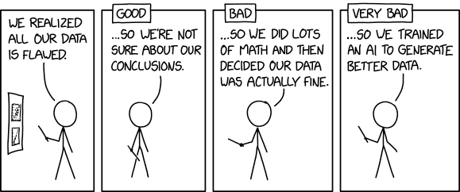
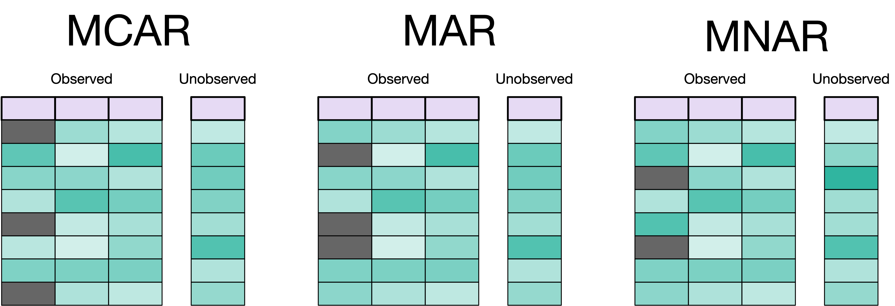
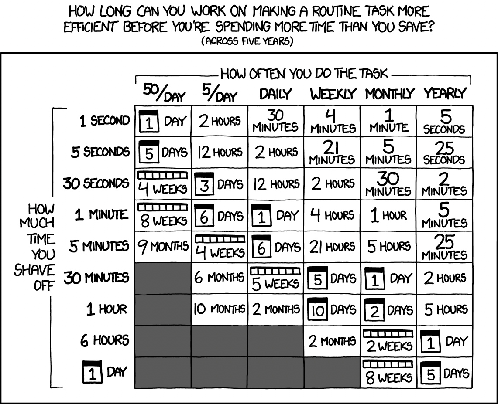
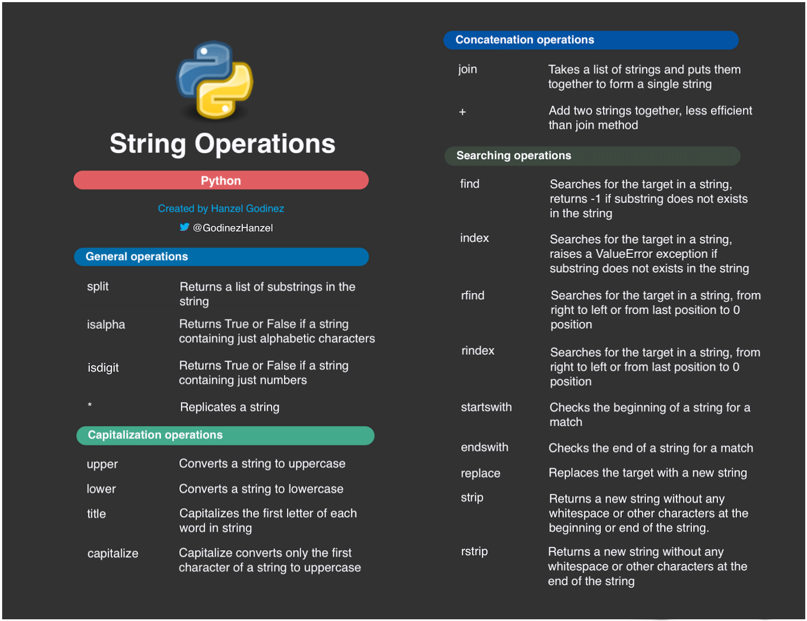
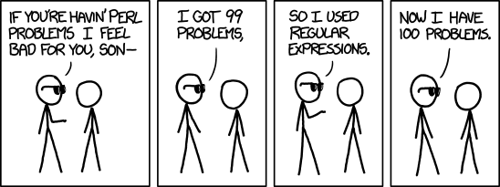
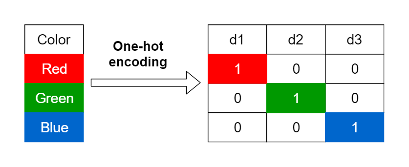
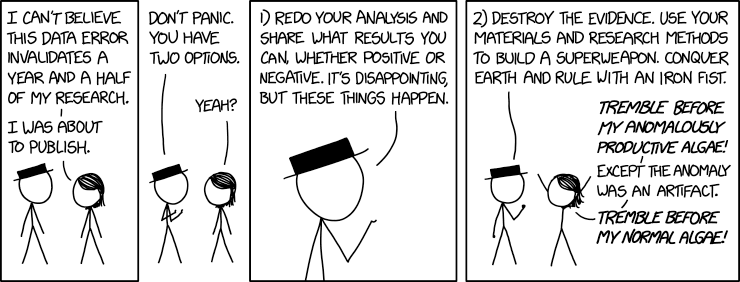
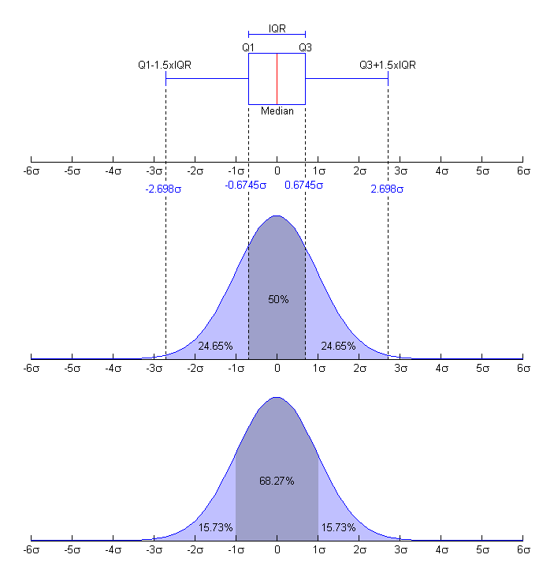
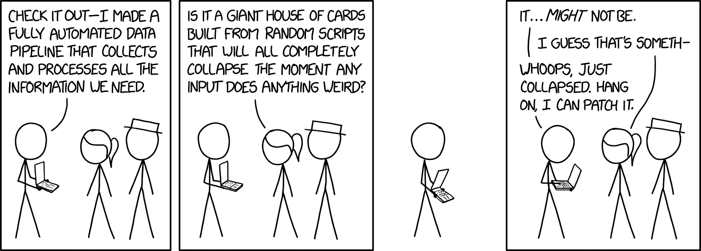
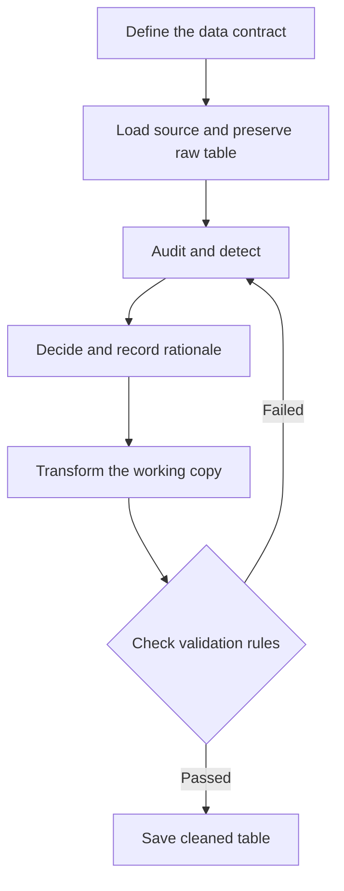

---
notion:
  title_line: "# Data: Care & Feeding"
  role: lecture
  status: mapped
  page_id: "281d9fdd-1a1a-8015-bcdb-c11415191ac2"
  url: "https://app.notion.com/p/281d9fdd1a1a8015bcdbc11415191ac2"
---

# Data: Care & Feeding

See [BONUS.md](BONUS.md) for the optional extensions.

**Live notebooks in Colab:** [Demo 1](https://colab.research.google.com/github/christopherseaman/datasci_217/blob/main/05/demo/demo1_missing_data.ipynb) · [Demo 2](https://colab.research.google.com/github/christopherseaman/datasci_217/blob/main/05/demo/demo2_transformations.ipynb) · [Demo 3](https://colab.research.google.com/github/christopherseaman/datasci_217/blob/main/05/demo/demo3_workflow.ipynb)

_Data scientists spend 80% of their time cleaning data and 20% complaining about it. The remaining 20% is spent on actual analysis (yes, that's 120%; data science is just that intense!)_

This lecture covers:

- McKinney, _Python for Data Analysis_ (3rd ed.): 3.2 (anonymous `lambda` functions), 5.2 (function application and mapping), and 7.1 to 7.5 (handling missing data; removing duplicates, mapping and replacing values, renaming axis indexes, binning, outliers, random sampling, and indicator variables; extension data types; string methods and regular expressions; and categorical data)

# What Clean Means: The Data Contract

A **data contract** is a written description of what a clean table looks like: what one row means, which columns identify it, and each column's type and allowed values. Clean does not mean perfect; it means the table matches its contract, so write the contract first and make every cleaning step check or satisfy one of its rules.

- **Row meaning**: what one row represents. Below, one row is one clinic visit, not one patient.
- **Candidate identifier**: the column, or combination of columns, that should be unique for each row. `patient_id` alone repeats (P003 visited twice), so the identifier is `patient_id` + `visit_date`.
- **Schema**: each column's meaning, dtype, allowed values, and whether blanks are allowed.

| patient_id | visit_date | sbp |
| --- | --- | --- |
| P001 | 2026-01-05 | 120 |
| P002 | 2026-01-06 | 135 |
| P003 | 2026-01-07 | 118 |
| P003 | 2026-02-10 | 122 |

| Column | Meaning | dtype | Rule |
| --- | --- | --- | --- |
| `patient_id` | study patient | `str` | `P` + three digits; never blank |
| `visit_date` | visit day | `datetime64` | a real calendar date |
| `sbp` | systolic blood pressure (mmHg) | `Int64` | 60-250 when present |

Two dtypes here are new: `datetime64` stores calendar dates rather than text, and `Int64` (capital I) stores whole numbers that may be blank; Data Type Conversion below converts columns to both.



# Handling Missing Data

A **missing value** is a cell with nothing recorded, which pandas calls NA (_not available_). A blank blood pressure might mean the cuff failed or the patient left before vitals, and pandas statistics skip gaps silently: `pd.Series([140, None, 160]).mean()` returns `150.0` as if only two patients existed, so count the gaps before trusting a summary.

pandas prints NA differently by dtype:

| Column dtype | Marker shown | Example |
| --- | --- | --- |
| `float64` numbers | `NaN` (_Not a Number_) | `pd.Series([120.0, None])` |
| `str` text | `NaN` | `pd.Series(['north', None])` |
| Nullable `Int64`, `string`, `boolean` (see Data Type Conversion below) | `<NA>` (the value `pd.NA`) | `pd.Series([34, None], dtype='Int64')` |
| `datetime64` dates | `NaT` (_Not a Time_) | `pd.to_datetime(pd.Series(['2026-01-15', None]))` |

`isna()` recognizes all of these, so use it instead of `==` (`np.nan == np.nan` is `False`). Source systems also invent their own codes for "nothing recorded", such as `-9`, `-999`, or `unknown`. These **sentinel values** (sentinels) stay real data to pandas until you convert them, with Lecture 04's `na_values=` at read time or `replace()` afterward.

Why a value is missing matters more than how many are missing:

- **MCAR** (missing completely at random): unrelated to anything, like a lab analyzer that failed on random days.
- **MAR** (missing at random): explained by something you recorded, like younger patients skipping an optional survey.
- **MNAR** (missing not at random): related to the missing value itself, like the heaviest drinkers skipping the alcohol question.

Counts cannot tell these apart; knowing how the data was collected can.



## Find and Count Missing Values

`labs` holds four patients' glucose (mg/dL) and HbA1c (%) results:

```text
  patient_id  glucose  hba1c
0       P001     98.0    5.4
1       P002      NaN    6.1
2       P003    110.0    NaN
3       P004      NaN    NaN
```

### Reference Card: Finding missing values

| Task | Code | Output |
| --- | --- | --- |
| Mark gaps | `df.isna()` / `df.notna()` (older aliases: `isnull()` / `notnull()`) | Boolean `DataFrame`, same shape as `df` |
| Count per column | `df.isna().sum()` | Count `Series` indexed by column |
| Fraction per column | `df.isna().mean()` | `0.25` means 25% missing |
| Percent per column | `(df.isna().mean() * 100).round(1)` | `25.0`; `.round(1)` keeps one decimal, like Python's `round(x, 1)` for one number |
| Count per row | `df.isna().sum(axis=1)` | Count `Series` indexed by row |
| Rows with any gap | `df.isna().any(axis=1)` | Boolean `Series`; `.sum()` counts incomplete rows |

### Code Snippet: Count gaps by column and row

```python
print(labs.isna().sum())        # gaps per column
print(labs.isna().sum(axis=1))  # gaps per row
```

```text
patient_id    0
glucose       2
hba1c         2
dtype: int64
0    0
1    1
2    1
3    2
dtype: int64
```

## Drop or Fill Missing Values

You can leave gaps (pandas statistics skip them), drop the rows that have them, or fill them. **Imputation** fills a gap with a value chosen by a stated rule, such as the column median; every filled value is a guess, so record the rule. **Forward fill** copies the last observed value down, and **backward fill** copies the next one up:

```text
Original Data:        Forward Fill (ffill):           Backward Fill (bfill):
  Index Value           Index Value                     Index Value
    0     10              0     10 ─┐                     0     10
    1   [NaN]             1     10 ←┤ fills down          1     15 ←┐
    2   [NaN]             2     10 ←┘ from 10             2     15 ←┤ fills up
    3     15              3     15 ─┐                     3     15 ─┘ from 15
    4   [NaN]             4     15 ←┤ fills down          4   [NaN] can't fill
    5   [NaN]             5     15 ←┘ from 15             5   [NaN] no later rows
```

<callout icon="⚠️" color="yellow_bg">
	## `ffill()` copies across patients!
	Forward and backward fill copy whatever row sits above or below, even another patient's reading. Use them only on rows in time order for one patient or one sensor; otherwise leave the gap missing and flag it for review.
</callout>

### Reference Card: Dropping and filling

| Task | Code | Output / caution |
| --- | --- | --- |
| Drop incomplete rows | `df.dropna()` | New `DataFrame` without any row that has a gap; can remove most rows |
| Drop rows empty in key columns | `df.dropna(subset=['glucose', 'hba1c'], how='all')` | Drops a row only when every listed column is empty; keeps rows with at least one lab |
| Drop sparse rows | `df.dropna(thresh=n)` | Keeps rows with at least `n` non-missing values |
| Fill with a constant | `df.fillna(value)` or `df.fillna({'col': value})` | New `DataFrame` with gaps filled |
| Fill with a column summary | `df.fillna(df.median(numeric_only=True))` | Numeric gaps get their column median (resists extreme values); `mean` works the same way |
| Fill with the most common value | `df.fillna(df.mode().iloc[0])` | First mode per column; ties are broken by sort order |
| Fill from neighbors | `df.ffill()` / `df.bfill()` | Previous / next observed value; `limit=1` fills at most one gap in a row |
| Fill between neighbors | `df['col'].interpolate()` | Linear interpolation; numeric columns only, and a `DataFrame` with a `str` column raises `TypeError`; assumes rows are in order and equally spaced |

<callout icon="⚠️" color="yellow_bg">
	## `fillna()` returns a new table!
	`dropna()`, `fillna()`, `replace()`, `rename()`, and the other cleaning methods in this lecture leave the original unchanged, so `labs.fillna(0)` on a line by itself changes nothing. Assign the result to keep it: `labs = labs.fillna(0)`, or `labs['glucose'] = labs['glucose'].fillna(0)` for one column.
</callout>

### Code Snippet: Keep visits with at least one lab

```python
analysis = labs.dropna(subset=['glucose', 'hba1c'], how='all')
print(analysis['patient_id'].tolist())  # ['P001', 'P002', 'P003']
```

The drop keeps partially observed visits. A fill inserts a value instead; record the policy and preserve an indicator identifying which cells were filled.

### Code Snippet: Fill One Lab with Its Median

```python
print(labs['glucose'].fillna(labs['glucose'].median()).tolist())  # [98.0, 104.0, 110.0, 104.0]
```

### Code Snippet: Carry One Reading Forward

`readings` contains `[10.0, NaN, NaN, 15.0]` from one sensor, in time order:

```python
print(readings.ffill(limit=1).tolist())  # [10.0, 10.0, nan, 15.0]
```

Only the first gap is filled. `bfill()` uses the next observation instead; `interpolate()` estimates values between observations. Keep patient boundaries separate, and use these rules only when their time-order assumptions fit. [Demo 1's independent practice](demo/demo1_missing_data.md#independent-practice) records imputation and demonstrates why carrying a value across patients is wrong.

_Unofficially, missing data has 47 types. The most common? "I forgot to fill this out" and "The system crashed again."_


# Repeated Rows, Sentinels, and Wrong Types

**Repeated rows**, sentinels, and **wrong types** are three problems that hide beside blanks: the same visit entered twice, a code such as `-999` standing in for a missing value, and numbers or dates stored as text. pandas counts the repeat and averages `-999` as real data, and it cannot average numbers stored as text at all: `mean()` raises `TypeError`, and `sum()` joins them into one string.

## Detecting and Resolving Duplicates

An **exact duplicate** is a row identical to an earlier row in every column. Check repeats against the contract's row meaning and candidate identifier before deleting anything: an exact copy of a visit is usually a double entry, but two rows that share a `patient_id` may be two real visits. In `visits`:

```text
  patient_id  visit_date  sbp
0       P001  2026-01-05  120
1       P002  2026-01-06  135
2       P002  2026-01-06  135    ← exact duplicate of row 1: one visit entered twice
3       P003  2026-01-07  118
4       P003  2026-02-10  122    ← same patient, new date: a second real visit
```

### Reference Card: Duplicate detection

| Task | Code | Output / note |
| --- | --- | --- |
| Flag repeats | `df.duplicated()` | Boolean `Series`; `True` for each row identical to an earlier row |
| Flag every row in a repeated set | `df.duplicated(keep=False)` | Also marks the first copy; `.sum()` counts all rows involved |
| Check an identifier | `df.duplicated(subset=['patient_id', 'visit_date'], keep=False)` | Compares only those columns; finds rows that share an ID but may differ elsewhere |
| Remove exact repeats | `df.drop_duplicates(keep='first')` | New `DataFrame` keeping the first copy; `keep='last'` keeps the last |

### Code Snippet: Tell a repeated entry from a repeat visit

```python
print(visits.duplicated().sum())                                   # P002 entered twice
print(visits.duplicated(keep=False).sum())                         # both P002 rows
print(visits.duplicated(subset=['patient_id'], keep=False).sum())  # P002 and P003 repeat an ID
print(visits.drop_duplicates())                                    # P003's two real visits both stay
```

```text
1
2
4
  patient_id  visit_date  sbp
0       P001  2026-01-05  120
1       P002  2026-01-06  135
3       P003  2026-01-07  118
4       P003  2026-02-10  122
```

_Duplicates are like a song stuck in your head: they keep showing up, even after you think you have gotten rid of them all._

## Replacing Values

`replace()` swaps exact cell values for others, which is how sentinels become missing values: `pd.Series([140, -999, 160]).mean()` is `-233.0`, and replacing `-999` with `np.nan` restores the correct `150.0`. When bad values follow a rule rather than a fixed code, such as any age above 120, `mask()` blanks every value where a condition is `True`.

### Reference Card: Value replacement

| Item | Purpose / arguments | Output / note |
| --- | --- | --- |
| `df.replace(old, new)` | Replace one exact value | New `DataFrame` with replacements |
| `df.replace([val1, val2], new)` | Replace several values with one value | New `DataFrame` with replacements |
| `df.replace([val1, val2], [new1, new2])` | Pair old and new values by position | New `DataFrame`; lists must have equal lengths |
| `df.replace({val1: new1, val2: new2})` | Map old values to replacements | New `DataFrame` with replacements |
| `df.replace({'age': {-9: np.nan}})` | Replace a code in one column only, when it is a sentinel there but a real value elsewhere | New `DataFrame`; other columns unchanged |
| `series.mask(condition)` / `series.where(condition)` | `mask` blanks values where the condition is `True`; `where` keeps values where `True` and blanks the rest | `Series` with missing values in the blanked positions; unlike Lecture 03's `np.where`, no second value is needed |

### Code Snippet: Turn a sentinel into a gap

`sbp` contains `[140, -999, 160, -1000]` in mmHg; both negative codes mean missing in this export.

```python
print(sbp.replace([-999, -1000], np.nan).tolist())  # [140.0, nan, 160.0, nan]
```

### Code Snippet: Replace Category Labels

`levels` contains `['low', 'medium', 'high', 'low']`:

```python
print(levels.replace({'low': 'L', 'medium': 'M', 'high': 'H'}).tolist())  # ['L', 'M', 'H', 'L']
```

### Code Snippet: Blank Values that Break a Rule

`ages` contains `[34, 150, 52]`:

```python
print(ages.mask(ages > 120).tolist())  # [34.0, nan, 52.0]
```

`where(ages <= 120)` expresses the same rule by naming values to keep. These are candidates for source review; a missing replacement alone does not explain the correction.


## Data Type Conversion

A column that should hold numbers often arrives as text: Lecture 04 showed one `?` turning a whole CSV column into `str`, and hand-typed entries such as `'forty'` or `'unknown'` do the same. `pd.to_numeric()` and `pd.to_datetime()` parse text into numbers and dates, and `errors='coerce'` turns anything they cannot parse into a missing value instead of stopping with an error; `astype()` changes the type of a column whose values are already valid.

NumPy's `int64` cannot hold a missing value, which is why a whole-number column with one gap reads as `float64` (`34.0`). pandas adds **nullable** types (capital-I `Int64`, `string`, and `boolean`) that store `<NA>` alongside real values.

### Reference Card: Converting messy columns

| Task | Code | Output / note |
| --- | --- | --- |
| Text to number, invalid to missing | `pd.to_numeric(s, errors='coerce')` | Numbers (`float64` once any value becomes `NaN`); `'forty'` becomes `NaN` |
| Change a clean column's type | `s.astype('float64')` / `s.astype('int64')` | Raises an error if any value cannot convert; `int64` cannot hold missing values |
| Keep only whole numbers | `s.where(s.mod(1).eq(0))` | `s.mod(1).eq(0)` is `True` where the value has no fractional part, so `40.5` becomes missing |
| Whole numbers with gaps | `s.astype('Int64')` | Nullable integers. From `float64`, `40.5` raises `TypeError`; from the nullable `Float64` that `pd.to_numeric` returns for `string` text, it silently becomes `40`, so keep only whole numbers first |
| Text with gaps | `s.astype('string')` | Nullable text; missing shows as `<NA>` |
| Dates in a known format | `pd.to_datetime(s, format='%Y-%m-%d', errors='coerce')` | `%Y` year, `%m` month, `%d` day; `datetime64[us]`; impossible dates such as `2026-02-30` become `NaT`, but single-digit parts such as `2026-7-01` are still accepted (exact check: Data Validation Rules) |
| True/false with unknowns | `s.astype('boolean')` | Nullable `True` / `False` / `<NA>` |

### Code Snippet: Convert an export's text columns

In `form`, both columns are text typed into an intake form: `age_text` holds `'34'`, `'unknown'`, and `'52'`, and `visit_date` holds `'2026-01-15'`, `'2026-02-30'` (no such day), and `'2026-03-01'`.

```python
form['age'] = pd.to_numeric(form['age_text'], errors='coerce').astype('Int64')
form['visit_date'] = pd.to_datetime(form['visit_date'], format='%Y-%m-%d', errors='coerce')
form['needs_review'] = (form['age'].isna() | form['visit_date'].isna()).astype('boolean')
print(form)
```

```text
  age_text visit_date   age  needs_review
0       34 2026-01-15    34         False
1  unknown        NaT  <NA>          True
2       52 2026-03-01    52         False
```

# LIVE DEMO!

# Data Transformation Techniques

**Data transformation** changes how correct values are expressed, by a rule you choose: turn a text answer into a score, give columns consistent names, or group exact ages into bands. Write each rule where others can read it, as a dictionary, a function, or a list of bin edges, so anyone can check how every value changed.

## Applying Custom Functions

`map()` and `apply()` run a rule written for one value, such as a Lecture 02 function with Lecture 01's `if`/`elif`, on every value of a column or every row of a table. A **`lambda`** is a one-line function without a name, handy for a rule you use once: `lambda x: x * 2` does the same as `def double(x): return x * 2`. Arithmetic and comparisons such as `vitals['sbp'] - vitals['dbp']` already work on whole columns (Lecture 04) and run much faster, so save `apply` for rules that need `if`/`elif`.

| Raw value | Rule | Result |
| --- | --- | --- |
| `'7/10'` | `apply`: keep the number before the slash | `7` |
| `'former'` | `map`: look up `{'never': 0, 'former': 1, 'current': 2}` | `1` |
| `sbp` 126 and `dbp` 92 | `apply(axis=1)`: stage from both pressures | `'stage 2'` |

### Reference Card: Custom functions

| Item | Purpose / arguments | Output / note |
| --- | --- | --- |
| `series.map(dictionary)` | Look each value up in a dictionary; `series.map(func)` calls a function instead | `Series`; values missing from the dictionary become missing |
| `series.apply(func)` | Call `func` on each value; `func` may be a `lambda` | `Series` of the return values |
| `df.apply(func, axis=1)` | Call `func` on each row, passed as a `Series`; `row['sbp']` reads one value | `Series` indexed by row |
| `df.apply(func, axis=0)` | Call `func` on each column, passed as a `Series` | `Series` indexed by column |
| `df.map(func)` | Call `func` on every cell | `DataFrame` with the same shape |

### Code Snippet: Apply a String Rule

`vitals` holds four rows of a nursing export, with pressures in mmHg:

```text
   sbp  dbp  pain  smoking
0  118   76  2/10    never
1  142   84  7/10  current
2  134   78  0/10   former
3  126   92  5/10    never
```

```python
print(vitals['pain'].apply(lambda text: int(text.split('/')[0])).tolist())  # [2, 7, 0, 5]
```

### Code Snippet: Map Labels to Codes

```python
print(vitals['smoking'].map({'never': 0, 'former': 1, 'current': 2}).tolist())  # [0, 2, 1, 0]
```

### Code Snippet: Apply a Rule to Each Row

```python
def bp_stage(row):
    """Stage one reading from both pressures (simplified ACC/AHA)."""
    if row['sbp'] >= 140 or row['dbp'] >= 90:
        return 'stage 2'
    elif row['sbp'] >= 130 or row['dbp'] >= 80:
        return 'stage 1'
    else:
        return 'below stage 1'

vitals['bp_stage'] = vitals.apply(bp_stage, axis=1)  # axis=1 passes each row, so one rule reads two columns
print(vitals[['sbp', 'dbp', 'bp_stage']])
```

```text
   sbp  dbp       bp_stage
0  118   76  below stage 1
1  142   84        stage 2
2  134   78        stage 1
3  126   92        stage 2
```

Row 3 reaches stage 2 on its diastolic pressure alone. [The bonus](BONUS.md#conditional-data-replacement) stages whole columns at once with Lecture 03's `np.select()`, which is faster on large tables.



## Renaming Axis Indexes

A table has two **axis indexes**: the row labels (`df.index`) and the column labels (`df.columns`). **Renaming** changes those labels without touching any values. Rename right after loading, to one style such as lowercase words joined by underscores (`patient_id`, `sbp`), because every selection must spell a label exactly: the trailing space in an export's `'Patient ID '` makes `df['Patient ID']` raise `KeyError`. `rename()` takes the same two kinds of rule as `map()`: a dictionary of old-to-new labels, or a function such as `str.lower` that it calls on every label.

### Reference Card: Renaming labels

| Item | Purpose / arguments | Output / note |
| --- | --- | --- |
| `df.rename(index={old: new})` | Rename rows | `DataFrame` with revised labels |
| `df.rename(columns={old: new})` | Rename columns | `DataFrame` with revised labels |
| `df.rename(columns=str.lower)` | Lowercase every string column label | `DataFrame` with revised labels |
| `df.rename(columns=str.strip)` | Remove leading/trailing whitespace from each column label | `DataFrame` with revised labels |
| `series.rename('new_name')` | Set a Series' name, which prints as `Name: new_name` below its values | `Series` with the new name |

### Code Snippet: Rename columns

`export` has the labels `'Patient ID '` and `'SBP (mmHg)'`:

```python
print(export.rename(columns={'Patient ID ': 'patient_id', 'SBP (mmHg)': 'sbp'}).columns)  # the labels you name
print(export.rename(columns=str.strip).rename(columns=str.lower).columns)                 # every label
```

```text
Index(['patient_id', 'sbp'], dtype='str')
Index(['patient id', 'sbp (mmhg)'], dtype='str')
```

A function rule changes every label, and spaces inside a label stay.

## Creating Categories

**Binning** assigns each value to an interval, such as the age bands in Table 1 of a clinical paper. `pd.cut()` uses edges you choose, so bands can match a clinical definition; `pd.qcut()` picks edges from the data so each bin gets about the same number of rows, as in quartiles. pandas writes an interval as `(30, 50]`: the round bracket means 30 is not included, and the square bracket means 50 is.

### Reference Card: Categorical variables

| Item | Purpose / arguments | Output / note |
| --- | --- | --- |
| `pd.cut(series, bins=4)` | Cut the value range into four equal-width bins | Categorical Series of bins |
| `pd.cut(series, bins=[...])` | Cut at explicitly supplied edges (not necessarily equal-width) | Categorical Series of bins |
| `pd.qcut(series, q)` | Use quantiles to target equal-frequency bins | Categorical `Series`; duplicate edges raise by default |
| `pd.qcut(series, q, duplicates='drop')` | Merge repeated edges caused by tied values instead of raising | Fewer than `q` bins; leave out `labels`, whose count must match the bins |
| `bins=[0, 30, 50, 100]` | Supply three explicit intervals | `(0, 30]`, `(30, 50]`, `(50, 100]` by default |
| `labels=['Young', 'Middle', 'Senior']` | Name the three bins | One label per bin is required |

### Code Snippet: Create ordered categories

```python
ages = pd.Series([25, 30, 45, 60, 75])
print(pd.cut(ages, bins=[0, 30, 50, 100], labels=['Young', 'Middle', 'Senior']))  # 30 falls in (0, 30]
```

```text
0     Young
1     Young
2    Middle
3    Senior
4    Senior
dtype: category
Categories (3, str): ['Young' < 'Middle' < 'Senior']
```

# String Manipulation

**String manipulation** is cleaning and testing text values, such as trimming spaces, fixing letter case, or matching a pattern; in pandas, the **`.str` accessor** applies Lecture 01's string methods to every value in a column at once and leaves missing values missing. Hand-typed text hides inconsistent categories: Lecture 04's `value_counts()` counts `'North'`, `' north'`, and `'NORTH'` as three sites until you normalize them:

| Raw value | Count before | After `.str.strip().str.lower()` | Count after |
| --- | --- | --- | --- |
| `'North'` | 1 | `'north'` | 3 |
| `' north'` | 1 | `'north'` | (same group) |
| `'NORTH'` | 1 | `'north'` | (same group) |
| `'south'` | 1 | `'south'` | 1 |

## Basic String Operations



### Reference Card: String operations

| Item | Purpose / arguments | Output / note |
| --- | --- | --- |
| `series.str.strip()` | Remove leading/trailing whitespace | String `Series` |
| `series.str.lower()` / `series.str.upper()` | Convert to lowercase / uppercase | String `Series` |
| `series.str.title()` | Capitalize each word (Lecture 01's `str.title()` for a whole column) | String `Series` |
| `series.str.replace(old, new, regex=False)` | Replace literal substrings | String `Series` |
| `series.str.replace(r' +', '_', regex=True)` | Replace each run of spaces with one underscore; `+` means one or more of the preceding character (here a space) | String `Series`; `'north  clinic'` becomes `'north_clinic'` |
| `df.columns.str.replace(' ', '_')` | The same `.str` methods work on column labels | New `Index` of labels; assign it back to `df.columns` |
| `series.str.contains(pattern, na=False)` | Test whether each value contains `pattern`, read as a **regular expression** (regex): a text pattern in which plain letters and digits match themselves; `regex=False` searches for literal text | Boolean `Series`; missing becomes `False` |
| `series.str.startswith(prefix, na=False)` | Test a literal prefix | Boolean `Series` |
| `series.str.endswith(suffix, na=False)` | Test a literal suffix | Boolean `Series` |

### Code Snippet: Normalize text fields

```python
names = pd.Series(['  alice smith ', 'BOB JONES', None])
print(names.str.strip().str.title())
tests = pd.Series(['fasting glucose', 'random glucose', 'HbA1c'])
print(tests.str.contains('fasting'))
```

```text
0    Alice Smith
1      Bob Jones
2            NaN
dtype: str
0     True
1    False
2    False
dtype: bool
```

One column sometimes holds several facts at once: a full name, a `city, state` pair, or a delimited list of codes. [The bonus](BONUS.md#splitting-and-joining-values) covers `str.split()`, `str.cat()`, and `str.join()` for taking those apart and putting them back together.

### Code Snippet: Collapse Repeated Spaces

`labels` has already been stripped and lowercased: `['north  clinic', 'south   clinic']`.

```python
print(labels.str.replace(r' +', '_', regex=True).tolist())  # ['north_clinic', 'south_clinic']
```

The pattern matches one or more spaces as one group, so each group becomes one underscore. [Demo 2's independent practice](demo/demo2_transformations.md#normalize-multiword-clinic-labels) runs the complete strip, lowercase, and spacing workflow.



# Categorical Data Encoding

A **categorical variable** is a column whose values come from a short, fixed list of labels, such as smoking status (`never`, `former`, `current`), blood type, or study site. pandas can store the labels compactly as the **categorical dtype**, or expand them into **indicator variables**, one 0/1 column per label, for a regression or machine-learning model (Lecture 10), which computes only with numbers.

| Smoking label | Category code | `smoking_current` | `smoking_former` | `smoking_never` |
| --- | ---: | ---: | ---: | ---: |
| `never` | 2 | 0 | 0 | 1 |
| `former` | 1 | 0 | 1 | 0 |
| `current` | 0 | 1 | 0 | 0 |

Category codes point to labels; they do not mean that one smoking status is twice another. Indicators express membership instead.

## Categorical Data Type

A `category` column stores each distinct label once and gives every row a small integer **code** that points to its label, which can shrink a column with few distinct labels; the `pd.cut()` output above already printed `dtype: category` with its ordered labels.

### Reference Card: Categorical dtype

| Item | Purpose / arguments | Output / note |
| --- | --- | --- |
| `series.astype('category')` | Convert values to categorical storage | Categorical `Series` |
| `series.cat.categories` | View the category vocabulary | `Index` of category labels |
| `series.cat.codes` | Inspect each value's category position | Integer `Series`; missing values use code `-1` |
| `series.memory_usage(deep=True)` | Measure storage, including the text itself | Bytes as an integer; compare before and after `astype('category')` |

### Code Snippet: Store repeated categories efficiently

`smoking` contains 5,000 labels, repeating `['never', 'former', 'never', 'current', 'former']` 1,000 times.

```python
smoking_cat = smoking.astype('category')
print(f"As str: {smoking.memory_usage(deep=True)} bytes")
print(f"As category: {smoking_cat.memory_usage(deep=True)} bytes")
print(smoking_cat.cat.categories)
print(smoking_cat.cat.codes[:5].tolist())  # .tolist() makes a plain Python list
```

```text
As str: 274132 bytes
As category: 5297 bytes
Index(['current', 'former', 'never'], dtype='str')
[2, 1, 2, 0, 1]
```

With `pyarrow` installed, including in Colab, the same lines read `69132` and `5175` bytes because text storage is more compact. Memory counts depend on the installed packages; the category version is far smaller either way.

## Creating Indicator (Dummy) Variables

`pd.get_dummies()` gives each label its own column, marking rows with that label `True` (1) and every other row `False` (0). With `drop_first=True`, one category becomes the reference: a row in that category has 0 in every retained indicator, so the model does not carry a redundant column (Lecture 10 covers the modeling implications).



### Reference Card: Indicator variables

| Item | Purpose / arguments | Output / note |
| --- | --- | --- |
| `pd.get_dummies(series)` | Create one indicator column per category | Boolean `DataFrame` by default |
| `prefix='color'` | Prefix the output labels | Names such as `color_blue` |
| `drop_first=True` | Omit the first category as the reference | `k - 1` columns for `k` categories |
| `dtype='int64'` | Request integer indicators | Columns containing `0` and `1` |
| `dummy_na=True` | Give missing values their own indicator | Extra missing-value column; otherwise missing rows are all zero |
| `pd.concat([df, dummies], axis=1)` | Place the indicator columns beside the original table (Lecture 06 covers concatenation) | `DataFrame` with the original and indicator columns |

### Code Snippet: Encode categories

```python
colors = pd.Series(['red', 'blue', 'red', 'green'], name='color')
print(pd.get_dummies(colors, prefix='color', dtype='int64'))
print(pd.get_dummies(colors, prefix='color', drop_first=True, dtype='int64'))  # blue, first, is the reference
```

```text
   color_blue  color_green  color_red
0           0            0          1
1           1            0          0
2           0            0          1
3           0            1          0
   color_green  color_red
0            0          1
1            0          0
2            0          1
3            1          0
```

# LIVE DEMO!

# Data Validation and Quality Assessment

**Validation** checks a table against its data contract, where inspection only describes it. A **validation rule** is a yes/no question asked of every row, such as "is the age between 0 and 120?"; rows that fail are listed for review rather than deleted, because an age of 150 is almost certainly a typo while a systolic pressure of 220 may be a real emergency.

| Issue | Detection | Possible response after investigation |
|-------|-----------|---------------------------------------|
| Missing Values | `df.isna().sum()` plus sentinel checks | Retain, flag, impute, or drop according to variable meaning and analysis purpose |
| Duplicate Candidates | exact-row and candidate-identifier checks | Confirm row meaning and source history; consolidate or remove only records shown to be redundant |
| Wrong Data Type | `df.dtypes` plus conversion probes | Parse with an explicit failure policy, then validate the intended dtype |
| Outliers | `df.describe()`<br>IQR fences<br>domain rules | Verify against source and domain knowledge; keep, flag, correct, cap, or filter with a documented rationale |
| Inconsistent Categories | `df['col'].unique()` | Normalize only differences known to share a meaning; map documented aliases explicitly |

Run the Lecture 04 inspection checks (`isna().sum()`, `duplicated().sum()`, `value_counts()`, `nunique()`, `dtypes`, `describe()`) before and after cleaning and compare the outputs: counts should change only where you meant them to.



## Data Validation Rules

### Reference Card: Validation rules

| Task | Code | Output / note |
| --- | --- | --- |
| Inclusive range | `series.between(low, high)` | Boolean `Series`; `True` when `low <= value <= high` |
| Allowed list | `series.isin(['north', 'south', 'west'])` | Boolean `Series`; `True` for listed values |
| Describe a pattern | `r'P[0-9]{3}'` | A regular expression: `P`, then `[0-9]` (any digit) exactly `{3}` times; the `r` prefix (raw string) is the usual way to write patterns |
| Whole-value pattern | `series.str.fullmatch(pattern, na=False)` | `True` only when the whole value matches; `na=False` makes a missing value fail the rule |
| Start-only pattern | `series.str.match(pattern)` | Checks the start only, so `'P0012'` passes `P[0-9]{3}`; prefer `fullmatch` for rules |
| Exact date text | `series.str.fullmatch(r'[0-9]{4}-[0-9]{2}-[0-9]{2}')` | `True` only for exact `YYYY-MM-DD` text; needed because `to_datetime(..., format='%Y-%m-%d')` still accepts `2026-7-01` |
| Length and digits | `series.str.len()` / `series.str.isdigit()` | Characters per value / `True` when every character is a digit |
| Combine rules | `rule_a & rule_b` / `rule_a \| rule_b` | Both must pass / either passes |
| Rows that fail | `df[~mask]` | `~` flips `True` and `False`, so this keeps the rows that fail |

### Code Snippet: List the rows that break a rule

`patients` holds four rows: `P001` aged 34, `P02` aged 41, `P003` aged 150, and `P004` aged 29.

```python
valid_age = patients['age'].between(0, 120)                    # inclusive range
valid_id = patients['patient_id'].str.fullmatch(r'P[0-9]{3}')  # P + three digits
print(patients[~(valid_age & valid_id)])                       # rows to review
```

```text
  patient_id  age
1        P02   41
2       P003  150
```

### Code Snippet: Accept only exact dates

```python
dates = pd.Series(['2026-01-15', '2026-7-01', '2026-02-30'])
exact = dates.str.fullmatch(r'[0-9]{4}-[0-9]{2}-[0-9]{2}')  # four digits, dash, two, dash, two
parsed = pd.to_datetime(dates.where(exact), format='%Y-%m-%d', errors='coerce')
print(parsed)
```

```text
0   2026-01-15
1          NaT
2          NaT
dtype: datetime64[us]
```

`2026-7-01` fails the text check; `2026-02-30` passes it but is not a real date, so `to_datetime` makes it `NaT`.

## Detecting and Filtering Outliers

An **outlier** is an extreme value: an error, a rare but valid observation, or an important anomaly. A statistical rule flags candidates, and the source, the domain, and the analysis decide whether to keep, correct, cap, or exclude each one. The **interquartile range (IQR)** is the distance from the 25th to the 75th percentile. The usual rule sets **fences** 1.5 IQRs outside those quartiles. A **box plot** (drawn in Lecture 07) shows the quartiles as a box with lines, called **whiskers**, reaching toward the fences, as in the figure below; the whiskers end at the most extreme observed values inside the fences, and values beyond them are plotted separately. [The bonus](BONUS.md#advanced-outlier-detection-methods) covers z-scores and other methods.



### Reference Card: Outlier checks

| Item | Purpose / arguments | Output / note |
| --- | --- | --- |
| `df[df['col'] > threshold]` | Filter by threshold | Filtered DataFrame |
| `df.quantile([0.25, 0.75], numeric_only=True)` | Find numeric quartiles for the IQR method | `DataFrame` indexed by quantile |
| `(s < q1 - 1.5 * iqr) \| (s > q3 + 1.5 * iqr)` | Flag values beyond 1.5 IQRs from the quartiles | Boolean `Series` |
| `df[df['col'].between(lower, upper)]` | Keep rows whose selected value is within inclusive bounds | Filtered `DataFrame` |
| `df.clip(lower, upper)` | Cap comparable values at bounds | `DataFrame` with values limited to the bounds |

### Code Snippet: Flag unusual values

`df['value']` holds 1 to 5 four times over, then one 100:

```python
Q1 = df['value'].quantile(0.25)
Q3 = df['value'].quantile(0.75)
IQR = Q3 - Q1                                    # quartiles 2 and 4, so the fences are -1 and 7
iqr_flag = (df['value'] < Q1 - 1.5 * IQR) | (df['value'] > Q3 + 1.5 * IQR)
print(df.loc[iqr_flag])                          # the row to investigate
```

```text
    value
20    100
```

Exclude it with `df.loc[~iqr_flag]` only after evidence supports that decision.

### Code Snippet: Cap an Extreme Value

```python
print(df['value'].clip(lower=0, upper=10).max())  # 10
```

Capping changes the value to a bound rather than dropping its row; record why the bound is appropriate.

## Spot-Check Random Rows

`head()` only shows the first rows, and problems often hide further down: a site misspelled only in March records, or a date format that changes halfway through the file. `df.sample()` draws a **simple random sample**, which gives every row the same chance of selection, and `random_state` fixes the draw so everyone sees the same rows.

### Reference Card: Sampling rows

- `df.sample(n=5, random_state=42)`: Five random rows without replacement; errors if `df` has fewer than five rows.
- `df.sample(frac=0.1, random_state=42)`: Ten percent of the rows.

### Code Snippet: Draw Three Rows to Inspect

```python
print(visits.sample(n=3, random_state=42).index.tolist())  # [1, 4, 2]
```

Labels 1 and 2 are both copies of P002's double entry from the duplicates example, so this small draw happens to surface the repeat; in a 10,000-row file, look in the sampled rows for anything the contract does not allow. `random_state=42` repeats the same selection. A sample reveals examples of problems and cannot prove every row is valid. [Demo 3's independent practice](demo/demo3_workflow.md#independent-practice) spot-checks raw clinic visits; see [sampling designs](BONUS.md#optional-reference-sampling-designs-and-resampling) for advanced variations.



# Data Cleaning Pipeline

A **data cleaning pipeline** runs the same steps, in order, from the file you received to a saved clean table. Treat that file like a lab specimen: load it into a **raw table** you never change, make every change on a **working copy**, and save a **cleaned table** only after it passes validation, so the cleaning can rerun from the start and show nothing changed by accident.

## From Source to Cleaned Table


```mermaid
graph TD
    A[Define the data contract] --> B[Load source and preserve raw table]
    B --> C[Audit and detect]
    C --> D[Decide and record rationale]
    D --> E[Transform the working copy]
    E --> F{Check validation rules}
    F -->|Failed| C
    F -->|Passed| G[Save cleaned table]
```

Record where the file came from, its **provenance**, and each decision you made, one row per rule with the field, issue, action, and reason, so someone else can repeat your steps. A **hash** records the file itself: SHA-256 turns a file's bytes into a 64-character fingerprint, and changing any byte changes it. When a data release publishes its files' hashes, as PhysioNet does, a matching hash shows your copy is the same file.

### Reference Card: Keep the raw table unchanged

- `pd.read_csv(path, dtype='string', keep_default_na=False)`: Read every column as text, keeping blanks and codes such as `NA` exactly as written, so the audit can count them.
- `raw.copy(deep=True)`: An independent copy; changes to it never reach `raw`.
- `raw.equals(raw_snapshot)`: `True` when values and dtypes are identical.
- `hashlib.sha256(path.read_bytes()).hexdigest()`: The file's SHA-256 hash as text, to compare with the published one (`import hashlib`; `path` is a Lecture 02 `Path`, and `read_bytes()` reads its raw bytes rather than text).
- `path.name`, `path.stat().st_size`: The file's name and its size in bytes, two more facts a release often lists.

### Code Snippet: Load once, change only the copy

`raw` has already been loaded from `intake.csv` with `dtype='string', keep_default_na=False`; `NA` and the blank site remain text:

```text
record_id,site,status
R001, North ,Active
R002,south,NA
R003,,pending
```

```python
working = raw.copy(deep=True)
print(working.equals(raw))  # True: same values and types, a separate table
```

Changes such as `working['site'] = working['site'].str.strip().str.lower()` affect only the copy. Keep a `raw_snapshot` too if you want `raw.equals(raw_snapshot)` to verify that later steps left the raw table unchanged. [Demo 3](demo/demo3_workflow.md#core-walkthrough) runs the complete load, audit, clean, and save workflow.

### Code Snippet: Fingerprint the source file

`source` is `Path('intake.csv')`; the reference card's `import hashlib` makes the hash function available.

```python
print(source.name, source.stat().st_size)               # name and size in bytes
print(hashlib.sha256(source.read_bytes()).hexdigest())  # the same 64 characters every run
```

```text
intake.csv 70
2a1e54b64ddd61d9768e604e4bc91342b2ee33191ea6902c9ad38b54a2765420
```

Change one letter in `intake.csv` and the hash is completely different, even though the size stays 70 bytes.

## Validate Before You Save

A **validation invariant** is a rule that must hold for the whole table before it counts as clean: IDs are unique, every site is on the allowed list, every recorded age is between 0 and 120. Write each invariant as one `True`/`False` check and collect the checks in a Series, so they print as a report. `assert condition, message` from Lecture 02 turns that report into a gate: put it directly before `to_csv()`, so a failed check means no file is written. Passing checks show the table matches its contract; they cannot show that the cleaning decisions were wise.

### Reference Card: Validation checks

- `series.is_unique`: `True` when no value repeats; use it on an identifier column. It is an attribute, so it takes no parentheses.
- `series.notna().all()`: `True` when every value is present. Check this separately from uniqueness: a single missing ID does not repeat.
- `series.isin(allowed).all()`: `True` when every value is on the allowed list.
- `series.dropna().between(low, high).all()`: `True` when every recorded value is in the inclusive range.
- `pd.Series({'rule name': result, ...})`: One named `True`/`False` per rule; prints as a validation report.
- `assert checks.all(), checks[~checks]`: Stops with `AssertionError` listing the failed rules; nothing after it runs.
- `clean.reset_index(drop=True)`: Renumber rows 0, 1, 2, ... after rows were dropped. A CSV saved with `index=False` reads back numbered this way.
- `pd.read_csv(path, dtype={'patient_id': 'string', 'age': 'Int64', 'needs_review': 'boolean'}, parse_dates=['visit_date'])`: Read a saved file back with the intended types. Dates go in `parse_dates` because `dtype=` cannot parse them.
- `round_trip.equals(clean)`: `True` only when values, dtypes, and row labels all match. A `str` column read back as `string` compares unequal.

### Code Snippet: Stop before saving a bad table

`clean` holds three patients, with `age` as `Int64`:

```text
  patient_id   site   age
0       P001  north    34
1       P002  south  <NA>
2       P003   west    52
```

```python
checks = pd.Series({
    'patient IDs unique': clean['patient_id'].is_unique,
    'sites allowed': clean['site'].isin(['north', 'south', 'west']).all(),
    'ages 0-120 when present': clean['age'].dropna().between(0, 120).all(),
})
print(checks)
assert checks.all(), checks[~checks]  # a False check stops here
clean.to_csv('clean_patients.csv', index=False)
```

```text
patient IDs unique         True
sites allowed              True
ages 0-120 when present    True
dtype: bool
```

Change `'south'` to `'South'` and rerun. `sites allowed` becomes `False`, `assert` raises `AssertionError: sites allowed    False`, and no file is written.

### Code Snippet: Read the saved file back

```python
round_trip = pd.read_csv('clean_patients.csv', dtype={'age': 'Int64'})
print(round_trip.dtypes)
print(round_trip.equals(clean))  # same values, dtypes, and row labels
```

```text
patient_id      str
site            str
age           Int64
dtype: object
True
```

# LIVE DEMO!
