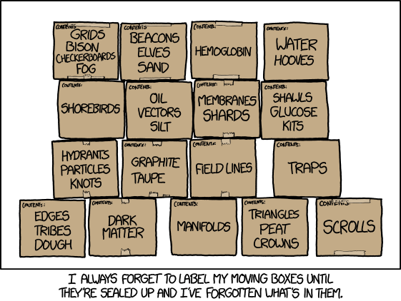
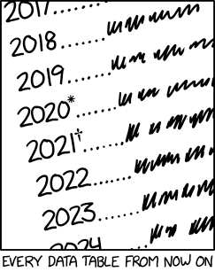

---
notion:
  title_line: "# 06) Data Wrangling: Join, Combine, and Reshape"
  role: lecture
  status: mapped
  page_id: "293d9fdd-1a1a-801c-bef2-e6140976408c"
  url: "https://app.notion.com/p/293d9fdd1a1a801cbef2e6140976408c"
---

# 06) Data Wrangling: Join, Combine, and Reshape

See [BONUS.md](BONUS.md) for the optional extensions.

**Live notebooks in Colab:** [Demo 1](https://colab.research.google.com/github/christopherseaman/datasci_217/blob/main/06/demo/demo1_merge_operations.ipynb) · [Demo 2](https://colab.research.google.com/github/christopherseaman/datasci_217/blob/main/06/demo/demo2_pivot_melt.ipynb) · [Demo 3](https://colab.research.google.com/github/christopherseaman/datasci_217/blob/main/06/demo/demo3_concat_timeseries.ipynb)

**Run locally:**

```shell
curl -fsSL https://raw.githubusercontent.com/christopherseaman/datasci_217/main/06/demo/setup_demo.sh | sh
cd ~/06-demo
uv venv --seed
source .venv/bin/activate
uv sync
```

→ Then open the `06-demo` folder in VS Code.

_“Wrangle” comes from the Low German “wrangeln,” to dispute or wrestle, which is about how getting data to cooperate feels._

This lecture covers McKinney, _Python for Data Analysis_ (3rd ed.):

- 8.1 (hierarchical indexing, and indexing with a DataFrame's columns)
- 8.2 (database-style DataFrame joins, concatenating along an axis, and combining data with overlap)
- 8.3 (pivoting "long" to "wide" format and "wide" to "long" format)

# Database-Style DataFrame Joins

- **Join** (a **merge** in pandas): puts related rows from two tables side by side by matching a key.
- **Key**: a column, such as `patient_id`, whose values name the same thing in both tables.
- Health data rarely arrives in one table: asking whether older patients have higher A1c means joining patients to lab results first.

## Keys and Cardinality

- A table's **grain** is what one row represents (Lecture 05's row meaning): one patient, or one lab test.
- A **primary key** uniquely identifies each row of its own table: `patient_id` in `patients`.
- A **candidate key** is any column, or combination of columns, that could serve as the primary key; Lecture 05 called it a candidate identifier.
- A **foreign key** refers to another table's primary key: `patient_id` in `labs`, where one patient can appear many times.
- **Cardinality** says how many rows can match on each side, such as one patient to many lab results (**one-to-many**).

```
patients                    labs (A1c in %, LDL in mg/dL)
┌────────────┬────────────┐ ┌────────────┬──────┬───────┐
│ patient_id │ birth_year │ │ patient_id │ test │ value │
├────────────┼────────────┤ ├────────────┼──────┼───────┤
│ P001       │ 1958       │ │ P001       │ A1c  │   6.8 │
│ P002       │ 1971       │ │ P001       │ LDL  │ 131.0 │
│ P003       │ 1985       │ │ P002       │ A1c  │   5.4 │
└────────────┴────────────┘ │ P004       │ A1c  │   7.9 │
                            └────────────┴──────┴───────┘
```

_Join keys are the table's name tags: if two rows share a tag, pandas brings their columns together. A good key makes matching boring; a bad key turns the merge into an enthusiastic photocopier._


## The Basics of pd.merge()

`pd.merge(left, right, on='key')` pairs each row of `left` with every row of `right` that has the same key value, and returns a new DataFrame.

### Reference Card: `merge()` keys and options

| Argument | Purpose | Typical output |
| --- | --- | --- |
| `left`, `right` | Input tables; `left.merge(right, on=...)` is the same call written as a DataFrame method | Combined `DataFrame` |
| `on='key'` or `on=['k1', 'k2']` | Shared key column, or several that must all match; without `on=`, every shared column name becomes part of the key | Key-based matches |
| `left_on`, `right_on` | Different key names | Matches equivalent fields |
| `how` | `inner` (the default), `left`, `right`, `outer`, or `cross` | Controls retained rows |
| `validate` / `indicator` | Check cardinality / match status | `MergeError` or `_merge` audit column |
| `suffixes` | Rename overlapping non-key columns | Unambiguous columns |

### Code Snippet: Merge on a key

```python
merged = pd.merge(patients, labs, on='patient_id')
display(merged)
```

|  | patient_id | birth_year | test | value |
| --- | --- | --- | --- | --- |
| 0 | P001 | 1958 | A1c | 6.8 |
| 1 | P001 | 1958 | LDL | 131.0 |
| 2 | P002 | 1971 | A1c | 5.4 |

## Join Types: The Four Horsemen of Data Merging (Plus One)

When a key appears in only one table, the join type decides whether that row survives. The fifth rider, `cross`, ignores keys and pairs every left row with every right row.

Every row either table can contribute, and the join types (`how=`) that keep it:

| patient_id | birth_year | test | value | Why | `inner` | `left` | `right` | `outer` |
| --- | --- | --- | --- | --- | --- | --- | --- | --- |
| P001 | 1958 | A1c | 6.8 | Key in both tables | ✓ | ✓ | ✓ | ✓ |
| P001 | 1958 | LDL | 131.0 | Key in both tables | ✓ | ✓ | ✓ | ✓ |
| P002 | 1971 | A1c | 5.4 | Key in both tables | ✓ | ✓ | ✓ | ✓ |
| P003 | 1985 | NaN | NaN | Patient with no labs yet |  | ✓ |  | ✓ |
| P004 | NaN | A1c | 7.9 | Lab with no patient record |  |  | ✓ | ✓ |

### Reference Card: Join types

| `how` | Retains | Unmatched side |
| --- | --- | --- |
| `inner` | Matching keys only | Dropped |
| `left` | Every left row | Right fields become `NaN` |
| `right` | Every right row | Left fields become `NaN` |
| `outer` | Every row from both | Missing fields become `NaN` |
| `cross` | Every left row paired with every right row; takes no `on=` | Nothing to match; `len(left) × len(right)` rows |

Add `indicator=True` to any merge to get a `_merge` column that says where each row came from: `both`, `left_only`, or `right_only`.

### Code Snippet: Compare join types

```python
inner = pd.merge(patients, labs, on='patient_id', how='inner')
print(len(inner))    # 3: P001 twice, P002 once

right = pd.merge(patients, labs, on='patient_id', how='right')
print(len(right))    # 4: includes P004's A1c with birth_year NaN

left = pd.merge(patients, labs, on='patient_id', how='left')
display(left)

outer = pd.merge(patients, labs, on='patient_id', how='outer', indicator=True)
display(outer)
```

|  | patient_id | birth_year | test | value |
| --- | --- | --- | --- | --- |
| 0 | P001 | 1958 | A1c | 6.8 |
| 1 | P001 | 1958 | LDL | 131.0 |
| 2 | P002 | 1971 | A1c | 5.4 |
| 3 | P003 | 1985 | NaN | NaN |

|  | patient_id | birth_year | test | value | _merge |
| --- | --- | --- | --- | --- | --- |
| 0 | P001 | 1958.0 | A1c | 6.8 | both |
| 1 | P001 | 1958.0 | LDL | 131.0 | both |
| 2 | P002 | 1971.0 | A1c | 5.4 | both |
| 3 | P003 | 1985.0 | NaN | NaN | left_only |
| 4 | P004 | NaN | A1c | 7.9 | right_only |

`birth_year` prints as `1958.0` in the outer join because P004's missing birth year makes the whole column `float64` (Lecture 05).

<callout icon="⚠️" color="yellow_bg">
	## `merge()` is an inner join unless you say otherwise!
	Unmatched rows vanish without a warning, as P003 does above. Use `how='left'` when the left table is your master list, and compare row counts before and after.
</callout>

_“The data clearly shows that our hypothesis is correct, assuming we ignore all the data that doesn’t support our hypothesis.”_

## Merging on Multiple Columns

- **Composite key**: several columns that together name a row, such as `patient_id` and `visit` (Lecture 05's `patient_id` + `visit_date`).
- Pass a list, `on=['patient_id', 'visit']`; every listed column must match.

```text
vitals (sbp in mmHg)            a1c (a1c in %)
patient_id  visit     sbp       patient_id  visit     a1c
P001        baseline  152       P001        baseline  7.4
P001        followup  138       P001        followup  6.9
P002        baseline  128       P002        baseline  5.6
P002        followup  124       P002        followup  5.5
```

### Code Snippet: Merge on multiple columns

```python
wrong = pd.merge(vitals, a1c, on='patient_id')
print(len(wrong))            # 8: each visit's SBP now sits next to both of that patient's A1c values
print(list(wrong.columns))   # ['patient_id', 'visit_x', 'sbp', 'visit_y', 'a1c']

merged = pd.merge(vitals, a1c, on=['patient_id', 'visit'])
display(merged)
```

|  | patient_id | visit | sbp | a1c |
| --- | --- | --- | --- | --- |
| 0 | P001 | baseline | 152 | 7.4 |
| 1 | P001 | followup | 138 | 6.9 |
| 2 | P002 | baseline | 128 | 5.6 |
| 3 | P002 | followup | 124 | 5.5 |

## Listing Every Combination with a Cross Join

- A report that never arrived leaves no row, so no keyed join can flag it.
- Build the **expected grid** of every combination, such as every clinic at every hour, with `how='cross'`, then left-merge the observed reports onto it: each missing report shows up as `left_only`.

### Code Snippet: Find missing reports with a cross join

`clinic_list` has North and South; `hours` has 8, 9, and 10.

```python
expected = pd.merge(clinic_list, hours, how='cross')
print(len(expected))   # 6: 2 clinics × 3 hours

reports = pd.DataFrame({'clinic': ['North', 'North', 'South', 'South'],
                        'hour': [8, 10, 8, 9], 'arrivals': [3, 0, 5, 2]})
coverage = pd.merge(expected, reports, on=['clinic', 'hour'], how='left', indicator=True)
display(coverage)
```

|  | clinic | hour | arrivals | _merge |
| --- | --- | --- | --- | --- |
| 0 | North | 8 | 3.0 | both |
| 1 | North | 9 | NaN | left_only |
| 2 | North | 10 | 0.0 | both |
| 3 | South | 8 | 5.0 | both |
| 4 | South | 9 | 2.0 | both |
| 5 | South | 10 | NaN | left_only |

North's 9:00 `NaN` means no report arrived; its 10:00 `0.0` is a real report of zero arrivals.

## Handling Overlapping Column Names

When both tables have a non-key column with the same name, `merge()` keeps both and adds suffixes, as `visit_x` and `visit_y` show above.

### Reference Card: Overlapping columns

| Item | Purpose / arguments | Output / note |
| --- | --- | --- |
| Default suffixes (`_x`, `_y`) | Distinguish overlapping columns | `a1c_x` from the left table, `a1c_y` from the right |
| `suffixes=('_lab', '_poc')` | Say what each column means | Named output columns |

### Code Snippet: Name overlapping columns

```python
lab = pd.DataFrame({'patient_id': ['P001', 'P002'], 'a1c': [7.4, 5.6]})   # central lab
poc = pd.DataFrame({'patient_id': ['P001', 'P002'], 'a1c': [7.1, 5.9]})   # point-of-care device

display(pd.merge(lab, poc, on='patient_id'))
display(pd.merge(lab, poc, on='patient_id', suffixes=('_lab', '_poc')))
```

|  | patient_id | a1c_x | a1c_y |
| --- | --- | --- | --- |
| 0 | P001 | 7.4 | 7.1 |
| 1 | P002 | 5.6 | 5.9 |

|  | patient_id | a1c_lab | a1c_poc |
| --- | --- | --- | --- |
| 0 | P001 | 7.4 | 7.1 |
| 1 | P002 | 5.6 | 5.9 |


## Checking Merge Cardinality

<callout icon="⚠️" color="yellow_bg">
	## A repeated key copies rows without an error!
	Every row that matches a repeated lookup key is copied once per repeat. Row growth alone proves nothing, because a one-to-many merge adds rows too, so state the expected relationship with `validate=`.
</callout>

### Reference Card: Merge cardinality and audit

| Contract | Meaning | Check |
| --- | --- | --- |
| One-to-one | Unique keys on both sides | `validate='one_to_one'` |
| One-to-many | Unique left keys; repeated right keys allowed | `validate='one_to_many'` |
| Many-to-one | Repeated left keys; unique right keys | `validate='many_to_one'` |
| Many-to-many | Repeated keys on both sides | `validate='many_to_many'` documents, not constrains |
| Broken contract | A side you declared unique has repeats | Raises `pd.errors.MergeError`; catch it with `try`/`except` (Lecture 02) |
| Find the repeats | Every row whose key appears more than once | `df[df.duplicated(subset=['key'], keep=False)]` (Lecture 05); list every key column, such as `subset=['k1', 'k2']`, for a composite key |
| Missing keys | Blank keys match each other: two blank-keyed rows on each side make four false matches | `df['key'].notna().all()` on both tables before merging |
| Match audit | Show `left_only`, `right_only`, `both` | `indicator=True` |

### Code Snippet: Catch a Broken Merge Contract

Each visit should get exactly one clinic, but the lookup lists K2 twice:

```text
visits                   clinics
visit_id  clinic_id      clinic_id  clinic_name      record_status
V1        K1             K1         Mission Bay      current
V2        K2             K2         Parnassus        retired
V3        K2             K2         Parnassus Annex  current
V4        K9
```

```python
pd.merge(visits, clinics, on='clinic_id', how='left', validate='many_to_one')
```

- Expected error: `MergeError: Merge keys are not unique in right dataset; not a many-to-one merge`.
- Without `validate=`, four visits become six rows: V2 and V3 each match twice.
- Fix: list the repeated keys, apply a documented lookup rule (here, keep `record_status == 'current'`), and merge again with `validate=` and `indicator=True`: four rows, with V4's K9 `left_only`.

# LIVE DEMO!

[Open Demo 1 in Colab](https://colab.research.google.com/github/christopherseaman/datasci_217/blob/main/06/demo/demo1_merge_operations.ipynb)

# Working with DataFrame Indexes

- **Index**: a DataFrame's row labels, printed down its left side.
- **RangeIndex**: the default `0, 1, 2, …` of a table built from a dict or read from a CSV; it only counts rows.
- Moving an identifier such as `patient_id` into the index lets `.loc['P002']` find a patient by label (Lecture 04) and lets pandas line up rows from two tables by label.

## Row Labels Before and After

```
patients as built from a dict: the RangeIndex down the left edge only counts rows

  patient_id  age clinic
0       P001   67  North
1       P002   54  South
2       P003   41  North

patients.set_index('patient_id'): the IDs are the row labels, so .loc['P002'] finds that patient

            age clinic
patient_id
P001         67  North
P002         54  South
P003         41  North
```



## set_index(): Moving Columns to Index

### Reference Card: `set_index()`

| Item | Purpose / arguments | Output / note |
| --- | --- | --- |
| `df.set_index('column')` | Make column the new index | A new DataFrame; `df` is unchanged, so assign the result |
| `drop=False` | Keep the column in the DataFrame (default is True, removes it) | DataFrame retains the source column |
| `df.index.is_unique` | Test that all row labels are unique; an index can repeat a label | `True` when no labels repeat; otherwise `False` |
| `s1 - s2`, `s1 + s2`, … | Arithmetic between two labeled Series matches values by label, not by position | A label found on only one side gives `NaN` |

### Code Snippet: Set an identifier index

```python
indexed = patients.set_index('patient_id')
print(indexed.index.is_unique)   # True: each patient appears once
display(indexed.loc['P002'])     # one patient's record, found by label
```

|  | P002 |
| --- | --- |
| age | 54 |
| clinic | South |

## reset_index(): Moving Index to Columns

`reset_index()` moves the index labels back into an ordinary column; `drop=True` discards them instead, which suits labels that carry no information, such as the gaps a filter leaves in a RangeIndex.

### Reference Card: `reset_index()`

| Item | Purpose / arguments | Output / note |
| --- | --- | --- |
| `df.reset_index()` | Move index labels into columns | New `DataFrame` with a default `RangeIndex` |
| `df.reset_index(drop=True)` | Discard old labels instead of saving them as columns | New `DataFrame` with a default `RangeIndex` |

### Code Snippet: Restore an identifier column

```python
display(indexed.reset_index())
display(indexed.reset_index(drop=True))
```

|  | patient_id | age | clinic |
| --- | --- | --- | --- |
| 0 | P001 | 67 | North |
| 1 | P002 | 54 | South |
| 2 | P003 | 41 | North |

|  | age | clinic |
| --- | --- | --- |
| 0 | 67 | North |
| 1 | 54 | South |
| 2 | 41 | North |

## Two-Level Row Labels

- **MultiIndex** (hierarchical index): row labels with more than one level, such as a `(clinic, quarter)` pair.
- Build one by passing `set_index()` a list of columns when one column cannot name a row, such as a quarterly visit count identified by clinic _and_ quarter.

### Reference Card: Two-level row labels

| Item | Purpose / arguments | Output / note |
| --- | --- | --- |
| `df.set_index(['col1', 'col2'])` | Build two-level row labels from two columns | DataFrame with a `MultiIndex` |
| `df.loc[('key1', 'key2'), :]` | Select a row by both parts of its label; `df.loc['key1']` selects every row under one outer label | Selected row or rows |
| `df.reset_index()` | Turn both levels back into columns | New `DataFrame` with a default `RangeIndex` |

### Code Snippet: Select a two-part row label

`quarterly` has one `visits` count per clinic (North, South) and quarter (Q1, Q2):

```python
summary = quarterly.set_index(['clinic', 'quarter']).sort_index()
print(summary.loc[('South', 'Q2'), 'visits'])  # 362
display(summary.loc['South'])
```

| quarter | visits |
| --- | --- |
| Q1 | 380 |
| Q2 | 362 |

# Reshaping: Wide vs Long Format

- **Reshaping**: changing what one row represents without adding or removing any values.
- **Wide**: measurements of one kind spread across columns, such as a systolic blood pressure (SBP) column per visit.
- **Long**: one row per patient-visit, the layout grouping and plotting tools usually want.

```
wide: a column per visit                  long: a row per patient-visit
┌────────────┬──────────┬──────────┐      ┌────────────┬──────────┬─────┐
│ patient_id │ baseline │ followup │      │ patient_id │ visit    │ sbp │
├────────────┼──────────┼──────────┤      ├────────────┼──────────┼─────┤
│ P001       │   152    │   138    │      │ P001       │ baseline │ 152 │
│ P002       │   138    │   132    │      │ P002       │ baseline │ 138 │
│ P003       │   145    │   129    │      │ P003       │ baseline │ 145 │
└────────────┴──────────┴──────────┘      │ P001       │ followup │ 138 │
                                          │ P002       │ followup │ 132 │
                                          │ P003       │ followup │ 129 │
                                          └────────────┴──────────┴─────┘
```

- In long data, the **identifier columns** (`patient_id`, `visit`) say which observation a row is, and the **value column** (`sbp`) holds the measurement.
- Long data with one observation per row and one variable per column is often called **tidy** data.

| Shape | One row represents | Best for | Conversion |
| --- | --- | --- | --- |
| Wide | One entity with several measured columns | Side-by-side comparison | `melt()` to long |
| Long | One entity/variable observation | Grouping and tidy plotting | `pivot()` to wide |

## Melting Wide to Long with melt()

`melt()`, written `pd.melt(df, ...)` or `df.melt(...)`, keeps the identifier columns fixed and turns each selected column into rows: the old column name goes into a variable column and its cell into a value column. Questionnaire answers stored in `Q1`, `Q2`, and `Q3` columns melt the same way, with the question name as the variable.

### Reference Card: `melt()`

| Argument | Purpose | Output |
| --- | --- | --- |
| `id_vars` | Columns to keep fixed | Identifier columns repeated |
| `value_vars` | Columns to unpivot | One row per source row and selected value column |
| `var_name` | Name for former column labels | Variable column |
| `value_name` | Name for former cell values | Value column |

### Code Snippet: Melt wide data

```python
long = pd.melt(wide, id_vars=['patient_id'], value_vars=['baseline', 'followup'],
               var_name='visit', value_name='sbp')
display(long)
```

|  | patient_id | visit | sbp |
| --- | --- | --- | --- |
| 0 | P001 | baseline | 152 |
| 1 | P002 | baseline | 138 |
| 2 | P003 | baseline | 145 |
| 3 | P001 | followup | 138 |
| 4 | P002 | followup | 132 |
| 5 | P003 | followup | 129 |

## Pivoting Long Back to Wide with pivot()

- `pivot()` runs `melt()` backwards, for a reader or a matrix-shaped tool that needs one column per visit.
- It files each value by its labels, so the long rows may come in any order.
- It never aggregates, so each `index`/`columns` pair must identify exactly one value.

### Reference Card: `pivot()`

| Argument | Purpose | Constraint / output |
| --- | --- | --- |
| `index` | Column becoming row labels | One row per index value; a list such as `['id1', 'id2']` gives two-level row labels |
| `columns` | Column becoming headers | One column per value |
| `values` | Column filling cells | Duplicate index/column pairs raise an error |
| `.reset_index()` afterward | Turn the row labels back into an ordinary column | Leaves the `columns` name as a header label |
| `result.columns.name = None` | Drop that leftover header label | Plain column headers, as in the original wide table |

### Code Snippet: Pivot long data back to wide

```python
back = long.pivot(index='patient_id', columns='visit', values='sbp')
display(back)

back = back.reset_index()
back.columns.name = None   # drop the leftover 'visit' header label
display(back)
print(back.equals(wide))   # True: the round trip rebuilt the wide table exactly
```

| visit | baseline | followup |
| --- | --- | --- |
| **patient_id** |  |  |
| P001 | 152 | 138 |
| P002 | 138 | 132 |
| P003 | 145 | 129 |

|  | patient_id | baseline | followup |
| --- | --- | --- | --- |
| 0 | P001 | 152 | 138 |
| 1 | P002 | 138 | 132 |
| 2 | P003 | 145 | 129 |


## When pivot() Finds a Repeated Pair

If an `index`/`columns` pair identifies more than one value, `pivot()` cannot choose a cell value and stops with `ValueError: Index contains duplicate entries, cannot reshape`. List the repeated pairs with `duplicated(subset=[...], keep=False)` (Lecture 05), then decide whether they are data errors or real repeated observations.

### Code Snippet: Find the Pair that Stops a Pivot

`rechecked` holds one baseline reading per patient and two follow-up readings for P002, so `rechecked.pivot(index='patient_id', columns='visit', values='sbp')` raises the repeated-pair error:

```python
display(rechecked[rechecked.duplicated(subset=['patient_id', 'visit'], keep=False)])
```

|  | patient_id | visit | sbp |
| --- | --- | --- | --- |
| 3 | P002 | followup | 148 |
| 4 | P002 | followup | 136 |

- A recheck is a real repeated observation, so the fix is a documented rule, not a guess: to keep the later recheck, `sort_values('reading_time')`, then `drop_duplicates(subset=['patient_id', 'visit'], keep='last')`.
- If both readings should count, `pivot_table()` aggregates them into one cell instead, and the choice of `sum`, `mean`, or another function changes the question being answered.

# LIVE DEMO!

[Open Demo 2 in Colab](https://colab.research.google.com/github/christopherseaman/datasci_217/blob/main/06/demo/demo2_pivot_melt.ipynb)

# Concatenating DataFrames Along an Axis

- **Concatenation**: gluing together tables that are pieces of one table, such as monthly admission extracts with the same columns.
- **Axis**: `axis=0` stacks rows; `axis=1` puts columns side by side (Lecture 03).
- It matches no key values the way `merge()` does: stacking lines columns up by name, and placing side by side lines rows up by index label.

```
VERTICAL CONCATENATION (axis=0)     HORIZONTAL CONCATENATION (axis=1)
DataFrame A:                       DataFrame A:    DataFrame B:
┌─────────┐                        ┌─────────┐    ┌─────────┐
│ A │ B   │                        │ A │ B   │    │ C │ D   │
├─────────┤                        ├─────────┤    ├─────────┤
│ 1 │ 2   │                        │ 1 │ 2   │    │ 5 │ 6   │
│ 3 │ 4   │                        │ 3 │ 4   │    │ 7 │ 8   │
└─────────┘                        └─────────┘    └─────────┘
         +
DataFrame B:                               =
┌─────────┐                        ┌─────────────────┐
│ A │ B   │                        │ A │ B │ C │ D   │
├─────────┤                        ├─────────────────┤
│ 5 │ 6   │                        │ 1 │ 2 │ 5 │ 6   │
│ 7 │ 8   │                        │ 3 │ 4 │ 7 │ 8   │
└─────────┘                        └─────────────────┘
         =
┌─────────┐
│ A │ B   │
├─────────┤
│ 1 │ 2   │
│ 3 │ 4   │  ← Stacked vertically
│ 5 │ 6   │
│ 7 │ 8   │
└─────────┘
```

## Vertical Concatenation: Adding More Rows

### Reference Card: Vertical `concat()`

| Call | Purpose | Result |
| --- | --- | --- |
| `pd.concat([df1, df2])` | Stack rows (`axis=0`) | Appended rows; indexes may repeat |
| `ignore_index=True` | Replace source indexes | Fresh `RangeIndex` |
| `piece['source_file'] = 'jan.csv'` on each table before stacking | Record where each row came from, its provenance (Lecture 05) | An ordinary label column that survives the stack |
| `keys=['jan', 'feb']`, `names=['source', 'row']` | Label each piece with an outer index level instead of a column | Two-level row index; `reset_index()` turns the labels into columns |

### Code Snippet: Stack rows

`jan` holds three January admissions and `feb` two February ones, with the same columns (`los_days` is the length of stay):

```python
jan['source_file'] = 'jan_admissions.csv'
feb['source_file'] = 'feb_admissions.csv'
combined = pd.concat([jan, feb])
display(combined)

combined = pd.concat([jan, feb], ignore_index=True)
print(list(combined.index))   # [0, 1, 2, 3, 4]: a clean sequential index
```

|  | admission_id | unit | los_days | source_file |
| --- | --- | --- | --- | --- |
| 0 | A101 | ICU | 4 | jan_admissions.csv |
| 1 | A102 | Med | 2 | jan_admissions.csv |
| 2 | A103 | Surg | 3 | jan_admissions.csv |
| 0 | A201 | Med | 5 | feb_admissions.csv |
| 1 | A202 | ICU | 1 | feb_admissions.csv |



## Horizontal Concatenation: Adding More Columns

### Reference Card: Horizontal `concat()`

| Call / rule | Purpose | Result |
| --- | --- | --- |
| `pd.concat([df1, df2], axis=1)` | Add columns | Index labels align rows |
| Shared index labels | Define row identity | Matching labels share a row |
| Missing labels | Preserve unmatched rows | `NaN` in absent fields |

### Code Snippet: Align columns by index

```python
a1c = pd.DataFrame({'patient_id': ['P001', 'P002', 'P003'],
                    'a1c': [7.4, 5.6, 6.1]}).set_index('patient_id')
vitals = pd.DataFrame({'patient_id': ['P002', 'P003', 'P004'], 'sbp': [128, 141, 119],
                       'weight_kg': [81.5, 67.0, 90.2]}).set_index('patient_id')

combined = pd.concat([a1c, vitals], axis=1)
display(combined)
```

| patient_id | a1c | sbp | weight_kg |
| --- | --- | --- | --- |
| P001 | 7.4 | NaN | NaN |
| P002 | 5.6 | 128.0 | 81.5 |
| P003 | 6.1 | 141.0 | 67.0 |
| P004 | NaN | 119.0 | 90.2 |

<callout icon="⚠️" color="yellow_bg">
	## `axis=1` lines rows up by label, not by position!
	Two tables loaded separately both number their rows `0, 1, 2, …`, so `axis=1` pairs their unrelated first rows. `set_index()` the real identifier first, or `merge()` on the key column instead.
</callout>

## Column-Set Alignment with the join Parameter

The `join=` argument of `concat()` is not a merge: it only chooses which columns to keep, or with `axis=1`, which row labels.

### Reference Card: `concat(join=...)`

| Item | Purpose / arguments | Output / note |
| --- | --- | --- |
| `join='outer'` (default) | Keep all columns from both frames | Union of columns |
| `join='inner'` | Keep only columns shared by all inputs | Stacked `DataFrame` with the column intersection |
| `axis=1, join='inner'` | Keep only row labels found in every input | Side-by-side `DataFrame` without unmatched rows |

### Code Snippet: Choose a column set

```python
jan = pd.DataFrame({'admission_id': ['A101', 'A102'], 'age': [67, 45], 'los_days': [4, 2]})
feb = pd.DataFrame({'admission_id': ['A201', 'A202'], 'los_days': [5, 1],
                    'payer': ['Medicare', 'Private']})   # February dropped age and added payer

display(pd.concat([jan, feb], join='outer', ignore_index=True))
display(pd.concat([jan, feb], join='inner', ignore_index=True))
```

|  | admission_id | age | los_days | payer |
| --- | --- | --- | --- | --- |
| 0 | A101 | 67.0 | 4 | NaN |
| 1 | A102 | 45.0 | 2 | NaN |
| 2 | A201 | NaN | 5 | Medicare |
| 3 | A202 | NaN | 1 | Private |

|  | admission_id | los_days |
| --- | --- | --- |
| 0 | A101 | 4 |
| 1 | A102 | 2 |
| 2 | A201 | 5 |
| 3 | A202 | 1 |

## Patching Gaps with combine_first()

`primary.combine_first(fallback)` patches the gaps in a trusted source from a lower-priority one that holds the same variables, such as a primary weight record and an intake form.

### Reference Card: `combine_first()`

| Item | Purpose / arguments | Output / note |
| --- | --- | --- |
| `df1.combine_first(df2)` | Fill gaps using the same row and column labels in df2 | New `DataFrame`; non-null df1 values win |
| Row and column coverage | Keep the union of both sets of labels | Rows or columns found only in df2 are included |
| Not a stack | Patches values of the same observations from a second source | To add another period's observations, use `concat()` |
| Matching labels | `P002` and `weight_kg` must mean the same patient and unit in both sources | Check before combining; pandas matches names, not meaning |

### Code Snippet: Patch from a fallback source

```python
primary = pd.DataFrame({'patient_id': ['P001', 'P002', 'P003'],
                        'weight_kg': [81.5, None, 67.0]}).set_index('patient_id')
intake = pd.DataFrame({'patient_id': ['P002', 'P003', 'P004'],
                       'weight_kg': [74.8, 66.1, 90.2]}).set_index('patient_id')

complete = primary.combine_first(intake)
display(complete)
```

| patient_id | weight_kg |
| --- | --- |
| P001 | 81.5 |
| P002 | 74.8 |
| P003 | 67.0 |
| P004 | 90.2 |

P002 is filled from the intake form, P003 keeps the primary 67.0 over the intake's 66.1, and P004 comes only from the intake form.

# LIVE DEMO!

[Open Demo 3 in Colab](https://colab.research.google.com/github/christopherseaman/datasci_217/blob/main/06/demo/demo3_concat_timeseries.ipynb)
