Data Visualization: From Exploration to Communication

See [BONUS.md](BONUS.md) for advanced topics:

- Advanced matplotlib customization and publication-quality plots
- Interactive visualization with Bokeh and Plotly
- Statistical visualization with seaborn advanced features
- Custom color palettes and themes
- Animation and dynamic plots

*Fun fact: The word "visualization" comes from the Latin "visus" meaning "sight." In data science, we're literally making data visible - turning numbers into stories that our eyes can understand and our brains can process.*

# Outline

- matplotlib fundamentals (figures, subplots, customization)
- Statistical visualizations with seaborn
- pandas plotting for quick data exploration
- Visualization principles and best practices
- Tufte's principles for effective data visualization
- Modern visualization libraries (altair, plotnine)


*"The data clearly shows that our hypothesis is correct, assuming we ignore all the data that doesn't support our hypothesis."*

# Edward Tufte's Principles of Data Visualization

*Good visualization is like good writing - it should be clear, honest, and serve the reader (or viewer) first.*

**"Above all else, show the data."** - Edward Tufte

Edward Tufte, the pioneer of information design, established fundamental principles that remain essential for effective data visualization.

**Essential Reading:**

- [The Visual Display of Quantitative Information](https://www.edwardtufte.com/tufte/books_vdqi) - Tufte's seminal work
- [Envisioning Information](https://www.edwardtufte.com/tufte/books_ei) - Color, layering, and detail
- [Tufte's website](https://www.edwardtufte.com/) - Essays and resources

**1. Data-Ink Ratio: Maximize the Data-Ink**

The **data-ink ratio** is the proportion of ink (or pixels) used to present actual data compared to the total ink used in the entire display.

```
Data-Ink Ratio = Data-Ink / Total Ink Used
```

**Tufte's Goal:** Maximize this ratio by eliminating non-data ink (chartjunk).

**Key Practices:**
- Remove unnecessary gridlines (or make them subtle)
- Eliminate decorative elements that don't convey information
- Use direct labeling instead of legends when possible
- Avoid 3D effects and shadows that distort perception
- Remove redundant labels and tick marks

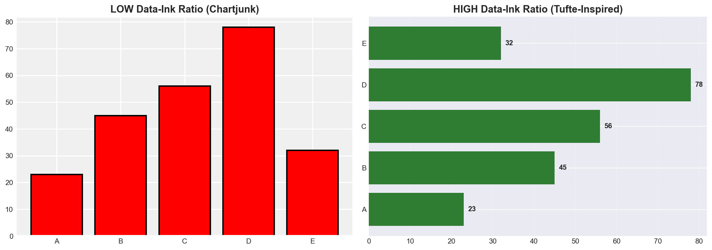

*Left: Low data-ink ratio with excessive decoration. Right: High data-ink ratio focusing on the data.*

**2. Chartjunk: Eliminate Visual Noise**

**Chartjunk** includes any visual elements that do not convey information:
- Unnecessary 3D effects
- Heavy grid lines
- Decorative fills and patterns
- Excessive colors
- Redundant labels

**3. Lie Factor: Maintain Visual Integrity**

The **lie factor** measures how much a visualization distorts the data:

```
Lie Factor = (Size of effect shown in graphic) / (Size of effect in data)
```

**Ideal Lie Factor:** Close to 1.0 (no distortion)

**Common distortions to avoid:**
- Truncated y-axes that exaggerate differences
- 3D perspective that distorts area/volume comparisons
- Inconsistent scales
- Cherry-picked time ranges

**4. Small Multiples: Show Comparisons**

Use small, repeated charts with the same scale to enable easy comparison across categories or time.

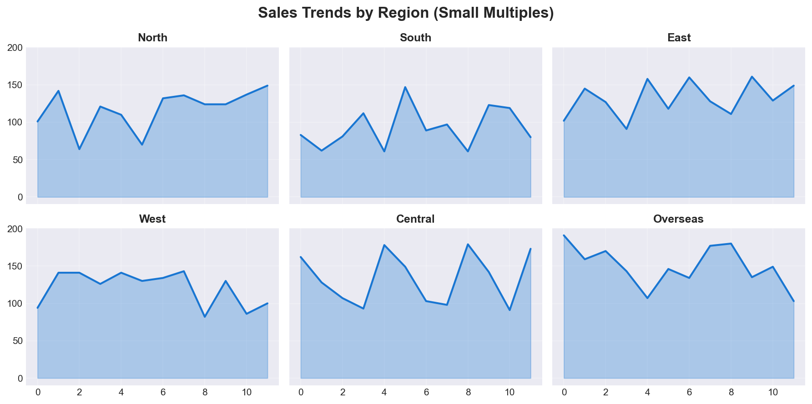

*Small multiples enable quick visual comparison across multiple dimensions while maintaining consistent scales.*

**5. High-Resolution Data Graphics**

Show as much detail as the data allows - don't oversimplify or aggregate unnecessarily.

## Before/After Examples: Applying Tufte's Principles

### Example 1: Bar Chart Redesign

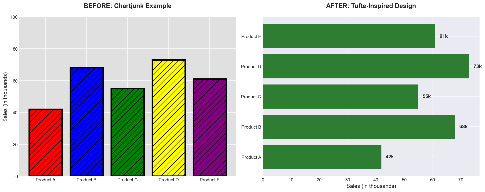

*Before (left): Excessive colors, patterns, and heavy gridlines distract from the data. After (right): Clean design with direct labeling maximizes data-ink ratio.*

### Example 2: Line Chart with Truncated Axis (Lie Factor)

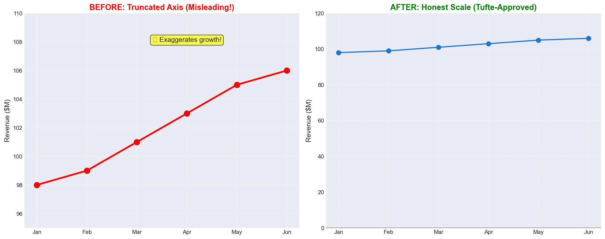

*Before (left): Truncated y-axis creates a high lie factor, exaggerating modest growth. After (right): Honest scale starting at zero shows true magnitude of change.*

## Color Palette Best Practices

Different data types require different color strategies:

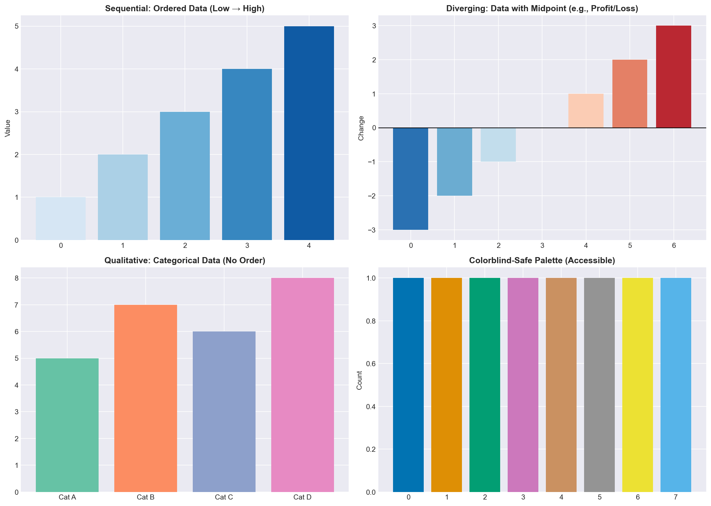

**Color Selection Guidelines:**
- **Sequential:** Use for ordered data (temperature, age, income) - single hue gradient
- **Diverging:** Use for data with meaningful zero/midpoint (profit/loss, correlation) - two contrasting hues
- **Qualitative:** Use for categories with no inherent order - distinct, unrelated colors
- **Accessibility:** Always test for colorblind accessibility using tools like [ColorBrewer](https://colorbrewer2.org/)

**Additional Resources:**
- [ColorBrewer 2.0](https://colorbrewer2.org/) - Interactive color advice for maps and visualizations
- [Colorblind-Safe Palettes](https://personal.sron.nl/~pault/) - Paul Tol's color schemes
- [Adobe Color](https://color.adobe.com/) - Create and explore color schemes

## The Right Chart for the Job

**Chart Selection Guide:**

- **Line charts**: Time series, trends over time
- **Bar charts**: Categories, comparisons
- **Scatter plots**: Relationships between two variables
- **Histograms**: Distribution of single variable
- **Box plots**: Distribution with outliers
- **Heatmaps**: Patterns in 2D data
- **Pie charts**: Parts of a whole (use sparingly!)

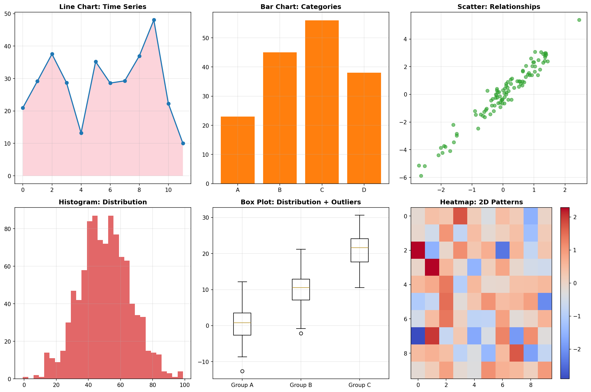

*Different chart types are optimized for different data relationships and questions. Choose the right chart for your message.*


# The Visualization Ecosystem

*Reality check: There are more Python visualization libraries than there are ways to mess up a bar chart. But don't worry - we'll focus on the essential tools that actually matter for daily data science work.*

Python's visualization landscape has evolved dramatically. While matplotlib remains the foundation, modern tools like seaborn, altair, and plotnine offer more intuitive interfaces for common tasks.

**Visual Guide - Python Visualization Stack:**

```
FOUNDATION LAYER
┌─────────────────────────────────────┐
│           matplotlib                │  ← Low-level, highly customizable
│     (The foundation of everything)   │
└─────────────────────────────────────┘
                    ↑
                    │
            PANDAS LAYER
┌─────────────────────────────────────┐
│         pandas.plot()              │  ← Quick exploration, built on matplotlib
│     (DataFrame/Series plotting)     │
└─────────────────────────────────────┘
                    ↑
                    │
            STATISTICAL LAYER
┌─────────────────────────────────────┐
│           seaborn                   │  ← Statistical plots, beautiful defaults
│     (Built on matplotlib)           │
└─────────────────────────────────────┘
                    ↑
                    │
            MODERN LAYER
┌─────────────────────────────────────┐
│    altair (vega-lite)               │  ← Grammar of graphics, interactive
│    plotnine (ggplot2)               │  ← R's ggplot2 in Python
└─────────────────────────────────────┘
```

## Choosing the Right Tool

**When to use what:**

- **pandas.plot()** - Quick exploration, basic charts
- **matplotlib** - Custom plots, publication quality, fine control
- **seaborn** - Statistical plots, beautiful defaults, relationship analysis
- **altair** - Interactive plots, grammar of graphics, web-ready
- **plotnine** - If you know ggplot2, consistent API

**Pro tip:** Start with pandas for exploration, seaborn for analysis, matplotlib for customization, and modern tools for interactive/sharing needs.

# matplotlib Fundamentals

*Think of matplotlib as the foundation of your visualization house - you can build anything on it, but you need to understand the plumbing before you can install the fancy fixtures.*

matplotlib is the bedrock of Python visualization. While it can be verbose, understanding its core concepts gives you the power to create any visualization you can imagine.

## Figures and Subplots

Every matplotlib plot lives within a `Figure` object, which can contain multiple `subplots` (individual plot areas).

**Reference:**

- `plt.figure(figsize=(width, height))` - Create a new figure
- `fig.add_subplot(rows, cols, position)` - Add subplot to figure
- `plt.subplots(rows, cols)` - Create figure with multiple subplots
- `fig.savefig('filename.png', dpi=300)` - Save figure to file
- `plt.show()` - Display the plot

**Example:**

```python
import matplotlib.pyplot as plt
import numpy as np

# Create a figure with 2x2 subplots
fig, axes = plt.subplots(2, 2, figsize=(10, 8))

# Plot on each subplot
axes[0, 0].plot([1, 2, 3, 4], [1, 4, 2, 3])
axes[0, 0].set_title('Line Plot')

axes[0, 1].hist(np.random.normal(0, 1, 1000), bins=30)
axes[0, 1].set_title('Histogram')

axes[1, 0].scatter(np.random.randn(100), np.random.randn(100))
axes[1, 0].set_title('Scatter Plot')

axes[1, 1].bar(['A', 'B', 'C'], [3, 7, 2])
axes[1, 1].set_title('Bar Chart')

plt.tight_layout()
plt.show()
```

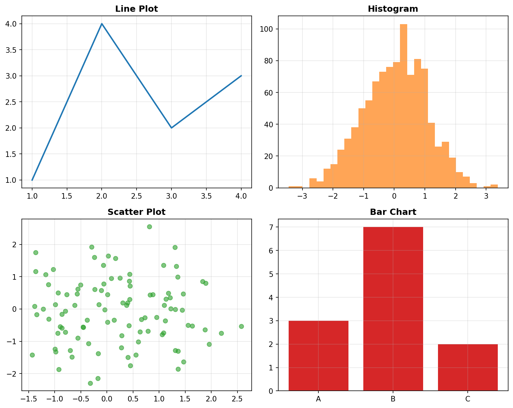

*Creating multiple subplots in a single figure allows for easy comparison across different visualization types.*

## Customizing Plots

matplotlib's power comes from its extensive customization options.

**Reference:**

- `ax.set_title('Title')` - Set plot title
- `ax.set_xlabel('X Label')` - Set x-axis label
- `ax.set_ylabel('Y Label')` - Set y-axis label
- `ax.set_xlim(min, max)` - Set x-axis limits
- `ax.set_ylim(min, max)` - Set y-axis limits
- `ax.grid(True)` - Add grid lines
- `ax.legend()` - Add legend
- `ax.set_style('seaborn')` - Change plot style

**Example:**

```python
# Create a customized plot
fig, ax = plt.subplots(figsize=(8, 6))

# Generate sample data
x = np.linspace(0, 10, 100)
y1 = np.sin(x)
y2 = np.cos(x)

# Plot with customization
ax.plot(x, y1, label='sin(x)', color='blue', linewidth=2)
ax.plot(x, y2, label='cos(x)', color='red', linewidth=2, linestyle='--')

# Customize appearance
ax.set_title('Trigonometric Functions')
ax.set_xlabel('X values')
ax.set_ylabel('Y values')
ax.grid(True, alpha=0.3)
ax.legend()

plt.tight_layout()
plt.show()
```

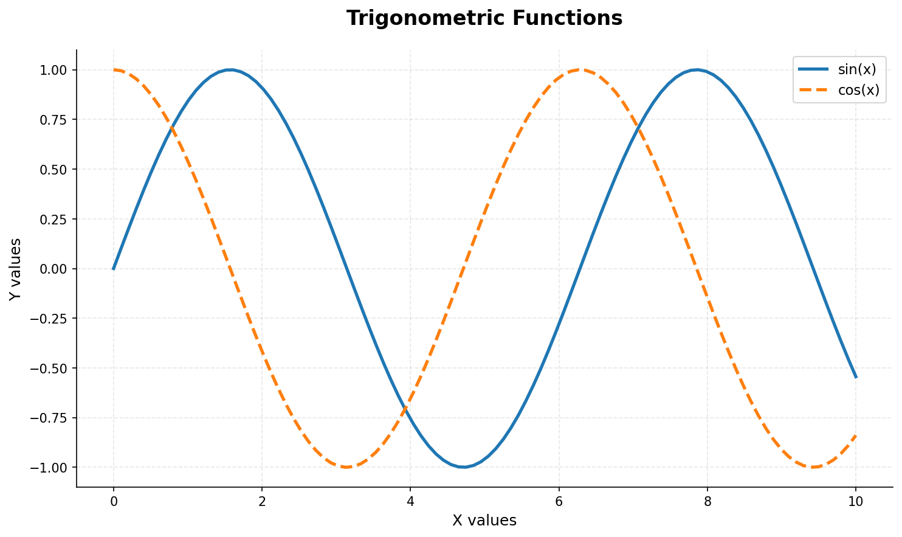

*Customization allows you to create publication-quality plots with precise control over every visual element.*

## Colors, Markers, and Line Styles

matplotlib offers extensive control over visual elements.

**Reference:**

**Colors:**
- Named colors: `'red'`, `'blue'`, `'green'`
- Hex colors: `'#FF5733'`, `'#2E8B57'`
- RGB tuples: `(0.1, 0.2, 0.5)`

**Line Styles:**
- `'-'` solid, `'--'` dashed, `'-.'` dash-dot, `':'` dotted

**Markers:**
- `'o'` circle, `'s'` square, `'^'` triangle, `'*'` star

**Example:**

```python
# Demonstrate different styles
fig, ax = plt.subplots(figsize=(10, 6))

x = np.linspace(0, 10, 20)

# Different line styles and markers
ax.plot(x, x, 'o-', label='circles', color='blue', markersize=8)
ax.plot(x, x**0.5, 's--', label='squares', color='red', markersize=6)
ax.plot(x, np.log(x+1), '^-.', label='triangles', color='green', markersize=8)
ax.plot(x, np.sin(x), '*:', label='stars', color='purple', markersize=10)

ax.set_title('Different Line Styles and Markers')
ax.legend()
ax.grid(True, alpha=0.3)
plt.show()
```

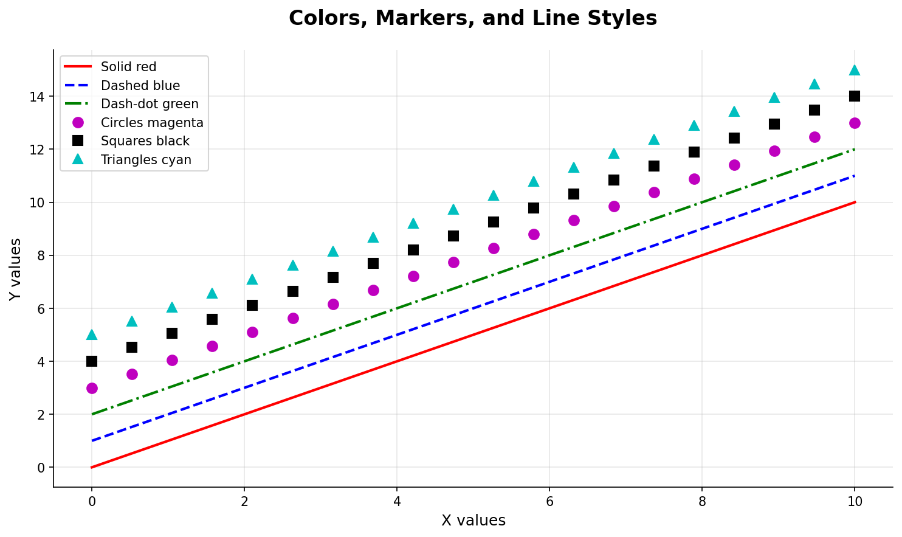

*matplotlib provides extensive options for colors, markers, and line styles to create visually distinct data series.*


*"And if you don't label your axes, I'm leaving you." - The importance of proper chart labeling, illustrated.*

# LIVE DEMO!

# pandas Plotting: Quick Exploration

*Think of pandas plotting as your data exploration Swiss Army knife - not the most specialized tool, but incredibly useful for getting a quick sense of your data.*

pandas provides convenient plotting methods that build on matplotlib, perfect for quick data exploration.

**Reference:**

- `df.plot()` - Line plot (default)
- `df.plot(kind='bar')` - Bar chart
- `df.plot(kind='hist')` - Histogram
- `df.plot(kind='scatter', x='col1', y='col2')` - Scatter plot
- `df.plot(kind='box')` - Box plot
- `df.plot(kind='pie')` - Pie chart

**Example:**

```python
import pandas as pd
import numpy as np

# Create sample data
np.random.seed(42)
df = pd.DataFrame({
    'A': np.random.randn(100),
    'B': np.random.randn(100),
    'C': np.random.randn(100)
})

# Quick exploration with pandas
fig, axes = plt.subplots(2, 2, figsize=(12, 10))

# Line plot
df.plot(ax=axes[0, 0], title='Line Plot')

# Histogram
df.plot(kind='hist', ax=axes[0, 1], alpha=0.7, title='Histogram')

# Scatter plot
df.plot(kind='scatter', x='A', y='B', ax=axes[1, 0], title='Scatter Plot')

# Box plot
df.plot(kind='box', ax=axes[1, 1], title='Box Plot')

plt.tight_layout()
plt.show()
```

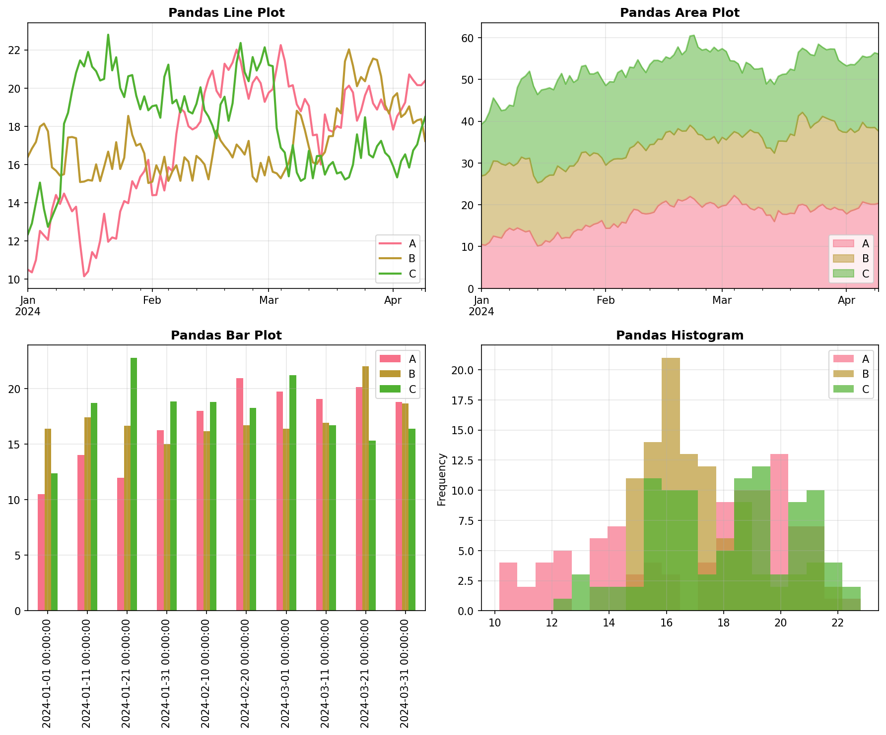

*pandas plotting methods provide quick, convenient visualization for data exploration with minimal code.*

## DataFrame Plotting Options

**Reference:**

- `subplots=True` - Create separate subplots for each column
- `figsize=(width, height)` - Set figure size
- `title='Title'` - Set plot title
- `xlabel='X Label'` - Set x-axis label
- `ylabel='Y Label'` - Set y-axis label
- `legend=True` - Show legend
- `grid=True` - Add grid lines

**Example:**

```python
# Sales data example
sales_data = pd.DataFrame({
    'Month': ['Jan', 'Feb', 'Mar', 'Apr', 'May', 'Jun'],
    'Product_A': [100, 120, 110, 130, 140, 135],
    'Product_B': [80, 90, 95, 105, 110, 115],
    'Product_C': [60, 70, 75, 80, 85, 90]
})

# Set Month as index for better plotting
sales_data.set_index('Month', inplace=True)

# Create subplots for each product
sales_data.plot(subplots=True, figsize=(10, 8), 
                title='Sales by Product Over Time',
                grid=True, legend=True)
plt.tight_layout()
plt.show()
```

# seaborn: Statistical Visualization

*seaborn is like having a data visualization expert sitting next to you, automatically choosing the right colors, styles, and statistical methods to make your plots look professional and informative.*

seaborn builds on matplotlib to provide beautiful statistical visualizations with minimal code. It's the go-to choice for most data analysis tasks.

**Reference:**

- `sns.set_style('whitegrid')` - Set plot style
- `sns.set_palette('husl')` - Set color palette
- `sns.scatterplot(x='col1', y='col2', data=df)` - Scatter plot
- `sns.lineplot(x='col1', y='col2', data=df)` - Line plot
- `sns.histplot(data=df, x='col')` - Histogram
- `sns.boxplot(data=df, x='col1', y='col2')` - Box plot
- `sns.heatmap(data=df)` - Heatmap

**Example:**

```python
import seaborn as sns

# Set seaborn style
sns.set_style('whitegrid')
tips = sns.load_dataset('tips')

# Create multiple plots
fig, axes = plt.subplots(2, 2, figsize=(12, 8))

# Scatter plot
sns.scatterplot(data=tips, x='total_bill', y='tip', 
                hue='time', ax=axes[0, 0])
axes[0, 0].set_title('Total Bill vs Tip')

# Box plot
sns.boxplot(data=tips, x='day', y='tip', ax=axes[0, 1])
axes[0, 1].set_title('Tip by Day')

# Histogram
sns.histplot(data=tips, x='total_bill', hue='time', 
             alpha=0.7, ax=axes[1, 0])
axes[1, 0].set_title('Bill Distribution')

plt.tight_layout()
plt.show()
```

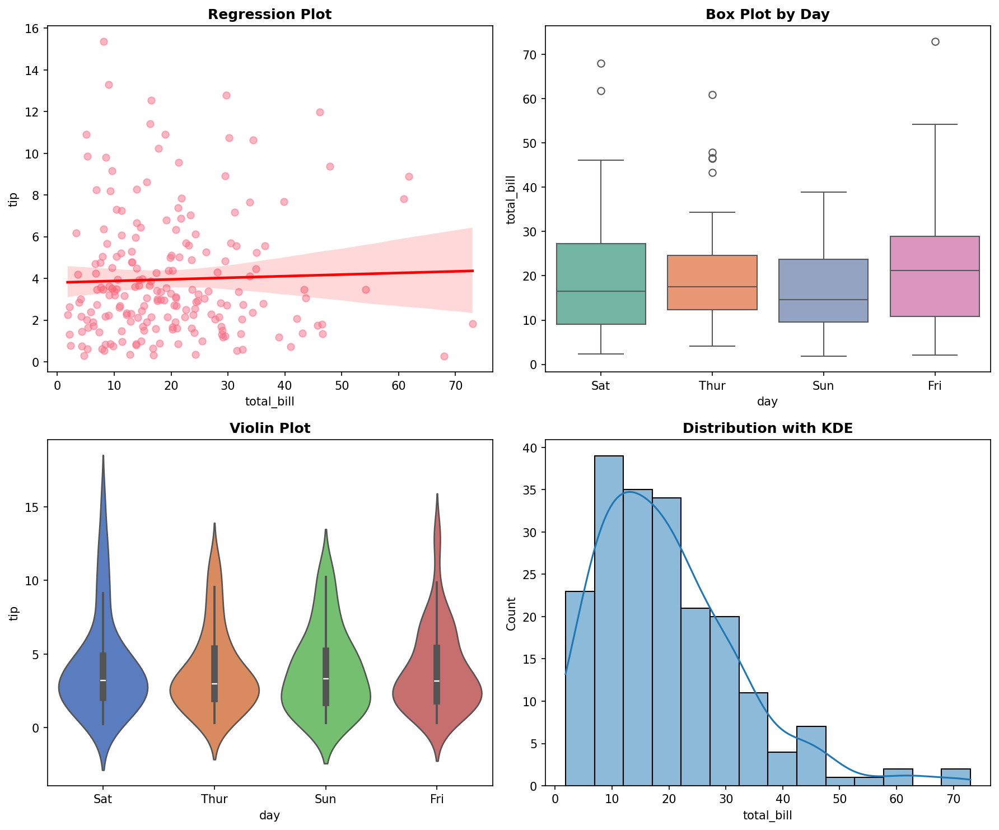

*seaborn excels at creating beautiful statistical visualizations with automatic styling and color choices.*

## Advanced seaborn Features

**Reference:**

- `sns.pairplot(df)` - Pairwise relationships
- `sns.jointplot(x='col1', y='col2', data=df)` - Joint distribution
- `sns.violinplot(data=df, x='col1', y='col2')` - Violin plot
- `sns.stripplot(data=df, x='col1', y='col2')` - Strip plot
- `sns.catplot(kind='box', data=df, x='col1', y='col2')` - Categorical plot

**Example:**

```python
# Advanced seaborn visualizations
fig, axes = plt.subplots(2, 2, figsize=(15, 12))

# Pair plot (shows all pairwise relationships)
# Note: This creates its own figure, so we'll use a subset
sample_data = tips.sample(50)
sns.pairplot(sample_data, hue='time', height=3)

# Joint plot (scatter + histograms)
sns.jointplot(data=tips, x='total_bill', y='tip', kind='hex')

# Violin plot (shows distribution shape)
sns.violinplot(data=tips, x='day', y='tip', ax=axes[0, 0])
axes[0, 0].set_title('Tip Distribution by Day (Violin Plot)')

# Strip plot (shows individual points)
sns.stripplot(data=tips, x='day', y='tip', hue='time', ax=axes[0, 1])
axes[0, 1].set_title('Individual Tips by Day and Time')

plt.tight_layout()
plt.show()
```

# Density Plots and Distribution Visualization

*Density plots show the shape of your data distribution - they're like histograms but smoother, revealing patterns that might be hidden in discrete bins.*

Density plots (also called KDE - Kernel Density Estimation) provide a smooth representation of data distribution.

**Reference:**

- `df.plot.density()` - Create density plot
- `sns.histplot(data=df, x='col', kde=True)` - Histogram with density overlay
- `sns.kdeplot(data=df, x='col')` - Pure density plot
- `sns.distplot(data=df, x='col')` - Combined histogram and density

**Example:**

```python
# Create sample data with different distributions
np.random.seed(42)
normal_data = np.random.normal(0, 1, 1000)
bimodal_data = np.concatenate([
    np.random.normal(-2, 0.5, 500),
    np.random.normal(2, 0.5, 500)
])

# Density plots
fig, axes = plt.subplots(2, 2, figsize=(12, 10))

# pandas density plot
pd.Series(normal_data).plot.density(ax=axes[0, 0], title='Normal Distribution')
axes[0, 0].grid(True, alpha=0.3)

# seaborn density plot
sns.kdeplot(data=normal_data, ax=axes[0, 1], title='Normal Distribution (seaborn)')
axes[0, 1].grid(True, alpha=0.3)

# Bimodal distribution
sns.kdeplot(data=bimodal_data, ax=axes[1, 0], title='Bimodal Distribution')
axes[1, 0].grid(True, alpha=0.3)

# Combined histogram and density
sns.histplot(data=normal_data, kde=True, ax=axes[1, 1], title='Histogram + Density')
axes[1, 1].grid(True, alpha=0.3)

plt.tight_layout()
plt.show()
```

# LIVE DEMO!

# Modern Visualization Libraries

*The Python visualization ecosystem is constantly evolving. While matplotlib and seaborn are the workhorses, modern libraries offer exciting new approaches.*

## vega-altair: Grammar of Graphics with Vega-Lite

*altair uses a declarative approach where you describe the data mapping rather than specifying drawing commands. It implements the grammar of graphics through Vega-Lite.*

altair implements the Vega-Lite grammar of graphics, providing a declarative approach to creating statistical visualizations. It's designed for interactive web-based visualizations and supports multiple output formats.

## Chart Creation and Mark Types

altair uses a simple pattern: create a chart, specify the mark type, and encode your data.

**Reference:**

- `alt.Chart(data)` - Create chart from data
- `alt.Chart(data).mark_circle()` - Scatter plot
- `alt.Chart(data).mark_bar()` - Bar chart  
- `alt.Chart(data).mark_line()` - Line plot
- `alt.Chart(data).mark_area()` - Area chart
- `alt.Chart(data).mark_rect()` - Heatmap/rectangles
- `alt.Chart(data).mark_point()` - Point plot

**Example:**

```python
import altair as alt
import pandas as pd

# Sample data
data = pd.DataFrame({
    'x': [1, 2, 3, 4, 5],
    'y': [2, 4, 1, 5, 3],
    'category': ['A', 'B', 'A', 'C', 'B']
})

# Scatter plot - shows relationships between variables
scatter = alt.Chart(data).mark_circle().encode(x='x', y='y')
scatter.show()

# Bar chart - compares values across categories  
bar = alt.Chart(data).mark_bar().encode(x='category', y='y')
bar.show()

# Line chart - shows trends over ordered data
line = alt.Chart(data).mark_line().encode(x='x', y='y')
line.show()

# Combined view using altair's concatenation
combined = alt.hconcat(scatter, bar, line)
combined.show()
```

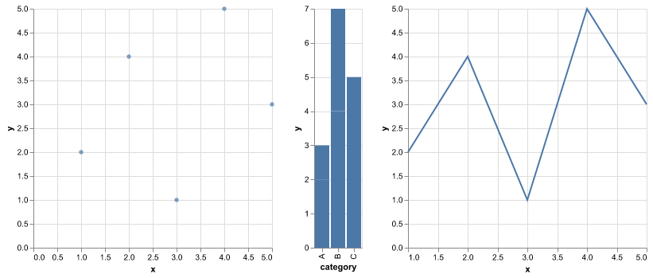

*Combined altair charts: scatter plot (left), bar chart (middle), line plot (right)*

## Data Encoding

The `.encode()` method maps data columns to visual properties using type annotations.

**Reference:**

- `x='column:Q'` - Quantitative (continuous) data
- `y='column:O'` - Ordinal (discrete) data  
- `color='column:N'` - Nominal (categorical) data
- `size='column:Q'` - Size encoding
- `shape='column:N'` - Shape encoding
- `tooltip=['col1', 'col2']` - Hover information

**Example:**

```python
# Enhanced scatter plot with encoding
chart = alt.Chart(data).mark_circle().encode(
    x='x:Q',                    # Quantitative x-axis
    y='y:Q',                    # Quantitative y-axis
    color='category:N',         # Color by category
    size='y:Q',                 # Size by y-value
    tooltip=['x', 'y', 'category']  # Hover info
)

chart.show()
```

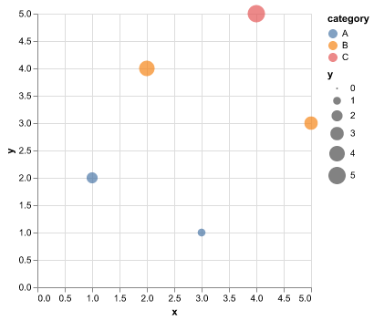

*Enhanced scatter plot with color encoding by category and size encoding by y-value*

## Interactive Features

altair provides built-in interactivity through the `.interactive()` method, enabling zoom, pan, and selection.

**Reference:**

- `.interactive()` - Enable zoom/pan
- `.add_selection()` - Add selection tools
- `.transform_filter()` - Filter data dynamically
- `alt.selection_interval()` - Rectangle selection
- `alt.selection_single()` - Point selection

**Example:**

```python
# Interactive scatter plot
interactive_chart = alt.Chart(data).mark_circle().encode(
    x='x:Q',
    y='y:Q', 
    color='category:N',
    tooltip=['x', 'y', 'category']
).interactive()

interactive_chart.show()
```

## Advanced altair Features

### Faceting and Layering

altair supports faceting (small multiples) and layering multiple mark types.

**Reference:**

- `.facet('column:N')` - Create small multiples
- `alt.layer()` - Combine multiple mark types
- `.properties(width=300, height=200)` - Set chart dimensions

**Example:**

```python
# Faceted chart
faceted = alt.Chart(data).mark_circle().encode(
    x='x:Q',
    y='y:Q',
    color='category:N'
).facet('category:N', columns=2)

# Layered chart
base = alt.Chart(data).encode(x='x:Q', y='y:Q')
layered = alt.layer(
    base.mark_circle(color='lightblue'),
    base.mark_line(color='red').transform_regression('x', 'y')
)
```

### Statistical Transformations

altair includes built-in statistical transformations.

**Reference:**

- `.transform_regression('x', 'y')` - Add regression line
- `.transform_aggregate()` - Group and aggregate data
- `.transform_filter()` - Filter data based on selections

**Example:**

```python
# Chart with regression line
regression = alt.Chart(data).mark_circle().encode(
    x='x:Q',
    y='y:Q'
) + alt.Chart(data).mark_line(color='red').transform_regression(
    'x', 'y'
).encode(x='x:Q', y='y:Q')
```

## Export Formats

altair supports multiple output formats for different use cases.

**Reference:**

- `chart.save('plot.png')` - Static bitmap (PNG)
- `chart.save('plot.svg')` - Static vector (SVG)
- `chart.save('plot.html')` - Interactive HTML
- `chart.save('plot.json')` - Vega-Lite JSON specification

**Example:**

```python
# Export to different formats
chart.save('scatter.png')      # Static bitmap
chart.save('scatter.svg')      # Static vector
chart.save('interactive.html') # Interactive HTML
```

## Other Modern Tools: plotnine, Bokeh, and Plotly

### plotnine: ggplot2 for Python

**plotnine** brings R's ggplot2 syntax to Python, perfect for those familiar with R.

**Key Features:**
- Grammar of graphics approach
- Layered plotting syntax
- Familiar to R users
- Statistical transformations

**Reference:**
- `ggplot(data, aes(x='col1', y='col2'))` - Base plot
- `+ geom_point()` - Add scatter points
- `+ geom_smooth()` - Add trend line
- `+ facet_wrap('~column')` - Create facets
- `+ theme_minimal()` - Apply themes

**Example:**

```python
# plotnine example (if installed)
try:
    from plotnine import ggplot, aes, geom_point, geom_smooth, theme_minimal, facet_wrap
    
    # Create ggplot2-style plot
    p = (ggplot(tips, aes(x='total_bill', y='tip', color='time')) 
         + geom_point(alpha=0.6)
         + geom_smooth(method='lm')
         + facet_wrap('~day')
         + theme_minimal())
    
    print(p)
    
except ImportError:
    print("plotnine not installed. Install with: pip install plotnine")
```

### Bokeh: Interactive Web Visualizations

**Bokeh** creates interactive web-based visualizations with rich interactivity.

**Key Features:**
- High-performance interactive plots
- Web-based output
- Custom JavaScript callbacks
- Server applications

**Reference:**
- `figure()` - Create plot figure
- `.circle()`, `.line()`, `.bar()` - Add glyphs
- `HoverTool()` - Add hover information
- `output_notebook()` - Display in Jupyter

### Plotly: Interactive Dashboards

**Plotly** excels at creating interactive dashboards and web applications.

**Key Features:**
- Easy-to-use API
- Rich interactivity
- Dashboard capabilities
- Multiple chart types

**Reference:**
- `px.scatter()`, `px.line()`, `px.bar()` - Express functions
- `go.Figure()` - Graph objects
- `make_subplots()` - Multiple plots
- `.show()` - Display plot

**Example:**

```python
# Plotly example (if installed)
try:
    import plotly.express as px
    import plotly.graph_objects as go
    
    # Express API
    fig = px.scatter(tips, x='total_bill', y='tip', color='time', 
                     title="Interactive Scatter Plot")
    fig.show()
    
    # Graph objects API
    fig2 = go.Figure(data=go.Scatter(x=tips['total_bill'], y=tips['tip']))
    fig2.show()
    
except ImportError:
    print("Plotly not installed. Install with: pip install plotly")
```

## Tool Selection Guide

**When to use each tool:**

- **matplotlib**: Custom plots, publication quality, fine control
- **seaborn**: Statistical plots, beautiful defaults, relationship analysis  
- **pandas**: Quick exploration, basic charts
- **altair**: Interactive plots, grammar of graphics, web-ready
- **plotnine**: R users, layered approach, statistical plots
- **Bokeh**: High-performance web visualizations, custom interactions
- **Plotly**: Dashboards, web applications, easy interactivity


*"Every single map of the United States looks the same because it's just a population density map." - A reminder that your visualization should show meaningful patterns, not just expected distributions.*


# LIVE DEMO!
