---
notion:
  title_line: "# Data Visualization: From Exploration to Communication"
  role: lecture
  status: mapped
  page_id: "29ad9fdd-1a1a-803c-a031-f791f9043193"
  url: "https://app.notion.com/p/29ad9fdd1a1a803ca031f791f9043193"
---

# Data Visualization: From Exploration to Communication

See [BONUS.md](BONUS.md) for the optional extensions.

**Live notebooks in Colab:** [Demo 1](https://colab.research.google.com/github/christopherseaman/datasci_217/blob/main/07/demo/demo1_matplotlib_basics.ipynb) · [Demo 2](https://colab.research.google.com/github/christopherseaman/datasci_217/blob/main/07/demo/demo2_seaborn_statistical.ipynb) · [Demo 3](https://colab.research.google.com/github/christopherseaman/datasci_217/blob/main/07/demo/demo3_pandas_altair.ipynb)

_Fun fact: The word "visualization" comes from the Latin "visus" meaning "sight." In data science, we're literally making data visible - turning numbers into stories that our eyes can understand and our brains can process._

This lecture uses prepared plotting tables so you can focus on choosing honest encodings; Lecture 08 teaches how to build such tables from raw rows.

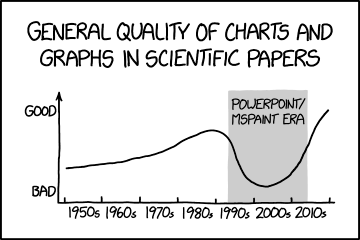

# Start with a visualization contract

In the 1850s, Florence Nightingale had monthly counts of British Army deaths in the Crimean War, split by cause. Her diagram made one comparison impossible to miss: the blue wedges (deaths from preventable disease) dwarf the red wedges (deaths from wounds), and she used it to argue for sanitary reform in army hospitals. Decide what the reader should compare before you draw anything.

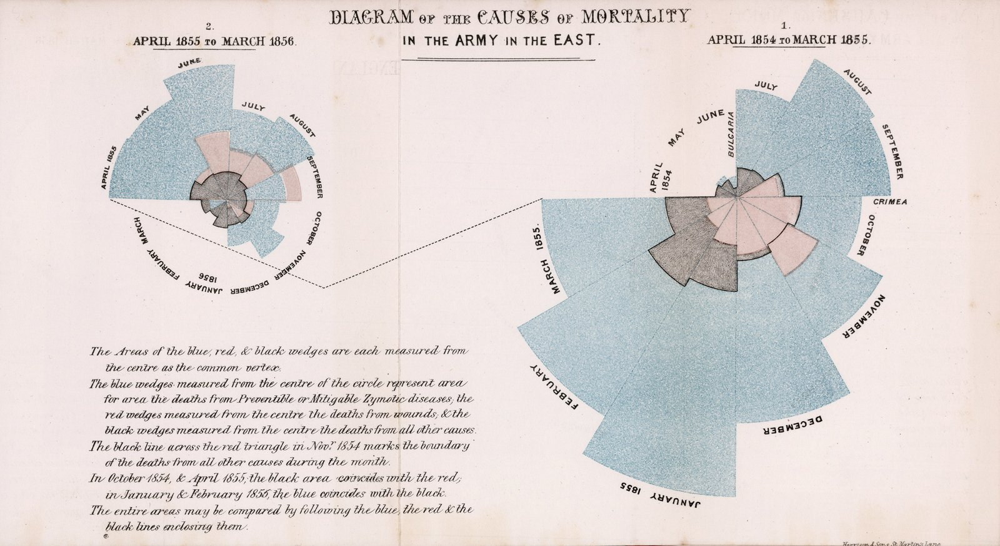

A **visualization** maps data values to visible properties so a reader can make a comparison: each column becomes something the eye can compare, such as a position, a length, or a color. Before choosing a chart type, write these four plain-language statements:

1. **Question:** What comparison or pattern should the chart help the reader understand?
2. **Audience and claim:** Who reads the chart, and what descriptive conclusion should it support? A visible pattern alone does not prove why that pattern occurred.
3. **Unit and grain:** What does one mark represent, and what does one row of the plotting table represent?
4. **Variables:** What is each variable's data type and role, and which visible property encodes it?

## State the unit and grain shown

The **unit displayed** is what one mark in the chart represents. You met this idea as row meaning in Lecture 05 (one row is one clinic visit, not one patient) and as long format in Lecture 06. A **plotting table** is a table whose rows match the marks you want to draw.

| Plotting table | One row is | One mark is | Question it can answer |
| --- | --- | --- | --- |
| Patient visits | One blood-pressure reading at one visit | One point | How much do individual readings vary? |
| Clinic summary | One clinic in one month | One bar or line point | Which clinic's average changed more? |

## Separate data type from role

A variable's **data type** is what its values mean and which operations make sense:

- **categorical** values place observations into named groups;
- **quantitative** values are numeric magnitudes where arithmetic is meaningful;
- **ordinal** values are categories with a meaningful order; and
- **temporal** values are dates or times, whose order and spacing may matter.

A variable's **role** is the job it does here: the measure compared, the grouping, the observation order, or an **identifier** that labels or links records. An identifier stored as a number is still not a quantitative measure. One data type can play different roles in different charts, so record both before choosing x, y, or color.

## Separate exploratory and explanatory work

An **exploratory visualization** helps you inspect patterns, distributions, or surprises while the question is still forming. It can be quick, but it still needs truthful scales and labels.

An **explanatory visualization** communicates one finding to a named audience. It drops irrelevant alternatives, adds annotation, and uses a title that states what the reader should notice without overstating the evidence.

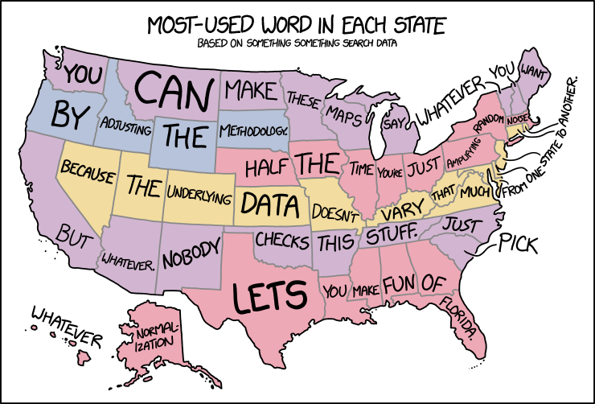

_xkcd 1845, “State Word Map”_: if flexible method choices can produce any headline, the chart is not evidence.

## Think in marks and encodings

A **mark** is a visible object such as a point, line, or rectangle. An **encoding** maps a data value to a visible property: position, length, color, marker shape, or line style.

Position along a common scale supports more precise comparison than area or volume. Color alone is fragile: some readers cannot tell the hues apart, and grayscale printing removes the difference. When category identity matters, pair color with a redundant encoding such as marker shape, line style, or a direct label.

## Write the contract down

Record the four answers before you write any plotting code. The card adds a fifth row for accessibility, developed later in this lecture.

### Reference Card: Visualization Contract

| Question | What to record | Useful output |
| :--- | :--- | :--- |
| **Question** | The comparison or pattern the reader should inspect | One-sentence chart claim |
| **Audience and claim** | Who reads it and the one descriptive conclusion it supports | Appropriate labels, title, and annotation |
| **Unit and grain** | What one mark and one plotting-table row represent | A defensible aggregation level |
| **Variable role** | Type plus role: measure, group, time, or identifier | Candidate x, y, color, or shape encoding |
| **Accessibility** | A redundant cue and text alternative for the main comparison | A chart usable without color or hover |

### Code Snippet: Storage dtype Is Not Visualization Type

A pandas dtype (Lecture 04) records how values are stored; the visualization data type records what they mean.

```python
import pandas as pd

visits = pd.DataFrame({
    'patient_id': [101, 101, 102, 102],
    'clinic': ['North', 'North', 'South', 'South'],
    'visit_month': [1, 2, 1, 2],
    'systolic_bp': [142, 136, 128, 131],
})
print(visits.dtypes)
```

```text
patient_id     int64
clinic           str
visit_month    int64
systolic_bp    int64
dtype: object
```

Three columns are `int64`, but only `systolic_bp` (mmHg) is a quantitative measure. `patient_id` is an identifier (its average means nothing), `visit_month` is temporal, and `clinic` is categorical. One row is one visit, so one scatter point is one visit.

## The Right Chart for the Job

The question and the variable types narrow the choice of chart.

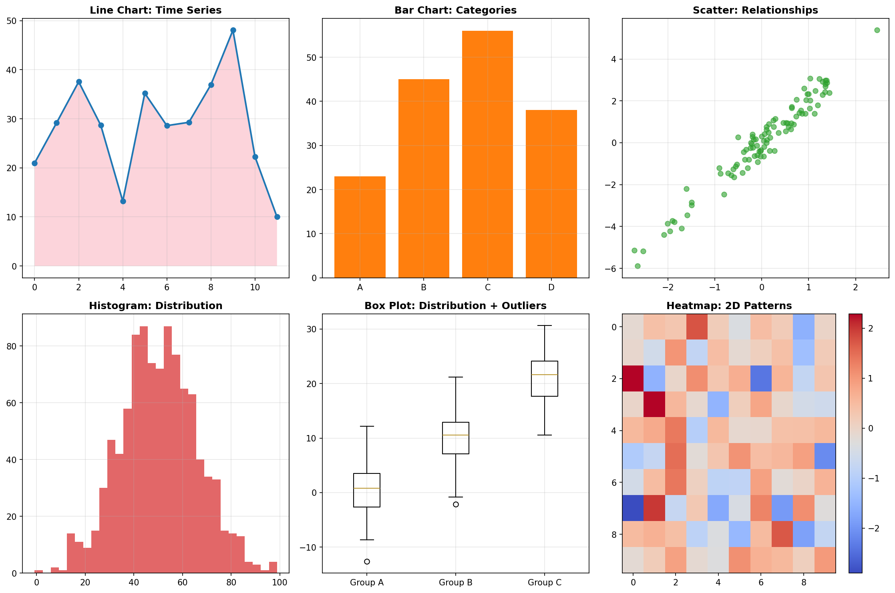

# matplotlib: Foundation Layer

_Think of matplotlib as the foundation of your visualization house - you can build anything on it, but you need to understand the plumbing before you can install the fancy fixtures._

pandas and seaborn draw through matplotlib, so their charts are matplotlib objects you can adjust with the same methods. Two objects are enough to fix almost any of them:

- A **Figure** is the whole canvas: the image you display or save with `fig.savefig()`.
- An **Axes** is one painting on that canvas: a plotting area with its own x-axis, y-axis, title, and marks, set with methods such as `ax.set_title()`. "Axes" names one plotting area; it is not the plural of "axis".

The main path is `fig, ax = plt.subplots()` plus Axes methods such as `ax.plot()` and `ax.set_xlabel()`. Older examples use the pyplot shortcut style (`plt.plot()`, `plt.title()`), which draws on whichever Axes is current: fine for a sketch, confusing with several panels, so this course uses Axes methods.

## Figures and Subplots

With several panels, `plt.subplots(rows, cols)` returns the Axes in a NumPy array, so Lecture 03 indexing applies: one row of panels gives a 1-D array (`axes[0]`), and a grid gives a 2-D array (`axes[0, 1]` is row 0, column 1).

```text
Figure (fig)
├── Axes axes[0]  ← its own title, labels, lines, bars
└── Axes axes[1]  ← its own scales
```

### Reference Card: Figures and Subplots

| Call | Purpose and key arguments | Output |
| :--- | :--- | :--- |
| `plt.subplots(rows, cols, figsize=(w, h))` | Create a figure and a grid of Axes, with dimensions in inches | `Figure` plus one Axes or an array of Axes |
| `plt.figure(figsize=(w, h))` | Create an empty figure (pyplot shortcut style) | `Figure` |
| `plt.plot()`, `plt.title()`, `plt.xlabel()` | Pyplot shortcuts for `ax.plot()`, `ax.set_title()`, `ax.set_xlabel()` on the current Axes | Updated current Axes |
| `fig.add_subplot(rows, cols, position)` | Add one Axes to an existing figure | `Axes` |
| `fig.tight_layout()` / `plt.tight_layout()` | Adjust spacing so titles and labels do not overlap | Rearranged figure |
| `plt.show()` | Render the figure in an interactive session | Displayed figure |

### Code Snippet: What `plt.subplots()` Returns

```python
import matplotlib.pyplot as plt

fig, axes = plt.subplots(1, 2, figsize=(8, 3))
print(type(fig))
print(axes.shape)
print(type(axes[0]))
```

```text
<class 'matplotlib.figure.Figure'>
(2,)
<class 'matplotlib.axes._axes.Axes'>
```

Read each class name from its last part: one `Figure`, and an array of two `Axes`, one per panel.

## Draw Marks on an Axes

Most chart types have a matching Axes method.

### Reference Card: Axes Plotting Methods

- `ax.plot(x, y)`: Draw a line through the points in order; use for trends over an ordered x such as time.
- `ax.scatter(x, y, alpha=0.6)`: Draw one point per observation; `alpha` (0 to 1) makes overlapping points see-through.
- `ax.bar(categories, heights)`: Draw one bar per category, starting at zero.
- `ax.hist(values, bins=30)`: Count values in 30 equal-width bins and draw one bar per bin.
- `ax.boxplot([group_a, group_b], tick_labels=['A', 'B'])`: Draw the median, quartiles, and outliers of each group.

### Code Snippet: One Mark Type per Panel

```python
import matplotlib.pyplot as plt
import numpy as np

rng = np.random.default_rng(42)
fig, axes = plt.subplots(2, 2, figsize=(10, 8))

axes[0, 0].plot([1, 2, 3, 4], [1, 4, 2, 3])
axes[0, 0].set_title('Line Plot')

axes[0, 1].hist(rng.normal(0, 1, 1000), bins=30)  # 1,000 draws: mean 0, standard deviation 1
axes[0, 1].set_title('Histogram')

axes[1, 0].scatter(rng.standard_normal(100), rng.standard_normal(100))
axes[1, 0].set_title('Scatter Plot')

axes[1, 1].bar(['A', 'B', 'C'], [3, 7, 2])
axes[1, 1].set_title('Bar Chart')

plt.tight_layout()
plt.show()
```

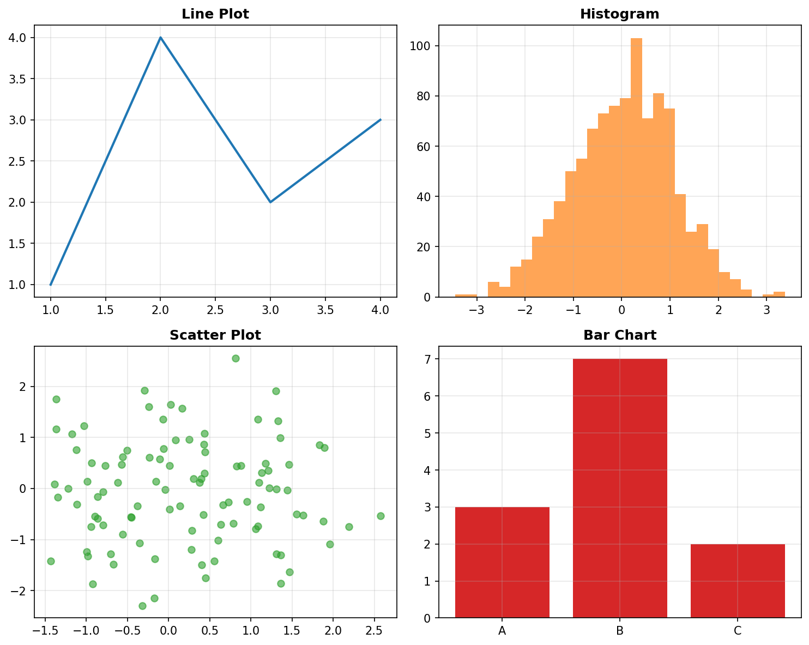

## Customizing Plots

Titles, axis labels with units, deliberate limits, and a restrained grid give the reader the context the contract asks for.

### Reference Card: Axes Customization

| Call | Purpose and key arguments | Output |
| :--- | :--- | :--- |
| `ax.set(title=..., xlabel=..., ylabel=...)` | Set visible context for the reader | Updated `Axes` |
| `ax.set_title(text)`, `ax.set_xlabel(text)`, `ax.set_ylabel(text)` | Set one label at a time | Updated `Axes` |
| `ax.set_xlim(left, right)` / `ax.set_ylim(bottom, top)` | Control displayed ranges; use deliberately | Updated limits |
| `ax.set_xticks(positions, labels)` | Choose where ticks sit and, optionally, what they say | Updated ticks |
| `ax.tick_params(axis='x', rotation=45)` | Turn the tick labels on one axis so long category names stop overlapping; `labelsize=` shrinks them instead | Updated tick labels |
| `ax.grid(axis='y', alpha=0.3)` | Add restrained reference lines | Updated `Axes` |
| `ax.legend()` | Decode labeled series when direct labels are not enough | Legend artist |
| `plt.style.use(name)` | Apply a named style before creating figures | Global style setting |

### Code Snippet: Axes Customization

```python
fig, ax = plt.subplots(figsize=(8, 6))

x = np.linspace(0, 10, 100)  # 100 evenly spaced values from 0 to 10
y1 = np.sin(x)               # sine of every value, element-wise like Lecture 03's np.sqrt()
y2 = np.cos(x)

ax.plot(x, y1, label='sin(x)', color='blue', linewidth=2)
ax.plot(x, y2, label='cos(x)', color='red', linewidth=2, linestyle='--')

ax.set_title('Trigonometric Functions')
ax.set_xlabel('X values')
ax.set_ylabel('Y values')
ax.grid(True, alpha=0.3)
ax.legend()

plt.tight_layout()
plt.show()
```

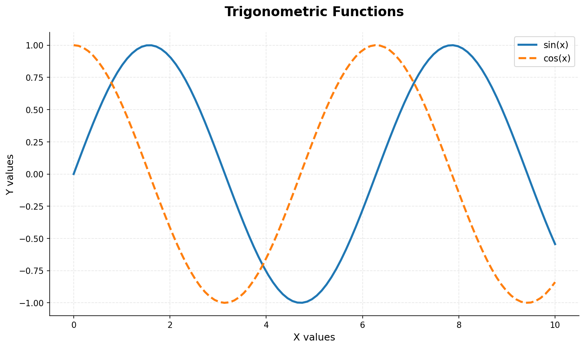

## Colors, Markers, and Line Styles

Each series can combine a color, a marker, and a line style. Together they keep lines distinguishable even in grayscale, as the accessibility section revisits.

### Reference Card: Colors, Markers, and Line Styles

| Property | Examples | Use |
| :--- | :--- | :--- |
| **Color** | `'steelblue'`, `'#0072B2'`, `(0.1, 0.2, 0.5)` | Distinguish categories or encode magnitude |
| **Line style** | `'-'`, `'--'`, `'-.'`, `':'` | Reinforce series identity or meaning; set thickness with `linewidth=` |
| **Marker** | `'o'`, `'s'`, `'^'`, `'*'` | Reinforce category identity and show observations; set size with `markersize=` |
| **Format string** | `'o-'`, `'s--'` | Shorthand for marker + line style: `'o--'` equals `marker='o', linestyle='--'` |

### Code Snippet: Visual Styles

```python
fig, ax = plt.subplots(figsize=(10, 6))

x = np.linspace(0, 10, 20)

ax.plot(x, x, 'o-', label='circles', color='blue', markersize=8)
ax.plot(x, x**0.5, 's--', label='squares', color='red', markersize=6)
ax.plot(x, np.log(x+1), '^-.', label='triangles', color='green', markersize=8)
ax.plot(x, np.sin(x), '*:', label='stars', color='purple', markersize=10)

ax.set_title('Different Line Styles and Markers')
ax.legend()
ax.grid(True, alpha=0.3)
plt.show()
```

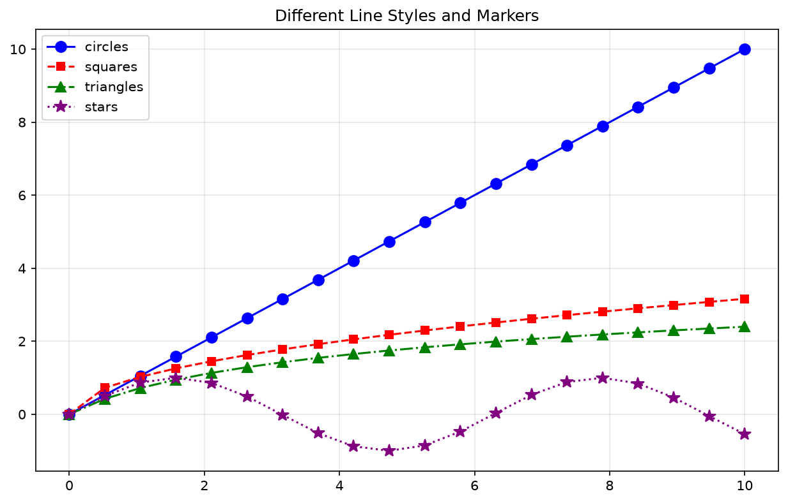

## Annotate, Declutter, and Save

An explanatory chart usually points at one thing. An **annotation** is text attached to a data point, often with an arrow, so the reader does not have to hunt for it. The top and right frame lines (**spines**) carry no data, so hiding them leaves more attention for the marks. `fig.savefig()` writes the whole Figure to a file, and the extension picks the file type.

### Reference Card: Annotate, Declutter, and Save

- `ax.annotate(text, xy=(x, y), xytext=(x2, y2), arrowprops=dict(arrowstyle='->'))`: Put `text` at `xytext` with an arrow pointing to the data point `xy`. Add `color=` for the text, and a `color=` inside `arrowprops` for the arrow.
- `ax.text(x, y, text, va='center')`: Put text at a point with no arrow, such as a direct line label; `va=` (vertical alignment) and `ha=` (horizontal alignment) set which part of the text sits on that point.
- `ax.spines[['top', 'right']].set_visible(False)`: Hide the two frame lines that carry no data.
- `ax.legend(loc='upper left', bbox_to_anchor=(1, 1), frameon=False)`: Place the legend just outside the right edge, without a box.
- `fig.savefig('chart.png', dpi=150, bbox_inches='tight')`: Save a PNG at 150 dots per inch; `bbox_inches='tight'` trims extra margin so labels are not cut off. Use `.svg` or `.pdf` for vector output.

### Code Snippet: Point to the Peak and Save

```python
import matplotlib.pyplot as plt

weeks = [1, 2, 3, 4]
flu_visits = [42, 45, 51, 48]

fig, ax = plt.subplots(figsize=(6, 4))
ax.plot(weeks, flu_visits, marker='o')
ax.annotate('Peak: 51 visits', xy=(3, 51), xytext=(1.5, 55),
            arrowprops=dict(arrowstyle='->'))
ax.set(xlabel='Week', ylabel='Flu clinic visits', ylim=(0, 60))
ax.set_xticks(weeks)
ax.spines[['top', 'right']].set_visible(False)
fig.savefig('flu_visits.png', dpi=150, bbox_inches='tight')
```

Expected result: `flu_visits.png` appears next to your notebook, showing one line with an arrow from 'Peak: 51 visits' to the week-3 point and no top or right frame line.

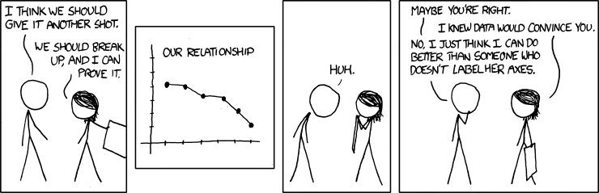

# LIVE DEMO!

# The Visualization Ecosystem

_Reality check: There are more Python visualization libraries than there are ways to mess up a bar chart._

A **plotting backend** is the engine that actually draws a library's charts: matplotlib draws images from Python, and **Vega-Lite** draws charts in a web browser.

```
matplotlib ← pandas .plot() (default backend)
           ← seaborn
           ← plotnine

Vega-Lite  ← Altair

Arrows mean “renders through,” not a required learning order.
```

## Choosing the Right Tool

### Reference Card: Choosing a Plotting Tool

| Tool | Reach for it when | Draws through | Typical output |
| --- | --- | --- | --- |
| pandas `.plot()` | You want a first look at a DataFrame | matplotlib | `Axes` |
| matplotlib | You need full control or a publication figure | itself | `Figure`/`Axes`; PNG, SVG, PDF |
| seaborn | You want statistical plots from long data, with groups shown by color (`hue=`) | matplotlib | `Axes` |
| Altair | You want encodings that state each column's data type, hover tooltips, or a chart for a web page or JSON file | Vega-Lite | Altair `Chart` object; HTML, JSON |

plotnine, Bokeh, and Plotly are surveyed in [BONUS.md](BONUS.md).

# pandas: Quick Data Exploration

_Think of pandas plotting as your data exploration Swiss Army knife - not the most specialized tool, but incredibly useful for getting a quick sense of your data._

`df.plot()` is the fastest look at a table you have just loaded: one call on the DataFrame you already have (Lecture 04). It returns a matplotlib `Axes`, so matplotlib methods still work afterward, and `ax=` draws into one panel of a `plt.subplots()` grid.

## Index to x, Columns to Series

pandas hands the data to matplotlib using two rules:

- The **index** becomes the x-axis.
- Each numeric **column** becomes one series (a line, a set of bars, ...), and the column names fill the legend.

Check the index before plotting: if it is the default 0, 1, 2, ..., the x-axis shows row numbers. `set_index()` from Lecture 06 makes it meaningful, such as the week.

### Code Snippet: The Index Becomes the x-Axis

```python
import pandas as pd

weekly = pd.DataFrame({
    'week': [1, 2, 3, 4],
    'North': [42, 45, 51, 48],
    'South': [30, 33, 31, 36],
}).set_index('week')

ax = weekly.plot(marker='o', ylabel='Flu clinic visits', title='Weekly visits by clinic')
print(ax.get_xlabel())  # week
```

Expected output: two lines, one per clinic, with `week` on the x-axis and a legend reading North and South.

## Plot Kinds

One table, many views: `kind=` picks the mark, and when the question is how two columns relate, `corr()` answers with a table of numbers rather than a picture: the **Pearson correlation** of every pair of selected columns.

A correlation runs from `-1`, one column rising as the other falls, through `0`, no straight-line link, to `1`, both moving the same way. Pearson is the default. Select the numeric columns yourself rather than trusting the error: a text column of words raises `ValueError`, but a text column whose values happen to parse as numbers, such as zero-padded patient IDs or ZIP codes, is correlated silently as though it were a measurement. And a correlation measures straight-line association only, so a strong number is still not causation.

### Reference Card: pandas Plotting and Correlation

| Call | Purpose and key arguments | Output |
| :--- | :--- | :--- |
| `df.plot()` | Line plot: index on x, one line per numeric column | `Axes` |
| `df.plot(ax=axes[0, 1])` | Draw into an existing Axes instead of a new figure | That Axes |
| `df.plot(kind='bar')` | Compare values across categories | `Axes` |
| `df.plot(kind='hist', bins=...)` | Inspect numeric distributions | `Axes` |
| `df.plot(kind='scatter', x='col1', y='col2')` | Inspect a two-variable relationship | `Axes` |
| `df.plot(kind='box')` | Compare distributions and outliers | `Axes` |
| `df.plot(kind='pie', y='col')` | Show nonnegative values as parts of their total | `Axes` |
| `df.plot.bar()`, `df.plot.hist()` | Same as `kind='bar'` / `kind='hist'`; `df.plot.density()` below uses this form | `Axes` |
| `corr = df[['age', 'bmi']].corr()` | **Correlation matrix**: the Pearson correlation of every pair of the listed columns; `method=` also accepts `'spearman'` and `'kendall'` | Square `DataFrame`, one row and column per listed column. `1.0` down the diagonal, except that a column with nothing to vary (one repeated value, or only one non-missing value) is `NaN` throughout |
| `corr.to_csv(path, index=True, index_label='feature')` | Write a frame whose row labels are data, not row numbers: `index=True` keeps them (Lecture 04) and `index_label=` names the column they land in | CSV file whose first column is headed `feature` |

### Code Snippet: Several Plot Kinds in One Grid

```python
import matplotlib.pyplot as plt

fig, axes = plt.subplots(2, 2, figsize=(12, 8))
weekly.plot(ax=axes[0, 0], marker='o', title='Line: visits each week')
weekly.plot(kind='bar', ax=axes[0, 1], title='Bar: visits each week')
weekly.plot(kind='scatter', x='North', y='South', ax=axes[1, 0], title='Scatter: one point per week')
weekly.plot(kind='box', ax=axes[1, 1], title='Box: spread of weekly visits')
plt.tight_layout()
plt.show()
```


### Code Snippet: A Correlation Matrix

```python
print(weekly[['North', 'South']].corr())
#          North    South
# North  1.00000  0.29277
# South  0.29277  1.00000
```

## DataFrame Plotting Options

### Reference Card: DataFrame Plot Options

| Option | Purpose and arguments | Output |
| :--- | :--- | :--- |
| `subplots=True` | Give each selected column its own Axes | Array of `Axes` |
| `sharey=True` | Give every subplot the same y-scale so panels are comparable | Shared limits |
| `figsize=(width, height)` | Set figure dimensions in inches | Larger or smaller figure |
| `title=...`, `xlabel=...`, `ylabel=...` | Add reader-facing context | Labeled plot |
| `legend=True`, `grid=True` | Decode series or add restrained guides | Updated `Axes` |

### Code Snippet: DataFrame Plot Options

```python
monthly = pd.DataFrame({
    'month': ['Jan', 'Feb', 'Mar', 'Apr', 'May', 'Jun'],
    'North': [100, 120, 110, 130, 140, 135],
    'South': [80, 90, 95, 105, 110, 115],
    'East': [60, 70, 75, 80, 85, 90],
}).set_index('month')

monthly.plot(subplots=True, sharey=True, figsize=(10, 8),
             title='Clinic visits by month', ylabel='Visits', grid=True)
plt.tight_layout()
plt.show()
```

Expected output: three stacked panels (North, South, East), each labeled Visits, that share one y-axis running from about 56 to 144, so East's lower counts sit visibly lower than North's.

# seaborn: Statistical Graphics

_seaborn is like having a visualization expert sitting next to you, quietly picking the colors, styles, and statistics for you._

seaborn builds on matplotlib to draw statistical graphics from a DataFrame in one call. It expects long data from Lecture 06: one row per observation, one column per variable. You pass column names, and seaborn maps each one to an encoding:

- `data=`: the DataFrame the column names come from
- `x=` and `y=`: horizontal and vertical position
- `hue=`: color, one color per category

That is the visualization contract written as code: `sns.scatterplot(data=visits, x='visit_month', y='systolic_bp', hue='clinic')` means one point per visit, month across, blood pressure up, clinic by color. Each function in the card below returns an `Axes` and accepts `ax=`.

## Statistical Plots from Long Data

### Reference Card: seaborn Statistical Graphics

| Call | Purpose and key arguments | Output |
| :--- | :--- | :--- |
| `sns.load_dataset(name)` | Download a small example table, such as `'healthexp'` (needs internet) | `DataFrame` |
| `sns.set_style(name)` / `sns.set_palette(name)` | Set defaults for readable plots | Updated seaborn defaults |
| `sns.scatterplot(data=df, x=..., y=..., hue=...)` | Show relationships and optional groups | `Axes` |
| `sns.lineplot(data=df, x=..., y=..., hue=...)` | Show ordered trends; averages rows that share an x value | `Axes` |
| `sns.barplot(data=df, x=..., y=..., hue=...)` | One bar per category showing the mean of y, with an error bar | `Axes` |
| `sns.histplot(data=df, x=..., kde=True)` | Show distribution, optionally with density | `Axes` |
| `sns.boxplot(data=df, x=..., y=...)` | Compare distributions and outliers | `Axes` |
| `sns.heatmap(data=df, annot=True)` | Encode a wide table of numbers (index as rows, columns as columns) as color; `annot=True` writes each value in its cell | `Axes` |
| `errorbar=None` | Hide the error band or bar on lineplot/barplot | Updated `Axes` |

### Code Snippet: Statistical Plots

```python
import matplotlib.pyplot as plt
import seaborn as sns

sns.set_style('whitegrid')
health = sns.load_dataset('healthexp')  # one row per country-year, 1970-2020

fig, axes = plt.subplots(1, 3, figsize=(15, 4))
sns.scatterplot(data=health, x='Spending_USD', y='Life_Expectancy', hue='Country', ax=axes[0])
axes[0].set(xlabel='Health spending per person (USD)', ylabel='Life expectancy (years)')
sns.lineplot(data=health, x='Year', y='Life_Expectancy', hue='Country', legend=False, ax=axes[1])
axes[1].set(ylabel='Life expectancy (years)')
sns.boxplot(data=health, x='Life_Expectancy', y='Country', ax=axes[2])
axes[2].set(xlabel='Life expectancy (years)', ylabel='')
fig.tight_layout()
plt.show()
```

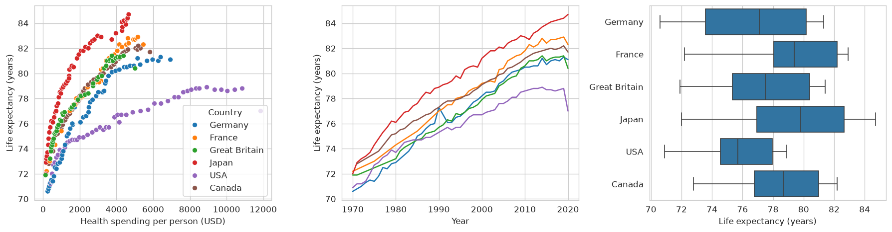

## Watch the Grain

When several rows share an x value, `sns.lineplot()` and `sns.barplot()` draw the **mean** of those rows plus an error band showing its uncertainty, not the rows themselves. The unit displayed silently changes from one reading to an average, so say so in the axis label or title. Lecture 08 builds such summaries explicitly.

### Code Snippet: seaborn Averages Repeated x Values

```python
import pandas as pd
import seaborn as sns

readings = pd.DataFrame({
    'week': [1, 1, 1, 2, 2, 2],
    'patient_id': ['A', 'B', 'C', 'A', 'B', 'C'],
    'systolic_bp': [150, 138, 142, 144, 136, 139],
})
ax = sns.lineplot(data=readings, x='week', y='systolic_bp', errorbar=None)
print(ax.get_lines()[0].get_ydata())  # y-values seaborn drew, one mean per week: [143.33333333 139.66666667]
```

# Density Plots and Distribution Visualization

A histogram counts values in bins, so its shape depends on where the bins start and how wide they are. A **density plot**, or **KDE** (kernel density estimate), instead puts a small smooth bump on every observation and adds them up. Its total area is 1, so the y-axis is **density**, not a count. The bump width is the **bandwidth**: wider bumps smooth more, narrower ones show more detail and more noise.

Fasting glucose readings from a clinic serving people with and without diabetes may show two peaks (**bimodal**), which a single mean or box plot would hide.

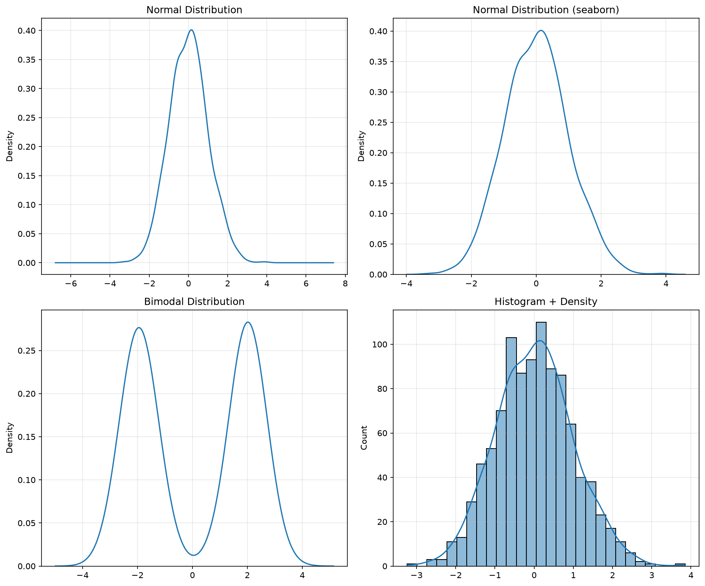

## Density Plots in pandas and seaborn

`df.plot.density()` computes the KDE with SciPy, so it needs `scipy` installed (Colab has it); seaborn's `kdeplot()` and `histplot(kde=True)` work without it.

### Reference Card: Distribution Plots

| Call | Purpose and key arguments | Output |
| :--- | :--- | :--- |
| `df.plot.density()` | Quick KDE for numeric columns (needs SciPy) | `Axes` |
| `sns.histplot(data=df, x='col', kde=True)` | Compare bins with a smooth density estimate | `Axes` |
| `sns.kdeplot(data=df, x='col')` | Show a smoothed distribution alone | `Axes` |
| `sns.kdeplot(..., bw_adjust=0.5)` | Narrower bumps: less smoothing, more detail | `Axes` |

### Code Snippet: Density Comparisons

```python
rng = np.random.default_rng(42)
normal_data = rng.normal(0, 1, 1000)  # mean 0, standard deviation 1
bimodal_data = np.concatenate([       # join two arrays end to end
    rng.normal(-2, 0.5, 500),
    rng.normal(2, 0.5, 500),
])

fig, axes = plt.subplots(1, 3, figsize=(15, 4))

pd.Series(normal_data).plot.density(ax=axes[0], title='Normal (pandas)')

sns.kdeplot(data=bimodal_data, ax=axes[1])
axes[1].set_title('Bimodal (seaborn)')

sns.histplot(data=normal_data, kde=True, ax=axes[2])
axes[2].set_title('Histogram + density')

plt.tight_layout()
plt.show()
```

Expected output: a single-peaked pandas KDE, a two-peaked seaborn KDE with peaks near -2 and 2, and a histogram overlaid with its density curve.

# LIVE DEMO!

# Edward Tufte's Principles of Data Visualization

_Good visualization is like good writing - it should be clear, honest, and serve the reader (or viewer) first._

**"Above all else, show the data."** - Edward Tufte

A chart can get every number right and still mislead. Picture a hospital dashboard showing hand-hygiene compliance of 96% in March and 97% in April, drawn as bars on a y-axis that starts at 95%. The April bar is twice as tall, so readers see compliance double when it rose one point. Nothing in the data is wrong; the drawing is.

Tufte's principles check that the drawing lets the reader make the contract's comparison honestly. They are also the vocabulary you use to critique and redesign a chart in the assignment.

## Five Principles

### Data-Ink Ratio

The **data-ink ratio** is the share of ink (or pixels) that presents data rather than decoration.

```
Data-Ink Ratio = Data-Ink / Total Ink Used
```

Raise it by removing ink that carries no data:

- Remove unnecessary gridlines, or make them subtle
- Use direct labeling instead of a legend when you can
- Avoid 3D effects and shadows, which distort perception
- Remove redundant labels and tick marks

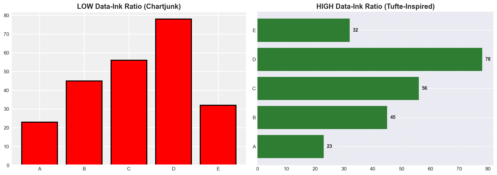

### Chartjunk

**Chartjunk** is non-data ink that competes with the marks: 3D effects, heavy grid lines, decorative fills and patterns, excessive colors, and redundant labels.

### Lie Factor

The **lie factor** measures how much a visualization distorts the data:

```
Lie Factor = (Size of effect shown in graphic) / (Size of effect in data)
```

A lie factor close to 1.0 means no distortion. In the hand-hygiene dashboard, the April bar grows 100% (from 1 to 2 units above the 95% baseline) while compliance grows about 1% (96 → 97), so the lie factor is roughly 100 / 1.04 ≈ 96.

Common distortions to avoid:

- Axis limits that hide context or exaggerate differences. Bars need a zero baseline because length encodes magnitude; a line chart need not start at zero, but its range and any axis break must be clear and appropriate to the question.
- 3D perspective that distorts area/volume comparisons
- Inconsistent scales
- Cherry-picked time ranges

### Small Multiples

Use small, repeated charts with the same scale to enable easy comparison across categories or time; `sharey=True` from the pandas section does this.

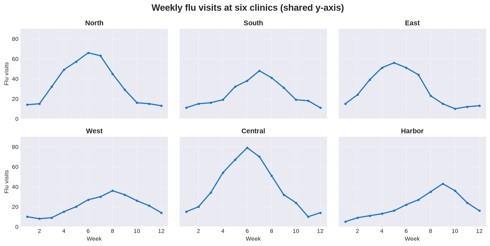

### Show the Detail

Show as much detail as the data allows; don't oversimplify or aggregate unnecessarily. Tufte calls these high-resolution data graphics.

### Reference Card: Tufte's Checks

| Check | Ask | Typical remedy |
| :--- | :--- | :--- |
| **Data-ink** | Does every prominent mark carry information? | Remove decoration, heavy grids, and redundant labels |
| **Lie factor** | Does visual effect size match the data effect? | Use honest limits, units, and an appropriate baseline |
| **Small multiples** | Are repeated groups comparable? | Keep scale and encoding consistent across panels |
| **Resolution** | Did aggregation hide meaningful variation? | Show raw points or label the summary clearly |

## Before/After Examples: Applying Tufte's Principles

### Example 1: Bar Chart Redesign

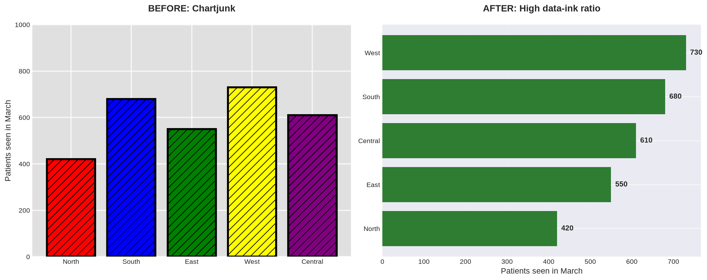

### Example 2: Line Chart with Truncated Axis (Lie Factor)

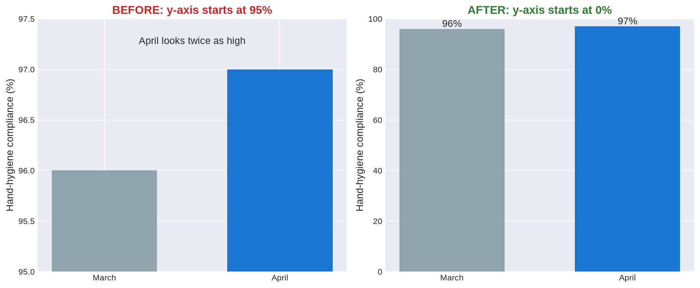

## Color Palette Best Practices

Match the palette to the data type:

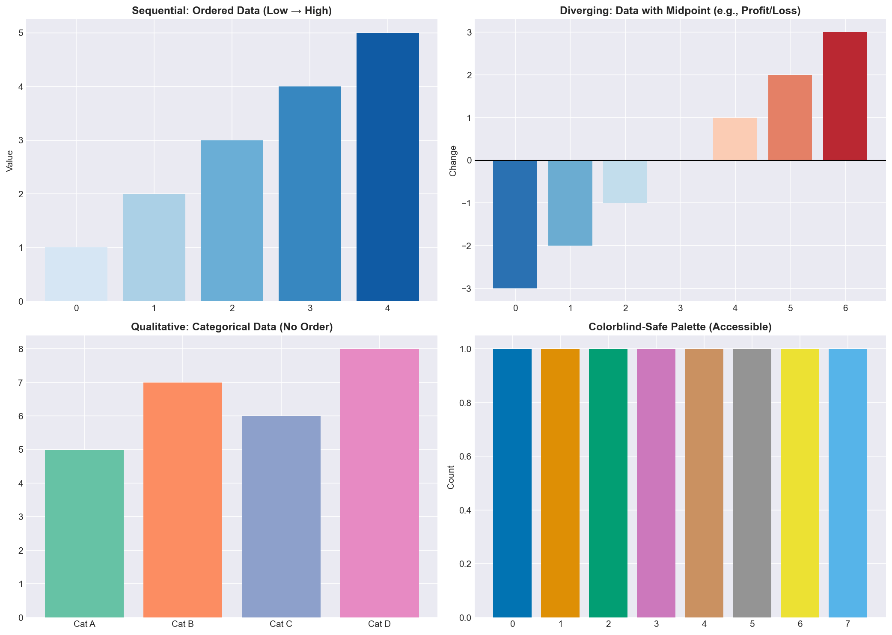

- **Sequential:** ordered data (temperature, age, income) - single hue gradient
- **Diverging:** data with a meaningful midpoint (profit/loss, correlation) - two contrasting hues
- **Qualitative:** categories with no inherent order - distinct, unrelated colors

## Make the chart accessible

An accessible chart is designed so more readers can recover its comparison.

- Use readable type, complete labels, and adequate contrast against the background.
- Use a colorblind-safe palette, tested with a tool such as [ColorBrewer](https://colorbrewer2.org/), but do not treat palette choice as the whole task.
- Add redundant encoding when color distinguishes important categories.
- Prefer direct labels or a clearly associated legend over a distant decoding task.
- Do not rely on hover interaction to reveal essential values.
- Provide a concise **text alternative** or caption that states the chart type, axes, main pattern, and a relevant limitation.

Example text alternative:

> Line chart of mean prepared score by study round for standard and guided programs. Both rise across five rounds; the guided series rises from 61 to 79 and finishes seven points above the standard series. These are descriptive prepared summaries and do not establish a causal program effect.

### Reference Card: Redundant Cues for Bars and Lines

- `ax.plot(x, y, color=..., marker='o', linestyle='-')`: Pair each line color with its own marker and line style.
- `x = np.arange(n)`: One position per category group (Lecture 03); `ax.set_xticks(x, labels)` names the positions.
- `ax.bar(x - width / 2, heights, width, label=..., hatch='//')`: Draw one set of side-by-side bars, shifted left by half a bar width. A fill pattern (**hatch**) such as `'//'` or `'..'` keeps groups distinguishable in grayscale; because it encodes the group, it is data ink, not chartjunk.
- `ax.bar_label(bars, fmt='%d%%')`: Write each bar's value on it, such as `64%`; `bars` is what `ax.bar()` returns.
- `ax.set_ylim(0, 100)`: Start bar axes at zero, because bar length encodes magnitude.

### Code Snippet: Redundant Cues on a Line Chart

The text alternative above describes this chart: color is reinforced with marker shape, line style, and direct labels, so the comparison never depends on color alone.

```python
import matplotlib.pyplot as plt

rounds = [1, 2, 3, 4, 5]
standard = [60, 62, 65, 68, 72]
guided = [61, 65, 70, 74, 79]

fig, ax = plt.subplots(figsize=(8, 5))
ax.plot(rounds, standard, color='#E69F00', marker='s', linestyle='--')
ax.plot(rounds, guided, color='#0072B2', marker='o', linestyle='-')

ax.text(5.08, standard[-1], 'Standard', va='center')
ax.text(5.08, guided[-1], 'Guided', va='center')
ax.set(xlabel='Study round', ylabel='Mean prepared score',
       title='Guided program finishes 7 points higher by round 5')
ax.set_xticks(rounds)
ax.set_xlim(1, 5.7)
ax.grid(axis='y', alpha=0.25)
fig.tight_layout()
plt.show()
```

Expected output: two rising lines labeled at their right ends, orange dashed squares for Standard (ending at 72) and blue solid circles for Guided (ending at 79), with no legend needed.

### Code Snippet: Grouped Bars That Work in Grayscale

```python
import matplotlib.pyplot as plt
import numpy as np

seasons = ['2023-24', '2024-25']
north = [58, 64]
south = [55, 58]
x = np.arange(len(seasons))  # [0 1]: one position per season
width = 0.35

fig, ax = plt.subplots(figsize=(6, 4))
north_bars = ax.bar(x - width / 2, north, width, label='North', color='#0072B2', hatch='//')
south_bars = ax.bar(x + width / 2, south, width, label='South', color='#D55E00', hatch='..')
ax.bar_label(north_bars, fmt='%d%%')
ax.bar_label(south_bars, fmt='%d%%')
ax.set_xticks(x, seasons)
ax.set(ylim=(0, 100), xlabel='Flu season', ylabel='Adults vaccinated (%)')
ax.legend(title='Clinic', loc='upper left', bbox_to_anchor=(1, 1), frameon=False)
plt.show()
```

Expected output: two pairs of bars rising from 0, labeled 58% and 55% for 2023-24 and 64% and 58% for 2024-25. North's bars are striped and South's dotted, and the legend sits just outside the right edge.

# Altair: Declarative Charts and Interaction

Altair is **declarative**: you describe _what_ the chart shows and Altair works out _how_ to draw it, like ordering from a menu instead of cooking; matplotlib gives drawing steps one at a time. An Altair chart is **data → mark → typed encodings**; it becomes a **Vega-Lite specification**, a JSON document a browser renders and you can save and share. Each field carries a type letter from the contract's data types: categorical → `:N` (nominal), ordinal → `:O`, quantitative → `:Q`, temporal → `:T`.

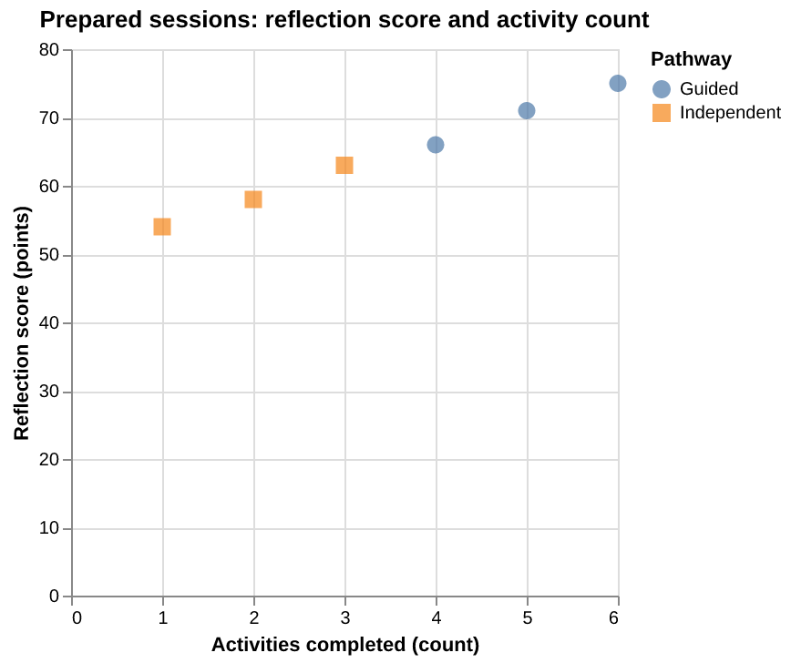

## Data, Mark, and Typed Encodings

### Reference Card: Altair chart construction

| Task | Call | Purpose / arguments | Result |
| :--- | :--- | :--- | :--- |
| Build | `alt.Chart(study)` | Supply the source DataFrame | Chart to configure |
| Build | `.mark_point(filled=True, size=90)` | Choose filled points and their area; `.mark_bar()` and `.mark_line()` draw bars or lines | Chart with marks |
| Build | `.properties(title=..., width=360, height=260)` | Add a visible title and set size in pixels | Chart |
| Encode | `.encode(x='field:Q', color='group:N')` | Map quantitative and categorical fields to visible properties | Encoded chart |
| Encode | `alt.X('field:Q', title='Label (unit)')` | Set an axis title with its unit (also `alt.Y`) | Encoding channel |
| Encode | `alt.Color('group:N', sort=['A', 'B'])` | Fix category and legend order (also for `alt.Shape`); `legend=None` hides the legend | Encoding channel |
| Encode | `y='mean(field):Q'` | Let Altair average rows per x category; the unit becomes one summary per group | Aggregated encoding |
| Interact | `.encode(tooltip=['field:Q'])` | Choose values shown on hover | Chart with tooltips |
| Interact | `alt.Tooltip('field:Q', title=..., format='.1f')` | Name and format a tooltip value | Tooltip channel |
| Interact | `.interactive()` | Add scale-bound pan/zoom interaction | Interactive chart |
| Compose | `alt.hconcat(left, right)` | Place two charts side by side | Compound chart |

### Code Snippet: Encode the study table

```python
import altair as alt
import pandas as pd

study = pd.DataFrame({
    'activities_completed': [1, 2, 3, 4, 5, 6],
    'reflection_score': [54, 58, 63, 66, 71, 75],
    'pathway': ['Independent', 'Independent', 'Independent',
                'Guided', 'Guided', 'Guided'],
})

scatter = alt.Chart(study).mark_point(filled=True, size=90).encode(
    x=alt.X('activities_completed:Q', title='Activities completed (count)'),
    y=alt.Y('reflection_score:Q', title='Reflection score (points)'),
    color=alt.Color('pathway:N', title='Pathway'),
    shape=alt.Shape('pathway:N', title='Pathway'),
    tooltip=['activities_completed:Q', 'reflection_score:Q', 'pathway:N'],
).properties(title='Prepared sessions: reflection score and activity count')

scatter.interactive()
```

The color-plus-shape encodings identify the pathways redundantly. Tooltips and `.interactive()` help a reader inspect or zoom, but the title, axes, legend, and main comparison must stay visible without hover. `alt.hconcat(left, right)` and `alt.vconcat(top, bottom)` compose two already honest charts, as the last demo does.

Altair does not replace the contract: state grain and roles first, choose truthful scales and marks, add redundant cues, and supply a text alternative for the shared view.

## Save the Chart and Its Record

Saving a chart as JSON keeps the Vega-Lite specification and its rows together, so anyone with the file can render the same chart. The standard-library `json` module saves what you keep beside it: the contract and the text alternative.

### Reference Card: Saving Charts and Records

| Call | Purpose / arguments | Result |
| :--- | :--- | :--- |
| `chart.save('chart.json')` / `chart.save('chart.html')` | Write the Vega-Lite spec (data embedded) or a web page | File |
| `chart.to_dict()` | Return the same spec as a Python dictionary | `dict` |
| `json.dump(obj, file, indent=2, ensure_ascii=False)` | Write a dict or list as readable JSON; `ensure_ascii=False` keeps characters such as é unescaped. It does not end the file with a newline; call `file.write('\n')` afterward if one is required | JSON file |
| `json.load(file)` | Read a JSON file back | `dict` or `list` |

### Code Snippet: Save the Chart Specification

```python
scatter.save('study_scatter.json')  # Vega-Lite JSON with the six rows embedded
spec = scatter.to_dict()            # the same specification as a Python dict
print(spec['mark'])                 # {'type': 'point', 'filled': True, 'size': 90}
```

### Code Snippet: Save a Chart Record as JSON

`open()` and `with` come from Lecture 02; `json.dump()` also accepts the dictionary `chart.to_dict()` returns.

```python
import json

chart_record = {
    'question': 'Do guided sessions show higher reflection scores at similar activity counts?',
    'grain': 'one prepared learning session',
    'text_alternative': 'Scatter plot of reflection score (points) against activities completed for six prepared sessions.',
}
with open('study_record.json', 'w', encoding='utf-8') as file:
    json.dump(chart_record, file, indent=2, ensure_ascii=False)

with open('study_record.json', encoding='utf-8') as file:
    saved = json.load(file)
print(saved['grain'])  # one prepared learning session
```

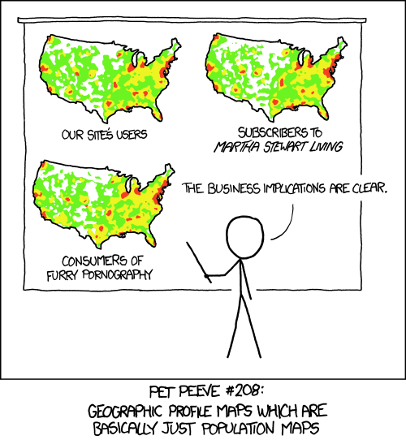

# LIVE DEMO!
