---
notion:
  title_line: "# Data Visualization: From Exploration to Communication"
  role: lecture
  status: mapped
  page_id: "29ad9fdd-1a1a-803c-a031-f791f9043193"
  url: "https://app.notion.com/p/29ad9fdd1a1a803ca031f791f9043193"
---

# Data Visualization: From Exploration to Communication

See [BONUS.md](BONUS.md) for the optional extensions.

**Live notebooks in Colab:** [Demo 1](https://colab.research.google.com/github/christopherseaman/datasci_217/blob/main/07/demo/demo1_matplotlib_basics.ipynb) · [Demo 2](https://colab.research.google.com/github/christopherseaman/datasci_217/blob/main/07/demo/demo2_seaborn_statistical.ipynb) · [Demo 3](https://colab.research.google.com/github/christopherseaman/datasci_217/blob/main/07/demo/demo3_pandas_altair.ipynb)

**Run locally:**

```shell
curl -fsSL https://raw.githubusercontent.com/christopherseaman/datasci_217/main/07/demo/setup_demo.sh | sh
cd ~/07-demo
uv venv --seed
source .venv/bin/activate
uv sync
```

→ Then open the `07-demo` folder in VS Code.

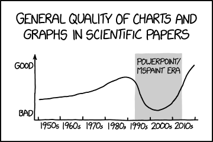

This lecture covers:

- McKinney, _Python for Data Analysis_ (3rd ed.):
    - 5.3 (correlation)
    - 6.1 (JSON data)
    - 9.1 (the matplotlib API: figures and subplots; colors, markers, and line styles; ticks, labels, and legends; annotations; saving plots to file)
    - 9.2 (line, bar, histogram, density, and scatter plots with pandas and seaborn)
    - 9.3 (other Python visualization tools)
- Tufte, _The Visual Display of Quantitative Information_ (2nd ed.):
    - Chapter 2 (graphical integrity)
    - Chapter 4 (data-ink)
    - Chapter 5 (chartjunk)
    - Chapter 8 (small multiples)

# Start with a visualization contract

- **Visualization contract**: a few statements, written before any plotting code, about what a chart must let its reader compare (the reference card below lists them).
- It decides which values become positions, lengths, and colors, so the chart answers a real question, such as which clinic's blood pressure changed, instead of showing whatever the default plot draws.

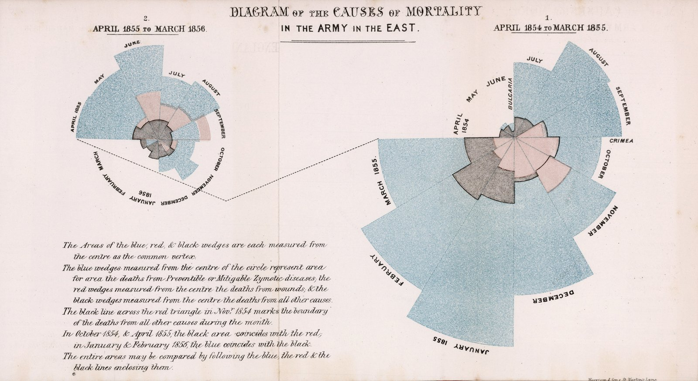

## State the unit and grain shown

- **Unit displayed**: what one mark in the chart represents, as a table's grain (Lecture 06) is what one row represents.
- **Plotting table**: a table whose rows match the marks you want to draw.

| Plotting table | One row is | One mark is | Question it can answer |
| --- | --- | --- | --- |
| Patient visits | One blood-pressure reading at one visit | One point | How much do individual readings vary? |
| Clinic summary | One clinic in one month | One bar or line point | Which clinic's average changed more? |

## Separate data type from role

- **Data type**: what a variable's values mean and which operations make sense.
    - **Categorical**: named groups.
    - **Quantitative**: numeric magnitudes where arithmetic is meaningful.
    - **Ordinal**: categories with a meaningful order.
    - **Temporal**: dates or times, whose order and spacing may matter.
- **Role**: the job a variable does in this chart: the measure compared, the grouping, the observation order, or an **identifier** that labels or links records.
- One data type can play different roles in different charts, so record both before choosing x, y, or color.

## Separate exploratory and explanatory work

- **Exploratory visualization**: inspects patterns, distributions, or surprises while the question is still forming; quick, but still with truthful scales and labels.
- **Explanatory visualization**: communicates one finding to a named audience; drops irrelevant alternatives, adds annotation, and uses a title that states what to notice without overstating the evidence.

## Think in marks and encodings

- **Mark**: a visible object such as a point, line, or rectangle.
- **Encoding**: maps a data value to a visible property: position, length, color, marker shape, or line style.
- Position along a common scale supports more precise comparison than area or volume.
- **Redundant encoding**: a second cue, such as marker shape, line style, or a direct label, paired with color. Color alone fails readers who cannot tell the hues apart and disappears in grayscale printing.

## Write the contract down

### Reference Card: Visualization Contract

| Question | What to record | Useful output |
| :--- | :--- | :--- |
| **Question** | The comparison or pattern the reader should inspect | One-sentence chart claim |
| **Audience and claim** | Who reads it and the one descriptive conclusion it supports; a visible pattern does not show why it occurred | Appropriate labels, title, and annotation |
| **Unit and grain** | What one mark and one plotting-table row represent | A defensible aggregation level |
| **Variable role** | Type plus role: measure, group, time, or identifier | Candidate x, y, color, or shape encoding |
| **Accessibility** | A redundant cue and text alternative for the main comparison | A chart usable without color or hover |

### Code Snippet: Storage dtype Is Not Visualization Type

A pandas dtype records how values are stored; the visualization data type records what they mean.

```python
visits = pd.DataFrame({
    'patient_id': [101, 101, 102, 102],
    'clinic': ['North', 'North', 'South', 'South'],
    'visit_month': [1, 2, 1, 2],
    'systolic_bp': [142, 136, 128, 131],
})
display(visits.dtypes)
```

|  | value |
| --- | --- |
| patient_id | int64 |
| clinic | str |
| visit_month | int64 |
| systolic_bp | int64 |

- Only `systolic_bp` (mmHg) is a quantitative measure.
- `patient_id` is an identifier (its average means nothing), `visit_month` is temporal, and `clinic` is categorical.
- One row is one visit, so one scatter point is one visit.

## The Right Chart for the Job

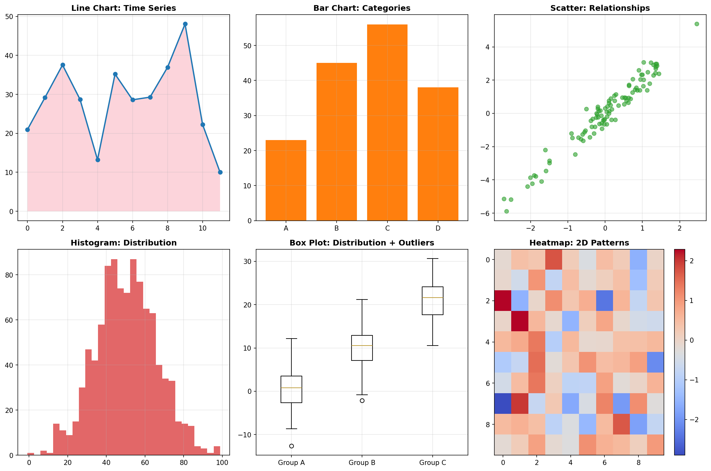

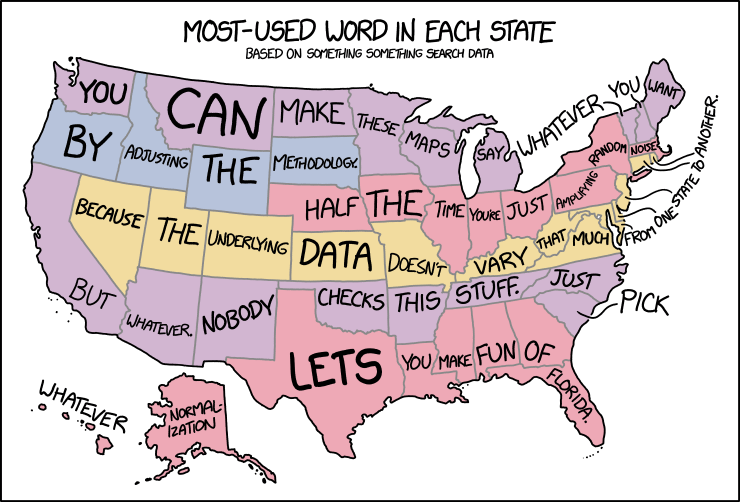

# matplotlib: Foundation Layer

- **matplotlib**: Python's foundational plotting library; you build a chart step by step, placing each mark, label, and legend yourself.
- pandas and seaborn draw through it, so the matplotlib methods in this section adjust their charts too.

## Figures and Subplots

- **Figure**: the whole canvas, the image you display or save with `fig.savefig()`.
- **Axes**: one plotting area on that canvas, with its own x-axis, y-axis, title, and marks; not the plural of "axis".
- `fig, ax = plt.subplots()` creates both; Axes methods such as `ax.plot()` and `ax.set_xlabel()` draw on them.
- `plt.subplots(rows, cols)` returns the Axes in a NumPy array: one row of panels gives a 1-D array (`axes[0]`), a grid a 2-D array (`axes[0, 1]` is row 0, column 1).

```text
Figure (fig)
├── Axes axes[0]  ← its own title, labels, lines, bars
└── Axes axes[1]  ← its own scales
```

### Reference Card: Figures and Subplots

| Call | Purpose and key arguments | Output |
| :--- | :--- | :--- |
| `import matplotlib.pyplot as plt` | Load pyplot under its standard alias; the snippets below also assume `import numpy as np` and `import pandas as pd` | `plt` |
| `plt.subplots(rows, cols, figsize=(w, h))` | Create a figure and a grid of Axes, with dimensions in inches | `Figure` plus one Axes or an array of Axes |
| `plt.figure(figsize=(w, h))` | Create an empty figure (pyplot shortcut style) | `Figure` |
| `plt.plot()`, `plt.title()`, `plt.xlabel()` | Pyplot shortcuts for `ax.plot()`, `ax.set_title()`, `ax.set_xlabel()` on whichever Axes is current: fine for a sketch, confusing with several panels | Updated current Axes |
| `fig.add_subplot(rows, cols, position)` | Add one Axes to an existing figure | `Axes` |
| `fig.tight_layout()` / `plt.tight_layout()` | Adjust spacing so titles and labels do not overlap | Rearranged figure |
| `plt.show()` | Render the figure in an interactive session | Displayed figure |

### Code Snippet: What `plt.subplots()` Returns

```python
fig, axes = plt.subplots(1, 2, figsize=(8, 3))
print(type(fig))
print(axes.shape)
print(type(axes[0]))
```

```text
<class 'matplotlib.figure.Figure'>
(2,)
<class 'matplotlib.axes._axes.Axes'>
```

## Draw Marks on an Axes

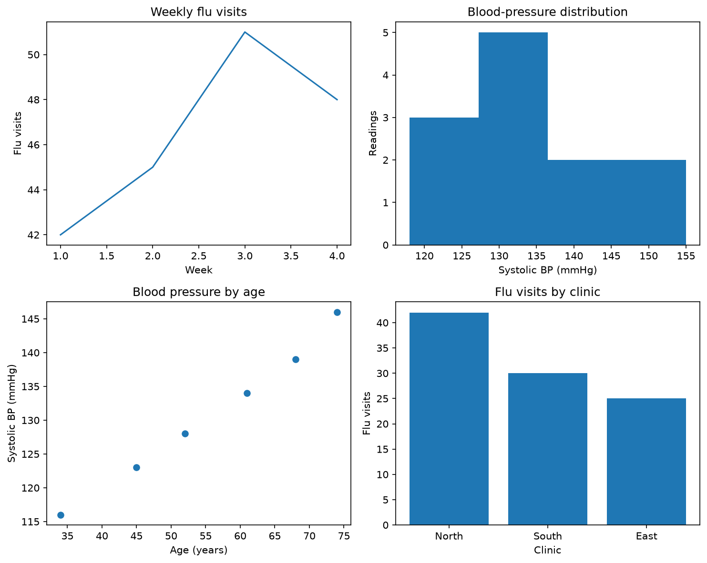

### Reference Card: Axes Plotting Methods

- `ax.plot(x, y)`: Draw a line through the points in order; use for trends over an ordered x such as time.
- `ax.scatter(x, y, alpha=0.6)`: Draw one point per observation; `alpha` (0 to 1) makes overlapping points see-through.
- `ax.bar(categories, heights)`: Draw one bar per category, starting at zero.
- `ax.hist(values, bins=30)`: Count values in 30 equal-width bins and draw one bar per bin.
- `ax.boxplot([group_a, group_b], tick_labels=['A', 'B'])`: Draw the median, quartiles, and outliers of each group.
- `ax.set(title=..., xlabel=..., ylabel=...)`: Name the comparison and label each axis with its measurement unit.

### Code Snippet: Draw a Line

The snippets here use an existing `ax` (one Axes). `weeks` is `[1, 2, 3, 4]` and `north` is `[42, 45, 51, 48]` flu visits.

```python
ax.plot(weeks, north)
```

Expected result: four points joined in week order, highest at week 3.

### Code Snippet: Count Readings in Bins

`pressures` holds twelve readings in mmHg: `[118, 124, 126, 129, 131, 133, 134, 136, 139, 142, 147, 155]`.

```python
ax.hist(pressures, bins=4)
```

Expected result: four bars with counts 3, 5, 2, and 2.

## Customizing Plots

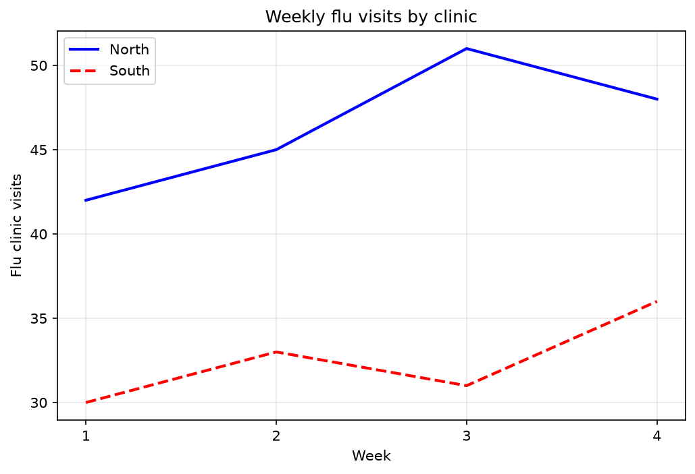

### Reference Card: Axes Customization

| Call | Purpose and key arguments | Output |
| :--- | :--- | :--- |
| `ax.set(title=..., xlabel=..., ylabel=...)` | Set visible context for the reader | Updated `Axes` |
| `ax.set_title(text)`, `ax.set_xlabel(text)`, `ax.set_ylabel(text)` | Set one label at a time | Updated `Axes` |
| `ax.set_xlim(left, right)` / `ax.set_ylim(bottom, top)` | Control displayed ranges; use deliberately | Updated limits |
| `ax.get_ylim()` / `ax.get_xlim()` | Read the current limits back to check what a chart shows; `bottom, top = ax.get_ylim()` unpacks them | Two numbers: bottom and top |
| `ax.set_xticks(positions, labels)` | Choose where ticks sit and, optionally, what they say | Updated ticks |
| `ax.tick_params(axis='x', rotation=45)` | Turn the tick labels on one axis so long category names stop overlapping; `labelsize=` shrinks them instead | Updated tick labels |
| `ax.grid(axis='y', alpha=0.3)` | Add restrained reference lines | Updated `Axes` |
| `ax.legend()` | Decode labeled series when direct labels are not enough | Legend artist |
| `plt.style.use(name)` | Apply a named style before creating figures | Global style setting |

### Code Snippet: Label the Comparison

On the weekly flu-visits chart:

```python
ax.set(title='Weekly flu visits by clinic', xlabel='Week', ylabel='Flu clinic visits')
```

Expected result: a visible title and unit-bearing axis labels. A line drawn with `label='North'` is named North in `ax.legend()`.

## Colors, Markers, and Line Styles

Each series can combine a color, a marker, and a line style, which keeps lines distinguishable even in grayscale.

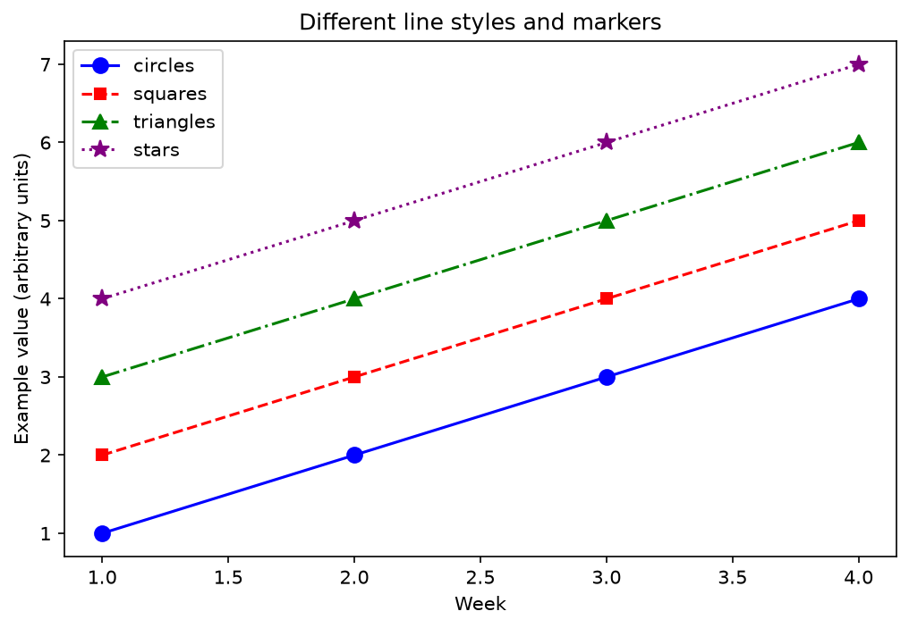

### Reference Card: Colors, Markers, and Line Styles

| Property | Examples | Use |
| :--- | :--- | :--- |
| **Color** | `'steelblue'`, `'#0072B2'`, `(0.1, 0.2, 0.5)` | Distinguish categories or encode magnitude |
| **Line style** | `'-'`, `'--'`, `'-.'`, `':'` | Reinforce series identity or meaning; set thickness with `linewidth=` |
| **Marker** | `'o'`, `'s'`, `'^'`, `'*'` | Reinforce category identity and show observations; set size with `markersize=` |
| **Format string** | `'o-'`, `'s--'` | Shorthand for marker + line style: `'o--'` equals `marker='o', linestyle='--'` |

### Code Snippet: Reinforce a Series with Shape and Dashes

```python
ax.plot(weeks, north, 's--', color='#0072B2', markersize=6, label='North')
```

Expected result: blue squares joined by a dashed line, readable in grayscale.

## Annotate, Declutter, and Save

- **Annotation**: text attached to a data point, often with an arrow, so the reader of an explanatory chart finds its one point without hunting.
- **Spines**: the frame lines; the top and right ones carry no data, so hiding them leaves more attention for the marks.
- `fig.savefig()` writes the whole Figure to a file whose extension picks the file type.

### Reference Card: Annotate, Declutter, and Save

- `ax.annotate(text, xy=(x, y), xytext=(x2, y2), arrowprops=dict(arrowstyle='->'))`: Put `text` at `xytext` with an arrow pointing to the data point `xy`. Add `color=` for the text, and a `color=` inside `arrowprops` for the arrow.
- `ax.text(x, y, text, va='center')`: Put text at a point with no arrow, such as a direct line label; `va=` (vertical alignment) and `ha=` (horizontal alignment) set which part of the text sits on that point.
- `ax.spines[['top', 'right']].set_visible(False)`: Hide the two frame lines that carry no data.
- `ax.legend(title='Clinic', loc='upper left', bbox_to_anchor=(1, 1), frameon=False)`: Place a legend headed Clinic just outside the right edge, without a box. With `loc=` alone, such as `loc='lower right'`, the legend stays inside the Axes in that corner.
- `fig.savefig('chart.png', dpi=150, bbox_inches='tight')`: Save a PNG at 150 dots per inch; `bbox_inches='tight'` trims extra margin so labels are not cut off. Use `.svg` or `.pdf` for vector output.

### Code Snippet: Point to the Peak

On the existing North chart, week 3 has 51 visits:

```python
ax.annotate('Peak: 51 visits', xy=(3, 51), xytext=(1.5, 55),
            arrowprops=dict(arrowstyle='->'))
```

Expected result: text above the line, with an arrow ending at the week-3 point.

### Code Snippet: Save the Figure

```python
fig.savefig('flu_visits.png', dpi=150, bbox_inches='tight')
```

Expected result: `flu_visits.png` contains the whole Figure, including its labels and annotation.

<callout icon="⚠️" color="yellow_bg">
	## Save before `plt.show()`
	`plt.show()` closes the figure, so a `plt.savefig()` after it saves a blank PNG.
</callout>

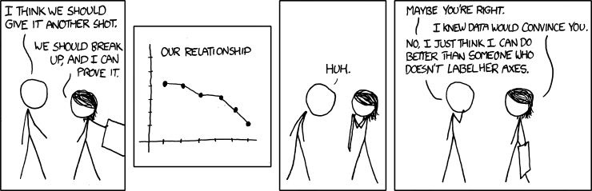

# LIVE DEMO!

[Open Demo 1 in Colab](https://colab.research.google.com/github/christopherseaman/datasci_217/blob/main/07/demo/demo1_matplotlib_basics.ipynb)

# The Visualization Ecosystem

- **Plotting backend**: the engine that does the drawing. matplotlib draws images from Python; **Vega-Lite** draws charts in a web browser.
- Libraries that share a backend share its output files and its adjustments, so choose a library by the job: a quick look, full control, statistical summaries, or an interactive web chart.

```text
matplotlib ← pandas .plot() (default backend)
           ← seaborn
           ← plotnine

Vega-Lite  ← Altair

Arrows mean “renders through,” not a required learning order.
```

## Choosing the Right Tool

### Reference Card: Choosing a Plotting Tool

| Tool | Reach for it when | Draws through | Typical output |
| --- | --- | --- | --- |
| pandas `.plot()` | You want a first look at a DataFrame | matplotlib | `Axes` |
| matplotlib | You need full control or a publication figure | itself | `Figure`/`Axes`; PNG, SVG, PDF |
| seaborn | You want statistical plots from long data, with groups shown by color (`hue=`) | matplotlib | `Axes` |
| Altair | You want encodings that state each column's data type, hover tooltips, or a chart for a web page or JSON file | Vega-Lite | Altair `Chart` object; HTML, JSON |

# pandas: Quick Data Exploration

- **pandas plotting**: `df.plot()` draws a DataFrame in one call, the fastest first look at a table you have just loaded.
- It draws through matplotlib and returns an `Axes`, so matplotlib methods still work afterward, and `ax=` draws into one panel of a `plt.subplots()` grid.


## Index to x, Columns to Series

pandas hands the data to matplotlib using two rules:

- The **index** becomes the x-axis.
- Each numeric **column** becomes one series (a line, a set of bars, ...), and the column names fill the legend.

<callout icon="⚠️" color="yellow_bg">
	## Set the index before `df.plot()`
	Otherwise the x-axis shows row numbers and a `week` column is drawn as one more line: run `set_index('week')` first.
</callout>

`weekly` is indexed by weeks 1 to 4, with North counts `[42, 45, 51, 48]` and South counts `[30, 33, 31, 36]`.

### Code Snippet: The Index Becomes the x-Axis

```python
ax = weekly.plot(marker='o', ylabel='Flu clinic visits', title='Weekly visits by clinic')
print(ax.get_xlabel())  # week
```

Expected output: two lines, one per clinic, with `week` on the x-axis and a legend reading North and South.

## Plot Kinds

- `kind=` picks the mark, so one table gives many views.
- **Pearson correlation**: how two columns relate, as a number from `-1` (one rises as the other falls) through `0` (no straight-line link) to `1` (both move the same way). It measures straight-line association only, not causation.
- **Correlation matrix**: `df.corr()` gives the correlation of every pair of selected columns.
- Select the numeric columns yourself: a text column of words raises `ValueError`, but text that parses as numbers, such as zero-padded patient IDs or ZIP codes, is correlated silently as though it were a measurement.

### Reference Card: pandas Plotting and Correlation

| Call | Purpose and key arguments | Output |
| :--- | :--- | :--- |
| `df.plot()` | Line plot: index on x, one line per numeric column | `Axes` |
| `df.plot(ax=axes[0, 1])` | Draw into an existing Axes instead of a new figure | That Axes |
| `df.plot(kind='bar')` | Compare values across categories | `Axes` |
| `df.plot(kind='hist', bins=...)` | Inspect numeric distributions | `Axes` |
| `df.plot(kind='scatter', x='col1', y='col2')` | Inspect a two-variable relationship | `Axes` |
| `df.plot(kind='box')` | Compare distributions and outliers | `Axes` |
| `df.plot(kind='pie', y='col')` | Show nonnegative values as parts of their total | `Axes` |
| `df.plot.bar()`, `df.plot.hist()` | Same as `kind='bar'` / `kind='hist'`; `df.plot.density()` below uses this form | `Axes` |
| `corr = df[['age', 'bmi']].corr()` | Correlation matrix of the listed columns; `method=` also accepts `'spearman'` and `'kendall'` | Square `DataFrame`, `1.0` down the diagonal; a column with nothing to vary (one repeated value, or only one non-missing value) is `NaN` throughout |
| `corr.to_csv(path, index=True, index_label='feature')` | Write a frame whose row labels are data, not row numbers: `index=True` keeps them and `index_label=` names the column they land in | CSV file whose first column is headed `feature` |

### Code Snippet: Change the Plot Kind

```python
weekly.plot(kind='bar', ylabel='Flu visits')
```

Expected result: one pair of bars per week, starting at zero.

### Code Snippet: A Correlation Matrix

```python
display(weekly[['North', 'South']].corr())
```

|  | North | South |
| --- | --- | --- |
| North | 1.00000 | 0.29277 |
| South | 0.29277 | 1.00000 |

## DataFrame Plotting Options

### Reference Card: DataFrame Plot Options

| Option | Purpose and arguments | Output |
| :--- | :--- | :--- |
| `subplots=True` | Give each selected column its own Axes | Array of `Axes` |
| `sharey=True` | Give every subplot the same y-scale so panels are comparable | Shared limits |
| `figsize=(width, height)` | Set figure dimensions in inches | Larger or smaller figure |
| `title=...`, `xlabel=...`, `ylabel=...` | Add reader-facing context | Labeled plot |
| `legend=True`, `grid=True` | Decode series or add restrained guides | Updated `Axes` |

One panel per group, same y-scale:

```text
North panel ┐
South panel ├── same y-scale: a higher line means a higher count
East panel  ┘
```

### Code Snippet: Separate Groups on a Shared Scale

`monthly` has a month index and three visit-count columns: North, South, and East.

```python
axes = monthly.plot(subplots=True, sharey=True, ylabel='Visits')
```

Expected result: three stacked panels with matching y-limits.

# seaborn: Statistical Graphics

- **seaborn**: draws statistical graphics from a long DataFrame in one call, computing summaries such as group means for you.
- You pass column names and seaborn maps each to an encoding, so the contract becomes code: `sns.scatterplot(data=visits, x='visit_month', y='systolic_bp', hue='clinic')` is one point per visit, month across, blood pressure up, clinic by color.

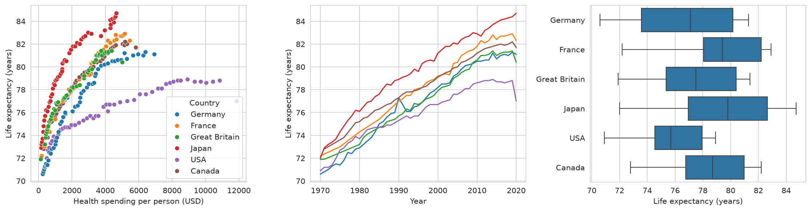

## Statistical Plots from Long Data

Each plotting function below takes the DataFrame as `data=` and column names for `x=`, `y=`, and `hue=` (one color per category), returns an `Axes`, and accepts `ax=`.

### Reference Card: seaborn Statistical Graphics

| Call | Purpose and key arguments | Output |
| :--- | :--- | :--- |
| `import seaborn as sns` | Load seaborn under its standard alias, which the snippets assume | `sns` |
| `sns.load_dataset(name)` | Download a small example table, such as `'healthexp'` (needs internet) | `DataFrame` |
| `sns.set_style(name)` / `sns.set_palette(name)` | Set defaults for readable plots | Updated seaborn defaults |
| `sns.scatterplot(data=df, x=..., y=..., hue=...)` | Show relationships and optional groups | `Axes` |
| `sns.lineplot(data=df, x=..., y=..., hue=...)` | Show ordered trends; averages rows that share an x value | `Axes` |
| `sns.barplot(data=df, x=..., y=..., hue=...)` | One bar per category showing the mean of y, with an error bar | `Axes` |
| `sns.histplot(data=df, x=..., kde=True)` | Show distribution, optionally with density | `Axes` |
| `sns.boxplot(data=df, x=..., y=...)` | Compare distributions and outliers | `Axes` |
| `sns.heatmap(data=df, annot=True)` | Encode a wide table of numbers (index as rows, columns as columns) as color; `annot=True` writes each value in its cell | `Axes` |
| `sns.heatmap(corr, annot=True, cmap='RdBu_r', center=0, vmin=-1, vmax=1)` | Color a correlation matrix with two hues that meet at 0: blue for negative, white near 0, red for positive, over the full range from -1 to 1 | `Axes` |
| `errorbar=None` | Hide the error band or bar on lineplot/barplot | Updated `Axes` |

### Code Snippet: Load a Teaching Dataset

```python
health = sns.load_dataset('healthexp')
```

Expected result: 274 rows and four columns (`Year`, `Country`, `Spending_USD`, `Life_Expectancy`).

### Code Snippet: Encode country-year observations

```python
ax = sns.scatterplot(data=health, x='Spending_USD', y='Life_Expectancy',
                     hue='Country', style='Country')
ax.set(xlabel='Health spending per person (USD)', ylabel='Life expectancy (years)')
```

Each point is one country-year; country uses both color and shape.

## Watch the Grain

- When several rows share an x value, `sns.lineplot()` and `sns.barplot()` draw the **mean** of those rows plus an error band showing its uncertainty, not the rows themselves.
- The unit displayed silently changes from one reading to an average, so say so in the axis label or title.

### Code Snippet: seaborn Averages Repeated x Values

```python
readings = pd.DataFrame({
    'week': [1, 1, 1, 2, 2, 2],
    'patient_id': ['A', 'B', 'C', 'A', 'B', 'C'],
    'systolic_bp': [150, 138, 142, 144, 136, 139],
})
ax = sns.lineplot(data=readings, x='week', y='systolic_bp', errorbar=None)
print(ax.get_lines()[0].get_ydata())  # y-values seaborn drew, one mean per week: [143.33333333 139.66666667]
```

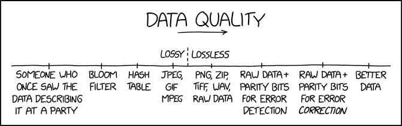

# Density Plots and Distribution Visualization

- **Density plot**, or **KDE** (kernel density estimate): a distribution drawn as a smooth curve by putting a small bump on every observation and adding them up, so its shape does not depend on where histogram bins start.
- It shows shapes a mean or box plot hides, such as the two peaks (**bimodal**) of fasting glucose in a clinic that serves people with and without diabetes.


## Density Plots in pandas and seaborn

- The curve's total area is 1, so the y-axis is **density**, not a count.
- **Bandwidth**: the bump width; wider bumps smooth more, narrower ones show more detail and more noise.
- `df.plot.density()` needs `scipy` installed (Colab has it); seaborn's `kdeplot()` and `histplot(kde=True)` work without it.

### Reference Card: Distribution Plots

| Call | Purpose and key arguments | Output |
| :--- | :--- | :--- |
| `df.plot.density()` | Quick KDE for numeric columns (needs SciPy) | `Axes` |
| `sns.histplot(data=df, x='col', kde=True)` | Compare bins with a smooth density estimate | `Axes` |
| `sns.kdeplot(data=df, x='col')` | Show a smoothed distribution alone | `Axes` |
| `sns.kdeplot(..., bw_adjust=0.5)` | Narrower bumps: less smoothing, more detail | `Axes` |

### Code Snippet: Show shape beside the counts

`glucose` is a pandas Series holding the twelve readings in the visual: `[84, 88, 91, 93, 95, 96, 98, 101, 156, 161, 166, 172]` mg/dL.

```python
ax = sns.histplot(x=glucose, kde=True)
ax.set_xlabel('Fasting glucose (mg/dL)')
```

Expected result: peaks near 94 and 163 mg/dL, with counts on the y-axis.

### Code Snippet: Draw a pandas Density Curve

```python
ax = glucose.plot.density()
ax.set_xlabel('Fasting glucose (mg/dL)')
```

Expected result: a curve with those two peaks and density on its y-axis.

### Code Snippet: Adjust the Bandwidth

```python
sns.kdeplot(x=glucose, bw_adjust=0.5)
```

Expected result: sharper peaks and a deeper dip between them than with the default bandwidth. Small bandwidths can amplify noise; large ones can hide groups.

# LIVE DEMO!

[Open Demo 2 in Colab](https://colab.research.google.com/github/christopherseaman/datasci_217/blob/main/07/demo/demo2_seaborn_statistical.ipynb)

# Edward Tufte's Principles of Data Visualization

- **Tufte's principles**, from the statistician Edward Tufte, check that a chart's drawing is as honest as its numbers: **"Above all else, show the data."**
- Example: hand-hygiene compliance of 96% in March and 97% in April, drawn as bars on an axis starting at 95%, makes April's bar twice as tall, so readers see compliance double when it rose one point.

## Five Principles

### Data-Ink Ratio

The **data-ink ratio** is the share of ink (or pixels) that presents data rather than decoration.

```
Data-Ink Ratio = Data-Ink / Total Ink Used
```

Raise it by removing ink that carries no data:

- Remove unnecessary gridlines, or make them subtle
- Use direct labeling instead of a legend when you can
- Avoid 3D effects and shadows, which distort perception
- Remove redundant labels and tick marks

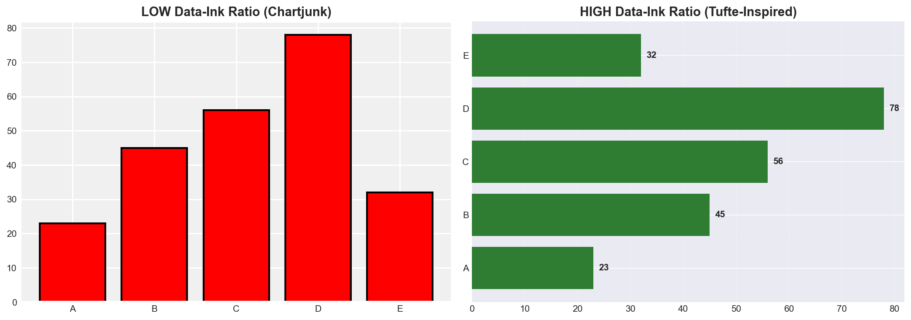

### Chartjunk

**Chartjunk** is non-data ink that competes with the marks: 3D effects, heavy grid lines, decorative fills and patterns, excessive colors, and redundant labels.

- Color or a fill pattern is data ink only when it encodes something, such as which group a bar belongs to.
- The same pattern on every bar is chartjunk.

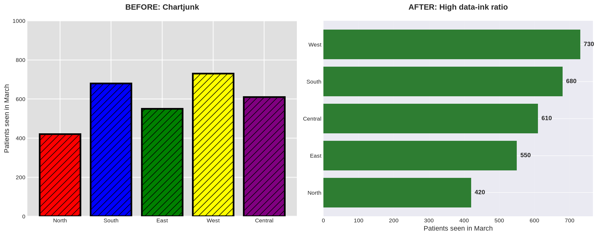

### Lie Factor

The **lie factor** measures how much a visualization distorts the data:

```
Lie Factor = (Size of effect shown in graphic) / (Size of effect in data)
```

A lie factor close to 1.0 means no distortion. In the hand-hygiene example, the April bar grows 100% (from 1 to 2 units above the 95% baseline) while compliance grows about 1% (96 → 97), so the lie factor is roughly 100 / 1.04 ≈ 96.

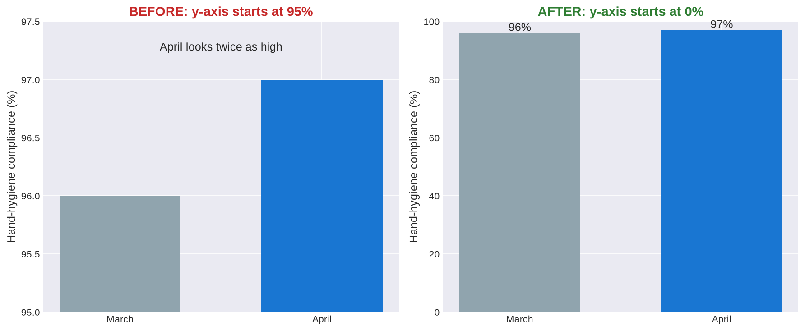

Common distortions to avoid:

- Axis limits that hide context or exaggerate differences. Bars need a zero baseline because length encodes magnitude; a line chart need not start at zero, but its range and any axis break must be clear and appropriate to the question.
- 3D perspective that distorts area/volume comparisons
- Inconsistent scales
- Cherry-picked time ranges

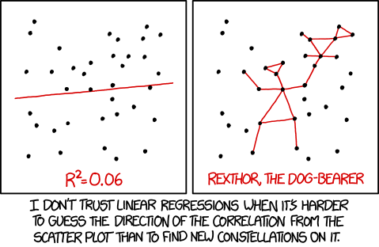

### Small Multiples

**Small multiples** are small, repeated charts on one shared scale, so readers compare categories or time periods at a glance; `sharey=True` from the pandas section draws them.

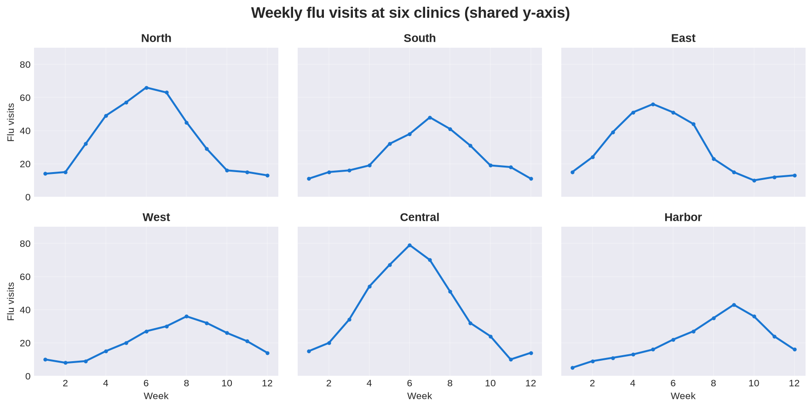

### Show the Detail

Show as much detail as the data allow instead of aggregating it away; Tufte calls these **high-resolution data graphics**.

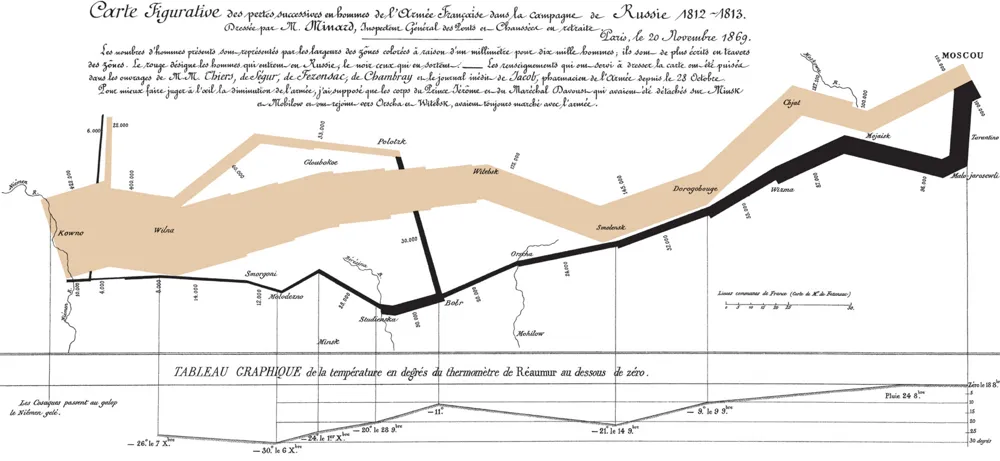

### Reference Card: Tufte's Checks

| Check | Ask | Typical remedy |
| :--- | :--- | :--- |
| **Data-ink** | Does every prominent mark carry information? | Remove decoration, heavy grids, and redundant labels |
| **Lie factor** | Does visual effect size match the data effect? | Use honest limits, units, and an appropriate baseline |
| **Small multiples** | Are repeated groups comparable? | Keep scale and encoding consistent across panels |
| **Resolution** | Did aggregation hide meaningful variation? | Show raw points or label the summary clearly |

## Color Palette Best Practices

Match the palette to the data type:

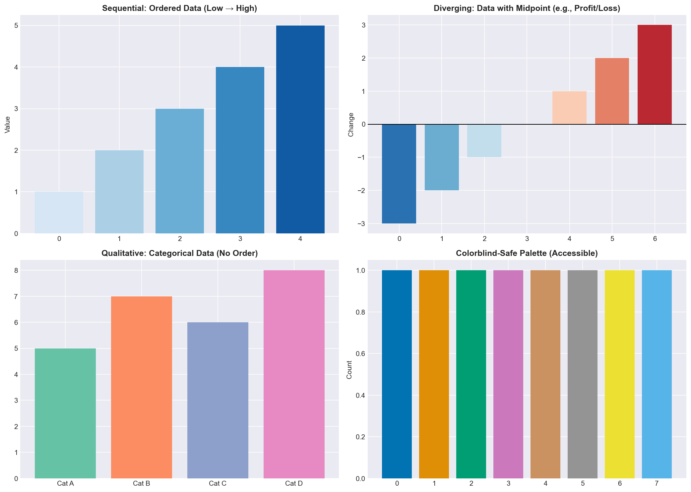

- **Sequential:** ordered data such as age or a lab value; one hue from light to dark.
- **Diverging:** data with a meaningful midpoint, such as a change from baseline or a correlation; two contrasting hues that meet at the midpoint, like `cmap='RdBu_r', center=0` in the seaborn heatmap card.
- **Qualitative:** categories with no inherent order, such as clinics; distinct, unrelated hues.

## Make the chart accessible

An **accessible** chart lets readers recover its comparison whatever their eyesight, screen, or printer.

- Use readable type, complete labels, and adequate contrast against the background.
- Use a colorblind-safe palette, tested with a tool such as [ColorBrewer](https://colorbrewer2.org/), but do not treat palette choice as the whole task.
- Add redundant encoding when color distinguishes important categories.
- Prefer direct labels or a clearly associated legend over a distant decoding task.
- Do not rely on hover interaction to reveal essential values.
- Provide a concise **text alternative** or caption that states the chart type, axes, main pattern, and a relevant limitation.

Example text alternative:

> Line chart of mean systolic blood pressure (mmHg) at five follow-up visits for a standard-care clinic and a nurse-led clinic. Both fall across the visits; the nurse-led series drops from 153 to 135 mmHg and finishes 9 mmHg below standard care. These are descriptive clinic summaries; patients were not randomized, so the chart does not show that the nurse-led model caused the difference.

### Reference Card: Redundant Cues for Bars and Lines

- `ax.plot(x, y, color=..., marker='o', linestyle='-')`: Pair each line color with its own marker and line style.
- `x = np.arange(n)`: One position per category group; `ax.set_xticks(x, labels)` names the positions.
- `ax.bar(x - width / 2, heights, width, label=..., hatch='//')`: Draw one set of side-by-side bars, shifted left by half a bar width. A fill pattern (**hatch**) such as `'//'` or `'..'` keeps groups distinguishable in grayscale; because it encodes the group, it is data ink, not chartjunk. `edgecolor=` colors each bar's outline and its hatch lines, and `linewidth=` sets the outline's thickness.
- `labels = ax.bar_label(bars, fmt='%d%%')`: Write each bar's value on it, such as `64%`; `bars` is what `ax.bar()` returns. The returned list holds the text labels; `labels[0].get_text()` reads the first label, `'64%'`.
- `ax.set_ylim(0, 100)`: Start bar axes at zero, because bar length encodes magnitude.

### Code Snippet: Directly Label a Line

On the chart described above, the nurse-led series ends at 135 mmHg at visit 5:

```python
ax.text(5.08, 135, 'Nurse-led', va='center')
```

Expected result: the label sits beside that endpoint, tying the name to the line.

### Code Snippet: Give a Bar Series Its Own Hatch

`x` holds positions `[0, 1]`, `north` holds uptake `[58, 64]` (%), and `width` is 0.35. The neighboring South series uses `hatch='..'`.

```python
north_bars = ax.bar(x - width / 2, north, width, label='North', color='#0072B2', hatch='//')
```

Expected result: two blue striped bars, left of each season's tick, distinguishable from South's dotted bars in grayscale.

### Code Snippet: Write Values on Bars

```python
ax.bar_label(north_bars, fmt='%d%%')
```

Expected result: `58%` and `64%` appear above North's bars.

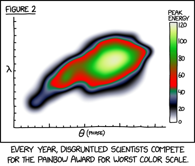

# Altair: Declarative Charts and Interaction

- **Altair**: a **declarative** plotting library; you state _what_ the chart shows, as data, a mark, and typed encodings, and Altair works out _how_ to draw it, where matplotlib takes drawing steps one at a time.
- **Vega-Lite specification**: the JSON document an Altair chart becomes; a browser renders it with hover tooltips and zoom, and you can save and share it.

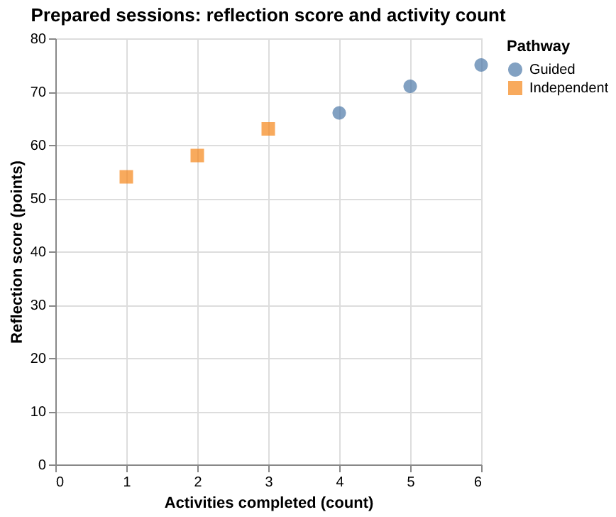

## Data, Mark, and Typed Encodings

An Altair chart is **data → mark → typed encodings**, and each field carries a type letter from the contract's data types: categorical → `:N` (nominal), ordinal → `:O`, quantitative → `:Q`, temporal → `:T`.

### Reference Card: Altair chart construction

| Task | Call | Purpose / arguments | Result |
| :--- | :--- | :--- | :--- |
| Import | `import altair as alt` | Load Altair under its standard alias, which the snippets assume | `alt` |
| Build | `alt.Chart(study)` | Supply the source DataFrame | Chart to configure |
| Build | `.mark_point(filled=True, size=90)` | Choose filled points and their area; `.mark_bar()` and `.mark_line()` draw bars or lines, and `color='gray'` gives every mark one fixed color | Chart with marks |
| Build | `.properties(title=..., width=360, height=260)` | Add a visible title and set size in pixels | Chart |
| Encode | `.encode(x='field:Q', color='group:N')` | Map quantitative and categorical fields to visible properties | Encoded chart |
| Encode | `alt.X('field:Q', title='Label (unit)')` | Set an axis title with its unit (also `alt.Y`) | Encoding channel |
| Encode | `alt.Y('field:Q', scale=alt.Scale(zero=False))` | Let a point or line axis start near the data; Altair starts quantitative axes at zero by default, which bars need | Encoding channel |
| Encode | `alt.Color('group:N', sort=['A', 'B'])` | Fix category and legend order (also for `alt.Shape`); `legend=None` hides the legend | Encoding channel |
| Encode | `y='mean(field):Q'` | Let Altair average rows per x category; the unit becomes one summary per group | Aggregated encoding |
| Interact | `.encode(tooltip=['field:Q'])` | Choose values shown on hover | Chart with tooltips |
| Interact | `alt.Tooltip('field:Q', title=..., format='.1f')` | Name and format a tooltip value | Tooltip channel |
| Interact | `.interactive()` | Add scale-bound pan/zoom interaction | Interactive chart |
| Compose | `alt.hconcat(left, right)` / `alt.vconcat(top, bottom)` | Place two charts side by side / one above the other | Compound chart |

`study` is a DataFrame with one row per patient: `age` (years) `[38, 52, 67, 41, 55, 70]`, `systolic_bp` (mmHg) `[118, 129, 141, 124, 136, 150]`, and `clinic`, North for the first three and South for the last three.

### Code Snippet: Encode the study table

```python
scatter = alt.Chart(study).mark_point(filled=True, size=90).encode(
    x=alt.X('age:Q', title='Age (years)'),
    y=alt.Y('systolic_bp:Q', title='Systolic BP (mmHg)', scale=alt.Scale(zero=False)),
    color=alt.Color('clinic:N', title='Clinic'),
    shape=alt.Shape('clinic:N', title='Clinic'),
    tooltip=['age:Q', 'systolic_bp:Q', 'clinic:N'],
).properties(title='Systolic BP and age at two clinics')

scatter.interactive()
```

- Color and shape both mark the clinic, a redundant encoding.
- Tooltips and `.interactive()` help a reader inspect or zoom, but the title, axes, legend, and main comparison must stay visible without hover.

## Save the Chart and Its Record

- Saving a chart as JSON keeps the Vega-Lite specification and its rows together, so anyone with the file can render the same chart.
- The standard-library `json` module (`import json`) saves what you keep beside it: the contract and the text alternative.

### Reference Card: Saving Charts and Records

| Call | Purpose / arguments | Result |
| :--- | :--- | :--- |
| `chart.save('chart.json')` / `chart.save('chart.html')` | Write the Vega-Lite spec (data embedded) or a web page | File |
| `chart.to_dict()` | Return the same spec as a Python dictionary | `dict` |
| `json.dump(obj, file, indent=2, ensure_ascii=False)` | Write a dict or list as readable JSON; `ensure_ascii=False` keeps characters such as é unescaped. It does not end the file with a newline; call `file.write('\n')` afterward if one is required | JSON file |
| `json.load(file)` | Read a JSON file back | `dict` or `list` |
| `json.dumps(obj)` / `json.loads(text)` | The same JSON as a string instead of a file, such as a settings dictionary stored in one CSV cell; `json.loads()` turns the string back | `'{"alpha": 1.0}'` / `dict` or `list` |

### Code Snippet: Save the Chart Specification

```python
scatter.save('study_scatter.json')  # Vega-Lite JSON with the six rows embedded
spec = scatter.to_dict()            # the same specification as a Python dict
print(spec['mark'])                 # {'type': 'point', 'filled': True, 'size': 90}
```

### Code Snippet: Save a Chart Record as JSON

`chart_record` is a dictionary containing the question, grain (`'one patient'`), and text alternative; `json.dump()` also accepts the dictionary `chart.to_dict()` returns.

```python
with open('study_record.json', 'w', encoding='utf-8') as file:
    json.dump(chart_record, file, indent=2, ensure_ascii=False)
```

Expected result: `study_record.json` preserves the contract and text alternative.

### Code Snippet: Read the Record Back

```python
with open('study_record.json', encoding='utf-8') as file:
    saved = json.load(file)
print(saved['grain'])  # one patient
```

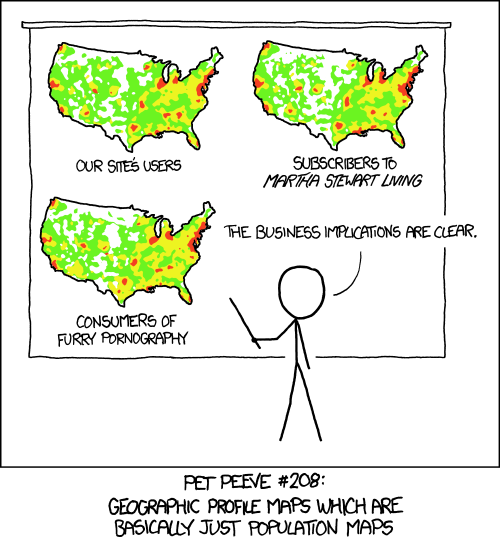

# LIVE DEMO!

[Open Demo 3 in Colab](https://colab.research.google.com/github/christopherseaman/datasci_217/blob/main/07/demo/demo3_pandas_altair.ipynb)
