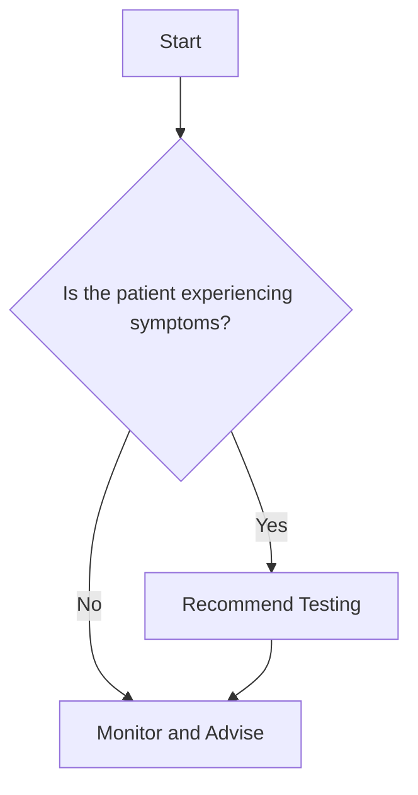

---

marp: true
theme: sqrl
paginate: true
class: invert
---

# Lecture 07: Data Visualization for Health Data Science

1. Introduction to Data Visualization
2. Inspiring Examples in Health Data Visualization
3. Python Tools for Health Data Visualization
4. #FIXMELATER pandas built-in plotting review
5. #FIXMELATER Principles for Effective Health Data Visualization
6. Advanced Visualization Techniques in Health Data Science
7. Visualization from the Command Line
8. Best Practices for Health Data Visualization
9. Hands-on Demonstrations with Health Data
10. Homework Assignment: Gapminder Data Visualization
11. Additional Resources

---

# 1. Introduction to Data Visualization

- **Importance in Data Analysis and Communication**
  - Transforms complex data into actionable insights
  - Enhances understanding and decision-making
- **Types of Visualizations**
  - **Exploratory**: Discover patterns and relationships
  - **Explanatory**: Communicate findings to others
- **Key Principles**
  - Clarity
  - Accuracy
  - Effectiveness

---

# 2. Inspiring Examples in Health Data Visualization

## Hans Rosling: Global Health Trends


- **Animated Bubble Charts**
  - Life expectancy vs. income over time
  - Showed health improvements globally
- **Gapminder Tools**
  - Interactive data exploration
  - Made complex health statistics accessible and engaging

---

## Edward Tufte: The Pioneer of Data Visualization


- **Data-Ink Ratio**
  - Maximizing the data-to-ink ratio in graphics
- **Chartjunk**
  - Eliminating unnecessary decorative elements
- **Clarity and Precision**
  - Advocated for minimalistic design
- **Notable Works**
  - *The Visual Display of Quantitative Information*
  - *Envisioning Information*
  - *Beautiful Evidence*

---

## COVID-19 Dashboard by Johns Hopkins University


- Real-time visualization of global COVID-19 cases
- Effective use of maps and time series data
- Became a go-to resource during the pandemic

---

# 3. Python Tools for Health Data Visualization

## Matplotlib: The Foundation

- **Highly Customizable Plots**
  - Supports various plot types: line, scatter, bar, histogram, etc.
- **Figures and Axes Concepts**
  - **Figure**: The overall window or page
  - **Axes**: An area where data is plotted (a subplot)

### Basic Plotting with Matplotlib

```python
import matplotlib.pyplot as plt

# Data
years = [2000, 2005, 2010, 2015, 2020]
life_expectancy = [67.5, 69.0, 70.2, 71.5, 72.8]

# Create a figure and axis
fig, ax = plt.subplots()

# Plot data
ax.plot(years, life_expectancy, marker='o', linestyle='-', color='b')

# Set title and labels
ax.set_title('Global Life Expectancy Over Time')
ax.set_xlabel('Year')
ax.set_ylabel('Life Expectancy (Years)')

# Show plot
plt.show()
```

#### Explanation:

- **Importing Matplotlib**: `import matplotlib.pyplot as plt`
- **Creating Figure and Axes**: `fig, ax = plt.subplots()`
  - `fig`: The figure object
  - `ax`: The axes object where data is plotted
- **Plotting Data**: `ax.plot()`
  - **Required Arguments**:
    - `years`: Data for the x-axis
    - `life_expectancy`: Data for the y-axis
  - **Optional Arguments**:
    - `marker='o'`: Specifies the marker style
    - `linestyle='-'`: Specifies the line style
    - `color='b'`: Sets the line color to blue
- **Setting Title and Labels**:
  - `ax.set_title('...')`: Sets the title of the plot
  - `ax.set_xlabel('...')`: Labels the x-axis
  - `ax.set_ylabel('...')`: Labels the y-axis

---

### Customizing Plots

- **Adding Grid Lines**:
  ```python
  ax.grid(True)
  ```
- **Adjusting Line Width and Marker Size**:
  ```python
  ax.plot(years, life_expectancy, marker='o', markersize=10, linewidth=2)
  ```
- **Adding a Legend**:
  ```python
  ax.plot(years, life_expectancy, label='Life Expectancy')
  ax.legend()
  ```

---

## Seaborn: Statistical Health Data Visualization

- **Built on Top of Matplotlib**
  - Simplifies complex visualizations
- **Default Themes and Color Palettes**
  - Offers aesthetically pleasing styles

### Basic Plotting with Seaborn

```python
import seaborn as sns
import pandas as pd

# Load dataset
tips = sns.load_dataset('tips')

# Create scatter plot
sns.scatterplot(x='total_bill', y='tip', data=tips)

# Show plot
plt.show()
```

#### Explanation:

- **Importing Seaborn**: `import seaborn as sns`
- **Loading Sample Data**:
  - `tips = sns.load_dataset('tips')`: Loads a dataset of restaurant tips
- **Creating Scatter Plot**: `sns.scatterplot()`
  - **Required Arguments**:
    - `x='total_bill'`: Variable for the x-axis
    - `y='tip'`: Variable for the y-axis
    - `data=tips`: DataFrame containing the data
- **Displaying the Plot**: `plt.show()`

---

### Enhancing Seaborn Plots

- **Adding Hue (Categorical Variable)**:
  ```python
  sns.scatterplot(x='total_bill', y='tip', hue='smoker', data=tips)
  ```
  - **Explanation**:
    - `hue='smoker'`: Colors the data points based on the 'smoker' category
- **Adjusting Size (Numerical Variable)**:
  ```python
  sns.scatterplot(x='total_bill', y='tip', size='size', data=tips, sizes=(20, 200))
  ```
  - **Explanation**:
    - `size='size'`: Adjusts marker size based on the 'size' variable
    - `sizes=(20, 200)`: Sets the range of marker sizes

---

### Common Seaborn Plot Types

- **Line Plot**: `sns.lineplot()`
- **Bar Plot**: `sns.barplot()`
- **Histogram**: `sns.histplot()`
- **Box Plot**: `sns.boxplot()`
- **Heatmap**: `sns.heatmap()`

#### Example: Box Plot

```python
sns.boxplot(x='day', y='total_bill', data=tips)
plt.title('Total Bill Distribution by Day')
plt.show()
```

- **Explanation**:
  - **Required Arguments**:
    - `x='day'`: Categorical axis
    - `y='total_bill'`: Numerical axis
    - `data=tips`: DataFrame containing the data

---

## Plotnine: Grammar of Graphics in Python

- **Inspired by R's ggplot2**
  - Similar syntax and concepts
- **Based on the Grammar of Graphics**
  - Build plots by combining independent components

### Basic Plot Structure

```python
from plotnine import ggplot, aes, geom_point
import pandas as pd

# Sample data
df = pd.DataFrame({
    'x': [1, 2, 3, 4, 5],
    'y': [10, 8, 6, 4, 2]
})

# Create plot
plot = (ggplot(df, aes(x='x', y='y'))
        + geom_point()
        + ggtitle('Basic Scatter Plot'))
        
print(plot)
```

#### Explanation:

- **Importing Plotnine Components**:
  - `ggplot`: Base for plots
  - `aes`: Aesthetic mappings
  - `geom_point`: Geometry for scatter plots
- **Defining Data and Aesthetics**:
  - `ggplot(df, aes(x='x', y='y'))`: Initializes the plot with data and mappings
- **Adding Geometries**:
  - `geom_point()`: Adds scatter plot points
- **Adding Titles and Labels**:
  - `ggtitle('Basic Scatter Plot')`: Adds a title to the plot
- **Displaying the Plot**:
  - `print(plot)`: Renders the plot

---

### Enhancing Plotnine Visualizations

- **Adding Layers**:
  ```python
  + geom_line()
  ```
- **Faceting**:
  ```python
  + facet_wrap('~ category')
  ```
  - **Explanation**:
    - Splits the plot into multiple panels based on the 'category' variable
- **Customizing Aesthetics**:
  ```python
  + aes(color='group')
  ```
  - **Explanation**:
    - Colors data points based on the 'group' variable

---

### Plotnine Example with Health Data

```python
from plotnine import ggplot, aes, geom_point, geom_smooth
import pandas as pd

# Load dataset
df = pd.read_csv('health_data.csv')

# Create plot
(ggplot(df, aes(x='BMI', y='BloodPressure', color='AgeGroup'))
 + geom_point()
 + geom_smooth(method='lm')
 + ggtitle('BMI vs. Blood Pressure by Age Group'))
```

#### Explanation:

- **Data**:
  - Assumes 'health_data.csv' contains 'BMI', 'BloodPressure', and 'AgeGroup' columns
- **Plot Components**:
  - `aes(...)`: Maps 'BMI' to x-axis, 'BloodPressure' to y-axis, and colors by 'AgeGroup'
  - `geom_point()`: Plots the data points
  - `geom_smooth(method='lm')`: Adds a linear regression line
  - `ggtitle(...)`: Adds a title

---

# 6. Visualization from the Command Line

## Mermaid.js

- **Create Diagrams and Flowcharts Using Text**
- **Integrates with Markdown**
- **Used in Tools Like Marp and Notion**
  - **Marp**: Enables inclusion of Mermaid diagrams in Markdown presentations
  - **Notion**: Allows Mermaid diagrams within notes for visualization

### Example: Flowchart in Mermaid.js



#### Explanation:

- **Graph Direction**:
  - `graph TD;`: Sets the flowchart direction from top to down
- **Nodes**:
  - `Start`, `Decision`, `Action`, `End`: Represents different steps
- **Decision Node**:
  - Curly braces `{}` denote a decision point
- **Edges**:
  - `-->`: Indicates the flow from one node to the next
  - Labels like `|Yes|` and `|No|` represent different paths based on conditions

---

## Command-line Histograms

- **Quick Data Visualization Without a GUI**

### Using `hist` Command

```bash
# Install hist (if not already installed)
pip install histogram

# Generate random data and display histogram
python -c "import random; print('\n'.join(str(random.gauss(0,1)) for _ in range(1000)))" | hist
```

#### Explanation:

- **Generating Data**:
  - Uses Python to generate 1,000 random numbers from a normal distribution
- **Piping to `hist`**:
  - `| hist`: Pipes the data into the `hist` command to display a histogram

### Combining with `cut` and `awk`

```bash
# Assuming 'data.csv' has a numeric field in the second column
cut -d',' -f2 data.csv | awk '{sum+=$1} END {print "Average:", sum/NR}'
```

#### Explanation:

- **`cut` Command**:
  - `-d','`: Specifies comma as the delimiter
  - `-f2`: Selects the second field from each line
- **`awk` Command**:
  - `{sum+=$1} END {print "Average:", sum/NR}`: Calculates the average of the input numbers

---

# 6. Interactive Visualization Tools

## Overview of Options

- **Plotly Dash**: Python framework for building analytical web applications
- **Streamlit**: Easiest way to create data apps in Python
- **Tableau**: Popular commercial BI tool with a free public version
- **Apache Superset**: Modern data exploration and visualization platform
- **Metabase**: Open-source business intelligence tool
- **Looker**: Google's BI and data exploration platform

## Focus on Free and Open-Source Options

- **Plotly Dash** and **Streamlit** are powerful, free, and Python-based
- **Apache Superset** and **Metabase** offer robust features without cost

---

## Demo: Plotly Dash

Plotly Dash allows you to create interactive, web-based dashboards using Python.

```python
import dash
from dash import html, dcc
from dash.dependencies import Input, Output
import plotly.express as px
import pandas as pd

# Load the Gapminder dataset
df = pd.read_csv('ddf--datapoints--population--by--country--age--gender--year.csv')

# Data preprocessing (example for demonstration)
df_filtered = df[df['year'] == 2007]

# Initialize the Dash app
app = dash.Dash(__name__)

# Define the app layout
app.layout = html.Div([
    html.H1('Gapminder Data Explorer'),
    dcc.Dropdown(
        id='year-dropdown',
        options=[{'label': int(year), 'value': int(year)} for year in df['year'].unique()],
        value=2007
    ),
    dcc.Graph(id='gapminder-scatter')
])

# Define the callback to update the graph
@app.callback(
    Output('gapminder-scatter', 'figure'),
    [Input('year-dropdown', 'value')]
)
def update_graph(selected_year):
    filtered_df = df[df['year'] == selected_year]
    fig = px.scatter(
        filtered_df,
        x='gdpPerCapita',
        y='lifeExpectancy',
        size='population',
        color='world_6region',
        hover_name='country',
        log_x=True,
        size_max=60
    )
    fig.update_layout(title=f'Life Expectancy vs GDP per Capita ({selected_year})')
    return fig

# Run the app
if __name__ == '__main__':
    app.run_server(debug=True)
```

#### Explanation:

- **Importing Libraries**:
  - `dash`: Framework for building web applications
  - `plotly.express`: For creating Plotly figures
- **Loading Data**:
  - Reads the Gapminder dataset into a DataFrame
- **App Layout**:
  - `html.Div`: Container for the elements
  - `dcc.Dropdown`: Dropdown menu for selecting the year
    - **Required Arguments**:
      - `id`: Identifier for the component
      - `options`: List of dictionaries with 'label' and 'value' keys
      - `value`: Default value
  - `dcc.Graph`: Component to display the Plotly figure
- **Callbacks**:
  - Connects the dropdown value to the graph update function
  - **Decorator**: `@app.callback`
    - **Outputs and Inputs**:
      - `Output('gapminder-scatter', 'figure')`: Updates the figure property of the graph
      - `Input('year-dropdown', 'value')`: Uses the selected year from the dropdown
- **update_graph Function**:
  - Filters the data based on the selected year
  - Creates a scatter plot with `px.scatter`

---

# 7. Best Practices for Health Data Visualization

## Choosing the Right Visualization

- **Line Charts**
  - Trends over time (e.g., disease progression)
- **Bar Charts**
  - Comparing categories (e.g., treatment efficacy)
- **Scatter Plots**
  - Showing relationships (e.g., BMI vs. blood pressure)
- **Heatmaps**
  - Displaying intensity or density (e.g., prevalence rates)
- **Maps**
  - Geographic data (e.g., disease prevalence by region)

## Communicating Uncertainty

- Include error bars or confidence intervals
- Use shading or gradients for prediction intervals
- Clearly state limitations and assumptions

---

[The rest of the content remains unchanged.]

## Handling Sensitive Health Data

- **Data Aggregation**
  - Protect individual privacy by summarizing data
- **Geographic Detail**
  - Use appropriate levels to prevent identification
- **Anonymization**
  - Remove personally identifiable information

## Accessibility and Inclusivity

- Use colorblind-friendly palettes (e.g., Viridis, Cividis)
- Provide text alternatives for complex visuals
- Consider cultural sensitivity in icons and symbols

---

## Storytelling with Health Data

- **Clear Message**
  - Start with a compelling narrative
- **Guided Exploration**
  - Use annotations to highlight key points
- **Contextual Information**
  - Explain the significance of findings

---

# 8. Hands-on Demonstrations with Health Data

Let's explore some real-world health data visualizations!

---

## Demo 1: COVID-19 Cases and Vaccinations

```python
import pandas as pd
import matplotlib.pyplot as plt

# Load data (you'll need to provide the actual data file)
covid_data = pd.read_csv('covid_data.csv')
covid_data['date'] = pd.to_datetime(covid_data['date'])

fig, ax1 = plt.subplots(figsize=(12, 6))

ax1.set_xlabel('Date')
ax1.set_ylabel('New Cases', color='tab:blue')
ax1.plot(covid_data['date'], covid_data['new_cases'], color='tab:blue')
ax1.tick_params(axis='y', labelcolor='tab:blue')

ax2 = ax1.twinx()
ax2.set_ylabel('Vaccinations', color='tab:orange')
ax2.plot(covid_data['date'], covid_data['vaccinations'], color='tab:orange')
ax2.tick_params(axis='y', labelcolor='tab:orange')

plt.title('COVID-19 New Cases and Vaccinations Over Time')
fig.tight_layout()
plt.show()
```

---

## Demo 2: BMI vs. Blood Pressure by Age Group

```python
import seaborn as sns
import matplotlib.pyplot as plt
import pandas as pd

# Load data (you'll need to provide the actual data file)
health_data = pd.read_csv('health_indicators.csv')

plt.figure(figsize=(10, 8))
sns.scatterplot(data=health_data, x='BMI', y='Blood Pressure', 
                hue='Age Group', size='Cholesterol', sizes=(20, 200))
plt.title('BMI vs Blood Pressure by Age Group')
plt.show()
```

---

## Demo 3: Disease Prevalence Heatmap

```python
import seaborn as sns
import matplotlib.pyplot as plt
import pandas as pd

# Load data (you'll need to provide the actual data file)
disease_data = pd.read_csv('disease_prevalence.csv')
disease_pivot = disease_data.pivot("Region", "Age Group", "Prevalence")

plt.figure(figsize=(12, 8))
sns.heatmap(disease_pivot, annot=True, cmap='YlOrRd', fmt='.2f')
plt.title('Disease Prevalence by Region and Age Group')
plt.show()
```

---

## Demo 4: Treatment Outcomes Box Plot

```python
import seaborn as sns
import matplotlib.pyplot as plt
import pandas as pd

# Load data (you'll need to provide the actual data file)
outcome_data = pd.read_csv('treatment_outcomes.csv')

plt.figure(figsize=(12, 6))
sns.boxplot(x='Medication', y='Recovery Time', hue='Age Group', 
            data=outcome_data)
plt.title('Distribution of Recovery Time by Medication and Age Group')
plt.xticks(rotation=45)
plt.show()
```

---

## Demo 5: Gapminder Data Visualization

```python
import pandas as pd
import plotly.express as px

# Load the Gapminder dataset
df = pd.read_csv('ddf--datapoints--population--by--country--age--gender--year.csv')

# Create an animated scatter plot
fig = px.scatter(df, x="gdp_per_capita", y="life_expectancy",
                 animation_frame="year", animation_group="country",
                 size="population", color="continent", hover_name="country",
                 log_x=True, size_max=55, range_x=[100,100000], range_y=[25,90])

fig.show()
```

This demonstration uses the Gapminder dataset to create an interactive, animated scatter plot showing the relationship between GDP per capita and life expectancy over time.

---

# 9. Homework Assignment: Gapminder Data Visualization

Using the Gapminder dataset (`ddf--datapoints--population--by--country--age--gender--year`):

1. **Data Visualization**:
   - Create a visualization showing the population distribution by age and gender for a country of your choice.
   - Use Python tools like Matplotlib or Seaborn.
2. **Analysis**:
   - Interpret the visualization.
   - Discuss any trends or patterns observed.
3. **Submission**:
   - Submit your code and a brief report (max 500 words).

---

# 10. Additional Resources

- **Matplotlib Documentation**: [https://matplotlib.org/](https://matplotlib.org/)
- **Seaborn Tutorial**: [https://seaborn.pydata.org/tutorial.html](https://seaborn.pydata.org/tutorial.html)
- **Plotly for Python**: [https://plotly.com/python/](https://plotly.com/python/)
- **"The Visual Display of Quantitative Information"** by Edward Tufte
- **"Fundamentals of Data Visualization"** by Claus O. Wilke
- **Gapminder Tools**: [https://www.gapminder.org/tools/](https://www.gapminder.org/tools/)
- **WHO Global Health Observatory**: [https://www.who.int/data/gho](https://www.who.int/data/gho)
- **CDC's Principles of Epidemiology in Public Health Practice**: [https://www.cdc.gov/csels/dsepd/ss1978/index.html](https://www.cdc.gov/csels/dsepd/ss1978/index.html)
