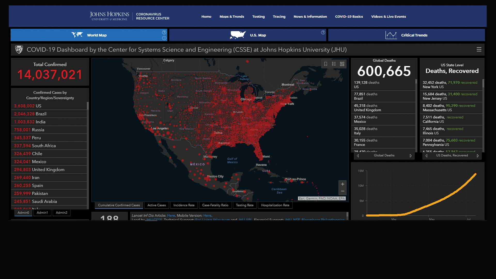

# Lecture 07 Outline: Data Visualization


1. Data Visualization with pandas, matplotlib, and seaborn
2. Design Principles for Effective Visualization
3. Advanced Visualization

<!--
- Python's visualization ecosystem evolved to serve different needs
- Core libraries complement each other: pandas for quick plots, matplotlib for control, seaborn for statistics
- Good visualization is about effective communication, not just pretty pictures
-->

---

# Brief Recap: Essential Python Concepts

- **Importing Libraries**
  - Use `import` statements to include external libraries.
    ```python
    import pandas as pd
    import matplotlib.pyplot as plt
    import seaborn as sns
    ```
- **Working with DataFrames**
  - DataFrames are table-like data structures provided by pandas.
    ```python
    df = pd.read_csv('data.csv')
    ```

<!--
- Aliases like pd and plt are universal conventions - use them!
- DataFrames are the foundation of data science in Python
- Most visualization methods expect DataFrame input
-->

---

# Introduction to Data Visualization Tools

- **pandas**
  - High-level data manipulation library.
  - Built-in plotting methods that simplify creating visualizations from DataFrames.
- **Matplotlib**
  - Foundation library for data visualization in Python.
  - Offers detailed control over plots.
- **Seaborn**
  - Statistical data visualization library.
  - Provides attractive default styles and color palettes.

<!--
- Think of pandas as your sketch pad - quick and simple
- Matplotlib gives you a full artist's toolset when needed
- Seaborn makes your statistical plots look professional with minimal effort
-->

---

# pandas: Built-in Plotting

## Introduction

- pandas provides convenient plotting methods directly on DataFrames and Series.
- Simplifies the creation of plots without explicitly using Matplotlib commands.
- Basic workflow:
  1. Create plot with df.plot() or series.plot()
  2. Plots display automatically in Jupyter notebooks
  3. For scripts, use plot.show()

<!--
- One line of code: df.plot() - that's all you need to start
- Perfect for quick data exploration
- Built on matplotlib but hides the complexity
-->

---

## Important Methods in pandas

### 1. `plot()`: Line Plot

- **Explanation**: Plots DataFrame or Series data as lines.
- **Structure**:
  ```python
  df.plot(x='column1', y='column2', kind='line', marker, title)
  ```

<!--
- Most versatile plotting method in pandas
- Great for time series and trends
- Can plot multiple columns at once
-->

---


### 2. `hist()`: Histogram

- **Explanation**: Plots a histogram of a single column or series.

```python
df['Age'].hist(bins=10, color='skyblue', alpha=0.7)
```

<!--
- Key tool for understanding data distribution
- Bins parameter controls granularity
- Alpha helps when data overlaps
-->

---

# LIVE DEMO!

<!--
- Watch for common gotchas with axes and scales
- Notice how different parameters affect the visualization
- Think about what each plot reveals about the data
-->

---
# Matplotlib: The Foundation

## Introduction

- **Matplotlib**  most widely used plotting library - the basic building block behind most other Python visualization libraries.
- Workflow:
  1. Create figure with plt.figure()
  2. Add data with plt.plot() or other plot types
  3. Customize with labels, title, etc.
  4. Display with plt.show()
- Concepts
  - **Figure**: The overall container for all plot elements.
  - **Axes**: The area where data is plotted (can be thought of as individual plots).

<!--
- Figure/Axes hierarchy is key to understanding matplotlib
- Think of figure as your canvas, axes as individual paintings
- Most customization happens at the axes level
-->

---

## Important Methods in Matplotlib

### 1. `plot()`: Basic Line Plot

- **Explanation**: Creates a simple line plot connecting data points.
- **Structure**:
  ```python
  plt.plot(x, y, marker, linestyle, color, label)
  ```
  - **Required Arguments**:
    - `x`: Data for the x-axis.
    - `y`: Data for the y-axis.
  - **Optional Arguments**:
    - `marker`: Style of the data point markers (e.g., `'o'` for circles).
    - `linestyle`: Style of the line connecting data points (e.g., `'-'` for solid line).
    - `color`: Color of the line.
    - `label`: Label for the legend.

<!--
- Markers show individual data points
- Line styles connect the dots - or not
- Colors and labels make plots readable
-->

---

### 2. `scatter()`: Scatter Plot

- **Explanation**: Creates a scatter plot of x vs. y, useful for showing relationships between variables.
- **Structure**:
  ```python
  plt.scatter(x, y, s, c, alpha)
  ```
  - **Required Arguments**:
    - `x`: Data for the x-axis.
    - `y`: Data for the y-axis.
  - **Optional Arguments**:
    - `s`: Size of markers.
    - `c`: Color of markers.
    - `alpha`: Transparency level of markers.

<!--
- Perfect for showing relationships between variables
- Size and color can add two more dimensions
- Alpha helps with overplotting
-->

---

### Additional Plot Types in Matplotlib

- **Bar Plot**:
  ```python
  plt.bar(categories, values)
  ```
- **Histogram**:
  ```python
  plt.hist(data, bins=10)
  ```
- **Box Plot**:
  ```python
  plt.boxplot(data)
  ```
- **Pie Chart**:
  ```python
  plt.pie(sizes, labels=labels)
  ```
- **Subplots**:
  ```python
  fig, axs = plt.subplots(2, 2)  # Creates a 2x2 grid of subplots
  axs[0, 0].plot(x, y)  # Plot in the first subplot
  ```
- **Image Display**:
  ```python
  plt.imshow(image_data)
  ```
- **Contour Plot**:
  ```python
  plt.contour(X, Y, Z)  # For line contours
  plt.contourf(X, Y, Z)  # For filled contours
  ```
- **Error Bars**:
  ```python
  plt.errorbar(x, y, yerr=error)
  ```

<!--
- Each plot type serves specific data types
- Bar plots for categories
- Box plots show distribution details
- Subplots combine multiple views
-->

---

# Resources for Further Learning

- **Matplotlib Documentation**: [matplotlib.org](https://matplotlib.org/)
- **pandas Visualization Guide**: [pandas.pydata.org](https://pandas.pydata.org/pandas-docs/stable/user_guide/visualization.html)
- **Seaborn Tutorials**: [seaborn.pydata.org](https://seaborn.pydata.org/tutorial.html)
- **Troubleshooting Tips**: Search for errors on Stack Overflow or consult the official documentation.

<!--
- Documentation includes great galleries and examples
- Stack Overflow is your friend
- Practice with real datasets
-->

---

# LIVE DEMO!

<!--
- Watch for the figure/axes pattern
- Notice how layers build up
- See how styles affect readability
-->

---


# Seaborn: Statistical Data Visualization

## Introduction

- **Seaborn** enhances Matplotlib's functionality by providing high-level interfaces.
- Ideal for statistical plots and works well with pandas DataFrames.
- Basic workflow:
  1. Create plot with sns.scatterplot() or other plot types
  2. Plots display automatically in Jupyter notebooks
  3. For scripts, use plt.show() since Seaborn uses Matplotlib backend

<!--
- Built for statistical visualization
- Better defaults than matplotlib
- Understands pandas DataFrames natively
-->

---


## Important Methods in Seaborn

### 1. `scatterplot()`: Scatter Plot

- **Explanation**: Creates enhanced scatter plots with additional functionalities.
- **Structure**:
  ```python
  sns.scatterplot(data=df, x='x_col', y='y_col', hue='category', size='value')
  ```

<!--
- Automatically handles categorical variables
- Adds statistical context
- Smart about categorical colors
-->

---

### Additional Plot Types in Seaborn

- **Histogram and KDE Plot**:
  ```python
  sns.histplot(data=df, x='BMI', kde=True)
  ```
- **Box Plot**:
  ```python
  sns.boxplot(data=df, x='AgeGroup', y='Cholesterol')
  ```
- **Heatmap**:
  ```python
  sns.heatmap(df.corr(), annot=True, cmap='coolwarm')
  ```
- **FacetGrid**:
  ```python
  g = sns.FacetGrid(df, col='Gender')
  g.map(sns.histplot, 'BMI')
  ```

<!--
- KDE shows smooth distribution
- Box plots reveal outliers
- Heatmaps great for correlation
- FacetGrid splits by categories
-->

---

### Additional Plot Types in Seaborn

- **Line Plot**:
  ```python
  sns.lineplot(data=df, x='Year', y='Value')
  ```
- **Bar Plot**:
  ```python
  sns.barplot(data=df, x='Category', y='Value')
  ```
- **Violin Plot**:
  ```python
  sns.violinplot(data=df, x='Category', y='Value')
  ```
- **Pair Plot**:
  ```python
  sns.pairplot(data=df, hue='Category')
  ```

<!--
- Line plots include confidence intervals
- Bar plots show error bars
- Violin plots combine boxplot and KDE
- Pair plots show all relationships at once
-->

---

### Customization in Seaborn

- **Setting Plot Style**:
  ```python
  sns.set_style("whitegrid")
  ```
- **Color Palettes**:
  ```python
  sns.set_palette("husl")
  ```
- **Figure Size**:
  ```python
  # Uses an arcane syntax within `set_theme` or `set_context`
  # set_theme can also set the style (d'uh)
  sns.set_theme(style="whitegrid", rc={"figure.figsize": (10, 6)})
  ```

<!--
- Styles affect all plot elements
- Color palettes are colorblind-friendly
- Size affects readability
-->

---

# LIVE DEMO!

<!--
- Notice the statistical elements
- See how styles differ from matplotlib
- Watch the categorical handling
-->

---


<!--
- First use of polar area diagram
- Each wedge shows deaths by month
- Blue: preventable diseases
- Red: wounds
- Black: other causes
-->

---
## Florence Nightingale: The Rose Diagram

- **Coxcomb Chart (Rose Diagram)**
  - Visualized causes of mortality during the Crimean War.
  - Highlighted the impact of poor sanitary conditions.

- **Impact**
  - Influenced medical reform and sanitary practices.
  - Early use of data visualization to drive policy change.

<!--
- Area shows magnitude dramatically
- Seasonal patterns become clear
- Led to hospital sanitation reforms
-->

---

## COVID-19 Dashboard by Johns Hopkins University



- **Real-Time Visualization**
  - Tracked global COVID-19 cases, recoveries, and deaths.

- **Effective Use of Maps and Time Series**
  - Interactive and continuously updated.

- **Global Impact**
  - Became a crucial resource for researchers, policymakers, and the public.

<!--
- Map shows geographic spread
- Time series shows trends
- Color intensity shows severity
-->

---

# Introduction to Design Principles

- **Importance of Good Design**
  - Enhances comprehension and retention
  - Communicates data accurately and ethically

- **Based on Works of Edward Tufte and Claus O. Wilke**
  - Focus on clarity, precision, and efficiency in data presentation

<!--
- Design serves understanding
- Ethics in visualization matter
- Less is often more
-->

---

# Key Concepts

## Simplify and Focus

- **Eliminate Non-Essential Elements**
  - Remove unnecessary gridlines, backgrounds, and decorations

- **Highlight Key Data**
  - Use visual emphasis (bolding, color) to draw attention to important information

<!--
- Every element should have purpose
- Guide viewer's attention
- Remove visual clutter
-->

---


<!--
- Shows six types of data
- Army size shown by thickness
- Temperature shown below
- Geography shown by path
- Time flows left to right
- Color indicates direction
- One of history's best visualizations
-->

---
## Edward Tufte: The Pioneer of Data Visualization

- **Data-Ink Ratio**
  - The proportion of ink used to present actual data compared to the total ink used in the graphic.

- **Chartjunk**
  - Unnecessary or distracting decorations in data visualizations that do not improve the viewer's understanding.

- **Notable Works**
  - *The Visual Display of Quantitative Information*
  - *Envisioning Information*
  - *Beautiful Evidence*

<!--
- Maximize data-ink ratio
- Remove non-data ink
- Every mark should inform
-->

---

### Bad Examples

- **Issues**:
  - Distracting colors
  - Misleading scales
  - Unnecessary 3D effects

<!--
- 3D distorts perception
- Decoration hides data
- Colors confuse message
-->

---


<!--
- 3D adds no information
- Perspective distorts values
- Hard to compare heights
-->

---


<!--
- Pictures distract from data
- Scale is inconsistent
- Message gets lost
-->

---

### Better Example

- **Features**:
  - Clear labels and titles
  - Minimalist design
  - Accurate representation of data

<!--
- Labels guide understanding
- White space helps clarity
- Focus on the data
-->

---


<!--
- Clean, clear design
- Essential grid lines only
- Data stands out
-->

---


<!--
- 3D obscures trends
- Colors fight for attention
- Hard to read values
-->

---


<!--
- Flat design shows trends
- Colors support message
- Easy to compare values
-->

---


<!--
- Complex but clear
- Each element has purpose
- Multiple variables shown effectively
-->

---


<!--
- Shows distribution clearly
- Minimal decoration
- Easy to compare groups
-->

---

# "Legal" Representation of Data (chartcrime)

- **Avoid Misleading Visuals**
  - Start axes at zero when appropriate to prevent exaggeration
  - Use consistent scales across related visuals

- **Accurate Data Representation**
  - Do not manipulate visuals to mislead or bias the audience
  - Clearly indicate any data exclusions or manipulations

- **Functional Use**
  - Differentiate data categories meaningfully
  - Use color to highlight important data points

- **Accessibility**
  - Use colorblind-friendly palettes (e.g., Viridis, Cividis)
  - Ensure sufficient contrast between colors

<!--
- Zero baseline matters
- Scale choices affect perception
- Color serves function
- Accessibility is essential
-->

---

# Additional Resources

- **"The Visual Display of Quantitative Information"** by Edward Tufte
- **"Fundamentals of Data Visualization"** by Claus O. Wilke
- [**"Tufte's Principles of Data-Ink"** Liu & Zhuang](https://jtr13.github.io/cc19/tuftes-principles-of-data-ink.html)
- **Color Brewer 2**: [colorbrewer2.org](http://colorbrewer2.org/) for choosing colorblind-friendly palettes

<!--
- Tufte's book is foundational
- Wilke's book is modern, practical
- ColorBrewer for accessible palettes
-->

---

# LIVE DEMO!

*(sort of)*

<!--
- Watch for good/bad practices
- Notice impact of small changes
- See how principles apply
-->

---

# Interactive Activity

## Critiquing a Visualization

- **Exercise**:
  - Examine the following chart and identify areas for improvement

- **Consider**:
  - Clarity of labels and titles
  - Use of color and chart elements
  - Ethical representation of data

<!--
- Look for chartjunk
- Check data representation
- Consider improvements
-->

---


<!--
- Unclear axis labels
- Poor color choices
- Missing title
- Data hard to interpret
-->

---


<!--
- Misleading scale
- Poor color contrast
- Confusing layout
- Missing context
-->

---


<!--
- Circular layout hard to read
- Colors don't add meaning
- Size comparisons difficult
- Could be simple bar chart
-->

---


<!--
- Misleading perspective
- Scale distortion
- Unnecessary decoration
- Hard to compare values
-->

---

# Advanced Visualization Techniques in Health Data Science

- **Plotnine**
  - Python implementation of the **Grammar of Graphics**
  - Inspired by R's **ggplot2**
  - Basic workflow:
    1. Create plot with ggplot()
    2. Add layers with + operator
    3. Display with plot.show() or plot.draw()
- **Command-Line Visualization**
  - Tools for visualizing data directly from the command line
  - Examples: **Mermaid.js**, **spark**
- **Interactive and BI Visualizations**
  - Tools for building interactive dashboards and applications
  - Examples: **Plotly Dash**, **Streamlit**

<!--
- Grammar of Graphics is powerful
- Command line for quick views
- Interactive for exploration
-->

---

# Plotnine: Grammar of Graphics in Python 
*(Advanced)*

## Understanding the Grammar of Graphics

- **Theory**: A structured approach to data visualization that breaks down graphs into semantic components
  - **Data**: The dataset being visualized
  - **Aesthetics (aes)**: Mappings between data and visual properties (e.g., x, y, color)
  - **Geometries (geoms)**: Visual elements that represent data (e.g., points, lines)
  - **Facets**: Subsets of data shown in multiple plots
  - **Statistical Transformations (stats)**: Summarizing data (e.g., binning, smoothing)
  - **Scales**: Control mapping from data space to aesthetic space
  - **Coordinate Systems (coords)**: The space in which the data is represented (e.g., Cartesian, polar)

[plotnine.org](https://plotnine.org/)

<!--
- Each component has specific role
- Components combine flexibly
- Powerful for complex plots
-->

---

## Plotnine vs. ggplot2

99.99% compatible with ggplot2

- **Syntax and Concepts**
  - Plotnine mirrors ggplot2's structure and functions
  - Beneficial for anyone familiar with R
- **Example Comparison**

  - **ggplot2 (R)**:
    ```R
    ggplot(data, aes(x, y)) + geom_point()
    ```
  - **Plotnine (Python)**:
    ```python
    (ggplot(data, aes('x', 'y')) + geom_point())
    ```

<!--
- Nearly identical syntax
- Easy R to Python transition
- Same powerful capabilities
-->

---

## Important Components in Plotnine

### `ggplot()`: Initialize a Plot

- **Explanation**: Creates a new plot object with data and aesthetic mappings
- **Structure**:
  ```python
  ggplot(data=DataFrame, mapping=aes('x_var', 'y_var'))
  ```
  - **Required Arguments**:
    - `data`: DataFrame containing the data
    - `mapping`: Aesthetic mappings created with `aes()`

<!--
- Start with data and mapping
- Add layers progressively
- Each layer adds meaning
-->

---

## Plotnine Resources

There are whole books just on `ggplot2`. In fact, it started as a book

> Wilkinson, L. (2005), The Grammar of Graphics, 2nd ed., Springer

- [Data Visualization Ch 7](https://andrewirwin.github.io/data-visualization/grammar.html), Andrew Irwin
- [U of Iowa GoG Tutorial](http://homepage.stat.uiowa.edu/~luke/classes/STAT4580-2024/ggplot.html)
- [R Stats `ggplot2` Tutorial](http://r-statistics.co/Complete-Ggplot2-Tutorial-Part1-With-R-Code.html)

<!--
- Deep theoretical foundation
- Many learning resources
- Active community
-->

---

# Command-Line Visualization

## Mermaid.js

### Introduction

- **Mermaid.js**: A JavaScript-based tool for generating diagrams and flowcharts from text definitions.
- **Advantages**:
  - Quick creation of diagrams without graphic design tools.
  - Integration with markdown documents and presentations.
- **Structure**:
  ```markdown
  ```mermaid
  [Diagram Definition]
  ```
  ```
<!--
- Text-based diagrams
- Version control friendly
- Quick to modify
-->

---

### Creating Diagrams with Mermaid.js

- **Example**:

  ```mermaid
  graph LR
    A[Start] --> B{Is the patient symptomatic?}
    B -->|Yes| C[Conduct Tests]
    B -->|No| D[Monitor Patient]
    C --> E[Treatment Plan]
    D --> E
    E --> F[Follow-up]
  ```


- **Nodes**:
  - `A`, `B`, `C`, `D`, `E`, `F` represent steps or decisions.
- **Edges**:
  - Arrows define the flow between nodes.
  - Labels like `|Yes|` and `|No|` represent decision outcomes.
  - 
<!--
- Nodes show states/steps
- Arrows show flow
- Labels add context
-->

---


<!--
- Clear decision points
- Logical flow shown
- Easy to follow path
-->

---

### Integrating Mermaid.js into Documents

- **Markdown Files**:
  - Supported in many markdown editors and viewers (Notion, VSCode, Obsidian, ...)
- **Presentations**:
  - Tools like **Marp** allow embedding Mermaid diagrams in slides.
- **Version Control**:
  - Diagrams are text-based, facilitating collaboration and version tracking.
- **Command Line**:
  - `mermaid-cli` tool for rendering diagrams from the command line.
  ```bash
  npm install -g @mermaid-js/mermaid-cli
  mmdc -i input.mmd -o output.svg
  ```

<!--
- Works in many tools
- Easy to version control
- CLI for automation
-->

---

## Gnuplot

Viewing graphs from the command line (you will almost never do this, ***but it's cool!***)

```bash
ping -c 10 google.com -i 0.2 | awk '/time=/{ print $(NF-1) }' | cut -d= -f2 | \
  gnuplot -e \
  "set terminal dumb size 90, 30; set autoscale; set title 'ping google.com';
   set ylabel 'ms'; set xlabel 'count'; plot '-'  with lines notitle";
```

<!--
- ASCII art visualization
- Real-time data plotting
- Unix pipeline power
-->

---

```bash
                                       ping google.com
     55 +---------------------------------------------------------------------------+
        |       +        +       +        +       +        +       +        +       |
        |                                                                           |
     50 |-+                                                                 *     +-|
        |                                                                   *       |
        |                                         *                        * *      |
        |                                        * *                       * *      |
     45 |-+                                      *  *                     *   *   +-|
        |                                       *   *                     *   *     |
        |                                       *    *                   *     *    |
     40 |-+                                    *      *                  *     *  +-|
        |                                      *       *                *       *   |
 ms     |                                     *         *               *       *   |
     35 |-+                                   *          *             *        * +-|
        |                                    *           *             *         *  |
        |                                    *            *           *          *  |
     30 |-+            *****                *              ***        *           *-|
        |          ****     **              *                 *      *            * |
        |**********           **           *                   **    *             *|
        |                       *          *                     ** *              *|
     25 |-+                      **********                         *             +-|
        |                                                          *                |
        |       +        +       +        +       +        +       +        +       |
     20 +---------------------------------------------------------------------------+
        0       1        2       3        4       5        6       7        8       9
                                            count
```

<!--
- Simple but effective
- Shows trends clearly
- Works anywhere
-->

---

## Sparkline

Because, why not?

- [https://github.com/holman/spark](https://github.com/holman/spark)

```bash
curl -s https://earthquake.usgs.gov/earthquakes/feed/v1.0/summary/2.5_day.csv | \
  sed '1d' | \
  cut -d, -f5 | \
  spark
▃█▅▅█▅▃▃▅█▃▃▁▅▅▃▃▅▁▁▃▃▃▃▃▅▃█▅▁▃▅▃█▃▁
```

<!--
- Ultra-compact visualization
- Great for terminals
- Shows trends in text
-->

---

# Interactive and BI Visualizations

### Overview

- **Streamlit**:
  - Designed for rapid development and simplicity.
  - Emphasizes minimal code to produce apps.
- **Plotly Dash**:
  - Focused on creating complex, customizable applications.
  - Uses Flask and React.js under the hood.
- **Tableau/Superset/Looker/PowerBI**:
  - Popular BI tools for creating interactive dashboards. ($$$)

<!--
- Streamlit for quick wins
- Dash for complex apps
- BI tools for business
-->

---

### Streamlit
- Python-first framework for rapidly building data apps
- Key features:
  - Simple API with minimal boilerplate code
  - Auto-rerun on file changes
  - Built-in widgets and layout components
  - Native integration with pandas/numpy
  - Caching system for performance
- Best for:
  - Data science prototypes
  - ML model demos
  - Quick internal tools
- Example:
```python
import streamlit as st
import pandas as pd

st.title("Simple Data App")
data = pd.read_csv("data.csv")
st.line_chart(data)
```

---

## Streamlit: Building an App

```python
import streamlit as st
import pandas as pd
import plotly.express as px

# Load data
df = pd.read_csv('data.csv')

# App title
st.title('Health Data Explorer')

# Sidebar filters
age_group = st.sidebar.selectbox('Select Age Group', df['AgeGroup'].unique())

# Filtered data
filtered_df = df[df['AgeGroup'] == age_group]

# Display data
st.write(f'Data for Age Group: {age_group}')
st.write(filtered_df)

# Plot
fig = px.scatter(filtered_df, x='BMI', y='BloodPressure',
                 title=f'BMI vs Blood Pressure for Age Group {age_group}')
st.plotly_chart(fig)
```

---

### Code Explanation

- **Imports**:
  - `streamlit` for the app interface.
  - `pandas` and `plotly.express` for data handling and plotting.
- **Data Loading**:
  - Reads the health data into a DataFrame.
- **App Components**:
  - `st.title()` sets the title.
  - `st.sidebar.selectbox()` creates a dropdown in the sidebar.
  - `st.write()` displays text and data.
  - `st.plotly_chart()` renders the plot.
- **Interactivity**:
  - Selecting an age group filters the data and updates the display and plot.

---

### Plotly Dash

- Full-featured framework for building analytical web applications
- Key features:
  - React.js based components
  - More granular control over layout/styling
  - Advanced callback system
  - Integration with Plotly graphing library
  - Production-ready performance
- Best for:
  - Complex dashboards
  - Interactive data exploration
  - Enterprise applications
- Example:
```python
from dash import Dash, dcc, html
import plotly.express as px

app = Dash(__name__)
app.layout = html.Div([
    dcc.Graph(figure=px.line(df, x='date', y='value'))
])
```

---

## Plotly Dash: Building an App


```python
import dash
from dash import dcc, html
from dash.dependencies import Input, Output
import plotly.express as px
import pandas as pd

# Load data
df = pd.read_csv('data.csv')

# Initialize the app
app = dash.Dash(__name__)

# Define the layout
app.layout = html.Div([
    html.H1('Health Data Dashboard'),
    dcc.Dropdown(
        id='age-dropdown',
        options=[{'label': age, 'value': age} for age in df['AgeGroup'].unique()],
        value=df['AgeGroup'].unique()[0]
    ),
    dcc.Graph(id='bmi-bloodpressure-scatter')
])

# Define the callback
@app.callback(
    Output('bmi-bloodpressure-scatter', 'figure'),
    [Input('age-dropdown', 'value')]
)
def update_graph(selected_age):
    filtered_df = df[df['AgeGroup'] == selected_age]
    fig = px.scatter(
        filtered_df, x='BMI', y='BloodPressure',
        title=f'BMI vs Blood Pressure for Age Group {selected_age}'
    )
    return fig

# Run the app
if __name__ == '__main__':
    app.run_server(debug=True)
```

<!--
- Layout defines structure
- Callbacks add interactivity
- Components are reusable
-->

---

### Code Explanation

- **Imports**:
  - `dash`, `dash_core_components` (`dcc`), `dash_html_components` (`html`), `dash.dependencies` for interactivity.
  - `plotly.express` for plotting.
- **Data Loading**:
  - Reads health data into a DataFrame.
- **App Initialization**:
  - Creates a Dash app instance.
- **Layout Definition**:
  - Contains a header, dropdown menu, and a graph component.
- **Callback Function**:
  - Updates the graph based on the selected age group from the dropdown.

<!--
- Components build interface
- Callbacks handle events
- Data flows reactively
-->

---

# Further Resources

- **Plotnine Documentation**: [plotnine.readthedocs.io](https://plotnine.readthedocs.io/)
- **Mermaid.js Documentation**: [mermaid-js.github.io](https://mermaid-js.github.io/)
- **Plotly Dash User Guide**: [dash.plotly.com](https://dash.plotly.com/)
- **Streamlit Documentation**: [docs.streamlit.io](https://docs.streamlit.io/)
- **Deployment Guides**:
  - Dash: [Deployment](https://dash.plotly.com/deployment)
  - Streamlit: [Sharing Apps](https://streamlit.io/sharing)

