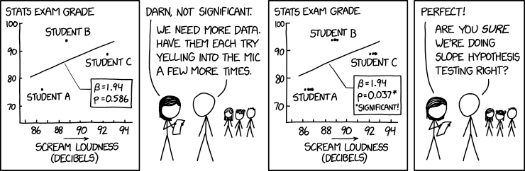
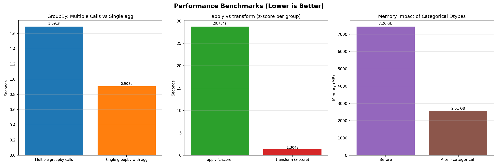

---
notion:
  title_line: "Data Aggregation and Group Operations"
  role: lecture
  status: mapped
  page_id: "2a1d9fdd-1a1a-80f8-b1e8-f7b20e4a2e84"
  url: "https://app.notion.com/p/2a1d9fdd1a1a80f8b1e8f7b20e4a2e84"
---

Data Aggregation and Group Operations

See [BONUS.md](BONUS.md) for advanced extensions:

- Advanced groupby operations with custom functions
- Hierarchical grouping and MultiIndex operations
- Advanced performance profiling and debugging
- Distributed and cloud computing
- Custom aggregation functions and transformations
- Advanced pivot table operations

**Live notebooks in Colab:** [Demo 1](https://colab.research.google.com/github/christopherseaman/datasci_217/blob/main/08/demo/demo1_groupby_operations.ipynb) · [Demo 2](https://colab.research.google.com/github/christopherseaman/datasci_217/blob/main/08/demo/demo2_pivot_tables.ipynb) · [Demo 3](https://colab.research.google.com/github/christopherseaman/datasci_217/blob/main/08/demo/demo3_remote_performance.ipynb)

# Outline

- groupby split-apply-combine essentials
- pivot tables and crosstab basics
- performance measurement and scaling larger aggregations
- remote work with SSH, secure file copying, and persistent sessions

*Fun fact: The term "aggregation" comes from the Latin "aggregare" meaning "to add to a flock." In data science, we're literally gathering scattered data points into meaningful groups - turning a flock of individual observations into organized insights.*

Data aggregation summarizes and groups data to extract insights. The lecture covers **groupby operations**, **pivot tables**, their result shapes, performance choices for larger workloads, and the shell tools used when the work runs on another machine.

# The Split-Apply-Combine Paradigm

*Reality check: GroupBy operations are the bread and butter of data analysis. Master this concept and you'll be able to answer almost any "what if we group by..." question that comes your way.*

The split-apply-combine paradigm is the foundation of data aggregation. You split data into groups, apply a function to each group, and combine the results.

**Visual Guide - GroupBy Operations:**

```
BEFORE GROUPBY                    AFTER GROUPBY
┌─────────┬─────────┬─────────┐   ┌─────────┬─────────┐
│ Category│ Value   │ Other   │   │ Category│ Mean    │
├─────────┼─────────┼─────────┤   ├─────────┼─────────┤
│ A       │ 10      │ X       │   │ A       │ 10.0    │
│ A       │ 15      │ Y       │   │ B       │ 25.0    │
│ B       │ 20      │ Z       │   └─────────┴─────────┘
│ B       │ 25      │ W       │
│ A       │ 5       │ V       │
│ B       │ 30      │ U       │
└─────────┴─────────┴─────────┘
```

**Visual Guide - Split-Apply-Combine:**

```
ORIGINAL DATA                    SPLIT BY CATEGORY
┌─────────┬─────────┬─────────┐   ┌─────────┬─────────┐
│ Category│ Value   │ Other   │   │ Group A │ Group B │
├─────────┼─────────┼─────────┤   ├─────────┼─────────┤
│ A       │ 10      │ X       │   │ A, 10   │ B, 20   │
│ A       │ 15      │ Y       │   │ A, 15   │ B, 25   │
│ B       │ 20      │ Z       │   │ A, 5    │ B, 30   │
│ B       │ 25      │ W       │   └─────────┴─────────┘
│ A       │ 5       │ V       │
│ B       │ 30      │ U       │
└─────────┴─────────┴─────────┘

APPLY FUNCTION (e.g., mean)      COMBINE RESULTS
┌─────────┬─────────┐            ┌─────────┬─────────┐
│ Group A │ Group B │            │ Category│ Mean    │
├─────────┼─────────┤            ├─────────┼─────────┤
│ mean(10,│ mean(20,│            │ A       │ 10.0    │
│ 15, 5)  │ 25, 30)│            │ B       │ 25.0    │
│ = 10.0  │ = 25.0 │            └─────────┴─────────┘
└─────────┴─────────┘
```

# Basic GroupBy Operations

### Reference Card: GroupBy Aggregation

| Call | Purpose and key arguments | Output |
| :--- | :--- | :--- |
| `df.groupby('column')` | Split by one key; pass a list for multiple keys | `DataFrameGroupBy` |
| `grouped.mean()` / `grouped.sum()` | Reduce each group to a numeric summary | One row per group |
| `grouped.count()` | Count non-null values by column | Per-column counts |
| `grouped.size()` | Count rows, including null values | One count per group |
| `grouped.agg(['mean', 'sum', 'count'])` | Compute several named summaries | Summary table |

### Code Snippet: GroupBy Aggregation

```python
import pandas as pd
import numpy as np

# Create sample data
df = pd.DataFrame({
    'Department': ['Sales', 'Sales', 'Engineering', 'Engineering'],
    'Employee': ['Alice', 'Bob', 'Charlie', 'Diana'],
    'Salary': [50000, 55000, 80000, 85000],
    'Experience': [2, 3, 5, 7]
})

# Basic groupby operations
print("Group by Department:")
print(df.groupby('Department')['Salary'].mean())

print("\nMultiple aggregations:")
print(df.groupby('Department').agg({
    'Salary': ['mean', 'sum'],
    'Experience': 'mean'
}))
```

## Choose the Operation for the Result You Need

Start with the question: use aggregation for a summary by group, transform to add group-level values to existing rows, filter to keep qualifying groups, and apply for custom per-group work. Their result shapes are:

- **Aggregation** reduces each group to one or more summary values, so the result has one row per group-key combination.
- **Transform** returns values aligned to the original index and row count, so group statistics can be added back to the original rows.
- **Filter** keeps or removes whole groups while preserving the rows of groups that pass.
- **Apply** has a flexible return contract; use it only when aggregation, transform, and filter cannot express the operation.

Named aggregation gives stable output column names, and `as_index=False` keeps group keys as ordinary columns:

```python
department_summary = (
    df.groupby('Department', as_index=False, dropna=False)
      .agg(mean_salary=('Salary', 'mean'),
           employee_count=('Employee', 'size'))
)
```

When missing group keys should form a group, add `dropna=False`; the default excludes them. In pandas 3, categorical groupers default to `observed=True`, returning only groups present in the data; use `observed=False` only when the result must include every defined category or category combination.

# GroupBy Result-Shape Choices

## Transform Operations

Transform operations apply a function to each group and return a result with the same shape as the original data.

### Reference Card: Transform Operations

| Call | Purpose and key arguments | Output |
| :--- | :--- | :--- |
| `grouped.transform('mean')` | Broadcast each group's mean to its original rows | Series aligned to original index |
| `grouped.transform('std')` | Broadcast within-group spread | Series aligned to original index |
| `grouped.transform(lambda x: x - x.mean())` | Compute a custom within-group value | Same row count as input |
| `grouped.agg(['mean', 'std'])` | Compare with a reducing summary | One row per group |

### Code Snippet: Transform Operations

```python
# Transform: Add group means as new column
df['Salary_Mean'] = df.groupby('Department')['Salary'].transform('mean')
df['Salary_Std'] = df.groupby('Department')['Salary'].transform('std')
df['Salary_Normalized'] = df.groupby('Department')['Salary'].transform(lambda x: (x - x.mean()) / x.std())

print("Data with group statistics:")
print(df[['Department', 'Employee', 'Salary', 'Salary_Mean', 'Salary_Std', 'Salary_Normalized']])
```

## Filter Operations

Filter operations remove entire groups based on a condition.

### Reference Card: Filter Operations

| Call | Purpose and key arguments | Output |
| :--- | :--- | :--- |
| `grouped.filter(lambda x: len(x) > n)` | Keep groups with more than `n` rows | Original rows from passing groups |
| `grouped.filter(lambda x: x['col'].sum() > threshold)` | Keep groups meeting a total threshold | Filtered DataFrame |
| `grouped.filter(lambda x: x['col'].mean() > threshold)` | Keep groups meeting a mean threshold | Filtered DataFrame |

### Code Snippet: Filter Operations

```python
# Filter: Keep only departments with more than 1 employee
filtered = df.groupby('Department').filter(lambda x: len(x) > 1)
print("Departments with multiple employees:")
print(filtered)

# Filter: Keep only departments with average salary > 60000
high_salary_depts = df.groupby('Department').filter(lambda x: x['Salary'].mean() > 60000)
print("\nHigh-salary departments:")
print(high_salary_depts)
```

## Apply Operations

Apply operations let you use custom functions on each group.

### Reference Card: Apply Operations

| Call | Purpose and key arguments | Output |
| :--- | :--- | :--- |
| `grouped.apply(func, include_groups=False)` | Run custom per-group logic; keep grouping columns out of callable input | Depends on `func` |
| `grouped.apply(lambda x: x.sort_values('col'), include_groups=False)` | Sort rows inside each group | Combined DataFrame |
| `grouped.apply(lambda x: x.nlargest(2, 'col'), include_groups=False)` | Keep top two rows in each group | Combined DataFrame |

### Code Snippet: Apply Operations

```python
# Apply: Custom function for salary statistics
def salary_stats(group):
    # include_groups=False ensures 'group' contains non-grouping columns only.
    return pd.Series({
        'count': len(group),
        'mean': group['Salary'].mean(),
        'std': group['Salary'].std(),
        'range': group['Salary'].max() - group['Salary'].min()
    })

print("Custom statistics by department:")
# State the callable's input-column contract explicitly.
print(df.groupby('Department').apply(salary_stats, include_groups=False))

# Apply: Get top earners in each department
top_earners = df.groupby('Department').apply(
    lambda x: x.nlargest(1, 'Salary'), 
    include_groups=False
)
print("\nTop earners per department:")
print(top_earners)
```

In pandas 3, `DataFrameGroupBy.apply()` excludes grouping columns from the DataFrame passed to the callable, and `include_groups=True` is invalid. `include_groups` controls the callable's input columns; `group_keys` separately controls group labels in the combined result's index.

# LIVE DEMO!

# Hierarchical Grouping

Grouping by multiple keys creates a GroupBy object. Aggregate first to get a MultiIndex summary, then reshape or reorder that result.

### Reference Card: Hierarchical Grouping

| Call | Purpose and key arguments | Output |
| :--- | :--- | :--- |
| `df.groupby(['level1', 'level2'])` | Split by combinations of keys | GroupBy object |
| `summary = df.groupby(['level1', 'level2'])[['value']].sum()` | Aggregate each key combination | MultiIndex DataFrame |
| `wide = summary.unstack()` | Move one index level into columns | Wide DataFrame |
| `wide.stack()` | Move the innermost column level into the index | Long DataFrame |
| `summary.swaplevel(0, 1)` | Reorder MultiIndex levels | Same values, new level order |

### Code Snippet: Hierarchical Grouping

```python
# Create hierarchical data
hierarchical_df = pd.DataFrame({
    'Region': ['North', 'North', 'South', 'South', 'North', 'South'],
    'Department': ['Sales', 'Engineering', 'Sales', 'Engineering', 'Marketing', 'Marketing'],
    'Revenue': [100000, 150000, 120000, 180000, 80000, 90000],
    'Employees': [5, 8, 6, 10, 4, 5]
})

# Hierarchical grouping
hierarchical_grouped = (
    hierarchical_df.groupby(['Region', 'Department'], observed=True)
    [['Revenue', 'Employees']].sum()
)
print("Hierarchical grouping:")
print(hierarchical_grouped)

# Unstack to wide format
wide_format = hierarchical_grouped.unstack()
print("\nWide format:")
print(wide_format)
```

# Pivot Tables and Cross-Tabulations


*Think of pivot tables as the data analyst's Swiss Army knife - they can reshape, summarize, and analyze data in ways that would take dozens of lines of code to accomplish manually.*

Pivot tables are powerful tools for summarizing and analyzing data across multiple dimensions.

**Visual Guide - Pivot Table Transformation:**

```
LONG FORMAT (Original)              WIDE FORMAT (Pivoted)
┌─────────┬─────────┬─────────┐     ┌─────────┬─────────┬─────────┐
│ Product │ Region  │ Sales   │     │ Product │ North   │ South   │
├─────────┼─────────┼─────────┤     ├─────────┼─────────┼─────────┤
│ A       │ North   │ 1000    │     │ A       │ 1000    │ 1500    │
│ A       │ South   │ 1500    │     │ B       │ 2000    │ 1200    │
│ B       │ North   │ 2000    │     └─────────┴─────────┴─────────┘
│ B       │ South   │ 1200    │
└─────────┴─────────┴─────────┘
```

## Basic Pivot Tables

### Reference Card: Pivot Tables and Crosstabs

| Call | Purpose and key arguments | Output |
| :--- | :--- | :--- |
| `pd.pivot_table(df, values=..., index=..., columns=...)` | Reshape long data while aggregating cells | DataFrame with row/column keys |
| `pd.pivot_table(df, aggfunc='mean')` | Choose the cell aggregation | Aggregated cells |
| `pd.pivot_table(df, fill_value=0)` | Replace missing combinations after aggregation | Filled DataFrame |
| `pd.pivot_table(df, margins=True)` | Add row and column totals | Table with totals |
| `pd.crosstab(index, columns)` | Count combinations of categorical values | Frequency table |

### Code Snippet: Pivot Tables

```python
# Create sample sales data
sales_data = pd.DataFrame({
    'Product': ['A', 'A', 'B', 'B', 'C', 'C'],
    'Region': ['North', 'South', 'North', 'South', 'North', 'South'],
    'Sales': [1000, 1500, 2000, 1200, 800, 900]
})

# Basic pivot table
pivot = pd.pivot_table(sales_data, 
                    values='Sales', 
                    index='Product', 
                    columns='Region', 
                    aggfunc='sum')
print("Sales by Product and Region:")
print(pivot)

# Pivot with multiple aggregations
pivot_multi = pd.pivot_table(sales_data,
                            values='Sales',
                            index='Product',
                            columns='Region',
                            aggfunc=['sum', 'mean'])
print("\nMultiple aggregations:")
print(pivot_multi)
```

## Advanced Pivot Operations

### Reference Card: Advanced Pivot Options

| Option | Purpose and key arguments | Output effect |
| :--- | :--- | :--- |
| `margins=True, margins_name='Total'` | Add named row and column totals | Extra total labels |
| `fill_value=0` | Replace missing result cells | No-NA display cells |
| `dropna=False` | Retain all-NA result columns and NA-key rows for margins | Wider, more complete table |
| `observed=True` | Show only category combinations present in the data | Smaller categorical result |

### Code Snippet: Advanced Pivot Operations

```python
# Advanced pivot with totals and missing value handling
advanced_pivot = pd.pivot_table(sales_data,
                               values='Sales',
                               index='Product',
                               columns='Region',
                               aggfunc='sum',
                               margins=True,
                               margins_name='Total',
                               fill_value=0)
print("Advanced pivot with totals:")
print(advanced_pivot)

# Cross-tabulation
crosstab = pd.crosstab(sales_data['Product'], 
                      sales_data['Region'], 
                      margins=True)
print("\nCross-tabulation:")
print(crosstab)
```

# LIVE DEMO!

# Performance Optimization



Optimize only after measuring the real workload. Performance depends on the pandas version, data types, group cardinality, memory, and hardware, so any benchmark is illustrative rather than a promise for every dataset.



Start with an explicit aggregation specification before considering chunking or parallelism:

```python
def efficient_groupby(df, group_cols, agg_spec):
    """Group using caller-supplied columns and aggregation functions."""
    return df.groupby(group_cols, observed=True).agg(agg_spec)

# Example: {'numeric_col': ['mean', 'sum'], 'other_col': 'count'}
```

## Dtype-Aware GroupBy

### Reference Card: Performance Choices

| Technique | Use when | Output or trade-off |
| :--- | :--- | :--- |
| Explicit `.agg(agg_spec)` | The aggregation is known and measurable | Clear, often efficient summary |
| Dtype conversion | Numeric/category semantics or memory use justify it | Changed working dtypes |
| Chunked `read_csv(..., chunksize=...)` | Input does not fit comfortably in memory | Composable partial summaries |
| Multiprocessing | Profiling shows CPU work dominates overhead | Faster only when merge/startup costs are worthwhile |

```python
# GroupBy with caller-validated dtype choices
def configured_groupby(df, group_cols, agg_cols, dtype_map=None):
    """Group after applying only caller-supplied, validated dtype conversions."""

    working = df.astype(dtype_map) if dtype_map else df
    return working.groupby(group_cols, observed=True)[agg_cols].sum()
```

Supply `dtype_map` only after deciding that its numeric precision or category semantics fit the data. Omitting it preserves the input dtypes.

## Chunked Processing

```python
def chunked_groupby(file_path, group_cols, agg_cols, chunk_size=10000):
    """Sum groups from a CSV that is read in chunks."""
    results = []

    for chunk in pd.read_csv(file_path, chunksize=chunk_size):
        if not chunk.empty:
            results.append(
                chunk.groupby(group_cols, observed=True)[agg_cols].sum()
            )

    if not results:
        raise ValueError("input file must contain at least one data row")

    levels = list(range(results[0].index.nlevels))
    return (pd.concat(results)
              .groupby(level=levels, observed=True)[agg_cols]
              .sum())
```

Chunking helps when the input does not fit in memory, but it is not automatically faster. The partial result must be mathematically composable: sums can be summed; means need both partial sums and counts.

## Parallel Processing

```python
from multiprocessing import Pool

def process_chunk(chunk):
    return chunk.groupby('category', observed=True)[['value']].sum()

def parallel_groupby(df, n_processes=4):
    if n_processes < 1:
        raise ValueError("n_processes must be at least 1")
    if df.empty:
        raise ValueError("df must contain at least one row")

    chunk_size = max(1, len(df) // n_processes)
    chunks = [df.iloc[i:i + chunk_size]
              for i in range(0, len(df), chunk_size)]

    with Pool(n_processes) as pool:
        results = pool.map(process_chunk, chunks)

    return pd.concat(results).groupby(level=0, observed=True)[['value']].sum()
```

Parallel work adds process startup, serialization, and merge costs. Measure the complete operation; more processes do not guarantee a faster result.

# Remote Computing with SSH


*When your data is too big for your laptop, it's time to think about remote computing. SSH is your gateway to powerful remote servers that can handle massive datasets.*

SSH gives you an encrypted shell on another computer. The basic workflow is: connect, move the needed files, run the work there, and retrieve the results. Use the hostname, account, and authentication instructions supplied by whoever operates the server.

## Connect and Copy Files

### Reference Card: SSH File and Shell Commands

| Command | Purpose and key arguments | Result |
| :--- | :--- | :--- |
| `ssh user@host` | Open a remote shell | Remote prompt |
| `ssh -p port user@host` | Connect through a nondefault port | Remote prompt |
| `ssh user@host 'command'` | Run one command remotely | Command output locally |
| `scp local user@host:path` | Copy a local file to the server | Remote file |
| `scp user@host:path local` | Copy a remote file back | Local file |
| `ssh-keygen -t ed25519` | Create a public/private key pair | Key files |
| `ssh-copy-id user@host` | Install the public key where supported | Passwordless key login |

```bash
# Create a key once, then follow the server's instructions to install the public key
ssh-keygen -t ed25519 -C "your_email@example.com"
ssh-copy-id username@server.example

# Connect or run a single remote command
ssh username@server.example
ssh username@server.example 'hostname && uptime'

# Copy inputs to the server and results back
scp data.csv username@server.example:~/data/
scp username@server.example:~/results/analysis.csv ./
```

The private key stays private; do not upload or commit it. A passphrase plus an SSH agent avoids retyping it for every connection.

## Keep Long Jobs Alive with tmux or screen


A persistent terminal session lets work continue when the network connection or laptop disappears. Use whichever tool the server provides:

For a guided introduction, see [Tmux Fundamentals](https://linuxhandbook.com/courses/tmux/).

```bash
# tmux
tmux new-session -s analysis
# Detach with Ctrl+b, then d; reconnect and run:
tmux attach-session -t analysis

# screen
screen -S analysis
# Detach with Ctrl+a, then d; reconnect and run:
screen -r analysis
```

Inside the persistent session, activate the server's project environment and run the analysis. The shell's `time` command is a useful first measurement:

```bash
time python analysis.py
```

## Run Jupyter Through an SSH Tunnel

Keep Jupyter bound to the remote machine's loopback interface, then forward a local port through SSH:

```text
local browser :8888  ── encrypted SSH tunnel ──>  remote Jupyter :8888
```

For a notebook that should survive a disconnect, start a persistent session on the remote server first, then launch Jupyter inside it:

```bash
tmux new-session -s notebooks
jupyter lab --ip=127.0.0.1 --port=8888 --no-browser
```

In a second, local terminal:

```bash
ssh -N -L 8888:127.0.0.1:8888 username@server.example
```

Leave the tunnel running and open the tokenized local URL printed by Jupyter, such as `http://127.0.0.1:8888/lab?token=...`. The browser is local; the kernel, files, memory, and CPU are remote.

# LIVE DEMO!
