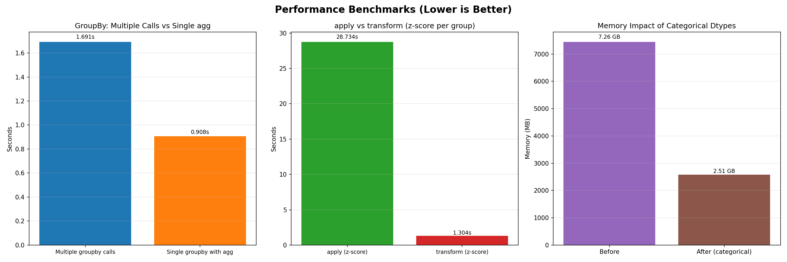

---
notion:
  title_line: "# Data Aggregation and Group Operations"
  role: lecture
  status: mapped
  page_id: "2a1d9fdd-1a1a-80f8-b1e8-f7b20e4a2e84"
  url: "https://app.notion.com/p/2a1d9fdd1a1a80f8b1e8f7b20e4a2e84"
---

# Data Aggregation and Group Operations

See [BONUS.md](BONUS.md) for the optional extensions.

**Live notebooks in Colab:** [Demo 1](https://colab.research.google.com/github/christopherseaman/datasci_217/blob/main/08/demo/demo1_groupby_operations.ipynb) · [Demo 2](https://colab.research.google.com/github/christopherseaman/datasci_217/blob/main/08/demo/demo2_coverage_result_shapes.ipynb) · [Demo 3](https://colab.research.google.com/github/christopherseaman/datasci_217/blob/main/08/demo/demo3_remote_performance.ipynb)

_"Aggregation" comes from the Latin "aggregare," to add to a flock, which is what a groupby does with scattered rows._

This lecture covers:

- McKinney, _Python for Data Analysis_ (3rd ed.): 7.5 (computations with categoricals) and 10.1 to 10.5 (group operations, data aggregation, apply, group transforms, and pivot tables and cross-tabulation)
- Shotts, _The Linux Command Line_: Chapter 16 (secure communication with remote hosts: `ssh`, tunneling with SSH, and `scp`)
- MIT, _The Missing Semester of Your CS Education_: "Command-line Environment" (terminal multiplexers and remote machines) and "Debugging and Profiling" (timing)

# The Split-Apply-Combine Paradigm

**Split-apply-combine** is the pattern behind every grouped summary, and pandas runs it with `groupby()`. It answers questions such as "What is the average wait at each clinic?" from a visit log with one row per visit, returning one row per clinic.

- **Split**: sort rows into **groups** by a **grouping key**, a column whose values decide which group each row joins (here, `clinic`).
- **Apply**: run a calculation on each group separately (here, the mean of `wait_min`).
- **Combine**: collect the per-group results into a new table.

Grouping usually changes the grain, what one row represents (Lectures 06 and 07), so name it before and after.

```text
INPUT: one row per visit    SPLIT by clinic          APPLY mean     COMBINE: one row per clinic
clinic  wait_min
North   12            ┌──>  North: 12, 15, 6  ──>   11.0  ──┐     clinic  wait_min
North   15            │                                     │     East         9.0
North    6            ├──>  South: 20, 30     ──>   25.0  ──┼──>  North       11.0
South   20            │                                     │     South       25.0
South   30            └──>  East: 9           ──>    9.0  ──┘
East     9
```

# Basic GroupBy Operations

A **GroupBy object** is what `df.groupby('clinic')` returns: a record of which rows belong to which group, not yet a summary table. Nothing is calculated until you choose a column and an **aggregation**, a calculation that reduces each group's values to one number, such as a mean or a count.

## Aggregating Each Group

The snippets in this lecture use `visits`, six clinic visits:

```text
  clinic visit_type patient_id  wait_min  satisfaction
0  North        New        P01        12           4.0
1  North  Follow-up        P02        15           NaN
2  North  Follow-up        P01         6           5.0
3  South        New        P03        20           3.0
4  South        New        P04        30           NaN
5   East  Follow-up        P05         9           4.0
```

### Reference Card: GroupBy Aggregation

| Task | Call | Purpose and key arguments | Output |
| --- | --- | --- | --- |
| Split | `df.groupby('key')` | Group rows by one key; pass a list for several keys | `DataFrameGroupBy`; nothing computed yet |
| Select | `grouped['col']` / `grouped[['a', 'b']]` | Choose the columns to summarize; `.mean()` on text columns raises `TypeError`, and `.sum()` glues text together (`P01P02P01`) | `SeriesGroupBy` / `DataFrameGroupBy` |
| Summarize | `.mean()`, `.median()`, `.sum()`, `.min()`, `.max()` | One summary per group of the selected numeric column | One row per group |
| Count | `.size()` | Rows per group, including rows with missing values | One count per group |
| Count | `['col'].count()` | Non-missing values of `col` per group | One count per group |
| Count | `['col'].nunique()` | Distinct non-missing values of `col` per group | One count per group |
| Several at once | `.agg(name=('col', 'func'), ...)` | Named aggregation: output name, source column, function | One flat column per name |
| Several at once | `.agg({'col': ['mean', 'max']})` | Several functions per column | Two-level column labels |
| Result shape | `groupby(..., as_index=False)` | Keep keys as ordinary columns | Flat table, `0..n-1` index |
| Result shape | `groupby(..., sort=True)` | Sort rows by key (the default); categorical keys follow category order | Ordered rows |

### Code Snippet: One Mean per Clinic

```python
grouped = visits.groupby('clinic')
print(grouped)
print(grouped['wait_min'].mean())
```

```text
<pandas.api.typing.DataFrameGroupBy object at 0x...>
clinic
East      9.0
North    11.0
South    25.0
Name: wait_min, dtype: float64
```

Printing the GroupBy object shows no numbers; `.mean()` on the selected column runs the apply and combine steps, with the clinics in alphabetical order.

### Code Snippet: Count and Summarize Each Clinic

**Named aggregation** builds a summary table in one `.agg()` call: each keyword names an output column, and its value is a `(source column, function)` pair, so `mean_wait=('wait_min', 'mean')` averages `wait_min` into a column called `mean_wait`.

```python
summary = visits.groupby('clinic', as_index=False).agg(
    visits=('patient_id', 'size'),
    patients=('patient_id', 'nunique'),
    rated=('satisfaction', 'count'),
    mean_wait=('wait_min', 'mean'),
)
print(summary)
```

```text
  clinic  visits  patients  rated  mean_wait
0   East       1         1      1        9.0
1  North       3         2      2       11.0
2  South       2         2      1       25.0
```

North had three visits (`size`) from two patients (`nunique`: P01 came twice), and only two of those visits have a satisfaction score (`count` skips `NaN`).


## Grouping by Two Keys

Pass a list of keys to get one group per observed combination. The result has a MultiIndex (Lecture 06), one index level per key, and `.unstack()` moves the inner level into columns so the table reads like a grid.

### Reference Card: Two-Key Results

- `df.groupby(['a', 'b'])['col'].mean()`: One value per observed `(a, b)` pair; MultiIndex `Series`.
- `result.unstack()`: Move the inner level (`b`) into columns; absent pairs become `NaN`.
- `wide.stack()`: Move the columns back into the inner index level; absent pairs come back as `NaN` rows.
- `df.groupby(['a', 'b'], as_index=False)`: Keep `a` and `b` as ordinary columns; one flat row per pair.

### Code Snippet: Mean Wait by Clinic and Visit Type

```python
by_type = visits.groupby(['clinic', 'visit_type'])['wait_min'].mean()
print(by_type)
print(by_type.unstack())
```

```text
clinic  visit_type
East    Follow-up      9.0
North   Follow-up     10.5
        New           12.0
South   New           25.0
Name: wait_min, dtype: float64
visit_type  Follow-up   New
clinic
East              9.0   NaN
North            10.5  12.0
South             NaN  25.0
```

East had no new-patient visits, so East–New is `NaN`: there was nothing to average, which is not a zero-minute wait (those exist only in clinic brochures).

# Pivot Tables and Cross-Tabulations


A **pivot table** summarizes one column by two keys at once, one down the rows and one across the columns, so the result reads as a grid, such as mean wait by clinic and visit type; it is the two-key `groupby(...).mean().unstack()` in a single call. A **cross-tabulation** (crosstab) is the special case that counts the rows in each combination.

```text
LONG: one row per visit                    PIVOT TABLE: mean wait_min, one row per clinic
clinic  visit_type  wait_min               visit_type  Follow-up   New
North   New         12                     clinic
North   Follow-up   15  ┐ mean → 10.5      East              9.0   NaN   ← no East new-patient visits
North   Follow-up    6  ┘                  North            10.5  12.0
South   New         20  ┐ mean → 25.0      South             NaN  25.0
South   New         30  ┘
East    Follow-up    9
```

## Basic Pivot Tables

### Reference Card: Pivot Tables and Crosstabs

| Call | Purpose and key arguments | Output |
| :--- | :--- | :--- |
| `pd.pivot_table(df, values=..., index=..., columns=..., aggfunc='mean')` | Group by the `index` and `columns` keys and summarize `values` in each cell; `aggfunc` picks the summary (`'mean'`, `'sum'`, `'count'`, ...). Unlike `pivot()` (Lecture 06), repeated key pairs are summarized, not an error | Wide table; absent combinations are `NaN` |
| `pd.pivot_table(..., aggfunc=['sum', 'mean'])` | Several summaries at once; `result['sum']` selects one | Two-level column labels |
| `pd.pivot_table(..., sort=True)` | Order the rows and columns by key (the default); `sort=False` leaves both in first-appearance order | Predictable row and column order |
| `pd.crosstab(df['a'], df['b'])` | Count rows for each combination of two columns; pass a list such as `[df['a'], df['c']]` for two-level rows | Counts; absent combinations are 0 |
| `pd.crosstab(df['a'], df['b'], values=df['v'], aggfunc='mean')` | Summarize a third column instead of counting, like `pivot_table` | Summary table; absent combinations are `NaN` |

### Code Snippet: A Pivot Table and Its GroupBy Twin

```python
mean_wait = pd.pivot_table(visits, values='wait_min', index='clinic',
                           columns='visit_type', aggfunc='mean')
print(mean_wait)

same = visits.groupby(['clinic', 'visit_type'])['wait_min'].mean().unstack()
print(mean_wait.equals(same))   # True

print(pd.crosstab(visits['clinic'], visits['visit_type']))
```

```text
visit_type  Follow-up   New
clinic
East              9.0   NaN
North            10.5  12.0
South             NaN  25.0
True
visit_type  Follow-up  New
clinic
East                1    0
North               2    1
South               0    2
```

## Totals and Absent Cells

**Margins** are a total row and column, computed from the underlying rows rather than from the cells: in a table of means, a clinic's `Total` is the mean of all its visits, not the average of its cell means.

### Reference Card: Pivot Table Totals and Fills

| Option | Purpose and key arguments | Output effect |
| :--- | :--- | :--- |
| `margins=True, margins_name='Total'` | Add a row and column of totals computed from the underlying rows; `margins_name` labels them (default `All`); `pd.crosstab()` takes the same two options | Extra `Total` row and column |
| `fill_value=0` | Replace absent cells with 0, only for counts and sums | No-`NaN` cells |

### Code Snippet: Totals Where Zero Is Real

```python
total_wait = pd.pivot_table(visits, values='wait_min', index='clinic',
                            columns='visit_type', aggfunc='sum',
                            fill_value=0, margins=True, margins_name='Total')
print(total_wait)
```

```text
visit_type  Follow-up  New  Total
clinic
East                9    0      9
North              21   12     33
South               0   50     50
Total              30   62     92
```

<callout icon="⚠️" color="yellow_bg">
	## `fill_value=0` only where zero is real
	An absent (`NaN`) cell means no rows had that combination. For a count or a sum that really is 0: East's total new-patient wait above is 0 minutes. For a mean, a minimum, or any other measurement it is not: filling East–New in the table of means with 0 reports a zero-minute wait that never happened, so leave it `NaN`.
</callout>

# LIVE DEMO!

# Which Groups Appear in a Summary

**Group coverage**, which groups a summary lists, shrinks under two pandas defaults without warning: rows with a missing key are dropped before the split, and a categorical key (Lecture 05) lists only the categories that occur in the data. A report can then silently leave out visits with no clinic recorded, or a new clinic with no visits yet.

## Missing Keys and Unused Categories

Declaring a key's categories with `pd.Categorical(..., categories=[...])` sets the order of the results: with the default `sort=True`, groups follow the order listed in `categories=`, not alphabetical order.

| What the April visit log held | The default summary | What a handed-off report should show |
| --- | --- | --- |
| North 3, South 2, East 1 visits | three rows, alphabetical | three rows, in your reporting order |
| West opened in March, no visits yet | no West row at all | `West 0` |
| One visit with no clinic recorded | dropped before the split, uncounted | a `NaN` row you can see and explain |

### Reference Card: Group Coverage Options

- `df.groupby('key', dropna=False)`: Keep rows with a missing key as a `NaN` group, listed last. The default, `dropna=True`, leaves them out.
- `df.groupby('key', observed=False)`: For a categorical key, list every defined category; an unused one shows 0 for counts and sums and `NaN` for means. The pandas 3 default, `observed=True`, lists only categories present. For plain text keys, `observed` does nothing.
- `pd.Categorical(values, categories=[...], ordered=True)`: Declare the allowed values and their reporting order; `ordered=True` records that the order is meaningful. Prints `Categories (4, str): ['North' < 'South' < 'East' < 'West']` under the values. A value missing from `categories=` becomes `NaN` with a warning, so list every value that occurs.
- `pd.pivot_table(..., observed=False, dropna=False)`: The same two choices for a pivot table's rows and columns, plus one extra job for `dropna=`. The default, `dropna=True`, also drops any row or column whose cells all came out `NaN`. Counting an unused category gives `0`, so it stays; averaging one gives `NaN`, so it disappears unless you pass `dropna=False`. The kept `NaN` row is not always last: with a categorical key, `observed=False`, and a `columns=` key it comes out first, so find it by its label.

### Code Snippet: A Reporting Order and an Unused Clinic

```python
levels = ['North', 'South', 'East', 'West']   # reporting order; West has no visits yet
cat_visits = visits.copy()
cat_visits['clinic'] = pd.Categorical(visits['clinic'], categories=levels, ordered=True)
print(cat_visits.groupby('clinic', observed=True)['wait_min'].count())
print(cat_visits.groupby('clinic', observed=False)['wait_min'].count())
```

```text
clinic
North    3
South    2
East     1
Name: wait_min, dtype: int64
clinic
North    3
South    2
East     1
West     0
Name: wait_min, dtype: int64
```

### Code Snippet: A Visit with No Clinic Recorded

```python
unrecorded = visits.copy()
unrecorded.loc[5, 'clinic'] = None     # the clinic was not written down for this visit
print(unrecorded.groupby('clinic')['wait_min'].count())
print(unrecorded.groupby('clinic', dropna=False)['wait_min'].count())
```

```text
clinic
North    3
South    2
Name: wait_min, dtype: int64
clinic
North    3
South    2
NaN      1
Name: wait_min, dtype: int64
```

That visit was East's only one, so the default report drops East entirely: six visits went in, five are counted, and nothing says so. `dropna=False` keeps the visit as a `NaN` group you can see.


# GroupBy Result-Shape Choices

A GroupBy method's **result shape** is how many rows it returns and at which grain: `agg` returns one row per group, `transform` one row per original row, `filter` the original rows of the groups that pass, and `apply` whatever your function builds. Decide the grain the answer needs, then choose the method that returns it.

| Operation | Question it answers (clinic visits) | Rows returned | Grain of the result |
| --- | --- | --- | --- |
| `agg` | What is the mean wait at each clinic? | 3 | One row per clinic |
| `transform` | How does each visit compare with its clinic's mean? | 6, same index as `visits` | One row per visit |
| `filter` | Which visits belong to clinics with at least two visits? | 5 (East dropped) | One row per visit |
| `apply` | Which visit (the whole row) had the longest wait at each clinic? | Depends on the function (3 here) | Depends on the function (one visit per clinic here) |

Use `agg`, `transform`, or `filter` whenever one fits; a single number such as the longest wait is just `agg('max')`. `apply` is the slower fallback for custom per-group work, such as returning whole rows.

## Transform Operations

**transform** computes a statistic for each group and copies it back to every row of that group. The result has the same length and index as the table, so it can become a new column that compares each row with its group.

A **z-score** measures that difference in standard deviations: `(value - group_mean) / group_std`. A score of 0 is the group's mean; 1 is one standard deviation above it. Demo 2 uses this to compare waits across departments with different typical waits and spreads.

### Reference Card: Transform Operations

| Call | Purpose and key arguments | Output |
| :--- | :--- | :--- |
| `grouped.transform('mean')` | Broadcast each group's mean to its original rows | Series aligned to original index |
| `grouped.transform('std')` | Broadcast within-group spread | Series aligned to original index |
| `grouped.transform(lambda x: x - x.mean())` | Compute a custom within-group value | Same row count as input |
| `grouped.agg(['mean', 'std'])` | Compare with a reducing summary | One row per group |

### Code Snippet: Compare Each Visit with Its Clinic

```python
with_context = visits.copy()   # visits itself stays unchanged
with_context['clinic_mean_wait'] = visits.groupby('clinic')['wait_min'].transform('mean')
with_context['wait_vs_clinic'] = with_context['wait_min'] - with_context['clinic_mean_wait']
print(with_context[['clinic', 'patient_id', 'wait_min', 'clinic_mean_wait', 'wait_vs_clinic']])
```

```text
  clinic patient_id  wait_min  clinic_mean_wait  wait_vs_clinic
0  North        P01        12              11.0             1.0
1  North        P02        15              11.0             4.0
2  North        P01         6              11.0            -5.0
3  South        P03        20              25.0            -5.0
4  South        P04        30              25.0             5.0
5   East        P05         9               9.0             0.0
```

East's one visit sits exactly at its clinic's mean: it is easy to be average when you are the whole group.

<callout icon="⚠️" color="yellow_bg">
	## A group summary does not line up with the rows
	`visits['clinic_mean_wait'] = visits.groupby('clinic')['wait_min'].mean()` fills every row with `NaN`, and no error says why: pandas matches a new column to rows by index label (Lecture 04), and the summary is labeled by clinic name while the rows are labeled 0 to 5. `transform('mean')` returns one value per row with the table's own index, so it lines up. Demo 2 shows the mistake and the fix.
</callout>

## Filter and Custom Results

**filter** tests each whole group and keeps its original rows when the test passes. **apply** hands each group to your function and combines its results; the result can be a number, a summary, or several original rows.

| Method | Result grain |
| --- | --- |
| `filter` | Original visits from qualifying clinics |
| `apply` returning rows | Selected visits, with clinic and original row index |

### Reference Card: Keep Groups or Return Custom Rows

- `grouped.filter(lambda g: len(g) >= 2)`: Keep every visit from clinics with at least two visits; replace the test with a group mean or sum threshold.
- `grouped.apply(func, include_groups=False)`: Run a custom function on each group's columns, excluding the grouping column; the returned objects determine the result shape.
- `g.nlargest(1, 'wait_min')`: Return the longest-wait visit in one group.

### Code Snippet: Keep Whole Groups or One Row per Group

```python
busy = visits.groupby('clinic').filter(lambda g: len(g) >= 2)
longest = visits.groupby('clinic').apply(
    lambda g: g.nlargest(1, 'wait_min'), include_groups=False,
)
print(len(busy), longest['wait_min'].tolist())  # 5 [9, 15, 30]
```

Use `agg` or `transform` whenever one fits; `apply` is the slower fallback for custom work. In pandas 3, `include_groups=False` is the only allowed setting: the function does not receive the clinic column. Demo 2's independent practice develops the full filtering and custom-summary workflow.


# LIVE DEMO!

# Performance Optimization

**Performance optimization** means making an analysis run faster or use less memory, which matters once a summary that takes a second on a class example takes minutes on a year of hospital lab results. Measure first, with `%timeit` (Lecture 04) for time and `df.memory_usage(deep=True)` (Lecture 05) for memory, and change only the step where the time or memory goes.



- One `.agg()` call computing several summaries beats calling `groupby()` again for each summary, because every new `groupby()` call redoes the split.
- Built-in aggregations named by string (`'mean'`, `'std'`, `transform('mean')`) run as fast compiled code. A Python `lambda` or `apply` runs once per group and can be 20-50× slower.
- A repeated text key stored as `category` (Lecture 05) uses far less memory.

## Measure, Then Optimize

### Reference Card: Measure, Then Optimize

| Task | Tool | Use when | Typical output |
| --- | --- | --- | --- |
| Measure time | `%timeit expression` | Comparing two ways to get the same result in a notebook | `8.8 ms ± 0.1 ms per loop ...` |
| Measure time | `time python3 analysis.py` | Timing a whole script in the terminal | `real 0m12.3s` |
| Measure memory | `df.memory_usage(deep=True)` | Finding the largest columns | Bytes per column |
| Faster | One `.agg(...)` with several summaries | You need several statistics per group | One pass, one table |
| Faster | String aggregations and `transform('mean')` instead of `lambda`/`apply` | The statistic is built in | Same numbers, much faster |
| Smaller | `.astype('category')` on repeated text keys | Few distinct values repeated many times | Less memory |

### Code Snippet: Measure Before and After

On Demo 3's `labs`, one million glucose results with a text `clinic` column:

```python
print(round(labs['clinic'].memory_usage(deep=True) / 1e6, 1))   # 53.5 (MB as text)
labs['clinic'] = labs['clinic'].astype('category')
print(round(labs['clinic'].memory_usage(deep=True) / 1e6, 1))   # 1.0 (MB as category)

by_patient = labs.groupby('patient_id')['glucose']
%timeit by_patient.agg('std')                                   # about 9 ms
%timeit by_patient.agg(lambda s: s.std())                       # about 450 ms: same values, ~50x slower
```

Colab has the `pyarrow` package installed, which stores text more compactly, so there the text column takes 12.5 MB instead of 53.5; the category takes 1.0 MB either way. When data do not fit in memory at all, [BONUS.md](BONUS.md#scaling-past-memory-chunks-and-processes) covers chunked reading and parallel processing.


# Remote Computing with SSH

**SSH** (Secure Shell) opens an encrypted terminal on another computer, a **server** or **host**, so you can run analyses too large or too long for a laptop. Health data with **protected health information** (PHI), records that can identify a person, often may not leave an approved secure server, so you bring your code to the data and take back only permitted results.

## Connect and Copy Files

The server's operator supplies its hostname, your account, and how to log in. Once connected, the shell commands from Lectures 01 and 02 (`pwd`, `ls`, `cd`, `python3`) run on the server, and the prompt shows where you are:

```text
you@laptop:~$ ssh jdoe@analysis.example.org
The authenticity of host 'analysis.example.org' can't be established.
ED25519 key fingerprint is SHA256:...
Are you sure you want to continue connecting (yes/no/[fingerprint])? yes
jdoe@analysis:~$ hostname
analysis
jdoe@analysis:~$ exit
you@laptop:~$
```

The first connection shows the server's **host key fingerprint**, a code that identifies that server; type `yes` only if it matches the fingerprint the server's administrator published, and SSH remembers the server after that. A password prompt shows nothing as you type; that is normal.

Most servers use an **SSH key pair** instead of a password. `ssh-keygen` creates two files: the **public key**, `~/.ssh/id_ed25519.pub`, works like a padlock you install on every server you use, and the **private key**, `~/.ssh/id_ed25519`, is the only key that opens it.

<callout icon="⚠️" color="yellow_bg">
	## Never share your private key
	`~/.ssh/id_ed25519` stays on your laptop: never email, upload, or commit it, because anyone holding it can log in as you. Only the `.pub` file goes to servers.
</callout>

### Reference Card: SSH File and Shell Commands

| Command | Purpose and key arguments | Result |
| :--- | :--- | :--- |
| `ssh user@host` | Open a remote shell | Remote prompt |
| `ssh -p port user@host` | Connect through a nondefault port | Remote prompt |
| `ssh user@host 'command'` | Run one command remotely | Command output locally |
| `scp local user@host:path` | Copy a local file to the server | Remote file |
| `scp user@host:path local` | Copy a remote file back | Local file |
| `ssh-keygen -t ed25519` | Create a public/private key pair; `-C "email"` labels it | `~/.ssh/id_ed25519` and `~/.ssh/id_ed25519.pub` |
| `ssh-keygen -t ed25519 -f path` | Save the pair at `path` instead of the default, such as a practice key that must not replace your real one | `path` and `path.pub` |
| `ssh-copy-id user@host` | Install the public key where supported | Passwordless key login |
| `ssh-add` | Unlock your private key once per login session; the SSH agent keeps it unlocked | Later `ssh` and `scp` stop asking for the passphrase |

### Code Snippet: Create a Key Pair

Run this once on your laptop; both key files are saved locally. Install only the public half using the server's instructions or `ssh-copy-id` where supported.

```bash
ssh-keygen -t ed25519 -C "your_email@example.com"
```

`ssh-keygen` asks where to save the key (press Enter for the default) and for a passphrase that protects the private key file; set one. `ssh-add` asks for the passphrase once, and the **SSH agent**, a background program on your laptop, then keeps the key unlocked until you log out or restart, so `ssh`, `scp`, and `ssh-copy-id` stop asking. macOS runs an agent for you. If `ssh-add` says it cannot connect to your authentication agent (common in WSL), skip it and type the passphrase when each command asks.

If `ssh-keygen` says a key already exists and asks `Overwrite (y/n)?`, answer `n` and keep using that key; replacing it would break access to servers that trust its public half.

### Code Snippet: Open a Remote Shell

Run this on your laptop. It opens the server's prompt, where subsequent commands run on the server. Type `exit` there to return to your laptop's prompt.

```bash
ssh username@server.example
```

### Code Snippet: Upload a File

Run this from your laptop's prompt, after leaving any remote shell. It copies local `data.csv` into the server's existing `~/data/` folder and returns to the local prompt.

```bash
scp data.csv username@server.example:~/data/
```

### Code Snippet: Download a Result

Run this from your laptop's prompt. It copies the server's `analysis.csv` into your current local folder and returns to the local prompt.

```bash
scp username@server.example:~/results/analysis.csv ./
```


## Keep Long Jobs Alive with tmux or screen

When an SSH connection drops (laptop sleeps, Wi-Fi changes), programs tied to that terminal can stop, including an analysis three hours into a four-hour run. A **terminal multiplexer** such as `tmux` keeps a shell running on the server by itself: you **detach**, disconnect, and later **attach** again to find the job still running. A session survives disconnects, not a server restart. `screen` is an older alternative; use whichever the server provides. [Tmux Fundamentals](https://linuxhandbook.com/courses/tmux/) is a guided introduction.

```text
laptop ── ssh ──> server
                   └─ tmux session "analysis"   (keeps running after you disconnect)
                        └─ python3 analysis.py
```

### Reference Card: tmux Sessions

- Install: servers usually have tmux already. To practice on your laptop, `brew install tmux` (macOS) or `sudo apt install tmux` (Ubuntu or WSL); `tmux -V` prints the version.
- `tmux new -s analysis`: Start a session named `analysis`; a status bar appears at the bottom.
- `Ctrl+b`, then `d`: Detach; the session keeps running and you return to the normal prompt.
- `tmux ls` (short for `tmux list-sessions`): List sessions; output looks like `analysis: 1 windows (created Fri Sep 18 15:32:45 2026)`.
- `tmux attach -t analysis`: Reattach to the session.
- `exit` inside the session: End it when the job is done.
- `tmux kill-session -t analysis`: End a detached session from outside, stopping anything still running in it.
- Alternative: `screen -S analysis`; detach with `Ctrl+a`, then `d`; reattach with `screen -r analysis`.

### Code Snippet: Keep an Analysis Running

On the server, after `ssh`, in a project folder whose environment you built there with `uv venv --seed` and `uv sync` (Lecture 03):

```bash
tmux new -s analysis
source .venv/bin/activate
time python3 analysis.py
```

Press `Ctrl+b`, then `d`, to detach; now it is safe to disconnect. Later, after reconnecting with `ssh`, find the session and attach to it; when the job ends, `time` reports how long it ran:

```bash
tmux ls
tmux attach -t analysis
```

## Run Jupyter Through an SSH Tunnel

`jupyter lab` (Lecture 04) starts Jupyter as a small web server that your browser talks to. Programs like this listen on a numbered **port**; Jupyter uses 8888 by default. On a shared server, start Jupyter so it accepts connections only from `127.0.0.1`, also called **localhost** ("this same computer"), so nobody else on the network can reach it. An **SSH tunnel**, a private pipe inside your SSH connection, then carries anything sent to port 8888 on your laptop to port 8888 on the server: your browser works as if Jupyter were local, while the kernel, files, memory, and CPU are on the server.

```text
laptop browser → localhost:8888 ══ SSH tunnel ══> server localhost:8888 → Jupyter
```

### Reference Card: Jupyter Through a Tunnel

- `jupyter lab --ip=127.0.0.1 --port=8888 --no-browser` (on the server, inside tmux): Start Jupyter for localhost only; it prints a URL ending in `?token=...`, a password generated for this session.
- `ssh -N -L 8888:127.0.0.1:8888 user@host` (in a second, local terminal): `-L laptop_port:server_address:server_port` builds the tunnel; `-N` opens no remote shell, so the terminal shows nothing while the tunnel is open.
- Paste the printed `http://127.0.0.1:8888/lab?token=...` URL into your laptop's browser.
- `Ctrl+C` in the tunnel terminal: Close the tunnel; Jupyter keeps running in tmux.
- If port 8888 is already in use on your laptop (for example, by a local Jupyter), use `-L 8889:127.0.0.1:8888` and change 8888 to 8889 in the URL.

### Code Snippet: Start Jupyter and Open the Tunnel

On the server, in a project whose `pyproject.toml` lists JupyterLab (`uv add jupyterlab` adds it), start a persistent session, then launch Jupyter inside it:

```bash
tmux new -s notebooks
source .venv/bin/activate
jupyter lab --ip=127.0.0.1 --port=8888 --no-browser
```

In a second, local terminal:

```bash
ssh -N -L 8888:127.0.0.1:8888 username@server.example
```

# LIVE DEMO!
