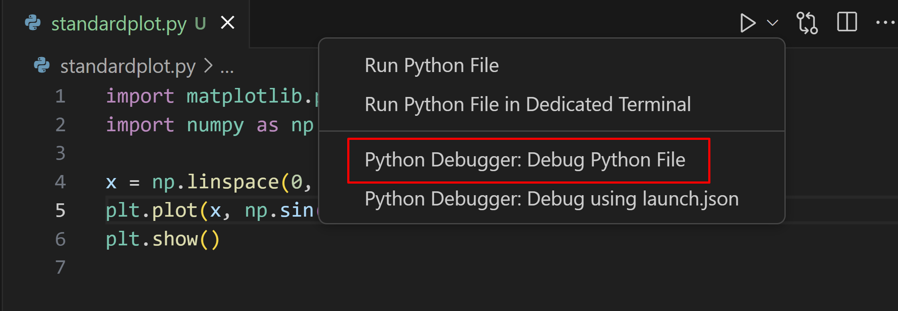
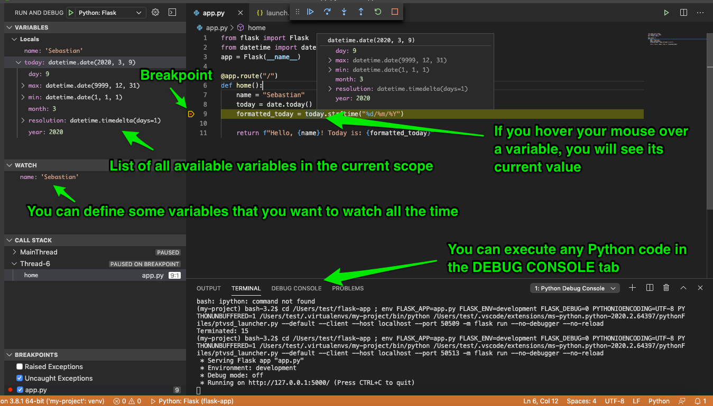

# Everyday Python

- Quick summary of where we've been
- Debugging
  - Linting (`pylint` & `ruff`)
  - Debugging techniques
    - Reading error messages
    - Debugging statements
    - Using the VS Code debugger
- Error Handling
  - Try/except blocks
  - Exception types
  - Custom exceptions
- Machine Learning
  - Keras/TensorFlow
  - PyTorch
  - Model selection and evaluation flow

---

## Basic Python

- Variables and Data Types
  - Integers, floats, strings
  - Variables are dynamically typed
  - Type conversion and checking
  - String operations and f-strings

- Control Structures
  - If/elif/else conditionals
  - For and while loops
  - Break and continue statements
  - Compound conditions with `and`, `or`, `not`

---

## Functions and Methods

- Functions and Methods
  - Function definition with `def`
  - Parameters and return values
  - Default arguments
  - Command line arguments

- Packages and Modules
  - Installing packages
  - Importing with aliases
  - Specific functions and classes
  - Managing virtual environments

---

## Data Structures

- Lists
  - Creation and indexing
  - List methods (append, extend, pop)
  - List slicing and operations
  - List comprehensions
  - Sorting and searching

- Dictionaries
  - Key-value pairs
  - Dictionary methods
  - Nested dictionaries
  - Dictionary comprehensions
  - Default dictionaries

---

## Data Structures II

- Sets
  - Unique elements
  - Set operations (union, intersection)
  - Set methods
  - Set comprehensions

- Tuples
  - Immutable sequences
  - Tuple packing/unpacking
  - Named tuples
  - Using tuples as dictionary keys

---

## File Operations

- File Handling
  - Opening and closing files
  - Reading and writing text files
  - Context managers (`with` statement)
  - Binary file operations
  - CSV and JSON handling

- Path Operations
  - Path manipulation with `os.path`
  - Modern path handling with `pathlib`
  - Directory operations
  - File system navigation

---

## Numerical Packages

- NumPy
  - Arrays and operations
  - Broadcasting
  - Mathematical functions
  - Array manipulation

- Pandas
  - Series and DataFrames
  - Data loading and saving
  - Data cleaning and transformation
  - Grouping and aggregation
  - Time series functionality

---

## Data Visualization

- Matplotlib
- Seaborn statistical plots
- Interactive visualization
- Customizing plots

---

## Statistical Methods

- Time Series Analysis
  - DateTime handling
  - Resampling and rolling windows
  - Seasonal decomposition
  - ARIMA models
- statsmodels
  - Linear regression
  - Generalized linear models
  - Statistical tests
  - Model diagnostics
- Machine Learning
  - scikit-learn basics
  - Model selection and evaluation
  - Feature engineering
  - Cross-validation

---

## Data Science Fundamentals

- Jupyter Notebooks
  - Remote access and configuration
  - Magic commands
  - Cell execution and kernel management
- NumPy
  - Array operations and broadcasting
  - Mathematical functions
  - Array manipulation and indexing
  - Universal functions (ufuncs)
- Pandas
  - Series and DataFrame objects
  - Data loading and manipulation
  - Missing data handling
  - Grouping and aggregation

---

## Code Quality Tools: Linters (1/6)

A "linter" is a program that highlights potential errors before you even try running the code. There are linters for pretty much every language you can think of, even Markdown. For Python, the linter that I recommend trying is `ruff`. It is much faster than `pylint` and I find it gets "confused" less often about the code context.

```python
# Installing linters
pip install pylint ruff

# Running pylint
pylint my_script.py

# Running ruff
ruff check .

# Example pylint output:
************* Module my_script
my_script.py:10:0: C0303: Trailing whitespace (trailing-whitespace)
my_script.py:15:0: C0116: Missing function docstring (missing-docstring)
```

<!--
- Linters catch common mistakes
- Enforce coding standards
- Improve code quality
- Prevent bugs before runtime
-->

---

## Understanding Errors (2/6)

```python
# 1. Print Debugging
def calculate_total(items):
    print(f"Debug: items received = {items}")  # Debug print
    total = 0
    for item in items:
        print(f"Debug: processing item = {item}")  # Debug print
        total += item['price']
    return total

# 2. Interactive Debugging with pdb (advanced)
def process_data(data):
    results = []
    for item in data:
        breakpoint()  # Starts interactive debugger
        result = complex_calculation(item)
        results.append(result)
    return results

# 3. Common Error Patterns
# NameError: Using undefined variables
def process_stats():
    total = count + 1  # count is not defined
    return total

# TypeError: Mixing incompatible types
def calculate_average(numbers):
    total = "0"  # String instead of number
    for num in numbers:
        total += num  # Can't add number to string
    return total / len(numbers)

# IndexError: Invalid list access
def get_first_elements(list1, list2):
    return [list1[0], list2[0]]  # Error if any list is empty

# KeyError: Missing dictionary key
def get_user_info(user_dict):
    return f"{user_dict['name']} is {user_dict['age']}"  # Error if keys don't exist

# AttributeError: Invalid object attributes
class User:
    def __init__(self, name):
        self.name = name

user = User("Alice")
email = user.email  # email attribute doesn't exist

# ValueError: Invalid type conversion
def parse_user_data(data_str):
    user_id = int(data_str)  # Error if data_str isn't a valid integer
    return user_id
```

<!--
- Use print statements strategically
- Interactive debugging with pdb
- Common error patterns
- Debug step by step
-->

---


## VS Code Debugger (3/6)

See the docs at [https://code.visualstudio.com/Docs/editor/debugging](https://code.visualstudio.com/Docs/editor/debugging)

```python
# debug_example.py
def process_list(items):
    total = 0
    for i, item in enumerate(items):
        # Set a breakpoint here in VS Code
        value = complex_calculation(item)
        total += value
    return total

def complex_calculation(x):
    # Step through this function
    intermediate = x * 2
    result = intermediate + 5
    return result

# Test data with potential issues
numbers = [1, 2, "3", 4]  # Bug: string in list
result = process_list(numbers)

<!--
- Set breakpoints in VS Code
- Step through code execution
- Inspect variables in debug view
- Configure debug settings
-->

---



---



---

## Try/Except Basics (4/6)

```python
def safe_divide(x, y):
    try:
        result = x / y
        return result
    except ZeroDivisionError:
        print("Error: Division by zero!")
        return None
    except TypeError as e:
        print(f"Error: Invalid types - {e}")
        return None
    finally:
        print("Division operation attempted")

# Example usage:
print(safe_divide(10, 0))       # Handles ZeroDivisionError
print(safe_divide("10", 2))     # Handles TypeError
```

<!--
- Handle specific exceptions
- Use descriptive error messages
- Implement cleanup with finally
- Return meaningful results
-->

---

## Exception Types (5/6)

```python
# Common built-in exceptions and when they occur
def demonstrate_exceptions():
    # IndexError
    list_demo = [1, 2, 3]
    try:
        value = list_demo[5]
    except IndexError as e:
        print(f"Index error: {e}")
    
    # TypeError
    try:
        result = "2" + 2
    except TypeError as e:
        print(f"Type error: {e}")
    
    # ValueError
    try:
        number = int("abc")
    except ValueError as e:
        print(f"Value error: {e}")
    
    # FileNotFoundError
    try:
        with open("nonexistent.txt") as f:
            content = f.read()
    except FileNotFoundError as e:
        print(f"File error: {e}")
```

<!--
- Choose appropriate exceptions
- Handle multiple error types
- Provide context in messages
- Learn from common errors
-->

---

## Custom Exceptions (6/6)

```python
class ValidationError(Exception):
    """Custom exception for data validation errors"""
    def __init__(self, message, value):
        self.message = message
        self.value = value
        super().__init__(self.message)

def validate_age(age):
    if not isinstance(age, (int, float)):
        raise ValidationError("Age must be a number", age)
    if age < 0 or age > 150:
        raise ValidationError("Age must be between 0 and 150", age)
    return age

# Using custom exception
try:
    user_age = validate_age("twenty")
except ValidationError as e:
    print(f"Invalid age: {e.message}, got {e.value}")
```

<!--
- Create specific exceptions
- Add custom attributes
- Improve error context
- Better error handling
-->

---

## Deep Learning Frameworks Introduction (1/2)

## Framework Overview

```python
# Keras/TensorFlow
import tensorflow as tf
from tensorflow import keras

# PyTorch
import torch
import torch.nn as nn

# Core concepts comparison
keras_model = keras.Sequential()  # Layer-based
torch_model = nn.Module()        # Class-based
```

<!--
- Multiple frameworks available
- Different programming paradigms
- Keras focuses on simplicity
- PyTorch emphasizes flexibility
-->

---

## Deep Learning Frameworks Introduction (2/2)

Hand-wavy explanation (many caveats apply)

- When to use Keras:
  - Quick prototyping
  - High-level APIs needed
  - Production with TensorFlow Serving

- When to use PyTorch:
  - Research/experimentation
  - Custom architectures
  - Dynamic computation graphs

Note: _most_ neural nets perform better with normalized data regardless of platform

<!--
- Framework choice depends on use case
- Keras excels in production deployment
- PyTorch popular in research
- Data preprocessing important for all
-->

---

## Keras Implementation (1/8)

## Layers & Activation Functions

```python
from tensorflow import keras

# Dense layers
model.add(keras.layers.Dense(64))

# Convolutional layers
model.add(keras.layers.Conv2D(32, (3, 3)))

# RNN layers
model.add(keras.layers.LSTM(64))

# Activation options
keras.activations.relu
keras.activations.sigmoid
keras.activations.tanh
```

<!--
- Keras provides high-level neural network APIs
- Common layer types available out of box
- Built-in activation functions
- Easy layer stacking with add()
-->

---

## Keras Implementation (2/8)

## Building Models - Part 1

```python
# Sequential API
model = keras.Sequential([
    keras.layers.Dense(64, activation='relu'),
    keras.layers.Dense(32, activation='relu'),
    keras.layers.Dense(1, activation='sigmoid')
])

# Model lifecycle
model.compile(optimizer='adam',
             loss='binary_crossentropy',
             metrics=['accuracy'])
```

<!--
- Sequential API for linear layer stacks
- Easy model definition and compilation
- Common optimizers and losses built-in
- Multiple metrics can be tracked
-->

---

## Keras Implementation (3/8)

## Building Models - Part 2

```python
# Functional API
inputs = keras.Input(shape=(784,))
x = keras.layers.Dense(64, activation='relu')(inputs)
outputs = keras.layers.Dense(10)(x)
model = keras.Model(inputs, outputs)

# Model subclassing
class CustomModel(keras.Model):
    def __init__(self):
        super().__init__()
        self.dense1 = keras.layers.Dense(64)
        self.dense2 = keras.layers.Dense(10)
```

<!--
- Functional API for complex architectures
- Multiple inputs/outputs possible
- Subclassing for custom behavior
- Different APIs for different needs
-->

---

## Keras Implementation (4/8)

## Data Preprocessing

```python
# Image data generators
datagen = keras.preprocessing.image.ImageDataGenerator(
    rotation_range=20,
    width_shift_range=0.2,
    height_shift_range=0.2,
    horizontal_flip=True
)

# Sequence generators
seq = keras.preprocessing.sequence.pad_sequences(
    sequences, maxlen=100
)

# Text preprocessing
vectorizer = keras.layers.TextVectorization(max_tokens=20000)
```

<!--
- Built-in data augmentation tools
- Sequence handling utilities
- Text preprocessing capabilities
- Real-time data generation
-->

---

## Keras Implementation (5/8)

## Loss Functions & Optimizers

```python
# Common loss functions
keras.losses.BinaryCrossentropy()
keras.losses.CategoricalCrossentropy()
keras.losses.MeanSquaredError()

# Optimizer selection
keras.optimizers.Adam(learning_rate=0.001)
keras.optimizers.SGD(learning_rate=0.01, momentum=0.9)

# Learning rate scheduling
keras.optimizers.schedules.ExponentialDecay(
    initial_learning_rate=0.1,
    decay_steps=10000,
    decay_rate=0.9
)
```

<!--
- Comprehensive loss function library
- Multiple optimizer options
- Learning rate scheduling
- Easy parameter tuning
-->

---

## Keras Implementation (6/8)

## Model Training

```python
# Fit method
history = model.fit(
    x_train, y_train,
    epochs=10,
    batch_size=32,
    validation_split=0.2
)

# Callbacks
callbacks = [
    keras.callbacks.EarlyStopping(patience=3),
    keras.callbacks.ModelCheckpoint('best_model.h5'),
    keras.callbacks.TensorBoard(log_dir='./logs')
]
```

<!--
- Simple fit API for training
- Built-in validation support
- Rich callback system
- Training monitoring tools
-->

---

## Keras Implementation (7/8)

## Transfer Learning

```python
# Pre-trained models
base_model = keras.applications.ResNet50(
    weights='imagenet',
    include_top=False
)

# Feature extraction
base_model.trainable = False

# Fine-tuning
base_model.trainable = True
for layer in base_model.layers[:-4]:
    layer.trainable = False
```

<!--
- Pre-trained models available
- Easy feature extraction
- Fine-tuning capabilities
- Layer freezing control
-->

---

## Keras Implementation (8/8)

## Model Evaluation

```python
# Metrics
model.evaluate(x_test, y_test)

# Custom metrics
class F1Score(keras.metrics.Metric):
    def __init__(self, name='f1_score', **kwargs):
        super().__init__(name=name, **kwargs)
        self.precision = keras.metrics.Precision()
        self.recall = keras.metrics.Recall()

# Visualization
keras.utils.plot_model(model, show_shapes=True)
```

<!--
- Built-in evaluation methods
- Custom metric definition
- Model visualization tools
- Comprehensive evaluation options
-->

---

## PyTorch Implementation (1/7)

## Neural Network Fundamentals

```python
# Input: input tensor of shape (batch_size, channels, height, width)
# Output: tensor transformed by convolutional and linear layers
class Net(nn.Module):
    def __init__(self):
        super().__init__()
        self.conv1 = nn.Conv2d(1, 32, 3)  # 1 input channel, 32 output channels, 3x3 kernel
        self.fc1 = nn.Linear(32, 10)      # 32 input features, 10 output classes
    
    def forward(self, x):
        x = self.conv1(x)
        return self.fc1(x)
```

<!--
- PyTorch uses object-oriented model definition
- Models inherit from nn.Module base class
- Forward method defines computation flow
- Explicit control over network architecture
-->

---

## PyTorch Implementation (2/7)

## Data Management

```python
from torch.utils.data import Dataset, DataLoader

class CustomDataset(Dataset):
    def __init__(self, data):
        self.data = data
    
    def __len__(self):
        return len(self.data)
    
    def __getitem__(self, idx):
        return self.data[idx]

loader = DataLoader(dataset, batch_size=32, shuffle=True)
```

<!--
- Custom datasets inherit from Dataset class
- DataLoader handles batching and shuffling
- Efficient memory management for large datasets
- Easy integration with custom data formats
-->

---

## PyTorch Implementation (3/7)

## Model Architecture

```python
# Creating networks
class CNN(nn.Module):
    def __init__(self):
        super().__init__()
        self.features = nn.Sequential(
            nn.Conv2d(1, 32, 3),
            nn.ReLU(),
            nn.MaxPool2d(2)
        )

# Loss functions
criterion = nn.CrossEntropyLoss()
```

<!--
- Sequential containers simplify architecture
- Built-in activation functions and layers
- Common loss functions provided
- Flexible architecture customization
-->

---

## PyTorch Implementation (4/7)

## Training Implementation

```python
# Training loop
optimizer = torch.optim.Adam(model.parameters())
for epoch in range(epochs):
    for batch in dataloader:
        optimizer.zero_grad()
        output = model(batch)
        loss = criterion(output, target)
        loss.backward()
        optimizer.step()

# Validation
model.eval()
with torch.no_grad():
    val_loss = criterion(model(val_data), val_target)
```

<!--
- Explicit training loop provides control
- Gradient computation with backward()
- Optimizer handles parameter updates
- Context managers for evaluation mode
-->

---

## PyTorch Implementation (5/7)

## Advanced Features

```python
# Hooks
def hook_fn(module, input, output):
    print(output.shape)
model.register_forward_hook(hook_fn)

# Distributed training
model = nn.DataParallel(model)

# Mixed precision
scaler = torch.cuda.amp.GradScaler()
with torch.cuda.amp.autocast():
    output = model(input)
```

<!--
- Hooks enable intermediate layer inspection
- Distributed training scales to multiple GPUs
- Mixed precision speeds up training
- Advanced features for research needs
-->

---

## PyTorch Implementation (6/7)

## Advanced Training Concepts

```python
# Memory management
torch.cuda.empty_cache()

# GPU utilization
device = torch.device('cuda' if torch.cuda.is_available() else 'cpu')
model.to(device)

# Multi-GPU training
if torch.cuda.device_count() > 1:
    model = nn.DataParallel(model)
```

<!--
- Explicit memory management available
- Seamless CPU/GPU switching
- Multi-GPU support built-in
- Performance optimization options
-->

---

## Training Monitoring (7/7)

```python
# TensorBoard
from torch.utils.tensorboard import SummaryWriter
writer = SummaryWriter()
writer.add_scalar('Loss/train', loss, epoch)

# Progress tracking
from tqdm import tqdm
for batch in tqdm(dataloader):
    # training step
```

<!--
- TensorBoard works with multiple frameworks
- Real-time training visualization
- Progress bars aid monitoring
- Logging helps track experiments
-->
