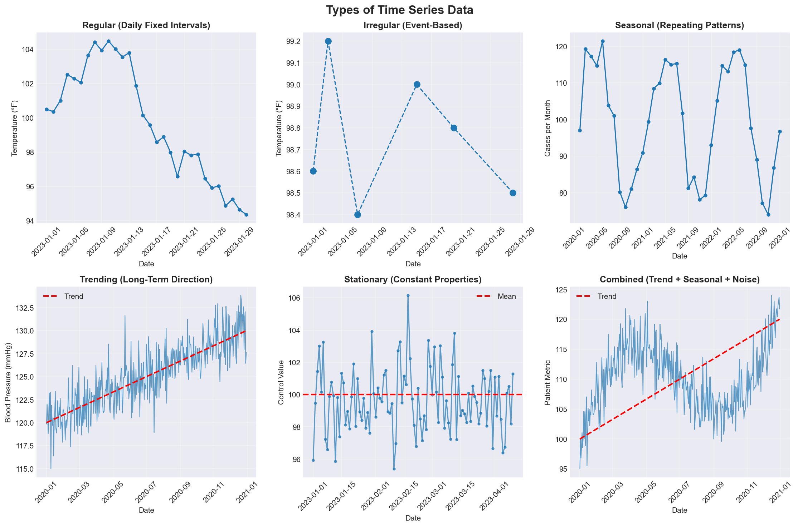

---
notion:
  title_line: "# DLC: Advanced Time Series Analysis Topics"
  role: bonus
  status: mapped
  page_id: "3d2d9fdd-1a1a-8164-a3f7-c5c5d3a8617a"
  url: "https://app.notion.com/p/3d2d9fdd1a1a8164a3f7c5c5d3a8617a"
---

# DLC: Advanced Time Series Analysis Topics

Everything in this document is optional for Lecture 09. It collects specialized material on periods, time-series patterns and decomposition, forecasting, more window options, high-frequency data, custom frequencies, advanced time zones, and additional visualization.

The forecasting and stationarity tools below are specialized reference. Lecture 10 teaches the general prediction workflow, including temporal splits and feature availability; it does not require these dedicated time-series models.

The decomposition, forecasting, and autocorrelation examples use `statsmodels`, and the interactive plot uses `plotly`. Colab includes both, but the course environment does not: add them to a project with `uv add statsmodels plotly` (Lecture 03).

# Period Arithmetic and Fiscal Year Handling

_Periods represent time spans, not specific moments. Understanding periods is crucial for fiscal year analysis and business reporting._

## Period Basics

### Reference Card: Period Creation and Arithmetic

| Function | Description |
|----------|-------------|
| `pd.Period('2011', freq='Y-DEC')` | Annual period ending December |
| `pd.Period('2011Q4', freq='Q-JAN')` | Quarterly period with fiscal year |
| `pd.period_range(start, end, freq='M')` | Create period range |
| `period.asfreq('M', how='start')` | Convert period frequency |
| `period.to_timestamp()` | Convert period to timestamp |

### Code Snippet: Period Arithmetic and Fiscal Quarters

```python
import pandas as pd
import numpy as np

rng = np.random.default_rng(42)

# Create annual period
p = pd.Period('2011', freq='Y-DEC')
print(f"Period: {p}")

# Period arithmetic
print(f"Plus 5 years: {p + 5}")   # Shift forward 5 years
print(f"Minus 2 years: {p - 2}")  # Shift backward 2 years

# Quarterly periods with fiscal year
p = pd.Period('2012Q4', freq='Q-JAN')  # Fiscal year ending in January
print(f"Fiscal Q4: {p}")
print(f"Start date: {p.asfreq('D', how='start')}")
print(f"End date: {p.asfreq('D', how='end')}")

# Create period range
periods = pd.period_range('2000-01-01', '2000-06-30', freq='M')
ts = pd.Series(rng.standard_normal(6), index=periods)
print("\nPeriod-indexed Series:")
print(ts)
```

## Converting Between Timestamps and Periods

### Reference Card: Timestamp-Period Conversion

| Function | Description |
|----------|-------------|
| `ts.to_period()` | Convert timestamp index to periods |
| `ts.to_period('M')` | Convert to monthly periods |
| `pts.to_timestamp()` | Convert periods back to timestamps |
| `pts.to_timestamp(how='end')` | Use end of period as timestamp |

### Code Snippet: Convert Timestamps to Periods and Back

```python
import pandas as pd
import numpy as np

rng = np.random.default_rng(42)

# Timestamp-indexed time series
dates = pd.date_range('2000-01-01', periods=3, freq='ME')
ts = pd.Series(rng.standard_normal(3), index=dates)

# Convert to periods
pts = ts.to_period()
print("Period-indexed:")
print(pts)

# Convert back to timestamps
ts_back = pts.to_timestamp()
print("\nBack to timestamps:")
print(ts_back)
```

# Advanced Time Series Decomposition

_Decomposition separates time series into trend, seasonal, and residual components, revealing underlying patterns._

## Patterns in a Time Series

The lecture sorts series by spacing, regular or irregular. A series can also be described by the pattern its values follow, and decomposition pulls those patterns apart.



| Pattern | Description | Example |
| --- | --- | --- |
| **Seasonal** | Patterns repeat over time | Monthly flu case counts |
| **Trending** | Long-term direction | Long-term blood pressure trends |
| **Stationary** | Statistical properties don't change | Laboratory control measurements |
| **Combined** | Multiple components (trend + seasonal + noise) | Real-world medical data with all patterns |

## Seasonal Decomposition

### Reference Card: Seasonal Decomposition

```python
from statsmodels.tsa.seasonal import seasonal_decompose

# Decompose a Series `ts` with a DatetimeIndex
decomposition = seasonal_decompose(ts, model='additive', period=7)
# or
decomposition = seasonal_decompose(ts, model='multiplicative', period=12)

# Access components
decomposition.observed  # Original series
decomposition.trend     # Trend component
decomposition.seasonal  # Seasonal component
decomposition.resid     # Residual component
```

### Code Snippet: Decompose a Seasonal Disease-Count Series

```python
import pandas as pd
import numpy as np
import matplotlib.pyplot as plt
from statsmodels.tsa.seasonal import seasonal_decompose

rng = np.random.default_rng(42)

# Create seasonal time series (daily disease cases over 3 years)
dates = pd.date_range('2020-01-01', periods=365*3, freq='D')
trend = np.linspace(100, 200, len(dates))
seasonal = 10 * np.sin(2 * np.pi * np.arange(len(dates)) / 365.25)
noise = rng.normal(0, 5, len(dates))
values = trend + seasonal + noise

ts = pd.Series(values, index=dates)

# Decompose time series
decomposition = seasonal_decompose(ts, model='additive', period=365)

# Plot decomposition
fig, axes = plt.subplots(4, 1, figsize=(15, 12))
decomposition.observed.plot(ax=axes[0], title='Original')
decomposition.trend.plot(ax=axes[1], title='Trend')
decomposition.seasonal.plot(ax=axes[2], title='Seasonal')
decomposition.resid.plot(ax=axes[3], title='Residual')
plt.tight_layout()
plt.show()
```

## STL Decomposition

### Reference Card: STL Decomposition

```python
from statsmodels.tsa.seasonal import STL

# STL decomposition (more robust to outliers); ts is a Series with a DatetimeIndex
# `period` is the known number of observations per cycle (annual here).
# `seasonal` is the odd length of STL's seasonal smoother, not the period.
stl = STL(ts, period=365, seasonal=13, robust=True)
result = stl.fit()

# Access components
result.observed  # Original series
result.trend     # Trend component
result.seasonal  # Seasonal component
result.resid     # Residual component
```

# Time Series Forecasting

_Forecasting uses historical patterns to predict future values. Always be honest about uncertainty and prediction intervals._

## ARIMA Models

### Reference Card: ARIMA Models and Stationarity Checks

```python
from statsmodels.tsa.arima.model import ARIMA
from statsmodels.tsa.stattools import adfuller

# Check stationarity
def check_stationarity(series):
    """Report the ADF test against the unit-root null hypothesis."""
    result = adfuller(series)
    print(f'ADF Statistic: {result[0]}')
    print(f'p-value: {result[1]}')
    
    if result[1] <= 0.05:
        print("Reject the unit-root null: evidence supports stationarity")
    else:
        print("Fail to reject the unit-root null: result is inconclusive")

# Fit ARIMA model
def fit_arima(series, order=(1, 1, 1)):
    """Fit ARIMA model"""
    model = ARIMA(series, order=order)
    fitted_model = model.fit()
    
    # Forecast
    forecast = fitted_model.forecast(steps=30)
    forecast_ci = fitted_model.get_forecast(steps=30).conf_int()
    
    return fitted_model, forecast, forecast_ci
```

## Exponential Smoothing

### Reference Card: Exponential Smoothing Variants

```python
from statsmodels.tsa.holtwinters import ExponentialSmoothing

# Simple exponential smoothing
model = ExponentialSmoothing(ts, trend=None, seasonal=None)
fitted = model.fit(smoothing_level=0.3)
forecast = fitted.forecast(steps=30)

# Holt's method (trend)
model = ExponentialSmoothing(ts, trend='add', seasonal=None)
fitted = model.fit(smoothing_level=0.3, smoothing_trend=0.3)
forecast = fitted.forecast(steps=30)

# Holt-Winters (trend + seasonal)
model = ExponentialSmoothing(ts, trend='add', seasonal='add', seasonal_periods=12)
fitted = model.fit(smoothing_level=0.3, smoothing_trend=0.3, smoothing_seasonal=0.3)
forecast = fitted.forecast(steps=30)
```

# Advanced Resampling Operations

_Resampling with periods requires careful handling of period boundaries and conventions._

## Resampling with Periods

### Reference Card: Resampling with Periods

| Function | Description |
|----------|-------------|
| `ts.to_period('M')` | Convert timestamp labels to monthly periods without aggregation |
| `ts.resample('ME').mean().to_period('M')` | Aggregate monthly, then represent labels as periods |
| `period_ts.resample('Q-DEC', convention='start')` | Upsample an annual PeriodIndex from the start of each period |

`QE` and `YE` are timestamp offset aliases used with a `DatetimeIndex`. Period frequencies describe spans and retain aliases such as `Q-DEC` and `Y-DEC`; do not substitute timestamp aliases mechanically.

### Code Snippet: Resample a Period-Indexed DataFrame

```python
import pandas as pd
import numpy as np

rng = np.random.default_rng(42)

# Resample with periods
frame = pd.DataFrame(rng.standard_normal((24, 4)),
                     index=pd.period_range('1-2000', '12-2001', freq='M'),
                     columns=['Colorado', 'Texas', 'New York', 'Ohio'])

# Downsample to annual
annual = frame.resample('Y-DEC').mean()

# Upsample annual to quarterly
quarterly = annual.resample('Q-DEC', convention='start').ffill()
```

# More Window and Selection Options

_The lecture's rolling and EWM windows cover daily work; these options cover the rest._

## Expanding Windows, Rolling Quantiles, and Custom Functions

An **expanding window** grows from the first row to the current one, so its mean is a running average of everything so far. A rolling quantile, such as the median, moves less than a mean when one reading is wild.

### Reference Card: More Window Options

- `ts.expanding().mean()`: Running mean from the first row to the current one; no `NaN` at the start.
- `ts.rolling(window=5).quantile(0.5)`: Rolling median.
- `ts.rolling(window=5).apply(custom_func)`: Run your own function on each window's values.
- `a.rolling(30).corr(b)`: Rolling correlation between two aligned series, such as daily heart rate and blood pressure.
- `ts.ewm(alpha=0.3).mean()`: Set the decay directly instead of through `span`; larger `alpha` weights recent observations more.
- `ts.ewm(halflife=2).mean()`: Weighted mean whose weights halve every two observations.
- `ts.shift(1, freq='D')`: Move the timestamps one day later instead of the values, so nothing becomes `NaN`.
- `ts.resample('ME').agg(mean='mean', count='count')`: Named aggregation on a Series, one named column per summary.
- `ts.ewm(span=5).std()`: Exponentially weighted standard deviation.
- `ts.truncate(before='2023-06-01', after='2023-06-30')`: Drop everything outside the range (requires a sorted index).

### Code Snippet: Expanding Mean and Rolling Median

```python
import numpy as np
import pandas as pd

rng = np.random.default_rng(42)
temps = pd.Series(98.6 + np.cumsum(rng.standard_normal(100) * 0.1),
                  index=pd.date_range('2023-01-01', periods=100, freq='D'))
print(pd.DataFrame({
    'temperature': temps,
    'expanding_mean': temps.expanding().mean(),
    'rolling_median': temps.rolling(window=5).quantile(0.5),
}).head(6).round(2))
```

```text
            temperature  expanding_mean  rolling_median
2023-01-01        98.63           98.63             NaN
2023-01-02        98.53           98.58             NaN
2023-01-03        98.60           98.59             NaN
2023-01-04        98.70           98.61             NaN
2023-01-05        98.50           98.59           98.60
2023-01-06        98.37           98.55           98.53
```

# High-Frequency Data Analysis

_High-frequency data requires special handling for irregular intervals and tick data._

## Tick Data Processing

### Reference Card: Tick Data Processing

```python
import pandas as pd

# Process high-frequency tick data (e.g., sensor readings)
def process_tick_data(df, freq='1min'):
    """Aggregate a DatetimeIndex table with ``value`` and ``volume`` columns.

    ``n_obs`` counts input rows in each interval; it is not a source
    column. Add another named aggregation when a separate quantity field
    should be summed. Choose and document a naive or timezone-aware index
    before calling; resampling preserves that time basis.
    """
    if not isinstance(df.index, pd.DatetimeIndex):
        raise TypeError('df must use a DatetimeIndex')
    resampled = df.sort_index().resample(freq).agg(
        last_value=('value', 'last'),
        total_volume=('volume', 'sum'),
        n_obs=('value', 'size'),
    )
    return resampled
```

# Advanced Time Zone Operations

_Time zones can be complex, especially with daylight saving time transitions and historical data._

## Resolving Clock-Change Times

The lecture sets repeated (fall-back) and skipped (spring-forward) clock times to `NaT` so they can be counted and set aside. When the data carry enough context, pandas can resolve them instead.

### Reference Card: Resolving Clock-Change Times

| Argument | Effect |
|----------|--------|
| `ambiguous='infer'` | For a sorted run of readings that passes through the repeated hour, assign the first pass to daylight time and the second to standard time |
| `ambiguous=[True, False, ...]` | State for each reading whether it is daylight time (`True`) or standard time (`False`) |
| `nonexistent='shift_forward'` | Move a skipped time to the first valid time after the gap |

### Code Snippet: Resolve Repeated and Skipped Clock Times

```python
import pandas as pd

# A sorted run of readings that passes through 01:00-01:59 twice
fall_back = pd.DatetimeIndex(['2024-11-03 00:30', '2024-11-03 01:00', '2024-11-03 01:30',
                              '2024-11-03 01:00', '2024-11-03 01:30', '2024-11-03 02:00'])
print(fall_back.tz_localize('America/New_York', ambiguous='infer'))

# A skipped spring-forward time moved to 03:00
spring = pd.DatetimeIndex(['2024-03-10 02:30'])
print(spring.tz_localize('America/New_York', nonexistent='shift_forward'))
```

```text
DatetimeIndex(['2024-11-03 00:30:00-04:00', '2024-11-03 01:00:00-04:00',
               '2024-11-03 01:30:00-04:00', '2024-11-03 01:00:00-05:00',
               '2024-11-03 01:30:00-05:00', '2024-11-03 02:00:00-05:00'],
              dtype='datetime64[us, America/New_York]', freq=None)
DatetimeIndex(['2024-03-10 03:00:00-04:00'], dtype='datetime64[us, America/New_York]', freq=None)
```

`'infer'` relies on the readings being in recording order: it raises `ValueError` when it cannot see the clock repeat, and it can guess wrong if the rows were shuffled. `ambiguous='NaT'` from the lecture is the safer default.

## Operations Between Different Time Zones

### Reference Card: Combining Series Across Time Zones

```python
import pandas as pd

# Combining time series with different time zones
dates = pd.date_range('2024-03-01 09:00', periods=4, freq='D')
ts = pd.Series(range(4), index=dates)
ts1 = ts.tz_localize('Europe/London')
ts2 = ts1.iloc[2:].tz_convert('Europe/Moscow')
result = ts1 + ts2  # Aligned on the same instants
print(result.index.tz)  # UTC
```

# Custom Frequency Classes

_For specialized time series needs, you can create custom frequency classes, though this is rarely necessary._

## Custom Business Day Frequencies

### Reference Card: Custom Business Day Frequencies

```python
import pandas as pd
from pandas.tseries.offsets import CustomBusinessDay

# Create custom business day (e.g., excluding specific holidays)
custom_bday = CustomBusinessDay(holidays=['2023-12-25'])
dates = pd.date_range('2023-12-01', '2023-12-31', freq=custom_bday)
```

# Time Series Visualization

## Interactive Time Series Plots

### Reference Card: Interactive Time Series Plot with Plotly

```python
import plotly.graph_objects as go
from plotly.subplots import make_subplots

# Create interactive plot
fig = go.Figure()
fig.add_trace(go.Scatter(
    x=ts.index,
    y=ts.values,
    mode='lines',
    name='Time Series'
))
fig.show()
```

## Autocorrelation and Partial Autocorrelation

### Reference Card: ACF and PACF Plots

```python
import matplotlib.pyplot as plt
from statsmodels.graphics.tsaplots import plot_acf, plot_pacf

# Plot ACF and PACF
fig, axes = plt.subplots(2, 1, figsize=(12, 8))
plot_acf(ts, lags=40, ax=axes[0])
plot_pacf(ts, lags=40, ax=axes[1])
plt.tight_layout()
plt.show()
```

These advanced topics will help you handle complex time series analysis scenarios in specialized applications. For most daily data science work, the content in the main lecture is sufficient.

# Calendar Schedule Examples

## Code Snippet: Date Ranges

```python
print(pd.date_range('2024-01-01', '2024-01-04', freq='D'))    # daily symptom diary
print(pd.bdate_range('2024-01-05', '2024-01-09'))             # weekday clinic days
print(pd.date_range('2024-01-01', periods=3, freq='W-MON'))   # Monday check-ins
print(pd.date_range('2024-01-01', periods=3, freq='MS'))      # monthly lab draws
print(pd.date_range('2024-01-01', periods=3, freq='ME'))      # monthly reports
```

```text
DatetimeIndex(['2024-01-01', '2024-01-02', '2024-01-03', '2024-01-04'], dtype='datetime64[us]', freq='D')
DatetimeIndex(['2024-01-05', '2024-01-08', '2024-01-09'], dtype='datetime64[us]', freq='B')
DatetimeIndex(['2024-01-01', '2024-01-08', '2024-01-15'], dtype='datetime64[us]', freq='W-MON')
DatetimeIndex(['2024-01-01', '2024-02-01', '2024-03-01'], dtype='datetime64[us]', freq='MS')
DatetimeIndex(['2024-01-31', '2024-02-29', '2024-03-31'], dtype='datetime64[us]', freq='ME')
```

The business-day range skips the weekend of January 6-7. The default business-day rule skips weekends, but keeps holidays; custom holiday calendars are in `BONUS.md`.

# Time-of-Day Selection Example

## Selecting Repeated Clock Times

### Reference Card: Time-of-Day Selection

- `ts.between_time('09:00', '17:00')`: Readings from 09:00 to 17:00 each day, both ends included
- `ts.at_time('12:00')`: Readings at 12:00 each day
- `ts.loc[ts.index < ts.index.min() + pd.Timedelta(days=10)]`: First 10 days; a `.loc` slice would add the reading exactly 10 days in
- `ts.loc[ts.index > ts.index.max() - pd.Timedelta(days=10)]`: Last 10 days

### Code Snippet: Time-of-Day Selection

```python
hourly = pd.Series(range(24 * 7), index=pd.date_range('2023-01-01', periods=24 * 7, freq='h'))
print(hourly.between_time('09:00', '17:00').shape)   # 9 readings a day for 7 days
print(hourly.at_time('12:00').head(3))              # one noon reading per day
print(hourly.loc[hourly.index < hourly.index.min() + pd.Timedelta(days=3)].shape)
```

```text
(63,)
2023-01-01 12:00:00    12
2023-01-02 12:00:00    36
2023-01-03 12:00:00    60
Freq: 24h, dtype: int64
(72,)
```

# Window Alignment Example

## Code Snippet: Rolling Statistics

```python
temps = pd.Series([98.6, 98.9, 99.4, 100.1, 99.8, 99.2, 98.8],
                  index=pd.date_range('2023-01-01', periods=7, freq='D'))
print(pd.DataFrame({
    'temperature': temps,
    'rolling_3': temps.rolling(window=3).mean(),
    'early_3': temps.rolling(window=3, min_periods=2).mean(),
    'centered_3': temps.rolling(window=3, center=True).mean(),
}).round(2))
```

```text
            temperature  rolling_3  early_3  centered_3
2023-01-01         98.6        NaN      NaN         NaN
2023-01-02         98.9        NaN    98.75       98.97
2023-01-03         99.4      98.97    98.97       99.47
2023-01-04        100.1      99.47    99.47       99.77
2023-01-05         99.8      99.77    99.77       99.70
2023-01-06         99.2      99.70    99.70       99.27
2023-01-07         98.8      99.27    99.27         NaN
```

The centered mean on January 2 equals the trailing mean on January 3: it already used a reading that had not happened yet.

# Exponentially Weighted Means

## Exponentially Weighted Functions

An **exponentially weighted moving average (EWM)** uses every earlier reading but gives each older one less weight, while a rolling mean weights its window equally and ignores anything older. It reacts faster to a change, such as blood pressure climbing after a new medication, while still smoothing day-to-day noise; `span=7` is comparable to a 7-reading rolling mean.


### Reference Card: Exponentially Weighted Windows

- `ts.ewm(span=5).mean()`: Weighted mean with decay `alpha = 2 / (span + 1)`; larger span means slower decay

### Code Snippet: Exponentially Weighted Features

```python
sbp = pd.Series([120, 121, 119, 120, 132, 134, 135],
                index=pd.date_range('2023-01-01', periods=7, freq='D'))
print(pd.DataFrame({'sbp': sbp, 'rolling_3': sbp.rolling(3).mean(),
                    'ewm_3': sbp.ewm(span=3).mean()}).round(1))
```

```text
            sbp  rolling_3  ewm_3
2023-01-01  120        NaN  120.0
2023-01-02  121        NaN  120.7
2023-01-03  119      120.0  119.7
2023-01-04  120      120.0  119.9
2023-01-05  132      123.7  126.1
2023-01-06  134      128.7  130.1
2023-01-07  135      133.7  132.6
```

On January 5, when blood pressure jumps, the EWM moves to 126.1 while the 3-reading mean moves only to 123.7.

# Frequency Inference and Specialized Schedules

## Checking Date Spacing

The main lecture uses a declared frequency for hourly grids and ordinary calendar reports. **Frequency inference** asks whether an existing index follows one repeating rule; `None` means it does not. Business-day and longer reporting schedules are alternatives to the main daily/hourly/monthly path.

### Reference Card: Frequency and Alignment

- `pd.infer_freq(ts.index)`: Infer the frequency alias, such as `'D'`; `None` for irregular spacing
- `ts.asfreq(freq)`: Conform to a new timestamp grid without combining observations

### Code Snippet: Frequency Inference

`days` numbers consecutive dates from January 1, 2023, starting at 0. The irregular `visits` fall on January 2, January 9, and February 6, 2024.

```python
print(pd.infer_freq(days.index))
print(days.asfreq('W').head(3))   # keeps Sunday values; averages nothing
print(pd.infer_freq(visits))     # irregular clinic visits
```

```text
D
2023-01-01     0
2023-01-08     7
2023-01-15    14
Freq: W-SUN, dtype: int64
None
```

## Specialized Schedule Aliases

| Alias | Meaning | Typical use |
| --- | --- | --- |
| `'B'` | Business days; `pd.bdate_range()` skips weekends, but keeps holidays | Weekday clinic schedule |
| `'QS'` / `'QE'` | Quarter start / end | Quarterly assessment |
| `'YS'` / `'YE'` | Year start / end | Annual summary |

Custom holiday calendars are in [Custom Business Day Frequencies](#custom-business-day-frequencies). Use the current timestamp aliases: pandas 3 rejects older `'Q'`, `'A'`, and `'Y'` aliases.

### Code Snippet: Quarterly and Annual Schedules

```python
print(pd.date_range('2024-01-01', periods=3, freq='QS'))
print(pd.date_range('2024-01-01', periods=3, freq='YE'))
```

```text
DatetimeIndex(['2024-01-01', '2024-04-01', '2024-07-01'], dtype='datetime64[us]', freq='QS-JAN')
DatetimeIndex(['2024-12-31', '2025-12-31', '2026-12-31'], dtype='datetime64[us]', freq='YE-DEC')
```

# Percentage Changes

## Relative Changes Between Readings

A **percentage change** divides the difference by the previous value. `pct_change()` returns a fraction: `0.1` means 10%, so multiply by 100 for percent. Sort first; for a panel, calculate within each entity.

| Weight (kg) | Previous weight (kg) | Difference (kg) | Percentage change |
| ---: | ---: | ---: | ---: |
| 70.5 | none | none | none |
| 70.8 | 70.5 | 0.3 | 0.43% |

### Reference Card: Relative Change

- `ts.pct_change()`: Current value divided by the previous value, minus 1; the first row is `NaN`.
- `ts.pct_change() * 100`: The same change as a percentage.

### Code Snippet: Daily Weight Changes

`weight` contains the five daily weights in the main lecture's lag example.

```python
weight['pct_change'] = weight['weight'].pct_change()
print(weight[['weight', 'pct_change']])
```

```text
            weight  pct_change
2023-01-01    70.5         NaN
2023-01-02    70.8    0.004255
2023-01-03    70.2   -0.008475
2023-01-04    71.0    0.011396
2023-01-05    70.9   -0.001408
```

# Grouped Resampling with Grouper

## Empty Time Bins

`pd.Grouper` expresses time bins as another grouping key. Use it when a combined grouping expression suits the report; the main lecture's grouped `resample()` is the default route. The bin edges agree, but the empty-bin behavior differs:

| P1 reading time | Heart rate (bpm) |
| --- | ---: |
| 08:00 | 70 |
| 12:00 | 80 |

### Reference Card: Time as a Grouping Key

- `df.set_index('recorded_at').groupby(['patient_id', pd.Grouper(freq='2h')])['heart_rate'].mean()`: Mean per patient and bin, omitting bins with no readings.
- `df.set_index('recorded_at').groupby('patient_id')['heart_rate'].resample('2h').mean()`: Includes empty bins between each patient's first and last reading.

### Code Snippet: Empty Bins Differ

`vitals` contains the two readings above on March 1, 2024, with datetime `recorded_at` values.

```python
indexed = vitals.set_index('recorded_at')
print(indexed.groupby(['patient_id', pd.Grouper(freq='2h')])['heart_rate'].mean())
print(indexed.groupby('patient_id')['heart_rate'].resample('2h').mean())
```

```text
patient_id  recorded_at
P1          2024-03-01 08:00:00    70.0
            2024-03-01 12:00:00    80.0
Name: heart_rate, dtype: float64
patient_id  recorded_at
P1          2024-03-01 08:00:00    70.0
            2024-03-01 10:00:00     NaN
            2024-03-01 12:00:00    80.0
Name: heart_rate, dtype: float64
```
