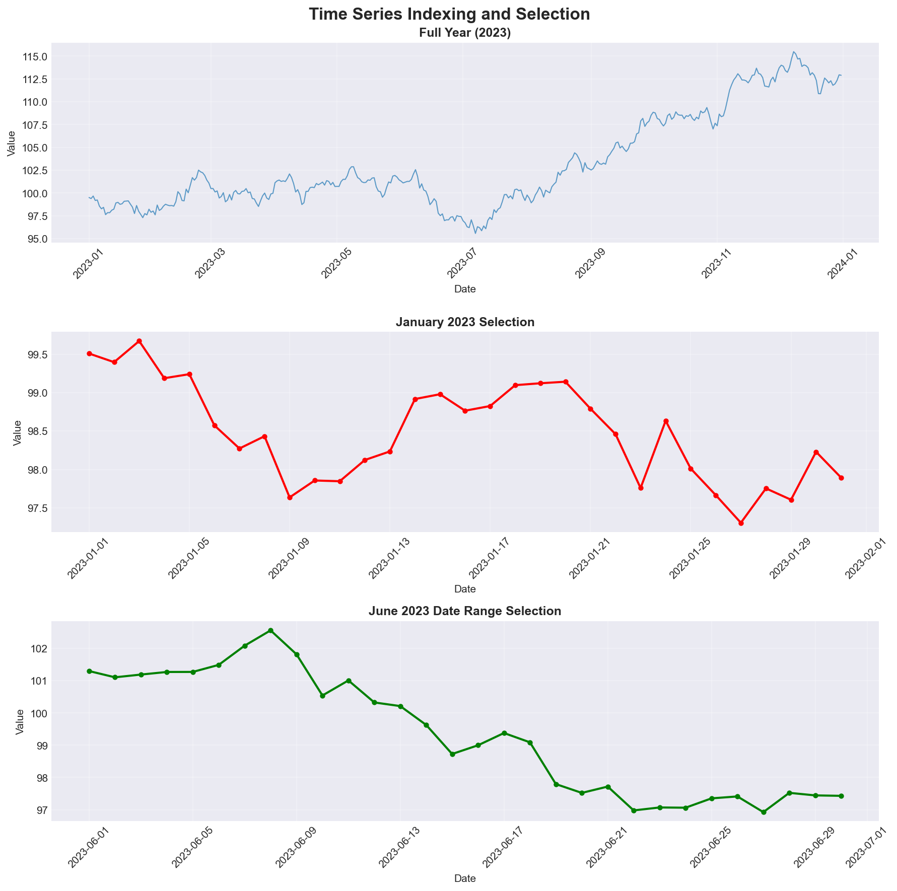
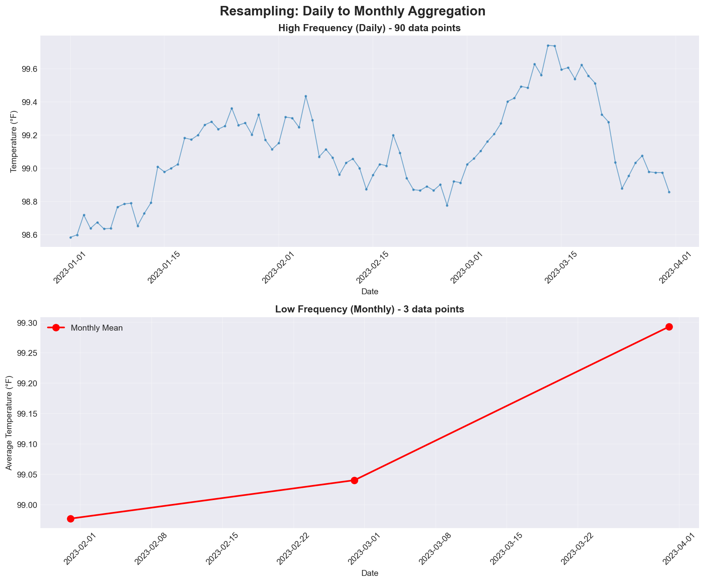
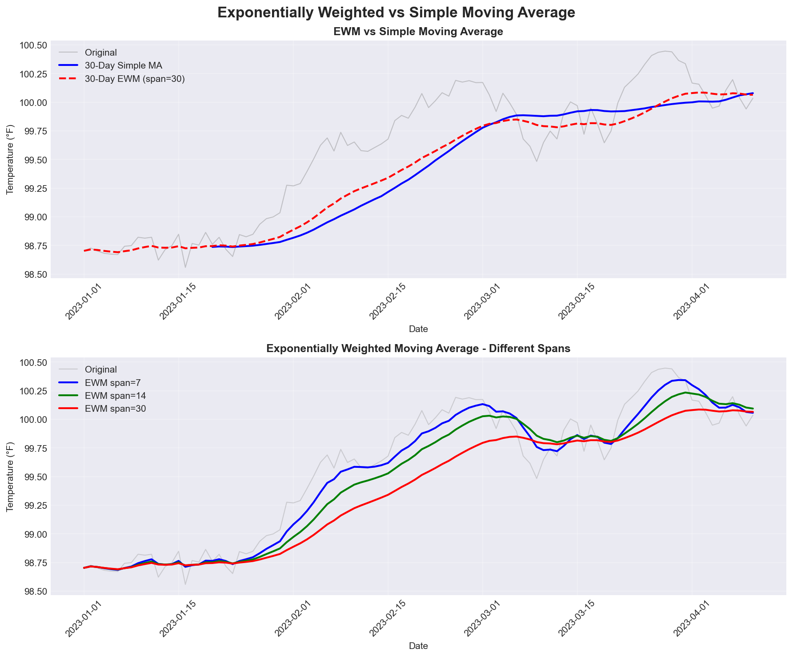

Time Series Analysis: Temporal Data and Trends

> **Note:** This lecture includes companion visualizations that can be generated by running `visualize_examples.py`. The script requires pandas, numpy, and matplotlib. To generate the visualizations:
> ```bash
> python3 visualize_examples.py
> ```
> Visualizations will be saved to the `media/` directory. The script generates 6 visualizations covering types of time series, resampling, rolling windows, exponentially weighted functions, indexing, and shifting operations.

See [BONUS.md](BONUS.md) for advanced topics:

- Advanced time series decomposition and seasonal analysis
- Time series forecasting with ARIMA and exponential smoothing
- Period arithmetic and fiscal year handling
- High-frequency data analysis and tick data
- Custom frequency classes and time zone complexities

*Fun fact: Time series analysis is like being a detective for data - you're looking for patterns, trends, and clues that reveal the story of how things change over time. It's the difference between knowing what happened and understanding why it happened.*


*"Cauchy-Lorentz: 'Something alarmingly mathematical is happening, and you should probably stop.'" - A reminder that not every pattern in time series data is meaningful, and overfitting is always lurking.*

Time series analysis is the art of understanding temporal patterns in data. This lecture covers the essential tools for time series analysis: **datetime handling**, **resampling and frequency conversion**, **rolling window operations**, and **time series indexing and selection**.

*Pro tip: Time series analysis is 90% datetime wrangling, 5% actual analysis, and 5% swearing at timezone conversions. Master these datetime tools and you'll be ahead of 90% of data scientists.*

**Learning Objectives:**

- Master datetime data types and parsing
- Perform time series indexing and selection
- Use resampling and frequency conversion
- Apply rolling window operations
- Understand exponentially weighted functions
- Handle basic time zone operations

# Understanding Time Series Data

*Reality check: Time series data is everywhere in health and medical research - patient vital signs, clinical trial measurements, disease surveillance, environmental monitoring. Understanding how to work with temporal data is essential for any data scientist in the life sciences.*

Time series data is characterized by observations collected over time, where the order and timing of observations matter. Unlike cross-sectional data, time series data has a natural temporal structure that we can exploit for analysis.

## Types of Time Series

*"Time series data comes in many flavors - some are as regular as a Swiss watch, others as unpredictable as a toddler's nap schedule. The key is knowing which one you're dealing with!"*


*Visual guide showing the different types of time series data. Notice how regular series tick along like clockwork, while irregular series jump around like a medical appointment schedule.*

| Type | Description | Example |
|------|-------------|---------|
| **Regular** | Fixed intervals (daily, hourly, monthly) | Daily patient temperature readings |
| **Irregular** | Variable intervals (event-based) | Clinical visit dates |
| **Seasonal** | Patterns repeat over time | Monthly flu case counts |
| **Trending** | Long-term direction | Long-term blood pressure trends |
| **Stationary** | Statistical properties don't change | Laboratory control measurements |

**Reference:**

- Regular time series: Fixed intervals (daily, hourly, monthly)
- Irregular time series: Variable intervals (event-based)
- Seasonal time series: Patterns repeat over time
- Trending time series: Long-term direction
- Stationary time series: Statistical properties don't change

**Example:**

```python
import pandas as pd
import numpy as np
from datetime import datetime, timedelta

# Create regular time series (daily patient measurements)
dates = pd.date_range('2023-01-01', periods=10, freq='D')
values = np.cumsum(np.random.randn(10)) + 100
ts_regular = pd.Series(values, index=dates)
print("Regular time series:")
print(ts_regular.head())

# Create irregular time series (clinical visit dates)
irregular_dates = pd.to_datetime(['2023-01-01', '2023-01-03', '2023-01-07'])
irregular_values = [98.6, 99.2, 98.4]
ts_irregular = pd.Series(irregular_values, index=irregular_dates)
print("\nIrregular time series:")
print(ts_irregular)
```

# Date and Time Data Types

*Think of datetime objects as the Swiss Army knife of temporal data - they can represent any moment in time with precision down to microseconds, and pandas makes them incredibly powerful for analysis.*

## Python datetime Module

The Python standard library provides `datetime` for working with dates and times. Understanding these basics is essential before moving to pandas. *Think of it as learning to walk before you can run - except in this case, walking is parsing dates and running is resampling multi-site clinical trial data.*

**Reference:**

| Function | Description |
|----------|-------------|
| `datetime.now()` | Current date and time |
| `datetime(year, month, day)` | Create specific date |
| `datetime.strptime(string, format)` | Parse string to datetime |
| `datetime.strftime(format)` | Format datetime to string |
| `timedelta(days=1)` | Time differences |

**Example:**

```python
from datetime import datetime, timedelta

# Current time
now = datetime.now()
print(f"Current time: {now}")

# Specific date (patient birth date)
birthday = datetime(1990, 5, 15)
print(f"Birth date: {birthday}")

# String parsing (lab result timestamp)
date_str = "2023-12-25 14:30:00"
parsed_date = datetime.strptime(date_str, "%Y-%m-%d %H:%M:%S")
print(f"Parsed date: {parsed_date}")

# String formatting
formatted = parsed_date.strftime("%B %d, %Y at %I:%M %p")
print(f"Formatted: {formatted}")

# Time differences (age calculation)
time_diff = now - birthday
print(f"Age in days: {time_diff.days}")
```

## pandas DatetimeIndex

pandas provides powerful datetime functionality through `DatetimeIndex`, which is optimized for time series operations. *This is where pandas goes from "useful library" to "time series wizard" - it's like having a Swiss Army knife specifically designed for temporal data. Every method is optimized, every operation is fast, and every feature is designed to make your life easier.*

**Reference:**

| Function | Description |
|----------|-------------|
| `pd.to_datetime()` | Convert to datetime |
| `pd.date_range()` | Create date range |
| `pd.DatetimeIndex()` | Create datetime index |
| `df.set_index('date')` | Set datetime index |
| `df.index` | Access datetime index |

**Example:**

```python
# Convert to datetime (lab test dates)
date_strings = ['2023-01-01', '2023-01-02', '2023-01-03']
dates = pd.to_datetime(date_strings)
print("Converted dates:")
print(dates)

# Create date range (daily patient monitoring)
date_range = pd.date_range('2023-01-01', periods=10, freq='D')
print("\nDate range:")
print(date_range)

# Create DataFrame with datetime index (vital signs)
df = pd.DataFrame({
    'heart_rate': np.random.randint(60, 100, 10),
    'blood_pressure': np.random.randint(90, 140, 10)
}, index=date_range)
print("\nDataFrame with datetime index:")
print(df.head())
```

## Date Range Generation

pandas provides flexible date range generation for creating regular time series. *Want every Monday? Got it. Business days only? No problem. Last Friday of each month? Absolutely. Third Wednesday? Why not! pandas can generate pretty much any date pattern you can imagine - and some you probably can't.*

**Reference:**

| Function | Frequency Code | Description |
|----------|----------------|-------------|
| `pd.date_range(start, end, freq='D')` | `'D'` | Daily (calendar) |
| `pd.bdate_range(start, end)` | `'B'` | Business days only |
| `pd.date_range(freq='W-MON')` | `'W-MON'` | Weekly on Monday |
| `pd.date_range(freq='MS')` | `'MS'` | Month start |
| `pd.date_range(freq='QS')` | `'QS'` | Quarter start |
| `pd.date_range(freq='H')` | `'H'` | Hourly |

**Example:**

```python
# Different date range types for clinical data
print("Daily range (vital signs):")
daily = pd.date_range('2023-01-01', '2023-01-10', freq='D')
print(daily)

print("\nBusiness days only (clinic visits):")
business = pd.bdate_range('2023-01-01', '2023-01-10')
print(business)

print("\nWeekly range (Mondays - weekly checkups):")
weekly = pd.date_range('2023-01-01', '2023-03-01', freq='W-MON')
print(weekly)

print("\nMonthly range (monthly lab tests):")
monthly = pd.date_range('2023-01-01', '2023-12-01', freq='MS')
print(monthly)
```

## Frequency Inference

You can infer the frequency of a time series and convert between frequencies. *pandas is like a detective that can look at your data and say "Ah, I see - this is daily data!" It's surprisingly good at figuring out patterns, though it gets confused if you have irregular data (which is fair - we all do).*

**Reference:**

| Function | Description |
|----------|-------------|
| `pd.infer_freq(ts.index)` | Infer frequency from time series |
| `ts.asfreq(freq)` | Convert to specific frequency |
| `ts.resample(freq).asfreq()` | Resample and convert frequency |

**Example:**

```python
# Create time series with inferred frequency
dates = pd.date_range('2023-01-01', periods=100, freq='D')
ts = pd.Series(np.random.randn(100), index=dates)

# Infer frequency
freq = pd.infer_freq(ts.index)
print(f"Inferred frequency: {freq}")

# Convert to different frequency (daily to weekly)
ts_weekly = ts.asfreq('W')
print(f"Weekly frequency: {pd.infer_freq(ts_weekly.index)}")
```

## Shifting and Lagging

Shifting allows you to create lagged or leading versions of your time series, essential for analyzing changes over time. *It's like having a time machine for your data - you can see what happened yesterday, predict what might happen tomorrow, or figure out what changed between them. Just don't try to use it to win the lottery - we've tested that, and it doesn't work.*


*Visual demonstration of shifting operations showing lag (looking back), lead (looking ahead), and differences (day-to-day changes).*

**Reference:**

| Function | Description |
|----------|-------------|
| `ts.shift(1)` | Shift by 1 period (lag) |
| `ts.shift(-1)` | Shift by -1 period (lead) |
| `ts.diff()` | First difference |
| `ts.pct_change()` | Percentage change |
| `ts.shift(1, freq='D')` | Shift by 1 day (with timestamp) |

**Example:**

```python
# Create sample time series (patient weight measurements)
dates = pd.date_range('2023-01-01', periods=10, freq='D')
ts = pd.Series([70.5, 70.8, 70.2, 71.0, 70.9, 71.2, 71.5, 71.3, 71.8, 71.6], index=dates)

# Shifting operations
ts['lag_1'] = ts.shift(1)  # Previous day
ts['lead_1'] = ts.shift(-1)  # Next day
ts['diff'] = ts.diff()  # First difference (day-to-day change)
ts['pct_change'] = ts.pct_change()  # Percentage change

print("Time series with shifts:")
print(ts[['lag_1', 'diff', 'pct_change']].head())
```

# LIVE DEMO!

*"I'm going to show you how to actually use this stuff, because let's be honest - reading about it is one thing, but watching someone make mistakes in real-time is way more educational. Plus, I get to blame any bugs on the demo gods."*

# Time Series Indexing and Selection

*Time series indexing is like having a time machine for your data - you can jump to any point in time, slice through time periods, and even travel backwards to see how things were. Unlike actual time travel, this won't create paradoxes, break causality, or require explaining to your grandmother why you're suddenly 20 years younger.*

## Basic Time Series Selection

pandas provides intuitive ways to select data from time series using string-based indexing. *It's so intuitive that you can literally write "2023" and pandas knows you mean "all of 2023" - it's like having a data assistant that actually understands human language!*



*Examples of time-based selection showing how to slice data by year, month, or date range. Notice how pandas interprets string dates like a human would.*

**Reference:**

| Operation | Description |
|-----------|-------------|
| `ts['2023-01-01']` | Select specific date |
| `ts['2023-01-01':'2023-01-31']` | Select date range |
| `ts['2023']` | Select entire year |
| `ts['2023-01']` | Select specific month |
| `ts.loc['2023-01-01']` | Label-based selection |
| `ts.iloc[0:10]` | Position-based selection |

**Example:**

```python
# Create sample time series (year of patient data)
dates = pd.date_range('2023-01-01', periods=365, freq='D')
values = np.cumsum(np.random.randn(365)) + 100
ts = pd.Series(values, index=dates)

# Select specific date
print("January 1, 2023:")
print(ts['2023-01-01'])

# Select date range
print("\nJanuary 2023:")
print(ts['2023-01-01':'2023-01-31'].head())

# Select entire year
print("\n2023 data shape:")
print(ts['2023'].shape)

# Select specific month
print("\nJanuary 2023:")
print(ts['2023-01'].head())
```

## Advanced Time Series Selection

For time series with time components, you can select based on time of day. *This is incredibly useful for things like "show me all the data from business hours" or "what happened at noon every day?" It's like having a time-based filter for your data - except this one actually works, unlike that time-travel app you downloaded that just showed you random cat videos.*

**Reference:**

| Function | Description |
|----------|-------------|
| `ts.between_time('09:00', '17:00')` | Select time range |
| `ts.at_time('12:00')` | Select specific time |
| `ts.first('10D')` | First 10 days |
| `ts.last('10D')` | Last 10 days |
| `ts.truncate(before='2023-06-01')` | Truncate before date |
| `ts.truncate(after='2023-06-30')` | Truncate after date |

**Example:**

```python
# Create hourly time series (ICU monitoring)
hourly_dates = pd.date_range('2023-01-01', periods=24*7, freq='H')
hourly_values = np.random.randn(24*7) + 100
ts_hourly = pd.Series(hourly_values, index=hourly_dates)

# Select business hours (9 AM to 5 PM)
business_hours = ts_hourly.between_time('09:00', '17:00')
print("Business hours data:")
print(business_hours.head())

# Select specific time (noon readings)
noon_data = ts_hourly.at_time('12:00')
print("\nNoon data:")
print(noon_data.head())

# Select first and last periods
print("\nFirst 3 days:")
print(ts_hourly.first('3D').head())

print("\nLast 3 days:")
print(ts_hourly.last('3D').head())
```

# Resampling and Frequency Conversion

*Resampling is like changing the lens on your camera - you can zoom in to see more detail (higher frequency) or zoom out to see the big picture (lower frequency).*

Resampling converts time series from one frequency to another. **Downsampling** aggregates higher frequency data to lower frequency (e.g., daily to monthly). **Upsampling** converts lower frequency to higher frequency (e.g., monthly to daily), often introducing missing values. *It's like converting a high-resolution photo to a thumbnail (downsampling) or blowing up a postage stamp to poster size (upsampling) - both have their uses, but one requires more guesswork.*



*Visual comparison showing daily data (high frequency, many points) being resampled to monthly data (low frequency, fewer points). Notice how the monthly view smooths out daily fluctuations.*

## Basic Resampling

The `resample()` method is the workhorse for frequency conversion, similar to `groupby()` but for time intervals.

**Reference:**

| Frequency Code | Description |
|----------------|-------------|
| `ts.resample('D')` | Daily resampling |
| `ts.resample('W')` | Weekly resampling |
| `ts.resample('M')` | Monthly resampling |
| `ts.resample('Q')` | Quarterly resampling |
| `ts.resample('A')` | Annual resampling |
| `ts.resample('H')` | Hourly resampling |

**Example:**

```python
# Create daily time series (patient vital signs)
daily_dates = pd.date_range('2023-01-01', periods=30, freq='D')
daily_values = np.cumsum(np.random.randn(30)) + 100
ts_daily = pd.Series(daily_values, index=daily_dates)

# Resample to different frequencies
print("Original daily data shape:", ts_daily.shape)

# Weekly resampling (average weekly values)
weekly = ts_daily.resample('W').mean()
print("Weekly resampled shape:", weekly.shape)
print("Weekly data:")
print(weekly.head())

# Monthly resampling (average monthly values)
monthly = ts_daily.resample('M').mean()
print("\nMonthly resampled shape:", monthly.shape)
print("Monthly data:")
print(monthly.head())
```

## Resampling with Different Aggregations

You can apply various aggregation functions when resampling, just like with `groupby()`. *If you've mastered `groupby()` from Lecture 5, this will feel like coming home - same syntax, same flexibility, just with time intervals instead of categories. It's like `groupby()` grew up and got a job as a time series analyst.*

**Reference:**

| Function | Description |
|----------|-------------|
| `ts.resample('D').mean()` | Mean aggregation |
| `ts.resample('D').sum()` | Sum aggregation |
| `ts.resample('D').max()` | Maximum aggregation |
| `ts.resample('D').min()` | Minimum aggregation |
| `ts.resample('D').std()` | Standard deviation |
| `ts.resample('D').agg(['mean', 'std', 'min', 'max'])` | Multiple aggregations |

**Example:**

```python
# Create sample data with multiple columns (patient metrics)
df = pd.DataFrame({
    'temperature': np.random.normal(98.6, 0.5, 365),
    'heart_rate': np.random.randint(60, 100, 365)
}, index=pd.date_range('2023-01-01', periods=365, freq='D'))

# Different resampling methods
print("Daily to weekly resampling:")
weekly_stats = df.resample('W').agg({
    'temperature': ['mean', 'std', 'min', 'max'],
    'heart_rate': 'mean'
})
print(weekly_stats.head())

# Custom resampling function
def custom_agg(series):
    return pd.Series({
        'mean': series.mean(),
        'std': series.std(),
        'range': series.max() - series.min(),
        'count': len(series)
    })

print("\nCustom aggregation:")
custom_stats = df['temperature'].resample('M').apply(custom_agg)
print(custom_stats.head())
```

# LIVE DEMO!

*"Now we're going to combine everything we've learned - resampling, indexing, and rolling windows. This is where the magic happens. Or where we discover that our data has a weird gap in March 2020 that we didn't notice until now. Probably both."*

# Rolling Window Operations

*Rolling windows are like looking through a moving frame - you can see how things change over time by examining a sliding window of observations. It's like having a security camera that only remembers the last 7 days - perfect for smoothing out noise while keeping an eye on trends. Unless your trend is longer than 7 days, in which case you might want a bigger window.*

Rolling window functions compute statistics over a fixed-size window that moves through the time series. This is useful for smoothing noisy data and identifying trends.

## Basic Rolling Operations

The `rolling()` method creates a rolling window object that can be used with various aggregation functions. *Think of it as a sliding window that moves through your data, calculating statistics as it goes - like a security guard watching a surveillance feed, but instead of looking for suspicious activity, you're looking for trends.*


*Demonstration of rolling window operations showing how a 7-day window smooths out daily fluctuations while preserving the underlying trend. The shaded area shows the standard deviation - wider means more variability, narrower means more consistent.*

**Reference:**

| Function | Description |
|----------|-------------|
| `ts.rolling(window=5)` | 5-period rolling window |
| `ts.rolling(window=5).mean()` | Rolling mean |
| `ts.rolling(window=5).std()` | Rolling standard deviation |
| `ts.rolling(window=5).sum()` | Rolling sum |
| `ts.rolling(window=5).min()` | Rolling minimum |
| `ts.rolling(window=5).max()` | Rolling maximum |

**Example:**

```python
# Create sample time series (patient temperature over time)
dates = pd.date_range('2023-01-01', periods=100, freq='D')
values = 98.6 + np.cumsum(np.random.randn(100) * 0.1)  # Temperature with drift
ts = pd.Series(values, index=dates)

# Rolling statistics (7-day rolling window)
ts['rolling_mean'] = ts.rolling(window=7).mean()
ts['rolling_std'] = ts.rolling(window=7).std()
ts['rolling_min'] = ts.rolling(window=7).min()
ts['rolling_max'] = ts.rolling(window=7).max()

print("Time series with rolling statistics:")
print(ts[['rolling_mean', 'rolling_std']].head(10))
```

## Advanced Rolling Operations

Rolling windows can be centered, have minimum periods, and use custom functions. *Centered windows are like having hindsight and foresight at the same time - you can look backward AND forward from each point. Minimum periods let you start calculating statistics even before you have a full window - perfect for when you're impatient but still want accurate results.*

**Reference:**

| Function | Description |
|----------|-------------|
| `ts.rolling(window=5, center=True)` | Centered rolling window |
| `ts.rolling(window=5, min_periods=3)` | Minimum periods required |
| `ts.rolling(window=5).quantile(0.5)` | Rolling median |
| `ts.rolling(window=5).apply(custom_func)` | Custom rolling function |
| `ts.expanding()` | Expanding window (from start to current) |
| `ts.ewm(span=5)` | Exponentially weighted moving average |

**Example:**

```python
# Advanced rolling operations
ts['centered_mean'] = ts.rolling(window=7, center=True).mean()
ts['expanding_mean'] = ts.expanding().mean()  # Mean from start to current
ts['ewm_mean'] = ts.ewm(span=7).mean()  # Exponentially weighted

# Custom rolling function
def rolling_range(series):
    return series.max() - series.min()

ts['rolling_range'] = ts.rolling(window=7).apply(rolling_range)

print("Advanced rolling statistics:")
print(ts[['centered_mean', 'expanding_mean', 'ewm_mean']].head(10))
```

## Exponentially Weighted Functions

Exponentially weighted functions give more weight to recent observations, making them more responsive to recent changes. *It's like having a memory that favors recent events - perfect for when you want to forget that embarrassing data entry error from last month but remember that important trend from last week.*



*Comparison of exponentially weighted moving average (EWM) with simple moving average. Notice how EWM responds faster to recent changes - it's like having a more responsive data assistant that pays attention to what just happened.*

**Reference:**

| Function | Description |
|----------|-------------|
| `ts.ewm(span=5).mean()` | Exponentially weighted moving average |
| `ts.ewm(alpha=0.3).mean()` | EWM with alpha parameter |
| `ts.ewm(halflife=2).mean()` | EWM with half-life |
| `ts.ewm(span=5).std()` | Exponentially weighted standard deviation |

**Example:**

```python
# Create sample time series (patient blood pressure)
dates = pd.date_range('2023-01-01', periods=50, freq='D')
ts = pd.Series(np.cumsum(np.random.randn(50)) + 120, index=dates)

# Exponentially weighted functions
ts['ewm_mean'] = ts.ewm(span=5).mean()
ts['ewm_std'] = ts.ewm(span=5).std()
ts['ewm_alpha'] = ts.ewm(alpha=0.3).mean()

print("Time series with EWM functions:")
print(ts[['ewm_mean', 'ewm_std']].head(10))
```


*"You can't fall off the bell curve if there's no bell curve." - A reminder that time series forecasting, especially during unprecedented events, carries significant uncertainty. Always be honest about prediction intervals.*

# Time Zone Handling

*Working with time zones can be tricky, but it's essential for global health data and multi-site clinical trials. Time zones are like time series data - they seem simple until you realize that 2:00 AM on March 12th doesn't exist in some places (hello, daylight saving time!), and then suddenly you're debugging why your midnight UTC data became yesterday's afternoon data in Eastern time. Fun times!*


*"I find it hard to believe that a time zone can be a real thing." - A relatable sentiment when dealing with time zone conversions.*

## Basic Time Zone Operations

pandas provides time zone localization and conversion for timezone-aware datetime objects. *Time zones are like time series data - they seem simple until you realize that 2:00 AM on March 12th doesn't exist in some places (daylight saving time strikes again!), and then suddenly you're debugging why your midnight UTC data became yesterday's afternoon data in Eastern time. But pandas handles most of this gracefully - most of the time.*

**Reference:**

| Function | Description |
|----------|-------------|
| `ts.index.tz_localize('UTC')` | Add timezone to naive datetime |
| `ts.index.tz_convert('US/Eastern')` | Convert timezone |
| `pd.Timestamp.now(tz='UTC')` | Current time in timezone |
| `pd.date_range(..., tz='UTC')` | Create timezone-aware date range |

**Example:**

```python
# Create timezone-aware datetime (clinical trial data)
utc_time = pd.Timestamp.now(tz='UTC')
print(f"UTC time: {utc_time}")

# Convert to different timezone (US Eastern)
eastern_time = utc_time.tz_convert('US/Eastern')
print(f"Eastern time: {eastern_time}")

# Create timezone-aware DataFrame
df_tz = pd.DataFrame({
    'value': np.random.randn(3)
}, index=pd.date_range('2023-01-01', periods=3, freq='D'))

# Localize to UTC
df_tz.index = df_tz.index.tz_localize('UTC')
print("\nUTC DataFrame:")
print(df_tz)

# Convert to Eastern time
df_tz.index = df_tz.index.tz_convert('US/Eastern')
print("\nEastern DataFrame:")
print(df_tz)
```

# LIVE DEMO!

*"Final demo! We're going to put it all together - datetime parsing, resampling, rolling windows, and maybe even some time zone handling if we're feeling brave. This is where you'll see how all these pieces fit together in a real analysis. Or where we'll discover that real data is much messier than our examples. Again, probably both."*

# Key Takeaways

1. **Master datetime handling** - the foundation of time series analysis
2. **Use resampling** to change data frequency intelligently
3. **Apply rolling windows** to see trends and patterns
4. **Understand exponentially weighted functions** for responsive smoothing
5. **Handle time zones** for global data
6. **Use intuitive time-based indexing** for efficient data selection

You now have the skills to analyze temporal data effectively and identify patterns in time-based health and medical data.

Next week: We'll dive into advanced data science topics and project work!
