---
notion:
  title_line: "# Time Series Analysis: Temporal Data and Trends"
  role: lecture
  status: mapped
  page_id: "2a8d9fdd-1a1a-80ed-828d-e5feb58d5ed9"
  url: "https://app.notion.com/p/2a8d9fdd1a1a80ed828de5feb58d5ed9"
---

See [BONUS.md](BONUS.md) for optional topics outside the core Lecture 09 scope:

- Advanced time series decomposition and seasonal analysis
- Time series forecasting with ARIMA and exponential smoothing
- Period arithmetic and fiscal year handling
- High-frequency data analysis and tick data
- Custom frequency classes and time zone complexities

**Live notebooks in Colab:** [Demo 1](https://colab.research.google.com/github/christopherseaman/datasci_217/blob/main/09/demo/demo1_datetime_fundamentals.ipynb) · [Demo 2](https://colab.research.google.com/github/christopherseaman/datasci_217/blob/main/09/demo/demo2_indexing_resampling.ipynb) · [Demo 3](https://colab.research.google.com/github/christopherseaman/datasci_217/blob/main/09/demo/demo3_visualization_automation.ipynb)

# Time Series Analysis: Temporal Data and Trends

*Fun fact: Time series analysis is like being a detective for data - you're looking for patterns, trends, and clues that reveal the story of how things change over time. It's the difference between knowing what happened and understanding why it happened.*

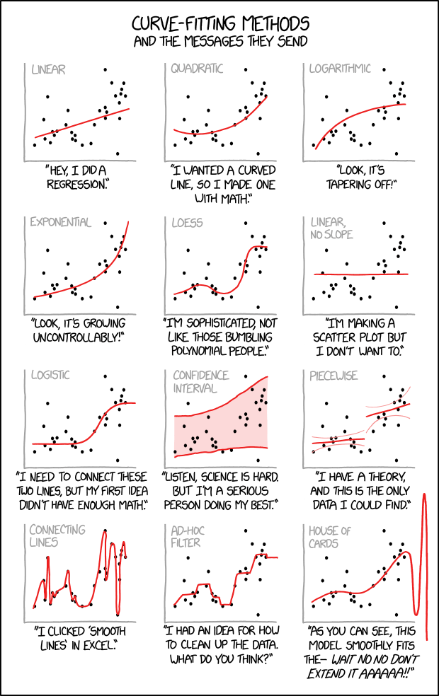

*"Cauchy-Lorentz: 'Something alarmingly mathematical is happening, and you should probably stop.'" - A reminder that not every pattern in time series data is meaningful, and overfitting is always lurking.*

Time series analysis is the art of understanding temporal patterns in data. The core lecture covers **datetime parsing and indexing**, **date ranges and current pandas offset aliases**, **time-based selection**, **resampling**, **rolling and exponentially weighted windows**, **basic time zone handling**, and **plots that reveal temporal structure**. Period arithmetic, decomposition, forecasting, high-frequency data, and custom frequencies are optional topics in [BONUS.md](BONUS.md), not core Lecture 09 content.

*Pro tip: Time series analysis is 90% datetime wrangling, 5% actual analysis, and 5% swearing at timezone conversions. Master these datetime tools and you'll be ahead of 90% of data scientists.*

**Learning Objectives:**

- Master datetime data types and parsing
- Generate date ranges with current pandas offset aliases
- Perform time series indexing and selection
- Use resampling and frequency conversion
- Apply rolling window operations
- Understand exponentially weighted functions
- Handle basic time zone operations
- Apply Lecture 07 visualization principles to temporal structure

### Reference Card: Time-Series Workflow

| Task | Main tool | What it produces |
| :--- | :--- | :--- |
| Parse and order timestamps | `pd.to_datetime()` + `sort_index()` | Chronological `DatetimeIndex` |
| Select a period | `.loc[...]`, `between_time()`, `at_time()` | A time-filtered Series/DataFrame |
| Change frequency | `.resample(freq)` or `.asfreq(freq)` | Aggregated or aligned time grid |
| Build history-aware features | `.shift()`, `.rolling()`, `.ewm()` | Lag, window, or smoothed columns |
| Compare temporal structure | `Series.plot()` / `DataFrame.plot()` | Labeled time-series figure |

### Code Snippet: Minimal Time-Series Setup

```python
df['timestamp'] = pd.to_datetime(df['timestamp'], utc=True)
df = df.set_index('timestamp').sort_index()
weekly = df['value'].resample('W').mean()
weekly.plot(title='Weekly mean value', ylabel='value')
```

# Understanding Time Series Data

*Reality check: Time series data is everywhere in health and medical research - patient vital signs, clinical trial measurements, disease surveillance, environmental monitoring. Understanding how to work with temporal data is essential for any data scientist in the life sciences.*

Time series data records observations over time, so order and timing matter; unlike cross-sectional data, its temporal structure supports time-based analysis.

## Types of Time Series

*"Time series data comes in many flavors - some are as regular as a Swiss watch, others as unpredictable as a toddler's nap schedule. The key is knowing which one you're dealing with!"*

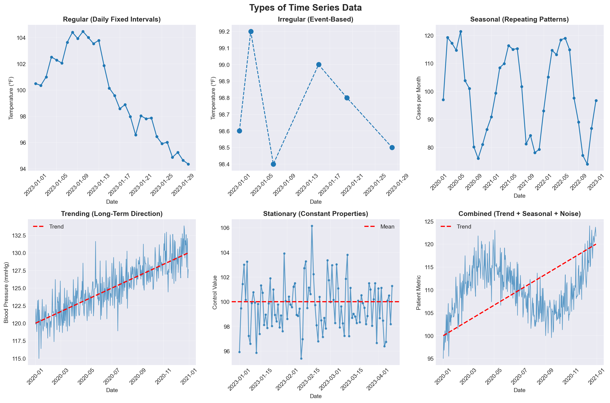

*Visual guide showing the different types of time series data. Notice how regular series tick along like clockwork, while irregular series jump around like a medical appointment schedule.*

| Type | Description | Example |
|------|-------------|---------|
| **Regular** | Fixed intervals (daily, hourly, monthly) | Daily patient temperature readings |
| **Irregular** | Variable intervals (event-based) | Clinical visit dates |
| **Seasonal** | Patterns repeat over time | Monthly flu case counts |
| **Trending** | Long-term direction | Long-term blood pressure trends |
| **Stationary** | Statistical properties don't change | Laboratory control measurements |
| **Combined** | Multiple components (trend + seasonal + noise) | Real-world medical data with all patterns |

# Date and Time Data Types

*Think of datetime objects as the Swiss Army knife of temporal data - they can represent any moment in time with precision down to microseconds, and `pandas` makes them incredibly powerful for analysis.*

## Python datetime Module

The Python standard library provides `datetime` for working with dates and times. Understanding these basics is essential before moving to `pandas`. *Think of it as learning to walk before you can run - except in this case, walking is parsing dates and running is resampling multi-site clinical trial data.*

### Reference Card: Python `datetime`

- `datetime.now()`: Current date and time
- `datetime(year, month, day)`: Create specific date
- `datetime.strptime(string, format)`: Parse string to datetime
- `datetime.strftime(format)`: Format datetime to string
- `timedelta(days=1)`: Time differences

### Code Snippet: Python `datetime`

```python
from datetime import datetime, timedelta

# Current time
now = datetime.now()
print(f"Current time: {now}")

# Specific date (patient birth date)
birthday = datetime(1990, 5, 15)
print(f"Birth date: {birthday}")

# String parsing (lab result timestamp)
date_str = "2023-12-25 14:30:00"
parsed_date = datetime.strptime(date_str, "%Y-%m-%d %H:%M:%S")
print(f"Parsed date: {parsed_date}")

# String formatting
formatted = parsed_date.strftime("%B %d, %Y at %I:%M %p")
print(f"Formatted: {formatted}")

# Time differences (age calculation)
time_diff = now - birthday
print(f"Age in days: {time_diff.days}")
```

## pandas DatetimeIndex

`pandas` provides powerful datetime functionality through `DatetimeIndex`, which is optimized for time series operations.

### Reference Card: DatetimeIndex Setup

- `pd.to_datetime()`: Convert to datetime
- `pd.date_range()`: Create date range
- `pd.DatetimeIndex()`: Create datetime index
- `df.set_index('date')`: Set datetime index
- `df.index`: Access datetime index

### Code Snippet: DatetimeIndex Setup

```python
import numpy as np
import pandas as pd

# Convert to datetime (lab test dates)
date_strings = ['2023-01-01', '2023-01-02', '2023-01-03']
dates = pd.to_datetime(date_strings)
print("Converted dates:")
print(dates)

# Create date range (daily patient monitoring)
date_range = pd.date_range('2023-01-01', periods=10, freq='D')
print("\nDate range:")
print(date_range)

# Create DataFrame with datetime index (vital signs)
df = pd.DataFrame({
    'heart_rate': np.random.randint(60, 100, 10),
    'blood_pressure': np.random.randint(90, 140, 10)
}, index=date_range)
print("\nDataFrame with datetime index:")
print(df.head())
```

For repeated dates, convert the column, set it as the index, and sort it before partial-date `.loc` slicing; a non-monotonic index may not slice reliably:

```python
df['date'] = pd.to_datetime(df['date'])  # Convert to datetime
df = df.set_index('date')  # Set as index
df = df.sort_index()  # Group equal dates in monotonic order
```

## Date Range Generation

`pandas` provides flexible date range generation for creating regular time series. *Want every Monday? Got it. Business days only? No problem. Last Friday of each month? Absolutely. Third Wednesday? Why not! `pandas` can generate pretty much any date pattern you can imagine - and some you probably can't.*

### Reference Card: Date Range Generation

| Function | Frequency Code | Description |
|----------|----------------|-------------|
| `pd.date_range(start, end, freq='D')` | `'D'` | Daily (calendar) |
| `pd.bdate_range(start, end)` | `'B'` | Business days only |
| `pd.date_range(freq='W-MON')` | `'W-MON'` | Weekly on Monday |
| `pd.date_range(freq='MS')` | `'MS'` | Month start |
| `pd.date_range(freq='QS')` | `'QS'` | Quarter start |
| `pd.date_range(freq='h')` | `'h'` | Hourly |

*Note: Use lowercase `'h'` for hourly frequency. The uppercase `'H'` alias was removed in pandas 3.*

### Code Snippet: Date Ranges

```python
# Different date range types for clinical data
print("Daily range (vital signs):")
daily = pd.date_range('2023-01-01', '2023-01-10', freq='D')
print(daily)

print("\nBusiness days only (clinic visits):")
business = pd.bdate_range('2023-01-01', '2023-01-10')
print(business)

print("\nWeekly range (Mondays - weekly checkups):")
weekly = pd.date_range('2023-01-01', '2023-03-01', freq='W-MON')
print(weekly)

print("\nMonthly range (monthly lab tests):")
monthly = pd.date_range('2023-01-01', '2023-12-01', freq='MS')
print(monthly)
```

## Frequency Inference

You can infer the frequency of a time series and convert between frequencies.

### Reference Card: Frequency and Alignment

- `pd.infer_freq(ts.index)`: Infer frequency from time series
- `ts.asfreq(freq)`: Conform to a new timestamp grid without combining observations
- `ts.resample(freq).asfreq()`: Select observations at resample bin labels without aggregation

### Code Snippet: Frequency Inference

```python
# Create time series with inferred frequency
dates = pd.date_range('2023-01-01', periods=100, freq='D')
ts = pd.Series(np.random.randn(100), index=dates)

# Infer frequency
freq = pd.infer_freq(ts.index)
print(f"Inferred frequency: {freq}")

# Select values on a weekly grid; do not aggregate daily observations
ts_weekly = ts.asfreq('W')
print(f"Weekly frequency: {pd.infer_freq(ts_weekly.index)}")
```

## Shifting and Lagging

Shifting allows you to create lagged or leading versions of your time series, essential for analyzing changes over time.

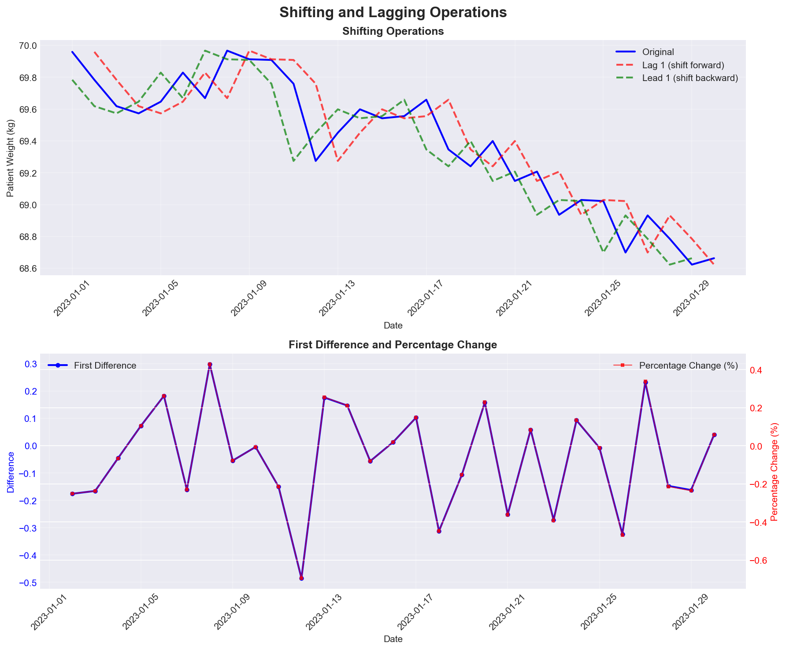

*Visual demonstration of shifting operations showing lag (looking back), lead (looking ahead), and differences (day-to-day changes).*

### Reference Card: Lagged Features

- `ts.shift(1)`: Shift by 1 period (lag)
- `ts.shift(-1)`: Shift by -1 period (lead)
- `ts.diff()`: First difference
- `ts.pct_change()`: Fractional change: `0.1` means 10%; multiply by 100 for percent
- `ts.shift(1, freq='D')`: Shift by 1 day (with timestamp)

### Code Snippet: Lagged Features

```python
# Create sample data (patient weight measurements)
dates = pd.date_range('2023-01-01', periods=10, freq='D')
weight_features = pd.DataFrame({
    'weight': [70.5, 70.8, 70.2, 71.0, 70.9, 71.2, 71.5, 71.3, 71.8, 71.6]
}, index=dates)

# Add shifted versions of the weight Series as new DataFrame columns
weight_features['lag_1'] = weight_features['weight'].shift(1)  # Previous row
weight_features['lead_1'] = weight_features['weight'].shift(-1)  # Next row
weight_features['diff'] = weight_features['weight'].diff()  # Row-to-row change
weight_features['pct_change'] = weight_features['weight'].pct_change()

print("Time series with shifts:")
print(weight_features[['weight', 'lag_1', 'diff', 'pct_change']].head())
```

# LIVE DEMO!

# Time Series Indexing and Selection

## Basic Time Series Selection

`pandas` provides intuitive ways to select data from time series using string-based indexing. You can write "2023" and `pandas` knows you mean "all of 2023".

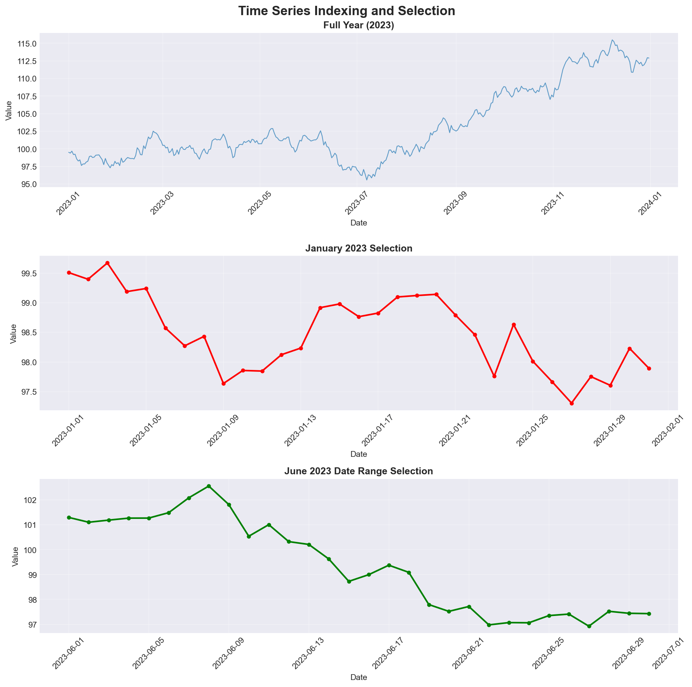

*Examples of time-based selection showing how to slice data by year, month, or date range. Notice how `pandas` interprets string dates like a human would.*

### Reference Card: Calendar Selection

- `ts['2023-01-01']`: Select specific date
- `ts['2023-01-01':'2023-01-31']`: Select date range
- `ts['2023']`: Select entire year
- `ts['2023-01']`: Select specific month
- `ts.loc['2023-01-01']`: Label-based selection
- `ts.iloc[0:10]`: Position-based selection

### Code Snippet: Calendar Selection

```python
# Create sample time series (year of patient data)
dates = pd.date_range('2023-01-01', periods=365, freq='D')
values = np.cumsum(np.random.randn(365)) + 100
ts = pd.Series(values, index=dates)

# Select specific date
print("January 1, 2023:")
print(ts['2023-01-01'])

# Select date range
print("\nJanuary 2023:")
print(ts['2023-01-01':'2023-01-31'].head())

# Select entire year
print("\n2023 data shape:")
print(ts['2023'].shape)

# Select specific month
print("\nJanuary 2023:")
print(ts['2023-01'].head())
```

## Advanced Time Series Selection

For time series with time components, you can select based on time of day. This is useful for selecting data from business hours or specific times of day.

### Reference Card: Time-of-Day Selection

- `ts.between_time('09:00', '17:00')`: Select time range
- `ts.at_time('12:00')`: Select specific time
- `ts.loc[ts.index < start_date + pd.Timedelta(days=10)]`: First 10 days, where `start_date` is the first timestamp
- `ts.loc[ts.index > end_date - pd.Timedelta(days=10)]`: Last 10 days, where `end_date` is the last timestamp
- `ts.truncate(before='2023-06-01')`: Truncate before date (requires sorted index)
- `ts.truncate(after='2023-06-30')`: Truncate after date (requires sorted index)

### Code Snippet: Time-of-Day Selection

Timestamp slices include both endpoints. Use a strict boundary below to select exactly 72 hourly readings for each three-day window.

```python
# Create hourly time series (ICU monitoring)
hourly_dates = pd.date_range('2023-01-01', periods=24*7, freq='h')
hourly_values = np.random.randn(24*7) + 100
ts_hourly = pd.Series(hourly_values, index=hourly_dates)

# Select business hours (9 AM to 5 PM)
business_hours = ts_hourly.between_time('09:00', '17:00')
print("Business hours data:")
print(business_hours.head())

# Select specific time (noon readings)
noon_data = ts_hourly.at_time('12:00')
print("\nNoon data:")
print(noon_data.head())

# Select first and last periods using .loc
print("\nFirst 3 days:")
first_3_days = ts_hourly.loc[ts_hourly.index < ts_hourly.index.min() + pd.Timedelta(days=3)]
print(first_3_days.head())

print("\nLast 3 days:")
last_3_days = ts_hourly.loc[ts_hourly.index > ts_hourly.index.max() - pd.Timedelta(days=3)]
print(last_3_days.head())
```

# Resampling and Frequency Conversion

*Resampling is like changing the lens on your camera - you can zoom in to see more detail (higher frequency) or zoom out to see the big picture (lower frequency).*

Resampling converts time series from one frequency to another. **Downsampling** aggregates higher frequency data to lower frequency (e.g., daily to monthly). **Upsampling** converts lower frequency to higher frequency (e.g., monthly to daily), often introducing missing values.

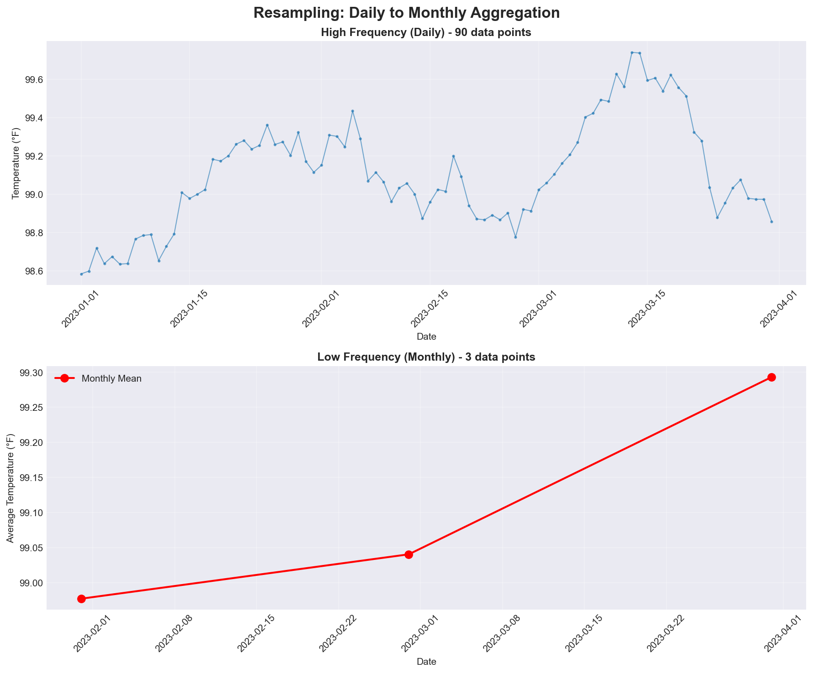

*Visual comparison showing daily data (high frequency, many points) being resampled to monthly data (low frequency, fewer points). Notice how the monthly view smooths out daily fluctuations.*

## Basic Resampling

The `resample()` method is the workhorse for frequency conversion, similar to `groupby()` but for time intervals.

### Reference Card: Resampling Frequencies

- `ts.resample('D')`: Daily resampling
- `ts.resample('W')`: Weekly resampling
- `ts.resample('ME')`: Monthly resampling (Month End)
- `ts.resample('QE')`: Quarterly resampling (quarter end)
- `ts.resample('YE')`: Annual resampling (year end)
- `ts.resample('h')`: Hourly resampling

### Code Snippet: Basic Resampling

```python
# Create daily time series (patient vital signs)
daily_dates = pd.date_range('2023-01-01', periods=30, freq='D')
daily_values = np.cumsum(np.random.randn(30)) + 100
ts_daily = pd.Series(daily_values, index=daily_dates)

# Resample to different frequencies
print("Original daily data shape:", ts_daily.shape)

# Weekly resampling (average weekly values)
weekly = ts_daily.resample('W').mean()
print("Weekly resampled shape:", weekly.shape)
print("Weekly data:")
print(weekly.head())

# Monthly resampling (average monthly values)
monthly = ts_daily.resample('ME').mean()  # 'ME' = Month End
print("\nMonthly resampled shape:", monthly.shape)
print("Monthly data:")
print(monthly.head())
```

`resample()` puts observations into time bins; to combine the observations in each bin, it needs an aggregation such as `mean()`. The `label` argument chooses which bin edge labels the result, while `closed` chooses which edge belongs to the bin. Defaults vary by frequency, so specify them when boundary membership matters. In contrast, `asfreq()` conforms a series to a new timestamp grid by selecting existing values at those timestamps (and introducing missing values where the new grid has no match), without combining observations. `resample(...).asfreq()` likewise selects values at the resample bin labels; it is not an aggregation:

```python
weekly_mean = ts_daily.resample('W', label='right', closed='right').mean()
weekly_grid = ts_daily.asfreq('W')  # No aggregation
weekly_bin_labels = ts_daily.resample('W').asfreq()  # Selection at bin labels
```

## Resampling with Different Aggregations

You can apply various aggregation functions when resampling, just like with `groupby()`. The syntax is the same, but instead of grouping by categories, you're grouping by time intervals.

### Reference Card: Resampling Aggregations

- `ts.resample('D').mean()`: Mean aggregation
- `ts.resample('D').sum()`: Sum aggregation
- `ts.resample('D').max()`: Maximum aggregation
- `ts.resample('D').min()`: Minimum aggregation
- `ts.resample('D').std()`: Standard deviation
- `ts.resample('D').agg(['mean', 'std', 'min', 'max'])`: Multiple aggregations

### Code Snippet: Resampling Aggregations

```python
# Create sample data with multiple columns (patient metrics)
df = pd.DataFrame({
    'temperature': np.random.normal(98.6, 0.5, 365),
    'heart_rate': np.random.randint(60, 100, 365)
}, index=pd.date_range('2023-01-01', periods=365, freq='D'))

# Different resampling methods
print("Daily to weekly resampling:")
weekly_stats = df.resample('W').agg({
    'temperature': ['mean', 'std', 'min', 'max'],
    'heart_rate': 'mean'
})
print(weekly_stats.head())

# Custom resampling function
def custom_agg(series):
    return pd.Series({
        'mean': series.mean(),
        'std': series.std(),
        'range': series.max() - series.min(),
        'count': len(series)
    })

print("\nCustom aggregation:")
custom_stats = df['temperature'].resample('ME').apply(custom_agg)
print(custom_stats.head())
```

When a DataFrame also contains non-numeric columns, select the numeric columns before using numeric aggregations such as `mean()`, or specify each column's aggregation in `.agg()`; otherwise pandas cannot calculate a numeric summary for identifiers or category labels.

# LIVE DEMO!

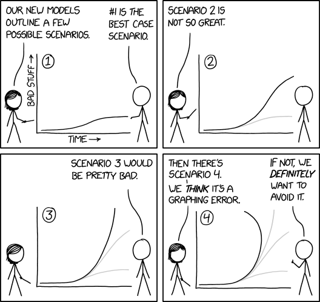

# Rolling Window Operations

Rolling window functions compute statistics over a fixed-size window that moves through the time series. This is useful for smoothing noisy data and identifying trends.

## Basic Rolling Operations

The `rolling()` method creates a rolling window object that can be used with various aggregation functions.

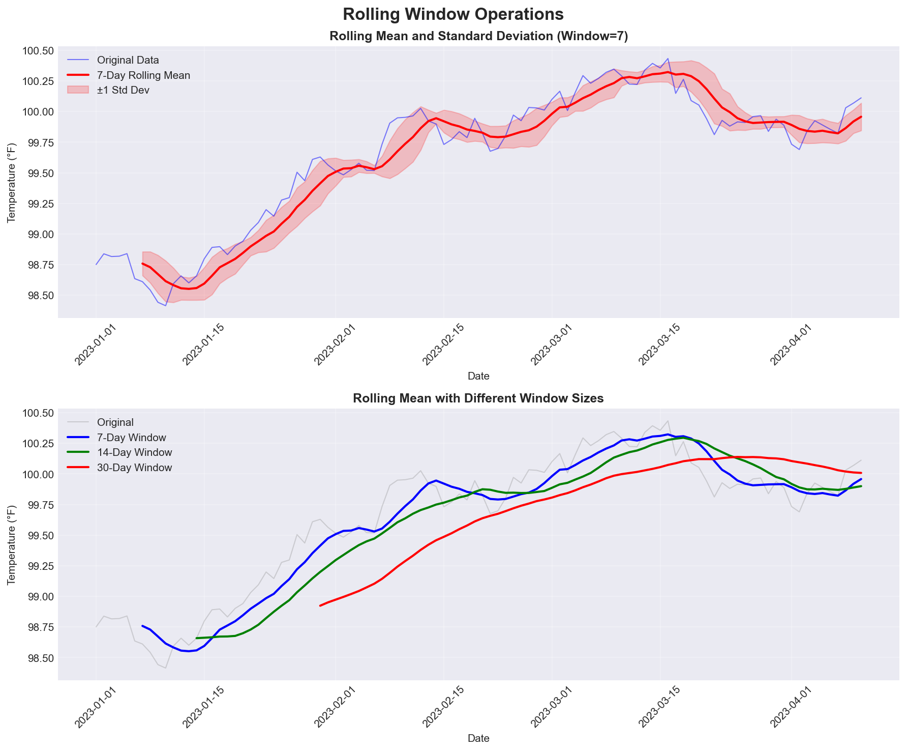

*Demonstration of rolling window operations showing how a 7-day window smooths out daily fluctuations while preserving the underlying trend. The shaded area shows the standard deviation - wider means more variability, narrower means more consistent.*

### Reference Card: Rolling Windows

- `ts.rolling(window=5)`: 5-period rolling window
- `ts.rolling(window=5).mean()`: Rolling mean
- `ts.rolling(window=5).std()`: Rolling standard deviation
- `ts.rolling(window=5).sum()`: Rolling sum
- `ts.rolling(window=5).min()`: Rolling minimum
- `ts.rolling(window=5).max()`: Rolling maximum

### Code Snippet: Rolling Statistics

```python
# Create sample data (patient temperature over time)
dates = pd.date_range('2023-01-01', periods=100, freq='D')
values = 98.6 + np.cumsum(np.random.randn(100) * 0.1)  # Temperature with drift
rolling_features = pd.DataFrame({'temperature': values}, index=dates)

# Rolling statistics (7-day rolling window)
rolling_features['rolling_mean'] = rolling_features['temperature'].rolling(window=7).mean()
rolling_features['rolling_std'] = rolling_features['temperature'].rolling(window=7).std()
rolling_features['rolling_min'] = rolling_features['temperature'].rolling(window=7).min()
rolling_features['rolling_max'] = rolling_features['temperature'].rolling(window=7).max()

print("Time series with rolling statistics:")
print(rolling_features[['temperature', 'rolling_mean', 'rolling_std']].head(10))
```

## Advanced Rolling Operations

Rolling windows can be centered, have minimum periods, and use custom functions. Centered windows look both backward and forward from each point. Minimum periods allow calculations even before you have a full window.

### Reference Card: Rolling and EWM Options

- `ts.rolling(window=5, center=True)`: Centered rolling window
- `ts.rolling(window=5, min_periods=3)`: Minimum periods required
- `ts.rolling(window=5).quantile(0.5)`: Rolling median
- `ts.rolling(window=5).apply(custom_func)`: Custom rolling function
- `ts.expanding()`: Expanding window (from start to current)
- `ts.ewm(span=5)`: Exponentially weighted window; call `.mean()` to calculate an average

### Code Snippet: Advanced Rolling Features

```python
# Advanced rolling operations
rolling_features['centered_mean'] = rolling_features['temperature'].rolling(window=7, center=True).mean()
rolling_features['expanding_mean'] = rolling_features['temperature'].expanding().mean()
rolling_features['ewm_mean'] = rolling_features['temperature'].ewm(span=7).mean()

# Custom rolling function
def rolling_range(series):
    return series.max() - series.min()

rolling_features['rolling_range'] = (
    rolling_features['temperature'].rolling(window=7).apply(rolling_range)
)

print("Advanced rolling statistics:")
print(rolling_features[['centered_mean', 'expanding_mean', 'ewm_mean']].head(10))
```

## Exponentially Weighted Functions

Exponentially weighted functions give more weight to recent observations, making them more responsive to recent changes.

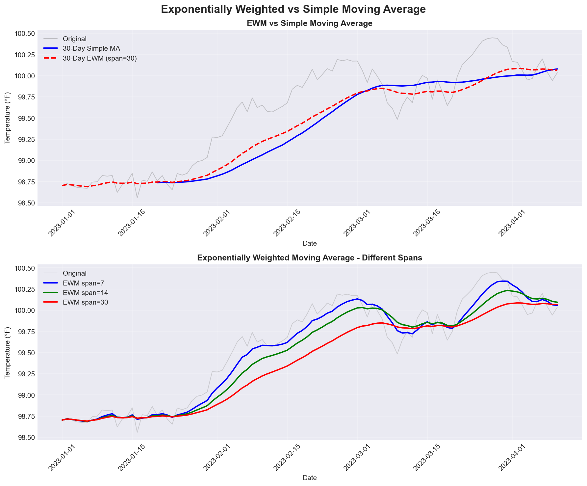

*Comparison of exponentially weighted moving average (EWM) with simple moving average. Notice how EWM responds faster to recent changes.*

### Reference Card: Exponentially Weighted Windows

- `ts.ewm(span=5).mean()`: Weighted mean with decay `alpha = 2 / (span + 1)`; larger span means slower decay
- `ts.ewm(alpha=0.3).mean()`: Weighted mean; larger `alpha` gives recent observations more relative weight
- `ts.ewm(halflife=2).mean()`: Weighted mean whose weights halve every two observations
- `ts.ewm(span=5).std()`: Exponentially weighted standard deviation

### Code Snippet: Exponentially Weighted Features

```python
# Create sample data (patient blood pressure)
dates = pd.date_range('2023-01-01', periods=50, freq='D')
blood_pressure_features = pd.DataFrame({
    'blood_pressure': np.cumsum(np.random.randn(50)) + 120
}, index=dates)

# Exponentially weighted functions
blood_pressure_features['ewm_mean'] = (
    blood_pressure_features['blood_pressure'].ewm(span=5).mean()
)
blood_pressure_features['ewm_std'] = (
    blood_pressure_features['blood_pressure'].ewm(span=5).std()
)
blood_pressure_features['ewm_alpha'] = (
    blood_pressure_features['blood_pressure'].ewm(alpha=0.3).mean()
)

print("Time series with EWM functions:")
print(blood_pressure_features[['blood_pressure', 'ewm_mean', 'ewm_std']].head(10))
```

*"You can't fall off the bell curve if there's no bell curve." - A reminder that time series forecasting, especially during unprecedented events, carries significant uncertainty. Always be honest about prediction intervals.*

# Time Zone Handling

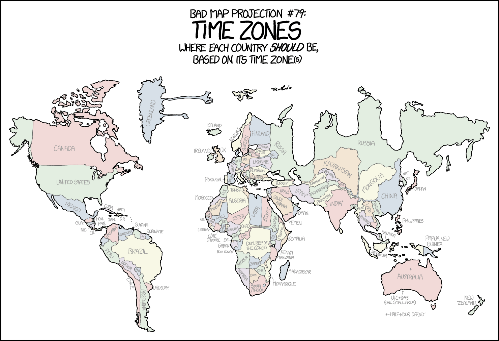

*"I find it hard to believe that a time zone can be a real thing." - A relatable sentiment when dealing with time zone conversions.*

## Basic Time Zone Operations

`pandas` provides time zone localization and conversion for timezone-aware datetime objects.

**Best Practice:** When working with time zones, use UTC (Coordinated Universal Time) as your base timezone. UTC has no daylight saving time, avoiding ambiguity issues. Store data in UTC, and convert to local timezones only when needed for display or analysis.

### Reference Card: Time Zone Operations

- `ts.index.tz_localize('UTC')`: Add timezone to naive datetime
- `ts.index.tz_convert('US/Eastern')`: Convert timezone
- `pd.Timestamp.now(tz='UTC')`: Current time in timezone
- `pd.date_range(..., tz='UTC')`: Create timezone-aware date range

`tz_localize()` attaches a timezone interpretation to naive clock readings without moving those clock values. `tz_convert()` requires timezone-aware values and changes their displayed clock time while preserving the same instants. Localize using the timezone in which naive source timestamps were recorded; convert to UTC for storage or to a local zone for display.

Named timezones require an IANA timezone database. If `US/Eastern` is unavailable in the active notebook environment, install the `tzdata` package with `%pip install tzdata` before running the example.

### Code Snippet: Time Zone Conversion

```python
# Create timezone-aware datetime (clinical trial data)
utc_time = pd.Timestamp.now(tz='UTC')
print(f"UTC time: {utc_time}")

# Convert to different timezone (US Eastern)
eastern_time = utc_time.tz_convert('US/Eastern')
print(f"Eastern time: {eastern_time}")

# Create timezone-aware DataFrame
df_tz = pd.DataFrame({
    'value': np.random.randn(3)
}, index=pd.date_range('2023-01-01', periods=3, freq='D'))

# Interpret these naive source timestamps as UTC
df_tz.index = df_tz.index.tz_localize('UTC')
print("\nUTC DataFrame:")
print(df_tz)

# Convert to Eastern time
df_tz.index = df_tz.index.tz_convert('US/Eastern')
print("\nEastern DataFrame:")
print(df_tz)
```

# Entity-Aware Features and Past-Only Windows

A **panel** contains one ordered history per entity: a patient, sensor, site, or other unit observed repeatedly. Sort within each entity before creating lags or windows, and never let one entity's history leak into another's.

```python
panel = pd.DataFrame({
    'entity': ['north', 'north', 'north', 'south', 'south', 'south'],
    'timestamp': pd.to_datetime([
        '2024-01-01 09:00', '2024-01-01 10:00', '2024-01-01 11:00',
        '2024-01-01 09:00', '2024-01-01 10:00', '2024-01-01 11:00',
    ], utc=True),
    'value': [10, 12, 11, 20, 19, 21],
}).sort_values(['entity', 'timestamp'])

grouped = panel.groupby('entity', sort=False)['value']
panel['lag_1'] = grouped.transform(lambda values: values.shift(1))
panel['difference'] = panel['value'] - panel['lag_1']
panel['past_mean_3'] = grouped.transform(
    lambda values: values.shift(1).rolling(window=3, min_periods=1).mean()
)
panel['available_at'] = panel['timestamp'] + pd.Timedelta(minutes=15)
prediction_time = pd.Timestamp('2024-01-01 11:00', tz='UTC')
usable = panel['available_at'] <= prediction_time
```

These are **past-only** features: the current observation is excluded before the window is calculated. A row-count window such as the previous three observations answers “how many readings back?” A time-based window such as the previous two hours answers “what elapsed time was available?” In pandas, use a time offset such as `.rolling('2h', closed='left')` on a datetime index for that elapsed-time meaning. Both require chronological order within each entity. A centered window (`center=True`) looks forward as well as backward, so it is useful for describing a completed series but is future leakage when a feature must be available at prediction time.

Availability is a separate check from timestamp order. If a measurement has an `available_at` timestamp, use it—not merely its observation time—to decide whether it can be used at `prediction_time`:

```python
usable = panel['available_at'] <= prediction_time
```

The same audit applies to lagged values, rolling summaries, resampled values, and any feature assembled from another table.

# Time Series Visualization

This section applies the plotting principles from Lecture 07 to temporal structure. Put time on the x-axis, preserve chronological order, choose a scale that makes gaps visible, and label the time zone when it matters. The goal is to compare raw observations with a time-based summary, not to reteach general plotting.

## Basic Time Series Plots

Use a line plot for ordered observations and overlay a rolling summary when it helps reveal change over time. Keep the raw series visible so the smoother does not hide variation.

### Reference Card: Time Series Plotting

- `ts.plot()`: Basic line plot of time series
- `ts.plot(figsize=(12, 6))`: Plot with custom figure size
- `ts.plot(title='Title')`: Plot with title
- `ts.plot(style='-', marker='o')`: Plot with custom style and markers
- `ax = ts.plot()`: Get axes for further customization

### Code Snippet: Time-Series Plotting

```python
import matplotlib.pyplot as plt

# Create sample time series (patient temperature over year)
dates = pd.date_range('2023-01-01', periods=365, freq='D')
values = 98.6 + 2 * np.sin(2 * np.pi * np.arange(365) / 365.25) + np.random.randn(365) * 0.5
ts = pd.Series(values, index=dates)

# Basic time series plot
ts.plot(figsize=(12, 6), title='Patient Temperature Over Time', 
        xlabel='Date', ylabel='Temperature (°F)')
plt.grid(True, alpha=0.3)
plt.tight_layout()
plt.show()

# Plot with rolling mean overlay
fig, ax = plt.subplots(figsize=(12, 6))
ts.plot(ax=ax, alpha=0.5, label='Daily', color='gray')
ts.rolling(window=30).mean().plot(ax=ax, linewidth=2, label='30-Day Rolling Mean', color='blue')
ax.set_title('Patient Temperature with Rolling Mean', fontsize=14, fontweight='bold')
ax.set_xlabel('Date')
ax.set_ylabel('Temperature (°F)')
ax.legend()
ax.grid(True, alpha=0.3)
plt.tight_layout()
plt.show()
```

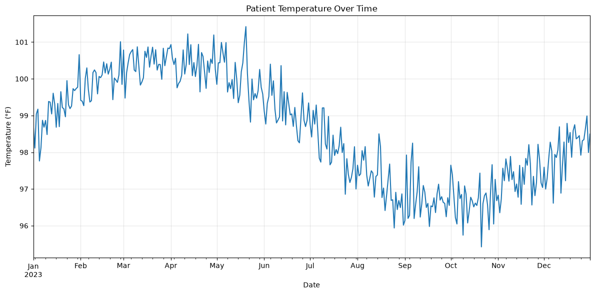


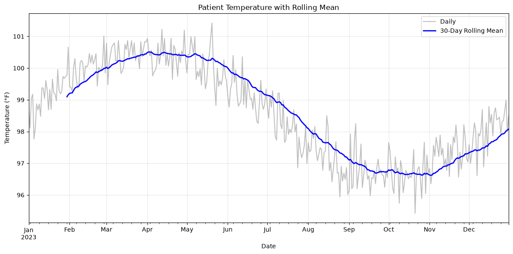

*Optional decomposition and component plots belong in [BONUS.md](BONUS.md).*


# LIVE DEMO!
