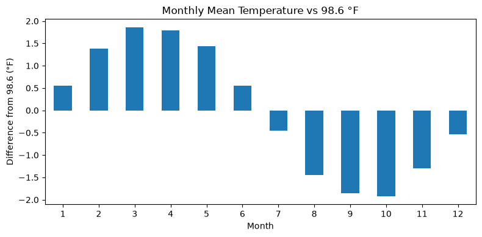

---
notion:
  title_line: "# Time Series Analysis: Temporal Data and Trends"
  role: lecture
  status: mapped
  page_id: "2a8d9fdd-1a1a-80ed-828d-e5feb58d5ed9"
  url: "https://app.notion.com/p/2a8d9fdd1a1a80ed828de5feb58d5ed9"
---

# Time Series Analysis: Temporal Data and Trends

See [BONUS.md](BONUS.md) for the optional extensions.

**Live notebooks in Colab:** [Demo 1](https://colab.research.google.com/github/christopherseaman/datasci_217/blob/main/09/demo/demo1_datetime_fundamentals.ipynb) · [Demo 2](https://colab.research.google.com/github/christopherseaman/datasci_217/blob/main/09/demo/demo2_indexing_resampling.ipynb) · [Demo 3](https://colab.research.google.com/github/christopherseaman/datasci_217/blob/main/09/demo/demo3_visualization_automation.ipynb)


# Understanding Time Series Data

A **time series** is a measurement recorded repeatedly over time: an ICU patient's heart rate every minute, a hospital's daily flu admissions, the dates a trial participant came in for visits. Sorting the rows in earlier lectures did not change what they meant; here the order carries meaning, and "what was the previous reading?", "what happened this week?", and "was this known yet?" all depend on time.

Time shows up in data in a few forms:

- **Timestamp**: one instant, such as the blood draw at `2024-03-01 08:15`.
- **Period**: a whole span with a start and end, such as "March 2024" in a monthly report.
- **Elapsed time**: time since a starting point, such as hours since admission.

A **single series** is one history, such as one patient's weight. A **panel** stacks one history per **entity** (a patient, sensor, or site) in one table, with an entity column such as `patient_id`; it is the panel data behind the name pandas (Lecture 04). Most calculations on a panel happen inside one entity's history, so panels reuse Lecture 08's group-by pattern and Lectures 06 and 07's grain question: say what one row represents ("one heart-rate reading for one patient at one time") before computing anything.

## Types of Time Series

*"Time series data comes in many flavors - some are as regular as a Swiss watch, others as unpredictable as a toddler's nap schedule."*


| Type | Description | Example |
|------|-------------|---------|
| **Regular** | Fixed intervals (daily, hourly, monthly) | Daily patient temperature readings |
| **Irregular** | Variable intervals (event-based) | Clinical visit dates |
| **Seasonal** | Patterns repeat over time | Monthly flu case counts |
| **Trending** | Long-term direction | Long-term blood pressure trends |
| **Stationary** | Statistical properties don't change | Laboratory control measurements |
| **Combined** | Multiple components (trend + seasonal + noise) | Real-world medical data with all patterns |

# Date and Time Data Types

A lab extract arrives with `collected_at` and `resulted_at` stored as text, like `"2023-12-25 14:30:00"`. Text answers none of the questions a turnaround report asks: subtracting one string from another to get the hours between collection and result raises `TypeError`, and "was this drawn on the night shift?" needs something that knows `14` is an hour. Lecture 05 treated a column of the wrong type as a cleaning problem, and the type wanted here is a **datetime**: one value holding year, month, day, hour, minute, and second, which can be compared, subtracted, and rewritten in any display format.

Python's standard library builds these values one at a time, which is what a script needs to stamp a report or schedule a follow-up visit; `pandas` applies the same rules to a whole column at once. Both call the two directions **parsing** (text in, datetime out) and **formatting** (datetime in, text out). *A datetime is the Swiss Army knife of temporal data - precise down to the microsecond, and `pandas` wields a million at a time.*

## Python datetime Module

### Reference Card: Python `datetime`

- `datetime.now()`: Current date and time
- `datetime(year, month, day)`: Create specific date
- `datetime.strptime(string, format)`: Parse string to datetime
- `datetime.strftime(format)`: Format datetime to string
- `timedelta(days=30)`: A duration (`hours=` and `weeks=` also work); add it to a `datetime` to move it, and subtracting two datetimes gives one
- Format codes: `%Y` four-digit year, `%m` month 01-12, `%d` day, `%H` 24-hour hour, `%M` minute, `%S` second, `%I` with `%p` 12-hour clock with AM/PM, `%B` full month name

### Code Snippet: Python `datetime`

```python
from datetime import datetime, timedelta

birthday = datetime(1990, 5, 15)          # patient birth date
now = datetime(2024, 3, 1, 9, 0)          # fixed for a stable output; datetime.now() reads the clock

# Lab result timestamp: text in, datetime out, then back to text for the report
lab_time = datetime.strptime("2023-12-25 14:30:00", "%Y-%m-%d %H:%M:%S")
print(lab_time.strftime("%B %d, %Y at %I:%M %p"))
print((now - birthday).days)              # age in days
print(lab_time + timedelta(days=30))      # 30-day follow-up visit
```

```text
December 25, 2023 at 02:30 PM
12344
2024-01-24 14:30:00
```

## pandas DatetimeIndex

Dates usually arrive as text in a CSV column, like `"3/10/2024 08:00"`, and text sorts character by character: `"3/10/2024"` lands before `"3/9/2024"`. `pd.to_datetime()` converts a whole column into **`datetime64`** values; each single value is a **`Timestamp`**, and a missing or unparseable date becomes **`NaT`** ("Not a Time"), the datetime version of `NaN`.

When those timestamps become the row labels, the index is a **`DatetimeIndex`**. Selecting "all of March", resampling by week, and rolling over the last two hours all read this index. Sort it first: slicing an unsorted DatetimeIndex with date strings raises `KeyError`.

### Reference Card: Parsing and Indexing Dates

| Task | Code | Purpose and key arguments | Typical output |
| --- | --- | --- | --- |
| Parse | `pd.to_datetime(s, format='%Y-%m-%d %H:%M')` | Convert text; `format=` states the expected pattern; `errors='coerce'` turns bad values into `NaT` | `datetime64` Series |
| Index | `df.set_index('recorded_at').sort_index()` | Timestamps as row labels, in order | `DataFrame` with `DatetimeIndex` |
| Check | `df.index.is_monotonic_increasing` | Confirm order before slicing | `True` / `False` |
| Parts | `df.index.month`, `.year`, `.hour`, `.day_name()` | Calendar parts from the index | Index of numbers or names |
| Parts | `s.dt.month`, `s.dt.year`, `s.dt.hour` | The same parts from a datetime column | Series |
| Parts | `s.dt.dayofweek` | Day of the week as a number, Monday `0` through Sunday `6`; `.dt.day_name()` spells it out | Series of `int32` |
| Parts | `s.dt.dayofyear` | Day of the year, `1` through 365, or 366 in a leap year | Series of `int32` |
| Round | `s.dt.floor('h')` | Round each time down to the hour (`'D'` for the day) | Series |
| Duration | `pd.Timedelta(days=2)`, `pd.Timedelta(hours=6)` | pandas' `timedelta`; add it to or subtract it from a timestamp | `Timedelta` |

### Code Snippet: Text Column to DatetimeIndex

```python
import numpy as np
import pandas as pd

vitals = pd.DataFrame({
    'recorded_at': ['2024-03-02 08:00', '2024-03-01 20:00', '2024-03-01 08:00'],
    'heart_rate': [88, 76, 72],
})
vitals['recorded_at'] = pd.to_datetime(vitals['recorded_at'], format='%Y-%m-%d %H:%M')
vitals = vitals.set_index('recorded_at').sort_index()
print(vitals)
print(vitals.index.hour)
```

```text
                     heart_rate
recorded_at                    
2024-03-01 08:00:00          72
2024-03-01 20:00:00          76
2024-03-02 08:00:00          88
Index([8, 20, 8], dtype='int32', name='recorded_at')
```

## Date Range Generation

*Every Monday? Got it. Business days only? No problem. `pandas` generates just about any date pattern you can imagine - and some you probably can't.*

### Reference Card: Frequency Aliases

| Alias | Meaning | Health example | Older alias that now fails |
| --- | --- | --- | --- |
| `'min'`, `'15min'` | Minutes | Bedside monitor | `'T'` |
| `'h'`, `'2h'` | Hours | Hourly vitals | `'H'` |
| `'D'` | Calendar days | Daily symptom diary | |
| `'B'` | Business days (`pd.bdate_range`) | Weekday clinic schedule | |
| `'W'` / `'W-MON'` | Every Sunday / every Monday (weeks end on that day) | Weekly check-in | |
| `'MS'` / `'ME'` | Month start / month end | Monthly lab draw / monthly report | `'M'` |
| `'QS'` / `'QE'` | Quarter start / end | Quarterly assessment | `'Q'` |
| `'YS'` / `'YE'` | Year start / end | Annual summary | `'A'`, `'Y'` |

`pd.date_range(start, end, freq=...)` or `pd.date_range(start, periods=n, freq=...)` builds the sequence. McKinney's book uses the older aliases; pandas 3 rejects them with `ValueError`.

### Code Snippet: Date Ranges

```python
print(pd.date_range('2024-01-01', '2024-01-04', freq='D'))    # daily symptom diary
print(pd.bdate_range('2024-01-05', '2024-01-09'))             # weekday clinic days
print(pd.date_range('2024-01-01', periods=3, freq='W-MON'))   # Monday check-ins
print(pd.date_range('2024-01-01', periods=3, freq='MS'))      # monthly lab draws
print(pd.date_range('2024-01-01', periods=3, freq='ME'))      # monthly reports
```

```text
DatetimeIndex(['2024-01-01', '2024-01-02', '2024-01-03', '2024-01-04'], dtype='datetime64[us]', freq='D')
DatetimeIndex(['2024-01-05', '2024-01-08', '2024-01-09'], dtype='datetime64[us]', freq='B')
DatetimeIndex(['2024-01-01', '2024-01-08', '2024-01-15'], dtype='datetime64[us]', freq='W-MON')
DatetimeIndex(['2024-01-01', '2024-02-01', '2024-03-01'], dtype='datetime64[us]', freq='MS')
DatetimeIndex(['2024-01-31', '2024-02-29', '2024-03-31'], dtype='datetime64[us]', freq='ME')
```

The business-day range skips the weekend of January 6-7.

## Frequency Inference

Data rarely arrives labeled with how often it was measured. `pd.infer_freq()` reads a sorted DatetimeIndex and names the spacing, or returns `None` when it is irregular, as with clinic visits. `asfreq()` lays a series onto a regular grid without combining anything: values that land exactly on the grid are kept, and the rest of the grid is `NaN`.

### Reference Card: Frequency and Alignment

- `pd.infer_freq(ts.index)`: Infer the frequency alias, such as `'D'`; `None` for irregular spacing
- `ts.asfreq(freq)`: Conform to a new timestamp grid without combining observations

### Code Snippet: Frequency Inference

```python
rng = np.random.default_rng(42)
ts = pd.Series(rng.standard_normal(100), index=pd.date_range('2023-01-01', periods=100, freq='D'))
print(f"Daily readings: {pd.infer_freq(ts.index)}")

# Keep the values that land on a weekly grid ('W' = weeks ending Sunday); nothing is averaged
print(f"On a weekly grid: {pd.infer_freq(ts.asfreq('W').index)}")

# Irregular clinic visits have no single frequency
visits = pd.to_datetime(['2024-01-02', '2024-01-09', '2024-02-06'])
print(f"Clinic visits: {pd.infer_freq(visits)}")
```

```text
Daily readings: D
On a weekly grid: W-SUN
Clinic visits: None
```

## Shifting and Lagging

A blood-pressure reading means more next to the previous one: did it go up or down since the last visit? **Shifting** slides values down or up the rows while the dates stay in place, so each row can carry a **lag** (the previous row's value) or a **lead** (the next row's). A column built this way as an input for a risk score or model is called a **feature**; Lecture 10 uses features to make predictions.


Shifting counts rows, not time: with irregular clinic visits, the "previous" reading can be one week or four weeks back. Time windows, later in this lecture, count elapsed time instead.

### Reference Card: Lagged Features

- `ts.shift(1)`: Lag: each row gets the previous row's value; the first row becomes `NaN`
- `ts.shift(-1)`: Lead: each row gets the next row's value; the last row becomes `NaN`
- `ts.diff()`: Current value minus the previous row's value
- `ts.pct_change()`: Fractional change: `0.1` means 10%; multiply by 100 for percent
- `ts.shift(1, freq='D')`: Move the timestamps one day later instead of the values, so nothing becomes `NaN`

### Code Snippet: Lagged Features

```python
# Patient weight on five consecutive days
weight = pd.DataFrame({'weight': [70.5, 70.8, 70.2, 71.0, 70.9]},
                      index=pd.date_range('2023-01-01', periods=5, freq='D'))

# Each shifted Series becomes a new column
weight['lag_1'] = weight['weight'].shift(1)
weight['lead_1'] = weight['weight'].shift(-1)
weight['diff'] = weight['weight'].diff()
weight['pct_change'] = weight['weight'].pct_change()
print(weight)
```

```text
            weight  lag_1  lead_1  diff  pct_change
2023-01-01    70.5    NaN    70.8   NaN         NaN
2023-01-02    70.8   70.5    70.2   0.3    0.004255
2023-01-03    70.2   70.8    71.0  -0.6   -0.008475
2023-01-04    71.0   70.2    70.9   0.8    0.011396
2023-01-05    70.9   71.0     NaN  -0.1   -0.001408
```

# Time Series Indexing and Selection

## Basic Time Series Selection

Lecture 04's `.loc` selected rows by label. On a DatetimeIndex the labels are times, and `.loc` also accepts partial dates: write `'2024-03'` and pandas selects every row in March 2024. This is **partial-string indexing**.


### Reference Card: Calendar Selection

- `df.loc['2024-03']`: Every row in March 2024; `'2024'` selects the whole year
- `df.loc['2024-03-01':'2024-03-07']`: A date range; both endpoints are included, as with Lecture 04's label slices
- `df.loc['2024-03-01 08:00']`: One timestamp
- `ts['2024-03']`: The same shortcut on a Series; on a DataFrame `df['2024-03']` looks for a *column* and raises `KeyError`, so use `.loc`
- `df.iloc[:10]`: First 10 rows by position

### Code Snippet: Calendar Selection

```python
study_day = pd.Series(
    range(1, 61),
    index=pd.date_range('2024-01-01', periods=60, freq='D'),
)
print(study_day.loc['2024-02'].shape)
print(study_day.loc['2024-01-30':'2024-02-02'])
```

```text
(29,)
2024-01-30    30
2024-01-31    31
2024-02-01    32
2024-02-02    33
Freq: D, dtype: int64
```

February 2024 has 29 days (a leap year), and the range keeps both January 30 and February 2.

## Advanced Time Series Selection

Readings that carry a time of day can also be selected by it: daytime against overnight ICU readings, or only the readings taken during clinic hours.

### Reference Card: Time-of-Day Selection

- `ts.between_time('09:00', '17:00')`: Select time range
- `ts.at_time('12:00')`: Select specific time
- `ts.loc[ts.index < ts.index.min() + pd.Timedelta(days=10)]`: First 10 days
- `ts.loc[ts.index > ts.index.max() - pd.Timedelta(days=10)]`: Last 10 days
- `ts.truncate(before='2023-06-01', after='2023-06-30')`: Drop everything outside the range (requires a sorted index)

### Code Snippet: Time-of-Day Selection

```python
# One week of hourly ICU monitoring
rng = np.random.default_rng(42)
ts_hourly = pd.Series(rng.standard_normal(24*7) + 100,
                      index=pd.date_range('2023-01-01', periods=24*7, freq='h'))

# Business hours, 09:00 through 17:00 inclusive: 9 readings a day for 7 days
print("Business-hours readings:", ts_hourly.between_time('09:00', '17:00').shape)
print(ts_hourly.at_time('12:00').head(3).round(2))  # one noon reading per day

# First 3 days; strict < avoids the 73rd reading a .loc slice would include
first_3_days = ts_hourly.loc[ts_hourly.index < ts_hourly.index.min() + pd.Timedelta(days=3)]
print("First 3 days:", first_3_days.shape)
```

```text
Business-hours readings: (63,)
2023-01-01 12:00:00    100.07
2023-01-02 12:00:00     99.89
2023-01-03 12:00:00     98.32
Freq: 24h, dtype: float64
First 3 days: (72,)
```

# Resampling and Frequency Conversion

*Resampling is like changing the lens on your camera: zoom in for detail, zoom out for the big picture.*

A bedside monitor records heart rate every minute, but a daily report needs one number per hour or per day. **Resampling** converts a time series from one frequency to another. **Downsampling** combines many readings into fewer, longer bins (minutes to hours, days to months). **Upsampling** asks for more, shorter slots than the data has (monthly to daily), so most new slots start empty.


## Basic Resampling

`resample()` works like Lecture 08's `groupby()`: it splits rows into groups - here, time bins - and needs an aggregation such as `.mean()` to combine each group into one row.

### Reference Card: Resampling Frequencies

- `ts.resample('h').mean()`: Hourly means; each row is labeled with the start of its hour
- `ts.resample('D').mean()`: Daily means, labeled with the date
- `ts.resample('W').mean()`: Weekly means, labeled with the Sunday that ends each week
- `ts.resample('ME').mean()`: Monthly means, labeled with the month's last day; `'QE'` and `'YE'` do the same for quarters and years
- `df.resample('ME').mean()`: The same on a DataFrame, one summary per column; a text column raises `TypeError`, so select the numeric columns first or aggregate per column with `.agg()`

### Code Snippet: Basic Resampling

```python
# 30 days of a drifting vital sign (a running total of random steps)
rng = np.random.default_rng(42)
ts_daily = pd.Series(np.cumsum(rng.standard_normal(30)) + 100,
                     index=pd.date_range('2023-01-01', periods=30, freq='D'))

print(ts_daily.resample('W').mean().round(2))   # weekly averages
print(ts_daily.resample('ME').mean().round(2))  # these 30 days all fall in one month
```

```text
2023-01-01    100.30
2023-01-08     98.90
2023-01-15     98.26
2023-01-22     99.06
2023-01-29     99.45
2023-02-05    100.50
Freq: W-SUN, dtype: float64
2023-01-31    99.02
Freq: ME, dtype: float64
```

## How Resampling Draws Bins

`resample('2h')` chops the timeline into two-hour **bins**, then aggregates the readings inside each bin. Two choices decide where a boundary reading goes:

- `closed`: which edge belongs to the bin. With `closed='left'`, a 10:00 reading goes in the 10:00-12:00 bin, not 08:00-10:00.
- `label`: which edge names the bin in the output.

Clock frequencies (`'min'`, `'h'`, `'2h'`, `'D'`) and start-anchored ones (`'MS'`) default to left-closed, left-labeled bins. End-anchored frequencies (`'W'`, `'ME'`, `'QE'`, `'YE'`) default to right-closed, right-labeled bins, which is why the weekly bin labeled Sunday `2023-01-08` above holds Monday January 2 through that Sunday, and the first bin holds only Sunday January 1. To state the choice explicitly, pass both: `resample('2h', closed='left', label='left')`.

| Reading time | Heart rate | Bin label with `resample('2h')` |
| --- | --- | --- |
| 08:00 | 70 | 08:00 |
| 08:30 | 72 | 08:00 |
| 09:45 | 75 | 08:00 |
| 10:00 | 80 | 10:00 |
| 11:15 | 78 | 10:00 |

### Code Snippet: Bin Boundaries

```python
readings = pd.Series(
    [70, 72, 75, 80, 78],
    index=pd.to_datetime(['2024-03-01 08:00', '2024-03-01 08:30', '2024-03-01 09:45',
                          '2024-03-01 10:00', '2024-03-01 11:15']),
)
print(readings.resample('2h').agg(['mean', 'count']))
```

```text
                          mean  count
2024-03-01 08:00:00  72.333333      3
2024-03-01 10:00:00  79.000000      2
```

Unlike `asfreq()`, `resample()` assigns every reading to a bin.

# LIVE DEMO!

# Resampling Summaries, Grids, and Groups

A daily ICU report needs more than one average per day: the highest heart rate flags a crisis, and the reading count shows whether the monitor was even connected. Other tasks run the opposite way, laying sparse readings onto a finer grid. And most clinical tables stack many patients, whose histories have to be resampled separately so that one patient's readings never mix into another's.

## Resampling with Different Aggregations

Any aggregation that works after `groupby()` works after `resample()`, including several at once and Lecture 08's named aggregation.

### Reference Card: Resampling Aggregations

- `ts.resample('D').mean()`, `.sum()`, `.max()`, `.min()`, `.std()`: One summary value per bin
- `ts.resample('D').count()`: Non-missing readings per bin; `0` marks a bin with no data
- `ts.resample('D').agg(['mean', 'std', 'min', 'max'])`: Multiple aggregations
- `ts.resample('ME').agg(mean='mean', count='count')`: Named columns, one row per bin
- `df.resample('W').agg({'temperature': ['mean', 'std'], 'heart_rate': 'mean'})`: Different summaries for different columns

### Code Snippet: Resampling Aggregations

```python
# Daily patient metrics for one year
rng = np.random.default_rng(42)
df = pd.DataFrame({
    'temperature': rng.normal(98.6, 0.5, 365),
    'heart_rate': rng.integers(60, 100, 365),
}, index=pd.date_range('2023-01-01', periods=365, freq='D'))

# Different summaries for different columns
weekly_stats = df.resample('W').agg({
    'temperature': ['mean', 'std', 'min', 'max'],
    'heart_rate': 'mean'
})
print(weekly_stats.head(2).round(2))

# Named aggregation (Lecture 08): one readable column per monthly summary
monthly_temp = df['temperature'].resample('ME').agg(
    mean='mean', std='std', min='min', max='max', count='count'
)
monthly_temp['range'] = monthly_temp['max'] - monthly_temp['min']
print(monthly_temp.head(2).round(2))
```

```text
           temperature                     heart_rate
                  mean   std    min    max       mean
2023-01-01       98.75   NaN  98.75  98.75      65.00
2023-01-08       98.40  0.54  97.62  99.07      85.29
             mean   std    min    max  count  range
2023-01-31  98.64  0.43  97.62  99.67     31   2.05
2023-02-28  98.61  0.36  97.87  99.35     28   1.48
```

The first weekly bin holds only January 1, so its standard deviation is `NaN`.

## Upsampling: Filling a Finer Grid

The slots that upsampling adds start empty - the hourly slots between readings taken three hours apart, say. You choose what goes in them: leave them missing, carry the last reading forward, or draw a straight line between readings (Lecture 05's `ffill()` and `interpolate()`).

### Reference Card: Upsampling

- `ts.resample('h').asfreq()`: A finer grid; new slots are `NaN`.
- `ts.resample('h').ffill(limit=2)`: Carry the last reading forward, at most 2 slots.
- `ts.resample('h').interpolate()`: Straight-line fill between known readings.

Filled values are estimates, not measurements, so keep a flag or the original column if later steps need to know which values were observed.

### Code Snippet: Upsampling Choices

```python
pulse = pd.Series([70.0, 76.0], index=pd.to_datetime(['2024-03-01 08:00', '2024-03-01 11:00']))
print(pd.DataFrame({
    'asfreq': pulse.resample('h').asfreq(),
    'ffill': pulse.resample('h').ffill(),
    'interpolate': pulse.resample('h').interpolate(),
}))
```

```text
                     asfreq  ffill  interpolate
2024-03-01 08:00:00    70.0   70.0         70.0
2024-03-01 09:00:00     NaN   70.0         72.0
2024-03-01 10:00:00     NaN   70.0         74.0
2024-03-01 11:00:00    76.0   76.0         76.0
```

## Resampling Each Patient Separately

A vitals table usually stacks many patients. Resampling the whole table would average patient P1's heart rate with patient P2's in the same two-hour bin, which describes no one. Group by the entity first and resample inside each group, the split-apply-combine pattern from Lecture 08.

For the five readings in the snippet below:

| Two-hour bin | Whole table (mixes patients) | P1 only | P2 only |
| --- | --- | --- | --- |
| 08:00 | 79.0 | 73.5 | 90.0 |
| 10:00 | 87.0 | 80.0 | 94.0 |

### Reference Card: Grouped Resampling

- `df.set_index('recorded_at').groupby('patient_id')['heart_rate'].resample('2h').agg(['mean', 'count'])`: One row per patient per two-hour bin; the result has a `(patient_id, recorded_at)` MultiIndex.
- `df.set_index('recorded_at').groupby('patient_id')[['heart_rate', 'source_row']].resample('h').asfreq()`: Each patient's own hourly grid, from their first reading's hour to their last; empty hours become `NaN`, and readings not exactly on the hour are dropped.
- `df['recorded_at'].eq(df['recorded_at'].dt.floor('h')).all()`: `True` only if every reading sits exactly on the hour; check this before `asfreq()`.
- `df['source_row'] = 1` before `asfreq()`: Rows the grid creates get `NaN` in `source_row`, so `grid['source_row'].isna()` flags them separately from real readings whose value is missing.
- `df.set_index('recorded_at').groupby('patient_id').resample('2h').agg(mean_hr=('heart_rate', 'mean'), n_rows=('source_row', 'count'))`: Named summaries from several columns, in Lecture 08's `(column, function)` form. `count()` skips missing values, so count `source_row` to include readings whose heart rate is missing.
- `.reset_index()`: Turn the MultiIndex back into ordinary `patient_id` and `recorded_at` columns.
- Alternative (McKinney 11.6): `df.set_index('recorded_at').groupby(['patient_id', pd.Grouper(freq='2h')])['heart_rate'].mean()` gives the same bins.

### Code Snippet: Two-Hour Summaries per Patient

```python
vitals = pd.DataFrame({
    'patient_id': ['P1', 'P1', 'P1', 'P2', 'P2'],
    'recorded_at': pd.to_datetime(['2024-03-01 08:00', '2024-03-01 09:30', '2024-03-01 10:15',
                                   '2024-03-01 08:45', '2024-03-01 11:00']),
    'heart_rate': [72, 75, 80, 90, 94],
})
per_patient = (
    vitals.set_index('recorded_at')
    .groupby('patient_id')['heart_rate']
    .resample('2h')
    .agg(['mean', 'count'])
    .reset_index()
)
print(per_patient)
```

```text
  patient_id         recorded_at  mean  count
0         P1 2024-03-01 08:00:00  73.5      2
1         P1 2024-03-01 10:00:00  80.0      1
2         P2 2024-03-01 08:00:00  90.0      1
3         P2 2024-03-01 10:00:00  94.0      1
```

### Code Snippet: Hourly Grid per Patient

```python
vitals = pd.DataFrame({
    'patient_id': ['P1', 'P1', 'P2', 'P2'],
    'recorded_at': pd.to_datetime(['2024-03-01 08:00', '2024-03-01 11:00',
                                   '2024-03-01 09:00', '2024-03-01 10:00']),
    'heart_rate': [72.0, np.nan, 90.0, 94.0],
})
print(vitals['recorded_at'].eq(vitals['recorded_at'].dt.floor('h')).all())
vitals['source_row'] = 1
grid = (
    vitals.set_index('recorded_at')
    .groupby('patient_id')[['heart_rate', 'source_row']]
    .resample('h')
    .asfreq()
    .reset_index()
)
grid['grid_created'] = grid['source_row'].isna()
grid['value_missing'] = grid['source_row'].notna() & grid['heart_rate'].isna()
print(grid.drop(columns='source_row'))
```

```text
True
  patient_id         recorded_at  heart_rate  grid_created  value_missing
0         P1 2024-03-01 08:00:00        72.0         False          False
1         P1 2024-03-01 09:00:00         NaN          True          False
2         P1 2024-03-01 10:00:00         NaN          True          False
3         P1 2024-03-01 11:00:00         NaN         False           True
4         P2 2024-03-01 09:00:00        90.0         False          False
5         P2 2024-03-01 10:00:00        94.0         False          False
```

P1's 09:00 and 10:00 rows were created by the grid. The 11:00 row is a real reading whose heart rate is missing. All three show `NaN`, but only the flags tell them apart.

# Rolling Window Operations

A single blood-pressure reading is noisy: the cuff slips, or the patient just climbed the stairs. Clinicians look at the trend over the last several readings instead. A **rolling window** does that automatically. It slides a fixed-size frame along the series and computes a statistic inside the frame at every step, like reading a long strip chart through a window that moves one reading at a time.

Rolling is the partner of resampling: `resample('W').mean()` returns one row per week, while `rolling(7).mean()` returns one row per original reading. Its window can be a **count window** (`rolling(7)`: the last 7 readings, however far apart) or a **time window** (`rolling('7D')`: every reading in the last 7 days), which is the one to use for irregular data such as clinic visits.

## Basic Rolling Operations


### Reference Card: Rolling Windows

- `ts.rolling(window=5)`: Count window: the current row and the 4 before it; like `resample()`, it needs an aggregation after it
- `ts.rolling(window=5).mean()`, `.std()`, `.sum()`, `.min()`, `.max()`: One value per row; the first 4 rows are `NaN` until the window is full
- `ts.rolling('7D').mean()`: Mean of readings in the 7 days ending at each row; needs a sorted DatetimeIndex; the first rows are not `NaN`
- `ts.rolling('2h', closed='left').mean()`: The same idea, excluding the current row (a past-only window)
- `a.rolling(30).corr(b)`: Rolling correlation between two aligned series, such as daily heart rate and blood pressure
- `ax.fill_between(ts.index, mean - std, mean + std, alpha=0.2)`: Shades the band in the figure above, on a Lecture 07 `Axes`; `alpha` keeps the lines readable, and `label=` names the band in the legend

### Code Snippet: Rolling Statistics

```python
# Daily patient temperature, drifting over 100 days
rng = np.random.default_rng(42)
temps = pd.DataFrame({'temperature': 98.6 + np.cumsum(rng.standard_normal(100) * 0.1)},
                     index=pd.date_range('2023-01-01', periods=100, freq='D'))

# 7-reading window: NaN until the window is full on January 7
temps['rolling_mean'] = temps['temperature'].rolling(window=7).mean()
temps['rolling_std'] = temps['temperature'].rolling(window=7).std()
print(temps.head(8).round(2))
```

```text
            temperature  rolling_mean  rolling_std
2023-01-01        98.63           NaN          NaN
2023-01-02        98.53           NaN          NaN
2023-01-03        98.60           NaN          NaN
2023-01-04        98.70           NaN          NaN
2023-01-05        98.50           NaN          NaN
2023-01-06        98.37           NaN          NaN
2023-01-07        98.38         98.53         0.12
2023-01-08        98.35         98.49         0.13
```

### Code Snippet: Count Window vs Time Window

```python
glucose = pd.Series(
    [110, 145, 130, 180],
    index=pd.to_datetime(['2024-03-01 07:00', '2024-03-01 08:00',
                          '2024-03-01 11:00', '2024-03-01 11:30']),
)
compare = pd.DataFrame({
    'glucose': glucose,
    'last_2_readings': glucose.rolling(2).mean(),
    'last_2_hours': glucose.rolling('2h').mean(),
})
print(compare)
```

```text
                     glucose  last_2_readings  last_2_hours
2024-03-01 07:00:00      110              NaN         110.0
2024-03-01 08:00:00      145            127.5         127.5
2024-03-01 11:00:00      130            137.5         130.0
2024-03-01 11:30:00      180            155.0         155.0
```

At 11:00, the count window averages in the 08:00 reading from three hours earlier; the two-hour window sees only 11:00.

## Advanced Rolling Operations

A **centered** window looks both backward and forward from each row, `min_periods` lets a window compute before it is full, and `apply()` runs your own function on each window. An **expanding window** grows from the first row to the current one.

### Reference Card: Rolling Options

- `ts.rolling(window=5, center=True)`: Centered rolling window
- `ts.rolling(window=5, min_periods=3)`: Minimum periods required
- `ts.rolling(window=5).quantile(0.5)`: Rolling median
- `ts.rolling(window=5).apply(custom_func)`: Custom rolling function
- `ts.expanding()`: Expanding window (from start to current); follow with an aggregation such as `.mean()`

### Code Snippet: Advanced Rolling Features

```python
temps['centered_mean'] = temps['temperature'].rolling(window=7, center=True).mean()
temps['early_mean'] = temps['temperature'].rolling(window=7, min_periods=3).mean()
temps['expanding_mean'] = temps['temperature'].expanding().mean()
print(temps[['temperature', 'centered_mean', 'early_mean', 'expanding_mean']].head(5).round(2))
```

```text
            temperature  centered_mean  early_mean  expanding_mean
2023-01-01        98.63            NaN         NaN           98.63
2023-01-02        98.53            NaN         NaN           98.58
2023-01-03        98.60            NaN       98.59           98.59
2023-01-04        98.70          98.53       98.61           98.61
2023-01-05        98.50          98.49       98.59           98.59
```

The centered window needs three rows on each side, so it starts on January 4 and uses later readings; `min_periods=3` starts on January 3 with a partial window; the expanding mean starts on the first row.

## Exponentially Weighted Functions

A rolling mean treats the 7 readings in its window equally and ignores everything older. An **exponentially weighted moving average (EWM)** instead uses every earlier reading but gives each older one less weight, so it reacts faster when a patient's blood pressure starts climbing after a medication change while still smoothing day-to-day noise. `span=7` makes the result comparable to a 7-reading rolling mean.


### Reference Card: Exponentially Weighted Windows

- `ts.ewm(span=5).mean()`: Weighted mean with decay `alpha = 2 / (span + 1)`; larger span means slower decay
- `ts.ewm(alpha=0.3).mean()`: Weighted mean; larger `alpha` gives recent observations more relative weight
- `ts.ewm(halflife=2).mean()`: Weighted mean whose weights halve every two observations
- `ts.ewm(span=5).std()`: Exponentially weighted standard deviation

### Code Snippet: Exponentially Weighted Features

```python
# Drifting daily blood pressure
rng = np.random.default_rng(42)
bp = pd.Series(np.cumsum(rng.standard_normal(50)) + 120,
               index=pd.date_range('2023-01-01', periods=50, freq='D'))

print(pd.DataFrame({
    'blood_pressure': bp,
    'ewm_span': bp.ewm(span=5).mean(),        # decay set by span
    'ewm_alpha': bp.ewm(alpha=0.3).mean(),    # decay set directly
}).head(5).round(2))
```

```text
            blood_pressure  ewm_span  ewm_alpha
2023-01-01          120.30    120.30     120.30
2023-01-02          119.26    119.68     119.69
2023-01-03          120.02    119.84     119.84
2023-01-04          120.96    120.30     120.28
2023-01-05          119.00    119.80     119.82
```


# LIVE DEMO!

# Time Zone Handling


## Basic Time Zone Operations

A multi-site trial records visit times on each clinic's wall clock, but "09:00" in New York and "09:00" in Chicago are different moments. To order or compare events, every timestamp must point to one unambiguous instant.

- A **naive** timestamp is a clock reading with no zone attached, like `2024-03-09 09:00`. pandas cannot tell which instant it means.
- An **aware** timestamp carries a zone or UTC offset, like `2024-03-09 09:00-05:00`, so it pins down one instant.
- **UTC** (Coordinated Universal Time) has no daylight saving time, which makes it the safe zone for storing and ordering data.

`tz_localize(zone)` answers "which zone was this clock reading taken in?": it attaches the zone and keeps the clock time. `tz_convert(zone)` answers "what did the clock say elsewhere at that instant?": it changes the displayed clock and keeps the instant. Localize once, using the zone where the data were recorded, then convert to UTC; convert back to a local zone only for display.

### Reference Card: Time Zones

- `ts.tz_localize('America/New_York')`: Attach the recording zone to a naive DatetimeIndex; clock times are unchanged.
- `ts.tz_convert('UTC')`: Show aware timestamps in another zone; instants are unchanged. Raises `TypeError` on naive data.
- `df['t'].dt.tz_localize(...)` and `.dt.tz_convert(...)`: The same operations on a datetime column.
- `ts.index.tz` / `s.dt.tz`: The attached zone; `None` means naive.
- `pd.to_datetime(text, utc=True)`: Parse text with an offset, or known to be UTC, straight to aware UTC values.
- `pd.Timestamp('2024-03-09 14:00', tz='UTC')`, `pd.Timestamp.now(tz='UTC')`, `pd.date_range(..., tz='UTC')`: Build aware timestamps and ranges directly; `.tz_convert(...)` works on all of them.

Use full names from the IANA time-zone database (the standard list of world time zones), such as `'America/New_York'`; aliases like `'US/Eastern'` exist only for backward compatibility.

### Code Snippet: Local Clinic Times to UTC

```python
clinic = pd.Series(
    [120, 118],
    index=pd.to_datetime(['2024-03-09 09:00', '2024-03-11 09:00']),
)
local = clinic.tz_localize('America/New_York')
print(local)
print(local.tz_convert('UTC'))
```

```text
2024-03-09 09:00:00-05:00    120
2024-03-11 09:00:00-04:00    118
dtype: int64
2024-03-09 14:00:00+00:00    120
2024-03-11 13:00:00+00:00    118
dtype: int64
```

Both visits were at 9 AM local time, but daylight saving time began March 10, so in UTC they are at 14:00 and 13:00.

## Clock Changes: Repeated and Skipped Times

Localizing assumes every clock reading names exactly one instant, and twice a year that fails. On the spring-forward night (March 10, 2024 in New York), clocks jump from 02:00 straight to 03:00, so 02:30 never happens: it is **nonexistent**. On the fall-back night (November 3, 2024), clocks return from 02:00 to 01:00, so 01:30 happens twice, first in daylight time (EDT) and then in standard time (EST): it is **ambiguous**.

| UTC instant | New York clock | Offset |
| --- | --- | --- |
| 2024-11-03 05:00 | 01:00 EDT | UTC-4 |
| 2024-11-03 06:00 | 01:00 EST | UTC-5 |
| 2024-11-03 07:00 | 02:00 EST | UTC-5 |

By default, `tz_localize()` stops with a `ValueError` at these times; `ambiguous='NaT'` and `nonexistent='NaT'` turn them into `NaT` instead, rather than letting pandas guess.

### Reference Card: Daylight-Saving Arguments

- `s.dt.tz_localize('America/New_York', ambiguous='NaT', nonexistent='NaT')`: Repeated (fall-back) and skipped (spring-forward) clock times become `NaT`.
- `aware.isna().sum()`: Count the readings set aside before dropping them.
- `pd.date_range(start, end, freq='h', tz='America/New_York', inclusive='left')`: Every elapsed hour from `start` up to, but not including, `end`; a spring-forward day has 23 and a fall-back day has 25.

### Code Snippet: Flag Clock-Change Timestamps

```python
# Naive clock readings recorded in New York
local = pd.Series(pd.to_datetime([
    '2024-03-10 01:00',  # normal
    '2024-03-10 02:30',  # never happened: clocks jumped from 02:00 to 03:00
    '2024-11-03 01:30',  # happened twice: clocks fell back from 02:00 to 01:00
    '2024-11-03 03:00',  # normal
]))
aware = local.dt.tz_localize('America/New_York', ambiguous='NaT', nonexistent='NaT')
print(aware.dt.tz_convert('UTC'))
print("Set aside:", aware.isna().sum())

spring_day = pd.date_range('2024-03-10', '2024-03-11', freq='h',
                           tz='America/New_York', inclusive='left')
print(len(spring_day))  # hours in that local day
```

```text
0   2024-03-10 06:00:00+00:00
1                         NaT
2                         NaT
3   2024-11-03 08:00:00+00:00
dtype: datetime64[us, UTC]
Set aside: 2
23
```

Report how many readings were set aside, so readers know what was excluded.

# Entity-Aware Features and Past-Only Windows

Picture an early-warning score that runs at 11:00 on an ICU ward. For each patient it asks: what was the last heart rate, how much did it change, and what was the average over the past two hours? Two mistakes can make the answers wrong without any error message:

- The vitals table is a panel that stacks every patient together. A plain `shift(1)` hands patient P2's first reading the last reading of patient P1.
- A feature quietly uses information from after 11:00, such as a centered window or a lab drawn at 09:30 but not resulted until 11:15. Using information that did not exist yet at the moment of use is **future leakage**; Lecture 10 returns to it when evaluating models.

The fix for the first mistake is again Lecture 08's split-apply-combine, with the entity column as the group key. The fix for the second is to build only **past-only features**, which use rows strictly before the current row. The **prediction time** is the moment a feature would be used, and a value is **available** only if it was known by then.

## Grouped Lags and Past-Only Windows

The `wrong_previous` column below shifts the whole stacked column; `previous_hr` shifts within each patient:

```text
  patient_id         recorded_at  heart_rate  wrong_previous  previous_hr
0         P1 2024-03-01 08:00:00          72             NaN          NaN
1         P1 2024-03-01 09:00:00          80            72.0         72.0
2         P1 2024-03-01 11:30:00          95            80.0         80.0
3         P2 2024-03-01 09:00:00          88            95.0          NaN
4         P2 2024-03-01 10:00:00          86            88.0         88.0
5         P2 2024-03-01 11:00:00          84            86.0         86.0
```

Row 3 is the leak: P2's "previous" heart rate is P1's 95.

### Reference Card: Past-Only Panel Features

| Task | Code | Result |
| --- | --- | --- |
| Order each history | `df.sort_values(['patient_id', 'recorded_at'])` | Patients together, oldest reading first |
| Previous value | `df.groupby('patient_id')['heart_rate'].shift(1)` | Same-patient previous reading; `NaN` on each patient's first row |
| Change | `df.groupby('patient_id')['heart_rate'].diff()` | Current minus previous, same patient |
| Mean of previous n readings | `df.groupby('patient_id')['heart_rate'].transform(lambda s: s.shift(1).rolling(n, min_periods=1).mean())` | Excludes the current row; aligned to the original rows |
| Mean over previous 2 hours | `df.set_index('recorded_at').groupby('patient_id')['heart_rate'].rolling('2h', closed='left').mean()` | `closed='left'` excludes the current time; `reset_index()`, then `merge(..., validate='one_to_one')` it back |

Leads (`shift(-1)`) and centered windows (`center=True`) read the future. That is fine for describing a finished record, but it is leakage for anything used at prediction time.

### Code Snippet: Grouped Lag

```python
vitals = pd.DataFrame({
    'patient_id': ['P1', 'P1', 'P1', 'P2', 'P2', 'P2'],
    'recorded_at': pd.to_datetime([
        '2024-03-01 08:00', '2024-03-01 09:00', '2024-03-01 11:30',
        '2024-03-01 09:00', '2024-03-01 10:00', '2024-03-01 11:00',
    ]),
    'heart_rate': [72, 80, 95, 88, 86, 84],
}).sort_values(['patient_id', 'recorded_at'])

vitals['wrong_previous'] = vitals['heart_rate'].shift(1)
vitals['previous_hr'] = vitals.groupby('patient_id')['heart_rate'].shift(1)
print(vitals)  # the table above
```

### Code Snippet: Grouped Past-Only Windows

```python
vitals = vitals[['patient_id', 'recorded_at', 'heart_rate']].copy()
by_patient = vitals.groupby('patient_id')['heart_rate']
vitals['mean_prev_2'] = by_patient.transform(
    lambda s: s.shift(1).rolling(2, min_periods=1).mean()
)
prev_2h = (
    vitals.set_index('recorded_at')
    .groupby('patient_id')['heart_rate']
    .rolling('2h', closed='left')
    .mean()
    .rename('mean_prev_2h')
    .reset_index()
)
vitals = vitals.merge(prev_2h, on=['patient_id', 'recorded_at'], validate='one_to_one')
print(vitals)
```

```text
  patient_id         recorded_at  heart_rate  mean_prev_2  mean_prev_2h
0         P1 2024-03-01 08:00:00          72          NaN           NaN
1         P1 2024-03-01 09:00:00          80         72.0          72.0
2         P1 2024-03-01 11:30:00          95         76.0           NaN
3         P2 2024-03-01 09:00:00          88          NaN           NaN
4         P2 2024-03-01 10:00:00          86         88.0          88.0
5         P2 2024-03-01 11:00:00          84         87.0          87.0
```

At P1's 11:30 reading, the previous two readings average 76, but nothing was recorded in the two hours before 11:30, so the elapsed-time mean is `NaN`.

## Availability at Prediction Time

A timestamp says when something happened, not when anyone could know it. A lab sample is collected, then resulted later; a monthly case count is published weeks after the month ends.

### Reference Card: Availability and Chronological Blocks

- `labs['resulted_at'] <= prediction_time`: `True` where the value was known at prediction time.
- `np.where(df['recorded_at'] < cutoff, 'earlier', 'later_holdout')`: Label rows before the cutoff `earlier` (used to build a method) and the rest `later_holdout` (set aside to test it on later data); `np.where` is from Lecture 03.

### Code Snippet: Recorded Is Not Available

```python
labs = pd.DataFrame({
    'test': ['lactate', 'creatinine', 'troponin'],
    'collected_at': pd.to_datetime(['2024-03-01 08:00', '2024-03-01 09:30', '2024-03-01 10:30']),
    'resulted_at': pd.to_datetime(['2024-03-01 08:45', '2024-03-01 11:15', '2024-03-01 10:50']),
})
prediction_time = pd.Timestamp('2024-03-01 11:00')
labs['available'] = labs['resulted_at'] <= prediction_time
print(labs)
```

```text
         test        collected_at         resulted_at  available
0     lactate 2024-03-01 08:00:00 2024-03-01 08:45:00       True
1  creatinine 2024-03-01 09:30:00 2024-03-01 11:15:00      False
2    troponin 2024-03-01 10:30:00 2024-03-01 10:50:00       True
```

The creatinine sample was drawn before 11:00, but its result did not exist until 11:15.

# Time Series Visualization

Lecture 07's plotting principles carry over to time: put time on the x-axis, keep chronological order, make gaps visible, and label the time zone when it matters. Draw the readings as a line and overlay a summary such as a rolling mean, so the smoother never hides the variation.

## Basic Time Series Plots

### Reference Card: Time Series Plotting

- `ts.plot()`: Line plot with the DatetimeIndex on the x-axis; returns the `Axes`, so `ax = ts.plot()` allows further customization
- `ts.plot(figsize=(12, 6), title='Title', marker='o')`: Figure size, title, and a marker at each reading
- `ts.asfreq('D').plot()`: Inserts `NaN` for missing days, so the line breaks at gaps instead of drawing straight across them
- `ts.groupby(ts.index.month).mean().plot(kind='bar', ax=ax)`: Average by calendar month to show a seasonal pattern, on a new `fig, ax = plt.subplots()` (bars drawn onto the Axes holding the dated line raise `AttributeError`). Bars start at zero (Lecture 07), so for temperature, plot the difference from 98.6 °F
- `ax.axhline(98.6, linestyle='--', label='Normal')`: Horizontal reference line for a clinical threshold

### Code Snippet: Time-Series Plotting

```python
import matplotlib.pyplot as plt

# A year of daily temperatures: a yearly wave (np.sin of an angle; np.pi is π) plus noise
rng = np.random.default_rng(42)
values = 98.6 + 2 * np.sin(2 * np.pi * np.arange(365) / 365.25) + rng.standard_normal(365) * 0.5
ts = pd.Series(values, index=pd.date_range('2023-01-01', periods=365, freq='D'))

# Daily readings with a rolling mean drawn over them
fig, ax = plt.subplots(figsize=(12, 6))
ts.plot(ax=ax, alpha=0.5, label='Daily', color='gray')
ts.rolling(window=30).mean().plot(ax=ax, linewidth=2, label='30-Day Rolling Mean', color='blue')
ax.set(title='Patient Temperature with Rolling Mean', xlabel='Date', ylabel='Temperature (°F)')
ax.legend()
ax.grid(True, alpha=0.3)
plt.tight_layout()
plt.show()

# Seasonal pattern: each month's mean minus 98.6 °F, as bars on a new Axes of their own
fig, ax = plt.subplots(figsize=(8, 4))
monthly_diff = ts.groupby(ts.index.month).mean() - 98.6
monthly_diff.plot(kind='bar', ax=ax, rot=0,  # rot=0 keeps the month labels upright
                  title='Monthly Mean Temperature vs 98.6 °F',
                  xlabel='Month', ylabel='Difference from 98.6 (°F)')
plt.tight_layout()
plt.show()
```




Optional decomposition and component plots belong in [BONUS.md](BONUS.md).

# LIVE DEMO!
