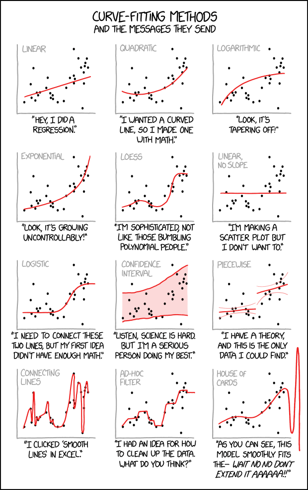
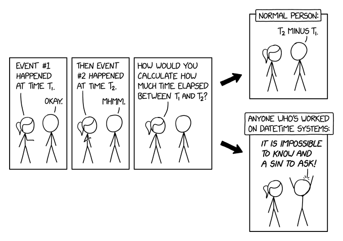
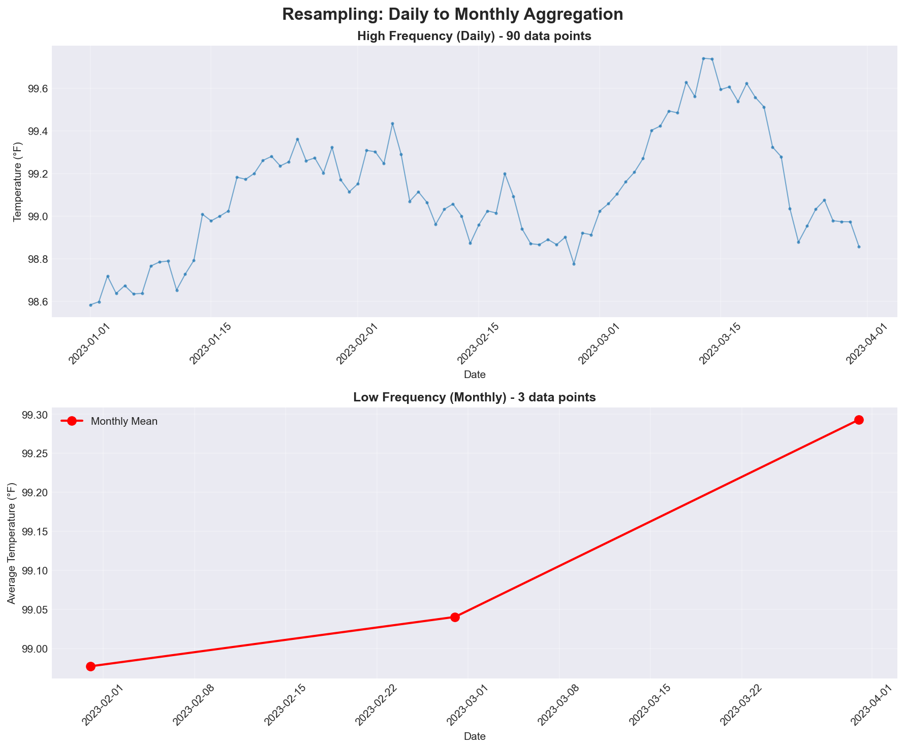
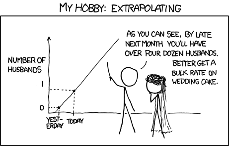
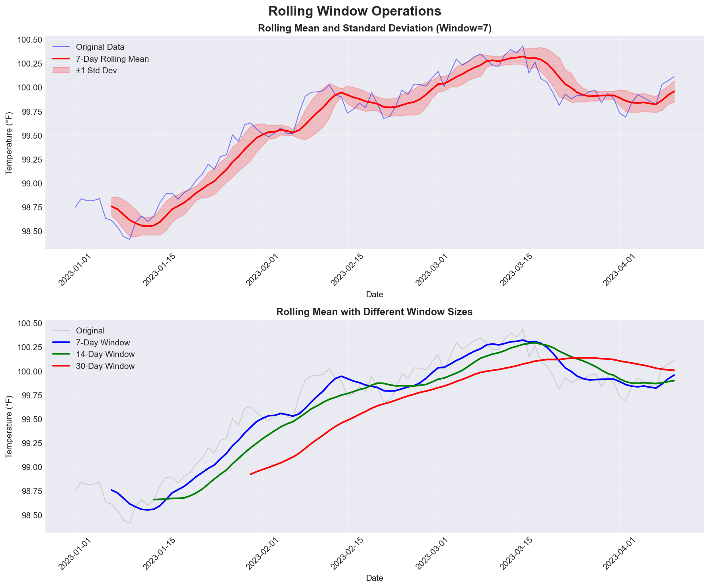
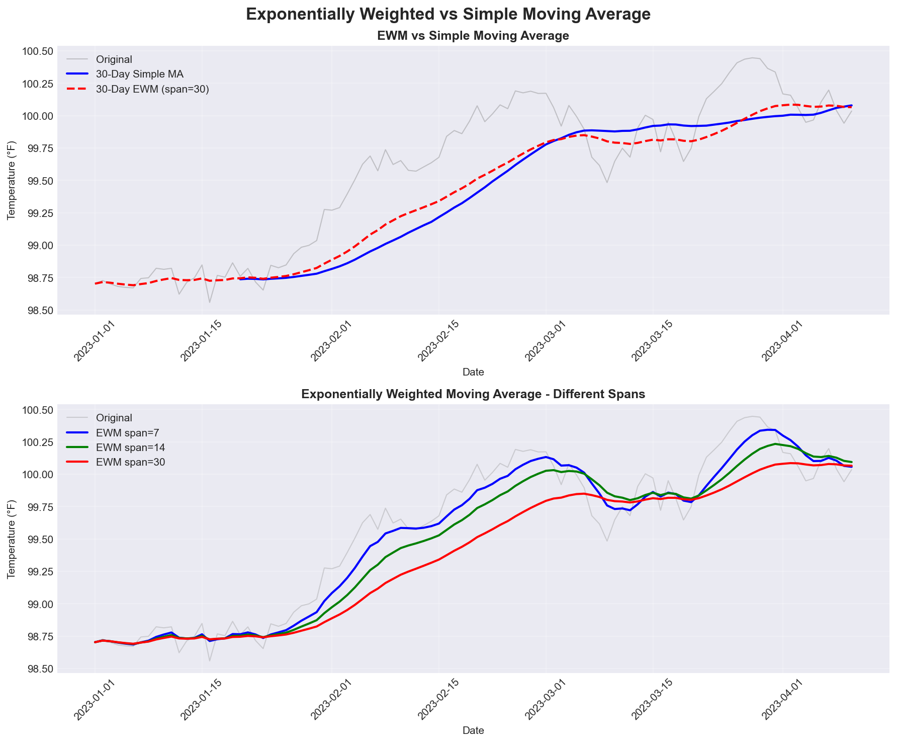
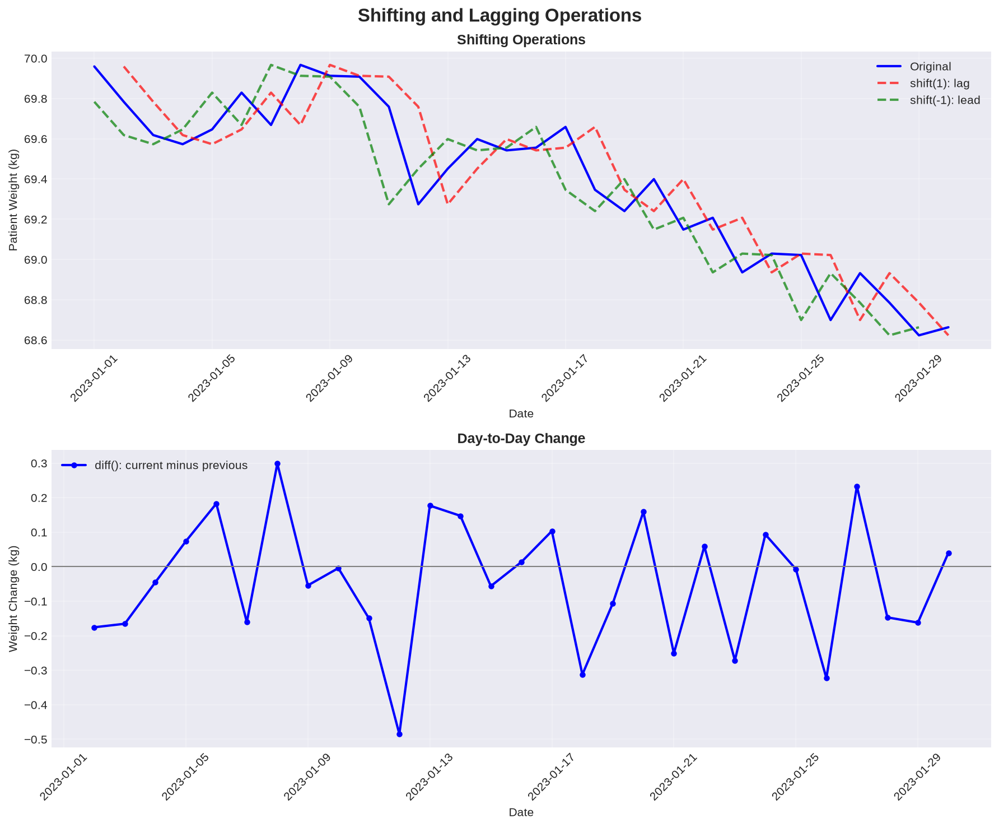
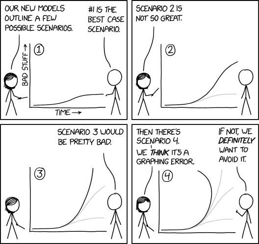
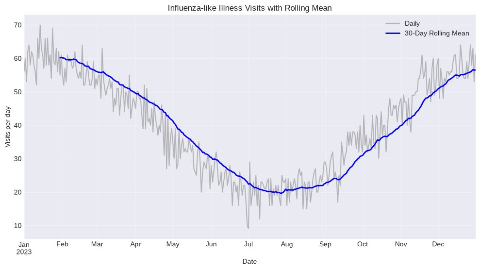
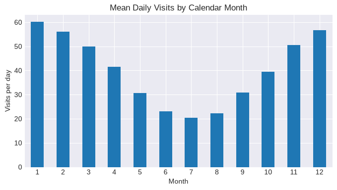

---
notion:
  title_line: "# Time Series Analysis: Temporal Data and Trends"
  role: lecture
  status: mapped
  page_id: "2a8d9fdd-1a1a-80ed-828d-e5feb58d5ed9"
  url: "https://app.notion.com/p/2a8d9fdd1a1a80ed828de5feb58d5ed9"
---

# Time Series Analysis: Temporal Data and Trends

See [BONUS.md](BONUS.md) for the optional extensions.

**Live notebooks in Colab:** [Demo 1](https://colab.research.google.com/github/christopherseaman/datasci_217/blob/main/09/demo/demo1_datetime_fundamentals.ipynb) · [Demo 2](https://colab.research.google.com/github/christopherseaman/datasci_217/blob/main/09/demo/demo2_indexing_resampling.ipynb) · [Demo 3](https://colab.research.google.com/github/christopherseaman/datasci_217/blob/main/09/demo/demo3_visualization_automation.ipynb)



This lecture covers:

- McKinney, _Python for Data Analysis_ (3rd ed.): 9.2 (line and bar plots), 11.1 to 11.4 (dates and times, indexing and selection, date ranges, frequencies, shifting, and time zones), 11.6 (resampling), and 11.7 (moving window functions)

# Understanding Time Series Data

A **time series** is one measurement recorded again and again over time, such as an ICU patient's heart rate every minute or a hospital's daily flu admissions. Its row order carries meaning, so questions like "what was the previous reading?" and "how many admissions this week?" need tools that read dates and times.

## Forms of Time

- **Timestamp**: one instant, such as the blood draw at `2024-03-01 08:15`.
- **Period**: a whole span with a start and end, such as "March 2024" in a monthly report.
- **Elapsed time**: time since a starting point, such as hours since admission.

## Regular and Irregular Series

| Type | Spacing | Example |
| --- | --- | --- |
| **Regular** | A repeating rule (daily, hourly, monthly) | Daily patient temperature readings |
| **Irregular** | Variable intervals, recorded when something happens | Clinic visit dates |

_Some time series are as regular as a Swiss watch; others are as unpredictable as a toddler's nap schedule._

A calendar rule does not always mean equal elapsed time: months have different lengths, and a local day can have 23 or 25 hours when the clocks change.

## Single Series and Panels

A **single series** is one history, such as one patient's weight. A **panel** stacks one history per **entity** (a patient, sensor, or site) in one table, with an entity column such as `patient_id`; most panel calculations run inside each entity's history with Lecture 08's `groupby()`. State the **grain**, what one row represents, before computing anything: "one heart-rate reading for one patient at one time."

```text
patient_id  recorded_at        heart_rate
P1          2024-03-01 08:00           72   ┐ P1's history
P1          2024-03-01 09:00           80   ┘
P2          2024-03-01 09:00           88   ┐ P2's history
P2          2024-03-01 10:00           86   ┘
```

# Date and Time Data Types

A **datetime** is one value holding a date and a clock time, which Python can compare, subtract, and print in any format; text such as `"2023-12-25 14:30"` cannot, so subtracting two text times raises `TypeError`. **Parsing** turns text into datetimes and **formatting** turns datetimes into text, one value at a time with Python's `datetime` module or a whole column with pandas.

## Python datetime Module

Python's built-in `datetime` module handles one value at a time, such as stamping a lab report or scheduling a follow-up visit.

| Operation | Starting value | Result |
| --- | --- | --- |
| Parse a lab time | Text `"2023-12-25 14:30:00"` | A datetime for December 25 at 14:30 |
| Format it for a letter | That datetime | Text `"December 25, 2023 at 02:30 PM"` |
| Add 30 days | That datetime | `2024-01-24 14:30:00` |

### Reference Card: Python `datetime`

- `datetime(year, month, day, hour, minute)`: Create a specific date and time; hour and minute default to 0.
- `datetime.now()`: The current date and time from the computer's clock.
- `datetime.strptime(text, format)`: Parse text into a datetime ("string parse time").
- `dt.strftime(format)`: Format a datetime as text ("string format time").
- `timedelta(days=30)`: A duration (also `hours=`, `weeks=`); add it to a datetime to move it. Subtracting two datetimes returns one, and `.days` reads its whole days.
- Format codes: `%Y` four-digit year, `%m` month 01-12, `%d` day, `%H` 24-hour hour, `%M` minute, `%S` second, `%I` with `%p` 12-hour clock with AM/PM, `%B` full month name.

### Code Snippet: Python `datetime`

```python
from datetime import datetime, timedelta

lab_time = datetime.strptime("2023-12-25 14:30:00", "%Y-%m-%d %H:%M:%S")
print(lab_time.strftime("%B %d, %Y at %I:%M %p"))
print(lab_time + timedelta(days=30))
age = datetime(2024, 3, 1) - datetime(1990, 5, 15)
print(age.days)
```

```text
December 25, 2023 at 02:30 PM
2024-01-24 14:30:00
12344
```

The last two lines are the 30-day follow-up visit and a patient's age in days on March 1, 2024.

_A datetime is the Swiss Army knife of temporal data: precise to the microsecond, and `pandas` wields a million at a time._

## pandas DatetimeIndex

For a whole column, use `pd.to_datetime()`. It converts a text column into **`datetime64`** values, which sort by time rather than character by character:

| Two clinic dates | As text (dtype `str`) | After `pd.to_datetime()` (dtype `datetime64[us]`) |
| --- | --- | --- |
| Sorted | `'3/10/2024'`, then `'3/9/2024'` | `2024-03-09`, then `2024-03-10` |
| Second minus first | `TypeError` | `1 days 00:00:00` |

Each single value is a **`Timestamp`**, and a missing date becomes **`NaT`** ("Not a Time"), the datetime version of `NaN`. Invalid text raises `ValueError` unless `errors='coerce'` marks it as `NaT` instead. Timestamps used as row labels form a **`DatetimeIndex`**, which date selection, resampling, and time windows all read.

### Reference Card: Parsing and Indexing Dates

| Task | Code | Purpose and key arguments | Typical output |
| --- | --- | --- | --- |
| Parse | `pd.to_datetime(s, format='%Y-%m-%d %H:%M')` | Convert text; `format=` states the expected pattern; `errors='coerce'` turns bad values into `NaT` | `datetime64` Series |
| Index | `df.set_index('recorded_at').sort_index()` | Timestamps as row labels, in order | `DataFrame` with `DatetimeIndex` |
| Check | `df.index.is_monotonic_increasing` | Confirm order before slicing | `True` / `False` |
| Parts | `df.index.month`, `.year`, `.hour`, `.day_name()` | Calendar parts from the index | Index of numbers or names |
| Parts | `s.dt.month`, `s.dt.year`, `s.dt.hour` | The same parts from a datetime column | Series |
| Parts | `s.dt.dayofweek` | Day of the week as a number, Monday `0` through Sunday `6`; `.dt.day_name()` spells it out | Series of `int32` |
| Parts | `s.dt.dayofyear` | Day of the year, `1` to 365 (366 in a leap year) | Series of `int32` |
| Round | `s.dt.floor('h')` | Round each time down to the hour (`'D'` for the day) | Series |
| Format | `s.dt.strftime('%Y%m%d%H')` | Write each time as text with `strftime` codes, such as `'2024030108'` for 08:00 on 1 March 2024 | Series of text |
| Duration | `pd.Timedelta(days=2)`, `pd.Timedelta(hours=6)` | pandas' `timedelta`; add it to or subtract it from a timestamp | `Timedelta` |

`pd.to_datetime(format=...)` and `.dt.strftime()` use the same format codes as the `datetime` card above.

### Code Snippet: Text Column to DatetimeIndex

`vitals` contains the three readings below; `recorded_at` starts as text and `heart_rate` is in bpm.

```python
vitals['recorded_at'] = pd.to_datetime(vitals['recorded_at'], format='%Y-%m-%d %H:%M')
vitals = vitals.set_index('recorded_at').sort_index()
print(vitals)
print(vitals.index.hour)
```

```text
                     heart_rate
recorded_at
2024-03-01 08:00:00          72
2024-03-01 20:00:00          76
2024-03-02 08:00:00          88
Index([8, 20, 8], dtype='int32', name='recorded_at')
```

<callout icon="⚠️" color="yellow_bg">
	## Sort by time before you slice, shift, or roll
	Exports often arrive out of order. On unsorted rows, a date-range slice can raise `KeyError`, and `shift()` (taught below) quietly pairs each reading with whatever row sits above it, so run `sort_index()` first, or `sort_values(['patient_id', 'recorded_at'])` for a panel.
</callout>



# Date Ranges and Frequencies

A **frequency** is the repeating rule of a regular series, written as a short text **alias** such as `'D'` (daily) or `'h'` (hourly). pandas uses it to build schedules such as weekly check-in dates, to name a series' spacing, and to define reporting bins.

## Date Range Generation

`pd.date_range(start, end, freq=...)` or `pd.date_range(start, periods=n, freq=...)` builds timestamps at a chosen frequency.

| Schedule starting January 1, 2024 | First three dates |
| --- | --- |
| Monday check-ins (`W-MON`) | January 1, January 8, January 15 |
| Monthly draws (`MS`) | January 1, February 1, March 1 |
| Month-end reports (`ME`) | January 31, February 29, March 31 |

### Reference Card: Frequency Aliases

| Alias | Meaning | Health example | Older alias that now fails |
| --- | --- | --- | --- |
| `'min'`, `'15min'` | Minutes | Bedside monitor | `'T'` |
| `'h'`, `'2h'` | Hours | Hourly vitals | `'H'` |
| `'D'` | Calendar days | Daily symptom diary | |
| `'W'` / `'W-MON'` | Every Sunday / every Monday (weeks end on that day) | Weekly check-in | |
| `'MS'` / `'ME'` | Month start / month end | Monthly lab draw / monthly report | `'M'` |

pandas 3 rejects the older aliases in the last column with `ValueError`.

### Code Snippet: An Hourly Grid

```python
print(pd.date_range('2024-01-01 08:00', periods=3, freq='h'))
```

```text
DatetimeIndex(['2024-01-01 08:00:00', '2024-01-01 09:00:00',
               '2024-01-01 10:00:00'],
              dtype='datetime64[us]', freq='h')
```

Frequency inference and business-day, quarterly, and annual schedules are optional [BONUS.md](BONUS.md#frequency-inference-and-specialized-schedules) references.

_Every Monday? Business days only? `pandas` generates just about any date pattern you can imagine, and some you probably can't._

# Time Series Indexing and Selection

**Time series selection** picks rows by when they were recorded: a whole month, a date range, or the same clock hours on every day, such as overnight ICU readings. A sorted DatetimeIndex makes each one a short expression.

## Basic Time Series Selection

On a DatetimeIndex, Lecture 04's `.loc` also accepts partial dates, called **partial-string indexing**: `'2024-03'` selects every row in March 2024.


### Reference Card: Calendar Selection

- `df.loc['2024-03']`: Every row in March 2024; `'2024'` selects the whole year
- `df.loc['2024-03-01':'2024-03-07']`: A date range, both endpoints included, as with Lecture 04's label slices
- `df.loc['2024-03-01 08:00']`: One timestamp
- `ts['2024-03']`: The same shortcut on a Series; on a DataFrame `df['2024-03']` looks for a _column_ and raises `KeyError`, so use `.loc`

### Code Snippet: Calendar Selection

`study_day` numbers the dates in January–February 2024, starting at 1.

```python
print(study_day.loc['2024-02'].shape)
print(study_day.loc['2024-01-30':'2024-02-02'])
```

```text
(29,)
2024-01-30    30
2024-01-31    31
2024-02-01    32
2024-02-02    33
Freq: D, dtype: int64
```

February 2024 has 29 days (a leap year). Clock-time selection alternatives are in [BONUS.md](BONUS.md#time-of-day-selection-example).

# LIVE DEMO!

# Resampling and Frequency Conversion

**Resampling** changes a time series' frequency, such as turning minute-by-minute heart rates into one summary per hour for a ward report. **Downsampling** combines many readings into fewer, longer bins, and **upsampling** spreads them over more, shorter slots, most of which start empty.



## Basic Resampling

`resample()` works like Lecture 08's `groupby()`: it splits rows into time bins and needs an aggregation such as `.mean()` to combine each bin into one row.

### Reference Card: Resampling Frequencies

- `ts.resample('h').mean()`: Hourly means; each row is labeled with the start of its hour
- `ts.resample('D').mean()`: Daily means, labeled with the date
- `ts.resample('W').mean()`: Weekly means, labeled with the Sunday that ends each week
- `ts.resample('ME').mean()`: Monthly means, labeled with the month's last day
- `df.resample('ME').mean()`: One summary per column; a text column raises `TypeError`, so select numeric columns first or use `.agg()` per column

### Code Snippet: Basic Resampling

`day_num` holds the values 1–30 on January 1–30, 2023.

```python
print(day_num.resample('W').mean())
print(day_num.resample('ME').mean())   # all 30 days fall in January
```

```text
2023-01-01     1.0
2023-01-08     5.0
2023-01-15    12.0
2023-01-22    19.0
2023-01-29    26.0
2023-02-05    30.0
Freq: W-SUN, dtype: float64
2023-01-31    15.5
Freq: ME, dtype: float64
```

_Resampling is like changing the lens on your camera: zoom in for detail, zoom out for the big picture._

## How Resampling Draws Bins

`resample('2h')` chops the timeline into two-hour **bins** and aggregates the readings in each. Two arguments decide where a boundary reading goes:

- `closed`: which edge belongs to the bin. With `closed='left'`, a 10:00 reading goes in the 10:00-12:00 bin, not 08:00-10:00.
- `label`: which edge names the bin in the output.

| Reading time | Heart rate | Bin label with `resample('2h')` |
| --- | --- | --- |
| 08:00 | 70 | 08:00 |
| 08:30 | 72 | 08:00 |
| 09:45 | 75 | 08:00 |
| 10:00 | 80 | 10:00 |
| 11:15 | 78 | 10:00 |

### Reference Card: Bin Edges

- `ts.resample('2h', closed='left', label='left')`: Each bin includes and is named by its start; the default for clock frequencies (`'min'`, `'h'`, `'D'`) and start-anchored ones (`'MS'`).
- `ts.resample('W', closed='right', label='right')`: Each bin includes and is named by its end; the default for end-anchored frequencies (`'W'`, `'ME'`). So the weekly bin labeled Sunday `2023-01-08` above holds January 2 through 8, and the first bin holds only January 1.

### Code Snippet: Bin Boundaries

`readings` contains the five March 1, 2024 readings above, with a DatetimeIndex.

```python
print(readings.resample('2h').agg(['mean', 'count']))
```

```text
                          mean  count
2024-03-01 08:00:00  72.333333      3
2024-03-01 10:00:00  79.000000      2
```


# Resampling Summaries, Grids, and Groups

**Grouped resampling** bins each patient's readings separately, so no bin averages one patient with another, and any aggregation can summarize a bin: a maximum heart rate flags a crisis, and a reading count shows whether the monitor stayed connected. Upsampling to an hourly grid adds empty slots between readings to fill or leave missing.

## Resampling with Different Aggregations

Any aggregation that works after `groupby()` works after `resample()`, including several at once and Lecture 08's named aggregation.

| Weekly bin | Mean heart rate (bpm) | Readings behind the mean |
| --- | ---: | ---: |
| January 1, 2023 | 72.0 | 1 |
| January 8, 2023 | 75.9 | 7 |

The first mean describes one day, the second seven; the count makes that difference visible.

### Reference Card: Resampling Aggregations

- `ts.resample('D').mean()`, `.sum()`, `.max()`, `.min()`, `.std()`: One summary value per bin
- `ts.resample('D').count()`: Non-missing readings per bin; `0` marks a bin with no data
- `ts.resample('D').agg(['mean', 'std', 'min', 'max'])`: Multiple aggregations
- `df.resample('W').agg({'temperature': ['mean', 'std'], 'heart_rate': 'mean'})`: Different summaries for different columns

### Code Snippet: Resampling Aggregations

`daily` has eight rows, January 1–8, 2023, indexed by date, with `temperature` (°F) and `heart_rate` (bpm).

```python
print(daily.resample('W').agg({'temperature': ['mean', 'max'], 'heart_rate': ['mean', 'count']}).round(1))
```

```text
           temperature        heart_rate
                  mean    max       mean count
2023-01-01        98.6   98.6       72.0     1
2023-01-08        99.0  100.2       75.9     7
```

The `count` column shows that the first weekly bin holds only January 1.

## Upsampling: Filling a Finer Grid

`asfreq()` lays a series onto a regular grid without combining observations: values exactly on the grid are kept, and the other slots become `NaN`. Leave the new slots missing, or fill them with Lecture 05's `ffill()` or `interpolate()`.

### Reference Card: Upsampling

- `ts.resample('h').asfreq()`: A finer grid; new slots are `NaN`.
- `ts.resample('h').ffill(limit=2)`: Carry the last reading forward, at most 2 slots.
- `ts.resample('h').interpolate()`: Straight-line fill between known readings.

Filled values are estimates, not measurements; keep a flag or the original column if later steps need to know which values were observed.

### Code Snippet: Upsampling Choices

`pulse` records 70.0 and 76.0 bpm (floats) at 08:00 and 11:00 on March 1, 2024, with a DatetimeIndex.

```python
print(pd.DataFrame({
    'asfreq': pulse.resample('h').asfreq(),
    'ffill': pulse.resample('h').ffill(),
    'interpolate': pulse.resample('h').interpolate(),
}))
```

```text
                     asfreq  ffill  interpolate
2024-03-01 08:00:00    70.0   70.0         70.0
2024-03-01 09:00:00     NaN   70.0         72.0
2024-03-01 10:00:00     NaN   70.0         74.0
2024-03-01 11:00:00    76.0   76.0         76.0
```

## Resampling Each Patient Separately

Resample inside each patient's group (Lecture 08's split-apply-combine); the whole table mixes patients in each bin. For the snippet's five readings:

| Two-hour bin | Whole table (mixes patients) | P1 only | P2 only |
| --- | --- | --- | --- |
| 08:00 | 79.0 | 73.5 | 90.0 |
| 10:00 | 87.0 | 80.0 | 94.0 |

### Reference Card: Grouped Resampling

- `df.set_index('recorded_at').groupby('patient_id')['heart_rate'].resample('2h').agg(['mean', 'count'])`: One row per patient per two-hour bin, with a `(patient_id, recorded_at)` MultiIndex.
- `df.set_index('recorded_at').groupby('patient_id')[['heart_rate', 'source_row']].resample('h').asfreq()`: Each patient's hourly grid from their first reading's hour to their last; empty hours become `NaN`, and readings off the hour are dropped.
- `df['recorded_at'].eq(df['recorded_at'].dt.floor('h')).all()`: `True` only if every reading sits exactly on the hour; check this before `asfreq()`.
- `df['source_row'] = 1` before `asfreq()`: Grid-created rows get `NaN` in `source_row`, so `grid['source_row'].isna()` tells them apart from real readings with a missing value.
- `df.set_index('recorded_at').groupby('patient_id').resample('2h').agg(mean_hr=('heart_rate', 'mean'), n_rows=('source_row', 'count'))`: Named summaries in Lecture 08's `(column, function)` form; `count()` skips missing values, so count `source_row` to include readings with a missing heart rate.
- `.reset_index()`: Turn the MultiIndex back into ordinary `patient_id` and `recorded_at` columns.

### Code Snippet: Two-Hour Summaries per Patient

`vitals` has `patient_id`, datetime `recorded_at`, and `heart_rate` columns: three readings for P1 and two for P2.

```python
per_patient = (
    vitals.set_index('recorded_at').groupby('patient_id')['heart_rate']
    .resample('2h').agg(['mean', 'count']).reset_index()
)
print(per_patient)
```

```text
  patient_id         recorded_at  mean  count
0         P1 2024-03-01 08:00:00  73.5      2
1         P1 2024-03-01 10:00:00  80.0      1
2         P2 2024-03-01 08:00:00  90.0      1
3         P2 2024-03-01 10:00:00  94.0      1
```

### Code Snippet: Hourly Grid per Patient

P1 and P2 have two charted readings each; P1's last has no heart rate. In `vitals`, `recorded_at` is datetime.

```python
print(vitals['recorded_at'].eq(vitals['recorded_at'].dt.floor('h')).all())
vitals['source_row'] = 1
grid = (
    vitals.set_index('recorded_at').groupby('patient_id')[['heart_rate', 'source_row']]
    .resample('h').asfreq().reset_index()
)
grid['grid_created'] = grid['source_row'].isna()
grid['value_missing'] = grid['source_row'].notna() & grid['heart_rate'].isna()
print(grid.drop(columns='source_row'))
```

```text
True
  patient_id         recorded_at  heart_rate  grid_created  value_missing
0         P1 2024-03-01 08:00:00        72.0         False          False
1         P1 2024-03-01 09:00:00         NaN          True          False
2         P1 2024-03-01 10:00:00         NaN          True          False
3         P1 2024-03-01 11:00:00         NaN         False           True
4         P2 2024-03-01 09:00:00        90.0         False          False
5         P2 2024-03-01 10:00:00        94.0         False          False
```

P1's three `NaN` rows look alike; only the flags show that the grid created 09:00 and 10:00, while 11:00 is a real reading with no heart rate.

### Reference Card: Gap Runs

A **gap run** is a stretch of consecutive grid hours with no reading, such as a monitor unplugged for three hours. With `source_observed` `True` for real readings (the opposite of `grid_created`), a running count of readings stays flat through each run, so its hours share a number:

```text
source_observed   True  False  False  True  False  False  False
cumsum()             1      1      1     2      2      2      2
gap run                     1      1            2      2      2   → 2 runs; the longest is 3 hours
```

- `df['source_observed'] = ~df['grid_created']`: `True` for real readings, including a charted row with a missing value.
- `df['run_id'] = df.groupby('patient_id')['source_observed'].cumsum()`: Running count of each patient's real readings (`cumsum()` counts `True` as 1), flat through a gap.
- `df[~df['source_observed']].groupby(['patient_id', 'run_id']).size()`: Each gap run's length in hours; count the runs and take their `max()` per patient.

### Code Snippet: Count Gap Runs per Patient

`hours` is sorted by patient and hour: P1 has the sequence above, and P2 has `True, True, False, True`.

```python
hours['run_id'] = hours.groupby('patient_id')['source_observed'].cumsum()
gaps = hours[~hours['source_observed']]
runs = gaps.groupby(['patient_id', 'run_id']).size().rename('gap_hours').reset_index()
print(runs)
print(runs.groupby('patient_id')['gap_hours'].agg(['count', 'max']))
```

```text
  patient_id  run_id  gap_hours
0         P1       1          2
1         P1       2          3
2         P2       2          1
            count  max
patient_id
P1              2    3
P2              1    1
```

A patient with no gaps has no rows in `runs`; report 0 runs for them rather than leaving them out.



# Rolling Window Operations

A **rolling window** slides a fixed-size frame along a series and computes a statistic at every row, such as the mean of the last seven daily blood pressures, steadier than any single noisy reading. Where `resample('W').mean()` returns one row per week, `rolling(7).mean()` returns one row per original reading.

## Basic Rolling Operations



### Reference Card: Rolling Windows

- `ts.rolling(window=5)`: A **count window**: the current row and the 4 before it, however far apart; like `resample()`, it needs an aggregation after it
- `ts.rolling(window=5).mean()`, `.std()`, `.sum()`, `.min()`, `.max()`: One value per row; the first 4 rows are `NaN` until the window is full
- `ts.rolling('7D').mean()`: A **time window**: the readings in the 7 days ending at each row, which suits irregular data such as clinic visits; needs a sorted DatetimeIndex; the first rows are not `NaN`
- `ts.rolling('2h', closed='left').mean()`: Time window that excludes the current row (a past-only window)
- `ts.rolling(window=7, min_periods=3).mean()`: Start once the window holds 3 readings instead of waiting for all 7
- `ts.rolling(window=7, center=True).mean()`: A **centered window**: 3 rows before, the current row, and 3 after, so each value uses later readings
- `ax.fill_between(ts.index, mean - std, mean + std, alpha=0.2)`: Shade the band in the figure above on a Lecture 07 `Axes`; `alpha` keeps the lines visible through it

A centered window reads future rows: its smooth curve is useful for describing a completed series, but unsuitable as a feature available at the current row. The extended window comparison is in [BONUS.md](BONUS.md#window-alignment-example).

### Code Snippet: Count Window vs Time Window

`glucose` contains the four readings below, in mg/dL, with a sorted DatetimeIndex.

```python
compare = pd.DataFrame({
    'glucose': glucose,
    'last_2_readings': glucose.rolling(2).mean(),
    'last_2_hours': glucose.rolling('2h').mean(),
})
print(compare)
```

```text
                     glucose  last_2_readings  last_2_hours
2024-03-01 07:00:00      110              NaN         110.0
2024-03-01 08:00:00      145            127.5         127.5
2024-03-01 11:00:00      130            137.5         130.0
2024-03-01 11:30:00      180            155.0         155.0
```

At 11:00, the count window averages in the 08:00 reading from three hours earlier; the two-hour window sees only 11:00.

_A rolling window is a security camera that keeps only the last seven days of footage: great for smoothing out noise, no help with anything older._

## Another Smoother: Exponentially Weighted Means

An **exponentially weighted moving average (EWM)** weights recent readings more heavily than older ones: `ts.ewm(span=7).mean()` returns one smoothed value per row. Larger `span` means slower decay. This is an optional alternative to rolling means; [BONUS.md](BONUS.md#exponentially-weighted-means) and Demo 2's independent practice compare them.



# LIVE DEMO!

# Time Zone Handling

A **time zone** is a region's rule for turning an instant into a wall-clock reading, including when daylight saving time moves the clocks. A multi-site trial records each visit on its clinic's wall clock, so 09:00 in New York and 09:00 in Chicago are different moments, and ordering the visits needs every timestamp tied to one instant.

## Basic Time Zone Operations

- A **naive** timestamp is a clock reading with no zone attached, like `2024-03-09 09:00`. pandas cannot tell which instant it means.
- An **aware** timestamp carries a zone or UTC offset, like `2024-03-09 09:00-05:00`, so it pins down one instant.
- **UTC** (Coordinated Universal Time) has no daylight saving time, which makes it the safe zone for storing and ordering data.

| New York visit time | Attached offset | Same instant in UTC |
| --- | --- | --- |
| March 9, 2024 at 09:00 | UTC-5 | March 9 at 14:00 |
| March 11, 2024 at 09:00 | UTC-4 | March 11 at 13:00 |

### Reference Card: Time Zones

- `ts.tz_localize('America/New_York')`: Attach the recording zone to a naive DatetimeIndex; clock times are unchanged.
- `ts.tz_convert('UTC')`: Show aware timestamps in another zone; instants are unchanged. Raises `TypeError` on naive data.
- `df['t'].dt.tz_localize(...)` and `.dt.tz_convert(...)`: The same operations on a datetime column.
- `ts.index.tz` / `s.dt.tz`: The attached zone; `None` means naive.
- `pd.to_datetime(text, utc=True)`: Parse text with an offset, or known to be UTC, straight to aware UTC values.
- `pd.Timestamp('2024-03-09 14:00', tz='UTC')`, `pd.Timestamp.now(tz='UTC')`, `pd.date_range(..., tz='UTC')`: Build aware timestamps and ranges directly; `.tz_convert(...)` works on all of them.
- Zone names: full names from the IANA time-zone database (the standard list of world time zones), such as `'America/New_York'`; `'US/Eastern'` exists only for backward compatibility.

### Code Snippet: Local Clinic Times to UTC

`clinic` holds readings of 120 and 118 indexed by naive New York times: March 9 and March 11, 2024, both at 09:00.

```python
local = clinic.tz_localize('America/New_York')
print(local)
print(local.tz_convert('UTC'))
```

```text
2024-03-09 09:00:00-05:00    120
2024-03-11 09:00:00-04:00    118
dtype: int64
2024-03-09 14:00:00+00:00    120
2024-03-11 13:00:00+00:00    118
dtype: int64
```

Daylight saving time began March 10, so the two 9 AM local visits are 14:00 and 13:00 UTC.

<callout icon="⚠️" color="yellow_bg">
	## Localize once, in the zone where the clock was read
	Localizing these New York readings as `'UTC'` raises no error but moves each instant by the zone's offset: 5 hours on March 9 and 4 on March 11. Localize with the recording zone, convert to UTC for storing and ordering, and convert back to local time only for display.
</callout>


## Clock Changes: Repeated and Skipped Times

Twice a year, some local clock readings do not name exactly one instant. On the spring-forward night (March 10, 2024 in New York), clocks jump from 02:00 to 03:00, so 02:30 is **nonexistent**. On the fall-back night (November 3, 2024), clocks return from 02:00 to 01:00, so 01:30 happens twice, first in daylight time (EDT) and then standard time (EST): it is **ambiguous**.

| UTC instant | New York clock | Offset |
| --- | --- | --- |
| 2024-11-03 05:00 | 01:00 EDT | UTC-4 |
| 2024-11-03 06:00 | 01:00 EST | UTC-5 |
| 2024-11-03 07:00 | 02:00 EST | UTC-5 |

By default, `tz_localize()` raises `ValueError` at these times; the arguments below set them aside as `NaT` instead.

### Reference Card: Daylight-Saving Arguments

- `s.dt.tz_localize('America/New_York', ambiguous='NaT', nonexistent='NaT')`: Repeated (fall-back) and skipped (spring-forward) clock times become `NaT`.
- `aware.isna().sum()`: Count the readings set aside, and report that count before dropping them.
- `pd.date_range(start, end, freq='h', tz='America/New_York', inclusive='left')`: Every elapsed hour from `start` up to, but not including, `end`; a spring-forward day has 23 and a fall-back day has 25.

### Code Snippet: Flag Clock-Change Timestamps

`local` holds naive New York timestamps: March 10, 2024 at 01:00 and 02:30, and November 3 at 01:30 and 03:00.

```python
aware = local.dt.tz_localize('America/New_York', ambiguous='NaT', nonexistent='NaT')
print(aware.dt.tz_convert('UTC'))
print("Set aside:", aware.isna().sum())

spring_day = pd.date_range('2024-03-10', '2024-03-11', freq='h',
                           tz='America/New_York', inclusive='left')
print(len(spring_day))  # hours in that local day
```

```text
0   2024-03-10 06:00:00+00:00
1                         NaT
2                         NaT
3   2024-11-03 08:00:00+00:00
dtype: datetime64[us, UTC]
Set aside: 2
23
```

_Time series analysis is 90% datetime wrangling, 5% actual analysis, and 5% swearing at time zone conversions._

# Entity-Aware Features and Past-Only Windows

A **feature** is an input column for a risk score or model. A **past-only feature** summarizes a patient's history using only that patient's earlier rows, such as the previous heart rate or the mean of the last two hours for an early-warning score. Reading a later row is **future leakage**, information that did not exist yet at the **prediction time** when the score runs, and it makes the score look better than it will be, with no error to warn you.

## Shifting and Lagging

**Shifting** slides values down or up the rows while the dates stay in place, so each row can carry a **lag** (the previous row's value, such as the last visit's blood pressure) or a **lead** (the next row's).



Shifting counts rows, not time: with irregular clinic visits, the "previous" reading can be one week or four weeks back.

### Reference Card: Lagged Features

- `ts.shift(1)`: Lag: each row gets the previous row's value; the first row becomes `NaN`
- `ts.shift(-1)`: Lead: each row gets the next row's value; the last row becomes `NaN`
- `ts.diff()`: Current value minus the previous row's value

### Code Snippet: Lagged Features

`weight` contains the five daily weights below, in kg.

```python
weight['lag_1'] = weight['weight'].shift(1)
weight['lead_1'] = weight['weight'].shift(-1)
weight['diff'] = weight['weight'].diff()
print(weight)
```

```text
            weight  lag_1  lead_1  diff
2023-01-01    70.5    NaN    70.8   NaN
2023-01-02    70.8   70.5    70.2   0.3
2023-01-03    70.2   70.8    71.0  -0.6
2023-01-04    71.0   70.2    70.9   0.8
2023-01-05    70.9   71.0     NaN  -0.1
```

## Grouped Lags and Past-Only Windows

In a panel, a plain `shift(1)` runs down the whole stacked column (`wrong_previous`); grouping by `patient_id` first keeps each shift inside one patient's history (`previous_hr`):

```text
  patient_id         recorded_at  heart_rate  wrong_previous  previous_hr
0         P1 2024-03-01 08:00:00          72             NaN          NaN
1         P1 2024-03-01 09:00:00          80            72.0         72.0
2         P1 2024-03-01 11:30:00          95            80.0         80.0
3         P2 2024-03-01 09:00:00          88            95.0          NaN
4         P2 2024-03-01 10:00:00          86            88.0         88.0
5         P2 2024-03-01 11:00:00          84            86.0         86.0
```

Row 3 is the leak: P2's "previous" heart rate is P1's 95.

### Reference Card: Past-Only Panel Features

| Task | Code | Result |
| --- | --- | --- |
| Order each history | `df.sort_values(['patient_id', 'recorded_at'])` | Patients together, oldest reading first |
| Previous value | `df.groupby('patient_id')['heart_rate'].shift(1)` | Same-patient previous reading; `NaN` on each patient's first row |
| Next value as target | `df.groupby('patient_id')['heart_rate'].shift(-1)` | Same-patient next reading; never use this later value as a current feature |
| Change | `df.groupby('patient_id')['heart_rate'].diff()` | Current minus previous, same patient |
| Mean of previous n readings | `df.groupby('patient_id')['heart_rate'].transform(lambda s: s.shift(1).rolling(n, min_periods=1).mean())` | Excludes the current row; aligned to the original rows |
| Mean over previous 2 hours | `df.set_index('recorded_at').groupby('patient_id')['heart_rate'].rolling('2h', closed='left').mean()` | `closed='left'` excludes the current time; `reset_index()`, then `merge(..., validate='one_to_one')` it back |

Leads (`shift(-1)`) and centered windows (`center=True`) read the future. A lead can define a target or describe a finished record; neither is an input available at prediction time.

### Code Snippet: Grouped Lag

`vitals` has the six readings above, with datetime `recorded_at` values.

```python
vitals = vitals.sort_values(['patient_id', 'recorded_at'])
vitals['wrong_previous'] = vitals['heart_rate'].shift(1)
vitals['previous_hr'] = vitals.groupby('patient_id')['heart_rate'].shift(1)
print(vitals)  # the table above
```

### Code Snippet: Grouped Past-Only Windows

Keep the three original columns. `transform()` preserves row alignment; the time window returns keys to merge back (Lecture 06).

```python
vitals = vitals[['patient_id', 'recorded_at', 'heart_rate']].copy()
vitals['mean_prev_2'] = vitals.groupby('patient_id')['heart_rate'].transform(
    lambda s: s.shift(1).rolling(2, min_periods=1).mean()
)
prev_2h = (
    vitals.set_index('recorded_at').groupby('patient_id')['heart_rate']
    .rolling('2h', closed='left').mean().rename('mean_prev_2h').reset_index()
)
vitals = vitals.merge(prev_2h, on=['patient_id', 'recorded_at'], validate='one_to_one')
print(vitals)
```

```text
  patient_id         recorded_at  heart_rate  mean_prev_2  mean_prev_2h
0         P1 2024-03-01 08:00:00          72          NaN           NaN
1         P1 2024-03-01 09:00:00          80         72.0          72.0
2         P1 2024-03-01 11:30:00          95         76.0           NaN
3         P2 2024-03-01 09:00:00          88          NaN           NaN
4         P2 2024-03-01 10:00:00          86         88.0          88.0
5         P2 2024-03-01 11:00:00          84         87.0          87.0
```

At P1's 11:30 reading, the previous two readings average 76, but no reading falls in the two hours before, so the elapsed-time mean is `NaN`.



## Availability at Prediction Time

A timestamp says when something happened, not when anyone could know it: a lab is resulted after collection, and a monthly case count is published weeks after the month ends. A feature is **available** only if the latest timestamp it reads is at or before the prediction time.

A **chronological holdout** builds a method on rows before a cutoff and tests it on rows from the cutoff onward, the way it would meet future patients.

### Reference Card: Availability and Chronological Blocks

- `labs['resulted_at'] <= prediction_time`: `True` where the value was known at prediction time.
- `np.where(df['recorded_at'] < cutoff, 'earlier', 'later_holdout')`: Label rows before the cutoff `earlier` (to build a method) and the rest `later_holdout` (to test it); `np.where` is from Lecture 03.

### Code Snippet: Recorded Is Not Available

`labs` has the three tests below, with datetime collection and reporting columns.

```python
prediction_time = pd.Timestamp('2024-03-01 11:00')
labs['available'] = labs['resulted_at'] <= prediction_time
print(labs)
```

```text
         test        collected_at         resulted_at  available
0     lactate 2024-03-01 08:00:00 2024-03-01 08:45:00       True
1  creatinine 2024-03-01 09:30:00 2024-03-01 11:15:00      False
2    troponin 2024-03-01 10:30:00 2024-03-01 10:50:00       True
```

### Code Snippet: Chronological Holdout

```python
cutoff = pd.Timestamp('2024-03-01 11:00')
vitals['block'] = np.where(vitals['recorded_at'] < cutoff, 'earlier', 'later_holdout')
print(vitals[['patient_id', 'recorded_at', 'block']])
```

```text
  patient_id         recorded_at          block
0         P1 2024-03-01 08:00:00        earlier
1         P1 2024-03-01 09:00:00        earlier
2         P1 2024-03-01 11:30:00  later_holdout
3         P2 2024-03-01 09:00:00        earlier
4         P2 2024-03-01 10:00:00        earlier
5         P2 2024-03-01 11:00:00  later_holdout
```

P2's 11:00 reading falls in the holdout, because `<` keeps the cutoff itself out of `earlier`.

# Time Series Visualization

A **time-series plot** draws readings against time on the x-axis, in order, showing trends, seasonal cycles, and gaps that a summary table hides. Draw the raw readings faintly with a smoother such as a rolling mean over them, let the line break where data is missing, and name the time zone when it matters.

## Basic Time Series Plots





### Reference Card: Time Series Plotting

- `ts.plot()`: Line plot with the DatetimeIndex on the x-axis; returns the `Axes` (`ax = ts.plot()`) for further customization
- `ts.plot(figsize=(12, 6), title='Title', marker='o')`: Figure size, title, and a marker at each reading
- `ts.asfreq('D').plot()`: Inserts `NaN` for missing days, so the line breaks at gaps instead of bridging them
- `ts.groupby(ts.index.month).mean().plot(kind='bar', ax=ax)`: Calendar-month averages as bars, to show a seasonal pattern; draw them on a new `fig, ax = plt.subplots()`, because bars on the dated line's Axes raise `AttributeError`. Bars start at zero (Lecture 07), which suits counts; for a reading such as temperature, plot the difference from a baseline such as 98.6 °F
- `ax.axhline(98.6, linestyle='--', label='Normal')`: Horizontal reference line for a clinical threshold

### Code Snippet: Time-Series Plotting

`ts` is a year of daily influenza-like illness visits at a clinic, with a DatetimeIndex. The calendar-month bars need separate Axes.

```python
ax = ts.plot(alpha=0.5, label='Daily', color='gray')
ts.rolling(window=30).mean().plot(ax=ax, linewidth=2, label='30-Day Rolling Mean', color='blue')
ax.set(title='Influenza-like Illness Visits with Rolling Mean', xlabel='Date', ylabel='Visits per day')
ax.legend()
ax.grid(True, alpha=0.3)
plt.show()

fig, ax = plt.subplots(figsize=(8, 4))
monthly_mean = ts.groupby(ts.index.month).mean()
monthly_mean.plot(kind='bar', ax=ax, rot=0, title='Mean Daily Visits by Calendar Month',
                  xlabel='Month', ylabel='Visits per day')
plt.show()
```

Decomposition and component plots are in [BONUS.md](BONUS.md).

# LIVE DEMO!
