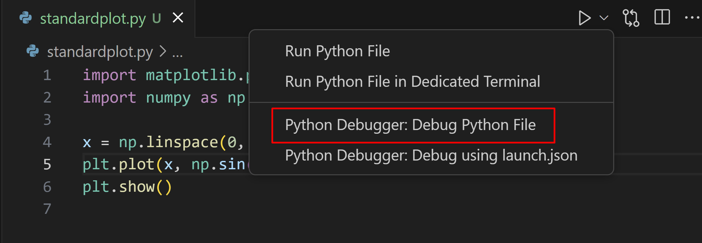

# Lecture 9: Practical Python & Command Line Automation

---

## Overview

In this final lecture, we'll bring together Python and command line tools to solve practical, everyday problems. We'll see how concepts from previous lectures combine to create useful automation solutions.

## REDCap Access

1. [Request REDCap access](https://ucsf.service-now.com/ucsfit?id=ucsf_sc_cat_item&sys_id=42b99b6cdb040c10f3eddff648961988&sysparm_category=40c0305b7b92d000e2dc8180984d4d9f) for upcoming guest lecture
2. Email me with "REDCap: YOUR_REDCAP_USERNAME" in the subject (replace with your REDCap user name)
3. Someone will grant you access to an example REDCap project
4. You will need to request API access to the project

## References

- [*Python for Data Analysis*, Wes McKinney](https://wesmckinney.com/book/) (basis for last few lectures)
- [*Automate the Boring Stuff with Python*, Al Sweigart](https://automatetheboringstuff.com/)
- **Deep Learning Resources**:
  - [TensorFlow Official Tutorials](https://www.tensorflow.org/tutorials)
  - [PyTorch Documentation](https://pytorch.org/docs/stable/tutorials/)
  - [Keras Documentation](https://keras.io/guides/)
  - [*Deep Learning with Python*, François Chollet](https://www.manning.com/books/deep-learning-with-python)
  - [*Hands-On Machine Learning with Scikit-Learn, Keras, and TensorFlow*](https://www.oreilly.com/library/view/hands-on-machine-learning/9781492032632/)
- [The Missing Semester](https://missing.csail.mit.edu/) (command line, git, data wrangling)
- [*The Linux Command Line*, William Shotts](https://linuxcommand.org/tlcl.php)
- [The Shell Scripting Tutorial](https://www.shellscript.sh/)

---

## Revisiting the Command Line

---

### Basic Navigation and File Operations

- Navigation Commands
  - `pwd` - Print Working Directory
  - `ls` - List directory contents (`-a` show hidden files, `-l`)
    - `-l` - Long format
    - `-a` - Show hidden files
  - `cd ~` - Change Directory to home (`~`), parent (`..`)

- File Manipulation Commands
  - `mkdir` / `touch` - Create directory / files
  - `cp -r source destination` - Copy files or directories (`-r`)
  - `cp -r` - Copy directories recursively
  - `mv` - Move/rename files
  - `rm -r` - Remove files or directories (`-r`)

- File Viewing Commands
  - `cat` - Display file contents
  - `head -n N` - Show first N lines of file
  - `tail -n N` - Show last N lines of file
  - `tail -f` - Follow file updates

---

## Text Processing and File Links

- `grep "pattern" file` - Search for patterns
  - `-i` - Case insensitive
  - `-r` - Recursive search
  - `-n` - Show line numbers
- `cut -d',' -f1,3` - Extract columns 1 and 3 using comma delimiter
  - `cut -c5-10` - Extract characters 5-10 from each line
- `tr 'a-z' 'A-Z'` - Translate characters: convert to uppercase
  - `tr -d '0-9'` - Delete digits
  - `tr -s ' '` - Squeeze repeated spaces
- `sed 's/old/new/'` - Stream editor: replace first occurrence
  - `sed 's/old/new/g'` - Replace all occurrences
  - `sed '/pattern/d'` - Delete lines matching pattern

- File Links and Environment Variables
  - `ln -s target link_name` - Create symbolic link
  - Environment Variable Management
    - `echo $VARIABLE` - Display variable value
    - `export VARIABLE=value` - Set environment variable
    - `env` - Display all environment variables
    - `.env` files for project-specific variables
      - Format: `VARIABLE_NAME=value`

---

## Shell Scripts and Permissions

- Shell Script Basics
  - First line: `#!/bin/bash` (shebang)
  - Make executable: `chmod +x script.sh`
  - Run: `./script.sh` or `bash script.sh`
  - Arguments: `$1`, `$2`, etc. (`$0` is script name, `$#` number of arguments)

- File Permissions
  - `chmod +x file` - Change file mode: make executable
    - `chmod u+w file` - Add write permission for user
    - Numeric mode: `chmod 644 file` (owner rw, group/others r)

<!--
- Understand Unix file permission system
- Manage file access and security
- Practice granular permission control
-->

---

### Task Scheduling

- `cron` - Schedule recurring tasks
  - Edit: `crontab -e`
  - Format: `* * * * * command` (minute hour day_of_month month day_of_week)
  - Example: `0 2 * * * backup.sh` (run at 2 AM daily)

<!--
- Automate system and maintenance tasks
- Understand cron job scheduling
- Develop systematic task management skills
-->

## Remote Access

- `ssh user@host` - Secure shell to remote host
- `scp file user@host:/path` - Secure copy file to remote host
  - `scp -r user@host:/path file` - Copy directory (`-r`) from remote

<!--
- Securely connect to remote systems
- Transfer files between local and remote machines
- Practice remote system administration
-->

---

## Session Management

- `tmux` - Modern terminal multiplexer ([`tmux` cheat sheet](https://devhints.io/tmux)), run first time starts new session
  - `tmux new -s name` - Start named session
  - `tmux attach -t name` - Attach to session
  - `tmux ls` - List sessions
  - `Ctrl-b d` - Detach
- `screen` - Terminal multiplexer
  - `screen` - Start new session
  - `screen -S name` - Start named session
  - `screen -r` - Reattach
  - `Ctrl-a d` - Detach

<!--
- Manage multiple terminal sessions
- Create persistent development environments
- Improve productivity with terminal multiplexing
-->

---

## Compression

- `tar` - Archive files
  - `tar -cvf archive.tar files` - Create archive
  - `tar -xvf archive.tar` - Extract archive
  - `tar -czvf archive.tar.gz files` - Create compressed archive
  - `tar -xzvf archive.tar.gz` - Extract compressed archive
- `zip/unzip`
  - `zip archive.zip files` - Create zip archive
  - `zip -r archive.zip directory` - Zip directory
  - `unzip archive.zip` - Extract zip archive

<!--
- Manage file archiving and compression
- Understand different compression formats
- Practice efficient file storage techniques
-->

---

## Pipes and Redirection

- `|` - Pipe output to another command
  - Example: `cat file.txt | grep "pattern"`
- `>` - Redirect output (overwrite)
  - Example: `echo "text" > file.txt`
- `>>` - Redirect output (append)
  - Example: `echo "more text" >> file.txt`
- `2>&1` - Redirect stderr to stdout

<!--
- Chain commands together
- Redirect and manipulate command output
- Develop advanced command-line data processing skills
-->

---

### Getting Acclimated with the Command Line

**Opinionated recommendation**: best way to learn the command line is to use it regularly, so set up a linux server for yourself

---

### Server Options

- Repurpose Old Hardware
  - Old Mac or PC works great
  - No additional cost
- Cloud Options
  - Google Cloud (free tier available)
  - AWS/Azure (pay-as-you-go)
  - GitHub Codespaces (auto-shutdown)
  - **Note:** Remember to turn off pay-as-you-go instances when not in use!

---

### Accessing Your Server

- GUI Options
  - Remote Desktop (RDP)
  - VNC Viewer
- Command Line
  - SSH for direct terminal access
  - VS Code Terminal

---

### Remote Access Setup

- VS Code (Recommended)
  - Install on server
  - Run: `code tunnel service install`
  - Follow authentication prompts
  - Open VS Code or [https://vscode.dev](https://vscode.dev) -> Remote Explorer
- Advanced Options
  - `ssh`: install `sshd` or `openssh`
  - `rdp`: install `xrdp` ([or use the latest script here](https://c-nergy.be/repository.html))

May need to configure firewall settings or use a VPN

- VPN options:
  - Tailscale (moderate)
  - Wireguard (advanced)

---

### A Few Powerful Command Line Tools

- Manipulation
  - `find`
  - `grep` (again)
  - `sed`
- System monitoring
  - `ps`
  - `top` or `htop`
  - `watch`
  - `df` and `du`

---

### Finding Files with `find`

- Search for files in a directory hierarchy
- Powerful options for filtering and actions

```bash
# Find files by name
find . -name "*.py"

# Find files modified in last 24 hours
find . -mtime -1

# Find and execute command on results
find . -name "*.txt" -exec grep "pattern" {} \;
```

---

### Text Processing with `grep`

- Search for patterns in files
- Supports regular expressions
- Recursive search through directories

```bash
# Basic pattern search
grep "error" logfile.txt

# Case-insensitive recursive search
grep -ri "warning" /var/log/

# Show context around matches
grep -C 2 "exception" app.log
```

---

### Text Manipulation with `sed`

- Stream editor for filtering and transforming text
- Common uses: substitution, deletion, insertion

```bash
# Replace text
sed 's/old/new/g' file.txt

# Delete lines matching pattern
sed '/DEBUG/d' logfile.txt

# Add text at beginning of each line
sed 's/^/PREFIX: /' file.txt
```

---

### System Monitoring Commands

### `ps` - Process Status

```bash
# Show all processes
ps aux

# Show process tree
ps axjf
```

### `top` - Dynamic Process Viewer

- Interactive process viewer
- Real-time system statistics
- Press 'q' to quit, 'h' for help

---

### `time` - How long did that take?

- Measure program execution time
- Shows real, user, and system time
- Built into shell or `/usr/bin/time`

```bash
# Basic usage
time sleep 2

# Detailed statistics with /usr/bin/time
/usr/bin/time -v ls -R /

# Time a complex pipeline
time (find . -type f | wc -l)
```

---

### `watch` - Execute Command Periodically

```bash
# Update every 2 seconds (default)
watch df -h

# Update every 5 seconds
watch -n 5 'ps aux | grep python'
```

### `df` and `du` - Disk Usage

```bash
# Show disk space usage
df -h

# Show directory sizes
du -sh *
```

---

## [Shell Demo!!!](shell_demo.sh)

---

## Everyday Python

---

- Quick summary of where we've been
- Debugging
- Error Handling
- Deep Learning Frameworks

<!--
- Recap of course progression
- Importance of code quality and error management
- Practical debugging strategies
- Machine learning framework selection
-->

---

## Basic Python

- Variables and Data Types
  - Integers, floats, strings
  - Dynamically typed
  - Type conversion and checking
  - Control Structures
    - `if`/`elif`/`else` conditionals
    - `for` and `while` loops
    - Break and continue statements
    - Compound conditions with `and`, `or`, `not`

- Data Structures Overview
  - Lists: 1-dimensional arrays
  - Dictionaries: key-value pairs
  - Sets: unique elements
  - Tuples: immutable sequences

- Functions: defined with `def`
  - Take parameters and return values
- Package management
- Virtual environments

---

## File Operations

- File Handling
  - Opening and closing files
  - Reading and writing text files
  - Context managers (`with` statement)
  - Binary file operations
  - CSV and JSON handling

- Path Operations
  - Path manipulation with `os.path`
  - Modern path handling with `pathlib`
  - Directory operations
  - File system navigation

<!--
- Safe and efficient file management
- Cross-platform path handling
- Data serialization techniques
- File system interaction strategies
-->

---

## Numerical Packages

- NumPy
  - Arrays and operations
  - Broadcasting
  - Mathematical functions
  - Array manipulation

- Pandas
  - Series and DataFrames
  - Data loading and saving
  - Data cleaning and transformation
  - Grouping and aggregation
  - Time series functionality

<!--
- Numerical computing foundations
- Efficient array operations
- Data manipulation and analysis
- Time series data handling
-->

---

## Data Visualization

- Matplotlib
- Seaborn statistical plots
- Interactive visualization
- Customizing plots

<!--
- Data representation techniques
- Statistical and interactive plotting
- Visualization best practices
-->

---

## Statistical Methods

- Time Series Analysis
  - DateTime handling
  - Resampling and rolling windows
  - Seasonal decomposition
  - ARIMA models
- statsmodels
  - Linear regression
  - Generalized linear models
  - Statistical tests
  - Model diagnostics
- Machine Learning
  - scikit-learn basics
  - Model selection and evaluation
  - Feature engineering
  - Cross-validation

<!--
- Advanced time series techniques
- Statistical modeling approaches
- Machine learning workflow
- Model validation strategies
-->

---

## Data Science Fundamentals

- Jupyter Notebooks
  - Remote access and configuration
  - Magic commands
  - Cell execution and kernel management
- NumPy
  - Array operations and broadcasting
  - Mathematical functions
  - Array manipulation and indexing
  - Universal functions (ufuncs)
- Pandas
  - Series and DataFrame objects
  - Data loading and manipulation
  - Missing data handling
  - Grouping and aggregation

<!--
- Interactive data science environment
- Computational and data manipulation tools
- Advanced data handling techniques
-->

---

## Running System Commands

The `subprocess` module provides a powerful interface to run external commands:

```python
import subprocess

# Basic command execution
result = subprocess.run(['ls', '-l'], capture_output=True, text=True)
print(result.stdout)

# Shell commands (use shell=True)
files = subprocess.check_output('find . -name "*.py"', shell=True).decode()

# Handling errors (more on this later)
try:
    subprocess.run(['nonexistent_command'], check=True)
except subprocess.CalledProcessError as e:
    print(f"Command failed with exit code {e.returncode}")
```

<!--
- Run system commands from Python
- Capture command output
- Handle command failures
-->

---

## Running System Commands (2/3)

Common subprocess patterns:

```python
# Running command and capturing output
def get_git_branch():
    result = subprocess.run(['git', 'branch', '--show-current'],
                          capture_output=True, text=True)
    return result.stdout.strip()

# Running command with input
def compress_file(filename):
    with open(filename, 'rb') as f:
        proc = subprocess.run(['gzip', '-c'],
                            stdin=f,
                            stdout=subprocess.PIPE)
        return proc.stdout

# Running command with environment variables
env = os.environ.copy()
env['DEBUG'] = '1'
subprocess.run(['my_script.py'], env=env)
```

<!--
- Capture command output
- Provide input to commands
- Modify environment variables
-->

---

## Running System Commands (3/3)

Best practices and common pitfalls:

```python
# DON'T: Unsafe command construction
cmd = f"find {user_input} -type f"  # Command injection risk!
subprocess.run(cmd, shell=True)

# DO: Safe command construction
subprocess.run(['find', user_input, '-type f'])

# DON'T: Ignore errors
subprocess.run(['risky_command'])  # Might fail silently

# DO: Handle errors properly
try:
    subprocess.run(['risky_command'], check=True)
except subprocess.CalledProcessError as e:
    logging.error(f"Command failed: {e}")

# DO: Set timeouts for long-running commands
try:
    subprocess.run(['slow_command'], timeout=60)
except subprocess.TimeoutExpired:
    print("Command timed out")
```

<!--
- Avoid command injection
- Handle errors explicitly
- Set appropriate timeouts
- Use logging for errors
-->

---

## Code Quality Tools: Linters (1/5)

A "linter" is a program that highlights potential errors before you even try running the code. There are linters for pretty much every language you can think of, even Markdown. For Python, the linter that I recommend trying is `ruff`. It is much faster than `pylint` and I find it gets "confused" less often about the code context.

```python
# Installing linters
pip install pylint ruff

# Running pylint
pylint my_script.py

# Running ruff
ruff check .

# Example pylint output:
************* Module my_script
my_script.py:10:0: C0303: Trailing whitespace (trailing-whitespace)
my_script.py:15:0: C0116: Missing function docstring (missing-docstring)
```

<!--
- Linters catch common mistakes
- Enforce coding standards
- Improve code quality
- Prevent bugs before runtime
-->

---

## Understanding Errors (2/5)

```python
# 1. Print Debugging
def calculate_total(items):
    print(f"Debug: items received = {items}")  # Debug print
    total = 0
    for item in items:
        print(f"Debug: processing item = {item}")  # Debug print
        total += item['price']
    return total

# 2. Interactive Debugging with pdb (advanced)
def process_data(data):
    results = []
    for item in data:
        breakpoint()  # Starts interactive debugger
        result = complex_calculation(item)
        results.append(result)
    return results
```

---

```python
# 3. Common Error Patterns
# NameError: Using undefined variables
def process_stats():
    total = count + 1  # count is not defined
    return total

# TypeError: Mixing incompatible types
def calculate_average(numbers):
    total = "0"  # String instead of number
    for num in numbers:
        total += num  # Can't add number to string
    return total / len(numbers)
```

---

```python
# IndexError: Invalid list access
def get_first_elements(list1, list2):
    return [list1[0], list2[0]]  # Error if any list is empty

# KeyError: Missing dictionary key
def get_user_info(user_dict):
    return f"{user_dict['name']} is {user_dict['age']}"  # Error if keys don't exist

# ValueError: Invalid type conversion
def parse_user_data(data_str):
    user_id = int(data_str)  # Error if data_str isn't a valid integer
    return user_id
```

<!--
- Use print statements strategically
- Interactive debugging with pdb
- Common error patterns
- Debug step by step
-->

---

## VS Code Debugger (3/5)

See the docs at [https://code.visualstudio.com/Docs/editor/debugging](https://code.visualstudio.com/Docs/editor/debugging)

```python
# debug_example.py
def process_list(items):
    total = 0
    for i, item in enumerate(items):
        # Set a breakpoint here in VS Code
        value = complex_calculation(item)
        total += value
    return total

def complex_calculation(x):
    # Step through this function
    intermediate = x * 2
    result = intermediate + 5
    return result

# Test data with potential issues
numbers = [1, 2, "3", 4]  # Bug: string in list
result = process_list(numbers)
```

<!--
- Set breakpoints in VS Code
- Step through code execution
- Inspect variables in debug view
- Configure debug settings
-->

---



<!--
- Visual representation of VS Code debugging interface
- Understand debugging workflow
- Recognize key debugging UI elements
-->

---


<!--
- Detailed view of debugging process
- Inspect variables and call stack
- Learn interactive debugging techniques
-->

---

## Try/Except Basics (4/5)

```python
def safe_divide(x, y):
    try:
        result = x / y
        return result
    except ZeroDivisionError:
        print("Error: Division by zero!")
        return None
    except TypeError as e:
        print(f"Error: Invalid types - {e}")
        return None
    finally:
        print("Division operation attempted")

# Example usage:
print(safe_divide(10, 0))       # Handles ZeroDivisionError
print(safe_divide("10", 2))     # Handles TypeError
```

<!--
- Handle specific exceptions
- Use descriptive error messages
- Implement cleanup with finally
- Return meaningful results
-->

---

## Exception Types (5/5)

```python
# Common built-in exceptions and when they occur
def demonstrate_exceptions():
    # IndexError
    list_demo = [1, 2, 3]
    try:
        value = list_demo[5]
    except IndexError as e:
        print(f"Index error: {e}")
    
    # TypeError
    try:
        result = "2" + 2
    except TypeError as e:
        print(f"Type error: {e}")
    
    # ValueError
    try:
        number = int("abc")
    except ValueError as e:
        print(f"Value error: {e}")
    
    # FileNotFoundError
    try:
        with open("nonexistent.txt") as f:
            content = f.read()
    except FileNotFoundError as e:
        print(f"File error: {e}")
```

<!--
- Choose appropriate exceptions
- Handle multiple error types
- Provide context in messages
- Learn from common errors
-->

---

## Deep Learning Frameworks: TensorFlow vs PyTorch

---

### TensorFlow/Keras

- **Origin**: Google
- **Strengths**
  - Production-ready
  - Static computation graphs
  - Enterprise & industry standard
  - Keras as high-level API
- **Best For**
  - Web/mobile app deployment
  - Large-scale industrial applications
  - TensorBoard visualization

---

### PyTorch

- **Origin**: Facebook
- **Strengths**
  - Dynamic computation graphs
  - Pythonic, flexible design
  - Easier debugging
  - Research community favorite
- **Best For**
  - Academic research
  - Rapid prototyping
  - Custom architectures

---

### Model Training Lifecycle

1. **Data Preparation**
   - Collect and clean dataset
   - Normalize input features
   - Split into train/validation sets
   - Create data loaders

2. **Model Architecture**
   - Define neural network layers
   - Choose activation functions
   - Configure model complexity
   - Consider regularization techniques

---

3. **Training Process**
   - Select loss function
   - Choose optimization algorithm
   - Set hyperparameters
   - Implement training loop
   - Monitor training metrics

4. **Evaluation**
   - Validate on test set
   - Compute accuracy/loss
   - Analyze model performance
   - Detect overfitting

---


### Complete Keras/TensorFlow Example

For a complete, commented example of training a neural network on the MNIST dataset, see the accompanying script:
[`keras_mnist_example.py`](keras_mnist_example.py)

This script demonstrates:

- Data loading with torchvision
- Neural network design
- Training and validation process
- Performance metrics calculation

<!--
- Practical implementation of machine learning workflow
- End-to-end neural network training example
- Best practices in model development
- Importance of reproducible research
- Understand MNIST dataset as a standard benchmark
- Learn step-by-step model creation process
-->

---

### Key Considerations

- **Similarities**
  - GPU acceleration
  - High-level neural network APIs
  - Extensive documentation
  - Active communities

- **Differences**
  - Graph construction (static vs dynamic)
  - Debugging approach
  - Research vs production focus

<!--
- Understand framework-agnostic machine learning principles
- Recognize trade-offs in deep learning tools
- Develop framework selection skills
- Appreciate technological diversity
-->

---

### Practical Recommendations

- Start with simple architectures
- Always normalize data
- Use validation sets
- Monitor training metrics
- Experiment with both frameworks

<!--
- Iterative approach to machine learning
- Importance of data preprocessing
- Model validation and performance tracking
- Continuous learning and experimentation
- Flexibility in technology adoption
-->

---

## [Bringing it All Together...](demo.ipynb)
