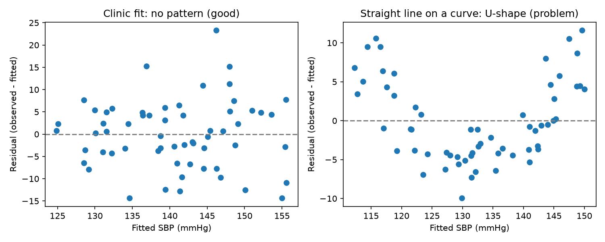
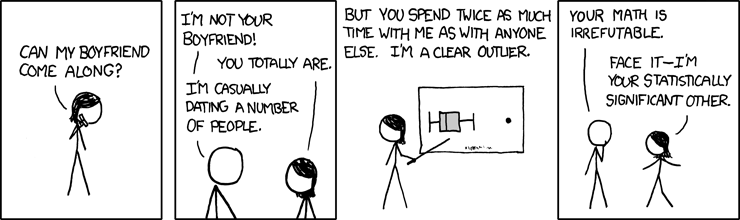
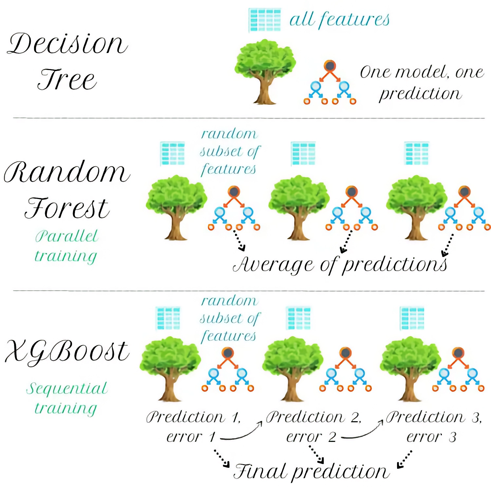
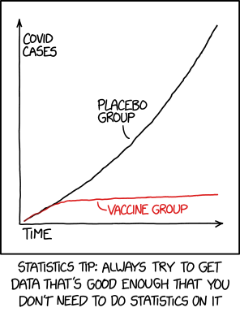

---
notion:
  title_line: "# From Statistics to Deep Learning: The Modern Modeling Landscape"
  role: lecture
  status: mapped
  page_id: "2b0d9fdd-1a1a-80f4-9871-ff3a726e57c3"
  url: "https://app.notion.com/p/2b0d9fdd1a1a80f49871ff3a726e57c3"
---

# From Statistics to Deep Learning: The Modern Modeling Landscape

See [BONUS.md](BONUS.md) for the optional extensions.

**Live notebooks in Colab:** [Demo 1](https://colab.research.google.com/github/christopherseaman/datasci_217/blob/main/10/demo/demo1_statistical_modeling.ipynb) · [Demo 2](https://colab.research.google.com/github/christopherseaman/datasci_217/blob/main/10/demo/demo2_sklearn_prediction.ipynb) · [Demo 3](https://colab.research.google.com/github/christopherseaman/datasci_217/blob/main/10/demo/demo3_trees_boosting_networks.ipynb)

Before running the examples, install the packages in [`demo/requirements.txt`](demo/requirements.txt); `BONUS.md` names a few extras beyond it.

_Fun fact: The word "model" comes from the Latin "modulus" meaning "measure" or "standard." In data science, we're literally creating standards - mathematical representations that measure and predict patterns in our data. But unlike Zoolander, we can turn left AND right!_


# What Is a Model?

A **model** is a simplified mathematical description of how an outcome relates to other variables: a map, not the territory. Lecture 08's `visits.groupby('clinic')['wait_min'].mean()` gave one average wait per clinic; a model does the same job more smoothly, estimating the average outcome for _any_ combination of inputs, including ones the table never contains.

The same model serves two questions, and the question decides how you judge it:

- **Inference**: "Is BMI associated with systolic blood pressure (SBP) among patients of the same age, and how sure are we?" You care about coefficients, uncertainty, and assumptions. Tool: `statsmodels`.
- **Prediction**: "What will this patient's blood pressure be at the next visit?" You care about error on patients never seen before. Tools: `scikit-learn` and friends.

## The Modeling Landscape

Python's modeling libraries line up from inference toward flexible prediction. Moving right usually buys predictive power and costs interpretability:

_Pro tip: Start simple. A well-tuned linear regression often beats a poorly tuned neural network. Remember: "But why male models?" - because sometimes the simplest model is the right model!_


### Reference Card: Which Library for Which Question

| Library | Start here when | Key features | Typical use |
| --- | --- | --- | --- |
| **statsmodels** | You need to quantify a relationship and its uncertainty | Statistical inference, model diagnostics | Understanding relationships, research |
| **scikit-learn** | Tabular data and you need predictions | One fit/predict pattern, preprocessing, many models | General prediction tasks |
| **XGBoost** | Candidate for tabular prediction | Gradient-boosted trees, feature-importance summaries | Benchmarking alongside simpler tabular models |
| **TensorFlow/Keras** | Candidate for images, text, audio, or learned representations | Neural-network layers and training loops | Deep-learning workflows (PyTorch is in BONUS) |


# Statistical Modeling with `statsmodels`

Suppose a clinic asks whether higher BMI goes with higher SBP, even among patients of the same age. **Linear regression** answers that by fitting `sbp = b0 + b1 * age + b2 * bmi` to the clinic's records. Plugging a patient's age and BMI into it gives a **fitted value**: the model's estimated average SBP for patients like them.

- The **intercept** (`b0`) is the fitted SBP when every predictor is 0: an anchor for the line, rarely a real patient.
- A **coefficient** (`b2`) is the difference in fitted SBP for a one-unit difference in BMI, _holding age fixed_.
- An **association** means two variables move together; **causation** means changing one would change the other. A coefficient from observational records describes an association, so "losing weight would lower SBP by b2" needs a randomized trial.
- A **95% confidence interval** is a range computed from the sample: repeat the study many times and about 95% of these intervals would contain the true coefficient.
- A **p-value** asks: if the true coefficient were 0, how surprising would an estimate this far from 0 be? It is not the probability that a hypothesis is true.

## Formulas and Arrays

`statsmodels` offers two interfaces (McKinney Ch. 12.3). In a formula, read `~` as "is modeled by" and `+` as "also include this predictor", not arithmetic (McKinney Ch. 12.2); the block below shows what each interface asks you to supply.

```text
Formula: smf.ols('sbp ~ age + bmi', data=clinic)                         intercept added for you
Array:   sm.OLS(clinic['sbp'], sm.add_constant(clinic[['age', 'bmi']]))  intercept column added by you
```

### Reference Card: `statsmodels` Essentials

| Method / attribute | Purpose & arguments | Typical output |
| :--- | :--- | :--- |
| `smf.ols('sbp ~ age + bmi', data=df)` | Build a formula-based OLS model from DataFrame columns (`import statsmodels.formula.api as smf`). | Unfitted model |
| `sm.OLS(y, sm.add_constant(X))` | Build an array-based OLS model; `sm.add_constant(X)` adds the intercept column (`import statsmodels.api as sm`). | Unfitted model |
| `'sbp ~ ' + ' + '.join(predictors)` | Build a formula string from a list of column names. | `'sbp ~ age + bmi'` |
| `C(column)` in a formula | Treat a column as categorical: one level becomes the reference and each other level gets its own coefficient, compared with the reference (McKinney Ch. 12.2). This is Lecture 05's `drop_first=True`: with an intercept, a 0/1 column for every level would be redundant, because those columns always add up to 1. | Extra coefficient rows |
| `model.fit()` | Estimate the coefficients. | Results object |
| `results.summary()` | Print coefficients, uncertainty, fit statistics, and diagnostics. | Formatted text table |

## Linear Regression by Least Squares

**Ordinary least squares (OLS)** picks the intercept and coefficients that miss the observed points by as little as possible: each miss is a **residual** (observed minus fitted), and OLS minimizes the sum of squared residuals.

```
y = β₀ + β₁x₁ + β₂x₂ + ... + ε
```

Here y is SBP, x₁ is age, x₂ is BMI, and ε (the **error term**) is what the predictors do not explain.

_Think of linear regression as the Derek Zoolander of modeling - simple, reliable, and it can turn left, turn right, or even turn statistically significant._


### Reference Card: OLS Results

| Method / attribute | Purpose & arguments | Typical output |
| :--- | :--- | :--- |
| `results.params` | Fitted intercept and coefficients by term. | Series (array with the array interface) |
| `results.pvalues` | p-value for each coefficient, testing "the true coefficient is 0". | Series |
| `results.rsquared` | Share of the outcome's variation the fitted model explains in these rows (0 to 1). | Float |
| `results.predict(new_rows)` | Fitted values for new rows with the same columns. | Series |
| `results.rsquared_adj`, `results.fvalue` / `results.f_pvalue`, `results.aic` / `results.bic` | Other numbers in the summary header: R² adjusted for the number of predictors; the F-test that all slopes are 0; information criteria for comparing models fit to the same rows (lower is better). | Float |
| `results.nobs` / `results.df_resid` | Rows used, and residual degrees of freedom (rows minus estimated coefficients). | Float |

### Code Snippet: OLS with the Formula API

```python
import numpy as np
import pandas as pd
import statsmodels.formula.api as smf

rng = np.random.default_rng(42)
clinic = pd.DataFrame({'age': rng.integers(30, 70, size=60),
                       'bmi': rng.normal(27, 4, size=60).round(1)})
clinic['sbp'] = (95 + 0.5 * clinic['age'] + 0.8 * clinic['bmi']
                 + rng.normal(0, 8, size=60)).round(1)

results = smf.ols('sbp ~ age + bmi', data=clinic).fit()
print(pd.DataFrame({'coef': results.params.round(2), 'p_value': results.pvalues.round(4)}))
```

```text
            coef  p_value
Intercept  75.21   0.0000
age         0.66   0.0000
bmi         1.19   0.0008
```

`results.summary()` shows the same numbers in one table, under `coef`, `std err`, `P>|t|`, and `[0.025 0.975]`. R-squared here is 0.536, and a p-value printed as 0.0000 is below 0.00005, not exactly 0.

## Uncertainty, Residuals, and New-Patient Intervals

A coefficient is an estimate from one sample, so it comes with uncertainty: the **standard error** measures how much it would vary from sample to sample, and the 95% confidence interval is roughly the estimate ± 2 standard errors.

Plotting each row's residual against its fitted value is a quick assumption check: a shapeless cloud around zero is what we hope for, a curve says the straight-line form is wrong, and a funnel says the spread is not constant.

Predicting for a new patient takes two different intervals: a **mean-response interval**, where the _average_ SBP of all 55-year-olds with BMI 30 probably lies, and a **prediction interval**, where _one_ such patient's SBP probably lies; the second adds person-to-person variation, so it is always wider.



### Reference Card: OLS Uncertainty and Diagnostics

| Method / attribute | Purpose & arguments | Typical output |
| :--- | :--- | :--- |
| `results.bse` | Standard error of each coefficient. | Series indexed by term |
| `results.conf_int(alpha=0.05)` | Lower and upper 95% bounds. | DataFrame with columns `0` and `1` |
| `results.fittedvalues` / `results.resid` | One fitted value and one residual (observed - fitted) per row. | Series |
| `results.get_prediction(new_rows).summary_frame(alpha=0.05)` | Intervals for new rows: `mean`, `mean_ci_lower`, `mean_ci_upper` (mean response) and `obs_ci_lower`, `obs_ci_upper` (individual prediction); `.conf_int(obs=True)` returns only the prediction bounds (Demo 1 uses it). | DataFrame |
| `ax.scatter(results.fittedvalues, results.resid)`, `ax.axhline(0, color='gray', linestyle='--')` | Residuals-versus-fitted plot with Lecture 07's Axes methods; the reference line sits at 0. | Axes |
| `fig.savefig(path)`, `plt.show()`, `plt.close(fig)` | Save, display, then close; an unclosed figure stays in memory. | PNG on disk |

### Code Snippet: Uncertainty and a New-Patient Interval

```python
# results: the clinic fit from the OLS snippet above
print(pd.DataFrame({'std_err': results.bse.round(2),
                    'ci_lower': results.conf_int()[0].round(2),
                    'ci_upper': results.conf_int()[1].round(2)}))

new_patient = pd.DataFrame({'age': [55], 'bmi': [30.0]})
print(results.get_prediction(new_patient).summary_frame(alpha=0.05).round(1))
```

```text
           std_err  ci_lower  ci_upper
Intercept    10.18     54.83     95.59
age           0.09      0.48      0.84
bmi           0.34      0.52      1.86
    mean  mean_se  mean_ci_lower  mean_ci_upper  obs_ci_lower  obs_ci_upper
0  147.2      1.5          144.3          150.2         131.4         163.0
```

Read the `age` row as: holding BMI fixed, each extra year is associated with about 0.66 mmHg higher fitted SBP (95% CI 0.48 to 0.84), an interval that contains the 0.5 the data were simulated with, as the `bmi` interval contains its 0.8. For the new patient the mean-response interval is about 6 mmHg wide, the prediction interval about 32.

### Code Snippet: Residuals Versus Fitted Values

```python
import matplotlib.pyplot as plt

# clinic, results: from the OLS snippet above
diagnostics = pd.DataFrame({'observed': clinic['sbp'], 'fitted': results.fittedvalues,
                            'residual': results.resid})
print(diagnostics.head(3).round(1))

fig, ax = plt.subplots(figsize=(6, 4))
ax.scatter(results.fittedvalues, results.resid)
ax.axhline(0, color='gray', linestyle='--')
ax.set_xlabel('Fitted SBP (mmHg)')
ax.set_ylabel('Residual (observed - fitted)')
fig.savefig('residuals_vs_fitted.png', dpi=150, bbox_inches='tight')
plt.show()
plt.close(fig)
```

```text
   observed  fitted  residual
0     145.3   139.4       5.9
1     144.5   145.1      -0.6
2     139.6   142.0      -2.4
```




# Prediction: Features, Targets, and Honest Splits

Prediction asks what _this_ patient's SBP will be at the next visit, and it brings one golden rule: never judge a model on data it was fitted on. A model can always describe rows it has already seen, so its error on those rows says nothing about the next patient.

- The features (Lecture 09) are the input columns the model uses (age, BMI, today's SBP), together called `X`.
- The **target** is the column to predict (next-visit SBP), called `y`; its **target time** is when that value is measured.
- The **prediction unit** receives one prediction (one visit); prediction time (Lecture 09) is when it is made, and every feature must be known by then.
- **Leakage** is information unavailable at prediction time sneaking into training - a lab result that arrives 24 hours _after_ the visit (Lecture 09's future leakage).

## Feature Availability

Run Lecture 09's availability check on every candidate feature: `candidates['resulted_at'] <= prediction_time`, or `candidates['hours_after_visit'] <= 0` for offsets like the ones below. The prediction here is made at the end of the visit:

| Candidate feature | Becomes known | Hours after the visit | Decision |
| --- | --- | --- | --- |
| `age` | Before the visit | 0 | Keep |
| `sbp_today` | During the visit | 0 | Keep |
| `a1c_result` | When the lab reports the next day | 24 | Exclude (leakage) |

## Cyclic Time Features

Time features pass that audit easily - a timestamp is known as soon as the row exists - but the hour needs shaping first. As a plain number it misleads a model: 23:00 and 00:00 are an hour apart, while 23 and 0 sit at opposite ends of the range. A clock face fixes that: the sine and cosine of `2 * np.pi * hour / 24` place each hour on a circle, so hour 23 lands as close to hour 0 as hour 1 does.

### Reference Card: Cyclic Time Features

| Expression | Purpose & arguments | Typical output |
| --- | --- | --- |
| `df['timestamp'].dt.hour` | Hour of day from a datetime column; `.dt.dayofyear` for the yearly cycle in the last row (both Lecture 09). | Integer Series |
| `np.sin(2 * np.pi * df['hour'] / 24)` | The hour's height on the clock face; `np.pi` is the constant π, and `np.sin()` works column-wise like Lecture 03's `np.sqrt()`. | Float Series, -1 to 1 |
| `np.cos(2 * np.pi * df['hour'] / 24)` | Its side-to-side position. Pair it with the sine: either column alone gives two different hours the same value. | Float Series, -1 to 1 |
| `2 * np.pi * (df['dayofyear'] - 1) / 366` | The same angle for any other cycle. Subtract 1 when the count starts at 1, so the first day sits at angle 0 (`.dt.hour` already starts at 0, `.dt.dayofyear` at 1). Divide by the cycle's length: 7 for day of the week, 366 for day of the year. Keeping 366 every year, leap or not, spaces every day one equal step apart and leaves day 366 one step short of a full turn. | Float Series |

### Code Snippet: Hours on a Clock Face

```python
import numpy as np
import pandas as pd

hours = pd.DataFrame({'hour': [0, 1, 12, 23]})
hours['hour_sin'] = np.sin(2 * np.pi * hours['hour'] / 24).round(2)
hours['hour_cos'] = np.cos(2 * np.pi * hours['hour'] / 24).round(2)
print(hours)
```

```text
   hour  hour_sin  hour_cos
0     0      0.00      1.00
1     1      0.26      0.97
2    12      0.00     -1.00
3    23     -0.26      0.97
```

## Training, Validation, and Test Rows

To estimate performance honestly, give rows three roles:

- **Training set**: fits the model.
- **Validation set**: compares candidate models and settings.
- **Test set**: opened once, after the choice is frozen, to report final performance.

**Overfitting** is a model memorizing its training rows instead of learning patterns that carry over, like memorizing the practice exam's answers and then failing the real exam. It shows up as training error far below validation error:

```
Good fit:                       Overfitting:
Training error:   0.20          Training error:   0.05
Validation error: 0.22          Validation error: 0.35
                                ↑ Big gap = overfitting!
```

The opposite, **underfitting**, is a model too simple to capture the pattern, so both errors stay high.

When rows have no time order, split them at random; the next topic's `train_test_split` does it in one call. When the model will predict the _future_, use Lecture 09's chronological blocks, and split on the **target** time, not the visit date: the Feb 8 visit predicts SBP measured on Feb 15.

| Target weeks (next visit) | Role | Why |
| --- | --- | --- |
| Jan 11 - Feb 8 | Training | Oldest outcomes fit the model |
| Feb 15 - Feb 22 | Validation | Next period chooses between candidates |
| Mar 1 - Mar 15 | Test | Newest outcomes, opened once |

### Reference Card: Splitting on Target Time

- `df['visit_date'] + pd.Timedelta(days=7)`: Target time for a next-week target (Lecture 09).
- `df[df['target_date'] < cutoff]`, `df[(df['target_date'] >= start) & (df['target_date'] < end)]`: Rows whose target falls before a cutoff, or inside one period.
- `len(part)`, `part['target_date'].min()`, `part['target_date'].max()`: Each partition's size and target-time range; check before fitting.

### Code Snippet: A Chronological Split

```python
import pandas as pd

visits = pd.DataFrame({'visit_date': pd.date_range('2026-01-04', periods=10, freq='W'),
                       'sbp_today': [138, 142, 135, 150, 147, 139, 144, 152, 141, 137],
                       'sbp_next_visit': [142, 135, 150, 147, 139, 144, 152, 141, 137, 145]})
visits['target_date'] = visits['visit_date'] + pd.Timedelta(days=7)  # when sbp_next_visit is measured

train = visits[visits['target_date'] < '2026-02-15']
valid = visits[(visits['target_date'] >= '2026-02-15') & (visits['target_date'] < '2026-03-01')]
test = visits[visits['target_date'] >= '2026-03-01']
print(len(train), len(valid), len(test))
print(valid[['visit_date', 'target_date']])
```

```text
5 2 3
  visit_date target_date
5 2026-02-08  2026-02-15
6 2026-02-15  2026-02-22
```

# LIVE DEMO!

# scikit-learn: One Pattern for Every Model

`scikit-learn` is Python's standard library for prediction: every model is an object with the same three steps, so once you can fit one you can fit them all.

*Think of `scikit-learn` as the Swiss Army knife of machine learning - it has a tool for almost everything, it's reliable, and it's been around long enough that everyone knows how to use it.*

It works like a hospital lab analyzer: the lab calibrates it against standards of known concentration (`fit`), then measures new patient samples (`predict`). Objects that learn with `fit` are **estimators**; those that reshape columns instead of predicting, like `StandardScaler`, are **transformers**.

It accepts the pandas DataFrames you have built since Lecture 04: `X` is `df[['age', 'bmi']]`, `y` is `df['sbp']` (McKinney Ch. 12.4).

## The Estimator Pattern

```python
model = SomeModel()                 # 1. create the object and choose its settings
model.fit(X_train, y_train)         # 2. learn from the training rows
predictions = model.predict(X_new)  # 3. predict for rows the model has not seen
```

### Reference Card: The Estimator Workflow

| Function / method | Purpose & arguments | Typical output |
| :--- | :--- | :--- |
| `train_test_split(X, y, test_size=0.2, random_state=42)` | Split rows at random when they have no time order (`from sklearn.model_selection import train_test_split`); `random_state` makes the split repeat. Call it twice to carve out train, validation, and test. | `X_train, X_test, y_train, y_test` |
| `model.fit(X, y)` | Learn parameters from features and targets. | The fitted estimator (`model`) |
| `model.predict(X)` | Generate predictions for new rows. | NumPy array |
| `model.score(X, y)` | Return the estimator's default score (R² for regressors, accuracy for classifiers). | Float |
| `scaler.fit_transform(X_train)` / `scaler.transform(X_valid)` | Learn each feature's mean and scale from training rows, then reuse them unchanged on other rows. | NumPy array (column names dropped) |

## Linear Regression for Prediction

`LinearRegression` fits the same least-squares line as `statsmodels`, minus the inference machinery: no standard errors, no p-values, no diagnostics, but pipelines and dozens of other model families.

**Regularization** adds a penalty that shrinks coefficients and can reduce overfitting. Ridge uses L2, the sum of squared coefficients; Lasso uses L1, the sum of absolute values, which can set some to exactly zero and so selects features. Both help when features are many or correlated, and both treat every coefficient alike, so scale first.

### Reference Card: Linear Estimators

| Class / attribute | Purpose & arguments | Typical output |
| :--- | :--- | :--- |
| `LinearRegression()` | Fit an unregularized linear prediction model. | Estimator |
| `Ridge(alpha=...)` | Fit a linear model with an L2 coefficient penalty; larger `alpha` shrinks more. | Estimator |
| `Lasso(alpha=...)` | Fit a linear model with an L1 penalty that may set coefficients to zero. | Estimator |
| `LogisticRegression(max_iter=1000)` | Linear model for yes/no targets; `predict` gives 0/1 and `predict_proba` gives probabilities. | Estimator |
| `model.coef_` / `model.intercept_` | Read fitted slopes and intercept after `.fit(...)`. | Array / scalar |
| `model.score(X, y)` | Calculate the estimator's default regression score, R². | Float |

### Code Snippet: Linear Regression with a Held-Out Test Set

```python
from sklearn.linear_model import LinearRegression
from sklearn.model_selection import train_test_split
import pandas as pd
import numpy as np

rng = np.random.default_rng(42)
model_df = pd.DataFrame(rng.normal(size=(100, 3)), columns=['x1', 'x2', 'x3'])
model_df['target'] = 2 + 3 * model_df['x1'] + 0.5 * model_df['x2'] + rng.normal(size=100)
X, y = model_df[['x1', 'x2', 'x3']], model_df['target']

X_train, X_test, y_train, y_test = train_test_split(X, y, test_size=0.2, random_state=42)

model = LinearRegression()
model.fit(X_train, y_train)

print(model.coef_.round(2))                            # [ 2.85  0.65 -0.11]
print(f"R² score: {model.score(X_test, y_test):.3f}")  # R² score: 0.825
```

The fitted slopes land near the true 3, 0.5, and 0.

## Baselines and Pipelines

Before celebrating a model, ask whether it beats a guess. A **baseline** is the simplest honest prediction: for a number, the training mean for everyone; for time-ordered rows, **persistence**, the patient's last value again ([worked example](BONUS.md#persistence-baselines-for-time-ordered-rows)). A model that cannot beat the baseline on validation rows has learned nothing useful.

Preprocessing needs the same honesty: a scaler that learns its means from validation or test rows leaks information about rows the model should be seeing for the first time. A **Pipeline** bundles transformers and a model into one estimator:

```text
X_train --fit-->     [StandardScaler -> LinearRegression]   (learns scaling + coefficients)
X_valid --predict--> [same fitted steps]  --> predictions
```

### Reference Card: Baselines and Pipelines

- `DummyRegressor(strategy='mean')`: Regression baseline; predicts the training mean for every row (`from sklearn.dummy import DummyRegressor`).
- `df.groupby('patient_id')['sbp'].shift(1)`: Persistence baseline: each patient's previous reading, `NaN` on their first row (Lecture 09's grouped `shift()`).
- `Pipeline([('scale', StandardScaler()), ('model', LinearRegression())])`: Chains named steps; the last is the model.
- `pipeline.fit(X_train, y_train)` / `pipeline.predict(X_valid)`: Fit every step on training rows only, then reuse that scaling; returns an array.
- `ColumnTransformer([(name, steps, columns), ...])`: Sends different columns to different preprocessing steps.
- `SimpleImputer(strategy='median')`: Fills missing numbers with the training median; `strategy='most_frequent'` fills categories.
- `OneHotEncoder(handle_unknown='ignore', sparse_output=False)`: One 0/1 column per training category; an unseen category becomes all zeros instead of an error.

### Code Snippet: A Baseline and a Linear Pipeline

```python
from sklearn.dummy import DummyRegressor
from sklearn.linear_model import LinearRegression
from sklearn.pipeline import Pipeline
from sklearn.preprocessing import StandardScaler

# clinic: the 60-patient table from the OLS snippet (rows already in random order)
features = ['age', 'bmi']
train, valid = clinic.iloc[:45], clinic.iloc[45:]

baseline = DummyRegressor(strategy='mean')
baseline.fit(train[features], train['sbp'])

pipeline = Pipeline([('scale', StandardScaler()), ('model', LinearRegression())])
pipeline.fit(train[features], train['sbp'])

print(baseline.predict(valid[features])[:3].round(1))  # [140. 140. 140.]
print(pipeline.predict(valid[features])[:3].round(1))  # [153.3 136.1 149.2]
print(valid['sbp'].head(3).values)                     # [144.7 141.2 156.3]
```

### Code Snippet: Variation with Mixed Numeric and Categorical Columns

Real tables mix numbers with categories and have gaps; `ColumnTransformer` routes each group to its own pipeline.

```python
import numpy as np
import pandas as pd
from sklearn.compose import ColumnTransformer
from sklearn.impute import SimpleImputer
from sklearn.linear_model import Ridge
from sklearn.pipeline import Pipeline
from sklearn.preprocessing import OneHotEncoder, StandardScaler

mixed_train = pd.DataFrame({'income': [3.2, 5.1, np.nan, 2.8], 'rooms': [4.0, 6.5, 5.2, 3.8],
                            'region': ['north', 'south', 'north', 'south']})
mixed_target = pd.Series([1.2, 2.4, 1.8, 1.0])
mixed_valid = pd.DataFrame({'income': [4.4, 3.0], 'rooms': [5.9, np.nan],
                            'region': ['central', 'north']})  # 'central' is new

numeric = Pipeline([('impute', SimpleImputer(strategy='median')), ('scale', StandardScaler())])
categorical = Pipeline([('impute', SimpleImputer(strategy='most_frequent')),
                        ('one_hot', OneHotEncoder(handle_unknown='ignore', sparse_output=False))])
preprocess = ColumnTransformer([('numeric', numeric, ['income', 'rooms']),
                                ('categorical', categorical, ['region'])])
model = Pipeline([('preprocess', preprocess), ('regressor', Ridge(alpha=1.0))])
model.fit(mixed_train, mixed_target)
print(model.predict(mixed_valid).round(2))  # [2.06 1.44]
```

For classification, swap the final estimator.

## Measuring Prediction Error

A **metric** turns a column of errors into one number. Choose it before comparing models and compute it the same way for the baseline, every candidate, and the final test.

For a numeric target, each error is actual - predicted. For a yes/no target - **classification**, with 1 = readmitted within 30 days - a **confusion matrix** counts the four outcomes: true positives (TP, flagged and readmitted), false positives (FP, flagged but not readmitted), false negatives (FN, readmitted but not flagged), and true negatives (TN).

### Reference Card: `sklearn.metrics`

| Metric | Question it answers | Function | Typical output |
| --- | --- | --- | --- |
| **MAE** (mean absolute error) | Average size of a miss | `mean_absolute_error(y_true, y_pred)` | Target units (mmHg); 0 is perfect |
| **RMSE** (root mean squared error) | Like MAE, but big misses count extra | `np.sqrt(mean_squared_error(y_true, y_pred))` | Target units; always >= MAE |
| **R²** | How much better than predicting the mean of these rows? | `r2_score(y_true, y_pred)` | 1 is perfect; 0 ties the mean; **negative is worse than the mean** |
| **Accuracy** | What fraction of predictions were right? (TP + TN) / all | `accuracy_score(y_true, y_pred)` | 0 to 1 |
| **Precision** | Of the patients we flagged, how many were readmitted? TP / (TP + FP) | `precision_score(y_true, y_pred, zero_division=0)` | 0 to 1; `zero_division=0` returns 0 without a warning when nothing is flagged |
| **Recall** | Of the readmitted patients, how many did we flag? TP / (TP + FN) | `recall_score(y_true, y_pred)` | 0 to 1 |
| Confusion matrix | How many of each outcome? | `confusion_matrix(y_true, y_pred)` | 2x2 array `[[TN, FP], [FN, TP]]` |
| Per-class summary | Precision, recall, F1 (one score that balances the two), and support (number of true rows) for each class | `classification_report(y_true, y_pred)` | Printed table |

### Code Snippet: Comparing on Validation Rows

```python
import numpy as np
from sklearn.metrics import mean_absolute_error, mean_squared_error, r2_score

# baseline, pipeline, valid, features: from the baseline-and-pipeline snippet
for name, fitted in [('mean_baseline', baseline), ('linear_pipeline', pipeline)]:
    pred = fitted.predict(valid[features])
    mae = mean_absolute_error(valid['sbp'], pred)
    rmse = np.sqrt(mean_squared_error(valid['sbp'], pred))
    r2 = r2_score(valid['sbp'], pred)
    print(f'{name}: MAE={mae:.2f} RMSE={rmse:.2f} R2={r2:.3f}')
```

```text
mean_baseline: MAE=11.73 RMSE=14.13 R2=-0.053
linear_pipeline: MAE=7.20 RMSE=9.65 R2=0.510
```

The baseline's R² is negative because it predicts the _training_ mean (140.0), which misses the validation rows' own mean (143.2).

### Code Snippet: Accuracy Hides Missed Readmissions

When readmissions are rare, a model that always says "no" scores high accuracy while catching nobody. That is why screening cares about recall.

```python
from sklearn.metrics import accuracy_score, precision_score, recall_score

actual    = [1, 0, 0, 1, 0, 0, 0, 1]
flagged   = [1, 0, 0, 0, 0, 1, 0, 0]
always_no = [0, 0, 0, 0, 0, 0, 0, 0]

for name, predicted in [('flagged', flagged), ('always_no', always_no)]:
    accuracy = accuracy_score(actual, predicted)
    precision = precision_score(actual, predicted, zero_division=0)
    recall = recall_score(actual, predicted)
    print(f'{name}: accuracy={accuracy:.3f} precision={precision:.3f} recall={recall:.3f}')
```

```text
flagged: accuracy=0.625 precision=0.500 recall=0.333
always_no: accuracy=0.625 precision=0.000 recall=0.000
```

## Permutation Importance: What Does the Model Rely On?

A metric says how well the pipeline predicts; it does not say which columns it leans on. **Permutation importance** answers that for any fitted model or pipeline: score it on validation rows, shuffle one feature column to break its link to the target, and score again. The bigger the drop, the more the model relied on that feature - like scrambling one lab value across a stack of charts to see how much worse a clinician's diagnoses get.

Shuffle validation rows, never the test set you are saving for the end. Correlated features can share or hide importance, and reliance is not causation. The same call works on the tree models in the next topic, where Demo 3 sets it beside their built-in importances.

### Reference Card: `permutation_importance`

`permutation_importance(estimator, X, y, scoring=..., n_repeats=10, random_state=...)` shuffles each column of `X` `n_repeats` times and records how much the score drops (`from sklearn.inspection import permutation_importance`).

| Argument | Purpose | Effect |
| --- | --- | --- |
| `estimator` | A fitted model or pipeline | Predictions reuse its training-fitted preprocessing |
| `X`, `y` | Validation features and target | Keeps the test set sealed |
| `scoring` | Metric; scorers are "higher is better", so MAE is `'neg_mean_absolute_error'` | Importance = increase in MAE |
| `n_repeats`, `random_state` | Shuffles per feature and seed | Reproducible mean and spread |

Returns an object whose `importances_mean` and `importances_std` hold one value per column.

### Code Snippet: Permutation Importance on Validation Rows

```python
from sklearn.inspection import permutation_importance

# pipeline, valid, features: from the baseline-and-pipeline snippet
result = permutation_importance(
    pipeline, valid[features], valid['sbp'],
    scoring='neg_mean_absolute_error', n_repeats=10, random_state=42,
)
importance = pd.DataFrame({
    'feature': features,
    'mae_increase': result.importances_mean.round(2),
    'std': result.importances_std.round(2),
})
print(importance)
```

```text
  feature  mae_increase   std
0     age          4.32  1.26
1     bmi          1.31  0.38
```

## Freeze, Then Test Once

After validation picks a winner, **freeze** it: features, preprocessing, and settings stop changing. Refit the frozen pipeline on training + validation rows (same settings, more data) or keep the train-fitted version; either way, evaluate on the test rows exactly once and report that number, disappointing or not. Going back to tweak the model would turn the test set into a second validation set.

### Reference Card: Freezing and the Final Test

- `model.get_params(deep=False)`: The settings the model was created with; record them, and fix any `random_state`.
- `final = Pipeline([('scale', StandardScaler()), ('model', LinearRegression())])`: Recreate the frozen pipeline, same steps and settings.
- `train_valid = pd.concat([train, valid])`: Stack training and validation rows (Lecture 06).
- `final.fit(train_valid[features], train_valid['sbp'])`: Optional refit on more data; no setting changes.
- `final.predict(test[features])`: The one test prediction, scored with the same metrics as validation.

Demo 2 ends with that refit and single test evaluation.

_"Did you ever think that maybe there's more to life than being really, really, ridiculously good at machine learning?"_


# LIVE DEMO!

# Trees and Forests

A linear model shifts its prediction by the same amount for every extra year of age, at any BMI. The rest of the lecture keeps that workflow - train, validate, freeze, test once - and swaps in models that can bend.

A **decision tree** predicts by asking yes/no questions about the features ("Is age > 60?" then "Is BMI > 30?") and reporting the average outcome of the training patients in the same final group (a **leaf**). One tree is easy to read but jumpy: change a few training rows and its questions change.

_Random Forest is like having a committee of decision trees vote on the answer. It's democracy in action - except the trees are actually smart and the voting actually works._

## From One Tree to a Forest

A **random forest** grows many trees, each on a random resample of the rows, then averages their predictions; `max_features` decides how many features each question may consider. A group of models combined into one prediction is an **ensemble**, and averaging many jumpy trees gives a steadier answer: wisdom of crowds.



Forests capture **nonlinear** (curved) relationships and **interactions**, where one feature's effect depends on another (age might matter more at high BMI), usually without scaling. Categorical text columns still need encoding.

### Reference Card: Random Forests

| Class / method | Purpose & arguments | Typical output |
| :--- | :--- | :--- |
| `train_test_split(..., stratify=y)` | Split a class label so each part keeps the same share of each class; without it a small split can land lopsided. | Same four parts as before |
| `RandomForestClassifier(n_estimators=..., random_state=...)` | Build a classification forest from randomized trees. | Estimator |
| `RandomForestRegressor(n_estimators=..., random_state=...)` | Build a regression forest from randomized trees. | Estimator |
| `max_features=...` | How many features each question may choose from. Defaults to the square root of the count for `RandomForestClassifier` but to all of them for `RandomForestRegressor`; fewer features make the trees less alike. | Setting |
| `max_depth=...`, `min_samples_split=...` | Limit how deep each tree grows and how many rows a question needs before it splits; smaller trees memorize less. | Settings |
| `n_jobs=-1` | Build trees on all CPU cores at once. | Setting |
| `model.fit(X_train, y_train)` | Fit the trees on training data. | Fitted estimator |
| `model.predict(X_valid)` | Return class labels or numeric predictions. | Array |
| `model.predict_proba(X_valid)` | Return class probabilities (classification only). | 2-D array |
| `model.feature_importances_` | Read impurity-based feature importance scores (how much each feature's questions reduced error while training). Tree models only, and measured on the training fit; `permutation_importance` measures held-out reliance for any model. | Array; not causal evidence |

### Code Snippet: Random-Forest Classification

```python
from sklearn.ensemble import RandomForestClassifier
from sklearn.model_selection import train_test_split
import numpy as np

rng = np.random.default_rng(42)
X = rng.normal(size=(200, 4))
y = (X[:, 0] + X[:, 1] > 0).astype(int)  # only the first two columns matter

X_train, X_test, y_train, y_test = train_test_split(
    X, y, test_size=0.2, random_state=42, stratify=y)

model = RandomForestClassifier(n_estimators=100, random_state=42)
model.fit(X_train, y_train)

predictions = model.predict(X_test)
print(f"Feature importance: {model.feature_importances_.round(3)}")
```

```text
Feature importance: [0.411 0.451 0.072 0.066]
```

The first two columns built the label, and the forest leans on them.

# The Secret Weapon: Gradient Boosting

_Gradient boosting is like the Magnum of machine learning - it's the secret weapon that wins competitions and makes you look like a modeling genius._

## Why Gradient Boosting?

Boosting builds its trees in sequence instead of in parallel, each aimed at what the ensemble so far still gets wrong (the bottom row of the trees figure).

A **hyperparameter** is a setting you choose before fitting - number of trees, depth, learning rate - not a value the model learns. The **learning rate** scales each new tree's correction: at 0.1 each tree fixes a tenth of the remaining error, so small steps add up without overshooting.

_Fun fact: XGBoost stands for "Extreme Gradient Boosting" - and it lives up to the name. It's so good that it's basically cheating (but legal cheating, which is the best kind)._

For squared-error regression each tree fits the ordinary residuals; the "gradient" in the name is the general version of that idea. Step by step, with made-up numbers:

| Step | What Happens | Example |
|------|--------------|---------|
| 1 | The ensemble so far predicts | [5.0, 3.0, 7.0] |
| 2 | Compute the next-step targets | Residuals: [0.5, 0.2, -0.2] |
| 3 | A new tree predicts those targets | Fitted updates: [0.4, 0.3, -0.1] |
| 4 | Add the scaled update to the ensemble | With learning rate 1: [5.4, 3.3, 6.9] |
| 5 | Recompute targets and repeat | For N rounds, or until validation stops improving |

_It's like having a tutor who only helps with your mistakes!_

_"What is this? A model for ants? It needs to be at least... three times more accurate!"_



## `XGBoost` Basics

`XGBoost` is a widely used gradient-boosting library whose models follow the same `fit`/`predict` pattern as `scikit-learn`. **Early stopping** ends training when validation performance stops improving; validation then helps select the model, so keep a separate test set for the one final evaluation.

### Reference Card: XGBoost

| Class / parameter | Purpose & arguments | Typical output |
| :--- | :--- | :--- |
| `xgb.XGBClassifier(...)` | Build a gradient-boosted classifier (`import xgboost as xgb`). | Estimator |
| `xgb.XGBRegressor(...)` | Build a gradient-boosted regressor; accepts `random_state` and `n_jobs` like `scikit-learn` models. | Estimator |
| `model.fit(X_train, y_train, eval_set=[(X_valid, y_valid)], verbose=False)` | Fit trees and monitor validation data after each round. | Fitted estimator |
| `model.predict(X)` / `model.predict_proba(X)` | Return predictions or class probabilities. | Array |
| `early_stopping_rounds=10` (in the constructor) | Stop after validation performance fails to improve for 10 rounds. | Fewer trees |
| `model.best_iteration` / `model.best_score` | After early stopping: the round with the best validation score (counting from 0), and that score. | Integer / float |
| `model.feature_importances_` | Summarize fitted tree usage; do not interpret as causation. | Array |

### Reference Card: XGBoost Hyperparameters

| Hyperparameter | What it controls | Too Low | Too High | Illustrative toy starting points* |
|----------------|------------------|---------|----------|------------|
| `n_estimators` | Number of boosting rounds (trees) | Underfitting | Overfitting | 50-200 |
| `max_depth` | Maximum depth of each tree | Can't learn complex patterns | Overfitting | 3-6 |
| `learning_rate` | Share of each tree's correction that is added | Slow convergence | Unstable training | 0.01-0.3 |
| `subsample` | Fraction of rows each tree sees | Less robust | More variance | 0.8-1.0 |
| `colsample_bytree` | Fraction of features each tree sees | Trees miss useful features | Trees become more alike | 0.8-1.0 |

_Toy starting points, not universal sweet spots; validate them for the data and budget. Finding the right hyperparameters is like tuning a car - too conservative and you're slow, too aggressive and you crash._

### Code Snippet: XGBoost with Early Stopping

```python
import xgboost as xgb
from sklearn.model_selection import train_test_split
import numpy as np

rng = np.random.default_rng(42)
X = rng.normal(size=(200, 5))
y = (X[:, 0] + X[:, 1] > 0).astype(int)

# 60% train / 20% validation / 20% test
X_train, X_holdout, y_train, y_holdout = train_test_split(
    X, y, test_size=0.4, random_state=42, stratify=y)
X_valid, X_test, y_valid, y_test = train_test_split(
    X_holdout, y_holdout, test_size=0.5, random_state=42, stratify=y_holdout)

model = xgb.XGBClassifier(n_estimators=100, max_depth=3, learning_rate=0.1,
                          early_stopping_rounds=10)
model.fit(X_train, y_train, eval_set=[(X_valid, y_valid)], verbose=False)

predictions = model.predict(X_test)  # only after early stopping selected the model
print(f"Feature importance: {model.feature_importances_.round(3)}")
print(f"Best iteration: {model.best_iteration}")
```

```text
Feature importance: [0.498 0.377 0.    0.091 0.035]
Best iteration: 56
```

_"It's all about family. And by family, I mean gradient boosting."_


# Deep Learning: The Modern Frontier

_Deep learning is like the "Derelicte" of modeling - it's cutting-edge, it's flashy, and everyone wants to use it even when they probably shouldn't._

## Why Deep Learning?

A **neural network** is a stack of simple units. Each **neuron** is a weighted sum of its inputs plus an intercept - a tiny linear regression - followed by an **activation function** that bends the result. **ReLU** keeps positive values and turns negatives into 0; **sigmoid** squashes any number into 0-1, readable as a probability. A **layer** is a row of neurons, and "deep" means several, so later layers combine patterns found by earlier ones.

Training repeats one loop: predict, measure the **loss** (how wrong the predictions are; `binary_crossentropy` for yes/no targets), and let the **optimizer** (such as Adam) nudge every weight to reduce it. One pass through the training rows is an **epoch**, and rows are processed in **batches** of, say, 32.

All that flexibility pays off for images, text, and audio, where useful features are hard to write by hand and the network learns its own (**representation learning**). On a clinic table of a few hundred rows, a linear model or boosted trees usually match it for far less effort, and a network overfits easily - so watch the loss curves (Demo 3 plots them).

_"But why deep learning models?" "Seriously? I just told you that a moment ago."_


## `TensorFlow`/`Keras`: The High-Level Approach

This lecture uses TensorFlow's integrated `tf.keras` API, with the course Python 3.13 runtime and TensorFlow 2.21.0 in Demo 3; `BONUS.md` covers PyTorch and JAX.

**Dropout** randomly masks a fraction of units during training; all units are active when the model predicts. Like L2, it is a regularization choice to validate, not a guarantee against overfitting, and Demo 3 validates both against a plain network.

Layers between the input and the output are called **hidden layers**:

```
Input Layer (10 features)
    ↓
Hidden Layer 1 (64 neurons, ReLU)
    ↓
Hidden Layer 2 (32 neurons, ReLU)
    ↓
Output Layer (1 neuron, Sigmoid)
```

### Reference Card: `tf.keras`

| Method / class | Purpose & arguments | Typical output |
| :--- | :--- | :--- |
| `keras.utils.set_random_seed(42)` | Seed Python, NumPy, and TensorFlow at once; pair it with `tf.config.experimental.enable_op_determinism()` when the printed numbers must repeat exactly (Demo 3 does both). | None |
| `keras.Sequential([...])` | Build a linear stack of layers. | Keras model |
| `keras.layers.Input(shape=(n_features,))` | Declare the input width as the first item in `Sequential`. | Input placeholder |
| `keras.layers.Dense(units, activation=...)` | Add a fully connected layer. | Layer |
| `keras.layers.Dropout(0.3)` | During training, randomly zero 30% of the previous layer's outputs. | Layer |
| `Dense(..., kernel_regularizer=keras.regularizers.l2(0.01))` | Add an L2 penalty on that layer's weights (the Ridge idea from the linear-estimator card). | Layer |
| `model.summary()` / `model.count_params()` | Print each layer's output shape and parameter count / return the total number of weights. | Printed table / integer |
| `model.compile(optimizer, loss, metrics)` | Configure optimization, loss, and reported metrics. | Configured model |
| `model.fit(X_train, y_train, epochs=..., batch_size=..., validation_split=...)` | Train for epochs and optionally hold out the last part of the training rows for validation. | `History` object |
| `model.fit(..., validation_data=(X_valid, y_valid))` | Report validation loss and metrics on an explicit validation set after every epoch. | `History` object |
| `history.history` | Per-epoch values such as `loss`, `val_loss`, `accuracy`, `val_accuracy`. | dict of lists |
| `model.predict(X)` | Generate predictions; with a sigmoid output these are probabilities, so `(model.predict(X) > 0.5).astype(int).flatten()` gives 0/1 labels. | NumPy array |
| `model.evaluate(X_test, y_test)` | Calculate loss and configured metrics on held-out data. | Scalar or list |

### Code Snippet: A Small Keras Classifier

```python
import numpy as np
from tensorflow import keras

keras.utils.set_random_seed(42)  # seeds Python, NumPy, and TensorFlow

rng = np.random.default_rng(42)
X_train, X_test = rng.normal(size=(1000, 10)), rng.normal(size=(200, 10))
y_train = (X_train.sum(axis=1) > 0).astype(int)
y_test = (X_test.sum(axis=1) > 0).astype(int)

model = keras.Sequential([
    keras.layers.Input(shape=(10,)),  # same spelling as Demo 3
    keras.layers.Dense(64, activation='relu'),
    keras.layers.Dense(32, activation='relu'),
    keras.layers.Dense(1, activation='sigmoid'),
])
model.compile(optimizer='adam', loss='binary_crossentropy', metrics=['accuracy'])

# validation_split holds out the last 20% of training rows, never the test set
history = model.fit(X_train, y_train, validation_split=0.2,
                    epochs=10, batch_size=32, verbose=0)
print(f"Final validation accuracy: {history.history['val_accuracy'][-1]:.3f}")
loss, accuracy = model.evaluate(X_test, y_test, verbose=0)
print(f'Test accuracy: {accuracy:.3f}')
```

```text
Final validation accuracy: 0.960
Test accuracy: 0.980
```

These numbers come from a CPU run; other hardware may differ.

_"What is this? A learning rate for ants? It needs to be at least... three times smaller!"_

## Comparing Model Families

Each family earns its shortlist place differently:

| Model family | Useful role in a shortlist | Potential strengths | Check before choosing |
|---|---|---|---|
| Linear models | Simple baseline or inference model | Fast, compact, often easy to explain | Functional form and statistical assumptions |
| Random forests | Nonlinear tabular candidate | Interactions, limited preprocessing, robust baseline | Latency, calibration, and explanation needs |
| Gradient-boosted trees | Tabular prediction candidate | Flexible nonlinear fits and strong empirical performance | Tuning, calibration, and validation stability |
| Deep neural networks | Representation-learning candidate | Flexible architectures for images, text, audio, and other complex inputs | Data, compute, deployment, and explanation requirements |

Measure performance in the intended workflow: dataset, implementation, hardware, and budget rule out universal rankings.

_"I'm pretty sure there's a lot more to modeling than being really, really, ridiculously good at deep learning." "But it helps!"_

# LIVE DEMO!
