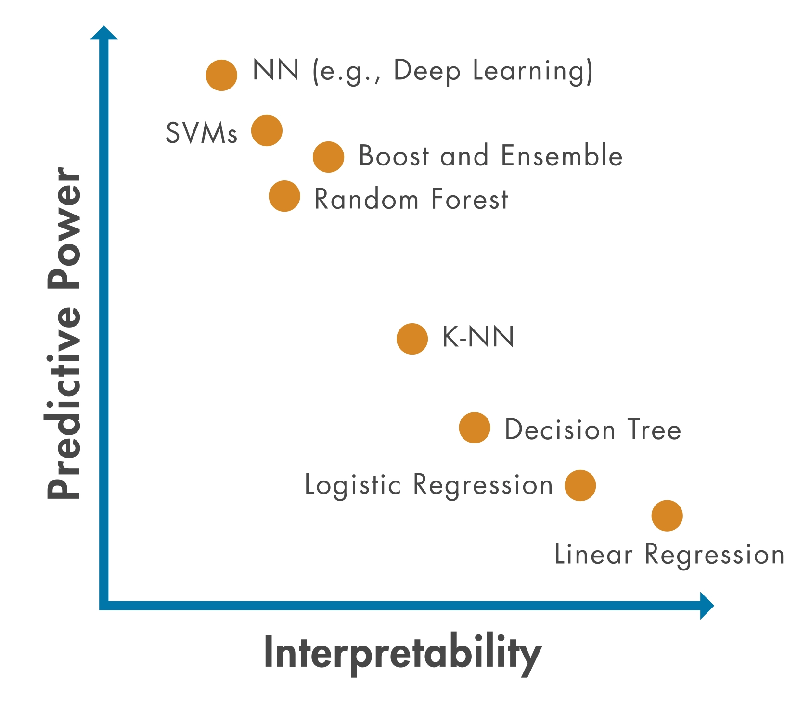
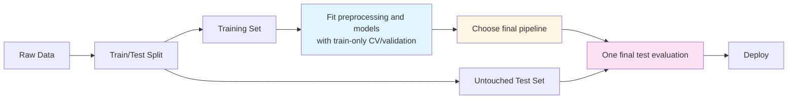
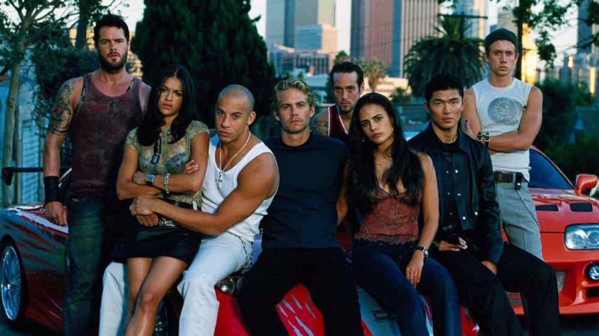
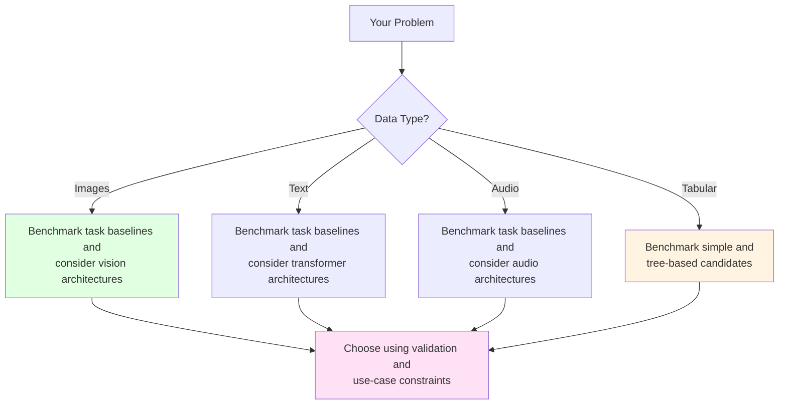

---
notion:
  role: lecture
  status: mapped
  page_id: "2b0d9fdd-1a1a-80f4-9871-ff3a726e57c3"
  url: "https://app.notion.com/p/2b0d9fdd1a1a80f49871ff3a726e57c3"
---

From Statistics to Deep Learning: The Modern Modeling Landscape

See [BONUS.md](BONUS.md) for advanced topics:

- Advanced statistical modeling techniques
- Hyperparameter tuning strategies
- Model interpretability and explainability
- Production deployment considerations
- Advanced deep learning architectures

Before running the examples, install the packages listed in [`demo/requirements.txt`](demo/requirements.txt). Optional material in `BONUS.md` may name additional packages that are not part of that recorded environment.

*Fun fact: The word "model" comes from the Latin "modulus" meaning "measure" or "standard." In data science, we're literally creating standards - mathematical representations that measure and predict patterns in our data. But unlike Zoolander, we can turn left AND right!*


*"I'm sorry, I can't do that. I'm a machine learning model, not a magic wand."*

# Outline

- Statistical modeling with `statsmodels` (inference and interpretation)
- Traditional machine learning with `scikit-learn` (the workhorse)
- Gradient boosting with `XGBoost` (the secret weapon)
- Deep learning with `TensorFlow`/`Keras` and `PyTorch` (the modern frontier)
- When to use what: navigating the modeling ecosystem

# Quick Reference

| Tool | Common starting point | Key features | Typical use |
|------|-------------|--------------|----------|
| **statsmodels** | Need p-values, confidence intervals, hypothesis testing | Statistical inference, model diagnostics | Understanding relationships, research |
| **scikit-learn** | Tabular data, need predictions | Consistent API, many algorithms | General ML tasks, preprocessing |
| **XGBoost** | Candidate for tabular prediction | Gradient boosting, feature-importance summaries | Benchmarking alongside simpler tabular models |
| **TensorFlow/Keras or PyTorch** | Candidate for images, text, audio, or learned representations | Automatic differentiation and neural-network APIs | Deep-learning workflows |

# The Modeling Ecosystem: A Brief Tour

*Reality check: There are more Python modeling libraries than there are ways to overfit a model. This lecture focuses on four families: inferential statistics, traditional machine learning, gradient boosting, and deep learning.*

**The Modeling Spectrum:**

```
STATISTICAL MODELING          TRADITIONAL ML             DEEP LEARNING
┌─────────────────────┐      ┌──────────────────┐      ┌──────────────┐
│   statsmodels       │      │  scikit-learn    │      │ TensorFlow   │
│   (inference)       │      │  (predictions)   │      │ PyTorch      │
│                     │      │                  │      │              │
│ • Linear models     │      │ • Random Forest  │      │ • Neural     │
│ • GLMs              │      │ • SVM            │      │   networks   │
│ • Time series       │      │ • XGBoost        │      │ • CNNs       │
│                     │      │                  │      │ • RNNs       │
└─────────────────────┘      └──────────────────┘      └──────────────┘
     ↑                            ↑                          ↑
 "Inference"                "Prediction"             "Representation"
```

**Model Complexity vs Interpretability Trade-off:**



Flexible models may be harder to explain, and complexity does not guarantee better performance. Treat the spectrum as a candidate shortlist, then compare models with training-only validation against the task's measure, explanation needs, and deployment constraints.

*Pro tip: Start simple. A well-tuned linear regression often beats a poorly tuned neural network. Remember: "But why male models?" - because sometimes the simplest model is the right model!*

**Model Selection Decision Tree:**


*"But why models?" "Seriously? I just told you that a moment ago."*


*"We found a statistically significant correlation between the data and our hypothesis. (p < 0.05)"*

# The Foundation: Statistical Modeling

*Think of statistical modeling as the foundation of your modeling house - you can build fancy additions on top, but you need to understand the basics first.*

Statistical modeling focuses on quantifying relationships and making inferences about populations, while machine learning often prioritizes prediction on new data. A fitted association does not by itself explain *why* something happens: causal conclusions require an appropriate study design plus explicit identification assumptions.

### A small vocabulary bridge

An **association** means variables vary together; **causation** claims that an intervention changes an outcome. A coefficient estimates the fitted outcome change associated with a one-unit predictor change, holding included predictors fixed—it is not automatically causal. A **confidence interval** is a range produced by a procedure for estimating a population quantity; a **p-value** measures how surprising data this extreme would be under a specified null model, not the probability that a hypothesis is true. Both express uncertainty under assumptions about design, functional form, errors, and independence.

## Introduction to `statsmodels`

`statsmodels` supports statistical inference, hypothesis tests, diagnostics, and pandas inputs and outputs.

**When to use `statsmodels`:**

- You need p-values, confidence intervals, or hypothesis tests
- You want to estimate and test relationships under stated assumptions (not just predict)
- You're doing traditional statistical analysis (regression, ANOVA, etc.)
- You need model diagnostics and assumption checking

**Reference:**

- `import statsmodels.api as sm` - Array-based API
- `import statsmodels.formula.api as smf` - Formula-based API (R-like syntax)
- `sm.OLS(y, X)` - Ordinary Least Squares regression
- `smf.ols('y ~ x1 + x2', data=df)` - Formula-based OLS
- `model.fit()` - Fit the model
- `results.summary()` - Print model summary
- `results.params` - Model coefficients
- `results.pvalues` - P-values for coefficients

## Linear Regression

Linear regression models an outcome as a linear function of one or more predictors.

*Think of linear regression as the Derek Zoolander of modeling - it's simple, it's reliable, and it can turn left (or right, or any direction really).*

**Linear Regression: The Blue Steel of Modeling**

```
y = β₀ + β₁x₁ + β₂x₂ + ... + ε

Where:
- y = dependent variable (what you're predicting)
- β₀ = intercept (where the line starts)
- β₁, β₂, ... = coefficients (the change in fitted y associated with a one-unit increase in x, holding the other predictors fixed)
- ε = error term (the stuff we can't explain)
```

**Visual Example: Simple Linear Regression**

```
y (target)
  ↑
  |     ●
  |   ●   ●
  | ●       ●
  |●         ●
  |_____________→ x (feature)
  
Best-fit line: y = 2.0 + 1.5x
```

*OLS minimizes the sum of squared vertical residuals (`observed y - fitted y`), not the geometric distance from each point to the line. That's what "least squares" means here.*

*"I can turn left, I can turn right, I can even turn... statistically significant!"*

**Reference:**

- `sm.OLS(y, X)` - Create OLS model (array-based)
- `smf.ols('y ~ x1 + x2', data=df)` - Create OLS model (formula-based)
- `sm.add_constant(X)` - Add intercept column to design matrix
- `results = model.fit()` - Fit the model
- `results.summary()` - Comprehensive model summary
- `results.params` - Coefficient estimates (Series)
- `results.rsquared` - R-squared value
- `results.pvalues` - P-values for coefficients
- `results.conf_int()` - Confidence intervals
- `results.predict(X_new)` - Make predictions

**Example:**

```python
import statsmodels.api as sm
import statsmodels.formula.api as smf
import pandas as pd
import numpy as np

# Create sample data
np.random.seed(42)
x1 = np.random.randn(100)
x2 = np.random.randn(100)
noise = np.random.randn(100)
df = pd.DataFrame({'x1': x1, 'x2': x2})
df['y'] = 2 + 3 * df['x1'] + 0.5 * df['x2'] + noise

# Formula API (R-like, works with DataFrames)
model = smf.ols('y ~ x1 + x2', data=df)
results = model.fit()
print(results.summary())

# Access coefficients
print(results.params)  # Intercept, x1, x2 coefficients
print(results.pvalues)  # Statistical significance
```


## Other Statistical Methods

`statsmodels` provides many other statistical modeling tools beyond linear regression:

**Generalized Linear Models (GLMs):**

- Logistic regression for binary outcomes
- Poisson regression for count data
- Other exponential family distributions
- Use when: You need statistical inference for non-normal data

**Time Series Models:**

- ARIMA models for time series forecasting
- Seasonal decomposition
- Use when: You have temporal dependencies in your data

Choose an inferential model when the question requires interpretable parameters, uncertainty, or hypothesis tests and its design and model assumptions are defensible. Inference quantifies associations under assumptions; prediction estimates performance on new data. Neither alone establishes causation.


*"Correlation doesn't imply causation, but it does waggle its eyebrows suggestively and gesture furtively while mouthing 'look over there'."*

# LIVE DEMO

# "Traditional" Machine Learning

*Think of `scikit-learn` as the Swiss Army knife of machine learning - it has a tool for almost everything, it's reliable, and it's been around long enough that everyone knows how to use it.*

This section uses `scikit-learn` for predictive workflows and composable estimators.

## Introduction to `scikit-learn`

`scikit-learn` is Python's standard machine learning library. Its objects share composable conventions, but they do not all expose the same methods: estimators learn with `fit`; predictors additionally provide `predict` (and often `predict_proba`); transformers provide `transform` (usually `fit_transform` as a convenience); and pipelines chain transformers with a final estimator.

**The `scikit-learn` API Pattern:**

```python
# 1. Create model
model = SomeModel()

# 2. Fit on training data
model.fit(X_train, y_train)

# 3. Make predictions
predictions = model.predict(X_test)
```

**Train/Test Split Visualization:**

```
Original Dataset (1000 samples)
├── Training Set (800 samples, 80%)
│   └── Used to train the model
└── Test Set (200 samples, 20%)
    └── Used once for final performance evaluation
        (Not used for fitting, tuning, or model selection!)
```

*The golden rule: Never evaluate on data the model has seen during training. That's like giving a student the answers before the test and then being surprised they got 100%.*

Keep the test set untouched until preprocessing and model choices are final; tune with training-only cross-validation or a separate validation set. For temporal prediction, use only information available at prediction time and split chronologically (or with time-series cross-validation) to prevent leakage.

`scikit-learn` combines preprocessing tools, pandas-compatible inputs, and a broad estimator ecosystem. Some transformations return NumPy arrays, so preserve column names explicitly when needed.

**Reference:**

- `from sklearn.model_selection import train_test_split` - Split data
- `from sklearn.preprocessing import StandardScaler` - Scale features
- `from sklearn.linear_model import LinearRegression` - Linear regression
- `from sklearn.ensemble import RandomForestClassifier` - Random forest
- `model.fit(X, y)` - Train model
- `model.predict(X)` - Make predictions
- `model.score(X, y)` - Calculate accuracy/R²

## Linear Regression

In `scikit-learn`, linear regression participates in a predictive workflow rather than supplying the inferential output provided by `statsmodels`.

**`statsmodels` vs `scikit-learn` Linear Regression:**

| Feature | `statsmodels` | `scikit-learn` |
|---------|---------------|----------------|
| Purpose | Statistical inference | Prediction |
| P-values | ✅ Yes | ❌ No |
| Confidence intervals | ✅ Yes | ❌ No |
| Model diagnostics | ✅ Comprehensive | ❌ Basic |
| Speed | Slower | Faster |
| Use when | Need to understand relationships | Need predictions |

**Reference:**

- `from sklearn.linear_model import LinearRegression` - Basic linear regression
- `from sklearn.linear_model import Ridge` - Ridge regression (L2 regularization)
- `from sklearn.linear_model import Lasso` - Lasso regression (L1 regularization)
- `model = LinearRegression()` - Create model
- `model.fit(X_train, y_train)` - Train model
- `model.predict(X_test)` - Make predictions
- `model.coef_` - Model coefficients
- `model.intercept_` - Model intercept
- `model.score(X, y)` - R² score

**Regularization:** Ridge and Lasso add penalty terms to prevent overfitting. Ridge (L2) shrinks coefficients, Lasso (L1) can zero out coefficients (feature selection).

**Regularization Comparison:**

| Method | Penalty Type | Effect on Coefficients | Use When |
|--------|--------------|------------------------|----------|
| Linear Regression | None | No shrinkage | Simple problems, no overfitting |
| Ridge (L2) | Sum of squares | Shrinks all coefficients | Many features, multicollinearity |
| Lasso (L1) | Sum of absolute values | Can zero out coefficients | Feature selection needed |

**Example:**

```python
from sklearn.linear_model import LinearRegression
from sklearn.model_selection import train_test_split
import pandas as pd
import numpy as np

# Create a pandas table, then select feature and target columns explicitly
rng = np.random.default_rng(42)
model_df = pd.DataFrame(
    rng.normal(size=(100, 3)),
    columns=['x1', 'x2', 'x3']
)
model_df['target'] = (
    2 + 3 * model_df['x1'] + 0.5 * model_df['x2'] + rng.normal(size=100)
)
feature_columns = ['x1', 'x2', 'x3']
X = model_df.loc[:, feature_columns]
y = model_df['target']

# Split data
X_train, X_test, y_train, y_test = train_test_split(
    X, y, test_size=0.2, random_state=42
)

# Fit model
model = LinearRegression()
model.fit(X_train, y_train)

# Predictions and evaluation
predictions = model.predict(X_test)
score = model.score(X_test, y_test)  # R²
print(f"R² score: {score:.3f}")
```

## Random Forest

Random Forest is an ensemble of randomized decision trees.

*Random Forest is like having a committee of decision trees vote on the answer. It's democracy in action - except the trees are actually smart and the voting actually works.*

**How Random Forest Works:**

```
Training Data
    ↓
Create 100 Decision Trees (each sees random subset)
    ↓
Tree 1: Predicts Class A
Tree 2: Predicts Class B
Tree 3: Predicts Class A
...
Tree 100: Predicts Class A
    ↓
Final Prediction: Class A (majority vote)
```

For classification, a forest combines class votes or probabilities; for regression, it averages predictions. It models nonlinear relationships and interactions, usually without feature scaling, while aggregation reduces the instability of one tree. Feature importances are diagnostic, not causal, and missing or categorical inputs still need compatible preprocessing.

**Reference:**

- `from sklearn.ensemble import RandomForestClassifier` - Classification
- `from sklearn.ensemble import RandomForestRegressor` - Regression
- `model = RandomForestClassifier(n_estimators=100)` - Create model
- `model.fit(X_train, y_train)` - Train model
- `model.predict(X_test)` - Class predictions
- `model.predict_proba(X_test)` - Probability predictions
- `model.feature_importances_` - Feature importance scores
- `model.score(X, y)` - Accuracy/R² score

**Example:**

```python
from sklearn.ensemble import RandomForestClassifier
from sklearn.model_selection import train_test_split
import pandas as pd
import numpy as np

# Create sample data
np.random.seed(42)
X = np.random.randn(200, 4)
y = (X[:, 0] + X[:, 1] > 0).astype(int)  # Binary classification

# Split data
X_train, X_test, y_train, y_test = train_test_split(
    X, y, test_size=0.2, random_state=42, stratify=y
)

# Fit model
model = RandomForestClassifier(n_estimators=100, random_state=42)
model.fit(X_train, y_train)

# Predictions and feature importance
predictions = model.predict(X_test)
importance = model.feature_importances_
print(f"Feature importance: {importance}")
```

## Other `scikit-learn` Methods

Benchmark candidates whose assumptions and decision boundaries fit the task against a meaningful baseline:

- Classification: `LogisticRegression` and `SVC`.
- Regression: `Ridge` and `Lasso` when shrinkage may help with many or
  correlated features.
- Unsupervised work: `KMeans` for clustering and `PCA` for dimensionality
  reduction.
- Selection: `cross_val_score` for cross-validation and `GridSearchCV` for
  hyperparameter tuning within the training data.

*Let validation evidence—not a favorite algorithm—decide. Blue steel is a style, not a model-selection rule.*

*"Did you ever think that maybe there's more to life than being really, really, ridiculously good at machine learning?"*


**The scikit-learn Workflow:**



### A leakage-safe mixed-type preprocessing pattern

Fit preprocessing inside each training fold. `Pipeline` keeps transformations attached to the estimator, while `ColumnTransformer` routes numeric and categorical columns separately. Learn imputation, scaling, and category vocabularies from training rows, then reuse them unchanged on validation and test rows. Imputation policy depends on the missingness and task; `handle_unknown="ignore"` prevents a new category from crashing prediction.

```python
from sklearn.compose import ColumnTransformer
from sklearn.impute import SimpleImputer
from sklearn.pipeline import Pipeline
from sklearn.preprocessing import OneHotEncoder, StandardScaler
from sklearn.linear_model import Ridge

numeric = Pipeline([
    ("impute", SimpleImputer(strategy="median")),
    ("scale", StandardScaler()),
])
categorical = Pipeline([
    ("impute", SimpleImputer(strategy="most_frequent")),
    ("one_hot", OneHotEncoder(handle_unknown="ignore")),
])
preprocess = ColumnTransformer([
    ("numeric", numeric, ["income", "rooms"]),
    ("categorical", categorical, ["region"]),
])
model = Pipeline([
    ("preprocess", preprocess),
    ("regressor", Ridge(alpha=1.0)),
])
model.fit(train_rows, train_target)
validation_predictions = model.predict(validation_rows)
```

For classification, replace the final estimator; the fitting boundary remains unchanged.

### Choosing an evaluation measure

Choose a task- and cost-aligned measure before comparing candidates, then carry it from the baseline through training-only validation/CV to one final test report. For regression, MAE stays in the target's units and is less sensitive to large errors; RMSE or MSE penalizes large misses more. For classification, use accuracy only when class and error costs are balanced; precision, recall, F1, a confusion matrix, ROC AUC, or average precision may better expose unequal costs or imbalance. Report complementary measures when one score hides costly failures.

### Permutation importance

Permutation importance scores a fitted model on validation data, shuffles one feature, and measures the deterioration; do not repeatedly inspect the final test set. Because scikit-learn scorers are oriented so higher is better, MAE appears as `neg_mean_absolute_error`, and positive importance means shuffling increased error. Correlated features can split or hide their importances. This measures the fitted model's predictive reliance, not causation or a feature's intrinsic value.

*"I'm not an ambi-turner. I can't turn left. I can't turn right. But I CAN fit, predict, and score!"*

# The Secret Weapon: Gradient Boosting

*Gradient boosting is like the Magnum of machine learning - it's the secret weapon that wins competitions and makes you look like a modeling genius.*

## Why Gradient Boosting?

Gradient boosting is a strong tabular candidate for nonlinear relationships and interactions. Benchmark it when the data, evaluation goal, and operational constraints justify it; performance depends on the dataset and configuration.

*Fun fact: XGBoost stands for "Extreme Gradient Boosting" - and it lives up to the name. It's so good that it's basically cheating (but legal cheating, which is the best kind).*

**Gradient Boosting: The Magnum of Machine Learning**

For squared-error regression, the next tree fits ordinary residuals (actual minus current prediction). More generally, each learner fits pseudo-residuals—the negative gradient of the chosen loss—so the target is not always an ordinary residual.

```
Model 1: Makes predictions (with errors)
Model 2: Predicts the errors of Model 1
Model 3: Predicts the errors of Model 2
...
Final: Combine all models (like a modeling ensemble)
```

**Gradient Boosting Step-by-Step:**

| Step | What Happens | Example |
|------|--------------|---------|
| 1 | Initial model makes predictions | Predicts: [5.0, 3.0, 7.0] |
| 2 | Calculate the next-step targets | For squared-error regression, residuals: [0.5, 0.2, -0.2] |
| 3 | New model predicts those targets | Example fitted updates: [0.4, 0.3, -0.1] |
| 4 | Add error predictions to original | New predictions: [5.4, 3.3, 6.9] |
| 5 | Repeat until errors are minimized | Continue for N rounds |

*Each new model focuses on what the previous model got wrong. It's like having a tutor who only helps with your mistakes!*

*"What is this? A model for ants? It needs to be at least... three times more accurate!"*


*"Our machine learning model has achieved 99.9% accuracy on the training data!" "Great! How does it do on new data?" "Oh, we haven't tested that yet."*

## `XGBoost` Basics

`XGBoost` is a widely used implementation to benchmark against simpler tabular baselines.

**Reference:**

- `import xgboost as xgb` - Import XGBoost
- `model = xgb.XGBClassifier()` - Classification model
- `model = xgb.XGBRegressor()` - Regression model
- `model.fit(X_train, y_train)` - Train model
- `model.predict(X_test)` - Make predictions
- `model.predict_proba(X_test)` - Probability predictions (classification)
- `model.feature_importances_` - Feature importance
- `early_stopping_rounds` - Early stopping to help limit overfitting

**Key Hyperparameters:**

- `n_estimators` - Number of boosting rounds (trees)
- `max_depth` - Maximum tree depth
- `learning_rate` - Step size shrinkage
- `subsample` - Fraction of samples for each tree
- `colsample_bytree` - Fraction of features for each tree

**Hyperparameter Effects:**

| Hyperparameter | Too Low | Too High | Illustrative toy starting points* |
|----------------|---------|----------|------------|
| `n_estimators` | Underfitting | Overfitting | 50-200 |
| `max_depth` | Can't learn complex patterns | Overfitting | 3-6 |
| `learning_rate` | Slow convergence | Unstable training | 0.01-0.3 |
| `subsample` | Less robust | More variance | 0.8-1.0 |

*These are toy starting points, not universal sweet spots; validate them for the data, objective, budget, and regularization.* Finding the right hyperparameters is like tuning a car - too conservative and you're slow, too aggressive and you crash.

**Early stopping** ends training when validation performance stops improving. Because validation participates in model selection, keep a separate test set for one final evaluation.

**Example:**

```python
import xgboost as xgb
from sklearn.model_selection import train_test_split
import pandas as pd
import numpy as np

# Create sample data
np.random.seed(42)
X = np.random.randn(200, 5)
y = (X[:, 0] + X[:, 1] > 0).astype(int)

# Create separate training, validation, and test sets (60% / 20% / 20%)
X_train, X_holdout, y_train, y_holdout = train_test_split(
    X, y, test_size=0.4, random_state=42, stratify=y
)
X_valid, X_test, y_valid, y_test = train_test_split(
    X_holdout, y_holdout, test_size=0.5, random_state=42, stratify=y_holdout
)

# Fit XGBoost model
model = xgb.XGBClassifier(
    n_estimators=100,
    max_depth=3,
    learning_rate=0.1,
    early_stopping_rounds=10
)
model.fit(X_train, y_train,
          eval_set=[(X_valid, y_valid)],
          verbose=False)

# Evaluate only after early stopping has selected the model
predictions = model.predict(X_test)
importance = model.feature_importances_
print(f"Feature importance: {importance}")
```

## The Boosting Ecosystem

Beyond `XGBoost`, there are other powerful gradient boosting libraries:

**`LightGBM`:**

- Designed for efficient training and memory use
- A candidate when scale or training speed is an important constraint

**`CatBoost`:**

- Provides native mechanisms for categorical features
- A candidate when the table contains important categorical variables

*Benchmark them under the same split, measure, and budget. Blue steel, magnum, and le tigre are all amazing, just slightly different—so test them on your data.*

**The Boosting Family Tree:**

```
Gradient Boosting
├── XGBoost (widely used general implementation)
├── LightGBM (efficiency-oriented implementation)
└── CatBoost (native categorical-feature support)
```

*"It's all about family. And by family, I mean gradient boosting."*



# LIVE DEMO

# Deep Learning: The Modern Frontier

*Deep learning is like the "Derelicte" of modeling - it's cutting-edge, it's flashy, and everyone wants to use it even when they probably shouldn't.*

## Why Deep Learning?

Deep learning uses multilayer neural networks for representation learning. Consider it for images, text, audio, complex time series, or other settings with enough data and compute for responsible validation. For tabular data, limited samples or resources, or strong explanation requirements, retain simple and tree-based baselines and choose by validation evidence.

**Overfitting Visualization:**

```
Good Fit:                    Overfitting:
Training Loss: 0.2          Training Loss: 0.05
Test Loss: 0.22             Test Loss: 0.35
                            ↑ Big gap = overfitting!

The model learned patterns    The model memorized training
that generalize well.        data but can't generalize.
```

*Overfitting is like memorizing answers to practice problems but failing the actual test. The model performs great on training data but poorly on new data.*

**Building a candidate shortlist:**



*"But why deep learning models?" "Seriously? I just told you that a moment ago."*


*"Our model is 99% accurate!" "On what?" "On the data we trained it on." "And on new data?" "We're still working on that part."*

## `TensorFlow`/`Keras`: The High-Level Approach

This lecture uses TensorFlow's integrated `tf.keras` API. Framework choice depends on measured performance, target platform, expertise, and maintenance.

**Dropout** randomly masks a fraction of units during training to reduce reliance on particular pathways; all units are active at inference. It is a regularization choice to validate, not a guarantee against overfitting. Demo 3's Dropout/L2 comparison is optional.

**Reference:**

- `import tensorflow as tf` - Import TensorFlow
- `from tensorflow import keras` - Import Keras
- `model = keras.Sequential([...])` - Sequential model (linear stack)
- `model.add(keras.layers.Dense(units, activation))` - Add dense layer
- `model.compile(optimizer, loss, metrics)` - Configure training
- `model.fit(X_train, y_train, epochs, batch_size)` - Train model
- `model.predict(X_test)` - Make predictions
- `model.evaluate(X_test, y_test)` - Evaluate model

*During training, you'll see loss decrease and accuracy (or other metrics) improve with each epoch. Monitor both training and validation metrics to detect overfitting.*

**Neural Network Architecture (Simple Example):**

```
Input Layer (10 features)
    ↓
Hidden Layer 1 (64 neurons, ReLU)
    ↓
Hidden Layer 2 (32 neurons, ReLU)
    ↓
Output Layer (1 neuron, Sigmoid)
```

**What Each Layer Does:**

| Layer | Purpose | Example |
|-------|---------|---------|
| Input | Receives raw features | 10 numeric features |
| Hidden 1 | Learns complex patterns | 64 neurons find non-linear relationships |
| Hidden 2 | Refines patterns | 32 neurons combine learned features |
| Output | Makes final prediction | 1 neuron outputs probability (0-1) |

*"I'm not an ambi-turner. I can't turn left. I can't turn right. But I CAN backpropagate!"*

**Example:**

```python
import tensorflow as tf
from tensorflow import keras
import numpy as np

# Create sample data
np.random.seed(42)
X_train = np.random.randn(1000, 10)
y_train = (X_train.sum(axis=1) > 0).astype(int)
X_test = np.random.randn(200, 10)
y_test = (X_test.sum(axis=1) > 0).astype(int)

# Build model
model = keras.Sequential([
    keras.layers.Dense(64, activation='relu', input_shape=(10,)),
    keras.layers.Dense(32, activation='relu'),
    keras.layers.Dense(1, activation='sigmoid')
])

# Compile model
model.compile(
    optimizer='adam',
    loss='binary_crossentropy',
    metrics=['accuracy']
)

# Train model; validation data comes from the training sample, not the test set
model.fit(
    X_train, y_train,
    validation_split=0.2,
    epochs=10,
    batch_size=32,
    verbose=0
)

# Evaluate
loss, accuracy = model.evaluate(X_test, y_test, verbose=0)
print(f"Accuracy: {accuracy:.3f}")
```

## `PyTorch`: An Open-Source Deep-Learning Framework

`PyTorch` provides an eager, Python-oriented interface used in research and production.

**PyTorch and TensorFlow/Keras:**

- **PyTorch:** Eager execution and a Python-oriented modeling ecosystem
- **TensorFlow/Keras:** High-level Keras APIs within TensorFlow's broader modeling and deployment ecosystem
- **Both:** Used for research and production; neither role belongs exclusively to one framework
- **Choice:** Depends on required libraries, deployment target, team expertise, maintenance, and measured performance

**Reference:**

- `import torch` - Import PyTorch
- `import torch.nn as nn` - Neural network modules
- `model = nn.Sequential([...])` - Sequential model
- `optimizer = torch.optim.Adam(model.parameters())` - Optimizer
- `loss_fn = nn.BCELoss()` - Loss function
- `model.train()` / `model.eval()` - Set training/evaluation mode

*PyTorch stays brief because TensorFlow/Keras owns the worked example—a teaching choice, not a universal ranking.*

## Other Modern Frameworks

Other frameworks serve different computational styles. `JAX` combines NumPy-like arrays with automatic differentiation and JIT compilation; choose it or another specialized tool when its capabilities and dependency cost fit the task.

**The Deep Learning Ecosystem:**

```
Deep Learning Frameworks
├── TensorFlow/Keras (high-level modeling and deployment ecosystem)
├── PyTorch (eager, Python-oriented modeling ecosystem)
└── JAX (array programming with transformations and JIT compilation)
```

*"What is this? A learning rate for ants? It needs to be at least... three times smaller!"*

**Model-family comparison questions:**

| Model family | Useful role in a shortlist | Potential strengths | Check before choosing |
|---|---|---|---|
| Linear models | Simple baseline or inference model | Fast, compact, often easy to explain | Functional form and statistical assumptions |
| Random forests | Nonlinear tabular candidate | Interactions, limited preprocessing, robust baseline | Latency, calibration, and explanation needs |
| Gradient-boosted trees | Tabular prediction candidate | Flexible nonlinear fits and strong empirical performance | Tuning, calibration, and validation stability |
| Deep neural networks | Representation-learning candidate | Flexible architectures for images, text, audio, and other complex inputs | Data, compute, deployment, and explanation requirements |

Measure performance in the intended workflow; dataset, implementation, hardware, and tuning budget prevent universal rankings.

*"I'm pretty sure there's a lot more to modeling than being really, really, ridiculously good at deep learning." "But it helps!"*

# LIVE DEMO
