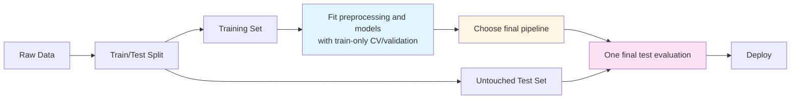
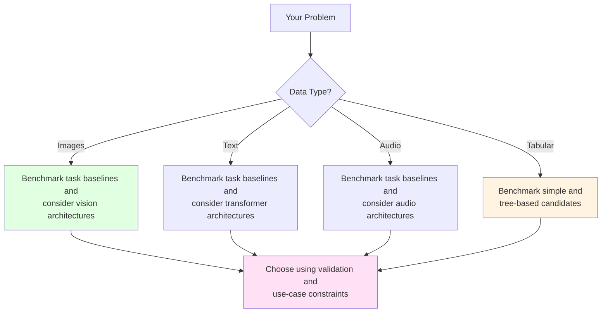

From Statistics to Deep Learning: The Modern Modeling Landscape

See [BONUS.md](BONUS.md) for advanced topics:

- Advanced statistical modeling techniques
- Hyperparameter tuning strategies
- Model interpretability and explainability
- Production deployment considerations
- Advanced deep learning architectures

Before running the examples, install the packages listed in [`demo/requirements.txt`](demo/requirements.txt). Optional material in `BONUS.md` may name additional packages that are not part of that recorded environment.

*Fun fact: The word "model" comes from the Latin "modulus" meaning "measure" or "standard." In data science, we're literally creating standards - mathematical representations that measure and predict patterns in our data. But unlike Zoolander, we can turn left AND right!*


*"I'm sorry, I can't do that. I'm a machine learning model, not a magic wand."*

# Outline

- Statistical modeling with `statsmodels` (inference and interpretation)
- Traditional machine learning with `scikit-learn` (the workhorse)
- Gradient boosting with `XGBoost` (the secret weapon)
- Deep learning with `TensorFlow`/`Keras` and `PyTorch` (the modern frontier)
- When to use what: navigating the modeling ecosystem

# Quick Reference

| Tool | Common starting point | Key features | Typical use |
|------|-------------|--------------|----------|
| **statsmodels** | Need p-values, confidence intervals, hypothesis testing | Statistical inference, model diagnostics | Understanding relationships, research |
| **scikit-learn** | Tabular data, need predictions | Consistent API, many algorithms | General ML tasks, preprocessing |
| **XGBoost** | Candidate for tabular prediction | Gradient boosting, feature-importance summaries | Benchmarking alongside simpler tabular models |
| **TensorFlow/Keras or PyTorch** | Candidate for images, text, audio, or learned representations | Automatic differentiation and neural-network APIs | Deep-learning workflows |

# The Modeling Ecosystem: A Brief Tour

*Reality check: There are more Python modeling libraries than there are ways to overfit a model. But don't worry - we'll focus on the essential tools that actually matter for daily data science work, from the bread-and-butter statistical methods to the cutting-edge deep learning frameworks.*

The Python modeling landscape has evolved dramatically. From simple linear regression to complex neural networks, each tool has its place. Understanding when to use what is half the battle - the other half is actually getting your model to work (which, let's be honest, is usually the harder part).

**The Modeling Spectrum:**

```
STATISTICAL MODELING          TRADITIONAL ML             DEEP LEARNING
┌─────────────────────┐      ┌──────────────────┐      ┌──────────────┐
│   statsmodels       │      │  scikit-learn    │      │ TensorFlow   │
│   (inference)       │      │  (predictions)   │      │ PyTorch      │
│                     │      │                  │      │              │
│ • Linear models     │      │ • Random Forest  │      │ • Neural     │
│ • GLMs              │      │ • SVM            │      │   networks   │
│ • Time series       │      │ • XGBoost        │      │ • CNNs       │
│                     │      │                  │      │ • RNNs       │
└─────────────────────┘      └──────────────────┘      └──────────────┘
     ↑                            ↑                          ↑
 "Inference"                "Prediction"             "Representation"
```

**Model Complexity vs Interpretability Trade-off:**


*More flexible models can be harder to explain, but complexity does not guarantee better performance and interpretability is not all-or-nothing. Compare candidates using the evaluation measure and explanation needs of the intended use.*

**Illustrative starting points:**

- **Need statistical inference?** Consider `statsmodels` and check the model assumptions.
- **Tabular data, need predictions?** Benchmark a simple baseline and suitable `scikit-learn` or `XGBoost` candidates.
- **Images, text, or audio?** Consider task-specific baselines and, when justified, deep learning with `TensorFlow`/`Keras` or `PyTorch`.
- **Choosing a framework?** Account for the data, evaluation goal, interpretability, team expertise, latency, deployment, and maintenance constraints.

These are candidate starting points, not deterministic rules. Select a final approach using training-only validation and the constraints of the intended use.

*Pro tip: Start simple. A well-tuned linear regression often beats a poorly tuned neural network. Remember: "But why male models?" - because sometimes the simplest model is the right model!*

**Model Selection Decision Tree:**


*"But why models?" "Seriously? I just told you that a moment ago."*


*"We found a statistically significant correlation between the data and our hypothesis. (p < 0.05)"*

# The Foundation: Statistical Modeling

*Think of statistical modeling as the foundation of your modeling house - you can build fancy additions on top, but you need to understand the basics first.*

Statistical modeling focuses on quantifying relationships and making inferences about populations, while machine learning often prioritizes prediction on new data. A fitted association does not by itself explain *why* something happens: causal conclusions require an appropriate study design plus explicit identification assumptions.

### A small vocabulary bridge

An **association** is a pattern in which variables vary together; **causation** is a claim that changing one variable would change another under a specified intervention. A model coefficient describes the estimated change in fitted outcome associated with a one-unit change in a predictor, holding the other included predictors fixed—it is not automatically a causal effect. Because samples and measurements vary, estimates have **uncertainty**. A **confidence interval** gives a range produced by a stated procedure for the population quantity, while a **p-value** (at this survey depth) measures how surprising data this extreme would be under a specified null model; neither is a probability that a hypothesis is true. Diagnostics and assumptions—such as an appropriate design, functional form, error behavior, and independence—bound what these summaries can support. Treat them as evidence about an association under a model, not as guarantees or proof of causation.

## Introduction to `statsmodels`

`statsmodels` is Python's comprehensive statistical modeling library. It provides tools for statistical inference, hypothesis testing, and model diagnostics - the bread and butter of statistical analysis.

**When to use `statsmodels`:**

- You need p-values, confidence intervals, or hypothesis tests
- You want to estimate and test relationships under stated assumptions (not just predict)
- You're doing traditional statistical analysis (regression, ANOVA, etc.)
- You need model diagnostics and assumption checking

**pandas compatibility:** Most `statsmodels` functions work directly with pandas DataFrames. You can pass DataFrames to model constructors, and results are often returned as pandas objects (Series, DataFrames).

**Reference:**

- `import statsmodels.api as sm` - Array-based API
- `import statsmodels.formula.api as smf` - Formula-based API (R-like syntax)
- `sm.OLS(y, X)` - Ordinary Least Squares regression
- `smf.ols('y ~ x1 + x2', data=df)` - Formula-based OLS
- `model.fit()` - Fit the model
- `results.summary()` - Print model summary
- `results.params` - Model coefficients
- `results.pvalues` - P-values for coefficients

## Linear Regression

Linear regression is the workhorse of statistical modeling. It models the relationship between a dependent variable and one or more independent variables using a linear equation.

*Think of linear regression as the Derek Zoolander of modeling - it's simple, it's reliable, and it can turn left (or right, or any direction really).*

**Linear Regression: The Blue Steel of Modeling**

Linear regression finds the best-fitting line through your data. It's like finding the perfect pose - simple, elegant, and it works every time (well, most of the time).

```
y = β₀ + β₁x₁ + β₂x₂ + ... + ε

Where:
- y = dependent variable (what you're predicting)
- β₀ = intercept (where the line starts)
- β₁, β₂, ... = coefficients (the change in fitted y associated with a one-unit increase in x, holding the other predictors fixed)
- ε = error term (the stuff we can't explain)
```

**Visual Example: Simple Linear Regression**

```
y (target)
  ↑
  |     ●
  |   ●   ●
  | ●       ●
  |●         ●
  |_____________→ x (feature)
  
Best-fit line: y = 2.0 + 1.5x
```

*OLS minimizes the sum of squared vertical residuals (`observed y - fitted y`), not the geometric distance from each point to the line. That's what "least squares" means here.*

*"I can turn left, I can turn right, I can even turn... statistically significant!"*

**Reference:**

- `sm.OLS(y, X)` - Create OLS model (array-based)
- `smf.ols('y ~ x1 + x2', data=df)` - Create OLS model (formula-based)
- `sm.add_constant(X)` - Add intercept column to design matrix
- `results = model.fit()` - Fit the model
- `results.summary()` - Comprehensive model summary
- `results.params` - Coefficient estimates (Series)
- `results.rsquared` - R-squared value
- `results.pvalues` - P-values for coefficients
- `results.conf_int()` - Confidence intervals
- `results.predict(X_new)` - Make predictions

**Example:**

```python
import statsmodels.api as sm
import statsmodels.formula.api as smf
import pandas as pd
import numpy as np

# Create sample data
np.random.seed(42)
x1 = np.random.randn(100)
x2 = np.random.randn(100)
noise = np.random.randn(100)
df = pd.DataFrame({'x1': x1, 'x2': x2})
df['y'] = 2 + 3 * df['x1'] + 0.5 * df['x2'] + noise

# Formula API (R-like, works with DataFrames)
model = smf.ols('y ~ x1 + x2', data=df)
results = model.fit()
print(results.summary())

# Access coefficients
print(results.params)  # Intercept, x1, x2 coefficients
print(results.pvalues)  # Statistical significance
```

*The `summary()` method provides comprehensive output including R-squared, p-values, confidence intervals, and model diagnostics - all the statistical information you need for inference.*


## Other Statistical Methods

`statsmodels` provides many other statistical modeling tools beyond linear regression:

**Generalized Linear Models (GLMs):**

- Logistic regression for binary outcomes
- Poisson regression for count data
- Other exponential family distributions
- Use when: You need statistical inference for non-normal data

**Time Series Models:**

- ARIMA models for time series forecasting
- Seasonal decomposition
- Use when: You have temporal dependencies in your data

**When an inferential model is the better fit:**

- You need interpretable coefficients and p-values
- You have strong theoretical reasons for model structure
- You need confidence intervals for predictions
- The sample is limited and a prespecified, parsimonious model has assumptions you can justify
- You're doing hypothesis testing, not just prediction

*Remember: inferential analyses quantify associations and uncertainty under assumptions; predictive analyses estimate performance on new data. Neither goal alone establishes a causal "why."*


*"Correlation doesn't imply causation, but it does waggle its eyebrows suggestively and gesture furtively while mouthing 'look over there'."*

# LIVE DEMO

# "Traditional" Machine Learning

*Think of `scikit-learn` as the Swiss Army knife of machine learning - it has a tool for almost everything, it's reliable, and it's been around long enough that everyone knows how to use it.*

Machine learning focuses on prediction rather than inference. While statistical models help you understand relationships, ML models help you make accurate predictions on new data.

## Introduction to `scikit-learn`

`scikit-learn` is Python's standard machine learning library. Its objects share composable conventions, but they do not all expose the same methods: estimators learn with `fit`; predictors additionally provide `predict` (and often `predict_proba`); transformers provide `transform` (usually `fit_transform` as a convenience); and pipelines chain transformers with a final estimator.

**The `scikit-learn` API Pattern:**

```python
# 1. Create model
model = SomeModel()

# 2. Fit on training data
model.fit(X_train, y_train)

# 3. Make predictions
predictions = model.predict(X_test)
```

**Train/Test Split Visualization:**

```
Original Dataset (1000 samples)
├── Training Set (800 samples, 80%)
│   └── Used to train the model
└── Test Set (200 samples, 20%)
    └── Used once for final performance evaluation
        (Not used for fitting, tuning, or model selection!)
```

*The golden rule: Never evaluate on data the model has seen during training. That's like giving a student the answers before the test and then being surprised they got 100%.*

Keep the test set untouched until the model and preprocessing choices are final. Tune hyperparameters and compare candidate models with cross-validation confined to the training set or with a separate validation set.

For temporal prediction, Lecture 09's information-availability rule comes first: construct each feature only from information available at its prediction timestamp. Then split chronologically (earlier observations for training, later observations for validation/test) or use a time-series cross-validation scheme; a random split can let future conditions inform past predictions.

**Why `scikit-learn` is the ML standard:**

- Consistent API across all models
- Comprehensive documentation and examples
- Well-tested and stable
- Excellent preprocessing tools
- Works seamlessly with pandas (accepts DataFrames)

**pandas compatibility:** `scikit-learn` functions accept pandas DataFrames and Series directly. However, some operations (like `fit_transform`) may return NumPy arrays, so you may need to convert back to DataFrames if you want to preserve column names.

**Reference:**

- `from sklearn.model_selection import train_test_split` - Split data
- `from sklearn.preprocessing import StandardScaler` - Scale features
- `from sklearn.linear_model import LinearRegression` - Linear regression
- `from sklearn.ensemble import RandomForestClassifier` - Random forest
- `model.fit(X, y)` - Train model
- `model.predict(X)` - Make predictions
- `model.score(X, y)` - Calculate accuracy/R²

## Linear Regression

Linear regression in `scikit-learn` is optimized for prediction rather than inference. It's faster and simpler than `statsmodels` but doesn't provide p-values or detailed diagnostics.

**`statsmodels` vs `scikit-learn` Linear Regression:**

| Feature | `statsmodels` | `scikit-learn` |
|---------|---------------|----------------|
| Purpose | Statistical inference | Prediction |
| P-values | ✅ Yes | ❌ No |
| Confidence intervals | ✅ Yes | ❌ No |
| Model diagnostics | ✅ Comprehensive | ❌ Basic |
| Speed | Slower | Faster |
| Use when | Need to understand relationships | Need predictions |

*Think of it this way: `statsmodels` emphasizes inference about parameters and uncertainty, while `scikit-learn` emphasizes predictive workflows and out-of-sample evaluation.*

**Reference:**

- `from sklearn.linear_model import LinearRegression` - Basic linear regression
- `from sklearn.linear_model import Ridge` - Ridge regression (L2 regularization)
- `from sklearn.linear_model import Lasso` - Lasso regression (L1 regularization)
- `model = LinearRegression()` - Create model
- `model.fit(X_train, y_train)` - Train model
- `model.predict(X_test)` - Make predictions
- `model.coef_` - Model coefficients
- `model.intercept_` - Model intercept
- `model.score(X, y)` - R² score

**Regularization:** Ridge and Lasso add penalty terms to prevent overfitting. Ridge (L2) shrinks coefficients, Lasso (L1) can zero out coefficients (feature selection).

**Regularization Comparison:**

| Method | Penalty Type | Effect on Coefficients | Use When |
|--------|--------------|------------------------|----------|
| Linear Regression | None | No shrinkage | Simple problems, no overfitting |
| Ridge (L2) | Sum of squares | Shrinks all coefficients | Many features, multicollinearity |
| Lasso (L1) | Sum of absolute values | Can zero out coefficients | Feature selection needed |

**Example:**

```python
from sklearn.linear_model import LinearRegression
from sklearn.model_selection import train_test_split
import pandas as pd
import numpy as np

# Create a pandas table, then select feature and target columns explicitly
rng = np.random.default_rng(42)
model_df = pd.DataFrame(
    rng.normal(size=(100, 3)),
    columns=['x1', 'x2', 'x3']
)
model_df['target'] = (
    2 + 3 * model_df['x1'] + 0.5 * model_df['x2'] + rng.normal(size=100)
)
feature_columns = ['x1', 'x2', 'x3']
X = model_df.loc[:, feature_columns]
y = model_df['target']

# Split data
X_train, X_test, y_train, y_test = train_test_split(
    X, y, test_size=0.2, random_state=42
)

# Fit model
model = LinearRegression()
model.fit(X_train, y_train)

# Predictions and evaluation
predictions = model.predict(X_test)
score = model.score(X_test, y_test)  # R²
print(f"R² score: {score:.3f}")
```

## Random Forest

Random Forest is an ensemble method that combines randomized decision trees. It can model nonlinear relationships and interactions without feature scaling, and it provides feature-importance summaries that require context.

*Random Forest is like having a committee of decision trees vote on the answer. It's democracy in action - except the trees are actually smart and the voting actually works.*

**How Random Forest Works:**

```
Training Data
    ↓
Create 100 Decision Trees (each sees random subset)
    ↓
Tree 1: Predicts Class A
Tree 2: Predicts Class B
Tree 3: Predicts Class A
...
Tree 100: Predicts Class A
    ↓
Final Prediction: Class A (majority vote)
```

*For classification, the forest combines class predictions or probabilities; for regression, it averages numerical predictions. The aggregation reduces the instability of relying on one fitted tree, but validation still determines whether the forest works well for the task.*

**Why Random Forest?**

- Models nonlinear relationships and interactions
- Aggregates randomized trees to reduce variance relative to one tree
- Usually does not require feature scaling
- Provides feature-importance summaries, which are not causal effects
- Good for both classification and regression

The example below uses finite numeric features. Missing or categorical inputs need a preprocessing strategy compatible with the recorded scikit-learn environment.

**Reference:**

- `from sklearn.ensemble import RandomForestClassifier` - Classification
- `from sklearn.ensemble import RandomForestRegressor` - Regression
- `model = RandomForestClassifier(n_estimators=100)` - Create model
- `model.fit(X_train, y_train)` - Train model
- `model.predict(X_test)` - Class predictions
- `model.predict_proba(X_test)` - Probability predictions
- `model.feature_importances_` - Feature importance scores
- `model.score(X, y)` - Accuracy/R² score

**Example:**

```python
from sklearn.ensemble import RandomForestClassifier
from sklearn.model_selection import train_test_split
import pandas as pd
import numpy as np

# Create sample data
np.random.seed(42)
X = np.random.randn(200, 4)
y = (X[:, 0] + X[:, 1] > 0).astype(int)  # Binary classification

# Split data
X_train, X_test, y_train, y_test = train_test_split(
    X, y, test_size=0.2, random_state=42, stratify=y
)

# Fit model
model = RandomForestClassifier(n_estimators=100, random_state=42)
model.fit(X_train, y_train)

# Predictions and feature importance
predictions = model.predict(X_test)
importance = model.feature_importances_
print(f"Feature importance: {importance}")
```

## Other `scikit-learn` Methods

`scikit-learn` provides many other algorithms:

**Classification:**

- `LogisticRegression` - Logistic regression for classification
- `SVC` - Support Vector Machines
- Candidates when their assumptions and decision boundaries fit the task

**Regression:**

- `Ridge`, `Lasso` - Regularized linear regression
- Candidates when shrinkage may help with many or correlated features

**Unsupervised Learning:**

- `KMeans` - K-means clustering
- `PCA` - Principal Component Analysis for dimensionality reduction
- Candidates for specific unlabeled-data or dimension-reduction questions

**Model Selection:**

- `cross_val_score` - Cross-validation
- `GridSearchCV` - Hyperparameter tuning
- Tools for estimating validation performance or selecting hyperparameters within training data

*Pro tip: Start with a meaningful simple baseline, then add candidates whose assumptions and capabilities fit the problem. Let validation evidence—not a favorite algorithm—decide among them. Blue steel is a style, not a model-selection rule.*

*"Did you ever think that maybe there's more to life than being really, really, ridiculously good at machine learning?"*


**The scikit-learn Workflow:**



Preprocessing parameters must also be learned without the test set. A `Pipeline` is the usual way to fit an imputer, encoder, or scaler on each training fold and apply the learned transformation to validation or test rows.

### Choosing an evaluation measure

Carry one task- and cost-aligned measure through the same baseline → training-only validation/CV → one-time test workflow. For regression, MAE is easy to interpret in the target's units and is less sensitive to large errors than squared-error measures; RMSE (or MSE) penalizes large misses more. For classification, accuracy is reasonable only when class and error costs are balanced; precision, recall, F1, a confusion matrix, or a ranking/probability measure such as ROC AUC or average precision may better reflect unequal costs or class imbalance. Decide this measure before comparing candidates, and report any complementary measures needed to expose important failure modes. The test set is still reserved for the final, pre-specified report.

*"I'm not an ambi-turner. I can't turn left. I can't turn right. But I CAN fit, predict, and score!"*

# The Secret Weapon: Gradient Boosting

*Gradient boosting is like the Magnum of machine learning - it's the secret weapon that wins competitions and makes you look like a modeling genius.*

Gradient boosting is widely used in machine learning competitions and applied tabular work. It is often a strong candidate for structured data, including the kinds of tables built with pandas.

## Why Gradient Boosting?

**Performance on Tabular Data:**

- Often competitive on structured/tabular data
- Can model nonlinear relationships and interactions among prepared features
- Provides feature-importance summaries that require careful interpretation

**Reasons to include it among the candidates:**

- You have tabular/structured data (not images, text, sequences)
- You want fast training and prediction
- Tree-based diagnostics would help investigate predictions
- You want a strong tabular benchmark without first building a deep architecture

**Practical strengths:**

- Frequently used in competitive and applied tabular modeling
- Supported by mature libraries and deployment tooling
- Often efficient to train, though speed and accuracy depend on the data and configuration

*Fun fact: XGBoost stands for "Extreme Gradient Boosting" - and it lives up to the name. It's so good that it's basically cheating (but legal cheating, which is the best kind).*

**Gradient Boosting: The Magnum of Machine Learning**

For squared-error regression, this can be pictured as fitting the next tree to ordinary residuals (actual minus current prediction). More generally, gradient boosting fits each new learner to pseudo-residuals—the negative gradient of the chosen loss—so the target is not always an ordinary residual and the loss need not be squared error.

```
Model 1: Makes predictions (with errors)
Model 2: Predicts the errors of Model 1
Model 3: Predicts the errors of Model 2
...
Final: Combine all models (like a modeling ensemble)
```

**Gradient Boosting Step-by-Step:**

| Step | What Happens | Example |
|------|--------------|---------|
| 1 | Initial model makes predictions | Predicts: [5.0, 3.0, 7.0] |
| 2 | Calculate the next-step targets | For squared-error regression, residuals: [0.5, 0.2, -0.2] |
| 3 | New model predicts those targets | Example fitted updates: [0.4, 0.3, -0.1] |
| 4 | Add error predictions to original | New predictions: [5.4, 3.3, 6.9] |
| 5 | Repeat until errors are minimized | Continue for N rounds |

*Each new model focuses on what the previous model got wrong. It's like having a tutor who only helps with your mistakes!*

*"What is this? A model for ants? It needs to be at least... three times more accurate!"*


*"Our machine learning model has achieved 99.9% accuracy on the training data!" "Great! How does it do on new data?" "Oh, we haven't tested that yet."*

## `XGBoost` Basics

`XGBoost` (Extreme Gradient Boosting) is a widely used gradient-boosting library. It is a strong candidate for many tabular prediction problems, but its performance must be evaluated against appropriate baselines on the data at hand.

**Reference:**

- `import xgboost as xgb` - Import XGBoost
- `model = xgb.XGBClassifier()` - Classification model
- `model = xgb.XGBRegressor()` - Regression model
- `model.fit(X_train, y_train)` - Train model
- `model.predict(X_test)` - Make predictions
- `model.predict_proba(X_test)` - Probability predictions (classification)
- `model.feature_importances_` - Feature importance
- `early_stopping_rounds` - Early stopping to help limit overfitting

**Key Hyperparameters:**

- `n_estimators` - Number of boosting rounds (trees)
- `max_depth` - Maximum tree depth
- `learning_rate` - Step size shrinkage
- `subsample` - Fraction of samples for each tree
- `colsample_bytree` - Fraction of features for each tree

**Hyperparameter Effects:**

| Hyperparameter | Too Low | Too High | Illustrative toy starting points* |
|----------------|---------|----------|------------|
| `n_estimators` | Underfitting | Overfitting | 50-200 |
| `max_depth` | Can't learn complex patterns | Overfitting | 3-6 |
| `learning_rate` | Slow convergence | Unstable training | 0.01-0.3 |
| `subsample` | Less robust | More variance | 0.8-1.0 |

*These ranges are toy starting points, not universal sweet spots. Validate them against a baseline with the task's chosen measure; the useful range depends on the data, objective, budget, and regularization.* Finding the right hyperparameters is like tuning a car - too conservative and you're slow, too aggressive and you crash.

**Early Stopping:** Helps limit overfitting by stopping training when validation performance stops improving.

*Early stopping monitors validation performance during training. When validation metrics stop improving (or start getting worse), training stops automatically. The validation set therefore participates in model selection; keep a separate test set for the one-time final evaluation.*

**Example:**

```python
import xgboost as xgb
from sklearn.model_selection import train_test_split
import pandas as pd
import numpy as np

# Create sample data
np.random.seed(42)
X = np.random.randn(200, 5)
y = (X[:, 0] + X[:, 1] > 0).astype(int)

# Create separate training, validation, and test sets (60% / 20% / 20%)
X_train, X_holdout, y_train, y_holdout = train_test_split(
    X, y, test_size=0.4, random_state=42, stratify=y
)
X_valid, X_test, y_valid, y_test = train_test_split(
    X_holdout, y_holdout, test_size=0.5, random_state=42, stratify=y_holdout
)

# Fit XGBoost model
model = xgb.XGBClassifier(
    n_estimators=100,
    max_depth=3,
    learning_rate=0.1,
    early_stopping_rounds=10
)
model.fit(X_train, y_train,
          eval_set=[(X_valid, y_valid)],
          verbose=False)

# Evaluate only after early stopping has selected the model
predictions = model.predict(X_test)
importance = model.feature_importances_
print(f"Feature importance: {importance}")
```

*Feature importance is returned as an array showing the relative importance of each feature. Higher values indicate more important features for making predictions.*

## The Boosting Ecosystem

Beyond `XGBoost`, there are other powerful gradient boosting libraries:

**`LightGBM`:**

- Designed for efficient training and memory use
- A candidate when scale or training speed is an important constraint

**`CatBoost`:**

- Provides native mechanisms for categorical features
- A candidate when the table contains important categorical variables

*Pro tip: Benchmark the libraries that fit the data and constraints rather than choosing from a slogan. Their relative speed and predictive performance depend on the dataset, configuration, and evaluation design. It's like choosing between blue steel, magnum, and le tigre—they're all amazing, just slightly different, so benchmark them on your data.*

**The Boosting Family Tree:**

```
Gradient Boosting
├── XGBoost (widely used general implementation)
├── LightGBM (efficiency-oriented implementation)
└── CatBoost (native categorical-feature support)
```

*"It's all about family. And by family, I mean gradient boosting."*


# LIVE DEMO

# Deep Learning: The Modern Frontier

*Deep learning is like the "Derelicte" of modeling - it's cutting-edge, it's flashy, and everyone wants to use it even when they probably shouldn't.*

Deep learning uses neural networks with multiple layers to learn complex patterns. It is widely used for images, text, audio, and other representation-learning tasks.

## Why Deep Learning?

**Tasks where neural networks are common candidates:**

- Image recognition and computer vision
- Natural language processing (text)
- Speech recognition and audio
- Time series with complex patterns
- Problems with enough relevant data and compute to evaluate the approach responsibly

**Deep learning and simpler candidates:**

- **Consider deep learning when:**
    - You have unstructured data (images, text, audio)
    - You need to learn complex, hierarchical features
    - Simpler task-appropriate baselines do not meet the evaluation goal

- **Include simpler models when:**
    - You have tabular/structured data
    - You need fast training and prediction
    - You need a transparent baseline or tighter resource use

**Reasons a simpler model may be preferable:**

- The available sample does not support reliable validation of a high-capacity model
- A simpler approach already meets the goal
- The explanation requirements are not met by the proposed approach
- Limited computational resources
- Tabular data for which simpler and tree-based candidates validate as well or better

**Overfitting Visualization:**

```
Good Fit:                    Overfitting:
Training Loss: 0.2          Training Loss: 0.05
Test Loss: 0.22             Test Loss: 0.35
                            ↑ Big gap = overfitting!

The model learned patterns    The model memorized training
that generalize well.        data but can't generalize.
```

*Overfitting is like memorizing answers to practice problems but failing the actual test. The model performs great on training data but poorly on new data.*

*Remember: Deep learning is powerful, but it's not always the answer. Sometimes a simple model is the right model.*

**Building a candidate shortlist:**



*"But why deep learning models?" "Seriously? I just told you that a moment ago."*


*"Our model is 99% accurate!" "On what?" "On the data we trained it on." "And on new data?" "We're still working on that part."*

## `TensorFlow`/`Keras`: The High-Level Approach

`TensorFlow` is an open-source machine-learning platform originally developed by Google. This lecture uses its integrated `tf.keras` API to build neural networks.

**Why TensorFlow/Keras may be a candidate:**

- Mature and well-documented
- Includes tools for multiple deployment targets
- High-level API makes it easy to get started
- Extensive ecosystem and community support
- Good performance optimizations

These strengths may matter in some settings, but framework choice should still reflect measured performance, the target platform, team expertise, and maintenance constraints.

**Reference:**

- `import tensorflow as tf` - Import TensorFlow
- `from tensorflow import keras` - Import Keras
- `model = keras.Sequential([...])` - Sequential model (linear stack)
- `model.add(keras.layers.Dense(units, activation))` - Add dense layer
- `model.compile(optimizer, loss, metrics)` - Configure training
- `model.fit(X_train, y_train, epochs, batch_size)` - Train model
- `model.predict(X_test)` - Make predictions
- `model.evaluate(X_test, y_test)` - Evaluate model

**Basic Workflow:**

1. **Build model** - Define architecture (layers)
2. **Compile model** - Specify optimizer, loss function, metrics
3. **Train model** - Fit on training data
4. **Evaluate model** - Check performance on test data
5. **Make predictions** - Use trained model

*During training, you'll see loss decrease and accuracy (or other metrics) improve with each epoch. Monitor both training and validation metrics to detect overfitting.*

**Neural Network Architecture (Simple Example):**

```
Input Layer (10 features)
    ↓
Hidden Layer 1 (64 neurons, ReLU)
    ↓
Hidden Layer 2 (32 neurons, ReLU)
    ↓
Output Layer (1 neuron, Sigmoid)
```

**What Each Layer Does:**

| Layer | Purpose | Example |
|-------|---------|---------|
| Input | Receives raw features | 10 numeric features |
| Hidden 1 | Learns complex patterns | 64 neurons find non-linear relationships |
| Hidden 2 | Refines patterns | 32 neurons combine learned features |
| Output | Makes final prediction | 1 neuron outputs probability (0-1) |

*"I'm not an ambi-turner. I can't turn left. I can't turn right. But I CAN backpropagate!"*

**Example:**

```python
import tensorflow as tf
from tensorflow import keras
import numpy as np

# Create sample data
np.random.seed(42)
X_train = np.random.randn(1000, 10)
y_train = (X_train.sum(axis=1) > 0).astype(int)
X_test = np.random.randn(200, 10)
y_test = (X_test.sum(axis=1) > 0).astype(int)

# Build model
model = keras.Sequential([
    keras.layers.Dense(64, activation='relu', input_shape=(10,)),
    keras.layers.Dense(32, activation='relu'),
    keras.layers.Dense(1, activation='sigmoid')
])

# Compile model
model.compile(
    optimizer='adam',
    loss='binary_crossentropy',
    metrics=['accuracy']
)

# Train model; validation data comes from the training sample, not the test set
model.fit(
    X_train, y_train,
    validation_split=0.2,
    epochs=10,
    batch_size=32,
    verbose=0
)

# Evaluate
loss, accuracy = model.evaluate(X_test, y_test, verbose=0)
print(f"Accuracy: {accuracy:.3f}")
```

## `PyTorch`: An Open-Source Deep-Learning Framework

`PyTorch` is an open-source deep-learning framework governed by the PyTorch Foundation. Its eager, Python-oriented interface is used in both research and production settings.

**PyTorch and TensorFlow/Keras:**

- **PyTorch:** Eager execution and a Python-oriented modeling ecosystem
- **TensorFlow/Keras:** High-level Keras APIs within TensorFlow's broader modeling and deployment ecosystem
- **Both:** Used for research and production; neither role belongs exclusively to one framework
- **Choice:** Depends on required libraries, deployment target, team expertise, maintenance, and measured performance

**Reference:**

- `import torch` - Import PyTorch
- `import torch.nn as nn` - Neural network modules
- `model = nn.Sequential([...])` - Sequential model
- `optimizer = torch.optim.Adam(model.parameters())` - Optimizer
- `loss_fn = nn.BCELoss()` - Loss function
- `model.train()` / `model.eval()` - Set training/evaluation mode

*Note: We're keeping PyTorch brief here because the lecture uses TensorFlow/Keras for its worked example. That is a teaching choice, not a claim that one framework is universally easier or better.*

## Other Modern Frameworks

Beyond `TensorFlow` and `PyTorch`, other frameworks support different computational styles:

**`JAX`:**

- NumPy with automatic differentiation and JIT compilation
- Used for numerical computing and advanced experimentation
- A candidate when its transformation and accelerator model fits the problem and team

**Other specialized frameworks:**

- Various specialized tools for specific domains
- Consider them when a concrete domain or platform requirement justifies the extra dependency

**The Deep Learning Ecosystem:**

```
Deep Learning Frameworks
├── TensorFlow/Keras (high-level modeling and deployment ecosystem)
├── PyTorch (eager, Python-oriented modeling ecosystem)
└── JAX (array programming with transformations and JIT compilation)
```

*"What is this? A learning rate for ants? It needs to be at least... three times smaller!"*

**Model-family comparison questions:**

| Model family | Useful role in a shortlist | Potential strengths | Check before choosing |
|---|---|---|---|
| Linear models | Simple baseline or inference model | Fast, compact, often easy to explain | Functional form and statistical assumptions |
| Random forests | Nonlinear tabular candidate | Interactions, limited preprocessing, robust baseline | Latency, calibration, and explanation needs |
| Gradient-boosted trees | Tabular prediction candidate | Flexible nonlinear fits and strong empirical performance | Tuning, calibration, and validation stability |
| Deep neural networks | Representation-learning candidate | Flexible architectures for images, text, audio, and other complex inputs | Data, compute, deployment, and explanation requirements |

Training time and predictive performance vary with the dataset, implementation, hardware, and tuning budget. Measure them in the intended workflow rather than assigning a universal ranking.

*"I'm pretty sure there's a lot more to modeling than being really, really, ridiculously good at deep learning." "But it helps!"*

# LIVE DEMO
