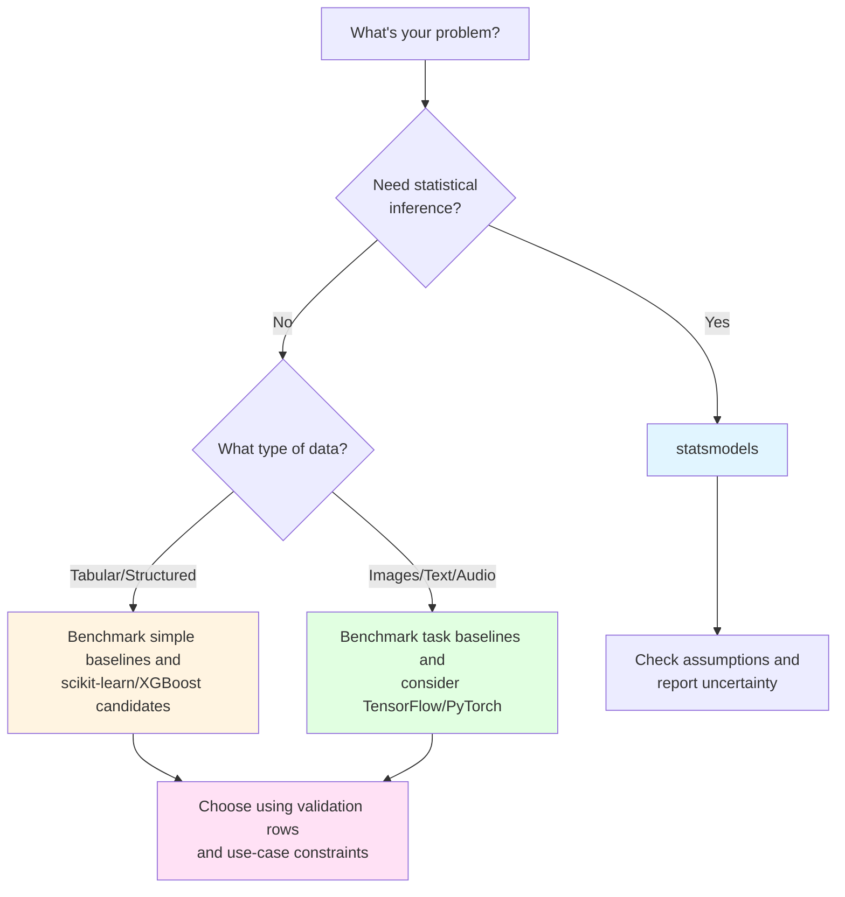
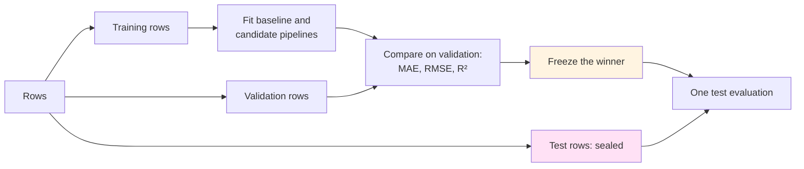
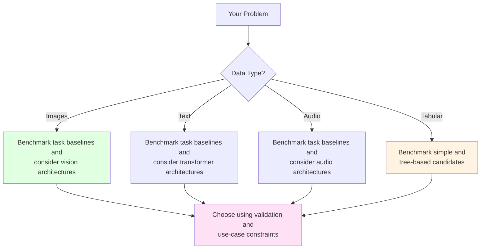

---
notion:
  title_line: "# From Statistics to Deep Learning: The Modern Modeling Landscape"
  role: lecture
  status: mapped
  page_id: "2b0d9fdd-1a1a-80f4-9871-ff3a726e57c3"
  url: "https://app.notion.com/p/2b0d9fdd1a1a80f49871ff3a726e57c3"
---

# From Statistics to Deep Learning: The Modern Modeling Landscape

See [BONUS.md](BONUS.md) for the optional extensions.

**Live notebooks in Colab:** [Demo 1](https://colab.research.google.com/github/christopherseaman/datasci_217/blob/main/10/demo/demo1_statistical_modeling.ipynb) · [Demo 2](https://colab.research.google.com/github/christopherseaman/datasci_217/blob/main/10/demo/demo2_ml_boosting.ipynb) · [Demo 3](https://colab.research.google.com/github/christopherseaman/datasci_217/blob/main/10/demo/demo3_deep_learning.ipynb)

Before running the examples, install the packages listed in [`demo/requirements.txt`](demo/requirements.txt). Optional material in `BONUS.md` may name additional packages that are not part of that recorded environment.

*Fun fact: The word "model" comes from the Latin "modulus" meaning "measure" or "standard." In data science, we're literally creating standards - mathematical representations that measure and predict patterns in our data. But unlike Zoolander, we can turn left AND right!*


*"I'm sorry, I can't do that. I'm a machine learning model, not a magic wand."*

# What Is a Model?

A **model** is a simplified mathematical description of how an outcome relates to other variables: a map, not the territory. In Lecture 08, `visits.groupby('clinic')['wait_min'].mean()` gave one average wait per clinic. A model does the same job more smoothly. It estimates the average outcome for *any* combination of inputs, including combinations that never appear in the table.

The same model can serve two different questions, and the question decides how you judge it:

- **Inference**: "Is BMI associated with systolic blood pressure among patients of the same age, and how sure are we?" You care about coefficients, uncertainty, and assumptions. Tool: `statsmodels`.
- **Prediction**: "What will this patient's blood pressure be at the next visit?" You care about error on patients the model has never seen. Tools: `scikit-learn` and friends.

This lecture follows that split. First comes inference with `statsmodels`, then honest prediction with `scikit-learn`, then more flexible models (boosted trees and neural networks) that trade interpretability for flexibility.

## The Modeling Landscape

Python's modeling libraries line up from inference toward flexible prediction:

```
STATISTICAL MODELING          TRADITIONAL ML             DEEP LEARNING
┌─────────────────────┐      ┌──────────────────┐      ┌──────────────┐
│   statsmodels       │      │  scikit-learn    │      │ TensorFlow   │
│   (inference)       │      │  (predictions)   │      │ PyTorch      │
│                     │      │                  │      │              │
│ • Linear models     │      │ • Random Forest  │      │ • Neural     │
│ • GLMs              │      │ • SVM            │      │   networks   │
│ • Time series       │      │ • Boosted trees  │      │ • CNNs       │
│                     │      │                  │      │ • RNNs       │
└─────────────────────┘      └──────────────────┘      └──────────────┘
     ↑                            ↑                          ↑
 "Inference"                "Prediction"             "Representation"
```

Moving right usually buys predictive power and costs interpretability:


Flexible models can be harder to explain, and more complexity does not guarantee better predictions. The prediction topics below show how to compare candidates fairly on patients the model has not seen.

*Pro tip: Start simple. A well-tuned linear regression often beats a poorly tuned neural network. Remember: "But why male models?" - because sometimes the simplest model is the right model!*

A first pass at choosing where to start:



### Reference Card: Which Library for Which Question

| Library | Start here when | Key features | Typical use |
| --- | --- | --- | --- |
| **statsmodels** | You need to quantify a relationship and its uncertainty | Statistical inference, model diagnostics | Understanding relationships, research |
| **scikit-learn** | Tabular data and you need predictions | One fit/predict pattern, preprocessing, many models | General prediction tasks |
| **XGBoost** | Candidate for tabular prediction | Gradient-boosted trees, feature-importance summaries | Benchmarking alongside simpler tabular models |
| **TensorFlow/Keras** | Candidate for images, text, audio, or learned representations | Neural-network layers and training loops | Deep-learning workflows (PyTorch is in BONUS) |

*"But why models?" "Seriously? I just told you that a moment ago."*


*"We found a statistically significant correlation between the data and our hypothesis. (p < 0.05)"*

# Statistical Modeling with `statsmodels`

Suppose a clinic asks whether higher BMI goes with higher systolic blood pressure (SBP), even among patients of the same age. **Linear regression** answers by fitting the relationship `sbp = b0 + b1 * age + b2 * bmi` that best matches the data. Plugging a patient's age and BMI into it gives a **fitted value**: the model's estimated average SBP for patients with those values.

- The **intercept** (`b0`) is the fitted SBP when every predictor is 0. It is usually just an anchor for the line, not a real patient.
- A **coefficient** (`b2`) is the difference in fitted SBP for a one-unit difference in BMI, *holding age fixed*.
- An **association** means two variables move together in the data. **Causation** means changing one would change the other. A coefficient from observational clinic records describes an association. Saying "losing weight would lower SBP by b2" needs a study design such as a randomized trial.
- A **95% confidence interval** is a range computed from the sample. If the study were repeated many times, about 95% of intervals built this way would contain the true coefficient, assuming the model is right.
- A **p-value** asks: if the true coefficient were 0, how surprising would an estimate at least this far from 0 be? It is not the probability that a hypothesis is true.

## Formulas and Arrays

`statsmodels` offers two interfaces (McKinney Ch. 12.3). The formula interface reads column names from a DataFrame and adds the intercept for you. Read `~` as "is modeled by" and `+` as "also include this predictor", not arithmetic (McKinney Ch. 12.2). The array interface takes the outcome and a table of predictors, and you add the intercept column yourself.

```text
Formula: smf.ols('sbp ~ age + bmi', data=clinic)                         intercept added for you
Array:   sm.OLS(clinic['sbp'], sm.add_constant(clinic[['age', 'bmi']]))  intercept column added by you
```

### Reference Card: `statsmodels` Essentials

| Method / attribute | Purpose & arguments | Typical output |
| :--- | :--- | :--- |
| `smf.ols('sbp ~ age + bmi', data=df)` | Build a formula-based OLS model from DataFrame columns (`import statsmodels.formula.api as smf`). | Unfitted model |
| `sm.OLS(y, sm.add_constant(X))` | Build an array-based OLS model; `sm.add_constant(X)` adds the intercept column (`import statsmodels.api as sm`). | Unfitted model |
| `'sbp ~ ' + ' + '.join(predictors)` | Build a formula string from a list of column names. | `'sbp ~ age + bmi'` |
| `C(column)` in a formula | Treat a column as categorical: one level becomes the reference and each other level gets its own coefficient, compared with the reference (McKinney Ch. 12.2). This is Lecture 05's `drop_first=True`: with an intercept, a 0/1 column for every level would be redundant, because those columns always add up to 1. | Extra coefficient rows |
| `model.fit()` | Estimate the coefficients. | Results object |
| `results.summary()` | Print coefficients, uncertainty, fit statistics, and diagnostics. | Formatted text table |

## Linear Regression by Least Squares

**Ordinary least squares (OLS)** picks the intercept and coefficients that make the line miss the observed points by as little as possible. Each miss is a **residual** (observed minus fitted), and OLS makes the sum of squared residuals as small as it can. In general form:

```
y = β₀ + β₁x₁ + β₂x₂ + ... + ε
```

In the clinic question, y is SBP, x₁ is age, x₂ is BMI, and ε (the **error term**) is everything the predictors do not explain.

*Think of linear regression as the Derek Zoolander of modeling - it's simple, it's reliable, and it can turn left (or right, or any direction really).*


*The dashes are vertical: OLS measures each miss straight up or down (`observed y - fitted y`), not as the shortest distance from the point to the line.*

*"I can turn left, I can turn right, I can even turn... statistically significant!"*

### Reference Card: OLS Results

| Method / attribute | Purpose & arguments | Typical output |
| :--- | :--- | :--- |
| `results.params` | Fitted intercept and coefficients by term. | Series (array with the array interface) |
| `results.pvalues` | p-value for each coefficient, testing "the true coefficient is 0". | Series |
| `results.rsquared` | Share of the outcome's variation the fitted model explains in these rows (0 to 1). | Float |
| `results.predict(new_rows)` | Fitted values for new rows with the same columns. | Series |
| `results.rsquared_adj`, `results.fvalue` / `results.f_pvalue`, `results.aic` / `results.bic` | Other numbers in the summary header: R² adjusted for the number of predictors; the F-test that all slopes are 0; information criteria for comparing models fit to the same rows (lower is better). | Float |
| `results.nobs` / `results.df_resid` | Rows used, and residual degrees of freedom (rows minus estimated coefficients). | Float |

### Code Snippet: OLS with the Formula API

```python
import numpy as np
import pandas as pd
import statsmodels.formula.api as smf

rng = np.random.default_rng(42)
clinic = pd.DataFrame({
    'age': rng.integers(30, 70, size=60),
    'bmi': rng.normal(27, 4, size=60).round(1),
})
clinic['sbp'] = (95 + 0.5 * clinic['age'] + 0.8 * clinic['bmi']
                 + rng.normal(0, 8, size=60)).round(1)

results = smf.ols('sbp ~ age + bmi', data=clinic).fit()
print(results.params.round(2))
print(results.pvalues.round(4))
```

```text
Intercept    75.21
age           0.66
bmi           1.19
dtype: float64
Intercept    0.0000
age          0.0000
bmi          0.0008
dtype: float64
```

`print(results.summary())` shows the same numbers in one table: read its `coef`, `std err`, `P>|t|`, and `[0.025 0.975]` columns. Here R-squared is 0.536. A p-value printed as 0.0000 is below 0.00005, not exactly 0.

The data were simulated with true coefficients 0.5 (age) and 0.8 (BMI). With only 60 patients the estimates (0.66 and 1.19) miss them, but both true values fall inside their 95% confidence intervals (next section), which is exactly the uncertainty the intervals describe.

## Uncertainty, Residuals, and New-Patient Intervals

A coefficient is an estimate from one sample of patients, so it comes with uncertainty. The **standard error** measures how much the estimate would vary from sample to sample. The 95% confidence interval defined above is roughly the estimate ± 2 standard errors.

Each row's residual is `observed - fitted` (the vertical dashes in the least-squares picture above). Plotting residuals against fitted values is a quick assumption check. A shapeless cloud around zero is what we hope for. A curve, like the U-shape on the right below, suggests the straight-line form is wrong. A funnel suggests the spread is not constant. The plot cannot tell you whether an association is causal.

Predicting for a new patient takes two different intervals:

- **Mean-response interval**: where the *average* SBP of all 55-year-olds with BMI 30 probably lies.
- **Prediction interval**: where *one* new 55-year-old's SBP probably lies. It adds person-to-person variation, so it is always wider.


### Reference Card: OLS Uncertainty and Diagnostics

- `results.bse`: Standard error for each coefficient; a Series indexed by term.
- `results.conf_int(alpha=0.05)`: Lower and upper 95% bounds; a DataFrame with columns `0` and `1`.
- `results.fittedvalues` / `results.resid`: One fitted value and one residual (observed - fitted) per row.
- `results.get_prediction(new_rows).summary_frame(alpha=0.05)`: Intervals for new rows. Columns `mean`, `mean_ci_lower`, `mean_ci_upper` (mean response) and `obs_ci_lower`, `obs_ci_upper` (individual prediction). `.conf_int(obs=True)` in place of `.summary_frame()` returns only the prediction-interval bounds as an array.
- `ax.scatter(results.fittedvalues, results.resid)` then `ax.axhline(0, color='gray', linestyle='--')`: Residuals-versus-fitted plot with Lecture 07's Axes methods; `axhline` draws a horizontal reference line at 0.
- `fig.savefig(path)`, `plt.show()`, `plt.close(fig)`: Save, display, then close the figure. A figure stays in memory until it is closed, so close each one when you are done with it.

### Code Snippet: Uncertainty and a New-Patient Interval

```python
# results: the clinic fit from the OLS snippet above
print(results.bse.round(2))
print(results.conf_int().round(2))

new_patient = pd.DataFrame({'age': [55], 'bmi': [30.0]})
print(results.get_prediction(new_patient).summary_frame(alpha=0.05).round(1))
```

```text
Intercept    10.18
age           0.09
bmi           0.34
dtype: float64
               0      1
Intercept  54.83  95.59
age         0.48   0.84
bmi         0.52   1.86
    mean  mean_se  mean_ci_lower  mean_ci_upper  obs_ci_lower  obs_ci_upper
0  147.2      1.5          144.3          150.2         131.4         163.0
```

Read the `age` row like this: holding BMI fixed, each extra year of age is associated with about 0.66 mmHg higher fitted SBP (95% CI 0.48 to 0.84). For the new patient, the mean-response interval is about 6 mmHg wide and the prediction interval about 32 mmHg wide.

### Code Snippet: Residuals Versus Fitted Values

```python
import matplotlib.pyplot as plt

# clinic, results: from the OLS snippet above
diagnostics = pd.DataFrame({
    'observed': clinic['sbp'],
    'fitted': results.fittedvalues,
    'residual': results.resid,
})
print(diagnostics.head(3).round(1))

fig, ax = plt.subplots(figsize=(6, 4))
ax.scatter(results.fittedvalues, results.resid)
ax.axhline(0, color='gray', linestyle='--')
ax.set_xlabel('Fitted SBP (mmHg)')
ax.set_ylabel('Residual (observed - fitted)')
fig.savefig('residuals_vs_fitted.png', dpi=150, bbox_inches='tight')
plt.show()
plt.close(fig)  # free the figure's memory once it is saved and shown
```

```text
   observed  fitted  residual
0     145.3   139.4       5.9
1     144.5   145.1      -0.6
2     139.6   142.0      -2.4
```

The saved plot shows the same pattern as the left panel of the figure above: no curve and no funnel.


*"Correlation doesn't imply causation, but it does waggle its eyebrows suggestively and gesture furtively while mouthing 'look over there'."*

# LIVE DEMO!

# Prediction: Features, Targets, and Honest Splits

Inference asks, "How is SBP associated with age, holding BMI fixed?" Prediction asks something else: "What will *this* patient's SBP be at the next visit?" A predictive model is judged by how well it does on patients it has never seen.

- A feature (Lecture 09) is an input column the model uses (age, BMI, today's SBP). The table of features is usually called `X`.
- The **target** is the column to predict (next-visit SBP), usually called `y`. Its **target time** is when that value is measured.
- The **prediction unit** is what receives one prediction (one visit). Prediction time (Lecture 09) is when the prediction is made, and every feature must be known by then.
- **Leakage** is information the model could not have at prediction time sneaking into training, such as a lab result that comes back 24 hours *after* the visit. Lecture 09 called this future leakage.

## Feature Availability

Lecture 09 checked whether a value was known by `prediction_time` before using it, and its past-only windows were leakage prevention too. Run the same audit on every candidate feature before fitting. Here the prediction is made at the end of the visit:

| Candidate feature | Becomes known | Hours after the visit | Decision |
| --- | --- | --- | --- |
| `age` | Before the visit | 0 | Keep |
| `sbp_today` | During the visit | 0 | Keep |
| `a1c_result` | When the lab reports the next day | 24 | Exclude (leakage) |

### Reference Card: Availability Audit

- `candidates['available'] = candidates['resulted_at'] <= prediction_time`: Lecture 09's check; a Boolean column, `True` where the value is known by prediction time. With offsets like the table's, `candidates['hours_after_visit'] <= 0` does the same.
- `np.where(candidates['available'], 'keep', 'exclude')`: Turn the check into a decision label (`np.where` is from Lecture 03); returns an array of labels.

## Time of Day as a Cycle

Hour of day is a common feature for hospital data, but as a plain number it misleads a model: 23:00 and 00:00 are one hour apart, yet 23 and 0 are as far apart as the numbers go. Placing each hour on a clock face fixes this. Two columns, `sin(2π · hour / 24)` and `cos(2π · hour / 24)`, give each hour a point on a circle, so hour 23 sits next to hour 0.

### Reference Card: Cyclic Time Features

- `df['timestamp'].dt.hour`: Hour of day (0-23) from a datetime column (Lecture 09).
- `np.sin(2 * np.pi * df['hour'] / 24)`, `np.cos(2 * np.pi * df['hour'] / 24)`: The hour's position on the clock face; each column runs from -1 to 1, so use both. `np.sin()` and `np.cos()` are NumPy functions like Lecture 03's `np.sqrt()`, and `np.pi` is the constant π.

### Code Snippet: Hours on a Clock Face

```python
import numpy as np
import pandas as pd

hours = pd.DataFrame({'hour': [0, 1, 6, 12, 23]})
hours['hour_sin'] = np.sin(2 * np.pi * hours['hour'] / 24).round(2)
hours['hour_cos'] = np.cos(2 * np.pi * hours['hour'] / 24).round(2)
print(hours)
```

```text
   hour  hour_sin  hour_cos
0     0      0.00      1.00
1     1      0.26      0.97
2     6      1.00      0.00
3    12      0.00     -1.00
4    23     -0.26      0.97
```

Hours 23 and 1 land equally close to hour 0, and hour 12 is on the opposite side of the circle. The same trick works for any repeating cycle: divide by 7 for day of the week, or by the number of days in the year for day of the year.

## Training, Validation, and Test Rows

To estimate performance honestly, give rows three roles:

- **Training set**: fits the model.
- **Validation set**: compares candidate models and settings.
- **Test set**: opened once, after the choice is frozen, to report final performance.

**Overfitting** is a model memorizing its training rows instead of learning patterns that carry over. It is like memorizing the practice exam's answers and then failing the real exam. It shows up as training error far below validation error:

```
Good fit:                       Overfitting:
Training error:   0.20          Training error:   0.05
Validation error: 0.22          Validation error: 0.35
                                ↑ Big gap = overfitting!
```

The opposite, **underfitting**, is a model too simple to capture the pattern, so training and validation errors both stay high.

When rows have no time order, a seeded random split works (`train_test_split` in the card below). When the model will predict the *future*, split by time, like Lecture 09's chronological blocks: train on the past, validate on the next period, and test on the period after that.

Split on the target time, not the visit date. With weekly visits, the Feb 8 visit predicts SBP measured on Feb 15, so a split by visit date would train the model on an outcome from the validation weeks.

| Target weeks (next visit) | Role | Why |
| --- | --- | --- |
| Jan 11 - Feb 8 | Training | Oldest outcomes fit the model |
| Feb 15 - Feb 22 | Validation | Next period chooses between candidates |
| Mar 1 - Mar 15 | Test | Newest outcomes, opened once |

*The golden rule: Never evaluate on data the model has seen during training. That's like giving a student the answers before the test and then being surprised they got 100%.*

### Reference Card: Splits

- `train_test_split(X, y, test_size=0.2, random_state=42)`: Seeded random split for rows without time order (`from sklearn.model_selection import train_test_split`); returns `X_train, X_test, y_train, y_test`. Call it twice for train/validation/test; `stratify=y` keeps the class mix equal in every part.
- `df['visit_date'] + pd.Timedelta(days=7)`: Target time for a next-week target (`pd.Timedelta` is from Lecture 09).
- `df[df['target_date'] < '2026-02-15']`: Rows whose target is measured before a cutoff.
- `df[(df['target_date'] >= start) & (df['target_date'] < end)]`: Rows whose target falls in one period, such as the validation window.
- `len(part)`, `part['target_date'].min()`, `part['target_date'].max()`: Each partition's size and target-time range; check them before fitting.

### Code Snippet: A Chronological Split

```python
import pandas as pd

visits = pd.DataFrame({
    'visit_date': pd.date_range('2026-01-04', periods=10, freq='W'),
    'sbp_today': [138, 142, 135, 150, 147, 139, 144, 152, 141, 137],
    'sbp_next_visit': [142, 135, 150, 147, 139, 144, 152, 141, 137, 145],
})
visits['target_date'] = visits['visit_date'] + pd.Timedelta(days=7)  # when sbp_next_visit is measured

train = visits[visits['target_date'] < '2026-02-15']
valid = visits[(visits['target_date'] >= '2026-02-15') & (visits['target_date'] < '2026-03-01')]
test = visits[visits['target_date'] >= '2026-03-01']
print(len(train), len(valid), len(test))
print(valid[['visit_date', 'target_date']])
```

```text
5 2 3
  visit_date target_date
5 2026-02-08  2026-02-15
6 2026-02-15  2026-02-22
```

The Feb 8 visit is a validation row, so no training target falls in the validation weeks.

# scikit-learn: One Pattern for Every Model

`scikit-learn` is Python's standard library for prediction. Its big idea is that every model is an object with the same three steps (create, `fit`, `predict`; shown below), so once you can fit one model you can fit them all.

*Think of `scikit-learn` as the Swiss Army knife of machine learning - it has a tool for almost everything, it's reliable, and it's been around long enough that everyone knows how to use it.*

It works like a hospital lab analyzer. The lab first runs standards with known concentrations to calibrate it (`fit`), then measures new patient samples (`predict`). Checking the analyzer only against the standards it was calibrated on would say little about patient samples, which is why models are scored on rows they have not seen. Objects that learn with `fit` are called **estimators**. Some estimators, like `StandardScaler`, do not predict. Instead they **transform** columns (for example, rescaling each feature to mean 0 and standard deviation 1) and are called **transformers**.

`scikit-learn` accepts the pandas DataFrames you have built since Lecture 04, so `X` can be `df[['age', 'bmi']]` and `y` can be `df['sbp']` (McKinney Ch. 12.4 builds `X_train` from DataFrame columns the same way).

## The Estimator Pattern

```python
# 1. Create the model object and choose its settings
model = SomeModel()

# 2. Fit: learn from the training rows
model.fit(X_train, y_train)

# 3. Predict for rows the model has not seen
predictions = model.predict(X_new)
```

### Reference Card: The Estimator Workflow

| Function / method | Purpose & arguments | Typical output |
| :--- | :--- | :--- |
| `model.fit(X, y)` | Learn parameters from features and targets. | The fitted estimator (`model`) |
| `model.predict(X)` | Generate predictions for new rows. | NumPy array |
| `model.score(X, y)` | Return the estimator's default score (R² for regressors, accuracy for classifiers). | Float |
| `scaler.fit_transform(X_train)` / `scaler.transform(X_valid)` | Learn each feature's mean and scale from training rows, then reuse them unchanged on other rows. | NumPy array (column names dropped) |

## Linear Regression for Prediction

`scikit-learn`'s `LinearRegression` fits the same least-squares line as `statsmodels`, but it reports only what prediction needs: coefficients and predictions, with no standard errors or p-values.

| Feature | `statsmodels` | `scikit-learn` |
|---------|---------------|----------------|
| Purpose | Statistical inference | Prediction |
| P-values | ✅ Yes | ❌ No |
| Confidence intervals | ✅ Yes | ❌ No |
| Model diagnostics | ✅ Comprehensive | ❌ Basic |
| Speed | Slower | Faster |
| Use when | Need to understand relationships | Need predictions |

**Regularization** adds a penalty that shrinks coefficients, which can reduce overfitting. Ridge (L2) shrinks all coefficients; Lasso (L1) can set some to exactly zero. The penalty treats every coefficient alike, so scale the features first (the pipelines below do).

| Method | Penalty Type | Effect on Coefficients | Use When |
|--------|--------------|------------------------|----------|
| Linear Regression | None | No shrinkage | Few features relative to rows |
| Ridge (L2) | Sum of squares | Shrinks all coefficients | Many or strongly correlated features |
| Lasso (L1) | Sum of absolute values | Can zero out coefficients | Feature selection needed |

### Reference Card: Linear Estimators

| Class / attribute | Purpose & arguments | Typical output |
| :--- | :--- | :--- |
| `LinearRegression()` | Fit an unregularized linear prediction model. | Estimator |
| `Ridge(alpha=...)` | Fit a linear model with an L2 coefficient penalty; larger `alpha` shrinks more. | Estimator |
| `Lasso(alpha=...)` | Fit a linear model with an L1 penalty that may set coefficients to zero. | Estimator |
| `LogisticRegression(max_iter=1000)` | Linear model for yes/no targets; `predict` gives 0/1 and `predict_proba` gives probabilities. | Estimator |
| `model.coef_` / `model.intercept_` | Read fitted slopes and intercept after `.fit(...)`. | Array / scalar |
| `model.score(X, y)` | Calculate the estimator's default regression score, R². | Float |

### Code Snippet: Linear Regression with a Held-Out Test Set

```python
from sklearn.linear_model import LinearRegression
from sklearn.model_selection import train_test_split
import pandas as pd
import numpy as np

# Create a pandas table, then select feature and target columns
rng = np.random.default_rng(42)
model_df = pd.DataFrame(rng.normal(size=(100, 3)), columns=['x1', 'x2', 'x3'])
model_df['target'] = 2 + 3 * model_df['x1'] + 0.5 * model_df['x2'] + rng.normal(size=100)
X = model_df[['x1', 'x2', 'x3']]
y = model_df['target']

# Split data
X_train, X_test, y_train, y_test = train_test_split(
    X, y, test_size=0.2, random_state=42
)

# Fit model
model = LinearRegression()
model.fit(X_train, y_train)

# Predictions and evaluation
predictions = model.predict(X_test)
score = model.score(X_test, y_test)  # R²
print(model.coef_.round(2))          # [ 2.85  0.65 -0.11]
print(f"R² score: {score:.3f}")      # R² score: 0.825
```

The fitted slopes land near the true 3, 0.5, and 0 used to build the target.

## Baselines and Pipelines

Before celebrating a model, ask whether it beats a guess. A **baseline** is the simplest honest prediction; for a number, it predicts the training mean for everyone. For time-ordered data, **persistence** is a stronger baseline: the next value equals the patient's last one, which Lecture 09's grouped `shift()` builds in one line. A model that cannot beat the baseline on validation rows has not learned anything useful.

Preprocessing needs the same honesty. A scaler that learns its means from validation or test rows leaks information about rows the model should be seeing for the first time (McKinney Ch. 12.4 fills missing ages with the *training* median for the same reason). A **Pipeline** bundles transformers and a model into one estimator, so `fit` learns the scaling from training rows only and `predict` reuses it unchanged.

```text
X_train --fit-->     [StandardScaler -> LinearRegression]   (learns scaling + coefficients)
X_valid --predict--> [same fitted steps]  --> predictions
```

### Reference Card: Baselines and Pipelines

- `DummyRegressor(strategy='mean')`: Predicts the training mean for every row; the regression baseline (`from sklearn.dummy import DummyRegressor`).
- `df.groupby('patient_id')['sbp'].shift(1)`: Persistence baseline: each patient's previous reading. The first row per patient is `NaN`. On a complete hourly grid, `shift(168)` gives the same hour last week.
- `Pipeline([('scale', StandardScaler()), ('model', LinearRegression())])`: Chains named steps; the last step is the model.
- `pipeline.fit(X_train, y_train)` / `pipeline.predict(X_valid)`: Fit every step on training rows only; then transform with the training scaling and predict (a NumPy array).
- `ColumnTransformer([(name, steps, columns), ...])`: Sends different columns to different preprocessing steps (see the variation below).
- `SimpleImputer(strategy='median')`: Fills missing numbers with the training median; `strategy='most_frequent'` fills categories with the most common training value.
- `OneHotEncoder(handle_unknown='ignore', sparse_output=False)`: One 0/1 column per training category; `handle_unknown='ignore'` turns a category never seen in training into all zeros instead of an error; `sparse_output=False` returns an ordinary array instead of a sparse matrix.

### Code Snippet: A Baseline and a Linear Pipeline

```python
from sklearn.dummy import DummyRegressor
from sklearn.linear_model import LinearRegression
from sklearn.pipeline import Pipeline
from sklearn.preprocessing import StandardScaler

# clinic: the 60-patient table from the OLS snippet (rows already in random order)
features = ['age', 'bmi']
train, valid = clinic.iloc[:45], clinic.iloc[45:]

baseline = DummyRegressor(strategy='mean')
baseline.fit(train[features], train['sbp'])

pipeline = Pipeline([('scale', StandardScaler()), ('model', LinearRegression())])
pipeline.fit(train[features], train['sbp'])

print(baseline.predict(valid[features])[:3].round(1))  # [140. 140. 140.]
print(pipeline.predict(valid[features])[:3].round(1))  # [153.3 136.1 149.2]
print(valid['sbp'].head(3).values)                     # [144.7 141.2 156.3]
```

### Code Snippet: A Persistence Baseline

```python
import pandas as pd

readings = pd.DataFrame({
    'patient_id': ['P1', 'P1', 'P1', 'P2', 'P2', 'P2'],
    'visit': [1, 2, 3, 1, 2, 3],
    'sbp': [138, 142, 135, 150, 147, 139],
})
readings['persistence'] = readings.groupby('patient_id')['sbp'].shift(1)
print(readings)
```

```text
  patient_id  visit  sbp  persistence
0         P1      1  138          NaN
1         P1      2  142        138.0
2         P1      3  135        142.0
3         P2      1  150          NaN
4         P2      2  147        150.0
5         P2      3  139        147.0
```

P2's first visit gets `NaN`, not P1's last reading. Compare every approach on the same rows: those where the baseline has a value.

### Code Snippet: Variation with Mixed Numeric and Categorical Columns

Real tables mix numbers with categories and have gaps. `ColumnTransformer` routes each group of columns to its own pipeline, and every imputer, scaler, and encoder still learns from training rows only.

```python
import numpy as np
import pandas as pd
from sklearn.compose import ColumnTransformer
from sklearn.impute import SimpleImputer
from sklearn.linear_model import Ridge
from sklearn.pipeline import Pipeline
from sklearn.preprocessing import OneHotEncoder, StandardScaler

mixed_train = pd.DataFrame({
    'income': [3.2, 5.1, np.nan, 2.8],
    'rooms': [4.0, 6.5, 5.2, 3.8],
    'region': ['north', 'south', 'north', 'south'],
})
mixed_target = pd.Series([1.2, 2.4, 1.8, 1.0], name='target')
mixed_valid = pd.DataFrame({
    'income': [4.4, 3.0],
    'rooms': [5.9, np.nan],
    'region': ['central', 'north'],  # 'central' never appears in training
})

numeric = Pipeline([
    ('impute', SimpleImputer(strategy='median')),
    ('scale', StandardScaler()),
])
categorical = Pipeline([
    ('impute', SimpleImputer(strategy='most_frequent')),
    ('one_hot', OneHotEncoder(handle_unknown='ignore', sparse_output=False)),
])
preprocess = ColumnTransformer([
    ('numeric', numeric, ['income', 'rooms']),
    ('categorical', categorical, ['region']),
])
model = Pipeline([('preprocess', preprocess), ('regressor', Ridge(alpha=1.0))])
model.fit(mixed_train, mixed_target)
print(model.predict(mixed_valid).round(2))  # [2.06 1.44]
```

For classification, replace the final estimator; the fitting boundary stays the same.

## Measuring Prediction Error

A **metric** turns a column of errors into one number. Choose it before comparing models, and compute it the same way for the baseline, every candidate, and the final test.



For numeric targets, each error is actual - predicted. For yes/no targets (1 = readmitted within 30 days), a **confusion matrix** counts the four outcomes: true positives (TP), false positives (FP), false negatives (FN), and true negatives (TN).

### Reference Card: `sklearn.metrics`

| Metric | Question it answers | Function | Typical output |
| --- | --- | --- | --- |
| **MAE** (mean absolute error) | Average size of a miss | `mean_absolute_error(y_true, y_pred)` | Target units (mmHg); 0 is perfect |
| **RMSE** (root mean squared error) | Like MAE, but big misses count extra | `np.sqrt(mean_squared_error(y_true, y_pred))` | Target units; always >= MAE |
| **R²** | How much better than predicting the mean of these rows? | `r2_score(y_true, y_pred)` | 1 is perfect; 0 ties the mean; **negative is worse than the mean** |
| **Accuracy** | What fraction of predictions were right? (TP + TN) / all | `accuracy_score(y_true, y_pred)` | 0 to 1 |
| **Precision** | Of the patients we flagged, how many were readmitted? TP / (TP + FP) | `precision_score(y_true, y_pred, zero_division=0)` | 0 to 1; `zero_division=0` returns 0 without a warning when nothing is flagged |
| **Recall** | Of the readmitted patients, how many did we flag? TP / (TP + FN) | `recall_score(y_true, y_pred)` | 0 to 1 |
| Confusion matrix | How many of each outcome? | `confusion_matrix(y_true, y_pred)` | 2x2 array `[[TN, FP], [FN, TP]]` |
| Per-class summary | Precision, recall, F1 (one score that balances the two), and support (number of true rows) for each class | `classification_report(y_true, y_pred)` | Printed table |

### Code Snippet: Comparing on Validation Rows

```python
import numpy as np
from sklearn.metrics import mean_absolute_error, mean_squared_error, r2_score

# baseline, pipeline, valid, features: from the baseline-and-pipeline snippet
for name, fitted in [('mean_baseline', baseline), ('linear_pipeline', pipeline)]:
    pred = fitted.predict(valid[features])
    mae = mean_absolute_error(valid['sbp'], pred)
    rmse = np.sqrt(mean_squared_error(valid['sbp'], pred))
    r2 = r2_score(valid['sbp'], pred)
    print(f'{name}: MAE={mae:.2f} RMSE={rmse:.2f} R2={r2:.3f}')
```

```text
mean_baseline: MAE=11.73 RMSE=14.13 R2=-0.053
linear_pipeline: MAE=7.20 RMSE=9.65 R2=0.510
```

The baseline's R² is slightly negative because it predicts the *training* mean (140.0), which misses the validation rows' own mean (143.2).

### Code Snippet: Accuracy Hides Missed Readmissions

When readmissions are rare, a model that always says "no" can score high accuracy while catching nobody. That is why screening cares about recall.

```python
from sklearn.metrics import accuracy_score, precision_score, recall_score

actual    = [1, 0, 0, 1, 0, 0, 0, 1]
flagged   = [1, 0, 0, 0, 0, 1, 0, 0]
always_no = [0, 0, 0, 0, 0, 0, 0, 0]

for name, predicted in [('flagged', flagged), ('always_no', always_no)]:
    accuracy = accuracy_score(actual, predicted)
    precision = precision_score(actual, predicted, zero_division=0)
    recall = recall_score(actual, predicted)
    print(f'{name}: accuracy={accuracy:.3f} precision={precision:.3f} recall={recall:.3f}')
```

```text
flagged: accuracy=0.625 precision=0.500 recall=0.333
always_no: accuracy=0.625 precision=0.000 recall=0.000
```

## Freeze, Then Test Once

After validation picks a winner, **freeze** it: its features, preprocessing, and settings can no longer change. You may then refit the frozen pipeline on training + validation rows (same settings, more data), or keep the train-fitted version. Either way, evaluate on the test rows exactly once and report that number. If the test result disappoints, report it anyway. Going back to tweak the model would turn the test set into a second validation set.

### Reference Card: Freezing and the Final Test

- `model.get_params(deep=False)`: The settings chosen when the model was created, as a dict; record them with the results. `'random_state' in model.get_params(deep=False)` shows whether the model accepts a seed.
- `final = Pipeline([('scale', StandardScaler()), ('model', LinearRegression())])`: Recreate the frozen pipeline with the same steps and settings.
- `train_valid = pd.concat([train, valid])`: Stack training and validation rows (`pd.concat` from Lecture 06).
- `final.fit(train_valid[features], train_valid['sbp'])`: Optional refit on more data; the settings do not change.
- `final.predict(test[features])`: The one test prediction. Compute the same metrics as on validation.

### Code Snippet: Recording the Frozen Settings

```python
from sklearn.linear_model import LinearRegression

settings = LinearRegression().get_params(deep=False)
print(settings)
print('random_state' in settings)
```

```text
{'copy_X': True, 'fit_intercept': True, 'n_jobs': None, 'positive': False, 'tol': 1e-06}
False
```

`LinearRegression` has no `random_state` setting. Other estimators, such as `Ridge` and the random forests below, do; fix it for repeatable results. Demo 2's final part practices the refit and single test evaluation.

## Random Forest

A **decision tree** predicts by asking a sequence of yes/no questions about the features, such as "Is age > 60?" then "Is BMI > 30?". It reports the average outcome of the training patients who end up in the same final group (a **leaf**). One tree is easy to read but jumpy: change a few training rows and its questions can change.

A **random forest** grows many trees. Each tree trains on a random resample of the rows (and classification forests also consider only a random subset of features at each question). The forest then averages the trees' predictions; for classification, it averages their class probabilities. A group of models combined into one prediction is an **ensemble**, and averaging many jumpy trees gives a steadier answer, the wisdom-of-crowds idea. **Gradient boosting**, coming up shortly, also uses many trees, but builds them one after another, each correcting the errors left so far.

*Random Forest is like having a committee of decision trees vote on the answer. It's democracy in action - except the trees are actually smart and the voting actually works.*


Forests capture **nonlinear** (curved) relationships and **interactions**, where one feature's effect depends on another (age might matter more at high BMI), usually without feature scaling. Feature importances are diagnostic, not causal, and categorical text columns still need encoding.

### Reference Card: Random Forests

| Class / method | Purpose & arguments | Typical output |
| :--- | :--- | :--- |
| `RandomForestClassifier(n_estimators=..., random_state=...)` | Build a classification forest from randomized trees. | Estimator |
| `RandomForestRegressor(n_estimators=..., random_state=...)` | Build a regression forest from randomized trees. | Estimator |
| `max_depth=...`, `min_samples_split=...` | Limit how deep each tree grows and how many rows a question needs before it splits; smaller trees memorize less. | Settings |
| `n_jobs=-1` | Build trees on all CPU cores at once. | Setting |
| `model.fit(X_train, y_train)` | Fit the trees on training data. | Fitted estimator |
| `model.predict(X_valid)` | Return class labels or numeric predictions. | Array |
| `model.predict_proba(X_valid)` | Return class probabilities (classification only). | 2-D array |
| `model.feature_importances_` | Read impurity-based feature importance scores (how much each feature's questions reduced error while training). | Array; not causal evidence |

### Code Snippet: Random-Forest Classification

```python
from sklearn.ensemble import RandomForestClassifier
from sklearn.model_selection import train_test_split
import numpy as np

# Create sample data
rng = np.random.default_rng(42)
X = rng.normal(size=(200, 4))
y = (X[:, 0] + X[:, 1] > 0).astype(int)  # Binary classification

# Split data
X_train, X_test, y_train, y_test = train_test_split(
    X, y, test_size=0.2, random_state=42, stratify=y
)

# Fit model
model = RandomForestClassifier(n_estimators=100, random_state=42)
model.fit(X_train, y_train)

# Predictions and feature importance
predictions = model.predict(X_test)
importance = model.feature_importances_
print(f"Feature importance: {importance.round(3)}")
```

```text
Feature importance: [0.411 0.451 0.072 0.066]
```

The first two columns built the label, and the forest leans on them.

## Permutation Importance: What Does the Model Rely On?

A random forest's `feature_importances_` only describes tree models. **Permutation importance** works for any fitted model or pipeline. Score the model on validation rows, shuffle one feature column so its link to the target is broken, and score again. The bigger the drop, the more the model relied on that feature. It is like testing how much a clinician relies on a lab value by scrambling that value across charts and seeing how much worse the diagnoses get.

- Use validation rows, never the sealed test set.
- scikit-learn scorers follow "higher is better", so MAE is written `neg_mean_absolute_error`; a positive importance means shuffling *increased* MAE.
- Correlated features can share or hide importance, and reliance is not causation.

| Validation rows | MAE |
| --- | --- |
| Original | 7.20 |
| `age` shuffled | about 11.5 (increase 4.32) |
| `bmi` shuffled | about 8.5 (increase 1.31) |

### Reference Card: `permutation_importance`

`permutation_importance(estimator, X, y, scoring=..., n_repeats=10, random_state=...)` shuffles each column of `X` `n_repeats` times and records how much the score drops (`from sklearn.inspection import permutation_importance`).

| Argument | Purpose | Effect |
| --- | --- | --- |
| `estimator` | A fitted model or pipeline | Predictions reuse its training-fitted preprocessing |
| `X`, `y` | Validation features and target | Keeps the test set sealed |
| `scoring` | Metric, such as `'neg_mean_absolute_error'` | Importance = increase in MAE |
| `n_repeats`, `random_state` | Shuffles per feature and seed | Reproducible mean and spread |

Returns an object whose `importances_mean` and `importances_std` hold one value per column, in column order.

### Code Snippet: Permutation Importance on Validation Rows

```python
from sklearn.inspection import permutation_importance

# pipeline, valid, features: from the baseline-and-pipeline snippet
result = permutation_importance(
    pipeline, valid[features], valid['sbp'],
    scoring='neg_mean_absolute_error', n_repeats=10, random_state=42,
)
importance = pd.DataFrame({
    'feature': features,
    'mae_increase': result.importances_mean.round(2),
    'std': result.importances_std.round(2),
})
print(importance)
```

```text
  feature  mae_increase   std
0     age          4.32  1.26
1     bmi          1.31  0.38
```

*"Did you ever think that maybe there's more to life than being really, really, ridiculously good at machine learning?"*


*"I'm not an ambi-turner. I can't turn left. I can't turn right. But I CAN fit, predict, and score!"*

# The Secret Weapon: Gradient Boosting

*Gradient boosting is like the Magnum of machine learning - it's the secret weapon that wins competitions and makes you look like a modeling genius.*

## Why Gradient Boosting?

Gradient boosting is a strong tabular candidate for nonlinear relationships and interactions. Benchmark it when the data, evaluation goal, and operational constraints justify it; performance depends on the dataset and configuration.

A **hyperparameter** is a setting you choose before fitting (number of trees, tree depth, learning rate), as opposed to the values the model learns. The **learning rate** scales each new tree's correction: at 0.1, each tree fixes only a tenth of the remaining error, so many small steps add up without overshooting. A random forest builds independent trees in parallel and averages them. Boosting builds trees in sequence, each aimed at what the ensemble so far still gets wrong (the bottom row of the trees figure).

*Fun fact: XGBoost stands for "Extreme Gradient Boosting" - and it lives up to the name. It's so good that it's basically cheating (but legal cheating, which is the best kind).*

For squared-error regression, the next tree fits ordinary residuals (actual minus current prediction). For other error measures, each tree fits a generalized residual (the "gradient" in the name), so its target is not always an ordinary residual.

Step by step, with made-up numbers:

| Step | What Happens | Example |
|------|--------------|---------|
| 1 | Initial model makes predictions | Predicts: [5.0, 3.0, 7.0] |
| 2 | Calculate the next-step targets | For squared-error regression, residuals: [0.5, 0.2, -0.2] |
| 3 | New model predicts those targets | Example fitted updates: [0.4, 0.3, -0.1] |
| 4 | Add a scaled update to the current ensemble | With learning rate 1: [5.4, 3.3, 6.9] |
| 5 | Recompute targets from the updated ensemble | Continue for N rounds, or stop once validation performance stops improving |

*Each new model focuses on what the ensemble so far got wrong. It's like having a tutor who only helps with your mistakes!*

*"What is this? A model for ants? It needs to be at least... three times more accurate!"*


*"Our machine learning model has achieved 99.9% accuracy on the training data!" "Great! How does it do on new data?" "Oh, we haven't tested that yet."*

## `XGBoost` Basics

`XGBoost` is a widely used gradient-boosting library to benchmark against simpler tabular baselines. Its models follow the same `fit`/`predict` pattern as `scikit-learn`.

**Early stopping** ends training when validation performance stops improving. Because validation participates in model selection, keep a separate test set for one final evaluation.

### Reference Card: XGBoost

| Class / parameter | Purpose & arguments | Typical output |
| :--- | :--- | :--- |
| `xgb.XGBClassifier(...)` | Build a gradient-boosted classifier (`import xgboost as xgb`). | Estimator |
| `xgb.XGBRegressor(...)` | Build a gradient-boosted regressor; accepts `random_state` and `n_jobs` like `scikit-learn` models. | Estimator |
| `model.fit(X_train, y_train, eval_set=[(X_valid, y_valid)], verbose=False)` | Fit trees and monitor validation data after each round. | Fitted estimator |
| `model.predict(X)` / `model.predict_proba(X)` | Return predictions or class probabilities. | Array |
| `early_stopping_rounds=10` (in the constructor) | Stop after validation performance fails to improve for 10 rounds. | Fewer trees |
| `model.best_iteration` / `model.best_score` | After early stopping: the round with the best validation score (counting from 0), and that score. | Integer / float |
| `model.feature_importances_` | Summarize fitted tree usage; do not interpret as causation. | Array |

### Reference Card: XGBoost Hyperparameters

| Hyperparameter | What it controls | Too Low | Too High | Illustrative toy starting points* |
|----------------|------------------|---------|----------|------------|
| `n_estimators` | Number of boosting rounds (trees) | Underfitting | Overfitting | 50-200 |
| `max_depth` | Maximum depth of each tree | Can't learn complex patterns | Overfitting | 3-6 |
| `learning_rate` | Share of each tree's correction that is added | Slow convergence | Unstable training | 0.01-0.3 |
| `subsample` | Fraction of rows each tree sees | Less robust | More variance | 0.8-1.0 |
| `colsample_bytree` | Fraction of features each tree sees | Trees miss useful features | Trees become more alike | 0.8-1.0 |

*These are toy starting points, not universal sweet spots; validate them for the data, objective, budget, and regularization.* Finding the right hyperparameters is like tuning a car - too conservative and you're slow, too aggressive and you crash.

### Code Snippet: XGBoost with Early Stopping

```python
import xgboost as xgb
from sklearn.model_selection import train_test_split
import numpy as np

# Create sample data
rng = np.random.default_rng(42)
X = rng.normal(size=(200, 5))
y = (X[:, 0] + X[:, 1] > 0).astype(int)

# Create separate training, validation, and test sets (60% / 20% / 20%)
X_train, X_holdout, y_train, y_holdout = train_test_split(
    X, y, test_size=0.4, random_state=42, stratify=y
)
X_valid, X_test, y_valid, y_test = train_test_split(
    X_holdout, y_holdout, test_size=0.5, random_state=42, stratify=y_holdout
)

# Fit XGBoost model
model = xgb.XGBClassifier(
    n_estimators=100,
    max_depth=3,
    learning_rate=0.1,
    early_stopping_rounds=10
)
model.fit(X_train, y_train,
          eval_set=[(X_valid, y_valid)],
          verbose=False)

# Evaluate only after early stopping has selected the model
predictions = model.predict(X_test)
importance = model.feature_importances_
print(f"Feature importance: {importance.round(3)}")
print(f"Best iteration: {model.best_iteration}")
```

```text
Feature importance: [0.498 0.377 0.    0.091 0.035]
Best iteration: 56
```

*"It's all about family. And by family, I mean gradient boosting."*


# LIVE DEMO!

# Deep Learning: The Modern Frontier

*Deep learning is like the "Derelicte" of modeling - it's cutting-edge, it's flashy, and everyone wants to use it even when they probably shouldn't.*

## Why Deep Learning?

A **neural network** is a stack of simple units. Each **neuron** does something you already know: a weighted sum of its inputs plus an intercept (a tiny linear regression), followed by an **activation function** that bends the result. **ReLU** keeps positive values and turns negatives into 0. **Sigmoid** squashes any number into 0-1 so it can be read as a probability. A **layer** is a row of neurons, and "deep" means several layers, so later layers can combine patterns found by earlier ones.

Training repeats one loop: predict, measure the **loss** (how wrong the predictions are; `binary_crossentropy` for yes/no targets), and let the **optimizer** (such as Adam) nudge every weight to reduce it. One pass through the training rows is an **epoch**, and rows are processed in **batches** of, say, 32.

That flexibility pays off for images, text, and audio, where useful features are hard to write by hand and the network learns its own (**representation learning**). On a tabular clinic table with a few hundred rows, a linear model or boosted trees usually match or beat a neural network with far less effort, so keep them as baselines. Neural networks have enough flexibility to overfit small tables easily, so watch the training and validation loss curves together (Demo 3 plots them).

Deciding whether a neural network belongs on the shortlist starts with the data type:



*"But why deep learning models?" "Seriously? I just told you that a moment ago."*


*"Our model is 99% accurate!" "On what?" "On the data we trained it on." "And on new data?" "We're still working on that part."*

## `TensorFlow`/`Keras`: The High-Level Approach

This lecture uses TensorFlow's integrated `tf.keras` API. Framework choice depends on measured performance, target platform, expertise, and maintenance.

Demo 3 uses the course Python 3.13 runtime with TensorFlow 2.21.0.

**Dropout** randomly masks a fraction of units during training to reduce reliance on particular pathways; all units are active when the model predicts. It is a regularization choice to validate, not a guarantee against overfitting. Demo 3 compares Dropout and L2 as regularization choices.

The snippet below builds this network. Layers between the input and the output are called **hidden layers**:

```
Input Layer (10 features)
    ↓
Hidden Layer 1 (64 neurons, ReLU)
    ↓
Hidden Layer 2 (32 neurons, ReLU)
    ↓
Output Layer (1 neuron, Sigmoid)
```

### Reference Card: `tf.keras`

| Method / class | Purpose & arguments | Typical output |
| :--- | :--- | :--- |
| `keras.utils.set_random_seed(42)` | Seed Python, NumPy, and TensorFlow at once for repeatable results (Demo 3 seeds with `np.random.seed` and `tf.random.set_seed`). | None |
| `keras.Sequential([...])` | Build a linear stack of layers. | Keras model |
| `keras.layers.Input(shape=(n_features,))` | Declare the input width as the first item in `Sequential`. | Input placeholder |
| `keras.layers.Dense(units, activation=...)` | Add a fully connected layer. | Layer |
| `keras.layers.Dropout(0.3)` | During training, randomly zero 30% of the previous layer's outputs. | Layer |
| `Dense(..., kernel_regularizer=keras.regularizers.l2(0.01))` | Add an L2 penalty on that layer's weights (the Ridge idea from the linear-estimator card). | Layer |
| `model.summary()` / `model.count_params()` | Print each layer's output shape and parameter count / return the total number of weights. | Printed table / integer |
| `model.compile(optimizer, loss, metrics)` | Configure optimization, loss, and reported metrics. | Configured model |
| `model.fit(X_train, y_train, epochs=..., batch_size=..., validation_split=...)` | Train for epochs and optionally hold out the last part of the training rows for validation. | `History` object |
| `model.fit(..., validation_data=(X_valid, y_valid))` | Report validation loss and metrics on an explicit validation set after every epoch. | `History` object |
| `history.history` | Per-epoch values such as `loss`, `val_loss`, `accuracy`, `val_accuracy`. | dict of lists |
| `model.predict(X)` | Generate predictions; with a sigmoid output these are probabilities, so `(model.predict(X) > 0.5).astype(int).flatten()` gives 0/1 labels. | NumPy array |
| `model.evaluate(X_test, y_test)` | Calculate loss and configured metrics on held-out data. | Scalar or list |

### Reference Card: Layer Roles

| Layer | Purpose | Example |
|-------|---------|---------|
| Input | Receives raw features | 10 numeric features |
| Hidden 1 | Learns complex patterns | 64 neurons find non-linear relationships |
| Hidden 2 | Refines patterns | 32 neurons combine learned features |
| Output | Makes final prediction | 1 neuron outputs probability (0-1) |

*During training, you'll see loss decrease and accuracy (or other metrics) improve with each epoch.*

*"I'm not an ambi-turner. I can't turn left. I can't turn right. But I CAN backpropagate!"*

### Code Snippet: A Small Keras Classifier

```python
import numpy as np
from tensorflow import keras

keras.utils.set_random_seed(42)  # seeds Python, NumPy, and TensorFlow

rng = np.random.default_rng(42)
X_train = rng.normal(size=(1000, 10))
y_train = (X_train.sum(axis=1) > 0).astype(int)
X_test = rng.normal(size=(200, 10))
y_test = (X_test.sum(axis=1) > 0).astype(int)

model = keras.Sequential([
    keras.layers.Input(shape=(10,)),  # same spelling as Demo 3
    keras.layers.Dense(64, activation='relu'),
    keras.layers.Dense(32, activation='relu'),
    keras.layers.Dense(1, activation='sigmoid'),
])
model.compile(optimizer='adam', loss='binary_crossentropy', metrics=['accuracy'])

# validation_split holds out the last 20% of training rows, never the test set
history = model.fit(X_train, y_train, validation_split=0.2,
                    epochs=10, batch_size=32, verbose=0)
print(f"Final validation accuracy: {history.history['val_accuracy'][-1]:.3f}")
loss, accuracy = model.evaluate(X_test, y_test, verbose=0)
print(f'Test accuracy: {accuracy:.3f}')
```

```text
Final validation accuracy: 0.960
Test accuracy: 0.980
```

These numbers come from a CPU run; other hardware may differ slightly.

*"What is this? A learning rate for ants? It needs to be at least... three times smaller!"*

## Comparing Model Families

Each family in this lecture earns a place on a shortlist for different reasons:

| Model family | Useful role in a shortlist | Potential strengths | Check before choosing |
|---|---|---|---|
| Linear models | Simple baseline or inference model | Fast, compact, often easy to explain | Functional form and statistical assumptions |
| Random forests | Nonlinear tabular candidate | Interactions, limited preprocessing, robust baseline | Latency, calibration, and explanation needs |
| Gradient-boosted trees | Tabular prediction candidate | Flexible nonlinear fits and strong empirical performance | Tuning, calibration, and validation stability |
| Deep neural networks | Representation-learning candidate | Flexible architectures for images, text, audio, and other complex inputs | Data, compute, deployment, and explanation requirements |

Measure performance in the intended workflow; dataset, implementation, hardware, and tuning budget prevent universal rankings.

*"I'm pretty sure there's a lot more to modeling than being really, really, ridiculously good at deep learning." "But it helps!"*

# LIVE DEMO!
