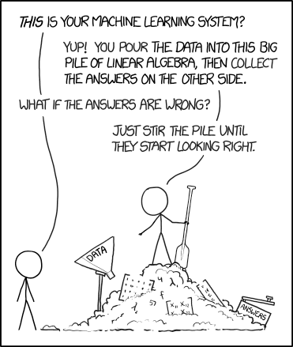
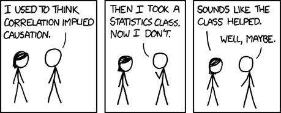
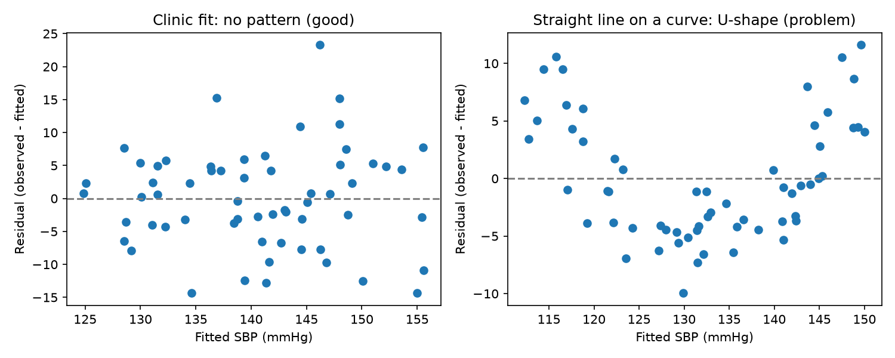
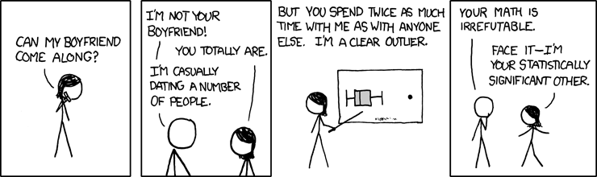
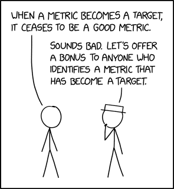
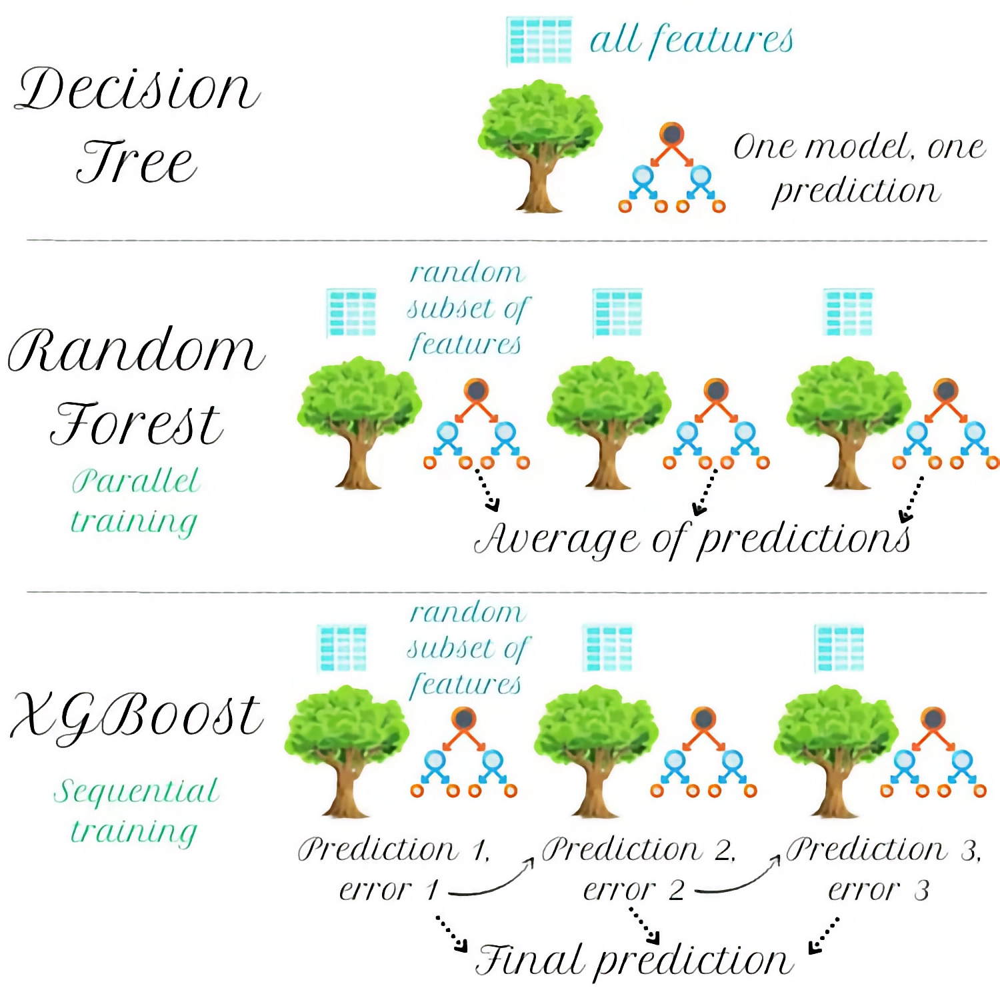
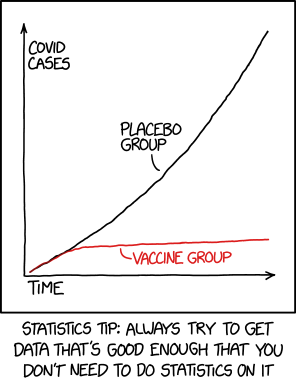

---
notion:
  title_line: "# From Statistics to Deep Learning: The Modern Modeling Landscape"
  role: lecture
  status: mapped
  page_id: "2b0d9fdd-1a1a-80f4-9871-ff3a726e57c3"
  url: "https://app.notion.com/p/2b0d9fdd1a1a80f49871ff3a726e57c3"
---

# From Statistics to Deep Learning: The Modern Modeling Landscape

See [BONUS.md](BONUS.md) for the optional extensions.

**Live notebooks in Colab:** [Demo 1](https://colab.research.google.com/github/christopherseaman/datasci_217/blob/main/10/demo/demo1_statistical_modeling.ipynb) · [Demo 2](https://colab.research.google.com/github/christopherseaman/datasci_217/blob/main/10/demo/demo2_sklearn_prediction.ipynb) · [Demo 3](https://colab.research.google.com/github/christopherseaman/datasci_217/blob/main/10/demo/demo3_trees_boosting_networks.ipynb)

**Run locally:**

```shell
curl -fsSL https://raw.githubusercontent.com/christopherseaman/datasci_217/main/10/demo/setup_demo.sh | sh
cd ~/10-demo
uv venv --seed
source .venv/bin/activate
uv sync
```

Then open the `10-demo` folder in VS Code and choose its `.venv` as the notebook kernel.

_Fun fact: The word "model" comes from the Latin "modulus" meaning "measure" or "standard." In data science, we're literally creating standards: mathematical representations that measure and predict patterns in our data. But unlike Zoolander, we can turn left AND right!_



This lecture covers:

- McKinney, _Python for Data Analysis_ (3rd ed.): 12.1 (interfacing between pandas and model code), 12.2 (model descriptions with Patsy formulas, including categorical data with `C()`), 12.3 (estimating linear models with statsmodels), and 12.4 (introduction to scikit-learn)

# What Is a Model?

A **model** is a simplified mathematical description of how an outcome, such as systolic blood pressure (SBP), relates to other variables, such as age and BMI. Like Lecture 08's `groupby('clinic')['wait_min'].mean()`, it estimates an average outcome, but for any combination of inputs, and the question it serves decides how to judge it:

| Question | Example | Judge it by | Start with |
| --- | --- | --- | --- |
| **Inference**: how are the variables related? | Is BMI associated with SBP among patients of the same age, and how sure are we? | Coefficients, their uncertainty, and the model's assumptions | `statsmodels` |
| **Prediction**: what will the outcome be? | What will this patient's SBP be at the next visit? | Error on patients the model has never seen | `scikit-learn` and friends |

## The Modeling Landscape

Python's modeling libraries offer different levels of flexibility and interpretability. Greater flexibility can fit more complex patterns, but it can also overfit; it does not guarantee better predictions. Use the question to shortlist libraries, then compare candidates on held-out rows from the workflow you intend to use.

### Reference Card: Which Library for Which Question

| Library | Start here when | Key features | Typical use |
| --- | --- | --- | --- |
| **statsmodels** | You need to quantify a relationship and its uncertainty | Statistical inference, model diagnostics | Understanding relationships, research |
| **scikit-learn** | Tabular data and you need predictions | One fit/predict pattern, preprocessing, many models | General prediction tasks |
| **XGBoost** | Candidate for tabular prediction | Gradient-boosted trees, feature-importance summaries | Benchmarking alongside simpler tabular models |
| **TensorFlow/Keras** | Candidate for images, text, audio, or learned representations | Neural-network layers and training loops | Deep-learning workflows (PyTorch is in BONUS) |

_Pro tip: Start simple. "But why male models?" Because sometimes the simplest model is the right model!_


# Statistical Modeling with `statsmodels`

**`statsmodels`** is Python's library for statistical inference. Its workhorse, **linear regression**, estimates an outcome as an intercept plus a weighted sum of predictors, as in `sbp = b0 + b1 * age + b2 * bmi`, and reports how uncertain each weight is, so it can say whether higher BMI goes with higher SBP among patients of the same age.

_Think of linear regression as the Derek Zoolander of modeling: simple, reliable, and it can turn left, turn right, or even turn statistically significant._

## Linear Regression by Least Squares

Plugging a patient's age and BMI into the fitted equation gives a **fitted value**: the model's estimated average SBP for patients like them.

- The **intercept** (`b0`) is the fitted SBP when every predictor is 0: an anchor for the line, not a real patient (a newborn with a BMI of 0 would make the journals).
- A **coefficient** (`b2`) is the difference in fitted SBP for a one-unit difference in BMI, _holding age fixed_.
- A **residual** is one row's miss, observed minus fitted. **Ordinary least squares (OLS)** picks the intercept and coefficients that make the sum of squared residuals as small as possible.
- The general form is `y = β₀ + β₁x₁ + β₂x₂ + ... + ε`: here y is SBP, x₁ is age, x₂ is BMI, and ε, the **error term**, is what the predictors do not explain.


## Formulas and Arrays

`statsmodels` has two interfaces. In a formula, read `~` as "is modeled by" and `+` as "also include this predictor", not arithmetic:

```text
Formula: smf.ols('sbp ~ age + bmi', data=clinic)                         intercept added for you
Array:   sm.OLS(clinic['sbp'], sm.add_constant(clinic[['age', 'bmi']]))  intercept column added by you
```

### Reference Card: `statsmodels` Essentials

| Method / attribute | Purpose & arguments | Typical output |
| :--- | :--- | :--- |
| `smf.ols('sbp ~ age + bmi', data=df)` | Build a formula-based OLS model from DataFrame columns (`import statsmodels.formula.api as smf`). | Unfitted model |
| `sm.OLS(y, sm.add_constant(X))` | Build an array-based OLS model; `sm.add_constant(X)` adds the intercept column (`import statsmodels.api as sm`). | Unfitted model |
| `'sbp ~ ' + ' + '.join(predictors)` | Build a formula string from a list of column names. | `'sbp ~ age + bmi'` |
| `C(column)` in a formula | Treat a column as categorical: one level becomes the reference and each other level gets its own coefficient, compared with the reference. This is Lecture 05's `drop_first=True`: with an intercept, a 0/1 column for every level would be redundant, because those columns always add up to 1. | Extra coefficient rows |
| `model.fit()` | Estimate the coefficients. | Results object |
| `results.summary()` | Print coefficients, uncertainty, fit statistics, and diagnostics. | Formatted text table |

### Reference Card: OLS Results

| Method / attribute | Purpose & arguments | Typical output |
| :--- | :--- | :--- |
| `results.params` | Fitted intercept and coefficients by term. | Series indexed by term (an array only when the inputs are NumPy arrays) |
| `results.rsquared` | Share of the outcome's variation the fitted model explains in these rows (0 to 1). | Float |
| `results.predict(new_rows)` | Fitted values for new rows with the same columns. | Series |
| `results.rsquared_adj`, `results.fvalue` / `results.f_pvalue`, `results.aic` / `results.bic` | Other numbers in the summary header: R² adjusted for the number of predictors; the F-test that all slopes are 0; information criteria for comparing models fit to the same rows (lower is better). | Float |
| `results.nobs` / `results.df_resid` | Rows used, and residual degrees of freedom (rows minus estimated coefficients). | Float |

### Code Snippet: OLS with the Formula API

`clinic` holds 60 simulated patients' `age`, `bmi`, and `sbp`, generated with true slopes of 0.5 mmHg per year of age and 0.8 mmHg per kg/m² of BMI.

```python
results = smf.ols('sbp ~ age + bmi', data=clinic).fit()
print(results.params.round(2))
```

```text
Intercept    75.21
age           0.66
bmi           1.19
dtype: float64
```

`results.summary()` shows the same numbers under `coef`, beside `std err`, `P>|t|`, and `[0.025 0.975]` (next section), and reports R-squared, 0.536 here.

<callout icon="⚠️" color="yellow_bg">
	## Check `results.nobs` after every fit
	`statsmodels` drops every row with a missing value in the formula's columns, without a warning: blank out three BMIs in `clinic` and the same call fits 57 rows, not 60. Compare `results.nobs` with `len(clinic)` so gaps in the data cannot quietly shrink the sample.
</callout>



## Uncertainty, Residuals, and New-Patient Intervals

A coefficient is an estimate from one sample, so it comes with uncertainty:

- The **standard error** measures how much the estimate would vary from sample to sample.
- A **95% confidence interval** is roughly the estimate ± 2 standard errors: repeat the study many times and about 95% of these intervals would contain the true coefficient.
- A **p-value** asks: if the true coefficient were 0 and the model assumptions held, how surprising would an estimate at least this far from 0, relative to its standard error, be? It is not the probability that a hypothesis is true.
- An **association** means two variables move together; **causation** means changing one would change the other. A coefficient from observational records describes an association, so "losing weight would lower SBP by b2" needs additional causal evidence, such as a randomized trial.

Plotting each row's residual against its fitted value checks the straight-line assumption: a shapeless cloud around zero is encouraging, a curve suggests the straight-line form is wrong, and a funnel suggests the spread is not constant. The default standard errors and intervals assume independent errors with constant spread around the correct mean; the small-sample intervals also assume normally distributed errors. A residual plot can reveal problems but cannot prove these assumptions, especially with repeated readings from the same patient.

Predicting for a new patient takes two intervals: a **mean-response interval**, where the _average_ SBP of all 55-year-olds with BMI 30 probably lies, and a **prediction interval**, where _one_ such patient's SBP probably lies; the second adds person-to-person variation, so it is always wider.



### Reference Card: OLS Uncertainty and Diagnostics

| Method / attribute | Purpose & arguments | Typical output |
| :--- | :--- | :--- |
| `results.bse` | Standard error of each coefficient. | Series indexed by term |
| `results.conf_int(alpha=0.05)` | Lower and upper 95% bounds. | DataFrame with columns `0` and `1` |
| `results.pvalues` | p-value for each coefficient, testing "the true coefficient is 0". | Series |
| `results.fittedvalues` / `results.resid` | One fitted value and one residual (observed minus fitted) per row. | Series |
| `results.get_prediction(new_rows).summary_frame(alpha=0.05)` | Intervals for new rows: `mean`, `mean_ci_lower`, `mean_ci_upper` (mean response) and `obs_ci_lower`, `obs_ci_upper` (individual prediction); `.conf_int(obs=True)` returns only the prediction bounds (Demo 1 uses it). | DataFrame |
| `ax.scatter(results.fittedvalues, results.resid)`, `ax.axhline(0, color='gray', linestyle='--')` | Residuals-versus-fitted plot with Lecture 07's Axes methods and Lecture 09's `ax.axhline`; the reference line sits at 0. | Axes |
| `fig.savefig(path)`, `plt.show()`, `plt.close(fig)` | Save, display, then close; an unclosed figure stays in memory. | PNG on disk |

### Code Snippet: Uncertainty and a New-Patient Interval

```python
print(pd.DataFrame({'std_err': results.bse.round(2),
                    'ci_lower': results.conf_int()[0].round(2),
                    'ci_upper': results.conf_int()[1].round(2),
                    'p_value': results.pvalues.round(4)}))

new_patient = pd.DataFrame({'age': [55], 'bmi': [30.0]})
print(results.get_prediction(new_patient).summary_frame(alpha=0.05).round(1))
```

```text
           std_err  ci_lower  ci_upper  p_value
Intercept    10.18     54.83     95.59   0.0000
age           0.09      0.48      0.84   0.0000
bmi           0.34      0.52      1.86   0.0008
    mean  mean_se  mean_ci_lower  mean_ci_upper  obs_ci_lower  obs_ci_upper
0  147.2      1.5          144.3          150.2         131.4         163.0
```

Read the `age` row as: holding BMI fixed, each extra year is associated with about 0.66 mmHg higher fitted SBP (95% CI 0.48 to 0.84). Both intervals contain the slopes the data were simulated with, and a p-value printed as 0.0000 is below 0.00005, not exactly 0. For the new patient the mean-response interval is about 6 mmHg wide, the prediction interval about 32.

### Code Snippet: Residuals Versus Fitted Values

```python
diagnostics = pd.DataFrame({'observed': clinic['sbp'], 'fitted': results.fittedvalues,
                            'residual': results.resid})
print(diagnostics.head(3).round(1))

fig, ax = plt.subplots(figsize=(6, 4))
ax.scatter(results.fittedvalues, results.resid)
ax.axhline(0, color='gray', linestyle='--')
ax.set_xlabel('Fitted SBP (mmHg)')
ax.set_ylabel('Residual (observed - fitted)')
fig.savefig('residuals_vs_fitted.png', dpi=150, bbox_inches='tight')
plt.show()
plt.close(fig)
```

```text
   observed  fitted  residual
0     145.3   139.4       5.9
1     144.5   145.1      -0.6
2     139.6   142.0      -2.4
```



# Prediction: Features, Targets, and Honest Splits

**Prediction** estimates the outcome for patients a model has not seen, such as _this_ patient's SBP at the next visit, so a prediction model is judged only on rows kept out of its fitting. A model can always describe the rows it was fitted on, so its error there says nothing about the next patient.

## Feature Availability

- The features (Lecture 09) are the input columns the model uses (age, BMI, today's SBP), together called `X`.
- The **target** is the column to predict (next-visit SBP), called `y`; its **target time** is when that value is measured.
- The **prediction unit** receives one prediction (one visit); prediction time (Lecture 09) is when it is made, and every feature must be known by then.
- **Leakage** is information unavailable at prediction time sneaking into training, such as a lab result that arrives 24 hours _after_ the visit (Lecture 09's future leakage).

Lecture 09's availability check keeps a candidate feature only if it is known by prediction time: `candidates['resulted_at'] <= prediction_time`, or `candidates['hours_after_visit'] <= 0` for offsets like these, with the prediction made at the end of the visit:

| Candidate feature | Becomes known | Hours after the visit | Decision |
| --- | --- | --- | --- |
| `age` | Before the visit | 0 | Keep |
| `sbp_today` | During the visit | 0 | Keep |
| `a1c_result` | When the lab reports the next day | 24 | Exclude (leakage) |


## Cyclic Time Features

A visit's hour passes that check, since it is known as soon as the row exists, but as a plain number it misleads a model: 23:00 and 00:00 are an hour apart, while 23 and 0 sit at opposite ends of the range. The sine and cosine of `2 * np.pi * hour / 24` place each hour on a clock face instead, so hour 23 lands as close to hour 0 as hour 1 does.

### Reference Card: Cyclic Time Features

| Expression | Purpose & arguments | Typical output |
| --- | --- | --- |
| `df['timestamp'].dt.hour` | Hour of day from a datetime column; `.dt.dayofyear` for the yearly cycle in the last row (both Lecture 09). | Integer Series |
| `np.sin(2 * np.pi * df['hour'] / 24)` | The hour's height on the clock face; `np.pi` is the constant π, and `np.sin()` works column-wise like Lecture 03's `np.sqrt()`. | Float Series, -1 to 1 |
| `np.cos(2 * np.pi * df['hour'] / 24)` | Its side-to-side position. Pair it with the sine: either column alone gives two different hours the same value. | Float Series, -1 to 1 |
| `2 * np.pi * df['wind_direction_deg'] / 360` | Angle for wind direction: pair its sine and cosine so 359° and 0° are neighbors. | Float Series |
| `2 * np.pi * (df['dayofyear'] - 1) / 366` | The same angle for any other cycle. Subtract 1 when the count starts at 1, so the first day sits at angle 0 (`.dt.hour` already starts at 0, `.dt.dayofyear` at 1). Divide by the cycle's length: 7 for day of the week, 366 for day of the year. Keeping 366 every year, leap or not, spaces every day one equal step apart and leaves day 366 one step short of a full turn. | Float Series |

### Code Snippet: Hours on a Clock Face

```python
hours = pd.DataFrame({'hour': [0, 1, 12, 23]})
hours['hour_sin'] = np.sin(2 * np.pi * hours['hour'] / 24).round(2)
hours['hour_cos'] = np.cos(2 * np.pi * hours['hour'] / 24).round(2)
print(hours)
```

```text
   hour  hour_sin  hour_cos
0     0      0.00      1.00
1     1      0.26      0.97
2    12      0.00     -1.00
3    23     -0.26      0.97
```

## Training, Validation, and Test Rows

To estimate performance honestly, give rows three roles:

- **Training set**: fits the model.
- **Validation set**: compares candidate models and settings.
- **Test set**: opened once, after the choice is frozen, to report final performance.

**Overfitting** is a model memorizing its training rows instead of learning patterns that carry over, like memorizing the practice exam's answers and then failing the real exam. A much lower training error than validation error can warn of overfitting, but changed patient mix or time-period conditions can also create a gap:

```text
Good fit:                       Overfitting:
Training error:   0.20          Training error:   0.05
Validation error: 0.22          Validation error: 0.35
                                ↑ Big gap: investigate the cause
```

The opposite, **underfitting**, is a model too simple to capture the pattern, so both errors stay high.

When independent rows have no time order, split them at random; the next topic's `train_test_split` does it in one call. When the model will predict the _future_, split into Lecture 09's chronological blocks of target times:

| Target weeks (next visit) | Role | Why |
| --- | --- | --- |
| Jan 11 to Feb 8 | Training | Oldest outcomes fit the model |
| Feb 15 to Feb 22 | Validation | Next period chooses between candidates |
| Mar 1 to Mar 15 | Test | Newest outcomes, opened once |

<callout icon="⚠️" color="yellow_bg">
	## Split on the target time, not the visit date
	Assign each row by when its **target** is measured: the Feb 8 visit predicts SBP measured on Feb 15, so it belongs to validation. Splitting on the visit date puts outcomes from the validation weeks into training.
</callout>

Disjoint target periods are only the first check. For a **prospective evaluation**, made as forecasts would be in use, every training label must already be available when the first validation prediction is made. If outcomes arrive a week later, remove training rows whose labels arrive after that cutoff; do the same before refitting for test. A split that ignores this delay is a **retrospective comparison** of historical periods, not evidence that the fitted model could have made those forecasts in real time. If labels arrive later than their target time, compare their actual availability times instead.

### Reference Card: Splitting on Target Time

- `df['visit_date'] + pd.Timedelta(days=7)`: Target time for a next-week target (Lecture 09).
- `df[df['target_date'] < cutoff]`, `df[(df['target_date'] >= start) & (df['target_date'] < end)]`: Rows whose target falls before a cutoff, or inside one period.
- `df['target_utc'] < pd.Timestamp('2024-01-01', tz='America/Chicago')`: With aware UTC target times (Lecture 09), write a local-midnight boundary as an aware timestamp in the local zone; pandas compares the instants, so this boundary is 06:00 UTC and nothing needs converting.
- `len(part)`, `part['target_date'].min()`, `part['target_date'].max()`: Each partition's size and target-time range; check before fitting.
- `fit_rows = train[train['target_date'] <= valid['visit_date'].min()]`: Keep only training labels available by the earliest validation prediction; assumes each label arrives at its target time.
- `assert fit_rows['target_date'].max() <= valid['visit_date'].min()`: Check that fitting does not read labels from after the first forecast cutoff.

### Code Snippet: A Chronological Split

`visits` holds ten weekly visits from Sunday, January 4, 2026, each with `sbp_today` and the target, `sbp_next_visit`, measured a week later.

```python
visits['target_date'] = visits['visit_date'] + pd.Timedelta(days=7)

train = visits[visits['target_date'] < '2026-02-15']
valid = visits[(visits['target_date'] >= '2026-02-15') & (visits['target_date'] < '2026-03-01')]
test = visits[visits['target_date'] >= '2026-03-01']
print(len(train), len(valid), len(test))
print(valid[['visit_date', 'target_date']])
```

```text
5 2 3
  visit_date target_date
5 2026-02-08  2026-02-15
6 2026-02-15  2026-02-22
```

# LIVE DEMO!

[Open Demo 1 in Colab](https://colab.research.google.com/github/christopherseaman/datasci_217/blob/main/10/demo/demo1_statistical_modeling.ipynb)

# scikit-learn: One Pattern for Every Model

**scikit-learn** is a widely used Python package for prediction: every model is an **estimator**, an object that learns from training rows with `fit()` and predicts new rows with `predict()`, so once you can fit one model you can fit them all. It works like a hospital lab analyzer: the lab calibrates it against standards of known concentration (`fit`), then measures new patient samples (`predict`). It takes pandas objects directly: `X` is a DataFrame of features such as `df[['age', 'bmi']]`, and `y` a Series such as `df['sbp']`.

## The Estimator Pattern

```text
Create estimator and choose settings
    → fit(X_train, y_train): learn from training rows
    → predict(X_new): predict for unseen rows
```

### Reference Card: The Estimator Workflow

| Function / method | Purpose & arguments | Typical output |
| :--- | :--- | :--- |
| `train_test_split(X, y, test_size=0.2, random_state=42)` | Split independent rows at random when they have no time order (`from sklearn.model_selection import train_test_split`); `random_state` makes the split repeat. Call it twice to carve out train, validation, and test. | `X_train, X_test, y_train, y_test` |
| `model.fit(X, y)` | Learn parameters from features and targets. | The fitted estimator (`model`) |
| `model.predict(X)` | Generate predictions for new rows. | NumPy array |
| `model.score(X, y)` | Return the estimator's default score (R² for regressors, accuracy for classifiers). | Float |

_Think of `scikit-learn` as the Swiss Army knife of machine learning: it has a tool for almost everything, it's reliable, and it's been around long enough that everyone knows how to use it._

## Linear Regression for Prediction

`LinearRegression` fits the same least-squares line as `statsmodels` without standard errors, p-values, or diagnostics, but it plugs into pipelines beside dozens of other model families.

**Regularization** adds a penalty that shrinks coefficients and can reduce overfitting when features are many or correlated: Ridge penalizes the sum of squared coefficients (L2), and Lasso the sum of absolute values (L1), which can set some to exactly zero and so drops those features. The penalty treats every coefficient alike, so scale features first.

### Reference Card: Linear Estimators

| Class / attribute | Purpose & arguments | Typical output |
| :--- | :--- | :--- |
| `LinearRegression()` | Fit an unregularized linear prediction model (`from sklearn.linear_model import LinearRegression, Ridge, Lasso, LogisticRegression`). | Estimator |
| `Ridge(alpha=...)` | Fit a linear model with an L2 coefficient penalty; larger `alpha` shrinks more. | Estimator |
| `Lasso(alpha=...)` | Fit a linear model with an L1 penalty that may set coefficients to zero. | Estimator |
| `LogisticRegression(max_iter=1000)` | Linear model for yes/no targets; `predict` gives 0/1 and `predict_proba` gives probabilities. | Estimator |
| `model.coef_` / `model.intercept_` | Read fitted slopes and intercept after `.fit(...)`. | Array / scalar |
| `model.score(X, y)` | R² for these regressors; accuracy for `LogisticRegression`. | Float |

## Baselines and Pipelines

A **baseline** is the simplest honest prediction: for a number, the training mean for everyone; for time-ordered rows, **persistence**, the patient's last value again. A model that cannot beat the baseline on validation rows has learned nothing useful.

A **transformer**, such as `StandardScaler`, reshapes columns instead of predicting, and one that learns its means from validation or test rows leaks information about rows the model should see for the first time. A **Pipeline** bundles transformers and a model into one estimator:

```text
X_train --fit-->     [StandardScaler -> LinearRegression]   (learns scaling + coefficients)
X_valid --predict--> [same fitted steps]  --> predictions
```

### Reference Card: Baselines and Pipelines

- `DummyRegressor(strategy='mean')`: Regression baseline; predicts the training mean for every row (`from sklearn.dummy import DummyRegressor`).
- `df.groupby('patient_id')['sbp'].shift(1)`: Persistence baseline: each patient's previous reading, `NaN` on their first row (Lecture 09's grouped `shift()`).
- `scaler = StandardScaler()`, then `scaler.fit_transform(X_train)` / `scaler.transform(X_valid)`: Learn each feature's mean and scale from training rows, then reuse them unchanged on other rows; returns a NumPy array without column names (`from sklearn.preprocessing import StandardScaler`).
- `Pipeline([('scale', StandardScaler()), ('model', LinearRegression())])`: Chains named steps; the last is the model (`from sklearn.pipeline import Pipeline`, `from sklearn.preprocessing import StandardScaler`).
- `pipeline.fit(X_train, y_train)` / `pipeline.predict(X_valid)`: Fit every step on training rows only, then reuse that scaling; returns an array.
- `pipeline.named_steps['model'].coef_`: Reach one named step inside a fitted pipeline to read its coefficients, or its settings with `.get_params()`.
- `ColumnTransformer([(name, steps, columns), ...])`: Sends different columns to different preprocessing steps (`from sklearn.compose import ColumnTransformer`).
- `SimpleImputer(strategy='median')`: Fills missing numbers with the training median; `strategy='most_frequent'` fills categories (`from sklearn.impute import SimpleImputer`).
- `OneHotEncoder(handle_unknown='ignore', sparse_output=False)`: One 0/1 column per training category; an unseen category becomes all zeros instead of an error (`from sklearn.preprocessing import OneHotEncoder`).

### Code Snippet: A Baseline and a Linear Pipeline

The 60 `clinic` patients from the OLS snippet are already in random order, so the first 45 train and the last 15 validate.

```python
features = ['age', 'bmi']
train, valid = clinic.iloc[:45], clinic.iloc[45:]

baseline = DummyRegressor(strategy='mean')
baseline.fit(train[features], train['sbp'])

pipeline = Pipeline([('scale', StandardScaler()), ('model', LinearRegression())])
pipeline.fit(train[features], train['sbp'])

print(baseline.predict(valid[features])[:3].round(1))  # [140. 140. 140.]
print(pipeline.predict(valid[features])[:3].round(1))  # [153.3 136.1 149.2]
print(valid['sbp'].head(3).values)                     # [144.7 141.2 156.3]
```

### Code Snippet: Variation with Mixed Numeric and Categorical Columns

Demo 2 Part 3 builds this mixed table with gaps: `clinic_train` holds four patients' `age`, `ldl` (one missing), and `site`, and `clinic_sbp` their SBP (mmHg); `clinic_valid` has another missing `ldl` and a `site`, `west`, that training never saw. `ColumnTransformer` routes each group of columns to its own pipeline; for classification, swap the final estimator.

```python
numeric = Pipeline([('impute', SimpleImputer(strategy='median')), ('scale', StandardScaler())])
categorical = Pipeline([('impute', SimpleImputer(strategy='most_frequent')),
                        ('one_hot', OneHotEncoder(handle_unknown='ignore', sparse_output=False))])
preprocess = ColumnTransformer([('numeric', numeric, ['age', 'ldl']),
                                ('categorical', categorical, ['site'])])
model = Pipeline([('preprocess', preprocess), ('model', Ridge(alpha=1.0))])
model.fit(clinic_train, clinic_sbp)
print(model.predict(clinic_valid).round(1))  # [141.6 147.7]
```



## Measuring Prediction Error

A **metric** turns a column of errors into one number. Choose it before comparing models and compute it the same way for the baseline, every candidate, and the final test.

For a numeric target, each error is actual minus predicted. For a yes/no target (**classification**, here with 1 = readmitted within 30 days), a **confusion matrix** counts the four outcomes: true positives (TP, flagged and readmitted), false positives (FP, flagged but not readmitted), false negatives (FN, readmitted but not flagged), and true negatives (TN).

### Reference Card: `sklearn.metrics`

Import each by name: `from sklearn.metrics import mean_absolute_error, r2_score`.

| Metric | Question it answers | Function | Typical output |
| --- | --- | --- | --- |
| **MAE** (mean absolute error) | Average size of a miss | `mean_absolute_error(y_true, y_pred)` | Target units (mmHg); 0 is perfect |
| **RMSE** (root mean squared error) | Like MAE, but big misses count extra | `np.sqrt(mean_squared_error(y_true, y_pred))` | Target units; always >= MAE |
| **R²** | How much better than predicting the mean of these rows? | `r2_score(y_true, y_pred)` | 1 is perfect; 0 ties the mean; **negative is worse than the mean** |
| **Accuracy** | What fraction of predictions were right? (TP + TN) / all | `accuracy_score(y_true, y_pred)` | 0 to 1 |
| **Precision** | Of the patients we flagged, how many were readmitted? TP / (TP + FP) | `precision_score(y_true, y_pred, zero_division=0)` | 0 to 1; `zero_division=0` returns 0 without a warning when nothing is flagged |
| **Recall** | Of the readmitted patients, how many did we flag? TP / (TP + FN) | `recall_score(y_true, y_pred)` | 0 to 1 |
| Confusion matrix | How many of each outcome? | `confusion_matrix(y_true, y_pred)` | 2x2 array `[[TN, FP], [FN, TP]]` |
| Per-class summary | Precision, recall, F1 (one score that balances the two), and support (number of true rows) for each class | `classification_report(y_true, y_pred)` | Printed table |

### Code Snippet: Comparing on Validation Rows

```python
for name, fitted in [('mean_baseline', baseline), ('linear_pipeline', pipeline)]:
    pred = fitted.predict(valid[features])
    mae = mean_absolute_error(valid['sbp'], pred)
    rmse = np.sqrt(mean_squared_error(valid['sbp'], pred))
    r2 = r2_score(valid['sbp'], pred)
    print(f'{name}: MAE={mae:.2f} RMSE={rmse:.2f} R2={r2:.3f}')
```

```text
mean_baseline: MAE=11.73 RMSE=14.13 R2=-0.053
linear_pipeline: MAE=7.20 RMSE=9.65 R2=0.510
```

The baseline's R² is negative because it predicts the _training_ mean (140.0), which misses the validation rows' own mean (143.2).

### Code Snippet: Accuracy Hides Missed Readmissions

When readmissions are rare, a model that always says "no" scores high accuracy while catching nobody, which is why screening cares about recall.

```python
actual    = [1, 0, 0, 1, 0, 0, 0, 1]
flagged   = [1, 0, 0, 0, 0, 1, 0, 0]
always_no = [0, 0, 0, 0, 0, 0, 0, 0]

for name, predicted in [('flagged', flagged), ('always_no', always_no)]:
    accuracy = accuracy_score(actual, predicted)
    precision = precision_score(actual, predicted, zero_division=0)
    recall = recall_score(actual, predicted)
    print(f'{name}: accuracy={accuracy:.3f} precision={precision:.3f} recall={recall:.3f}')
```

```text
flagged: accuracy=0.625 precision=0.500 recall=0.333
always_no: accuracy=0.625 precision=0.000 recall=0.000
```

## Permutation Importance: What Does the Model Rely On?

A metric says how well a model predicts, not which columns it leans on. **Permutation importance** measures that for any fitted model or pipeline: score it on validation rows, shuffle one feature column to break its link to the target, and score again; the bigger the drop, the more the model relied on that feature. It is like scrambling one lab value across a stack of charts to see how much worse a clinician's diagnoses get.

Correlated features can share or hide importance, and reliance is not causation. The same call works on the next topic's tree models, where Demo 3 sets it beside their built-in importances.

### Reference Card: `permutation_importance`

`permutation_importance(estimator, X, y, scoring=..., n_repeats=10, random_state=...)` shuffles each column of `X` `n_repeats` times and records how much the score drops (`from sklearn.inspection import permutation_importance`).

| Argument | Purpose | Effect |
| --- | --- | --- |
| `estimator` | A fitted model or pipeline | Predictions reuse its training-fitted preprocessing |
| `X`, `y` | Validation features and target | Keeps the test set sealed |
| `scoring` | Metric; scorers are "higher is better", so MAE is `'neg_mean_absolute_error'` | Importance = increase in MAE |
| `n_repeats`, `random_state` | Shuffles per feature and seed | Reproducible mean and spread |

Returns an object whose `importances_mean` and `importances_std` hold one value per column.

### Code Snippet: Permutation Importance on Validation Rows

```python
result = permutation_importance(
    pipeline, valid[features], valid['sbp'],
    scoring='neg_mean_absolute_error', n_repeats=10, random_state=42,
)
importance = pd.DataFrame({
    'feature': features,
    'mae_increase': result.importances_mean.round(2),
    'std': result.importances_std.round(2),
})
print(importance)
```

```text
  feature  mae_increase   std
0     age          4.32  1.26
1     bmi          1.31  0.38
```

## Freeze, Then Test Once

After validation picks a winner, **freeze** it: features, preprocessing, and settings stop changing. Refit the frozen pipeline on training + validation rows (same settings, more data) or keep the train-fitted version; either way, evaluate on the test rows exactly once and report that number, disappointing or not. Going back to tweak the model would turn the test set into a second validation set.

### Reference Card: Freezing and the Final Test

- `model.get_params(deep=False)`: The settings the model was created with; record them, and fix any `random_state`.
- `final = Pipeline([('scale', StandardScaler()), ('model', LinearRegression())])`: Recreate the frozen pipeline, same steps and settings.
- `train_valid = pd.concat([train, valid])`: Stack training and validation rows (Lecture 06).
- `final.fit(train_valid[features], train_valid['sbp'])`: Optional refit on more data; no setting changes.
- `final.predict(test[features])`: The one test prediction, scored with the same metrics as validation.

Demo 2 ends with that refit and single test evaluation.

_"Did you ever think that maybe there's more to life than being really, really, ridiculously good at machine learning?"_


# LIVE DEMO!

[Open Demo 2 in Colab](https://colab.research.google.com/github/christopherseaman/datasci_217/blob/main/10/demo/demo2_sklearn_prediction.ipynb)

# Trees and Forests

A **decision tree** predicts by asking yes/no questions about the features ("Is age > 60?", then "Is BMI > 30?") and reporting the average outcome of the training patients in the same final group, a **leaf**. It can bend where a linear model's straight line cannot, but one tree is jumpy: change a few training rows and its questions change.

_Random Forest is like having a committee of decision trees vote on the answer. It's democracy in action, except the trees are actually smart and the voting actually works._

## From One Tree to a Forest

A **random forest** grows many trees, each on a random resample of the rows, then averages their predictions; `max_features` decides how many features each question may consider. A group of models combined into one prediction is an **ensemble**, and averaging many jumpy trees gives a steadier answer than any one of them: wisdom of crowds.



Forests capture **nonlinear** (curved) relationships and **interactions**, where one feature's effect depends on another (age might matter more at high BMI), usually without scaling. Categorical text columns still need encoding.

### Reference Card: Random Forests

| Class / method | Purpose & arguments | Typical output |
| :--- | :--- | :--- |
| `train_test_split(..., stratify=y)` | Split a class label so each part keeps the same share of each class; without it a small split can land lopsided. | Same four parts as before |
| `RandomForestClassifier(n_estimators=..., random_state=...)` | Build a classification forest from randomized trees (`from sklearn.ensemble import RandomForestClassifier, RandomForestRegressor`). | Estimator |
| `RandomForestRegressor(n_estimators=..., random_state=...)` | Build a regression forest from randomized trees. | Estimator |
| `max_features=...` | How many features each question may choose from. Defaults to the square root of the count for `RandomForestClassifier` but to all of them for `RandomForestRegressor`; fewer features make the trees less alike. | Setting |
| `max_depth=...`, `min_samples_split=...` | Limit how deep each tree grows and how many rows a question needs before it splits; smaller trees memorize less. | Settings |
| `n_jobs=-1` | Build trees on all CPU cores at once. | Setting |
| `model.fit(X_train, y_train)` | Fit the trees on training data. | Fitted estimator |
| `model.predict(X_valid)` | Return class labels or numeric predictions. | Array |
| `model.predict_proba(X_valid)` | Return class probabilities (classification only). | 2-D array |
| `model.feature_importances_` | Read impurity-based feature importance scores (how much each feature's questions reduced error while training). Tree models only, and measured on the training fit; `permutation_importance` measures held-out reliance for any model. | Array; not causal evidence |

### Code Snippet: Random-Forest Classification

`X` holds 200 rows of four random feature columns, and the label `y` is 1 when the first two columns sum to more than 0, so only they matter.

```python
X_train, X_test, y_train, y_test = train_test_split(
    X, y, test_size=0.2, random_state=42, stratify=y)

model = RandomForestClassifier(n_estimators=100, random_state=42)
model.fit(X_train, y_train)
print(f"Feature importance: {model.feature_importances_.round(3)}")
```

```text
Feature importance: [0.411 0.451 0.072 0.066]
```

The forest leans on the two columns that built the label.

# The Secret Weapon: Gradient Boosting

**Gradient boosting** builds trees in sequence instead of in parallel, each small tree aimed at what the ensemble so far still gets wrong (the bottom row of the trees figure). Boosted trees are a standard strong candidate for tables such as clinic records, and XGBoost is the widely used library for them.

_Gradient boosting is the Magnum of machine learning: a signature look, built one small correction at a time._

## How Boosting Learns

A **hyperparameter** is a setting you choose before fitting, such as the number of trees, depth, or learning rate; the model does not learn it. The **learning rate** scales each new tree's correction: at 0.1 add a tenth of that tree's fitted update, so the ensemble learns in smaller steps. The update approximates the remaining error; it does not necessarily remove a tenth of it.

For squared-error regression each tree fits the ordinary residuals; the "gradient" in the name generalizes that idea to other losses. Step by step, with made-up numbers:

| Step | What Happens | Example |
|------|--------------|---------|
| 1 | The ensemble so far predicts | [5.0, 3.0, 7.0] |
| 2 | Compute the next-step targets | Residuals: [0.5, 0.2, -0.2] |
| 3 | A new tree predicts those targets | Fitted updates: [0.4, 0.3, -0.1] |
| 4 | Add the scaled update to the ensemble | With learning rate 1: [5.4, 3.3, 6.9] |
| 5 | Recompute targets and repeat | For N rounds, or until validation stops improving |

_It's like having a tutor who only helps with your mistakes!_

## `XGBoost` Basics

`XGBoost` (Extreme Gradient Boosting, "extreme" for its speed and memory engineering) follows the same `fit`/`predict` pattern as `scikit-learn`. **Early stopping** ends training when validation performance stops improving; validation then helps select the model, so keep a separate test set for the one final evaluation.

### Reference Card: XGBoost

| Class / parameter | Purpose & arguments | Typical output |
| :--- | :--- | :--- |
| `xgb.XGBClassifier(...)` | Build a gradient-boosted classifier (`import xgboost as xgb`). | Estimator |
| `xgb.XGBRegressor(...)` | Build a gradient-boosted regressor; accepts `random_state` and `n_jobs` like `scikit-learn` models. | Estimator |
| `model.fit(X_train, y_train, eval_set=[(X_valid, y_valid)], verbose=False)` | Fit trees and monitor validation data after each round. | Fitted estimator |
| `model.predict(X)` / `model.predict_proba(X)` | Return predictions or class probabilities. | Array |
| `early_stopping_rounds=10` (in the constructor) | Stop after validation performance fails to improve for 10 rounds. | Fewer trees |
| `model.best_iteration` / `model.best_score` | After early stopping: the round with the best validation score (counting from 0), and that score. | Integer / float |
| `model.feature_importances_` | Summarize fitted tree usage; do not interpret as causation. | Array |

### Reference Card: XGBoost Hyperparameters

| Parameter | What it controls | Starting choice and tradeoff |
| --- | --- | --- |
| `n_estimators` | Boosting rounds | Try 50–200; more rounds give more opportunity to fit and overfit |
| `max_depth` | Depth of each tree | Try 3–6; deeper trees capture more complexity and can memorize |
| `learning_rate` | Share of each tree's correction added | Try 0.01–0.3; smaller steps usually need more rounds |
| `subsample` | Fraction of training rows each tree sees | Try 0.8–1.0; sampling can reduce overfitting, but too few rows lose signal |
| `colsample_bytree` | Fraction of features each tree sees | Try 0.8–1.0; sampling makes trees less alike, but can omit useful features |

These are toy starting points; choose settings on validation rows for the data and budget.

### Code Snippet: XGBoost with Early Stopping

With training and validation rows already separated, as in Demo 3, the example needs only the estimator and monitoring calls. The test rows stay sealed:

```python
model = xgb.XGBClassifier(n_estimators=100, max_depth=3, learning_rate=0.1,
                          early_stopping_rounds=10, random_state=42)
model.fit(X_train, y_train, eval_set=[(X_valid, y_valid)], verbose=False)
print(model.best_iteration)  # zero-based round with the lowest validation loss
predicted = model.predict(X_valid)
```

`best_iteration` identifies the best round within the 100-round budget; `predicted` contains one 0/1 label per validation row. Demo 3 develops the fixed-round and early-stopped comparison, then freezes a candidate before its final test.


# Deep Learning: The Modern Frontier

A **neural network** is a stack of **layers** of simple units: each **neuron** takes a weighted sum of its inputs plus an intercept, a tiny linear regression, and bends the result with an **activation function**. "Deep" means several layers, so later layers combine patterns that earlier ones found, which lets a network learn its own features from images, text, or audio.

## How a Network Learns

**ReLU** keeps positive values and turns negatives into 0; **sigmoid** squashes any number into the range 0 to 1, readable as a probability. Layers between the input and the output are called **hidden layers**:

```text
Input Layer (10 features)
    ↓
Hidden Layer 1 (64 neurons, ReLU)
    ↓
Hidden Layer 2 (32 neurons, ReLU)
    ↓
Output Layer (1 neuron, Sigmoid)
```

Training repeats one loop: predict, measure the **loss** (how wrong the predictions are; `binary_crossentropy` for yes/no targets), and let the **optimizer** (such as Adam) nudge every weight to reduce it. One pass through the training rows is an **epoch**, and rows are processed in **batches** of, say, 32.

Learning its own features (**representation learning**) pays off where useful features are hard to write by hand. On a clinic table of a few hundred rows, a linear model or boosted trees usually match a network for far less effort, and a network overfits easily, so watch the loss curves (Demo 3 plots them).

## `TensorFlow`/`Keras`: The High-Level Approach

**Keras** (`tf.keras`) is TensorFlow's high-level interface: stack layers, `compile()` with a loss and an optimizer, then `fit()` and `predict()` much like `scikit-learn`. Demo 3 runs TensorFlow 2.21.0 on Python 3.13; `BONUS.md` covers PyTorch and JAX.

**Dropout** randomly masks a fraction of units during training; all units are active when the model predicts. Like L2, it is a regularization choice to validate against a plain network, not a guarantee against overfitting.

### Reference Card: `tf.keras`

| Method / class | Purpose & arguments | Typical output |
| :--- | :--- | :--- |
| `import tensorflow as tf`, `from tensorflow import keras` | Load TensorFlow and its Keras interface under the names this card uses. | `tf`, `keras` |
| `keras.utils.set_random_seed(42)` | Seed Python, NumPy, and TensorFlow at once; pair it with `tf.config.experimental.enable_op_determinism()` when the printed numbers must repeat exactly (Demo 3 does both). | None |
| `keras.Sequential([...])` | Build a linear stack of layers. | Keras model |
| `keras.layers.Input(shape=(n_features,))` | Declare the input width as the first item in `Sequential`. | Input placeholder |
| `keras.layers.Dense(units, activation=...)` | Add a fully connected layer. | Layer |
| `keras.layers.Dropout(0.3)` | During training, randomly zero 30% of the previous layer's outputs. | Layer |
| `Dense(..., kernel_regularizer=keras.regularizers.l2(0.01))` | Add an L2 penalty on that layer's weights (the Ridge idea from the linear-estimator card). The loss Keras reports then includes the penalty, so compare such a network with others on accuracy, not loss. | Layer |
| `model.summary()` / `model.count_params()` | Print each layer's output shape and parameter count / return the total number of weights. | Printed table / integer |
| `model.compile(optimizer, loss, metrics)` | Configure optimization, loss, and reported metrics. | Configured model |
| `model.fit(X_train, y_train, epochs=..., batch_size=..., validation_split=...)` | Train for epochs and optionally hold out the last part of the training rows for validation. | `History` object |
| `model.fit(..., validation_data=(X_valid, y_valid))` | Report validation loss and metrics on an explicit validation set after every epoch. | `History` object |
| `history.history` | Per-epoch values such as `loss`, `val_loss`, `accuracy`, `val_accuracy`. | dict of lists |
| `model.predict(X)` | Generate predictions; with a sigmoid output these are probabilities, so `(model.predict(X) > 0.5).astype(int).flatten()` gives 0/1 labels. | NumPy array |
| `model.evaluate(X_test, y_test)` | Calculate loss and configured metrics on held-out data. | Scalar or list |

### Code Snippet: A Small Keras Classifier

Use Demo 3's training-fitted, scaled features and its separate validation rows. One hidden layer is enough to show the API:

```python
model = keras.Sequential([
    keras.layers.Input(shape=(X_train_scaled.shape[1],)),
    keras.layers.Dense(32, activation='relu'),
    keras.layers.Dense(1, activation='sigmoid'),
])
model.compile(optimizer='adam', loss='binary_crossentropy', metrics=['accuracy'])
history = model.fit(X_train_scaled, y_train, epochs=10, batch_size=32,
                    validation_data=(X_valid_scaled, y_valid), verbose=0)
probability = model.predict(X_valid_scaled, verbose=0).ravel()
print(len(history.history['val_loss']), probability.shape)  # 10 (114,)
```

The history holds ten validation-loss values, one per epoch; the output holds one probability per biopsy. `(probability > 0.5).astype(int)` turns these into labels. Demo 3 trains one network in the core walkthrough; learning curves and depth/dropout/L2 comparisons are independent practice.

## Comparing Model Families

Start simple: a well-tuned linear regression often beats a poorly tuned neural network, and dataset, implementation, hardware, and budget rule out universal rankings, so shortlist candidates and measure them in the intended workflow:

| Model family | Useful role in a shortlist | Potential strengths | Check before choosing |
|---|---|---|---|
| Linear models | Simple baseline or inference model | Fast, compact, often easy to explain | Functional form and statistical assumptions |
| Random forests | Nonlinear tabular candidate | Interactions, limited preprocessing, robust baseline | Latency, calibration, and explanation needs |
| Gradient-boosted trees | Tabular prediction candidate | Flexible nonlinear fits and strong empirical performance | Tuning, calibration, and validation stability |
| Deep neural networks | Representation-learning candidate | Flexible architectures for images, text, audio, and other complex inputs | Data, compute, deployment, and explanation requirements |



# LIVE DEMO!

[Open Demo 3 in Colab](https://colab.research.google.com/github/christopherseaman/datasci_217/blob/main/10/demo/demo3_trees_boosting_networks.ipynb)
