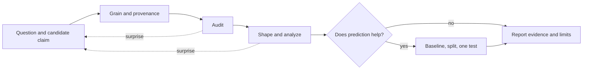
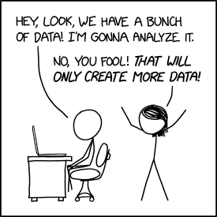

---
notion:
  title_line: "# From a Question to a Defensible Result"
  role: lecture
  status: mapped
  page_id: "2b0d9fdd-1a1a-8046-a882-cf3930ecf4de"
  url: "https://app.notion.com/p/2b0d9fdd1a1a8046a882cf3930ecf4de"
---

# From a Question to a Defensible Result

See [BONUS.md](BONUS.md) for the optional extensions.

**Live notebooks in Colab:** [Demo 1](https://colab.research.google.com/github/christopherseaman/datasci_217/blob/main/11/demo/01_setup.ipynb) · [Demo 2](https://colab.research.google.com/github/christopherseaman/datasci_217/blob/main/11/demo/02_wrangling.ipynb) · [Demo 3](https://colab.research.google.com/github/christopherseaman/datasci_217/blob/main/11/demo/03_model_prep.ipynb) · [Demo 4](https://colab.research.google.com/github/christopherseaman/datasci_217/blob/main/11/demo/04_modeling.ipynb) · [Optional geo bonus](https://colab.research.google.com/github/christopherseaman/datasci_217/blob/main/11/demo/05_geo_bonus.ipynb)


A hospital asking _how many patients will arrive at each emergency department (ED) in the next hour?_ needs tools from nearly every lecture in this course; the hard part is keeping the question, the table, and the evidence lined up.

# A flexible capstone checklist

A capstone project carries one question from source records to a stated result. You have already practiced each piece: Lecture 05's cleaning pipeline defined a data contract, then loaded, audited, decided, transformed, and validated before saving; Lecture 07's visualization contract named the question, claim, and grain before choosing a chart; Lecture 10's workflow kept an untouched test set for one final evaluation. The checklist below links those habits.

## Work in a loop, not a line

Use the checklist as a map, not a recipe card: a surprising count can send you back to the source documentation, and a plot can show that the question needs revising.



### Reference Card: project contract

| Stage | Ask | Evidence to keep |
| :--- | :--- | :--- |
| Question | What could the data support or contradict? | Focused question and candidate claim |
| Grain | What does one row represent, and how is it identified? | Grain, key, provenance, and selection rules |
| Audit | Can these records answer the question? | Coverage, types, missingness, and validation checks |
| Analysis | Which transformations answer the question without changing row meaning? | Purposeful table, summary, plot, or feature |
| Prediction | What is known at prediction time, and what is a fair comparison? | Target, baseline, split, measure, and held-out result |
| Report | What does the evidence support, and what remains uncertain? | Result, claim, and material limitation |

_Report the result without making the conclusion wear a cape it has not earned._

# Start with a question and a candidate claim

A goal such as "analyze ED visits" gives no way to decide which rows, columns, or plots matter. An **answerable question** names the unit, the outcome, and the time frame; for a forecast, that includes when the answer must be known. A **candidate claim** is a statement the evidence could support or contradict. It is Lecture 07's "audience and claim" step, applied to a whole project.

Today's worked example has the same shape with public data: a course release built from January–June 2023 NYC Yellow Taxi trip records for the 12 taxi zones with the most January pickups. Read "taxi zone" as "ED" and "pickups" as "arrivals", and every decision below carries over.

> Using information available before a target hour, how well can we predict the pickup count for each selected taxi zone in the next hour, and where are the largest errors?

| Part of the question | Taxi example | ED analog |
| --- | --- | --- |
| Unit | one taxi zone in one hour | one ED in one hour |
| Outcome | pickup count | patient arrivals |
| When it must be known | before the target hour starts | before the next staffing hour starts |
| Candidate claim | recent, weekly, and calendar history beat "same hour last week" | recent history beats "same hour last week" |

Not every question needs a model. A descriptive project can finish with a well-designed table, aggregation, and plot.

_Your capstone is not Pokémon for obscure ML: you don't have to catch 'em all._

# Grain, keys, and complete panels

Lecture 05 called it **row meaning** and Lecture 06 called it **grain**: what one row of a table represents. In a capstone, the grain changes as you work. Raw records become summaries, and summaries become model rows. Every change is a chance to count something twice or drop it silently.

Three more terms from earlier lectures keep the grain honest:

- A **key** is the column or column combination that identifies one row at the intended grain. It is Lecture 05's candidate identifier and Lecture 06's primary key, and Lecture 06's `validate=` checks depend on it.
- **Provenance** (Lecture 05) is the record of where data came from and what was done to it: source files, dates, selection rules, and file hashes. A **hash** is a short fingerprint computed from a file's bytes; change one byte and the hash changes. A **release manifest** is a file that writes provenance down so anyone can check it.
- A **panel** (Lecture 09) holds one ordered history per entity. A **complete panel** has a row for every entity at every time step, even when nothing was recorded.

In health data, a table with one row per lab result cannot be counted like a table with one row per patient. The taxi release has the same trap:

| Object | Row grain | Key | Rows | Pickups represented |
| --- | --- | --- | --- | --- |
| Cleaned teaching sample | one sampled pickup event | `course_row_id` | 13,342 | 13,342 |
| Derived full panel | one zone at one UTC hour | `pickup_zone_id` + `target_hour_utc` | 52,116 | 8,607,337 |

The sample exists for audit practice; the panel was built from all source rows. Summing the sample will never reproduce the panel.

## Time keys: order in UTC, interpret in local time

An hourly key looks simple until the clocks change. In most US time zones, one spring night jumps from 01:59 to 03:00, and one fall night repeats 01:00–01:59. Lecture 09 called these clock times **nonexistent** and **ambiguous**. A key built from local clock times breaks on both nights: the repeated hour creates duplicate keys, and the skipped hour creates a phantom gap that no data can ever fill.

| UTC key | Chicago clock | Key built from the local clock |
| --- | --- | --- |
| 2024-11-03 06:00 | 01:00 CDT (UTC−5) | `(station, 01:00)` |
| 2024-11-03 07:00 | 01:00 CST (UTC−6) | `(station, 01:00)`, a duplicate |
| 2024-11-03 08:00 | 02:00 CST (UTC−6) | `(station, 02:00)` |

The capstone rule builds on Lecture 09's advice to store times in UTC: **order, join, lag, and split in UTC; convert to local time only to interpret patterns** such as hour of day or weekday. Lecture 09's [clock-change snippet](../09/README.md#clock-changes-repeated-and-skipped-times) shows how to set repeated and skipped readings aside when you localize.

The taxi panel shows the effect: January–June 2023 has 181 local days but only 4,343 elapsed hours, not 181 × 24 = 4,344, because 12 March had 23.

## Absent row: true zero or missing?

Completing a panel means left-merging the observed rows onto an expected grid, as in Lecture 06's [cross-join snippet](../06/README.md#listing-every-combination-with-a-cross-join). Every grid row without a source row comes back as `NaN`. What that `NaN` should become depends on how the data were recorded, the same line Lecture 08 drew for empty pivot-table cells:

- **Tallied events** (taxi pickups, or ED arrivals counted from individual check-in records): no record means nothing happened, so the count is a true 0. The taxi panel has 375 zone-hours with 0 pickups for this reason; the release builder filled them before publishing.
- **Measurements and reports** (a weather sensor's temperature, a clinic's hourly arrival report): no record means nobody measured or reported, so the value stays missing. Filling it with 0 invents data.

Either way, keep a flag such as `source_observed` that records whether a source row existed, so the choice stays auditable.

### Reference Card: Grain and Coverage Checks

- `pd.read_parquet(path)`: Read a Parquet release table with its dtypes intact (Lecture 04).
- `json.load(file)`: Read a JSON manifest into a `dict` of expected facts, such as row counts (Lecture 07).
- `df.duplicated(subset=key).any()`: `True` if any key combination repeats (Lecture 05).
- `pd.date_range(start, end, freq="h", tz="UTC", inclusive="left")`: Every elapsed UTC hour in the window (Lecture 09).
- `pd.merge(entities, hours, how="cross")`: The expected grid, every entity at every hour (Lecture 06).
- `expected.merge(obs, on=key, how="left", validate="one_to_one", indicator=True)`: Keeps every expected row, raises `MergeError` if a key repeats, and adds `_merge` with `"both"` or `"left_only"` (Lecture 06).
- `panel["_merge"].eq("both")`: Boolean `source_observed` flag; `True` where a source row existed.
- `df.groupby(entity)[col].sum()`: Per-entity totals to compare with a manifest or an earlier table (Lecture 08).

### Code Snippet: A True Zero Beside a Missing Reading

One ED's hourly table joins two sources onto the same three-hour grid. Both sources have nothing at 15:00.

```python
import pandas as pd

hours = pd.DataFrame({"hour_utc": pd.date_range("2024-07-01 14:00", periods=3, freq="h", tz="UTC")})

# Tallied events: one row per ED check-in; nobody arrived at 15:00
checkins = pd.DataFrame({"hour_utc": pd.to_datetime(
    ["2024-07-01 14:00", "2024-07-01 14:00", "2024-07-01 16:00"], utc=True
)})
arrivals = checkins.groupby("hour_utc").size().rename("arrivals").reset_index()

# Measurements: one row per hourly weather reading; the sensor sent nothing at 15:00
weather = pd.DataFrame({
    "hour_utc": pd.to_datetime(["2024-07-01 14:00", "2024-07-01 16:00"], utc=True),
    "temp_c": [31.5, 33.0],
})

panel = hours.merge(arrivals, on="hour_utc", how="left", validate="one_to_one")
panel["arrivals"] = panel["arrivals"].fillna(0).astype("int64")  # no check-in: nobody arrived

panel = panel.merge(weather, on="hour_utc", how="left", validate="one_to_one", indicator=True)
panel["source_observed"] = panel["_merge"].eq("both")  # no reading: temperature unknown
print(panel.drop(columns="_merge"))
```

```text
                   hour_utc  arrivals  temp_c  source_observed
0 2024-07-01 14:00:00+00:00         2    31.5             True
1 2024-07-01 15:00:00+00:00         0     NaN            False
2 2024-07-01 16:00:00+00:00         1    33.0             True
```

The same 15:00 gap becomes 0 in one column and stays `NaN` in the other: an hour without check-ins is a count of zero, but an hour without a reading is unknown.

# Prediction time, baselines, and one honest test

A forecast is only useful if it could have been made when it was needed. The **prediction time** (Lecture 09), or **cutoff**, is when the forecast is made; the **target time** (Lecture 10) is the hour being predicted. Every feature must be known at the cutoff (Lecture 09's past-only lags and windows), and the target must never appear among the features. Using later information by accident is **leakage** (Lecture 10), and it makes a model look better than it can be in practice.

Explore on training rows only. Demo 3's training summary shows mean pickups rising from about 10 per zone-hour at 04:00 to about 293 at 18:00, which is evidence that hour of day belongs among the features. Looking at validation or test rows to choose features would leak those periods into the decision.

## Baselines and a chronological split

Two habits from Lecture 10 make the result honest:

- A **baseline** is a simple rule a model must beat. Lecture 10's **persistence** baseline predicts that the next hour equals this hour; the taxi demo uses its weekly form, "same hour last week" (`lag_168`). Without a baseline, an average miss (MAE) of 25 pickups has no reference point.
- A **chronological split** keeps time in order. Fit candidates on the earliest period and choose between them on the **validation** period. Then freeze that choice, refit it on training plus validation, and evaluate it once on the latest **test** period.

| Split | Local target hours | Rows | Used for |
| --- | --- | --- | --- |
| train | 2023-01-08 to 2023-04-30 (the first week has no week-old lag) | 32,532 | fitting and exploring patterns |
| validation | May 2023 | 8,928 | choosing between candidates |
| test | June 2023 | 8,640 | one final evaluation |

| Split | Candidate | MAE | RMSE |
| --- | --- | --- | --- |
| validation | Ridge pipeline | 25.0 | 36.5 |
| validation | same hour last week | 29.4 | 46.4 |
| test | Ridge pipeline (frozen) | 25.6 | 37.8 |
| test | same hour last week | 32.3 | 50.2 |

Validation supports the candidate claim, so the pipeline is frozen. The test rows then check that claim on unseen hours: in June 2023, for these 12 zones, the frozen pipeline missed by about 25.6 pickups per zone-hour on average, against 32.3 for the "same hour last week" baseline. The claim holds for this period; it is not a causal explanation or a promise about other months.

### Reference Card: Splits and Evaluation

| Task | Method | Purpose & arguments | Typical output |
| --- | --- | --- | --- |
| Next-hour target | `df.groupby(entity)[col].shift(-1)` | Next row's value within each entity, after sorting by entity and time (Lecture 09 lead); on a complete panel, next row means next hour | `Series`; `NaN` at each entity's last row |
| Past-only feature | `df.groupby(entity)[col].shift(1)` | Previous row's value within each entity (Lecture 09) | `Series` |
| Split boundary | `target_utc >= pd.Timestamp("2023-06-01", tz="America/New_York")` | Compare UTC target instants with a local-midnight boundary (Lecture 09 time zones) | Boolean `Series` |
| Average miss | `mean_absolute_error(y, pred)` | MAE, in the target's units (Lecture 10) | `float` |
| Large-miss penalty | `np.sqrt(mean_squared_error(y, pred))` | RMSE; same units, weights big misses more (Lecture 10) | `float` |
| Variance explained | `r2_score(y, pred)` | 1 is perfect; negative when worse than always predicting the mean (Lecture 10) | `float` |
| Feature reliance | `permutation_importance(pipe, X_val, y_val, scoring="neg_mean_absolute_error", n_repeats=10, random_state=217)` | Validation MAE increase when one feature is shuffled (Lecture 10) | Result with `.importances_mean`, `.importances_std` |

### Code Snippet: Split on a Local-Midnight Boundary

```python
import numpy as np
import pandas as pd

target_utc = pd.Series(pd.date_range("2023-06-01 02:00", periods=4, freq="h", tz="UTC"))
test_start = pd.Timestamp("2023-06-01 00:00", tz="America/New_York")  # local midnight

frame = pd.DataFrame({
    "target_utc": target_utc,
    "target_local": target_utc.dt.tz_convert("America/New_York"),
    "split": np.where(target_utc >= test_start, "test", "validation"),
})
print(test_start.tz_convert("UTC"))
print(frame)
```

```text
2023-06-01 04:00:00+00:00
                 target_utc              target_local       split
0 2023-06-01 02:00:00+00:00 2023-05-31 22:00:00-04:00  validation
1 2023-06-01 03:00:00+00:00 2023-05-31 23:00:00-04:00  validation
2 2023-06-01 04:00:00+00:00 2023-06-01 00:00:00-04:00        test
3 2023-06-01 05:00:00+00:00 2023-06-01 01:00:00-04:00        test
```

Local midnight on 1 June is 04:00 UTC during daylight saving time, so the 02:00 and 03:00 UTC targets still belong to May.



# Demo roadmap

The four core notebooks follow the taxi question from evidence to result:

1. **`01_setup.ipynb`: Trust the release before using it.** Check the release files against the manifest's hashes, inspect event-grain records, and make exclusions auditable.
2. **`02_wrangling.ipynb`: Build a past-only model table.** Load the release's already completed zone-hour panel, verify its key and coverage, then construct calendar and history features.
3. **`03_model_prep.ipynb`: Analyze training patterns and freeze the split.** Use training data for exploratory summaries and keep later periods separate.
4. **`04_modeling.ipynb`: Compare, freeze, and report.** Compare a weekly baseline with one pipeline, evaluate held-out performance, and examine error slices.

**`05_geo_bonus.ipynb`** is an optional geographic view of zone-level results; see [BONUS.md](BONUS.md). It is enrichment, not a required part of the capstone pattern.

## Where this connects to earlier lectures

Most of today's code is review; this crosswalk shows where each capstone decision, and each skill the final exam needs, was first taught. Each decision should still be justified by the question and data.

| Capstone decision or concept | Earlier canonical lecture | Related demo stage or final question |
| --- | --- | --- |
| Question, claim, and evidence | Lecture 07, Data Visualization | `01_setup.ipynb`: trust and inspect the release |
| Release files: Parquet tables and a JSON manifest | Lecture 04, Data Loading and Storage (Parquet); Lecture 07, Save the Chart and Its Record (JSON) | `01_setup.ipynb`: verify the release |
| File fingerprint: SHA-256 hash (`hashlib.sha256`) and size in bytes (`path.stat().st_size`) | Lecture 05, Data Cleaning Pipeline | `01_setup.ipynb`: verify the release; final Q1: release audit |
| Settings saved as JSON text in one CSV cell (`json.dumps`, `json.loads`) | Lecture 07, Save the Chart and Its Record | `03_model_prep.ipynb`: split manifest; final Q7 and Q8: model specification |
| Missingness, row meaning, and keys | Lecture 05, What Clean Means: The Data Contract; Handling Missing Data | `01_setup.ipynb`: audit records |
| Expected grid and coverage join | Lecture 06, Database-Style DataFrame Joins | `02_wrangling.ipynb`: verify that every zone-hour is present |
| Gap runs: consecutive missing hours within each entity | Lecture 09, Resampling Each Patient Separately | final Q3: gap summary (the taxi panel has no gaps, because an hour without trips is a true 0) |
| UTC keys, local calendar fields, and daylight-saving transitions | Lecture 09, Time Zone Handling | `02_wrangling.ipynb`: local calendar fields; `03_model_prep.ipynb`: split boundaries |
| Times written as text (`Series.dt.strftime`) | Lecture 09, pandas DatetimeIndex | `01_setup.ipynb`: audit records; final Q4: `row_id` |
| Past-only lags and rolling windows | Lecture 09, Entity-Aware Features and Past-Only Windows | `02_wrangling.ipynb`: construct history features |
| Aggregation and a question-shaped table | Lecture 08, Data Aggregation and Group Operations | `03_model_prep.ipynb`: training-only summaries; `04_modeling.ipynb`: error slices |
| Aware UTC target times compared with a zoned local cutoff | Lecture 10, Splitting on Target Time | final Q5 and Q6: split boundaries |
| Candidate models, baselines, leakage boundaries, and evaluation | Lecture 10, From Statistics to Deep Learning | `03_model_prep.ipynb`: freeze the split; `04_modeling.ipynb`: compare and evaluate |

# Transfer to the final project

Assignment 11 applies the same reasoning to Chicago beach-weather sensor data. The decisions transfer, but several answers flip. The assignment's artifact contract, not the taxi notebooks, determines what you must produce.

| Decision | Taxi demo | Beach-weather final |
| --- | --- | --- |
| Row grain | one zone at one UTC hour | one station at one UTC hour |
| Source timestamps | panel already stored in UTC | naive Chicago clock times: localize, then convert to UTC |
| Hour with no source row | true 0 (no trips) | missing (no reading), flagged by `source_observed` |
| Row timestamp | target hour; features end one hour earlier | cutoff hour; the target is one elapsed hour later |
| 24-hour rolling mean | `shift(1)` before rolling, because the row is the target hour; needs all 24 values | no shift, because the row is the cutoff; `min_periods=1`, ignoring missing values |
| Rows with gaps | rows without full history are dropped | every row stays in the feature table; modeling uses rows where `model_eligible` is true, and the pipeline's imputer fills missing predictors |
| Baseline | same hour last week (`lag_168`) | persistence: the current temperature |
| Calendar features | integer hour, weekday, month, weekend flag | sine and cosine of target hour and day of year |
| Measures | MAE, RMSE | MAE, RMSE, R² |

Lecture 10 covers the cyclic features (sine and cosine put hour 23 next to hour 0 on a circle), the persistence baseline, refitting on training plus validation, and recording a model's settings with `get_params(deep=False)`.

Do not copy taxi-specific values, features, or outputs; adapt each decision to the sensor data.

# Getting started with the demo

The commands below assume macOS, Linux, or WSL with Bash. On native Windows, open the repository in WSL because the data downloader is a Bash script and uses Unix checksum tools.

From the course repository:

```bash
cd 11/demo
uv venv --seed --python 3.13 .venv
source .venv/bin/activate
python --version  # should report Python 3.13
uv pip install -r requirements.txt
bash download_data.sh
jupyter lab
```

JupyterLab opens in your browser; open `01_setup.ipynb` and continue through `04_modeling.ipynb` in order. To skip local setup, use the Colab links at the top of this page; each notebook downloads its own data. Each notebook explains the artifact it reads or rebuilds, so you can pause between them and inspect the intermediate reasoning, not just the final output.

# Optional practice after class

- [Advent of Code](https://adventofcode.com): short programming puzzles for continued practice.
- [GameShell](https://github.com/phyver/GameShell): a game for practicing the Unix shell.


# LIVE DEMO!
