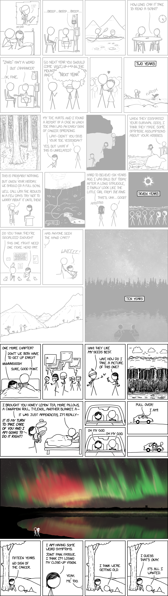
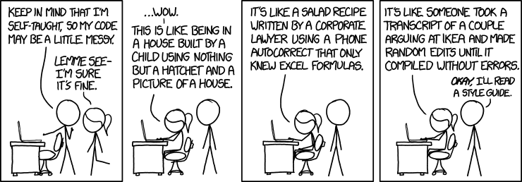

---
notion:
  role: lecture
  status: mapped
  page_id: "2b0d9fdd-1a1a-8046-a882-cf3930ecf4de"
  url: "https://app.notion.com/p/2b0d9fdd1a1a8046a882cf3930ecf4de"
---

# From a Question to a Defensible Result

See [BONUS.md](BONUS.md) for the optional extension notes.



This capstone lecture is about putting familiar tools together around a real
question. It offers a flexible checklist for keeping a project oriented, not a
claim that every project follows one complete, linear "data science lifecycle"
or a challenge to use every technique from the course.

The approach follows the spirit of McKinney's data analysis examples: understand
what the records represent, ask a focused question, and let that question determine
the useful cleaning, reshaping, summaries, plots, and—when appropriate—modeling.
The path is usually iterative. A surprising count may send us back to the source
documentation; a plot may reveal that the first question needs revision.

The current live demo uses a compact course release derived from January–June 2023
NYC Yellow Taxi trip records. It is one worked example, not a universal project
template.

## A flexible capstone checklist

Use this as a wayfinding list, not a recipe card. Revisit earlier items whenever
new evidence changes the question.

1. **Start with a question.** State what you want to learn and what evidence
   could support or contradict a candidate claim.
2. **Establish grain and provenance.** Know what a row represents, where the
   records came from, and which selection rules or keys matter.
3. **Audit before trusting.** Inspect coverage, types, missingness, and the
   checks needed to decide whether the data can answer the question.
4. **Shape and explore the evidence.** Clean, combine, transform, summarize, or
   visualize only as the question requires; check that the resulting table still
   means what you think it means.
5. **Predict only when prediction helps.** If the question calls for it, define
   the target, what would be known at prediction time, a fair evaluation, and a
   meaningful comparison. Otherwise, a descriptive result may be the finish line.
6. **Report evidence and limits.** Give the result, the claim it supports, and
   the important caveats without making the conclusion wear a cape it has not
   earned.

## Learning objectives

By the end of the session, given a dataset and an analytical question, you should
be able to:

- state an answerable question and a candidate claim that evidence could support
  or contradict;
- identify the row grain, candidate key, provenance, and important selection rules
  of both source and analysis tables;
- justify a cleaning, wrangling, aggregation, or visualization decision in terms
  of the question it helps answer, and trace a result through those decisions;
- when prediction is appropriate, specify a target, prediction time, available
  features, comparison baseline, split strategy, and evaluation measure; and
- report the observed result, the claim it supports, and a material limitation.

## What is review, and what is new?

Most of today's code is review. We will reuse DataFrame inspection, missing-value
handling, joins, `groupby`, reshaping, datetime operations, visualization, feature
construction, and the basic scikit-learn estimator interface.

The new work is integration: keep the question, possible claim, and evidence
aligned; make grain and provenance explicit; decide whether a model helps; and
carry the result's limitations into the conclusion. McKinney's examples motivate
that style of analysis, but the taxi notebooks provide today's concrete walkthrough.

## The taxi walkthrough: one example

### Begin with a question and possible claim

For the taxi example, our working question is:

> Using information available before a target hour, how well can we predict the
> pickup count for each selected taxi zone in the next hour, and where are the
> largest errors?

That question implies a prediction time, an outcome, and a unit of analysis. It
also suggests a claim the demo can test: recent history, weekly history, and
calendar position may beat a same-hour-last-week baseline. A descriptive project
might instead finish with a well-designed table, aggregation, and visualization.

### Establish grain before choosing operations

The taxi release offers two useful views of the same setting:

| View | One row represents | Key or identifier | What it can support |
| --- | --- | --- | --- |
| Event sample | one sampled pickup event | `course_row_id` | auditing fields and practicing event-level checks |
| Zone-hour panel | one selected zone at one UTC hour | (`pickup_zone_id`, `target_hour_utc`) | zone-hour counts, time patterns, and the prediction task |

The event sample cannot estimate citywide totals; the panel was built separately
from the documented source files. In the walkthrough, we verify the relevant key
and coverage, distinguish an absent row from an observed zero, use UTC to order
hours unambiguously, and use New York local time to interpret patterns.

### Let the question choose the work

The first notebook verifies the release, inspects the event-grain records, and
makes cleaning decisions explicit. The second builds the complete zone-hour panel
the prediction question needs, then adds calendar fields, lagged counts, and
rolling summaries based only on earlier hours. Merge, aggregate, reshape, or
normalize when the question calls for it—and check that the resulting table still
has the intended grain.

*Your capstone is not Pokémon for obscure ML—you don't have to catch 'em all.*

### Explore, then decide whether modeling helps

Counts, distributions, and time profiles can expose problems, plausible patterns,
and group differences before a model is useful. Each plot should have a job; an
unexpected pattern may send the analysis back to a subgroup, normalization,
cleaning decision, or narrower claim.


*Analysis should produce understanding, not an unbounded pile of artifacts.*

For prediction, ask what would be known at prediction time. The third notebook
uses training data to explore patterns and freezes a chronological split. The
fourth compares a weekly-lag baseline with one scikit-learn pipeline, chooses on
validation data, evaluates once on the held-out test period, and examines where
errors concentrate. The final claim is limited to the held-out hours and selected
zones; it is not a causal explanation or a promise about the future.

## How the lecture and walkthrough fit together

| Mode | Focus |
| --- | --- |
| Brief framing | the checklist, question and claim, grain and provenance, and prediction contract |
| Main activity | walk through the four notebooks, pausing at the decisions, checks, artifacts, and conclusions that transfer to another dataset |

The lecture supplies the reasoning; the notebooks show one implementation. The
final project's own artifact contract determines what students must produce.

## Demo roadmap

The four core notebooks follow the taxi question from evidence to result:

1. **`01_setup.ipynb` — Trust the release before using it.** Verify provenance,
   inspect event-grain records, and make exclusions auditable.
2. **`02_wrangling.ipynb` — Build a past-only model table.** Verify the zone-hour
   key and coverage, then construct interpretable calendar and history features.
3. **`03_model_prep.ipynb` — Analyze training patterns and freeze the split.** Use
   training data for exploratory summaries and keep later periods separate.
4. **`04_modeling.ipynb` — Compare, freeze, and report.** Compare a weekly baseline
   with one pipeline, evaluate held-out performance, and examine error slices.

**`05_geo_bonus.ipynb`** is an optional geographic view of zone-level results. It
is enrichment, not a required part of the capstone pattern.

### Where this connects to earlier lectures

Use this crosswalk as a set of reminders, not as a mandatory workflow. Each
decision should still be justified by the capstone question and data.

| Capstone decision or concept | Earlier canonical lecture | Related demo roadmap stage |
| --- | --- | --- |
| Question, claim, and evidence | Lecture 07, Data Visualization | `01_setup.ipynb` — trust and inspect the release |
| Missingness, row meaning, keys, and joins | Lecture 05, Handling Missing Data; Lecture 06, Database-Style DataFrame Joins | `01_setup.ipynb` — audit records; `02_wrangling.ipynb` — build the analysis table |
| Aggregation and a question-shaped table | Lecture 08, Data Aggregation and Group Operations | `02_wrangling.ipynb` — verify the zone-hour table |
| Time-aware fields and past-only features | Lecture 09, Time Series Analysis | `02_wrangling.ipynb` — construct history features |
| Candidate models, leakage boundaries, and evaluation | Lecture 10, From Statistics to Deep Learning | `03_model_prep.ipynb` — freeze the split; `04_modeling.ipynb` — compare and evaluate |

## Transfer to the final project

Assignment 11 is the larger take-home final. It applies the same reasoning to
Chicago beach-weather sensor data: question, grain, purposeful transformations,
honest evaluation, and a clear conclusion. It is not a search-and-replace copy of
the taxi notebooks; do not copy taxi-specific values, features, or outputs. Follow
the assignment's own artifact contract and adapt the choices to its data.

## Getting started with the demo

The commands below assume macOS, Linux, or WSL with Bash. On native Windows, open
the repository in WSL because the data downloader is a Bash script and uses Unix
checksum tools.

From the course repository:

```bash
cd 11/demo
uv venv --python 3.12.13 .venv
source .venv/bin/activate
python --version  # should report Python 3.12.13
uv pip install -r requirements.txt
chmod +x download_data.sh
./download_data.sh
```

Then open `01_setup.ipynb` and continue through `04_modeling.ipynb` in order. Each
notebook explains the artifact it reads or rebuilds, so you can pause between them
and inspect the intermediate reasoning—not just the final output.

## Optional practice after class

- [Advent of Code](https://adventofcode.com) — short programming puzzles for
  continued practice.
- [GameShell](https://github.com/phyver/GameShell) — a game for practicing the Unix
  shell.


