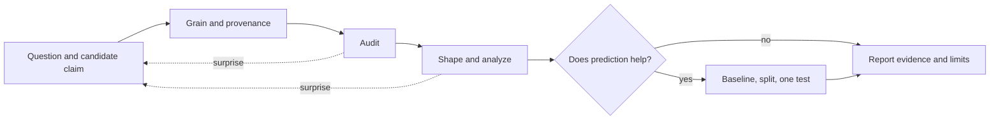

---
notion:
  title_line: "# From a Question to a Defensible Result"
  role: lecture
  status: mapped
  page_id: "2b0d9fdd-1a1a-8046-a882-cf3930ecf4de"
  url: "https://app.notion.com/p/2b0d9fdd1a1a8046a882cf3930ecf4de"
---

# From a Question to a Defensible Result

See [BONUS.md](BONUS.md) for the optional extensions.

**Live notebooks in Colab:** [Demo 1](https://colab.research.google.com/github/christopherseaman/datasci_217/blob/main/11/demo/01_setup.ipynb) · [Demo 2](https://colab.research.google.com/github/christopherseaman/datasci_217/blob/main/11/demo/02_wrangling.ipynb) · [Demo 3](https://colab.research.google.com/github/christopherseaman/datasci_217/blob/main/11/demo/03_model_prep.ipynb) · [Demo 4](https://colab.research.google.com/github/christopherseaman/datasci_217/blob/main/11/demo/04_modeling.ipynb) · [Optional geo bonus](https://colab.research.google.com/github/christopherseaman/datasci_217/blob/main/11/demo/05_geo_bonus.ipynb)


A hospital asking _how many patients will arrive at each emergency department (ED) in the next hour?_ needs tools from nearly every lecture in this course; the hard part is keeping the question, the table, and the evidence lined up.

This lecture covers:

- McKinney, _Python for Data Analysis_ (3rd ed.): 13.1 to 13.5 (data analysis examples: five public datasets carried from loading through cleaning, reshaping, aggregation, and plots)

# A flexible capstone checklist

A **capstone checklist** names the stages a project passes through on the way from one question to a result another person can check, and the evidence to keep from each. Without one, an ED arrivals analysis drifts: the question, the table, and the claim stop matching, and no one can retrace how the result was reached.

## Work in a loop, not a line


```mermaid
flowchart LR
    Q[Question and candidate claim] --> G[Grain and provenance]
    G --> A[Audit]
    A --> S[Shape and analyze]
    S --> P{Does prediction help?}
    P -- yes --> M[Baseline, split, one test]
    P -- no --> R[Report evidence and limits]
    M --> R
    A -. surprise .-> Q
    S -. surprise .-> Q
```

### Reference Card: Project Contract

| Stage | Ask | Evidence to keep |
| :--- | :--- | :--- |
| Question | What could the data support or contradict? | Focused question and candidate claim |
| Grain | What does one row represent, and how is it identified? | Grain, key, provenance, and selection rules |
| Audit | Can these records answer the question? | Coverage, types, missingness, and validation checks |
| Analysis | Which transformations answer the question without changing row meaning? | Purposeful table, summary, plot, or feature |
| Prediction | What is known at prediction time, and what is a fair comparison? | Target, baseline, split, measure, and held-out result |
| Report | What does the evidence support, and what remains uncertain? | Result, claim, and material limitation |

_Report the result without making the conclusion wear a cape it has not earned._

# Start with a question and a candidate claim

An **answerable question** names the unit, the outcome, and the time frame, including, for a forecast, when the answer must be known; a **candidate claim** is a statement the evidence could support or contradict. Together they decide which rows, columns, and plots matter, which a goal such as "analyze ED visits" never does.

The worked example has the same shape with public data: a course release built from January–June 2023 NYC Yellow Taxi trip records for the 12 taxi zones with the most January pickups. Read "taxi zone" as "ED" and "pickups" as "arrivals", and every decision below carries over.

> Using information available before a target hour, how well can we predict the pickup count for each selected taxi zone in the next hour, and where are the largest errors?

| Part of the question | Taxi example | ED analog |
| --- | --- | --- |
| Unit | one taxi zone in one hour | one ED in one hour |
| Outcome | pickup count | patient arrivals |
| When it must be known | before the target hour starts | before the next staffing hour starts |
| Candidate claim | recent, weekly, and calendar history beat "same hour last week" | recent history beats "same hour last week" |

Not every question needs a model. A descriptive project can finish with a well-designed table, aggregation, and plot.

_Your capstone is not Pokémon for obscure ML: you don't have to catch 'em all._

# Grain, keys, and complete panels

The **grain** of a table is what one row represents, such as one lab result or one patient, and its **key** is the column or columns that identify one row at that grain (Lectures 05 and 06). A project changes grain as raw records become summaries and summaries become model rows, and each change is a chance to count something twice or drop it without noticing.

The taxi release holds two grains:

| Object | Row grain | Key | Rows | Pickups represented |
| --- | --- | --- | --- | --- |
| Cleaned teaching sample | one sampled pickup event | `course_row_id` | 13,342 | 13,342 |
| Derived full panel | one zone at one UTC hour | `pickup_zone_id` + `target_hour_utc` | 52,116 | 8,607,337 |

The sample exists for audit practice; the panel was built from all source rows. Summing the sample will never reproduce the panel.

## Time keys: order in UTC, interpret in local time

An hourly key breaks when the clocks change. In most US time zones one spring night jumps from 01:59 to 03:00 and one fall night repeats 01:00–01:59, the **nonexistent** and **ambiguous** times of Lecture 09. A key built from local clock times gets a duplicate on the repeated hour and a phantom gap, which no data can ever fill, on the skipped one.

| UTC key | Chicago clock | Key built from the local clock |
| --- | --- | --- |
| 2024-11-03 06:00 | 01:00 CDT (UTC−5) | `(station, 01:00)` |
| 2024-11-03 07:00 | 01:00 CST (UTC−6) | `(station, 01:00)`, a duplicate |
| 2024-11-03 08:00 | 02:00 CST (UTC−6) | `(station, 02:00)` |

<callout icon="⚠️" color="yellow_bg">
	## Order, join, lag, and split in UTC
	Convert to local time only to interpret patterns such as hour of day or weekday. A UTC hour is always one elapsed hour, so `shift(1)` reaches the previous hour even on the nights the clocks change. Lecture 09's clock-change snippet sets repeated and skipped readings aside when you localize.
</callout>

The taxi panel shows the effect: January–June 2023 has 181 local days but only 4,343 elapsed hours, not 181 × 24 = 4,344, because 12 March had 23.

## Absent row: true zero or missing?

A **complete panel** has a row for every entity at every time step (Lecture 09), even when nothing was recorded. Building one means left-merging the observed rows onto an expected grid, as in Lecture 06's cross-join snippet. Every grid row without a source row comes back as `NaN`, and what that `NaN` should become depends on how the data were recorded, the same line Lecture 08 drew for empty pivot-table cells:

- **Tallied events** (taxi pickups, or ED arrivals counted from individual check-in records): when the event feed is complete, no record means nothing happened, so the count is 0. The release builder treated the taxi feed as complete and filled its 375 empty zone-hours with 0 pickups. A missing or delayed event feed would be unknown, not zero.
- **Measurements and reports** (a weather sensor's temperature, a clinic's hourly arrival report): no record means nobody measured or reported, so the value stays missing.

<callout icon="⚠️" color="yellow_bg">
	## A missing measurement is not a zero
	A temperature of 0 °C or a report of 0 arrivals is a real value that a model learns from, so filling a missing reading with 0 invents data. Leave it missing, and keep a flag such as `source_observed` that records whether a source row existed, so the choice stays auditable.
</callout>

### Reference Card: Grain and Coverage Checks

- `pd.read_parquet(path)`: Read a Parquet release table with its dtypes intact (Lecture 04).
- `json.load(file)`: Read a JSON **release manifest**, the file that records a release's **provenance** (sources and selection rules) and expected facts such as row counts, into a `dict` (Lecture 07).
- `hashlib.sha256(path.read_bytes()).hexdigest()`: A file's SHA-256 **hash**, a fingerprint that changes if one byte changes, to compare with the one the manifest records (Lecture 05).
- `df.duplicated(subset=key).any()`: `True` if any key combination repeats (Lecture 05).
- `pd.date_range(start_utc, end_utc, freq="h", inclusive="left")`: Every elapsed UTC hour in the window, where `start_utc` and `end_utc` are local midnights converted with `.tz_convert("UTC")` (Lecture 09).
- `pd.merge(entities, hours, how="cross")`: The expected grid, every entity at every hour (Lecture 06).
- `expected.merge(obs, on=key, how="left", validate="one_to_one", indicator=True)`: Keeps every expected row, raises `MergeError` if a key repeats, and adds `_merge` with `"both"` or `"left_only"` (Lecture 06).
- `panel["_merge"].eq("both")`: Boolean `source_observed` flag; `True` where a source row existed.
- `df.groupby(entity)[col].sum()`: Per-entity totals to compare with a manifest or an earlier table (Lecture 08).

### Code Snippet: A True Zero Beside a Missing Reading

One ED's hourly table joins two sources onto the same grid. `hours` lists three UTC hours, 14:00 to 16:00; `arrivals` counts check-ins per hour and has no 15:00 row, because nobody arrived; `weather` has no 15:00 row, because the sensor sent nothing.

```python
panel = hours.merge(arrivals, on="hour_utc", how="left", validate="one_to_one")
panel["arrivals"] = panel["arrivals"].fillna(0).astype("int64")
panel = panel.merge(weather, on="hour_utc", how="left", validate="one_to_one", indicator=True)
panel["source_observed"] = panel["_merge"].eq("both")
print(panel.drop(columns="_merge"))
```

```text
                   hour_utc  arrivals  temp_c  source_observed
0 2024-07-01 14:00:00+00:00         2    31.5             True
1 2024-07-01 15:00:00+00:00         0     NaN            False
2 2024-07-01 16:00:00+00:00         1    33.0             True
```

The same 15:00 gap becomes 0 in one column and stays `NaN` in the other: an hour without check-ins is a count of zero, but an hour without a reading is unknown.


# Prediction time, baselines, and one honest test

**Prediction time**, or the **cutoff**, is when a forecast is made, and the **target time** is the hour it predicts (Lectures 09 and 10). Every feature must be known at the cutoff: using later information is **leakage** (Lecture 10), and it makes a forecast look better than it can be in practice, like an ED staffing model that has already seen the arrivals it predicts.

## Baselines and a chronological split

- A **baseline** is a simple rule a model must beat. Lecture 10's **persistence** baseline predicts that the next hour equals this hour. The taxi demo uses its weekly form, `lag_168`: the count 168 elapsed hours earlier, usually the same local hour last week. In a week with a clock change it lands one local hour off. Without a baseline, an average miss (MAE) of 25 pickups has no reference point.
- A **chronological split** keeps time in order. Fit candidates on the earliest period and choose between them on the **validation** period. Then freeze that choice, refit it on training plus validation, and evaluate it once on the latest **test** period.

| Split | Local target hours | Rows | Used for |
| --- | --- | --- | --- |
| train | 2023-01-08 to 2023-04-30 (the first week has no week-old lag) | 32,532 | fitting and exploring patterns |
| validation | May 2023 | 8,928 | choosing between candidates |
| test | June 2023 | 8,640 | one final evaluation |

Explore on training rows only: choosing features from validation or test rows leaks those periods into the decision.

| Split | Candidate | MAE | RMSE |
| --- | --- | --- | --- |
| validation | Ridge pipeline | 25.0 | 36.5 |
| validation | same hour last week | 29.4 | 46.4 |
| test | Ridge pipeline (frozen) | 25.6 | 37.8 |
| test | same hour last week | 32.3 | 50.2 |

Validation supports the candidate claim, so the pipeline is frozen. The test rows then check that claim on unseen hours: in June 2023, for these 12 zones, the frozen pipeline missed by about 25.6 pickups per zone-hour on average, against 32.3 for the "same hour last week" baseline. The claim holds for this period; it is not a causal explanation or a promise about other months.

### Reference Card: Splits and Evaluation

| Task | Method | Purpose & arguments | Typical output |
| --- | --- | --- | --- |
| Next-hour target | `df.groupby(entity)[col].shift(-1)` | Next row's value within each entity, after sorting by entity and time (Lecture 09 lead); on a complete panel, next row means next hour | `Series`; `NaN` at each entity's last row |
| Past-only feature | `df.groupby(entity)[col].shift(1)` | Previous row's value within each entity (Lecture 09) | `Series` |
| Split boundary | `target_utc >= pd.Timestamp("2023-06-01", tz="America/New_York")` | Compare UTC target instants with a local-midnight boundary (Lecture 09 time zones) | Boolean `Series` |
| Average miss | `mean_absolute_error(y, pred)` | MAE, in the target's units (Lecture 10) | `float` |
| Large-miss penalty | `np.sqrt(mean_squared_error(y, pred))` | RMSE; same units, weights big misses more (Lecture 10) | `float` |
| Variance explained | `r2_score(y, pred)` | 1 is perfect; negative when worse than always predicting the mean (Lecture 10) | `float` |
| Feature reliance | `permutation_importance(pipe, X_val, y_val, scoring="neg_mean_absolute_error", n_repeats=10, random_state=217)` | Validation MAE increase when one feature is shuffled (Lecture 10) | Result with `.importances_mean`, `.importances_std` |

### Code Snippet: Split on a Local-Midnight Boundary

`frame` holds four target hours, 02:00 to 05:00 UTC on 1 June 2023.

```python
test_start = pd.Timestamp("2023-06-01", tz="America/New_York")
frame["target_local"] = frame["target_utc"].dt.tz_convert("America/New_York")
frame["is_test"] = frame["target_utc"] >= test_start
print(test_start.tz_convert("UTC"))
print(frame)
```

```text
2023-06-01 04:00:00+00:00
                 target_utc              target_local  is_test
0 2023-06-01 02:00:00+00:00 2023-05-31 22:00:00-04:00    False
1 2023-06-01 03:00:00+00:00 2023-05-31 23:00:00-04:00    False
2 2023-06-01 04:00:00+00:00 2023-06-01 00:00:00-04:00     True
3 2023-06-01 05:00:00+00:00 2023-06-01 01:00:00-04:00     True
```

Local midnight on 1 June is 04:00 UTC during daylight saving time, so the 02:00 and 03:00 UTC targets still belong to May.


# The worked example

The **worked example** carries the taxi question through four notebooks, one or two checklist stages each, from a release you verify to a test result you report. Each notebook runs on its own, in a new Colab runtime or a local folder, and Demo 1 starts with that setup.

1. **`01_setup.ipynb`: Trust the release before using it.** Set up Colab or a local folder, check the release files against the manifest's hashes, inspect event-grain records, and make exclusions auditable.
2. **`02_wrangling.ipynb`: Build a past-only model table.** Rebuild the expected zone-hour grid and confirm the release's panel fills it, then construct calendar and history features.
3. **`03_model_prep.ipynb`: Analyze training patterns and freeze the split.** Use training data for exploratory summaries and keep later periods separate.
4. **`04_modeling.ipynb`: Compare, freeze, and report.** Compare a weekly baseline with one pipeline on validation, evaluate both once on test, and examine error slices.

**`05_geo_bonus.ipynb`** is an optional geographic view of zone-level results; see BONUS.md. It is enrichment, not a required part of the capstone pattern.

## Where this connects to earlier lectures

Each capstone decision, and each skill the final exam needs, was first taught in an earlier lecture:

| Capstone decision or concept | Earlier canonical lecture | Related demo stage or final question |
| --- | --- | --- |
| Question, claim, and evidence | Lecture 07, Data Visualization | `01_setup.ipynb`: trust and inspect the release |
| Release files: Parquet tables and a JSON manifest | Lecture 04, Data Loading and Storage (Parquet); Lecture 07, Save the Chart and Its Record (JSON) | `01_setup.ipynb`: verify the release |
| File fingerprint: SHA-256 hash (`hashlib.sha256`) and size in bytes (`path.stat().st_size`) | Lecture 05, Data Cleaning Pipeline | `01_setup.ipynb`: verify the release; final Q1: release audit |
| Settings saved as JSON text in one CSV cell (`json.dumps`, `json.loads`) | Lecture 07, Save the Chart and Its Record | `03_model_prep.ipynb`: split manifest; final Q7 and Q8: model specification |
| Missingness, row meaning, and keys | Lecture 05, What Clean Means: The Data Contract; Handling Missing Data | `01_setup.ipynb`: audit records |
| Expected grid, coverage join, and `source_observed` | Lecture 06, Database-Style DataFrame Joins | `02_wrangling.ipynb`: confirm that every zone-hour is present; final Q3: hourly panel |
| Gap runs: consecutive missing hours within each entity | Lecture 09, Resampling Each Patient Separately | final Q3: gap summary (the taxi panel has no gaps, because an hour without trips is a true 0) |
| UTC keys, local calendar fields, and daylight-saving transitions | Lecture 09, Time Zone Handling | `02_wrangling.ipynb`: local calendar fields; `03_model_prep.ipynb`: split boundaries |
| Times written as text (`Series.dt.strftime`) | Lecture 09, pandas DatetimeIndex | `01_setup.ipynb`: audit records; final Q4: `row_id` |
| Past-only lags and rolling windows | Lecture 09, Entity-Aware Features and Past-Only Windows | `02_wrangling.ipynb`: construct history features |
| Aggregation and a question-shaped table | Lecture 08, Data Aggregation and Group Operations | `03_model_prep.ipynb`: training-only summaries; `04_modeling.ipynb`: error slices |
| Aware UTC target times compared with a zoned local cutoff | Lecture 10, Splitting on Target Time | `03_model_prep.ipynb`: split boundaries; final Q5 and Q6: split boundaries |
| Candidate models, baselines, leakage boundaries, and evaluation | Lecture 10, From Statistics to Deep Learning | `03_model_prep.ipynb`: freeze the split; `04_modeling.ipynb`: compare and evaluate |

# Transfer to the final project

The **final project**, Assignment 11, applies the same checklist to hourly readings from two Chicago beach weather stations. The decisions transfer, but several answers flip, such as what an hour without a source row means, and the assignment's `assignment.md` contract, not the taxi notebooks, sets what you must produce.

| Decision | Taxi demo | Beach-weather final |
| --- | --- | --- |
| Row grain | one zone at one UTC hour | one station at one UTC hour |
| Source timestamps | panel already stored in UTC | naive Chicago clock times: localize, then convert to UTC |
| Hour with no source row | true 0 (no trips) | missing (no reading), flagged by `source_observed` |
| Row timestamp | target hour; features end one hour earlier | cutoff hour; the target is one elapsed hour later |
| 24-hour rolling mean | `shift(1)` before rolling, because the row is the target hour; needs all 24 values | no shift, because the row is the cutoff; `min_periods=1`, ignoring missing values |
| Rows with gaps | rows without full history are dropped | every row stays in the feature table; modeling uses rows where `model_eligible` is true, and the pipeline's imputer fills missing predictors |
| Baseline | same hour last week (`lag_168`) | persistence: the current temperature |
| Calendar features | integer hour, weekday, month, weekend flag | sine and cosine of target hour and day of year |
| Measures | MAE, RMSE | MAE, RMSE, R² |

Lecture 10 covers the cyclic features (sine and cosine put hour 23 next to hour 0 on a circle), the persistence baseline, refitting on training plus validation, and recording a model's settings with `get_params(deep=False)`.

Do not copy taxi-specific values, features, or outputs; adapt each decision to the sensor data.

# Keep Practicing After the Course

Coding skill fades without use, so keep a small habit going after the final:

- [Advent of Code](https://adventofcode.com): short programming puzzles for continued practice.
- [GameShell](https://github.com/phyver/GameShell): a game for practicing the Unix shell.


# LIVE DEMO!
