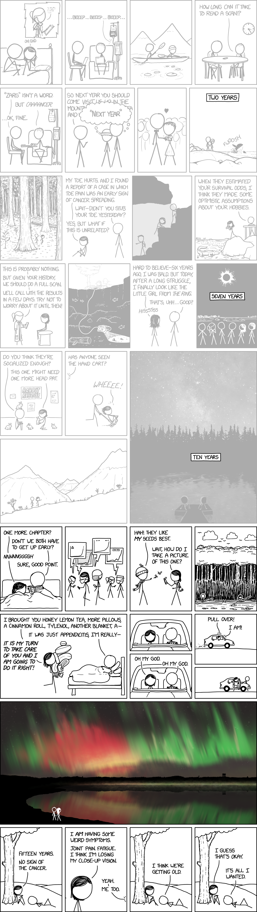
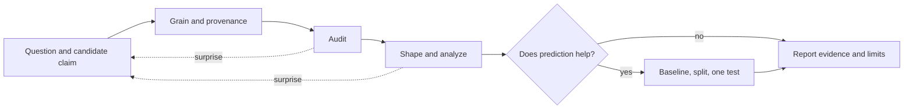
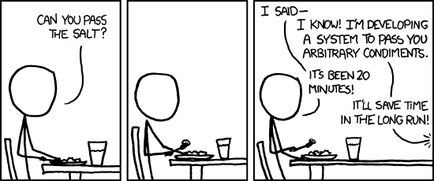
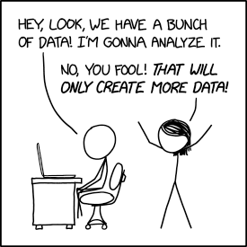

---
notion:
  title_line: "# From a Question to a Defensible Result"
  role: lecture
  status: mapped
  page_id: "2b0d9fdd-1a1a-8046-a882-cf3930ecf4de"
  url: "https://app.notion.com/p/2b0d9fdd1a1a8046a882cf3930ecf4de"
---

# From a Question to a Defensible Result

See [BONUS.md](BONUS.md) for the optional extensions.

**Live notebooks in Colab:** [Demo 1](https://colab.research.google.com/github/christopherseaman/datasci_217/blob/main/11/demo/01_setup.ipynb) · [Demo 2](https://colab.research.google.com/github/christopherseaman/datasci_217/blob/main/11/demo/02_wrangling.ipynb) · [Demo 3](https://colab.research.google.com/github/christopherseaman/datasci_217/blob/main/11/demo/03_model_prep.ipynb) · [Demo 4](https://colab.research.google.com/github/christopherseaman/datasci_217/blob/main/11/demo/04_modeling.ipynb) · [Optional geo bonus](https://colab.research.google.com/github/christopherseaman/datasci_217/blob/main/11/demo/05_geo_bonus.ipynb)

**Run locally:**

```shell
curl -fsSL https://raw.githubusercontent.com/christopherseaman/datasci_217/main/11/demo/setup_demo.sh | sh
cd ~/11-demo
uv venv --seed
source .venv/bin/activate
uv sync
```

→ Then open the `11-demo` folder in VS Code.



This lecture covers McKinney, _Python for Data Analysis_ (3rd ed.):

- Chapter 13 (data analysis examples: five public datasets carried from loading through cleaning, reshaping, aggregation, and plots)

# A flexible capstone checklist

- **Capstone checklist**: the stages a project passes through from one question to a result another person can check, and the evidence to keep from each.
- Without one, an analysis such as _how many patients will arrive at each emergency department (ED) in the next hour?_ drifts: the question, the table, and the claim stop matching, and no one can retrace the result.

## Work in a loop, not a line


```mermaid
flowchart LR
    Q[Question and candidate claim] --> G[Grain and provenance]
    G --> A[Audit]
    A --> S[Shape and analyze]
    S --> P{Does prediction help?}
    P -- yes --> M[Baseline, split, one test]
    P -- no --> R[Report evidence and limits]
    M --> R
    A -. surprise .-> Q
    S -. surprise .-> Q
```

### Reference Card: Project Contract

| Stage | Ask | Evidence to keep |
| :--- | :--- | :--- |
| Question | What could the data support or contradict? | Focused question and candidate claim |
| Grain | What does one row represent, and how is it identified? | Grain, key, provenance, and selection rules |
| Audit | Can these records answer the question? | Coverage, types, missingness, and validation checks |
| Analysis | Which transformations answer the question without changing row meaning? | Purposeful table, summary, plot, or feature |
| Prediction | What is known at prediction time, and what is a fair comparison? | Target, baseline, split, measure, and held-out result |
| Report | What does the evidence support, and what remains uncertain? | Result, claim, and material limitation |

# Start with a question and a candidate claim

- **Answerable question**: names the unit, the outcome, and the time frame, including, for a forecast, when the answer must be known.
- **Candidate claim**: a statement the evidence could support or contradict.
- Together they decide which rows, columns, and plots matter; a goal such as "analyze ED visits" never does.
- The worked example uses public data with the same shape: January–June 2023 NYC Yellow Taxi trips for the 12 zones with the most January pickups. Read "taxi zone" as "ED" and "pickups" as "arrivals".

> Using information available before a target hour, how well can we predict the pickup count for each selected taxi zone in the next hour, and where are the largest errors?

| Part of the question | Taxi example | ED analog |
| --- | --- | --- |
| Unit | one taxi zone in one hour | one ED in one hour |
| Outcome | pickup count | patient arrivals |
| When it must be known | before the target hour starts | before the next staffing hour starts |
| Candidate claim | recent, weekly, and calendar history beat "same hour last week" | recent history beats "same hour last week" |

Not every question needs a model. A descriptive project can finish with a well-designed table, aggregation, and plot.

_Your capstone is not Pokémon for obscure ML: you don't have to catch 'em all._

# Grain, keys, and complete panels

- **Grain**: what one row represents, such as one lab result or one patient.
- **Key**: the column or columns that identify one row at that grain.
- Grain changes as raw records become summaries and summaries become model rows; each change is a chance to count something twice or drop it unnoticed.

| Object | Row grain | Key | Rows | Pickups represented |
| --- | --- | --- | --- | --- |
| Cleaned teaching sample | one sampled pickup event | `course_row_id` | 13,342 | 13,342 |
| Derived full panel | one zone at one UTC hour | `pickup_zone_id` + `target_hour_utc` | 52,116 | 8,607,337 |

The sample is for audit practice; the panel was built from all source rows, so summing the sample never reproduces it.

## Time keys: order in UTC, interpret in local time

An hourly key built from local clock times breaks when the clocks change: the repeated fall hour (**ambiguous** time) makes a duplicate key, and the skipped spring hour (**nonexistent** time) makes a gap no data can fill.

| UTC key | Chicago clock | Key built from the local clock |
| --- | --- | --- |
| 2024-11-03 06:00 | 01:00 CDT (UTC−5) | `(station, 01:00)` |
| 2024-11-03 07:00 | 01:00 CST (UTC−6) | `(station, 01:00)`, a duplicate |
| 2024-11-03 08:00 | 02:00 CST (UTC−6) | `(station, 02:00)` |

<callout icon="⚠️" color="yellow_bg">
	## Order, join, lag, and split in UTC
	Convert to local time only to read patterns such as hour of day. A UTC hour is always one elapsed hour, so `shift(1)` reaches the previous hour even when the clocks change.
</callout>

The taxi panel: January–June 2023 has 181 local days but 4,343 elapsed hours, not 4,344, because 12 March had 23.

## Absent row: true zero or missing?

A **complete panel** has a row for every entity at every time step, built by left-merging observed rows onto an expected grid. Grid rows without a source row come back as `NaN`; what that becomes depends on how the data were recorded:

- **Tallied events** (taxi pickups, ED check-ins): with a complete event feed, no record means nothing happened, so the count is 0. The taxi release filled its 375 empty zone-hours with 0. A missing or delayed feed would be unknown, not zero.
- **Measurements and reports** (a sensor's temperature, a clinic's hourly report): no record means nobody measured or reported, so the value stays missing.

<callout icon="⚠️" color="yellow_bg">
	## A missing measurement is not a zero
	0 °C is a real reading, so filling a gap with 0 invents data. Leave it missing and keep a `source_observed` flag.
</callout>

### Reference Card: Grain and Coverage Checks

- `pd.read_parquet(path)`: Read a Parquet release table with its dtypes intact.
- `json.load(file)`: Read a JSON **release manifest**, the file that records a release's **provenance** (sources and selection rules) and expected facts such as row counts, into a `dict`.
- `hashlib.sha256(path.read_bytes()).hexdigest()`: A file's SHA-256 **hash**, a fingerprint that changes if one byte changes, to compare with the one the manifest records.
- `df.duplicated(subset=key).any()`: `True` if any key combination repeats.
- `pd.date_range(start_utc, end_utc, freq="h", inclusive="left")`: Every elapsed UTC hour in the window, where `start_utc` and `end_utc` are local midnights converted with `.tz_convert("UTC")`.
- `pd.merge(entities, hours, how="cross")`: The expected grid, every entity at every hour.
- `expected.merge(obs, on=key, how="left", validate="one_to_one", indicator=True)`: Keeps every expected row, raises `MergeError` if a key repeats, and adds `_merge` with `"both"` or `"left_only"`.
- `panel["_merge"].eq("both")`: Boolean `source_observed` flag; `True` where a source row existed.
- `df.groupby(entity)[col].sum()`: Per-entity totals to compare with a manifest or an earlier table.

### Code Snippet: A True Zero Beside a Missing Reading

`hours` lists three UTC hours, 14:00 to 16:00. Neither `arrivals` (nobody checked in) nor `weather` (the sensor sent nothing) has a 15:00 row.

```python
panel = hours.merge(arrivals, on="hour_utc", how="left", validate="one_to_one")
panel["arrivals"] = panel["arrivals"].fillna(0).astype("int64")
panel = panel.merge(weather, on="hour_utc", how="left", validate="one_to_one", indicator=True)
panel["source_observed"] = panel["_merge"].eq("both")
display(panel.drop(columns="_merge"))
```

|  | hour_utc | arrivals | temp_c | source_observed |
| --- | --- | --- | --- | --- |
| 0 | 2024-07-01 14:00:00+00:00 | 2 | 31.5 | True |
| 1 | 2024-07-01 15:00:00+00:00 | 0 | NaN | False |
| 2 | 2024-07-01 16:00:00+00:00 | 1 | 33.0 | True |



# Prediction time, baselines, and one honest test

- **Prediction time** (the **cutoff**): when a forecast is made.
- **Target time**: the hour it predicts.
- **Leakage**: using information from after the cutoff; it makes a forecast look better than it can be in practice, like an ED staffing model that has already seen the arrivals it predicts.

## Baselines and a chronological split

- **Baseline**: a simple rule a model must beat; without one, an average miss (MAE) of 25 pickups has no reference point. The taxi demo uses `lag_168`, the count 168 elapsed hours earlier (usually the same local hour last week; one hour off in a clock-change week).
- **Chronological split**: fit candidates on the earliest period, choose between them on the **validation** period, then freeze the choice, refit on training plus validation, and evaluate once on the latest **test** period.

| Split | Local target hours | Rows | Used for |
| --- | --- | --- | --- |
| train | 2023-01-08 to 2023-04-30 (the first week has no week-old lag) | 32,532 | fitting and exploring patterns |
| validation | May 2023 | 8,928 | choosing between candidates |
| test | June 2023 | 8,640 | one final evaluation |

Explore on training rows only: choosing features from validation or test rows leaks those periods into the decision.

| Split | Candidate | MAE | RMSE |
| --- | --- | --- | --- |
| validation | Ridge pipeline | 25.0 | 36.5 |
| validation | same hour last week | 29.4 | 46.4 |
| test | Ridge pipeline (frozen) | 25.6 | 37.8 |
| test | same hour last week | 32.3 | 50.2 |

Validation supports the claim, so the pipeline is frozen; on unseen June 2023 hours it missed by 25.6 pickups per zone-hour against the baseline's 32.3. The claim holds for this period; it is not a causal explanation or a promise about other months.

### Reference Card: Splits and Evaluation

| Task | Method | Purpose & arguments | Typical output |
| --- | --- | --- | --- |
| Next-hour target | `df.groupby(entity)[col].shift(-1)` | Next row's value within each entity, after sorting by entity and time; on a complete panel, next row means next hour | `Series`; `NaN` at each entity's last row |
| Past-only feature | `df.groupby(entity)[col].shift(1)` | Previous row's value within each entity | `Series` |
| Split boundary | `target_utc >= pd.Timestamp("2023-06-01", tz="America/New_York")` | Compare UTC target instants with a local-midnight boundary | Boolean `Series` |
| Average miss | `mean_absolute_error(y, pred)` | MAE, in the target's units | `float` |
| Large-miss penalty | `np.sqrt(mean_squared_error(y, pred))` | RMSE; same units, weights big misses more | `float` |
| Variance explained | `r2_score(y, pred)` | 1 is perfect; negative when worse than always predicting the mean | `float` |
| Feature reliance | `permutation_importance(pipe, X_val, y_val, scoring="neg_mean_absolute_error", n_repeats=10, random_state=217)` | Validation MAE increase when one feature is shuffled | Result with `.importances_mean`, `.importances_std` |

### Code Snippet: Split on a Local-Midnight Boundary

`frame` holds four target hours, 02:00 to 05:00 UTC on 1 June 2023.

```python
test_start = pd.Timestamp("2023-06-01", tz="America/New_York")
frame["target_local"] = frame["target_utc"].dt.tz_convert("America/New_York")
frame["is_test"] = frame["target_utc"] >= test_start
print(test_start.tz_convert("UTC"))
display(frame)
```

```text
2023-06-01 04:00:00+00:00
```

|  | target_utc | target_local | is_test |
| --- | --- | --- | --- |
| 0 | 2023-06-01 02:00:00+00:00 | 2023-05-31 22:00:00-04:00 | False |
| 1 | 2023-06-01 03:00:00+00:00 | 2023-05-31 23:00:00-04:00 | False |
| 2 | 2023-06-01 04:00:00+00:00 | 2023-06-01 00:00:00-04:00 | True |
| 3 | 2023-06-01 05:00:00+00:00 | 2023-06-01 01:00:00-04:00 | True |



# The worked example

- **Worked example**: the taxi question carried through four notebooks, one or two checklist stages each, from a release you verify to a test result you report.
- Each notebook runs on its own, in a new Colab runtime or a local folder.

1. **`01_setup.ipynb`: Trust the release before using it.** Set up Colab or a local folder, check the release files against the manifest's hashes, inspect event-grain records, and make exclusions auditable.
2. **`02_wrangling.ipynb`: Build a past-only model table.** Rebuild the expected zone-hour grid and confirm the release's panel fills it, then construct calendar and history features.
3. **`03_model_prep.ipynb`: Analyze training patterns and freeze the split.** Use training data for exploratory summaries and keep later periods separate.
4. **`04_modeling.ipynb`: Compare, freeze, and report.** Compare a weekly baseline with one pipeline on validation, evaluate both once on test, and examine error slices.

**`05_geo_bonus.ipynb`**: an optional geographic view of zone-level results.

## Where this connects to earlier lectures

| Capstone decision or concept | Earlier canonical lecture | Related demo stage or final question |
| --- | --- | --- |
| Question, claim, and evidence | Lecture 07, Data Visualization | `01_setup.ipynb`: trust and inspect the release |
| Release files: Parquet tables and a JSON manifest | Lecture 04, Data Loading and Storage (Parquet); Lecture 07, Save the Chart and Its Record (JSON) | `01_setup.ipynb`: verify the release |
| File fingerprint: SHA-256 hash (`hashlib.sha256`) and size in bytes (`path.stat().st_size`) | Lecture 05, Data Cleaning Pipeline | `01_setup.ipynb`: verify the release; final Q1: release audit |
| Settings saved as JSON text in one CSV cell (`json.dumps`, `json.loads`) | Lecture 07, Save the Chart and Its Record | `03_model_prep.ipynb`: split manifest; final Q7 and Q8: model specification |
| Missingness, row meaning, and keys | Lecture 05, What Clean Means: The Data Contract; Handling Missing Data | `01_setup.ipynb`: audit records |
| Expected grid, coverage join, and `source_observed` | Lecture 06, Database-Style DataFrame Joins | `02_wrangling.ipynb`: confirm that every zone-hour is present; final Q3: hourly panel |
| Gap runs: consecutive missing hours within each entity | Lecture 09, Resampling Each Patient Separately | final Q3: gap summary (the taxi panel has no gaps, because an hour without trips is a true 0) |
| UTC keys, local calendar fields, and daylight-saving transitions | Lecture 09, Time Zone Handling | `02_wrangling.ipynb`: local calendar fields; `03_model_prep.ipynb`: split boundaries |
| Times written as text (`Series.dt.strftime`) | Lecture 09, pandas DatetimeIndex | `01_setup.ipynb`: audit records; final Q4: `row_id` |
| Past-only lags and rolling windows | Lecture 09, Entity-Aware Features and Past-Only Windows | `02_wrangling.ipynb`: construct history features |
| Aggregation and a question-shaped table | Lecture 08, Data Aggregation and Group Operations | `03_model_prep.ipynb`: training-only summaries; `04_modeling.ipynb`: error slices |
| Aware UTC target times compared with a zoned local cutoff | Lecture 10, Splitting on Target Time | `03_model_prep.ipynb`: split boundaries; final Q5 and Q6: split boundaries |
| Cyclic calendar features (sine and cosine) and recorded model settings (`get_params(deep=False)`) | Lecture 10, From Statistics to Deep Learning | final Q4: calendar features; final Q7: model specification |
| Candidate models, baselines, leakage boundaries, and evaluation | Lecture 10, From Statistics to Deep Learning | `03_model_prep.ipynb`: freeze the split; `04_modeling.ipynb`: compare and evaluate |

# Transfer to the final project

- **Final project** (Assignment 11): the same checklist applied to hourly readings from two Chicago beach weather stations.
- The decisions transfer, but several answers flip; the assignment's `assignment.md` contract, not the taxi notebooks, sets what you must produce.

| Decision | Taxi demo | Beach-weather final |
| --- | --- | --- |
| Row grain | one zone at one UTC hour | one station at one UTC hour |
| Source timestamps | panel already stored in UTC | naive Chicago clock times: localize, then convert to UTC |
| Hour with no source row | true 0 (no trips) | missing (no reading), flagged by `source_observed` |
| Row timestamp | target hour; features end one hour earlier | cutoff hour; the target is one elapsed hour later |
| 24-hour rolling mean | `shift(1)` before rolling, because the row is the target hour; needs all 24 values | no shift, because the row is the cutoff; `min_periods=1`, ignoring missing values |
| Rows with gaps | rows without full history are dropped | every row stays in the feature table; modeling uses rows where `model_eligible` is true, and the pipeline's imputer fills missing predictors |
| Baseline | same hour last week (`lag_168`) | persistence: the current temperature |
| Calendar features | integer hour, weekday, month, weekend flag | sine and cosine of target hour and day of year |
| Measures | MAE, RMSE | MAE, RMSE, R² |

Do not copy taxi-specific values, features, or outputs; adapt each decision to the sensor data.

# Keep Practicing After the Course

Coding skill fades without use, so keep a small habit going after the final:

- [Advent of Code](https://adventofcode.com): short programming puzzles for continued practice.
- [GameShell](https://github.com/phyver/GameShell): a game for practicing the Unix shell.


# LIVE DEMO!

[Open Demo 1 in Colab](https://colab.research.google.com/github/christopherseaman/datasci_217/blob/main/11/demo/01_setup.ipynb)
