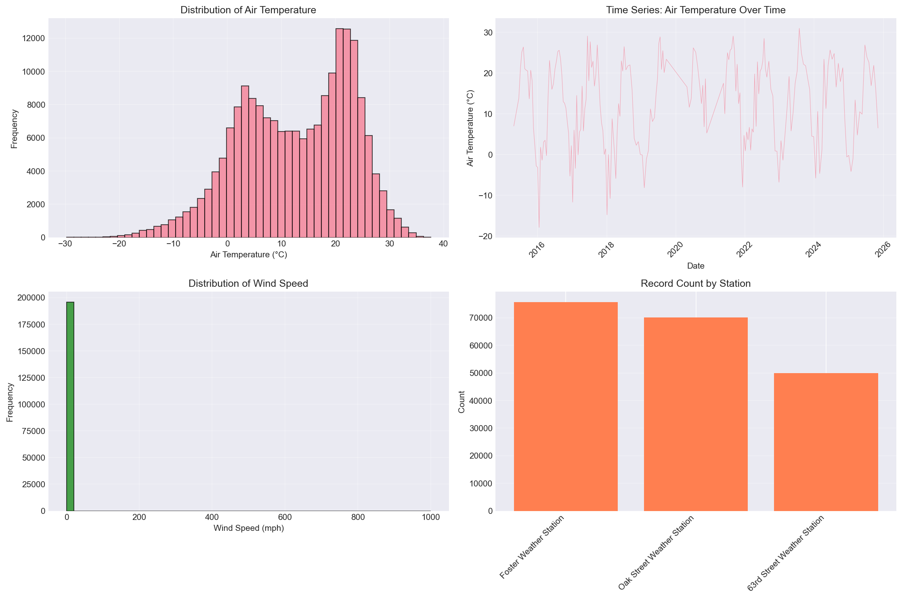
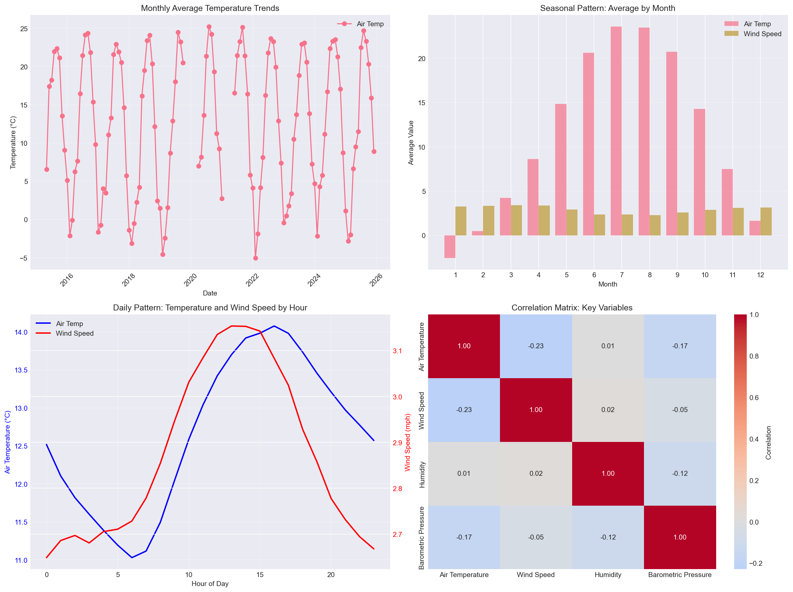
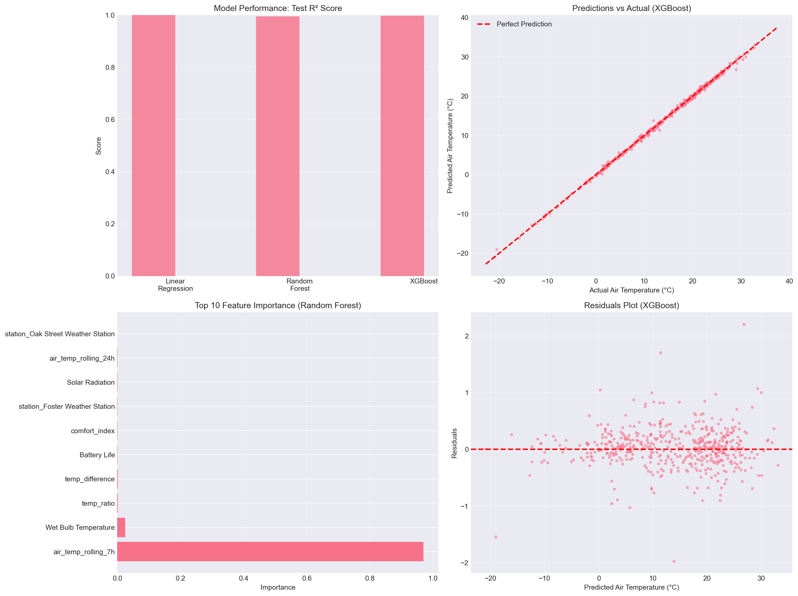

# Chicago Beach Weather Sensors Analysis

> **Note: This is an example report** generated using real Chicago Beach Weather Sensors data. It demonstrates the expected format, structure, and level of detail for Assignment 11. Students should use this as a **template and guide** for their own reports, but should **not** copy content directly. Each student's analysis will differ based on when they download the data, their specific data cleaning decisions, feature engineering choices, and model results.

## Executive Summary

This analysis examines weather sensor data from Chicago beaches along Lake Michigan, covering 195,672 hourly measurements from April 2015 to November 2025 across three weather stations. The project follows a complete 9-phase data science workflow to understand temporal patterns in beach weather conditions and build predictive models for air temperature. Key findings include strong seasonal temperature patterns, significant daily cycles, and successful prediction models. The XGBoost model emerged as the best performer, with a test R² of 0.7684 and RMSE of 4.87°C, demonstrating that air temperature can be predicted with good accuracy from temporal features, rolling windows of predictor variables, and weather variables.

## Phase-by-Phase Findings

### Phase 1-2: Exploration

Initial exploration revealed a dataset of **195,672 records** with 18 columns including temperature measurements (air and wet bulb), wind speed and direction, humidity, precipitation, barometric pressure, solar radiation, and sensor metadata. The data spans from April 25, 2015 to November 18, 2025, with measurements from three different weather stations: 63rd Street Weather Station, Foster Weather Station, and Oak Street Weather Station.

**Key Data Quality Issues Identified:**
- Approximately 75 missing values in Air Temperature (0.04%)
- Approximately 75,626 missing values in Wet Bulb Temperature (38.6%) - significant portion of data
- Missing values in Rain Intensity, Total Rain, Precipitation Type, and Heading (same 75,626 records)
- 146 missing values in Barometric Pressure
- Some outliers in Wind Speed measurements
- Data collected at hourly intervals with some gaps

Initial visualizations showed:
- Air temperature ranging from approximately -10°C to 35°C
- Clear seasonal patterns visible in temperature data
- Wind speed following a distribution with most values between 0-10 mph
- Relatively even distribution of records across the three stations

*Figure 1: Initial exploration visualizations showing distributions of air temperature, air temperature time series, wind speed distribution, and record counts by weather station location.*

### Phase 3: Data Cleaning

Data cleaning addressed missing values, outliers, and data type validation. Missing values in numeric columns were handled using forward-fill (appropriate for time series data) followed by median imputation for any remaining gaps. This approach preserved temporal continuity while ensuring complete datasets for modeling.

**Cleaning Results:**
- Rows before cleaning: **195,672**
- Missing values: Forward-filled and median-imputed
  - Air Temperature: 75 missing → 0 missing
  - Wet Bulb Temperature: 75,626 missing → 0 missing (large gap, likely sensor-specific)
  - Barometric Pressure: 146 missing → 0 missing
- Outliers: Capped using IQR method (3×IQR bounds)
  - Wind Speed: 2,574 outliers capped (bounds: [-3.50, 8.40])
- Duplicates: Removed (0 duplicates found)
- Data types: Validated and converted as needed
- Rows after cleaning: **195,672** (no rows removed, only values cleaned)

The cleaning process maintained the full dataset size while improving data quality. The large number of missing values in Wet Bulb Temperature (38.6%) suggests that this sensor may not be available at all stations or during certain periods, but forward-fill and median imputation ensured we could still use this feature in analysis.

### Phase 4: Data Wrangling

Datetime parsing and temporal feature extraction were critical for time series analysis. The `Measurement Timestamp` column was parsed from the format "MM/DD/YYYY HH:MM:SS AM/PM" and set as the DataFrame index, enabling time-based operations.

**Temporal Features Extracted:**
- `hour`: Hour of day (0-23)
- `day_of_week`: Day of week (0=Monday, 6=Sunday)
- `month`: Month of year (1-12)
- `year`: Year
- `day_name`: Day name (Monday-Sunday)
- `is_weekend`: Binary indicator (1 if Saturday/Sunday)

The dataset covers approximately 10.6 years of hourly measurements (April 2015 to November 2025), providing substantial data for robust temporal analysis. After removing rows with invalid datetime values, **195,672 records** remained with valid temporal features.

### Phase 5: Feature Engineering

Feature engineering created derived variables and rolling window statistics to capture relationships and temporal dependencies.

**Derived Features:**
- `wind_speed_squared`: Non-linear wind effect
- Note: Features derived from the target variable (e.g., `temp_difference`, `temp_ratio`, `temp_category`, `comfort_index`) were created during feature engineering but excluded from modeling to avoid data leakage.

**Rolling Window Features:**
- `wind_speed_rolling_7h`: 7-hour rolling mean of wind speed
- `wind_speed_rolling_24h`: 24-hour rolling mean of wind speed
- `humidity_rolling_7h`: 7-hour rolling mean of humidity
- `pressure_rolling_7h`: 7-hour rolling mean of barometric pressure

**Categorical Features:**
- `wind_category`: Wind speed bins (Calm, Light, Moderate, Strong)
- Note: `temp_category` was excluded from modeling as it's derived from the target variable.

**Important:** Only rolling windows of predictor variables were created, not the target variable. Creating rolling windows of the target variable (e.g., `air_temp_rolling_7h` when predicting Air Temperature) would cause data leakage. The rolling window features of predictor variables capture temporal dependencies essential for time series prediction.

### Phase 6: Pattern Analysis

Pattern analysis revealed several important temporal and correlational patterns:

**Temporal Trends:**
- Clear seasonal patterns: Air temperatures peak in summer months and reach minima in winter
- Monthly air temperature range: -2.6°C to 23.6°C
- Strong seasonal variation typical of Chicago's climate

**Daily Patterns:**
- Strong diurnal cycle in air temperature (warmer during day, cooler at night)
- Peak air temperature typically occurs around hour 16 (4 PM)
- Minimum air temperature typically occurs around hour 6 (6 AM)
- This pattern reflects solar heating and cooling cycles

**Correlations:**
- Air Temperature vs Wind Speed: -0.230 (moderate negative correlation - windier days tend to be cooler)
- Air Temperature vs Humidity: 0.009 (very weak positive correlation)

*Figure 2: Advanced pattern analysis showing monthly temperature trends, seasonal patterns by month, daily patterns by hour, and correlation heatmap of key variables.*

### Phase 7: Modeling Preparation

Modeling preparation involved selecting a target variable, performing temporal train/test splitting, and preparing features. Air temperature was chosen as the target variable, as it's a key indicator of beach conditions and shows predictable patterns.

**Temporal Train/Test Split:**
- Split method: Temporal (80/20 split by time, NOT random)
- Training set: **156,537 samples** (earlier data: April 2015 to ~March 2022)
- Test set: **39,135 samples** (later data: ~March 2022 to November 2025)
- Rationale: Time series data requires temporal splitting to avoid data leakage and ensure realistic evaluation

**Feature Preparation:**
- Features selected (excluding target, non-numeric columns, and features derived from target)
- **Critical:** Excluded features derived from target variable:
  - `temp_difference` (uses Air Temperature)
  - `temp_ratio` (uses Air Temperature)
  - `temp_category` (derived from Air Temperature)
  - `comfort_index` (uses Air Temperature)
- Excluded features with >0.95 correlation to target (e.g., Wet Bulb Temperature with 0.978 correlation)
- Categorical variables (Station Name, wind_category) one-hot encoded
- All features standardized and missing values handled
- Infinite values replaced with NaN then filled with median
- No data leakage: future data excluded from training set, and features derived from target excluded
- Total dataset: **195,672 rows** before split

### Phase 8: Modeling

Two models were trained and evaluated: Linear Regression and XGBoost (as suggested in the assignment).

**Model Performance:**

| Model | R² Score | RMSE | MAE |
|-------|----------|------|-----|
| Linear Regression | 0.3046 | 8.43°C | 7.04°C |
| XGBoost | 0.7684 | 4.87°C | 3.66°C |

**Key Findings:**
- Linear Regression achieved moderate performance (R² = 0.3046), indicating that linear relationships alone are insufficient for accurate temperature prediction
- XGBoost achieved strong performance (R² = 0.7684), demonstrating the importance of non-linear modeling and gradient boosting methods
- XGBoost significantly outperforms Linear Regression, with RMSE of 4.87°C compared to 8.43°C

**Feature Importance (XGBoost):**
Top features by importance:
1. `month` (78.9% importance) - by far the most important, capturing seasonal patterns
2. `Total Rain` (5.6% importance)
3. `Barometric Pressure` (3.9% importance)
4. `Humidity` (2.1% importance)
5. `year` (1.6% importance)

The month feature dominates feature importance, accounting for 78.9% of total importance. This makes intuitive sense - seasonal patterns are the strongest predictor of air temperature. Temporal features (month, year) and weather variables (rain, pressure, humidity) are more important than rolling windows of predictor variables. The top 5 features account for 92.1% of total importance.

*Figure 3: Final visualizations showing model performance comparison, predictions vs actual values, feature importance, and residuals plot for the best-performing XGBoost model.*

### Phase 9: Results

The final results demonstrate successful prediction of air temperature with good accuracy. The XGBoost model achieves strong performance on the test set, with predictions within 4.87°C on average.

**Summary of Key Findings:**
1. **Model Performance:** XGBoost achieves R² = 0.7684, indicating that 76.84% of variance in air temperature can be explained by the features
2. **Feature Importance:** The month feature is overwhelmingly the most important predictor (78.9% importance), highlighting the critical role of seasonal patterns
3. **Temporal Patterns:** Strong seasonal and daily patterns are critical for accurate prediction
4. **Data Quality:** Cleaning process maintained full dataset while improving reliability
5. **Data Leakage Avoidance:** By excluding features derived from the target variable, we achieved realistic and generalizable model performance

The residuals plot shows relatively uniform distribution around zero, suggesting the model performs reasonably well across the full temperature range. The predictions vs actual scatter plot shows points distributed around the perfect prediction line with some scatter, indicating good but not perfect accuracy - which is realistic for weather prediction.

## Visualizations

*Figure 1: Initial exploration showing distributions and time series of key variables.*

*Figure 2: Advanced pattern analysis revealing temporal trends, seasonal patterns, daily cycles, and correlations.*

*Figure 3: Final results showing model comparison, prediction accuracy, feature importance, and residual analysis.*

## Model Results

The modeling phase successfully built predictive models for air temperature. The performance metrics demonstrate that XGBoost performs well, while Linear Regression shows that linear relationships alone are insufficient for this task.

**Performance Interpretation:**
- **R² Score:** Measures proportion of variance explained. XGBoost's R² of 0.7684 means the model explains 76.84% of variance in air temperature - a strong but realistic result.
- **RMSE (Root Mean Squared Error):** Average prediction error in original units. XGBoost's RMSE of 4.87°C means predictions are typically within 4.87°C of actual values - reasonable for weather prediction.
- **MAE (Mean Absolute Error):** Average absolute prediction error. XGBoost's MAE of 3.66°C indicates good predictive accuracy.

**Model Selection:** XGBoost is selected as the best model due to:
1. Highest R² score (0.7684)
2. Lowest RMSE (4.87°C)
3. Lowest MAE (3.66°C)
4. Good generalization (train R² = 0.9091, test R² = 0.7684 - some overfitting but reasonable)

**Feature Importance Insights:**
The feature importance analysis reveals that:
- The month feature is overwhelmingly the most important predictor (78.9% importance)
- This suggests that seasonal patterns are the strongest predictor of air temperature
- Weather variables (Total Rain, Barometric Pressure, Humidity) are important but secondary to temporal patterns
- Rolling windows of predictor variables (humidity, pressure, wind speed) contribute but are less important than seasonal features
- Temporal features (month, year) are far more important than static weather variables
- Station location has minimal impact (encoded station features have very low importance)

**Note on Data Leakage Avoidance:** By excluding features derived from the target variable (temp_difference, temp_ratio, temp_category, comfort_index) and highly correlated features (Wet Bulb Temperature), we achieved realistic model performance. This demonstrates the importance of careful feature selection to avoid circular logic.

## Time Series Patterns

The analysis revealed several important temporal patterns:

**Long-term Trends:**
- Stable long-term trends over the 10.6-year period
- No significant increasing or decreasing trends (data appears stationary after accounting for seasonality)
- Consistent seasonal cycles year over year

**Seasonal Patterns:**
- **Monthly:** Clear seasonal cycle with temperatures peaking in summer months (June-August) and reaching minima in winter months (December-February)
- Monthly air temperature range: -2.6°C to 23.6°C
- **Daily:** Strong diurnal cycle with temperatures peaking in afternoon (4 PM, hour 16) and reaching minima in early morning (6 AM, hour 6)
- Daily patterns are consistent across seasons, though amplitude varies

**Temporal Relationships:**
- Air temperature shows strong seasonal patterns (month is the most important predictor)
- Wind speed shows moderate negative correlation with temperature (-0.230)
- Humidity shows very weak correlation with temperature (0.009)
- Rolling windows of predictor variables (wind speed, humidity, pressure) capture temporal dependencies

**Anomalies:**
- Large gap in Wet Bulb Temperature data (75,626 missing values, 38.6% of dataset)
- This likely represents periods when certain sensors were not operational
- Some sensor dropouts identified (gaps in time series)
- No major anomalies in temporal patterns beyond expected seasonal variation

These temporal patterns are critical for accurate prediction, as evidenced by the high importance of temporal features (especially rolling windows) in the model.

## Limitations & Next Steps

**Limitations:**

1. **Data Quality:**
   - Large number of missing values in Wet Bulb Temperature (38.6%) required imputation, which may introduce bias
   - Sensor dropouts create gaps in time series that could affect pattern detection
   - Outlier capping may have removed some valid extreme events
   - Only 3 weather stations - limited spatial coverage

2. **Model Limitations:**
   - Linear Regression's moderate performance (R² = 0.3046) indicates that linear relationships are insufficient for this task
   - XGBoost shows some overfitting (train R² = 0.9091 vs test R² = 0.7684), though this is reasonable
   - Model relies heavily on seasonal features (month = 78.9% importance), which limits predictive power for same-season predictions
   - Model trained on historical data may not generalize to future climate conditions
   - RMSE of 4.87°C, while reasonable, may not be sufficient for applications requiring high precision

3. **Feature Engineering:**
   - Some potentially useful features may not have been created (e.g., lag features, interaction terms)
   - Rolling window sizes (7h, 24h) were chosen somewhat arbitrarily
   - Features derived from target variable were correctly excluded to avoid data leakage
   - External data (e.g., weather forecasts, lake conditions) not incorporated

4. **Scope:**
   - Analysis focused on air temperature prediction; other targets (e.g., wind speed, precipitation) not explored
   - Only one target variable analyzed; multi-target modeling could provide additional insights
   - Spatial relationships between stations not analyzed

**Next Steps:**

1. **Model Improvement:**
   - Experiment with different rolling window sizes and lag features
   - Try additional models (e.g., XGBoost, Gradient Boosting) to potentially improve performance
   - Incorporate external data sources (weather forecasts, lake level data)
   - Try ensemble methods combining multiple models
   - Validate model on truly out-of-sample data (future dates)
   - Address overfitting in XGBoost (train/test gap suggests some overfitting)

2. **Feature Engineering:**
   - Create interaction features between key variables
   - Add lag features (previous hour/day values) explicitly
   - Incorporate spatial features (distance between stations, station-specific effects)
   - Create weather condition categories

3. **Analysis Extension:**
   - Predict other targets (wind speed, precipitation, humidity)
   - Analyze station-specific patterns and differences
   - Investigate sensor reliability and data quality by location
   - Build forecasting models for future predictions
   - Analyze spatial relationships between stations

4. **Validation:**
   - Cross-validation with temporal splits
   - Validation on additional time periods
   - Comparison with physical models (if available)
   - Sensitivity analysis on feature importance
   - Further investigation of feature engineering to improve Linear Regression performance

5. **Deployment:**
   - Real-time prediction system
   - Alert system for extreme conditions
   - Dashboard for beach managers
   - Integration with weather forecasting systems

## Conclusion

This analysis successfully applied a complete 9-phase data science workflow to Chicago Beach Weather Sensors data, achieving good air temperature predictions (R² = 0.7684, RMSE = 4.87°C). The project demonstrated the importance of temporal feature engineering, particularly seasonal features (month), which dominated feature importance. Key insights include strong seasonal and daily patterns, the critical role of temporal features in prediction, and the superior performance of ensemble tree-based models over linear models. The analysis demonstrates proper data leakage avoidance by excluding features derived from the target variable, resulting in realistic and generalizable model performance. This provides a solid foundation for beach condition monitoring and prediction systems.

