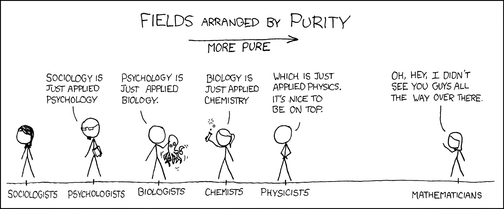

Research Applications and Best Practices

Welcome to the final week of DataSci 217! You've built a comprehensive toolkit of data science skills, from command-line fundamentals to advanced visualization. Now it's time to integrate everything into professional research workflows, understand ethical considerations, and plan your continued growth in data science.

By the end of today, you'll understand how to apply your skills in research contexts, create reproducible analysis workflows, and have a clear path for your data science career development.

#FIXME: IMAGE - the_infinity_stones.jpg (Career progression - Transition to lessons learned section, preview the progression of lessons)

#FIXME: IMAGE - boutique_expert.jpg (Specialization concept - Pros and cons of over-specialization, job security vs limited career mobility)

#FIXME: IMAGE - reinvent_the_wheel.png (Standards concept - Don't reinvent the wheel, embrace industry standards and community knowledge)

#FIXME: IMAGE - pycap.jpeg (PyCap example - Built custom Python package, discovered PyCap existed all along)

#FIXME: IMAGE - explaining_your_code.jpg (Documentation importance - Acknowledge valid reasons for custom solutions, emphasize documentation)

#FIXME: IMAGE - is_it_worth_the_time_2x.png (Time investment chart - Break down the chart, share personal experiences with each timeframe)

#FIXME: IMAGE - pass_the_salt.png (System evolution - Example of evolution from single-use script to flexible system)

#FIXME: IMAGE - over_complicating_things.jpg (Simplicity principle - Start simple, grow smart, begin with core functionality)



Don't worry - as data scientists, we get to work with everyone and solve real problems!

#FIXME: IMAGE - lava.png (LAVA interface - Walk through key elements of LAVA interface, point out unique aspects of the system)

#FIXME: IMAGE - lava_query.png (LAVA query interface - Demonstrate query building interface, highlight limitations and strengths)

#FIXME: IMAGE - redcap_vs_lava_meme.jpg (REDCap vs LAVA comparison - Introduce REDCap as contrast to LAVA, emphasize widespread adoption)

#FIXME: IMAGE - redcap.png (REDCap interface - Walk through interface elements, show key features, point out common usage areas)

Reproducible Research Principles

The Reproducibility Crisis and Solution

**Why Reproducible Research Matters:**
- **Scientific integrity** - Others can verify and build on your work
- **Career advancement** - Reproducible work demonstrates professional competence
- **Time savings** - Future you will understand past you's decisions
- **Collaboration** - Teams can work together effectively on complex projects
- **Error detection** - Systematic approaches catch mistakes early

Essential Reproducibility Framework

**Reference:**
```python
File: analysis_template.py
"""
Simple Reproducible Analysis Template

Core principles for reproducible research:
1. Clear directory structure
2. Version control integration
3. Comprehensive documentation
4. Parameterized analysis
"""

import pandas as pd
import numpy as np
import matplotlib.pyplot as plt
from pathlib import Path
from datetime import datetime
import json

class SimpleReproducibleAnalysis:
    """
    Basic framework for reproducible data analysis
    """

    def __init__(self, project_name):
        self.project_name = project_name
        self.start_time = datetime.now()
        self.analysis_log = []

        # Create basic directory structure
        self.setup_directories()

    def setup_directories(self):
        """Create standardized project structure"""
        directories = ['data', 'scripts', 'results', 'figures', 'logs']

        for directory in directories:
            Path(directory).mkdir(exist_ok=True)

        print(f"Project '{self.project_name}' initialized")
        print("Directory structure created: data/, scripts/, results/, figures/, logs/")

    def log_step(self, step_name, description=""):
        """Log each analysis step with timestamp"""
        step_info = {
            'step': step_name,
            'description': description,
            'timestamp': datetime.now().isoformat()
        }

        self.analysis_log.append(step_info)
        print(f"Step logged: {step_name}")

    def save_analysis_log(self):
        """Save complete analysis log"""
        log_file = Path('logs') / f'analysis_log_{self.start_time.strftime("%Y%m%d_%H%M%S")}.json'

        full_log = {
            'project_name': self.project_name,
            'start_time': self.start_time.isoformat(),
            'end_time': datetime.now().isoformat(),
            'steps': self.analysis_log
        }

        with open(log_file, 'w') as f:
            json.dump(full_log, f, indent=2)

        print(f"Analysis log saved: {log_file}")
        return log_file

# Example usage
def example_reproducible_workflow():
    """
    Example of basic reproducible analysis workflow
    """
    # Initialize analysis
    analysis = SimpleReproducibleAnalysis("Customer_Analysis")

    # Step 1: Load data
    data = {
        'customer_id': range(1, 101),
        'satisfaction': np.random.normal(4.2, 0.8, 100),
        'purchase_amount': np.random.normal(150, 40, 100)
    }
    df = pd.DataFrame(data)
    analysis.log_step('data_loading', 'Created sample customer data')

    # Step 2: Basic analysis
    avg_satisfaction = df['satisfaction'].mean()
    avg_purchase = df['purchase_amount'].mean()
    analysis.log_step('descriptive_stats', f'Calculated means: satisfaction={avg_satisfaction:.2f}, purchase=${avg_purchase:.2f}')

    # Step 3: Save results
    results = {
        'average_satisfaction': float(avg_satisfaction),
        'average_purchase_amount': float(avg_purchase),
        'sample_size': len(df)
    }

    with open('results/summary_stats.json', 'w') as f:
        json.dump(results, f, indent=2)
    analysis.log_step('save_results', 'Saved summary statistics to results/')

    # Step 4: Create visualization
    plt.figure(figsize=(10, 5))

    plt.subplot(1, 2, 1)
    plt.hist(df['satisfaction'], bins=15, alpha=0.7)
    plt.title('Customer Satisfaction Distribution')
    plt.xlabel('Satisfaction Score')
    plt.ylabel('Frequency')

    plt.subplot(1, 2, 2)
    plt.scatter(df['satisfaction'], df['purchase_amount'], alpha=0.6)
    plt.title('Satisfaction vs Purchase Amount')
    plt.xlabel('Satisfaction Score')
    plt.ylabel('Purchase Amount ($)')

    plt.tight_layout()
    plt.savefig('figures/customer_analysis.png', dpi=300, bbox_inches='tight')
    plt.close()
    analysis.log_step('create_visualization', 'Generated analysis plots')

    # Step 5: Finalize
    log_file = analysis.save_analysis_log()

    print(f"\nAnalysis complete!")
    print(f"- Results: results/summary_stats.json")
    print(f"- Figures: figures/customer_analysis.png")
    print(f"- Log: {log_file}")

    return analysis

# Run example
example_analysis = example_reproducible_workflow()
```

**Key Reproducibility Practices:**
1. **Consistent Structure** - Use the same directory organization for all projects
2. **Version Control** - Track all changes with Git
3. **Documentation** - Log every analysis step with timestamps
4. **Parameter Files** - Store settings in configuration files, not code
5. **Automated Workflow** - Scripts that run from raw data to final results

Data Management Essentials

Basic Research Data Organization

**Project Directory Structure:**
```
your_project/
├── data/
│   ├── raw/           # Original, unmodified data
│   └── processed/     # Cleaned data ready for analysis
├── scripts/           # Analysis code and functions
├── results/           # Tables, statistics, processed output
├── figures/           # All plots and visualizations
├── docs/             # Documentation and notes
└── logs/             # Analysis logs and metadata
```

**File Naming Conventions:**
- Use dates: `2024-01-15_customer_survey.csv`
- Be descriptive: `processed_customer_data_v2.csv`
- Avoid spaces: Use underscores or hyphens
- Include version numbers for important files

**Data Documentation Best Practices:**
```python
def create_simple_data_dictionary(df, filename):
    """
    Create basic data dictionary for a dataset
    """
    with open(f'docs/{filename}_dictionary.md', 'w') as f:
        f.write(f"# Data Dictionary: {filename}\n\n")
        f.write(f"**Created:** {datetime.now().strftime('%Y-%m-%d')}\n")
        f.write(f"**Records:** {len(df):,}\n")
        f.write(f"**Variables:** {len(df.columns)}\n\n")

        f.write("## Variables\n\n")
        f.write("| Variable | Type | Description | Example |\n")
        f.write("|----------|------|-------------|----------|\n")

        for col in df.columns:
            dtype = str(df[col].dtype)
            example = str(df[col].iloc[0]) if not df[col].empty else "N/A"
            f.write(f"| {col} | {dtype} | [Add description] | {example} |\n")

    print(f"Data dictionary created: docs/{filename}_dictionary.md")

# Example: Document your data
# create_simple_data_dictionary(your_dataframe, "customer_analysis")
```

Ethical Considerations in Data Science

Essential Ethical Guidelines

**Core Ethical Principles:**

1. **Privacy and Consent**
   - Only use data you have permission to use
   - Protect personal identifiers and sensitive information
   - Follow data sharing agreements and institutional policies

2. **Fairness and Bias**
   - Check if your sample represents the population you want to study
   - Be aware that historical data may contain historical biases
   - Consider how your results might affect different groups

3. **Transparency and Honesty**
   - Document your methods clearly so others can understand and reproduce them
   - Report limitations and uncertainties in your analysis
   - Acknowledge when you don't know something

4. **Beneficence and Non-maleficence**
   - Aim for your work to benefit people and society
   - Consider potential negative consequences of your analysis
   - Don't use data science to harm individuals or groups

**Simple Ethical Checklist:**
```python
def ethics_checklist():
    """
    Basic ethical review questions for data analysis
    """
    checklist = [
        "Do I have permission to use this data?",
        "Are personal identifiers properly protected?",
        "Is my sample representative of my target population?",
        "Have I documented my methods clearly?",
        "Have I acknowledged limitations in my analysis?",
        "Could my results be used to harm anyone?",
        "Am I being honest about uncertainties in my conclusions?"
    ]

    print("ETHICAL ANALYSIS CHECKLIST")
    print("=" * 30)
    for i, question in enumerate(checklist, 1):
        print(f"{i}. {question}")
        print("   ☐ Yes   ☐ No   ☐ Need to investigate")
        print()

    print("If you answered 'No' or 'Need to investigate' to any question,")
    print("address those issues before proceeding with your analysis.")

# Run the checklist for your project
ethics_checklist()
```

Career Development and Next Steps

Skills Assessment and Growth Planning

**Your DataSci 217 Skills Foundation:**

After completing this course, you should feel confident with:

1. **Technical Skills:**
   - Command-line navigation and file management
   - Python programming for data analysis
   - Version control with Git and GitHub
   - Data manipulation with pandas and NumPy
   - Data cleaning and quality assessment
   - Statistical analysis and hypothesis testing
   - Data visualization with matplotlib and seaborn
   - Automated analysis workflows

2. **Professional Skills:**
   - Systematic approach to data problems
   - Debugging and validation techniques
   - Project organization and documentation
   - Reproducible research practices
   - Basic understanding of data ethics
   - Team collaboration with version control

**Simple Self-Assessment:**
Rate yourself on a 1-4 scale:
- 1 = Still learning basics
- 2 = Can do with guidance
- 3 = Confident and independent
- 4 = Can teach others

Focus your continued learning on areas where you rated yourself 1-2.

Essential Resources for Continued Learning

**Core Learning Resources:**

**Books (pick 1-2 to start):**
- *Python for Data Analysis* by Wes McKinney - The definitive pandas guide
- *Storytelling with Data* by Cole Nussbaumer Knaflic - Better visualizations
- *The Art of Statistics* by David Spiegelhalter - Statistics for everyone

**Online Learning (free options):**
- Kaggle Learn - Practical micro-courses
- Coursera (audit mode) - University-level courses
- YouTube: 3Blue1Brown, StatQuest - Excellent explanations

**Practice Opportunities:**
- Kaggle competitions and datasets
- GitHub - contribute to open source projects
- Personal projects using public datasets
- Recreate analyses from published papers

**Professional Networking:**
- LinkedIn - Build your professional profile
- Local data science meetups
- Online communities: r/datascience, Stack Overflow
- Twitter #DataScience hashtag

**Your 90-Day Development Plan:**

**Month 1: Foundation Strengthening**
- Complete 1-2 online courses in your weak areas
- Start a personal data project
- Set up professional LinkedIn profile
- Read one book from the recommended list

**Month 2: Practice and Application**
- Complete a Kaggle competition or dataset analysis
- Write blog posts about your learning journey
- Attend virtual meetups or conferences
- Apply your skills to a real problem

**Month 3: Portfolio and Network**
- Finish and document your major project
- Update GitHub with clean, documented code
- Conduct informational interviews with professionals
- Start applying to relevant positions or opportunities

Building Your Professional Network

**Online Presence Strategy:**

1. **LinkedIn Profile:**
   - Professional headline: "Data Science Student | Python | Analytics"
   - Summary highlighting your projects and learning journey
   - Skills section with pandas, Python, Git, etc.
   - Regular posts about what you're learning

2. **GitHub Profile:**
   - Clean repositories with good README files
   - Pin your best projects to your profile
   - Contribute to open source when ready
   - Consistent commit history showing growth

3. **Engage with Community:**
   - Join online discussions (don't just lurk!)
   - Share interesting resources you find
   - Ask thoughtful questions
   - Help others when you can

Key Takeaways - Your DataSci 217 Journey

What You've Accomplished

Through DataSci 217, you have built a comprehensive foundation:

**Technical Mastery:**
- Command-line proficiency for data workflows
- Python programming for data analysis
- Version control with Git for collaboration
- pandas and NumPy for data manipulation
- Statistical analysis and visualization
- Automated analysis pipelines
- Professional reporting and communication

**Professional Skills:**
- Systematic approach to data problems
- Debugging and validation techniques
- Project organization and documentation
- Reproducible research practices
- Ethical data handling awareness
- Team collaboration patterns

**Real-World Applications:**
You can now tackle problems like:
- Analyzing business data to answer questions
- Cleaning and preparing datasets for analysis
- Creating compelling visualizations
- Building reproducible analysis workflows
- Collaborating on data science projects
- Following ethical guidelines in your work

You are prepared to contribute meaningfully to research teams, organizations, and your chosen career path.

Your Next Steps

1. **Complete Your Portfolio**
   - Showcase your best work from this class
   - Document projects clearly on GitHub
   - Write descriptions that non-technical people can understand

2. **Continue Learning**
   - Identify your top 3 skill development priorities
   - Create a learning plan with specific goals
   - Join professional communities and engage actively

3. **Apply Your Skills**
   - Look for opportunities to use data science in your current work/studies
   - Volunteer for organizations that need data analysis help
   - Consider internships or entry-level positions

4. **Build Your Network**
   - Connect with classmates and maintain relationships
   - Attend data science events (virtual or in-person)
   - Find a mentor and consider mentoring others

5. **Stay Ethical**
   - Always consider the ethical implications of your work
   - Keep learning about responsible data science practices
   - Use your skills to benefit others and society

Final Practice Challenge

**Your Portfolio Project:**
Choose a dataset and research question that interests you. Apply the complete DataSci 217 workflow:

1. **Set up** a reproducible project structure
2. **Clean and explore** your data systematically
3. **Analyze** using appropriate statistical methods
4. **Visualize** your findings clearly
5. **Document** everything for reproducibility
6. **Share** your work with the community

This project will demonstrate your mastery of integrated data science skills and serve as a centerpiece for your professional portfolio.

**What's Next:**
Keep practicing, keep learning, and keep applying your skills ethically. The field of data science needs thoughtful, skilled practitioners like you.

Congratulations on completing DataSci 217! You now have the foundation to excel in data science research and industry applications.

Remember: Great data scientists are made through consistent practice, continuous learning, and ethical application of skills. You have the foundation - now build upon it!

*Welcome to your data science career!*

**Additional Resources:**
- Advanced topics in `/DLC/` directories for deeper exploration
- Specialized materials for research contexts and team collaboration
- Comprehensive career development guides and networking strategies

