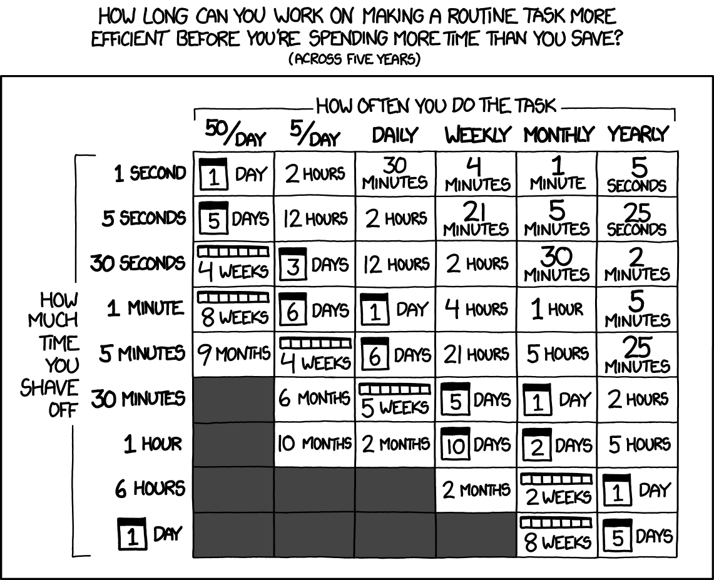

<!-- Use npx marp index.md in the dir to make the html presentation.-->

# Clinical Research & Data Science
## Lessons Learned: The Good, the Bad, and the Boutique

<!-- 
- Welcome everyone
- Today we'll discuss navigating specialized tools in clinical research
- Drawing from my experience transitioning from biology to data science
- Focus on practical lessons learned
-->

Rian Bogley
Database Architect
UCSF ALBA Lab & Dyslexia Center

---
### Who am I?
- **Current Role**: Database Architect
  - UCSF Neurology Department
    - Memory & Aging Center (MAC)
        - ALBA Language Neurobiology Lab
        - UCSF Dyslexia Center
            - Led by Dr. Marilu Gorno-Tempini

- Biology B.S. → Clinical Research Coordinator → Database Architect

<!--
- Brief background about my role
- Emphasize non-traditional path into data science
- Highlight how each role built on previous experience
- Mention importance of being open to learning new skills
-->

---
### The Journey So Far
- Started in basic science research (Biology)
- Transitioned to clinical research coordination
- Developed expertise in research data management
- Current focus:
    - Improving my lab's internal database architecture
    - Curating datasets and merging data streams
    - Creating scripts and packages to automate data processes

**Key Theme**: Most critical skills were learned on the job

<!--
- Emphasize that this wasn't a planned career path
- Point out how each role naturally led to increasing data responsibilities
- Highlight that learning on the job is common and valuable
- Mention that my experience isn't unique - many in clinical research follow similar paths
-->

---
## Today's Lecture

1. Understanding Specialized Research Databases
   - Benefits and limitations of specialized tools & data systems
   - Examples at the MAC: LAVA & REDCap

2. Navigating Specialized Systems
   - Balancing niche expertise with transferable skills
   - Real-world challenges and solutions

3. Practical Tools and Solutions
   - Automation strategies
   - API integration
   - Live demo with REDCap's API

<!--
- Overview of what we'll cover
- Mention that we'll move from theory to practical application
- Note that there will be a live demo at the end
- Encourage questions throughout
-->

---
## Boutique Research Databases: A Closer Look

### Meet LAVA
- Developed at UCSF Memory & Aging Center (2005)
- In-house web-application framework for the MAC's clinical research database
- Highly specialized for MAC workflows

**Key Characteristics**:
- Restricted modification access
- Stable but inflexible
- Limited to MAC use cases

<!--
- Explain what makes a database "boutique"
- Share personal experience with LAVA
- Highlight both benefits and limitations
- Note how common these types of systems are in research
-->

---
<!--LAVA Interface-->

<!--
- Walk through key elements of LAVA interface
- Point out unique aspects of the system
- Share examples of daily usage
- Note the dated but functional design
-->

---
<!--LAVA Query Interface-->

<!--
- Demonstrate query building interface
- Highlight limitations and strengths
- Share common use cases
- Point out learning curve challenges
-->

---

### Enter REDCap

- **Research Electronic Data Capture (REDCap)**
- Developed at Vanderbilt University (2004)
- Widely adopted (5,900+ institutions across 145 countries) 

**Structure**:
```
Institution
   └── Users
       └── Projects
           └── Arms
               └── Events
                   └── Instruments
                       └── Variables
                           └── Values
```
<style>
img[alt~="top-right"] {
  position: absolute;
  top: 10px;
  right: 10px;
}
</style>


<!--
- Introduce REDCap as a contrast to LAVA
- Emphasize the widespread adoption
- Note the more modern approach
- Explain how the structure affects usage
-->

---

<!--REDCap Interface-->

<!--
- Walk through interface elements
- Show key features
- Point out common usage areas
- Highlight customization options
-->

---
### REDCap: Practical Considerations

**Advantages**:
- HIPAA-compliant
- Customizable data collection
- Built-in survey tools
- API availability
- Active user community

**Limitations**:
- Basic analytics capabilities
- Unique syntax and semi-complex learning curve
- Limited visualization tools
- Requires external tools for advanced analysis

<!--
- Break down each advantage and limitation
- Share real examples of each
- Mention workarounds for limitations
- Compare with other research database options
- Highlight that all these systems are boutique to some extent, even EPIC/EHR systems using the same basic infrastructure can vary institution to institution.
-->

---
## Lessons Learned from Working with Research Databases

Lessons I've learned from working with specialized databases and how these lessons can help you navigate your career in clinical research data science.

<!-- 
- Transition to lessons learned section
- Preview the progression of lessons
- Mention how these apply beyond databases
- Encourage thinking about personal applications
-->

---

## Lesson 1: The Specialization Trade-off

### The Journey to Expertise
- Became proficient in utilizing LAVA's query system
- Became an expert in REDCap project design and API usage
- Developed deep understanding of MAC's data architecture

**Real Example**: LAVA Expertise
- Spent years learning LAVA's query system
- Became the go-to person in my lab for complex LAVA queries
- BUT: This knowledge is only useful at MAC
- Similar story with REDCap work

<!--
- Share personal journey of becoming LAVA expert
- Emphasize time investment required
- Point out the moment of realization about limited transferability
- Lead into discussion of trade-offs
-->

---

### Understanding the Trade-off

**Pros of Being the "Expert"**:
- Essential for current role
- Deep understanding of systems
- Become the go-to problem solver
- Job security in current position

**Cons of Over-Specialization**:
- Skills may not transfer elsewhere
- Risk of skill obsolescence
- Can miss broader industry developments
- Limited career mobility


<!--
- Break down each pro and con with real examples
- Share stories of when being the expert helped
- But also times when it limited opportunities
- Connect to broader career development themes
-->

---

### Real-World Impact

**Example**: Transitioning Between Roles
- As CRC: Mastered data entry and basic queries
- Moving to Database Role: Had to expand my skills to:
    - More advanced database design and setup
    - Perform more complex data munging 
    - Learning coding from scratch to facilitate role
- LAVA knowledge helped locally but didn't transfer

**Key Realization**: 
- Being an expert in a niche tool is valuable...
- ...but shouldn't be your only expertise

<!--
- Share personal experience of role transition
- Emphasize the gap between specialized and general skills
- Point out the moment of realizing need for broader skills
- Use this to lead into the evaluation function
-->

---

## Lesson 2: Identifying Transferable Skills
### Looking Beyond the Tool

**Example**: REDCap Project Design
- **Specific Skill**: Building REDCap projects
- **Transferable Skills**:
    - Database schema design
    - User interface planning
    - Data governance rules
    - Documentation methods

- Aslo, identifying transferable skills -*is*- a transferable skill.

<!--
- Connect back to previous lesson about specialization
- Show how to extract transferable elements from specialized work
- Emphasize that every tool teaches broader concepts
- Use REDCap as familiar example before moving to LAVA
-->

---

### Breaking Down Tasks into Transferable Components

**Example**: LAVA Query Building
- **Specific Task**: Creating LAVA queries
- **Transferable Elements**:
    - Logic building
    - Data filtering concepts
    - Understanding data merging
    - Query optimization
    - Error handling

These concepts apply to any database system!

<!--
- Use LAVA example to show skill extraction
- Connect each element to broader database concepts
- Share specific examples of how these transferred to other systems
- Point out universal principles in seemingly specialized tasks
-->

---

### Building a Transferable Skill Set

**1. Technical Foundation**
- Curating and merging large datasets
- Programming basics
- Version control
- Data cleaning methods

**2. Problem-Solving Approaches**
- Breaking down complex issues
- Creating systematic solutions
- Testing and validation
- Documentation practices

<!--
- Emphasize these are universal skills
- Share how each skill applies across different roles
- Give examples of when each became valuable
- Point out how these create career flexibility
-->

---

### Real-World Application

**Example**: Moving from LAVA to REDCap
- **Initial Challenge**: Different interface and logic
- **Transferable Skills Applied**:
    - Database structure understanding
    - Data validation principles
    - User requirement analysis
    - Documentation methods
- Result: Faster learning curve due to transferable knowledge

<!--
- Tell story of transitioning between systems
- Highlight how previous knowledge helped
- Share specific examples of skill transfer
- Point out unexpected transferable elements
-->

---

### Strategic Skill Development

**When Learning New Tools, Ask**:
- What underlying principles am I learning?
- How does this apply to other systems?
- What parts of this knowledge are universal?
- What skills will still be relevant in 5 years?

<!--
- Explain how to think strategically about learning
- Share personal approach to evaluating new tools
- Give examples of long-lasting vs temporary skills
- Connect to next function about evaluating systems
-->

---

## Lesson 3: Don't Reinvent the Wheel & Embrace Standards

### Key Principles
1. Check if solution exists before building
2. Follow industry standards when available
3. Build on community knowledge
4. Enable future compatibility

<!--
- Connect to previous lesson about transferability
- Introduce concept of leveraging existing solutions
- Share personal evolution in approach to problems
- Set up examples to come
-->

---

### Part 1: You're (Probably) Not the First Person with This Problem

**Real-World Example: The REDCap API Journey**

**The Problem**: 
- Needed to programmatically access REDCap data
- Required regular data export/import/curation
- Wanted to automate repetitive processes

**My Journey**:
1. Built custom Python package from scratch
2. Spent weeks developing and testing
3. Created functions for common operations
4. Finally discovered: PyCap existed all along!

<!--
- Share the excitement of building first solution
- Admit to the oversight of not checking first
- Explain lessons learned from "wasted" time
- Note that the learning process still had value
-->

---

### Part 2: Industry Standards Matter

**Case Study: BIDS in Neuroimaging**
- Brain Imaging Data Structure (BIDS):
    - Standardized format for neuroimaging data
    - Widely adopted across institutions
    - Facilitates easier data sharing
    - Enables easily-integrable community packages 

**Benefits**:
- Consistent organization
- Tool compatibility
- Enhanced collaboration
- Future-proof structure

<!--
- Explain what BIDS is and why it matters
- Share how it became a standard
- Point out benefits of standardization
- Connect to next example
-->

---

### Real-World Application: Audio-Video Database

**Challenge**:
- Organize massive collection of research recordings
- Need consistent structure
- Future compatibility important

**Solution**:
- Rather than creating from scratch, modeled after BIDS
- Adapted naming conventions
- Used similar hierarchy
- Maintained compatibility for future integration

<!--
- Describe initial temptation to create custom solution
- Share realization about BIDS principles
- Explain adaptation process
- Highlight benefits of following standards
-->

---

### How to Approach Solutions

1. **Research First**:
   - Search for existing solutions & industry standards
   - Review community resources & consult colleagues

2. **Evaluate Options**:
   - Active maintenance? Community adoption? Documentation quality?
   - Security requirements? Standards compliance?

3. **Consider Hybrid Approaches**:
   - Build on existing tools
   - Follow established patterns

<!--
- Walk through each step with examples
- Share stories of successful implementations
- Point out common pitfalls
- Emphasize importance of evaluation
-->

---

### When to Build Custom Solutions

Sometimes building custom solutions makes sense:
- No suitable existing solution
- Very specific requirements
- Security constraints
- Learning exercise

**But Always**:
- Document your decisions
- Follow industry standards where possible
- Keep it maintainable
- Share back with community when possible

<!--
- Acknowledge valid reasons for custom solutions
- Share examples of when custom was necessary
- Emphasize documentation importance
- Lead into decision helper function
-->

---

## Lesson 4: Plan Your Data Projects

### The Data Project Life Cycle
- Projects need structure and planning
- Regular evaluation of progress
- Clear documentation of decisions
- Defined outcomes and deliverables

<!--
- Connect to previous lesson about standards
- Emphasize how planning prevents reinventing
- Share importance of structure
- Lead into components
-->

---

### Components of a Data Project Plan

**1. Initial Planning**:
- Define clear objectives and identify required resources
- Set realistic timelines and establish success metrics

**2. Regular Check-ins**:
- Track progress and adjust timelines if needed
- Document challenges and update stakeholders

**3. Documentation**:
- Record key decisions and document processes
- Note lessons learned and share knowledge

<!--
- Break down each component with examples
- Share stories of when planning helped
- Also mention when lack of planning hurt
- Emphasize documentation importance
-->

---

## Lesson 5: Work Smarter, Not Harder (Automation)

### When to Automate?
Consider automation when:
- Task is performed regularly
- Process is well-defined
- Errors in manual processing are costly
- Time investment will pay off

<!--
- Connect to previous lesson about planning
- Explain how good planning enables automation
- Share automation philosophy
- Lead into time investment chart
-->

---



<!--
- Break down the chart
- Share personal experiences with each timeframe
- Point out surprising insights
- Connect to real examples coming up
-->

---

### Real-World Example #1: LAVA Data Cleaning

**Problem**:
- Manual data cleaning from LAVA exports
- Repetitive process
- Prone to human error
- Time-consuming
- Needed often

**Solution**: 
- Created a python package for use in my team
- Handles standard LAVA data curation semi-automatically
- Reduced processing time from hours to minutes
- Eliminated common manual errors

<!--
- Share specific before/after metrics
- Describe development process
- Point out initial challenges
- Show evolution of solution
-->

---

### Real-World Example #2: PDF Data Extraction

**Problem**:
- PDF outputs of patient test scores
- Manual data entry was time-consuming and error-prone
- Needed faster, more accurate solution

**Solution**:
- Used `tabula-py`, `PyMuPDF`, & `PyPDF2` libraries for PDF table extraction
- Created automated workflow:
    1. Extract tables from PDFs
    2. Clean and format data
    3. Prepare for database import
- Reduced processing time from hours to minutes
- Eliminated manual entry errors

<!--
- Walk through automation journey
- Share specific tools tried
- Explain evolution of solution
- Point out lessons learned
-->

---

## Lesson 6: Design for Adaptability

### Single-Use vs. Flexible Solutions

**The Trade-off**:
- Single-use: Quick to build, meets immediate need
- Flexible: Takes longer to build, handles multiple cases
- Key Question: Will this use case repeat in different forms?

<!--
- Introduce concept of adaptable design
- Share personal evolution in approach
- Explain when each approach makes sense
- Set up examples to come
-->

---

### When to Build Flexible Systems

**Consider Adaptable Solutions When**:
- Similar use cases keep appearing
- Pattern emerges in data handling needs
- Multiple team members need similar functionality
- Future requirements likely to be similar

**Stick with Single-Use When**:
- One-time data migration
- Unique, specific requirement
- Time-sensitive deliverable
- Unlikely to need similar solution again

<!--
- Share examples of each scenario
- Explain decision-making process
- Point out common patterns
- Connect to real projects
-->

---

### Best Practices for Adaptable Systems

**1. Design Principles**:
- Modular components
- Configuration over code
- Clear documentation
- Version control

**2. Implementation Tips**:
- Start simple, add flexibility gradually
- Test with different use cases
- Get user feedback early

<!--
- Explain each principle
- Share examples of application
- Point out common pitfalls
- Emphasize documentation importance
-->


---


---

### Example: Evolution of a System

**Phase 1: Single-Use Script**
- Built for specific LAVA export with hard-coded field names
- Limited error handling, but quick to build

**Phase 2: Similar Need Appears**
- Copied and modified script, duplicated code
- Maintenance challenges and inconsistent results

**Phase 3: Flexible Solution**
- Configurable field mappings and standardized processing
- Reusable components and better maintenance

<!--
- Share timeline of development
- Point out key decision points
- Explain lessons learned
- Show benefits realized
-->

---

### Key Takeaways from Adaptable Design

1. **Evaluate Long-term Needs**:
   - Consider future use cases
   - Balance development time vs. reuse value
   - Think about maintenance requirements

2. **Start Simple, Grow Smart**:
   - Begin with core functionality
   - Add flexibility where needed
   - Document expansion points

<!--
- Summarize key points
- Connect to upcoming API usage
- Show how these principles apply to API integration
-->

---

### What is an API?
- Application Programming Interface
- Allows systems to communicate
- Enables automated data access
- Standardizes data exchange

<!--
- Break down API concept simply
- Use REDCap context for examples
- Show how it connects to previous lessons
- Preview upcoming demo
-->

---

### REDCap's API Capabilities
- Data export/import
- Real-time access
- File uploads
- Project creation
- Survey distribution

**Benefits**:
- Automation potential
- Reduced manual work
- Enhanced accuracy
- Reproducible workflows

<!--
- Connect each capability to previous lessons
- Show how API supports automation goals
- Highlight reusability aspects
- Share real use cases
-->

---
### API Keys & Security

**What is an API Key?**
- Like a password for programmatic access
- Unique to each REDCap project
- Grants access to project data
- Can have different permission levels

**IMPORTANT: API Key Security**
- Never put API keys directly in code
- Never share keys publicly (e.g., GitHub)
- Never include in documentation

<!--
- Emphasize security importance
- Share proper handling practices
- Connect to real-world consequences
- Show best practices
-->

---

**Best Practice: Use Environment Variables**
```python
# DON'T do this:
api_key = "1234567890abcdef"  # NEVER put key in code!

# DO this instead:
from dotenv import load_dotenv
import os

load_dotenv()  # Load environment variables from .env file
api_key = os.getenv('REDCAP_API_KEY')
```

<!--
- Walk through security setup
- Demonstrate .env usage
- Show proper git practices
- Emphasize importance of security
-->

---
### Connecting REDCap to Python using PyCap

#### Step-by-Step Setup
1. **Create a Virtual Environment** (recommended but optional):
   ```bash
   python3 -m venv redcap_demo
   source redcap_demo/bin/activate  # or redcap_demo\Scripts\activate on Windows
   ```

2. **Install Necessary Packages**:
   ```bash
   pip install PyCap
   pip install pandas
   pip install python-dotenv
   ```

<!--
- Explain virtual environment benefits
- Walk through setup process
- Point out common issues
- Prepare for demo
-->

---

3. **Create .env File**:
   ```bash
   # Create .env file in your project directory
   # Add API key to .env file (never share or commit this file, add to .gitignore):
   REDCAP_API_KEY=your_actual_api_key
   REDCAP_API_URL='https://redcap.ucsf.edu/api/'
   ```

4. **Connect to REDCap**:
   ```python
   import redcap # This is PyCap, poorly named
   from dotenv import load_dotenv
   import os

   # Load environment variables
   load_dotenv()

   # Get API credentials from environment
   api_url = os.getenv('REDCAP_API_URL')
   api_key = os.getenv('REDCAP_API_KEY')

   # Create project connection
   project = redcap.Project(api_url, api_key)
   ```

<!--
- Show environment setup
- Explain configuration
- Preview connection process
- Lead into live demo
-->

---

## Live Demo: REDCap API in Practice

We'll now switch to a Jupyter Notebook to explore:
- REDCap API setup and authentication
- Common data operations
- Practical example scenarios

<!--
- Transition to live demonstration
- Set expectations for demo
- Encourage questions during demo
- Connect to previous lessons
-->

---

## Final Takeaways

### Key Lessons from Today

1. **The Specialization Balance**:
   - Specialized knowledge is valuable
   - But maintain transferable skills
   - Stay adaptable in your expertise

2. **Skill Transferability**:
   - Focus on underlying principles
   - Build foundational knowledge
   - Look for universal concepts

<!--
- Reinforce main themes
- Connect back to personal examples
- Show progression of concepts
- Emphasize practical applications
-->

---

3. **Work Smarter**:
   - Automate repetitive tasks
   - Validate your automation
   - Document your processes

4. **Industry Standards**:
   - Look for existing solutions
   - Follow established patterns
   - Contribute to community knowledge

---

5. **Project Planning**:
   - Start with clear objectives
   - Regular check-ins
   - Document decisions

6. **Design for Adaptability**:
   - Balance flexibility vs simplicity
   - Consider future use cases
   - Build maintainable solutions

<!--
- Connect lessons to each other
- Share how they work together
- Point out practical applications
- Emphasize ongoing learning
-->

---

### Resources

**UCSF Resources**:
- [UCSF REDCap 101 training](https://tinyurl.com/redcap-101-ucsf)
- [REDCap FAQ & Documentation](https://redcap.ucsf.edu/index.php?action=help)

**Additional Learning**:
- Python Data Science Resources
- Other API Documentation
- Best Practices Guides
- Check Chris' Additional Resources

<!--
- Highlight key resources
- Share learning pathways
- Point out community support
- Encourage continued learning
-->

---

## Q&A

Open for questions about:
- Today's lessons
- REDCap and APIs
- Career development
- Data management
- Best practices

<!--
- Encourage specific questions
- Connect answers to lessons
- Share additional examples
- Offer follow-up resources
-->

---

## Thank You!

### Contact Information:

Rian Bogley
Database Architect
UCSF ALBA Lab & Dyslexia Center
[Rian.Bogley@ucsf.edu](mailto:Rian.Bogley@ucsf.edu) | [LinkedIn](https://www.linkedin.com/in/rian-bogley-236b85102/)

<!--
- Thank attendees
- Encourage follow-up questions
- Share contact information
- Offer continued support
-->
