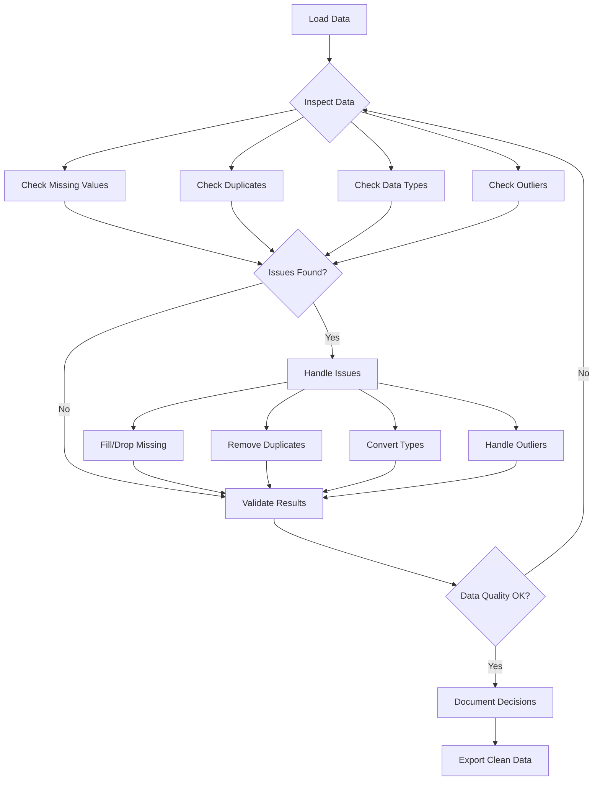

[Live Demo!](demo/DEMO_GUIDE.md)

*Reality check: Data scientists spend 80% of their time cleaning data and 20% complaining about it. The remaining 20% is spent on actual analysis (yes, that's 120% - data science is just that intense!)*


*Shows the reality that data cleaning is most of the work - perfect intro to data cleaning lecture*

Data cleaning follows a systematic workflow: **detect → handle → validate → transform**. We'll cover each technique individually, then bring it all together in a complete pipeline at the end.

# Handling Missing Data

Missing data is a common problem in real-world datasets. Understanding how to identify, analyze, and handle missing data is crucial for reliable data analysis. Pandas provides powerful tools for working with missing values.

*Fun fact: Missing data has its own Wikipedia page with 47 different types of missingness. The most common? "I forgot to fill this out" and "The system crashed again."*


*Common missing data patterns: MCAR (Missing Completely At Random), MAR (Missing At Random), MNAR (Missing Not At Random)*


## Missing Data Detection

Missing data detection identifies where data is missing and helps understand the pattern of missingness. This is the first step in any data cleaning process.

*Pro tip: Missing data is like that one friend who's always late to everything - you know they're supposed to be there, but you can never quite predict when (or if) they'll show up.*

**Reference:**

- `df.isnull()` - Boolean DataFrame: True for missing values
- `df.notnull()` - Boolean DataFrame: True for non-missing values
- `df.isna()` - Alias for isnull()
- `df.notna()` - Alias for notnull()
- `df.isnull().sum()` - Count missing values per column
- `df.isnull().any()` - True if any missing values in column
- `df.isnull().all()` - True if all values missing in column

**Example:**

```python
# Check for missing values
df = pd.DataFrame({'A': [1, 2, None, 4], 'B': [5, None, 7, 8]})
print(df.isnull().sum())  # A: 1, B: 1
print(df.isnull().any())  # A: True, B: True
print(df.isnull().all())  # A: False, B: False

# Visualize missing data
import matplotlib.pyplot as plt
df.isnull().sum().plot(kind='bar')
plt.title('Missing Values by Column')
plt.show()
```

## Missing Data Analysis

Missing data analysis helps understand the pattern and mechanism of missingness. This information guides the choice of appropriate handling strategies.

**Reference:**

- `df.isnull().sum()` - Count missing values per column
- `df.isnull().sum(axis=1)` - Count missing values per row
- `df.isnull().mean()` - Proportion of missing values per column
- `df.dropna()` - Remove rows with any missing values
- `df.dropna(axis=1)` - Remove columns with any missing values
- `df.dropna(thresh=n)` - Keep rows with at least n non-null values

**Example:**

```python
# Analyze missing data patterns
df = pd.DataFrame({'A': [1, 2, None, 4], 'B': [5, None, 7, 8], 'C': [9, 10, 11, None]})
print(df.isnull().sum())  # Missing values per column
print(df.isnull().mean())  # Proportion missing per column
print(df.isnull().sum(axis=1))  # Missing values per row

# Remove rows with missing values
df_clean = df.dropna()
print(df_clean.shape)  # (2, 3) - removed rows with missing values
```

## Missing Data Imputation

Missing data imputation fills in missing values using various strategies. The choice of imputation method depends on the data type and the pattern of missingness.

**Reference:**

- `df.fillna(value)` - Fill missing values with constant
- `df.ffill()` / `df.fillna(method='ffill')` - Forward fill (use previous value; method= deprecated in pandas 3.0)
- `df.bfill()` / `df.fillna(method='bfill')` - Backward fill (use next value; method= deprecated in pandas 3.0)
- `df.fillna(df.mean())` - Fill with column mean
- `df.fillna(df.median())` - Fill with column median
- `df.fillna(df.mode().iloc[0])` - Fill with column mode
- `df.interpolate()` - Interpolate missing values

**Example:**

```python
# Fill missing values
df = pd.DataFrame({'A': [1, 2, None, 4], 'B': [5, None, 7, 8]})

# Fill with constant
df_filled = df.fillna(0)
print(df_filled)  # Missing values replaced with 0

# Fill with mean
df_mean = df.fillna(df.mean())
print(df_mean)  # Missing values replaced with column mean

# Forward fill - modern syntax (pandas 1.4+)
df_ffill = df.ffill()
print(df_ffill)  # Missing values replaced with previous value

# Deprecated syntax (still works in pandas 2.x, removed in 3.0)
df_ffill_old = df.fillna(method='ffill')  # Avoid this in new code
```

```
Original Data:        Forward Fill (ffill):           Backward Fill (bfill):
  Index Value           Index Value                     Index Value
    0     10              0     10 ─┐                     0     10
    1   [NaN]             1     10 ←┤ fills down          1     15 ←┐
    2   [NaN]             2     10 ←┘ from 10             2     15 ←┤ fills up
    3     15              3     15 ─┐                     3     15 ─┘ from 15
    4   [NaN]             4     15 ←┤ fills down          4   [NaN] can't fill
    5   [NaN]             5     15 ←┘ from 15             5   [NaN] no later rows
```

**LIVE DEMO!** (Demo 1: Missing Data - detection, analysis, and imputation strategies)

# Data Transformation Techniques

## Removing Duplicates

Duplicate rows can skew your analysis and waste computational resources. Removing duplicates is a common first step in data cleaning.

*Fun fact: Duplicates are like that one song that gets stuck in your head - they keep showing up everywhere, even when you think you've gotten rid of them all.*

**Reference:**

- `df.duplicated()` - Check for duplicate rows
- `df.drop_duplicates()` - Remove duplicate rows
- `df.drop_duplicates(subset=['col1', 'col2'])` - Remove duplicates in specific columns
- `df.drop_duplicates(keep='first')` - Keep first occurrence of duplicates

**Example:**

```python
# Check for duplicates
df = pd.DataFrame({'A': [1, 2, 2, 3], 'B': [4, 5, 5, 6]})
print(df.duplicated().sum())  # Number of duplicate rows

# Remove duplicates
df_clean = df.drop_duplicates()
print(df_clean)  # Removed duplicate rows
```

## Replacing Values

The `replace()` method provides a flexible way to substitute specific values or patterns in your data.

*Think of `replace()` as find-and-replace for your data - but way more powerful than Word's version!*

**Reference:**

- `df.replace(old, new)` - Replace single value
- `df.replace([val1, val2], new)` - Replace multiple values with same replacement
- `df.replace([val1, val2], [new1, new2])` - Replace multiple values with different replacements
- `df.replace({val1: new1, val2: new2})` - Dictionary mapping
- `df.replace(regex=True)` - Use regular expressions

**Example:**

```python
# Replace sentinel values with NaN
df = pd.Series([1, -999, 2, -999, -1000, 3])
df_clean = df.replace([-999, -1000], np.nan)
print(df_clean)  # [1.0, NaN, 2.0, NaN, NaN, 3.0]

# Different replacement for each value
df = pd.Series(['low', 'medium', 'high', 'low'])
df_mapped = df.replace({'low': 1, 'medium': 2, 'high': 3})
print(df_mapped)  # [1, 2, 3, 1]

# Column-specific replacement in DataFrame
df = pd.DataFrame({'A': [1, 2, 3], 'B': ['x', 'y', 'z']})
df = df.replace({'A': {1: 100}, 'B': {'x': 'alpha'}})
print(df)  # A: [100, 2, 3], B: ['alpha', 'y', 'z']
```

## Applying Custom Functions


*Classic time-saving calculation chart - perfect for .apply() section*

Sometimes built-in methods aren't enough - you need to apply custom logic to transform your data. The `.apply()` and `.map()` methods let you use any function (built-in or custom) to transform data.

*Think of `.apply()` as your data transformation Swiss Army knife - when pandas doesn't have a built-in method for what you need, you can just write your own function and apply it to every row, column, or value.*

**Quick lambda primer**: A `lambda` is a one-line anonymous function, perfect for simple transformations: `lambda x: x * 2` is equivalent to `def double(x): return x * 2`, just more concise for one-time use.

**Reference:**

- `series.map(dict_or_func)` - Map values in a Series (element-wise)
- `series.apply(func)` - Apply function to each element in a Series
- `df.apply(func, axis=0)` - Apply function to each column (axis=0, default)
- `df.apply(func, axis=1)` - Apply function to each row (axis=1)
- `df.map(func)` - Apply function element-wise to entire DataFrame (pandas 2.1+)
- `df.applymap(func)` - Deprecated in pandas 2.1+, use `.map()` instead

**Example:**

```python
# Clean text data with custom function
def clean_text(text):
    """Remove whitespace and convert to lowercase"""
    return text.strip().lower()

names = pd.Series(['  Alice  ', 'BOB', '  Charlie'])
names_clean = names.apply(clean_text)
print(names_clean)  # ['alice', 'bob', 'charlie']

# Map categorical values to numbers
status = pd.Series(['active', 'inactive', 'active', 'pending'])
status_map = {'active': 1, 'inactive': 0, 'pending': 2}
status_coded = status.map(status_map)
print(status_coded)  # [1, 0, 1, 2]

# Apply function to DataFrame rows
df = pd.DataFrame({'min': [1, 4, 7], 'max': [5, 9, 12]})
df['range'] = df.apply(lambda row: row['max'] - row['min'], axis=1)
print(df)
#    min  max  range
# 0    1    5      4
# 1    4    9      5
# 2    7   12      5

# Apply function to DataFrame columns
df = pd.DataFrame({'A': [1, 2, 3], 'B': [4, 5, 6]})
column_sums = df.apply(sum, axis=0)  # Sum each column
print(column_sums)  # A: 6, B: 15

# Element-wise function application (pandas 2.1+)
df = pd.DataFrame({'A': [1, 2, 3], 'B': [4, 5, 6]})
df_squared = df.map(lambda x: x ** 2)
print(df_squared)
#    A   B
# 0  1  16
# 1  4  25
# 2  9  36
```

## Data Type Conversion

Converting data to the correct types is essential for proper analysis. This includes converting strings to numbers, dates, and other appropriate types.

*Warning: Data type conversion is like trying to fit a square peg in a round hole - sometimes it works perfectly, sometimes you need to shave off a few corners, and sometimes you just need to find a different hole entirely.*

**Reference:**

- `df.astype('int64')` - Convert to integer
- `df.astype('float64')` - Convert to float
- `df.astype('string')` - Convert to string
- `pd.to_datetime(df['date_column'])` - Convert to datetime
- `pd.to_numeric(df['column'], errors='coerce')` - Convert to numeric, errors become NaN

**Example:**

```python
# Convert data types
df = pd.DataFrame({'A': ['1', '2', '3'], 'B': [4.5, 5.5, 6.5]})
df['A'] = df['A'].astype('int64')  # Convert string to integer
df['B'] = df['B'].astype('int64')  # Convert float to integer
print(df.dtypes)  # A: int64, B: int64
```

## Renaming Axis Indexes

Renaming changes row or column labels without modifying data. This is essential for making your data more readable and standardizing column names.

**Reference:**

- `df.rename(index={old: new})` - Rename rows
- `df.rename(columns={old: new})` - Rename columns
- `df.rename(columns=str.lower)` - Apply function to all columns
- `df.rename(columns=str.strip)` - Remove whitespace from column names
- `inplace=True` - Modify DataFrame in place

**Example:**

```python
# Rename specific columns
df = pd.DataFrame({'OldName': [1, 2, 3], 'Another_Old': [4, 5, 6]})
df_renamed = df.rename(columns={'OldName': 'new_name', 'Another_Old': 'better_name'})
print(df_renamed.columns)  # ['new_name', 'better_name']

# Apply function to all columns
df.columns = ['First Column', ' Second ', 'THIRD']
df_clean = df.rename(columns=str.lower)  # Lowercase all
df_clean = df_clean.rename(columns=str.strip)  # Remove spaces
print(df_clean.columns)  # ['first column', 'second', 'third']

# Rename index
df.index = ['a', 'b', 'c']
df_reindexed = df.rename(index={'a': 'row_1', 'b': 'row_2'})
```

## Creating Categories

Converting continuous variables into categories makes data easier to analyze and visualize. This is especially useful for age groups, income brackets, and other meaningful categories.

*Pro tip: Categories are like putting your data in organized boxes - everything has its place, and you can find things much faster when you know exactly which box to look in.*

**Reference:**

- `pd.cut(series, bins)` - Cut into equal-width bins
- `pd.qcut(series, q)` - Cut into equal-frequency bins
- `bins=[0, 18, 35, 50, 100]` - Custom bin edges
- `labels=['Young', 'Middle', 'Senior']` - Custom labels for bins

**Example:**

```python
# Create age groups
ages = pd.Series([25, 30, 45, 60, 75])
age_groups = pd.cut(ages, bins=[0, 30, 50, 100], labels=['Young', 'Middle', 'Senior'])
print(age_groups)  # [Young, Young, Middle, Senior, Senior]
```

## Detecting and Filtering Outliers

Outliers are extreme values that may represent errors or important anomalies. Detecting and handling them appropriately is crucial for reliable analysis.


**Reference:**

- `df[df['col'] > threshold]` - Filter by threshold
- `df.clip(lower, upper)` - Cap values at bounds
- `df.quantile([0.25, 0.75])` - Find quartiles for IQR method
- `df[(df > lower) & (df < upper)]` - Filter within bounds

**Example:**

```python
# Remove values beyond 3 standard deviations
df = pd.DataFrame({'value': [1, 2, 3, 100, 4, 5]})
mean, std = df['value'].mean(), df['value'].std()
df_clean = df[abs(df['value'] - mean) < 3 * std]
print(df_clean)  # Removes 100

# Cap extreme values
df['value'] = df['value'].clip(lower=0, upper=10)
print(df)  # Values capped at 0-10 range

# IQR method for outlier detection
Q1 = df['value'].quantile(0.25)
Q3 = df['value'].quantile(0.75)
IQR = Q3 - Q1
lower_bound = Q1 - 1.5 * IQR
upper_bound = Q3 + 1.5 * IQR
df_no_outliers = df[(df['value'] >= lower_bound) & (df['value'] <= upper_bound)]
```

# Categorical Data Encoding

Working with categorical data is common in data analysis. Pandas provides two main approaches: the categorical data type for efficient storage, and dummy variables for machine learning models.

*Pro tip: Categorical encoding is like translating between languages - categories can be stored efficiently as codes (integers) or expanded into binary columns for models. Choose the right translation for your task!*

## Categorical Data Type

The categorical type is incredibly powerful for memory optimization, especially when you have repeated string values.


*Visual showing categorical encoding: Original values → Categories → Codes with memory savings comparison*

**Reference:**

- `astype('category')` - Convert to categorical
- `cat.categories` - View categories
- `cat.codes` - View numeric codes
- Use for: Repeated string values, ordered categories

**Example:**

```python
# Huge memory savings for repeated values
colors = pd.Series(['red', 'blue', 'red', 'green', 'blue'] * 1000)
print(f"As object: {colors.memory_usage(deep=True)} bytes")

colors_cat = colors.astype('category')
print(f"As category: {colors_cat.memory_usage(deep=True)} bytes")

# Access categories and codes
print(colors_cat.cat.categories)  # ['blue', 'green', 'red']
print(colors_cat.cat.codes[:5])   # [2, 0, 2, 1, 0]
```

## Creating Indicator (Dummy) Variables

Indicator variables convert categories into binary (0/1) columns, which is essential for machine learning models that require numeric input.

*Think of dummy variables as translating categories into a language that models can understand - instead of "red", "blue", "green", you get three columns of 1s and 0s indicating which color each row has.*

**Reference:**

- `pd.get_dummies(series)` - Create dummy variables
- `prefix='category'` - Add prefix to column names
- `drop_first=True` - Avoid multicollinearity (drop first category)
- `dtype='int64'` - Specify data type for dummies (use int64 not bool - booleans can't represent missing values)

**Example:**

```python
# Create dummy variables
df = pd.DataFrame({'color': ['red', 'blue', 'red', 'green']})
dummies = pd.get_dummies(df['color'], prefix='color', dtype='int64')
print(dummies)
# Creates: color_blue, color_green, color_red columns with 0/1 values

# Add to original DataFrame
df_with_dummies = pd.concat([df, dummies], axis=1)
print(df_with_dummies)

# Drop first category to avoid multicollinearity
dummies = pd.get_dummies(df['color'], prefix='color', drop_first=True, dtype='int64')
print(dummies)  # Only color_green and color_red (blue is the reference)
```

**LIVE DEMO!** (Demo 2: Transformations - categorical encoding, string operations, sampling)

# String Manipulation

*Pro tip: The `.str` accessor is like having a Swiss Army knife for text data. It can split, join, replace, extract, and transform text in ways that would make a regex wizard jealous.*

## Basic String Operations

String operations are essential for cleaning text data. Pandas provides easy-to-use string methods that work on Series containing text.


*Quick reference card for common string operations: .upper()/.lower(), .strip()/.replace(), .split()/.contains()*

```
Input: "  Alice Smith  "
   │
   ├─ .strip() ────────────► "Alice Smith"
   │                              │
   │                              ├─ .lower() ────────► "alice smith"
   │                              │                          │
   │                              │                          └─ .replace(' ', '_') ──► "alice_smith"
   │                              │
   │                              └─ .split(' ') ────────► ['Alice', 'Smith']
   │                                     │
   │                                     └─ [0] ──────────► 'Alice'
   │
   └─ .title() ────────────► "Alice Smith"
```


*"I got 99 problems, so I used regex. Now I have 100 problems." - Perfect humor for string manipulation complexity*

**Reference:**

- `series.str.upper()` - Convert to uppercase
- `series.str.lower()` - Convert to lowercase
- `series.str.strip()` - Remove leading/trailing whitespace
- `series.str.replace(old, new)` - Replace substrings
- `series.str.contains(pattern)` - Check if string contains pattern
- `series.str.startswith(prefix)` - Check if string starts with prefix
- `series.str.endswith(suffix)` - Check if string ends with suffix

**Example:**

```python
# Clean text data
names = pd.Series(['  Alice  ', 'bob', 'CHARLIE'])
clean_names = names.str.strip().str.title()
print(clean_names)  # ['Alice', 'Bob', 'Charlie']

# Check patterns
emails = pd.Series(['alice@example.com', 'bob@test.org'])
has_gmail = emails.str.contains('gmail')
print(has_gmail)  # [False, False]
```

## String Splitting and Joining

Splitting and joining strings is common when working with structured text data like addresses, names, or delimited values.

**Reference:**

- `series.str.split(sep)` - Split strings by separator
- `series.str.split(sep, expand=True)` - Split into separate columns
- `series.str.cat(sep=' ')` - Join strings with separator
- `series.str.join(sep)` - Join list elements with separator

**Example:**

```python
# Split strings
full_names = pd.Series(['Alice Smith', 'Bob Jones', 'Charlie Brown'])
names_split = full_names.str.split(' ')
print(names_split)  # [['Alice', 'Smith'], ['Bob', 'Jones'], ['Charlie', 'Brown']]

# Split into columns
names_df = full_names.str.split(' ', expand=True)
print(names_df)  # Two columns with first and last names
```

# Random Sampling and Permutation

## Random Sampling

Random sampling creates representative subsets of data for analysis, testing, and machine learning. It's essential for creating train/test splits, bootstrap analysis, and data exploration.

**Reference:**

- `df.sample(n=None, frac=None, replace=False, weights=None, random_state=None)` - Random sampling
- `n=10` - Sample exactly 10 rows
- `frac=0.5` - Sample 50% of rows
- `replace=True` - Sample with replacement (bootstrap)
- `weights='column'` - Weighted sampling by column values
- `random_state=42` - Reproducible sampling
- `df.iloc[::step]` - Systematic sampling every nth row

**Example:**

```python
# Random sampling
df = pd.DataFrame({'A': range(100), 'B': range(100, 200)})
sample = df.sample(n=10, random_state=42)  # Sample 10 rows
print(len(sample))  # 10

# Stratified sampling
df['category'] = ['A', 'B'] * 50
stratified = df.groupby('category').apply(lambda x: x.sample(2))
print(len(stratified))  # 4 (2 from each category)
```

## Permutation and Shuffling

Permutation randomizes data order while preserving relationships. It's essential for cross-validation, bootstrap analysis, and breaking temporal dependencies in time series data.

**Reference:**

- `df.sample(frac=1)` - Shuffle all rows (permutation)
- `df.reindex(np.random.permutation(df.index))` - Permute index order
- `df.sample(n=len(df), replace=True)` - Bootstrap sampling
- `np.random.permutation(array)` - Randomly permute array
- `random_state=42` - Reproducible permutation

**Example:**

```python
# Shuffle DataFrame
df = pd.DataFrame({'A': [1, 2, 3, 4], 'B': [5, 6, 7, 8]})
shuffled = df.sample(frac=1, random_state=42)
print(shuffled)  # Random order of rows

# Bootstrap sampling
bootstrap = df.sample(n=len(df), replace=True, random_state=42)
print(len(bootstrap))  # 4 (same length, but with replacement)
```

# Data Validation and Quality Assessment


*Shows data errors invalidating research - perfect for validation section*

| Issue | Detection | Solution |
|-------|-----------|----------|
| Missing Values | `df.isnull().sum()` | • Impute (mean/median)<br>• Forward/backward fill<br>• Drop if <5% missing |
| Duplicates | `df.duplicated()` | • `drop_duplicates()`<br>• Keep first or last |
| Wrong Data Type | `df.dtypes` | • `astype('int64')`<br>• `pd.to_datetime()` |
| Outliers | `df.describe()`<br>Box plots | • IQR method filter<br>• Clip extreme values<br>• Keep if valid (verify) |
| Inconsistent Categories | `df['col'].unique()` | • `str.lower().strip()`<br>• `replace()` mapping |

## Data Quality Checks

Data quality checks identify issues like missing values, duplicates, outliers, and data type inconsistencies. These checks are essential for ensuring reliable analysis results.

**Reference:**

- `df.isnull().sum()` - Count missing values per column
- `df.duplicated().sum()` - Count duplicate rows
- `df.nunique()` - Count unique values per column
- `df.dtypes` - Data types per column
- `df.describe()` - Summary statistics (numeric columns only by default)
- `df.describe(include='all')` - Summary statistics for all columns (numeric + categorical)
- `df.describe(include=['object'])` - Summary statistics for categorical columns only
- `df.info()` - Detailed information
- `df.memory_usage()` - Memory usage per column

**Example:**

```python
# Data quality assessment
df = pd.DataFrame({'A': [1, 2, 2, 4], 'B': [5, 6, 6, 8], 'C': [9, 10, 11, 12]})
print(df.isnull().sum())  # Missing values per column
print(df.duplicated().sum())  # Number of duplicate rows
print(df.nunique())  # Unique values per column
print(df.dtypes)  # Data types per column
```

## Data Validation Rules

Data validation rules ensure data meets business requirements and constraints. These rules help maintain data integrity and prevent analysis errors.

**Reference:**

- `df[condition]` - Filter rows meeting condition
- `df.between(left, right)` - Check if values are between bounds
- `df.isin(values)` - Check if values are in list
- `df.str.contains(pattern)` - Check if strings contain pattern
- `df.str.match(pattern)` - Check if strings match pattern
- `df.str.len()` - Get string length
- `df.str.isdigit()` - Check if strings are digits

**Example:**

```python
# Data validation rules
df = pd.DataFrame({'Age': [25, 30, 35, 40], 'Email': ['alice@test.com', 'bob@example.org', 'charlie@test.com', 'diana@example.org']})

# Age validation (18-65)
valid_ages = df[df['Age'].between(18, 65)]
print(valid_ages)  # All rows (ages are valid)

# Email validation
email_pattern = r'^[a-zA-Z0-9._%+-]+@[a-zA-Z0-9.-]+\.[a-zA-Z]{2,}$'
valid_emails = df[df['Email'].str.match(email_pattern)]
print(valid_emails)  # All rows (emails are valid)
```

# Data Cleaning Pipeline

A systematic approach to data cleaning ensures consistent, high-quality results. Follow these steps in order for best results.



*Think of data cleaning as being a detective - you need to follow the clues, ask the right questions, and sometimes you have to make tough decisions about what to keep and what to throw away.*

**Reference:**

1. **Load and inspect data** - `df.head()`, `df.info()`, `df.describe()`
2. **Handle missing values** - `df.isnull().sum()`, `df.fillna()`, `df.dropna()`
3. **Remove duplicates** - `df.duplicated()`, `df.drop_duplicates()`
4. **Convert data types** - `df.astype()`, `pd.to_datetime()`, `pd.to_numeric()`
5. **Handle outliers** - `df.quantile()`, `df.clip()`, filtering
6. **Validate data quality** - Check ranges, patterns, consistency
7. **Export clean data** - `df.to_csv()`, `df.to_excel()`

**Example:**

```python
# Step 1: Load and inspect
df = pd.read_csv('messy_data.csv')
print(df.info())
print(df.isnull().sum())

# Step 2: Handle missing values
df['Age'].fillna(df['Age'].mean(), inplace=True)
df['Name'].fillna('Unknown', inplace=True)

# Step 3: Remove duplicates
df = df.drop_duplicates()

# Step 4: Convert data types
df['Age'] = df['Age'].astype('int64')
df['Date'] = pd.to_datetime(df['Date'])

# Step 5: Handle outliers
Q1, Q3 = df['Salary'].quantile([0.25, 0.75])
IQR = Q3 - Q1
df = df[~((df['Salary'] < Q1 - 1.5*IQR) | (df['Salary'] > Q3 + 1.5*IQR))]

# Step 6: Validate
print(df.describe())
print(df.dtypes)

# Step 7: Export
df.to_csv('clean_data.csv', index=False)
```

## Configuration-Driven Processing

Configuration files make data cleaning pipelines more maintainable and reproducible. Simple text files or Python dictionaries can store filter rules, cleaning parameters, and processing steps.

*Pro tip: Keep your data cleaning logic separate from your parameters. This makes your code more maintainable and your pipelines more reproducible.*

**Reference:**

- Use Python dictionaries for simple configurations
- Store parameters in separate files (CSV, JSON, or simple text)
- Keep cleaning logic in functions
- Document your cleaning decisions

**Example:**

```python
# Simple configuration dictionary
cleaning_config = {
    'missing_strategies': {
        'age': 'median',
        'income': 'mean', 
        'date': 'ffill'
    },
    'outlier_threshold': 3.0,
    'drop_columns': ['temp_id', 'notes']
}

# Apply configuration
for column, strategy in cleaning_config['missing_strategies'].items():
    if strategy == 'median':
        df[column].fillna(df[column].median(), inplace=True)
    elif strategy == 'mean':
        df[column].fillna(df[column].mean(), inplace=True)
    elif strategy == 'ffill':
        df[column].fillna(method='ffill', inplace=True)
```


# Running Notebooks from Command Line

For automated pipelines and batch processing, you can execute Jupyter notebooks from the command line without opening the Jupyter interface.

## Basic Execution

```bash
# Execute a single notebook
jupyter nbconvert --execute --to notebook your_notebook.ipynb

# Execute and save output to a new file
jupyter nbconvert --execute --to notebook --output executed_notebook your_notebook.ipynb

# Execute and overwrite the original file
jupyter nbconvert --execute --to notebook --inplace your_notebook.ipynb
```

## Notebook Pipeline Automation

Always check "exit codes" after notebook execution to ensure your pipeline stops if any step fails. When a command runs successfully it returns an exit code of 0, other values (usually 1) indicate an error.

You may check exit codes using the special variable `$?`, which contains exit code for the previous command. Alternatively, we can use an OR operator (`||`) to instruct the shell to do something when a command fails.

**Note:** The `||` operator means "OR" - if the command fails (non-zero exit code), execute the code block in curly braces `{}`. This is more concise than checking `$?` explicitly.

```bash
#!/bin/bash
# Example pipeline script

echo "Starting data analysis pipeline..."

# Run notebooks in sequence
jupyter nbconvert --execute --to notebook q4_exploration.ipynb
if [ $? -ne 0 ]; then
    echo "ERROR: Q4 exploration failed"
    exit 1
fi

jupyter nbconvert --execute --to notebook q5_missing_data.ipynb || {
    echo "ERROR: Q5 missing data analysis failed"
    exit 1
}

echo "Pipeline completed successfully!"
```

## Key Parameters

- `--execute`: Run all cells in the notebook
- `--to notebook`: Keep output as notebook format
- `--inplace`: Overwrite the original file
- `--output filename`: Save to a new file
- `--allow-errors`: Continue execution even if cells fail


# **LIVE DEMO!**
(Demo 3: Complete Workflow - end-to-end data cleaning pipeline)