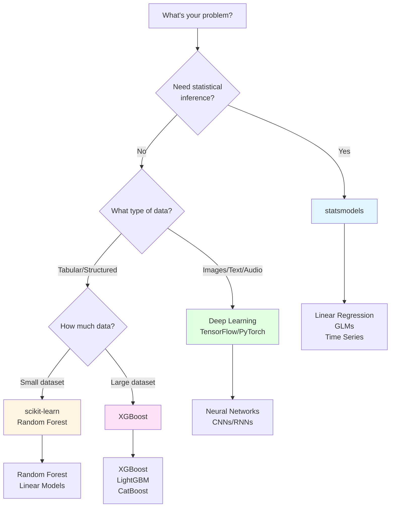
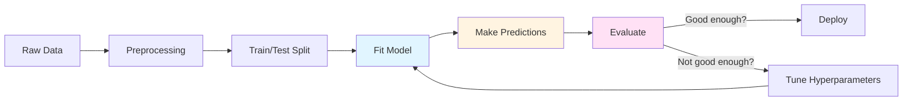
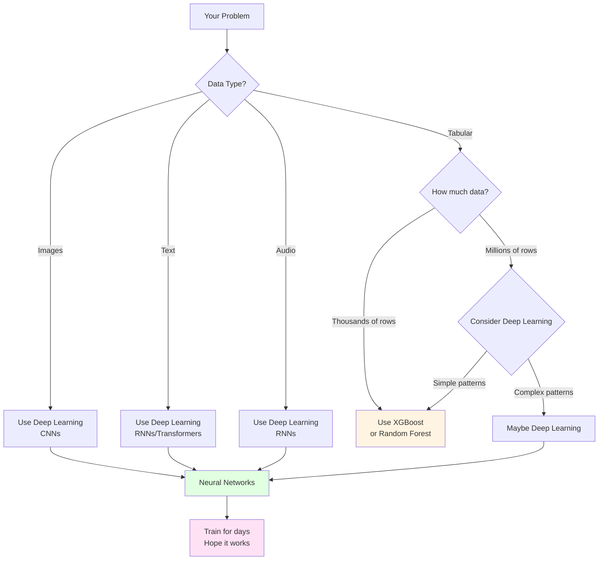

See [BONUS.md](BONUS.md) for advanced topics:

- Advanced statistical modeling techniques
- Hyperparameter tuning strategies
- Model interpretability and explainability
- Production deployment considerations
- Advanced deep learning architectures

*Fun fact: The word "model" comes from the Latin "modulus" meaning "measure" or "standard." In data science, we're literally creating standards - mathematical representations that measure and predict patterns in our data. But unlike Zoolander, we can turn left AND right!*


*"I'm sorry, I can't do that. I'm a machine learning model, not a magic wand."*

# Outline

- Statistical modeling with `statsmodels` (inference and interpretation)
- Traditional machine learning with `scikit-learn` (the workhorse)
- Gradient boosting with `XGBoost` (the secret weapon)
- Deep learning with `TensorFlow`/`Keras` and `PyTorch` (the modern frontier)
- When to use what: navigating the modeling ecosystem

# Quick Reference

| Tool | When to Use | Key Features | Best For |
|------|-------------|--------------|----------|
| **statsmodels** | Need p-values, confidence intervals, hypothesis testing | Statistical inference, model diagnostics | Understanding relationships, research |
| **scikit-learn** | Tabular data, need predictions | Consistent API, many algorithms | General ML tasks, preprocessing |
| **XGBoost** | Tabular data, need best performance | Gradient boosting, feature importance | Competitions, production tabular data |
| **TensorFlow/Keras or PyTorch** | Images, text, audio, large datasets | High-level API, production-ready | Computer vision, NLP, deployment |

# The Modeling Ecosystem: A Brief Tour

*Reality check: There are more Python modeling libraries than there are ways to overfit a model. But don't worry - we'll focus on the essential tools that actually matter for daily data science work, from the bread-and-butter statistical methods to the cutting-edge deep learning frameworks.*

The Python modeling landscape has evolved dramatically. From simple linear regression to complex neural networks, each tool has its place. Understanding when to use what is half the battle - the other half is actually getting your model to work (which, let's be honest, is usually the harder part).

**The Modeling Spectrum:**

```
STATISTICAL MODELING          TRADITIONAL ML             DEEP LEARNING
┌─────────────────────┐      ┌──────────────────┐      ┌──────────────┐
│   statsmodels       │      │  scikit-learn    │      │ TensorFlow   │
│   (inference)       │      │  (predictions)   │      │ PyTorch      │
│                     │      │                  │      │              │
│ • Linear models     │      │ • Random Forest  │      │ • Neural     │
│ • GLMs              │      │ • SVM            │      │   networks   │
│ • Time series       │      │ • XGBoost        │      │ • CNNs       │
│                     │      │                  │      │ • RNNs       │
└─────────────────────┘      └──────────────────┘      └──────────────┘
     ↑                            ↑                          ↑
  "Why?"                      "What?"                    "How?"
```

**Model Complexity vs Interpretability Trade-off:**


*As models get more powerful, they often become harder to interpret. Choose based on what you need: understanding (interpretability) or performance (accuracy).*

**Key Decision Points:**

- **Need statistical inference?** → `statsmodels` (p-values, confidence intervals, hypothesis testing)
- **Tabular data, need predictions?** → `scikit-learn` or `XGBoost` (fast, interpretable, powerful)
- **Images, text, sequences?** → Deep learning (`TensorFlow`/`Keras` or `PyTorch`)
- **Research/prototyping?** → `PyTorch` (flexible, Pythonic)
- **Production deployment?** → `TensorFlow`/`Keras` (mature, optimized)

*Pro tip: Start simple. A well-tuned linear regression often beats a poorly tuned neural network. Remember: "But why male models?" - because sometimes the simplest model is the right model!*

**Model Selection Decision Tree:**



*"But why models?" "Seriously? I just told you that a moment ago."*


*"We found a statistically significant correlation between the data and our hypothesis. (p < 0.05)"*

# The Foundation: Statistical Modeling

*Think of statistical modeling as the foundation of your modeling house - you can build fancy additions on top, but you need to understand the basics first.*

Statistical modeling focuses on understanding relationships and making inferences about populations. Unlike machine learning (which prioritizes prediction), statistical models help you understand *why* things happen, not just *what* will happen.

## Introduction to `statsmodels`

`statsmodels` is Python's comprehensive statistical modeling library. It provides tools for statistical inference, hypothesis testing, and model diagnostics - the bread and butter of statistical analysis.

**When to use `statsmodels`:**

- You need p-values, confidence intervals, or hypothesis tests
- You want to understand *why* variables are related (not just predict)
- You're doing traditional statistical analysis (regression, ANOVA, etc.)
- You need model diagnostics and assumption checking

**pandas compatibility:** Most `statsmodels` functions work directly with pandas DataFrames. You can pass DataFrames to model constructors, and results are often returned as pandas objects (Series, DataFrames).

**Reference:**

- `import statsmodels.api as sm` - Array-based API
- `import statsmodels.formula.api as smf` - Formula-based API (R-like syntax)
- `sm.OLS(y, X)` - Ordinary Least Squares regression
- `smf.ols('y ~ x1 + x2', data=df)` - Formula-based OLS
- `model.fit()` - Fit the model
- `results.summary()` - Print model summary
- `results.params` - Model coefficients
- `results.pvalues` - P-values for coefficients

## Linear Regression

Linear regression is the workhorse of statistical modeling. It models the relationship between a dependent variable and one or more independent variables using a linear equation.

*Think of linear regression as the Derek Zoolander of modeling - it's simple, it's reliable, and it can turn left (or right, or any direction really).*

**Linear Regression: The Blue Steel of Modeling**

Linear regression finds the best-fitting line through your data. It's like finding the perfect pose - simple, elegant, and it works every time (well, most of the time).

```
y = β₀ + β₁x₁ + β₂x₂ + ... + ε

Where:
- y = dependent variable (what you're predicting)
- β₀ = intercept (where the line starts)
- β₁, β₂, ... = coefficients (how much each x affects y)
- ε = error term (the stuff we can't explain)
```

**Visual Example: Simple Linear Regression**

```
y (target)
  ↑
  |     ●
  |   ●   ●
  | ●       ●
  |●         ●
  |_____________→ x (feature)
  
Best-fit line: y = 2.0 + 1.5x
```

*The line minimizes the distance (errors) between all data points and the line itself. That's what "least squares" means!*

*"I can turn left, I can turn right, I can even turn... statistically significant!"*

**Reference:**

- `sm.OLS(y, X)` - Create OLS model (array-based)
- `smf.ols('y ~ x1 + x2', data=df)` - Create OLS model (formula-based)
- `sm.add_constant(X)` - Add intercept column to design matrix
- `results = model.fit()` - Fit the model
- `results.summary()` - Comprehensive model summary
- `results.params` - Coefficient estimates (Series)
- `results.rsquared` - R-squared value
- `results.pvalues` - P-values for coefficients
- `results.conf_int()` - Confidence intervals
- `results.predict(X_new)` - Make predictions

**Example:**

```python
import statsmodels.api as sm
import statsmodels.formula.api as smf
import pandas as pd
import numpy as np

# Create sample data
np.random.seed(42)
df = pd.DataFrame({
    'x1': np.random.randn(100),
    'x2': np.random.randn(100),
    'y': 2 + 3 * np.random.randn(100) + 0.5 * np.random.randn(100)
})

# Formula API (R-like, works with DataFrames)
model = smf.ols('y ~ x1 + x2', data=df)
results = model.fit()
print(results.summary())

# Access coefficients
print(results.params)  # Intercept, x1, x2 coefficients
print(results.pvalues)  # Statistical significance
```

*The `summary()` method provides comprehensive output including R-squared, p-values, confidence intervals, and model diagnostics - all the statistical information you need for inference.*


## Other Statistical Methods

`statsmodels` provides many other statistical modeling tools beyond linear regression:

**Generalized Linear Models (GLMs):**

- Logistic regression for binary outcomes
- Poisson regression for count data
- Other exponential family distributions
- Use when: You need statistical inference for non-normal data

**Time Series Models:**

- ARIMA models for time series forecasting
- Seasonal decomposition
- Use when: You have temporal dependencies in your data

**When Statistical Methods Beat ML:**

- You need interpretable coefficients and p-values
- You have strong theoretical reasons for model structure
- You need confidence intervals for predictions
- Sample size is small (statistical methods are more robust)
- You're doing hypothesis testing, not just prediction

*Remember: Statistical models answer "why?" Machine learning models answer "what?" Both are valuable, but for different questions.*


*"Correlation doesn't imply causation, but it does waggle its eyebrows suggestively and gesture furtively while mouthing 'look over there'."*

# LIVE DEMO

# "Traditional" Machine Learning

*Think of `scikit-learn` as the Swiss Army knife of machine learning - it has a tool for almost everything, it's reliable, and it's been around long enough that everyone knows how to use it.*

Machine learning focuses on prediction rather than inference. While statistical models help you understand relationships, ML models help you make accurate predictions on new data.

## Introduction to `scikit-learn`

`scikit-learn` is Python's standard machine learning library. It provides a consistent API across all models: fit, predict, transform. This consistency makes it easy to try different algorithms and build complex pipelines.

**The `scikit-learn` API Pattern:**

```python
# 1. Create model
model = SomeModel()

# 2. Fit on training data
model.fit(X_train, y_train)

# 3. Make predictions
predictions = model.predict(X_test)
```

**Train/Test Split Visualization:**

```
Original Dataset (1000 samples)
├── Training Set (800 samples, 80%)
│   └── Used to train the model
└── Test Set (200 samples, 20%)
    └── Used to evaluate model performance
        (Never seen during training!)
```

*The golden rule: Never evaluate on data the model has seen during training. That's like giving a student the answers before the test and then being surprised they got 100%.*

**Why `scikit-learn` is the ML standard:**

- Consistent API across all models
- Comprehensive documentation and examples
- Well-tested and stable
- Excellent preprocessing tools
- Works seamlessly with pandas (accepts DataFrames)

**pandas compatibility:** `scikit-learn` functions accept pandas DataFrames and Series directly. However, some operations (like `fit_transform`) may return NumPy arrays, so you may need to convert back to DataFrames if you want to preserve column names.

**Reference:**

- `from sklearn.model_selection import train_test_split` - Split data
- `from sklearn.preprocessing import StandardScaler` - Scale features
- `from sklearn.linear_model import LinearRegression` - Linear regression
- `from sklearn.ensemble import RandomForestClassifier` - Random forest
- `model.fit(X, y)` - Train model
- `model.predict(X)` - Make predictions
- `model.score(X, y)` - Calculate accuracy/R²

## Linear Regression

Linear regression in `scikit-learn` is optimized for prediction rather than inference. It's faster and simpler than `statsmodels` but doesn't provide p-values or detailed diagnostics.

**`statsmodels` vs `scikit-learn` Linear Regression:**

| Feature | `statsmodels` | `scikit-learn` |
|---------|---------------|----------------|
| Purpose | Statistical inference | Prediction |
| P-values | ✅ Yes | ❌ No |
| Confidence intervals | ✅ Yes | ❌ No |
| Model diagnostics | ✅ Comprehensive | ❌ Basic |
| Speed | Slower | Faster |
| Use when | Need to understand relationships | Need predictions |

*Think of it this way: `statsmodels` answers "why?" while `scikit-learn` answers "what?"*

**Reference:**

- `from sklearn.linear_model import LinearRegression` - Basic linear regression
- `from sklearn.linear_model import Ridge` - Ridge regression (L2 regularization)
- `from sklearn.linear_model import Lasso` - Lasso regression (L1 regularization)
- `model = LinearRegression()` - Create model
- `model.fit(X_train, y_train)` - Train model
- `model.predict(X_test)` - Make predictions
- `model.coef_` - Model coefficients
- `model.intercept_` - Model intercept
- `model.score(X, y)` - R² score

**Regularization:** Ridge and Lasso add penalty terms to prevent overfitting. Ridge (L2) shrinks coefficients, Lasso (L1) can zero out coefficients (feature selection).

**Regularization Comparison:**

| Method | Penalty Type | Effect on Coefficients | Use When |
|--------|--------------|------------------------|----------|
| Linear Regression | None | No shrinkage | Simple problems, no overfitting |
| Ridge (L2) | Sum of squares | Shrinks all coefficients | Many features, multicollinearity |
| Lasso (L1) | Sum of absolute values | Can zero out coefficients | Feature selection needed |

**Example:**

```python
from sklearn.linear_model import LinearRegression
from sklearn.model_selection import train_test_split
import pandas as pd
import numpy as np

# Create sample data
np.random.seed(42)
X = np.random.randn(100, 3)
y = 2 + 3 * X[:, 0] + 0.5 * X[:, 1] + np.random.randn(100)

# Split data
X_train, X_test, y_train, y_test = train_test_split(X, y, test_size=0.2)

# Fit model
model = LinearRegression()
model.fit(X_train, y_train)

# Predictions and evaluation
predictions = model.predict(X_test)
score = model.score(X_test, y_test)  # R²
print(f"R² score: {score:.3f}")
```

## Random Forest

Random Forest is an ensemble method that combines multiple decision trees. It's robust, handles non-linear relationships well, and provides feature importance scores.

*Random Forest is like having a committee of decision trees vote on the answer. It's democracy in action - except the trees are actually smart and the voting actually works.*

**How Random Forest Works:**

```
Training Data
    ↓
Create 100 Decision Trees (each sees random subset)
    ↓
Tree 1: Predicts Class A
Tree 2: Predicts Class B
Tree 3: Predicts Class A
...
Tree 100: Predicts Class A
    ↓
Final Prediction: Class A (majority vote)
```

*Each tree votes, and the most popular answer wins. It's like asking 100 people for directions - the majority is usually right!*

**Why Random Forest?**

- Handles non-linear relationships automatically
- Robust to outliers and missing data
- Provides feature importance
- Works well out-of-the-box (few hyperparameters to tune)
- Good for both classification and regression

**Reference:**

- `from sklearn.ensemble import RandomForestClassifier` - Classification
- `from sklearn.ensemble import RandomForestRegressor` - Regression
- `model = RandomForestClassifier(n_estimators=100)` - Create model
- `model.fit(X_train, y_train)` - Train model
- `model.predict(X_test)` - Class predictions
- `model.predict_proba(X_test)` - Probability predictions
- `model.feature_importances_` - Feature importance scores
- `model.score(X, y)` - Accuracy/R² score

**Example:**

```python
from sklearn.ensemble import RandomForestClassifier
from sklearn.model_selection import train_test_split
import pandas as pd
import numpy as np

# Create sample data
np.random.seed(42)
X = np.random.randn(200, 4)
y = (X[:, 0] + X[:, 1] > 0).astype(int)  # Binary classification

# Split data
X_train, X_test, y_train, y_test = train_test_split(X, y, test_size=0.2)

# Fit model
model = RandomForestClassifier(n_estimators=100, random_state=42)
model.fit(X_train, y_train)

# Predictions and feature importance
predictions = model.predict(X_test)
importance = model.feature_importances_
print(f"Feature importance: {importance}")
```

## Other `scikit-learn` Methods

`scikit-learn` provides many other algorithms:

**Classification:**

- `LogisticRegression` - Logistic regression for classification
- `SVC` - Support Vector Machines
- Use when: You need different decision boundaries or have specific requirements

**Regression:**

- `Ridge`, `Lasso` - Regularized linear regression
- Use when: You have many features or multicollinearity

**Unsupervised Learning:**

- `KMeans` - K-means clustering
- `PCA` - Principal Component Analysis for dimensionality reduction
- Use when: You don't have labels or want to reduce dimensions

**Model Selection:**

- `cross_val_score` - Cross-validation
- `GridSearchCV` - Hyperparameter tuning
- Use when: You need to evaluate models or tune hyperparameters

*Pro tip: Start with Random Forest for most problems. It's like the "blue steel" of machine learning - reliable, effective, and works in most situations.*

*"Did you ever think that maybe there's more to life than being really, really, ridiculously good at machine learning?"*


**The scikit-learn Workflow:**



*"I'm not an ambi-turner. I can't turn left. I can't turn right. But I CAN fit, predict, and score!"*

# The Secret Weapon: Gradient Boosting

*Gradient boosting is like the Magnum of machine learning - it's the secret weapon that wins competitions and makes you look like a modeling genius.*

Gradient boosting has dominated machine learning competitions (Kaggle, etc.) for years. It's particularly powerful for tabular data - the kind of structured data you work with in pandas DataFrames.

## Why Gradient Boosting?

**Performance on Tabular Data:**

- Often outperforms deep learning on structured/tabular data
- Handles mixed data types (numeric, categorical) well
- Captures complex non-linear relationships
- Provides feature importance

**When to Choose Over Deep Learning:**

- You have tabular/structured data (not images, text, sequences)
- You want fast training and prediction
- You need interpretability (feature importance)
- You have limited data (deep learning needs lots of data)

**Real-World Dominance:**

- Used by winning teams in most Kaggle competitions
- Industry standard for many production ML systems
- Fast, accurate, and relatively easy to use

*Fun fact: XGBoost stands for "Extreme Gradient Boosting" - and it lives up to the name. It's so good that it's basically cheating (but legal cheating, which is the best kind).*

**Gradient Boosting: The Magnum of Machine Learning**

Gradient boosting builds models sequentially, each one correcting the mistakes of the previous ones.

```
Model 1: Makes predictions (with errors)
Model 2: Predicts the errors of Model 1
Model 3: Predicts the errors of Model 2
...
Final: Combine all models (like a modeling ensemble)
```

**Gradient Boosting Step-by-Step:**

| Step | What Happens | Example |
|------|--------------|---------|
| 1 | Initial model makes predictions | Predicts: [5.0, 3.0, 7.0] |
| 2 | Calculate errors (residuals) | Actual: [5.5, 3.2, 6.8], Errors: [0.5, 0.2, -0.2] |
| 3 | New model predicts the errors | Predicts errors: [0.4, 0.3, -0.1] |
| 4 | Add error predictions to original | New predictions: [5.4, 3.3, 6.9] |
| 5 | Repeat until errors are minimized | Continue for N rounds |

*Each new model focuses on what the previous model got wrong. It's like having a tutor who only helps with your mistakes!*

*"What is this? A model for ants? It needs to be at least... three times more accurate!"*


*"Our machine learning model has achieved 99.9% accuracy on the training data!" "Great! How does it do on new data?" "Oh, we haven't tested that yet."*

## `XGBoost` Basics

`XGBoost` (Extreme Gradient Boosting) is the most popular gradient boosting library. It's fast, accurate, and handles many data types well.

**Reference:**

- `import xgboost as xgb` - Import XGBoost
- `model = xgb.XGBClassifier()` - Classification model
- `model = xgb.XGBRegressor()` - Regression model
- `model.fit(X_train, y_train)` - Train model
- `model.predict(X_test)` - Make predictions
- `model.predict_proba(X_test)` - Probability predictions (classification)
- `model.feature_importances_` - Feature importance
- `early_stopping_rounds` - Early stopping to prevent overfitting

**Key Hyperparameters:**

- `n_estimators` - Number of boosting rounds (trees)
- `max_depth` - Maximum tree depth
- `learning_rate` - Step size shrinkage
- `subsample` - Fraction of samples for each tree
- `colsample_bytree` - Fraction of features for each tree

**Hyperparameter Effects:**

| Hyperparameter | Too Low | Too High | Sweet Spot |
|----------------|---------|----------|------------|
| `n_estimators` | Underfitting | Overfitting | 50-200 |
| `max_depth` | Can't learn complex patterns | Overfitting | 3-6 |
| `learning_rate` | Slow convergence | Unstable training | 0.01-0.3 |
| `subsample` | Less robust | More variance | 0.8-1.0 |

*Finding the right hyperparameters is like tuning a car - too conservative and you're slow, too aggressive and you crash. The sweet spot is somewhere in between.*

**Early Stopping:** Prevents overfitting by stopping training when validation performance stops improving.

*Early stopping monitors validation performance during training. When validation metrics stop improving (or start getting worse), training stops automatically. This prevents overfitting by using the best model from earlier rounds rather than continuing to train.*

**Example:**

```python
import xgboost as xgb
from sklearn.model_selection import train_test_split
import pandas as pd
import numpy as np

# Create sample data
np.random.seed(42)
X = np.random.randn(200, 5)
y = (X[:, 0] + X[:, 1] > 0).astype(int)

# Split data
X_train, X_test, y_train, y_test = train_test_split(X, y, test_size=0.2)

# Fit XGBoost model
model = xgb.XGBClassifier(
    n_estimators=100,
    max_depth=3,
    learning_rate=0.1,
    early_stopping_rounds=10
)
model.fit(X_train, y_train, 
          eval_set=[(X_test, y_test)],
          verbose=False)

# Predictions and feature importance
predictions = model.predict(X_test)
importance = model.feature_importances_
print(f"Feature importance: {importance}")
```

*Feature importance is returned as an array showing the relative importance of each feature. Higher values indicate more important features for making predictions.*

## The Boosting Ecosystem

Beyond `XGBoost`, there are other powerful gradient boosting libraries:

**`LightGBM`:**

- Faster training than XGBoost
- Better memory efficiency
- Use when: You have large datasets or need speed

**`CatBoost`:**

- Excellent handling of categorical features
- Less hyperparameter tuning needed
- Use when: You have many categorical variables

*Pro tip: Start with XGBoost. If you need speed, try LightGBM. If you have lots of categories, try CatBoost. But remember: they're all really, really good. It's like choosing between blue steel, magnum, and le tigre - they're all amazing, just slightly different.*

**The Boosting Family Tree:**

```
Gradient Boosting
├── XGBoost (Extreme - the competition winner)
├── LightGBM (Fast - the speed demon)
└── CatBoost (Categorical - the category king)
```

*"It's all about family. And by family, I mean gradient boosting."*


# LIVE DEMO

# Deep Learning: The Modern Frontier

*Deep learning is like the "Derelicte" of modeling - it's cutting-edge, it's flashy, and everyone wants to use it even when they probably shouldn't.*

Deep learning uses neural networks with multiple layers to learn complex patterns. It excels at unstructured data: images, text, audio, sequences.

## Why Deep Learning?

**When Neural Networks Excel:**

- Image recognition and computer vision
- Natural language processing (text)
- Speech recognition and audio
- Time series with complex patterns
- When you have LOTS of data

**The Deep Learning vs Traditional ML Decision:**

- **Use Deep Learning when:**
    - You have unstructured data (images, text, audio)
    - You have massive datasets (millions of examples)
    - You need to learn complex, hierarchical features
    - Traditional ML isn't performing well enough

- **Use Traditional ML when:**
    - You have tabular/structured data
    - You have limited data
    - You need fast training and prediction
    - You need interpretability

**When NOT to Use Deep Learning:**

- Small datasets (deep learning needs lots of data)
- Simple problems (overkill)
- Need for interpretability
- Limited computational resources
- Tabular data (often better with XGBoost)

**Overfitting Visualization:**

```
Good Fit:                    Overfitting:
Training Loss: 0.2          Training Loss: 0.05
Test Loss: 0.22             Test Loss: 0.35
                            ↑ Big gap = overfitting!

The model learned patterns    The model memorized training
that generalize well.        data but can't generalize.
```

*Overfitting is like memorizing answers to practice problems but failing the actual test. The model performs great on training data but poorly on new data.*

*Remember: Deep learning is powerful, but it's not always the answer. Sometimes a simple model is the right model.*

**When to Use Deep Learning: A Decision Framework**



*"But why deep learning models?" "Seriously? I just told you that a moment ago."*


*"Our model is 99% accurate!" "On what?" "On the data we trained it on." "And on new data?" "We're still working on that part."*

## `TensorFlow`/`Keras`: The High-Level Approach

`TensorFlow` is Google's deep learning framework. `Keras` (now integrated into TensorFlow) provides a high-level, user-friendly API for building neural networks.

**Why TensorFlow/Keras?**

- Mature and well-documented
- Excellent for production deployment
- High-level API makes it easy to get started
- Extensive ecosystem and community support
- Good performance optimizations

**Reference:**

- `import tensorflow as tf` - Import TensorFlow
- `from tensorflow import keras` - Import Keras
- `model = keras.Sequential([...])` - Sequential model (linear stack)
- `model.add(keras.layers.Dense(units, activation))` - Add dense layer
- `model.compile(optimizer, loss, metrics)` - Configure training
- `model.fit(X_train, y_train, epochs, batch_size)` - Train model
- `model.predict(X_test)` - Make predictions
- `model.evaluate(X_test, y_test)` - Evaluate model

**Basic Workflow:**

1. **Build model** - Define architecture (layers)
2. **Compile model** - Specify optimizer, loss function, metrics
3. **Train model** - Fit on training data
4. **Evaluate model** - Check performance on test data
5. **Make predictions** - Use trained model

*During training, you'll see loss decrease and accuracy (or other metrics) improve with each epoch. Monitor both training and validation metrics to detect overfitting.*

**Neural Network Architecture (Simple Example):**

```
Input Layer (10 features)
    ↓
Hidden Layer 1 (64 neurons, ReLU)
    ↓
Hidden Layer 2 (32 neurons, ReLU)
    ↓
Output Layer (1 neuron, Sigmoid)
```

**What Each Layer Does:**

| Layer | Purpose | Example |
|-------|---------|---------|
| Input | Receives raw features | 10 numeric features |
| Hidden 1 | Learns complex patterns | 64 neurons find non-linear relationships |
| Hidden 2 | Refines patterns | 32 neurons combine learned features |
| Output | Makes final prediction | 1 neuron outputs probability (0-1) |

*"I'm not an ambi-turner. I can't turn left. I can't turn right. But I CAN backpropagate!"*

**Example:**

```python
import tensorflow as tf
from tensorflow import keras
import numpy as np

# Create sample data
np.random.seed(42)
X_train = np.random.randn(1000, 10)
y_train = (X_train.sum(axis=1) > 0).astype(int)
X_test = np.random.randn(200, 10)
y_test = (X_test.sum(axis=1) > 0).astype(int)

# Build model
model = keras.Sequential([
    keras.layers.Dense(64, activation='relu', input_shape=(10,)),
    keras.layers.Dense(32, activation='relu'),
    keras.layers.Dense(1, activation='sigmoid')
])

# Compile model
model.compile(
    optimizer='adam',
    loss='binary_crossentropy',
    metrics=['accuracy']
)

# Train model
model.fit(X_train, y_train, epochs=10, batch_size=32, verbose=0)

# Evaluate
loss, accuracy = model.evaluate(X_test, y_test, verbose=0)
print(f"Accuracy: {accuracy:.3f}")
```

## `PyTorch`: The Research Standard

`PyTorch` is Facebook's deep learning framework. It's popular in research because of its Pythonic, flexible design and dynamic computation graphs.

**PyTorch vs TensorFlow Philosophy:**

- **PyTorch:** More Pythonic, dynamic, research-friendly
- **TensorFlow:** More production-oriented, static graphs (though dynamic now too)
- **When to choose PyTorch:** Research, prototyping, when you need flexibility
- **When to choose TensorFlow:** Production, when you need deployment tools

**Reference:**

- `import torch` - Import PyTorch
- `import torch.nn as nn` - Neural network modules
- `model = nn.Sequential([...])` - Sequential model
- `optimizer = torch.optim.Adam(model.parameters())` - Optimizer
- `loss_fn = nn.BCELoss()` - Loss function
- `model.train()` / `model.eval()` - Set training/evaluation mode

*Note: We're keeping PyTorch brief here since TensorFlow/Keras is more beginner-friendly. But PyTorch is excellent for research and when you need more control.*

## Modern Frameworks

Beyond `TensorFlow` and `PyTorch`, there are cutting-edge research frameworks:

**`JAX`:**

- NumPy with automatic differentiation and JIT compilation
- Research tool for advanced experimentation
- Use when: You're doing cutting-edge research or need maximum flexibility

**Other Research Frameworks:**

- Various specialized tools for specific domains
- Use when: You have specific research needs beyond standard frameworks

**The Deep Learning Ecosystem:**

```
Deep Learning Frameworks
├── TensorFlow/Keras (Production - the reliable one)
├── PyTorch (Research - the flexible one)
└── JAX (Cutting-edge - the experimental one)
```

*"What is this? A learning rate for ants? It needs to be at least... three times smaller!"*

**Model Performance Comparison (Humorous):**

| Model Type | Training Time | Accuracy | Interpretability | When to Use |
|------------|---------------|----------|-------------------|-------------|
| Linear Regression | ⚡ Very Fast | 📊 Good | ✅ High | Always start here |
| Random Forest | ⚡⚡ Fast | 📊📊 Very Good | ✅✅ Medium | Most problems |
| XGBoost | ⚡⚡ Fast | 📊📊📊 Excellent | ✅ Medium | Tabular data |
| Deep Learning | 🐌 Slow | 📊📊📊📊 Excellent* | ❌ Low | Images/text/audio |

*Note: Training time varies significantly with dataset size. XGBoost is often faster than Random Forest on large datasets, but both are much faster than deep learning for tabular data. Deep learning accuracy is excellent only if you have enough data and time to tune it properly. Otherwise, it's just an expensive way to overfit.*

*"I'm pretty sure there's a lot more to modeling than being really, really, ridiculously good at deep learning." "But it helps!"*

# LIVE DEMO
