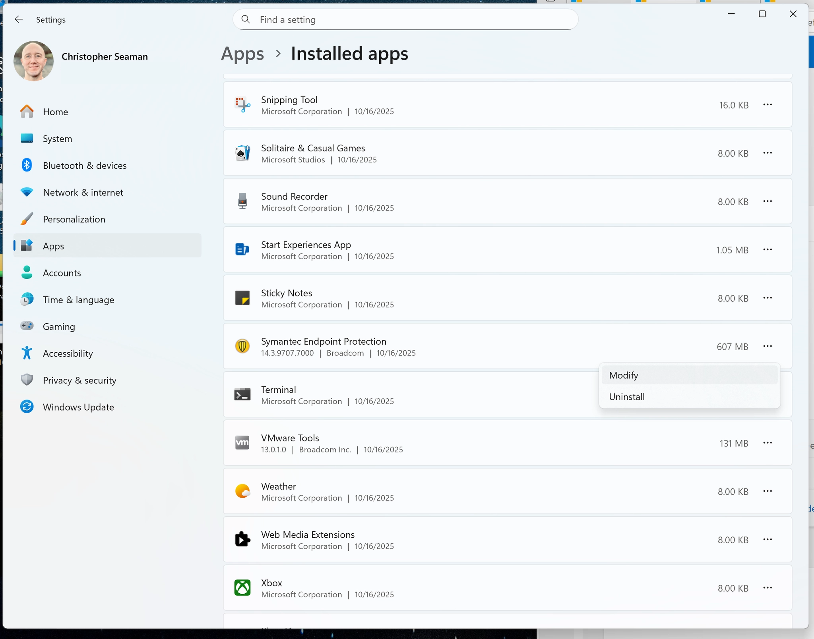
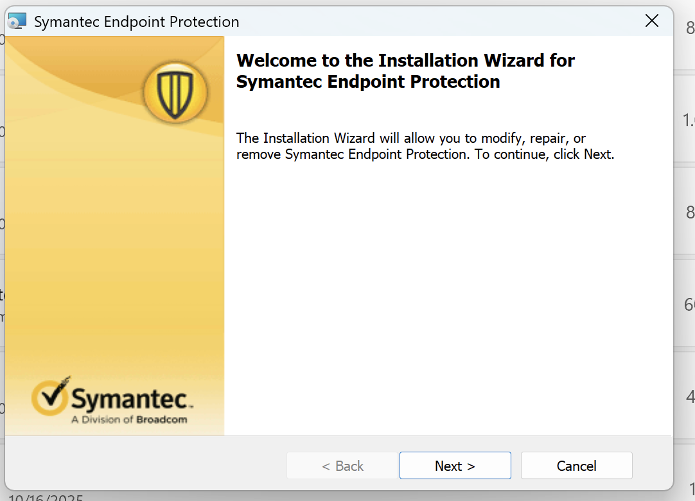
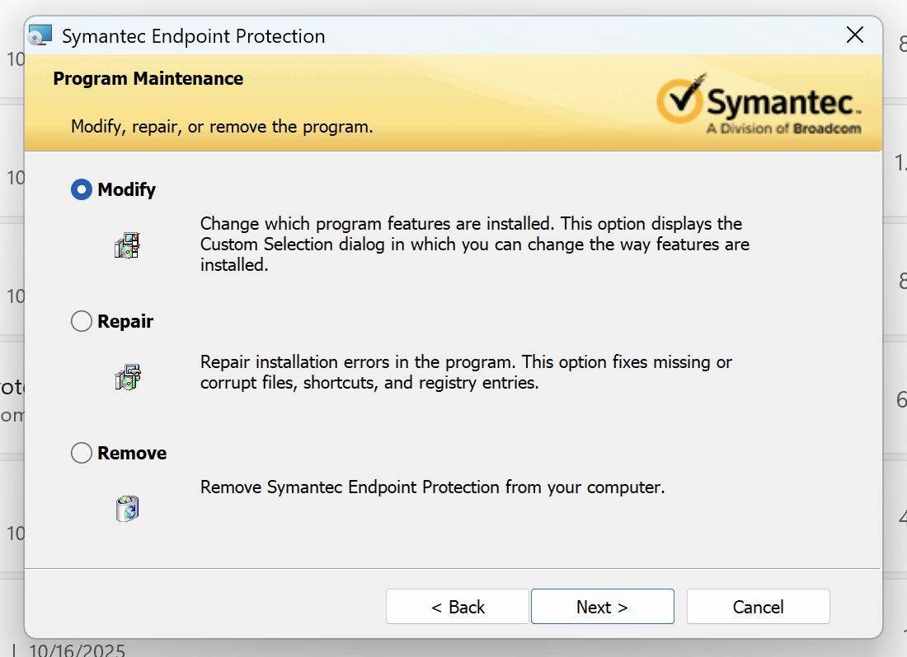
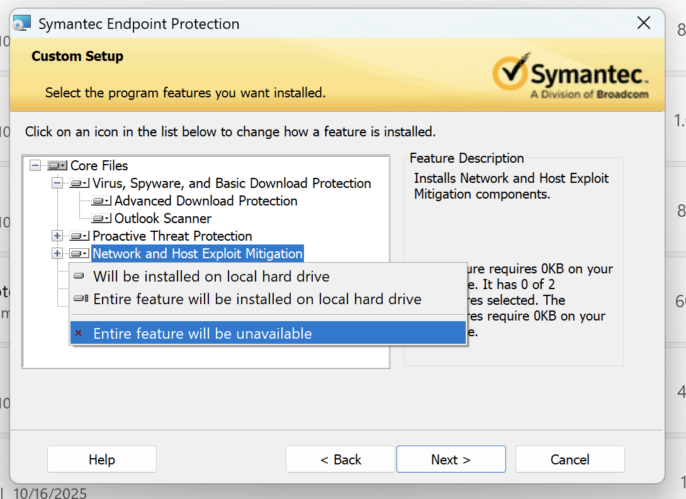
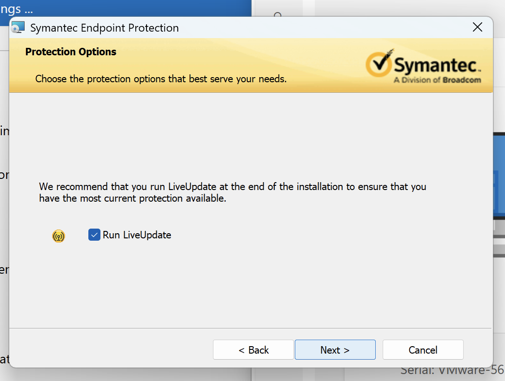

# WSL Troubleshooting

# No Internet in WSL

**Problem:** UCSF installs Symantec Endpoint protection which has a firewall that is incompatible with WSL

**Solution:** Change the firewall protection to use Windows Defender instead

Step-by-step from my disabling Symantec Endpoint’s firewall:

1. Open Add/Remove Programs
2. On Symantec Endpoint click “…” → Modify
3. Click Next → Modify and you should get to “Custom Setup”
4. Click the (tiny) hard drive icon next to “Network and Host Exploit Mitigation” and select “Entire Feature will be unavailable”
5. “Next” multiple times to complete the install process (I opted out of helping improve their software)
6. You may have to confirm that the installer should be allowed to continue
7. Restart
8. Once it has completed, open Start Menu → “Windows Defender Firewall” (not the one “with Advanced Security”) and confirm that the firewall is active

## Screenshots

